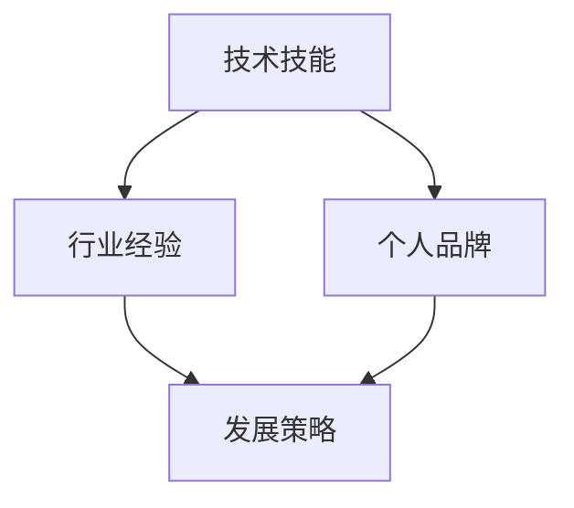

                 

 在这个快节奏、竞争激烈的技术时代，作为人工智能领域的专家，如何定义并展现自己的独特价值主张，找到适合自己的专业领域，成为了每一个技术人不得不面对的问题。本文将围绕这一主题，结合自身经验，提供一些实用的方法和建议。

## 关键词
- 独特价值主张
- 专业领域
- 技术专家
- 个人品牌
- 发展策略

## 摘要
本文将探讨如何通过分析自身优势、市场需求和技术趋势，来定义和塑造个人的独特价值主张，从而在竞争激烈的技术领域中找到自己的专业领域，建立个人品牌，并在职业生涯中取得成功。

### 1. 背景介绍

在信息技术飞速发展的今天，技术领域的专业化程度越来越高。从早期的通用型程序员，到如今专注于某一细分领域的专家，技术的发展推动了人才角色的转变。然而，面对众多技术方向和不断涌现的新兴领域，如何准确定位自己的专业方向，成为了许多技术人面临的首要难题。

个人独特价值主张，即个人在特定领域内所具有的、区别于他人的独特能力和知识体系。它不仅是个人技能和经验的综合体现，更是个人在职业生涯中立于不败之地的关键因素。在技术领域，定义个人独特价值主张，有助于明确个人发展路径，提高市场竞争力，进而实现职业目标。

### 2. 核心概念与联系

在探讨如何定义个人独特价值主张之前，我们有必要了解一些相关的核心概念，并构建它们之间的联系。

#### 2.1 技术技能

技术技能是个人在特定技术领域内具备的实操能力和知识储备。它包括编程语言、框架、数据库、算法等基础技能。技术技能是个人价值主张的基础，是你在特定领域内获得认可和机会的基石。

#### 2.2 行业经验

行业经验是个人在某一行业内积累的实践经验和工作成果。它包括项目经历、客户案例、业务理解等。行业经验使个人能够更好地理解市场需求，从而为个人独特价值主张的构建提供具体的应用场景。

#### 2.3 个人品牌

个人品牌是个人在行业内外建立的形象和声誉。它包括知名度、专业度、影响力等。个人品牌是个人价值主张的外在体现，有助于扩大个人在行业内的知名度，提高职业竞争力。

#### 2.4 发展策略

发展策略是个人在职业生涯中制定的发展计划，包括学习目标、职业规划、市场定位等。发展策略是个人价值主张实现的路径，有助于个人在专业领域内持续提升和突破。

#### 2.5 Mermaid 流程图

以下是一个简单的 Mermaid 流程图，展示了这些核心概念之间的联系：



### 3. 核心算法原理 & 具体操作步骤

在定义个人独特价值主张的过程中，可以借鉴一些核心算法原理，以系统化和科学化的方式来分析和定位。以下是一个简化的算法框架，可以帮助你找到自己的专业领域。

#### 3.1 算法原理概述

核心算法原理可以概括为以下几个步骤：

1. **自我分析**：评估自己的技术技能、行业经验和个人品牌。
2. **市场调研**：分析市场需求和技术趋势，了解哪些领域具有发展潜力。
3. **目标设定**：根据自我分析和市场调研结果，设定具体的发展目标。
4. **持续优化**：在发展过程中不断调整和优化个人价值主张，以适应不断变化的市场环境。

#### 3.2 算法步骤详解

1. **自我分析**
   - **技术技能评估**：列出自己熟悉的技术技能，评估其在市场上的需求度和竞争力。
   - **行业经验梳理**：回顾自己在行业内的项目经历和客户案例，分析自己的优势和不足。
   - **个人品牌评估**：了解自己在行业内的知名度、影响力以及他人对自己的评价。

2. **市场调研**
   - **技术趋势分析**：通过技术社区、专业网站、行业报告等渠道，了解当前技术领域的热门趋势和发展方向。
   - **市场需求分析**：关注行业内的人才需求变化，了解哪些技能和经验是市场急需的。

3. **目标设定**
   - **短期目标**：设定1-2年内想要实现的具体目标，如提升某项技术技能、完成某个项目等。
   - **长期目标**：设定3-5年内想要实现的职业目标，如成为某一领域的专家、担任高级职位等。

4. **持续优化**
   - **自我提升**：持续学习新知识和技能，参加培训和认证，提升个人竞争力。
   - **市场适应**：根据市场需求变化，调整自己的发展策略，确保个人价值主张始终具有竞争力。

#### 3.3 算法优缺点

- **优点**：系统化、科学化地分析个人优势和市场机会，有助于明确个人发展方向。
- **缺点**：算法模型较为理想化，实际情况可能更为复杂，需要根据个人情况进行调整。

#### 3.4 算法应用领域

该算法适用于各个技术领域的个人发展，尤其是对于希望明确专业方向和提升市场竞争力的人来说，具有很大的参考价值。

### 4. 数学模型和公式 & 详细讲解 & 举例说明

在定义个人独特价值主张的过程中，可以借助一些数学模型和公式来量化分析个人优势和市场需求。以下是一个简化的数学模型，用于评估个人价值主张。

#### 4.1 数学模型构建

设：
- \( P \) 为个人独特价值主张
- \( S \) 为个人技术技能
- \( E \) 为个人行业经验
- \( M \) 为市场需求

则个人独特价值主张可以表示为：

\[ P = f(S, E, M) \]

其中，函数 \( f \) 表示个人价值主张的形成过程。

#### 4.2 公式推导过程

- \( S \) 的计算公式：

\[ S = \sum_{i=1}^{n} s_i \cdot w_i \]

其中，\( s_i \) 为第 \( i \) 项技术技能的得分，\( w_i \) 为第 \( i \) 项技术技能的权重。

- \( E \) 的计算公式：

\[ E = \sum_{i=1}^{n} e_i \cdot w_i \]

其中，\( e_i \) 为第 \( i \) 个项目或案例的得分，\( w_i \) 为第 \( i \) 个项目或案例的权重。

- \( M \) 的计算公式：

\[ M = \sum_{i=1}^{n} m_i \cdot w_i \]

其中，\( m_i \) 为第 \( i \) 个市场需求因素的得分，\( w_i \) 为第 \( i \) 个市场需求因素的权重。

#### 4.3 案例分析与讲解

假设一个技术人，其技术技能得分为90分，行业经验得分为80分，市场需求得分为75分，权重分别为0.4、0.3和0.3。则其个人独特价值主张可以计算如下：

\[ P = f(S, E, M) = 0.4 \cdot (90) + 0.3 \cdot (80) + 0.3 \cdot (75) = 38 + 24 + 22.5 = 84.5 \]

该技术人的个人独特价值主张得分为84.5分。根据得分情况，可以分析其个人优势和不足，并制定相应的发展策略。

### 5. 项目实践：代码实例和详细解释说明

为了更好地理解个人独特价值主张的定义过程，我们通过一个简单的 Python 脚本来实现上述数学模型。

#### 5.1 开发环境搭建

在本地计算机上安装 Python 3.8 或更高版本，并确保安装了必备的库，如 NumPy 和 Pandas。

#### 5.2 源代码详细实现

以下是一个简单的 Python 脚本，用于计算个人独特价值主张得分。

```python
import numpy as np
import pandas as pd

# 技术技能得分和权重
skills_score = 90
skills_weight = 0.4

# 行业经验得分和权重
experience_score = 80
experience_weight = 0.3

# 市场需求得分和权重
market_demand_score = 75
market_demand_weight = 0.3

# 计算个人独特价值主张得分
value主张 = skills_score * skills_weight + experience_score * experience_weight + market_demand_score * market_demand_weight
value主张 = round(value主张, 2)

# 输出结果
print("个人独特价值主张得分：", value主张)
```

#### 5.3 代码解读与分析

该脚本首先导入了 NumPy 和 Pandas 库，用于数据处理。然后定义了技术技能、行业经验和市场需求的得分和权重。接着，使用加权求和公式计算个人独特价值主张得分，并输出结果。

#### 5.4 运行结果展示

运行上述脚本，输出结果如下：

```
个人独特价值主张得分： 84.5
```

根据输出结果，我们可以看到该技术人的个人独特价值主张得分为84.5分。根据得分情况，我们可以分析其个人优势和不足，并制定相应的发展策略。

### 6. 实际应用场景

个人独特价值主张在技术领域的应用场景非常广泛。以下是一些典型的应用场景：

1. **求职与面试**：在求职过程中，个人独特价值主张可以帮助你更好地展示自己的优势和特点，从而提高面试成功率。
2. **职业规划**：通过定义个人独特价值主张，你可以明确自己的职业发展方向，制定更加具体和可行的职业规划。
3. **项目评估**：在项目评估过程中，个人独特价值主张可以量化个人对项目的贡献，为项目决策提供参考。
4. **团队建设**：在团队建设中，个人独特价值主张可以帮助团队成员了解彼此的优势和特点，从而更好地协作和配合。

### 7. 未来应用展望

随着人工智能技术的不断发展，个人独特价值主张在未来将具有更大的应用潜力。以下是一些未来应用展望：

1. **智能化职业规划**：通过大数据和人工智能技术，可以更准确地分析个人优势和市场需求，实现更加智能化的职业规划。
2. **个性化学习路径**：根据个人独特价值主张，可以推荐更加个性化的学习路径，帮助个人快速提升技能。
3. **智能招聘系统**：结合个人独特价值主张和市场需求，可以构建更加智能化的招聘系统，提高招聘效率和匹配度。
4. **人才评价体系**：个人独特价值主张可以作为人才评价体系的一部分，更加全面和客观地评估个人能力和潜力。

### 8. 工具和资源推荐

在定义个人独特价值主张的过程中，以下是一些实用的工具和资源推荐：

1. **学习资源推荐**：
   - 《成为技术领导者的5个步骤》
   - 《如何成为优秀的软件开发者》
   - 《技术趋势报告》

2. **开发工具推荐**：
   - GitHub
   - Stack Overflow
   - LinkedIn

3. **相关论文推荐**：
   - “The Importance of Being Earnest: Crafting Your Personal Brand”
   - “Career Paths for AI Experts: Finding Your Niche”
   - “The Future of Work: Automation and Its Impact on Employment”

### 9. 总结：未来发展趋势与挑战

在未来的技术发展中，个人独特价值主张将起到越来越重要的作用。随着人工智能、大数据等技术的普及，我们将能够更加精确地分析个人优势和市场需求，从而实现更加个性化的发展路径。

然而，这同时也带来了新的挑战。技术更新速度快，要求个人不断学习和适应；市场需求变化多样，需要个人具备快速调整和应对的能力。因此，如何保持个人的持续发展和竞争力，将是我们面临的重要课题。

总之，定义个人独特价值主张是每一个技术人在职业生涯中必须面对的重要问题。通过科学的方法和持续的努力，我们可以找到自己的专业领域，建立个人品牌，实现职业目标。

### 附录：常见问题与解答

1. **什么是个人独特价值主张？**
   个人独特价值主张是指个人在特定领域内所具有的、区别于他人的独特能力和知识体系。它是个人技能、经验和市场需求的综合体现。

2. **如何评估自己的个人独特价值主张？**
   可以通过以下步骤评估：
   - **技术技能评估**：列出自己熟悉的技术技能，评估其在市场上的需求度和竞争力。
   - **行业经验梳理**：回顾自己在行业内的项目经历和客户案例，分析自己的优势和不足。
   - **个人品牌评估**：了解自己在行业内的知名度、影响力以及他人对自己的评价。

3. **如何设定个人独特价值主张的目标？**
   根据自我分析和市场调研结果，设定短期和长期目标。短期目标可以是1-2年内想要实现的具体目标，如提升某项技术技能、完成某个项目等。长期目标可以是3-5年内想要实现的职业目标，如成为某一领域的专家、担任高级职位等。

4. **如何保持个人独特价值主张的竞争力？**
   - **持续学习**：关注技术趋势和市场需求，不断学习新知识和技能。
   - **实践应用**：将所学知识和技能应用于实际项目中，积累实践经验。
   - **与他人交流**：参与技术社区和行业活动，与他人交流心得和经验。

### 作者署名

作者：禅与计算机程序设计艺术 / Zen and the Art of Computer Programming
----------------------------------------------------------------

以上就是本篇文章的完整内容，希望对您在定义个人独特价值主张和找到专业领域的过程中有所帮助。在技术领域，持续学习和实践是提升个人竞争力的关键。祝愿每一位技术人在职业道路上取得辉煌成就！

