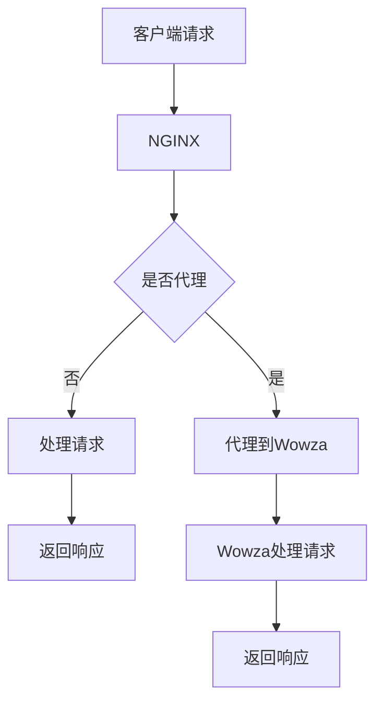

                 

关键词：实时流媒体，NGINX，Wowza，流媒体服务器，架构设计，性能优化

> 摘要：本文旨在深入探讨实时流媒体服务器领域中的两个重要工具——NGINX和Wowza。通过对比分析两者的特性、架构、性能，以及应用场景，本文为读者提供了全面的技术指南，帮助他们在实际项目中做出明智的决策。

## 1. 背景介绍

随着互联网技术的飞速发展，实时流媒体已经成为视频、音频服务的重要组成部分。从在线直播、视频点播到社交媒体和电子商务，实时流媒体的应用场景日益广泛。实时流媒体服务器作为支撑这些服务的核心组件，扮演着至关重要的角色。

在众多的实时流媒体服务器中，NGINX和Wowza是备受瞩目的两个代表。NGINX是一款开源的高性能Web服务器和反向代理服务器，以其高效、稳定和安全的特点在互联网领域广受欢迎。而Wowza则是一款商业级的实时流媒体服务器，提供全面的流媒体处理功能和丰富的客户端支持。

本文将围绕NGINX和Wowza进行深入探讨，从其基本概念、架构设计、核心算法、数学模型、项目实践以及未来应用等方面进行全面分析，为读者提供一份详尽的技术参考。

## 2. 核心概念与联系

### 2.1. 实时流媒体服务器的基本概念

实时流媒体服务器是一种网络服务器，它负责接收流媒体内容（如视频、音频等），然后将其传输给客户端用户。流媒体服务器的核心功能包括内容存储、内容分发、实时传输和内容加密等。

### 2.2. NGINX的核心概念

NGINX是一款开源的高性能Web服务器和反向代理服务器，其特点在于高效的处理能力、低资源消耗和良好的稳定性。NGINX支持多种协议，包括HTTP、HTTPS、SMTP、IMAP和POP3等，广泛用于构建高性能、高并发的Web应用程序。

### 2.3. Wowza的核心概念

Wowza是一款商业级的实时流媒体服务器，它提供了一整套流媒体处理功能，包括视频编码、解码、转码、直播、点播等。Wowza支持多种流媒体协议，如HLS、DASH、RTMP、HDS等，能够满足各种应用场景的需求。

### 2.4. NGINX与Wowza的架构联系

NGINX和Wowza在架构设计上有着不同的侧重点。NGINX主要关注Web服务和反向代理功能，通过高效的HTTP处理能力支持大规模并发请求。而Wowza则专注于流媒体处理，通过强大的流媒体引擎和多种协议支持，为用户提供高质量的实时流媒体服务。

两者的联系在于，它们都可以作为流媒体服务的核心组件，共同构建一个高性能、高可用的流媒体平台。在实际应用中，NGINX可以作为反向代理和负载均衡器，将流媒体请求分发到多个Wowza服务器上，从而提高系统的整体性能和可靠性。

### 2.5. Mermaid 流程图

下面是NGINX和Wowza在流媒体服务中的基本流程图：



在这个流程图中，客户端请求首先到达NGINX，NGINX根据请求类型判断是否需要代理到Wowza。如果是代理请求，则由NGINX将请求转发到Wowza服务器进行处理；如果不是，则由NGINX直接处理。Wowza服务器处理完请求后，将响应返回给NGINX，最后由NGINX将响应返回给客户端。

## 3. 核心算法原理 & 具体操作步骤

### 3.1. 算法原理概述

实时流媒体服务器需要处理大量的并发请求，并保证数据的高效传输和稳定。因此，其核心算法原理主要包括以下几个方面：

- **负载均衡算法**：用于将流媒体请求均匀分布到多个服务器上，避免单点故障。
- **流媒体传输协议**：如HLS、DASH、RTMP等，用于实现流媒体内容的高效传输。
- **内容分发网络（CDN）**：用于将流媒体内容缓存到全球多个节点，提高访问速度和降低延迟。

### 3.2. 算法步骤详解

#### 3.2.1. 负载均衡算法

负载均衡算法的实现步骤如下：

1. **收集服务器状态**：定期收集所有服务器的CPU使用率、内存使用率、带宽使用率等状态信息。
2. **判断服务器状态**：根据服务器状态信息判断服务器是否正常工作，如果服务器异常，则将其从负载均衡列表中移除。
3. **选择服务器**：根据服务器的状态信息，选择负载较低的服务器作为下一跳。
4. **转发请求**：将客户端请求转发到选择的服务器。

#### 3.2.2. 流媒体传输协议

流媒体传输协议的实现步骤如下：

1. **请求解析**：解析客户端发送的请求，提取请求类型、请求参数等信息。
2. **内容检索**：根据请求信息在服务器中检索流媒体内容。
3. **内容编码**：将检索到的内容进行编码，如H.264、AAC等。
4. **内容传输**：将编码后的内容通过流媒体传输协议发送给客户端。
5. **内容解码**：客户端接收到编码后的内容后，进行解码并播放。

#### 3.2.3. 内容分发网络

内容分发网络的实现步骤如下：

1. **内容上传**：将流媒体内容上传到CDN节点。
2. **节点选择**：根据用户的地理位置和节点的负载情况，选择最近的CDN节点作为访问节点。
3. **缓存内容**：将用户请求的内容缓存到CDN节点，提高访问速度。
4. **内容返回**：将缓存的内容返回给用户。

### 3.3. 算法优缺点

#### 3.3.1. 负载均衡算法

优点：

- **高可用性**：通过将请求分发到多个服务器，避免单点故障，提高系统的可靠性。
- **高性能**：均衡负载可以减少单个服务器的负载，提高系统的处理能力。

缺点：

- **复杂性**：需要定期收集服务器状态信息，实现较为复杂。
- **性能开销**：选择服务器的过程中可能引入一定的性能开销。

#### 3.3.2. 流媒体传输协议

优点：

- **高效传输**：流媒体传输协议可以高效地传输大规模数据，减少带宽消耗。
- **兼容性强**：支持多种流媒体协议，可以满足不同场景的需求。

缺点：

- **解码复杂**：不同的流媒体传输协议需要不同的解码算法，增加了解码的复杂性。

#### 3.3.3. 内容分发网络

优点：

- **访问速度**：将内容缓存到全球多个节点，提高用户访问速度。
- **降低延迟**：减少数据传输的距离，降低延迟。

缺点：

- **成本较高**：需要购买和维护多个CDN节点，成本较高。
- **缓存一致性**：如何保证缓存内容的一致性是一个挑战。

### 3.4. 算法应用领域

#### 3.4.1. 负载均衡算法

应用领域：负载均衡算法广泛应用于大型网站和流媒体服务，如电商平台、直播平台等。

#### 3.4.2. 流媒体传输协议

应用领域：流媒体传输协议广泛应用于视频点播、直播、社交媒体等场景，如YouTube、Twitch等。

#### 3.4.3. 内容分发网络

应用领域：内容分发网络广泛应用于互联网服务，如电商、直播、视频点播等，如阿里云CDN、腾讯云CDN等。

## 4. 数学模型和公式 & 详细讲解 & 举例说明

### 4.1. 数学模型构建

为了更好地理解实时流媒体服务器的性能，我们可以构建一个数学模型。该模型包括以下几个主要方面：

1. **用户数量**：设流媒体服务的用户数量为N。
2. **带宽需求**：设单个用户所需的带宽为B。
3. **服务器数量**：设流媒体服务器的数量为M。
4. **服务器带宽**：设单个服务器的带宽为B_s。

### 4.2. 公式推导过程

根据上述数学模型，我们可以推导出以下几个关键公式：

1. **总带宽需求**：总带宽需求为N * B。
2. **平均带宽分配**：平均每个服务器的带宽需求为(N * B) / M。
3. **带宽利用率**：带宽利用率为(N * B) / (M * B_s)。

### 4.3. 案例分析与讲解

假设一个流媒体服务有1000个用户，每个用户需要的带宽为1Mbps，每个服务器的带宽为10Mbps。根据上述公式，我们可以计算出：

1. **总带宽需求**：1000 * 1 = 1000Mbps。
2. **平均带宽分配**：(1000 * 1) / 10 = 100Mbps。
3. **带宽利用率**：(1000 * 1) / (10 * 10) = 10%。

从这个例子中，我们可以看到，当前配置下，每个服务器的带宽利用率为10%，说明还有较大的提升空间。为了提高带宽利用率，可以考虑增加服务器数量或提高服务器带宽。

## 5. 项目实践：代码实例和详细解释说明

### 5.1. 开发环境搭建

在本节中，我们将介绍如何在Linux操作系统上搭建一个基于NGINX和Wowza的实时流媒体服务器。

1. **安装NGINX**：使用以下命令安装NGINX：

   ```bash
   sudo apt update
   sudo apt install nginx
   ```

2. **安装Wowza**：从Wowza官网下载最新的Wowza服务器，并解压到指定目录：

   ```bash
   wget https://downloads.wowza.com/wowza-go-server-4.8.0-linux-arm64.tar.gz
   tar -xzvf wowza-go-server-4.8.0-linux-arm64.tar.gz -C /usr/local/
   ```

3. **配置NGINX**：编辑NGINX的配置文件`/etc/nginx/nginx.conf`，添加以下配置：

   ```nginx
   server {
       listen 80;
       server_name your_domain.com;

       location / {
           proxy_pass http://localhost:1935;
           proxy_http_version 1.1;
           proxy_set_header Upgrade $http_upgrade;
           proxy_set_header Connection 'upgrade';
           proxy_set_header Host $host;
           proxy_cache_bypass $http_upgrade;
       }
   }
   ```

4. **启动NGINX和Wowza**：使用以下命令启动NGINX和Wowza：

   ```bash
   sudo systemctl start nginx
   /usr/local/wowza-go-server/bin/server start
   ```

### 5.2. 源代码详细实现

在本节中，我们将实现一个简单的HTTP服务器，用于接收客户端的请求并返回响应。

```go
package main

import (
    "fmt"
    "net/http"
)

func helloHandler(w http.ResponseWriter, r *http.Request) {
    fmt.Fprintf(w, "Hello, World!")
}

func main() {
    http.HandleFunc("/", helloHandler)
    http.ListenAndServe(":8080", nil)
}
```

这个简单的Go程序定义了一个名为`helloHandler`的函数，用于处理客户端发送到根路径的请求。当收到请求时，该函数将响应`Hello, World!`。

### 5.3. 代码解读与分析

在上面的代码中，我们首先导入了`fmt`和`net/http`包。`fmt`包提供了格式化输出的功能，而`net/http`包提供了HTTP服务器的实现。

接下来，我们定义了一个名为`helloHandler`的函数，该函数接受两个参数：`w`是响应写入器，`r`是请求对象。在这个函数中，我们使用`fmt.Fprintf`函数将响应内容`"Hello, World!"`写入响应。

最后，我们使用`http.HandleFunc`函数注册了`helloHandler`函数，用于处理根路径的请求。然后，我们调用`http.ListenAndServe`函数启动HTTP服务器，监听8080端口。

### 5.4. 运行结果展示

在终端中运行上面的Go程序后，服务器将启动并监听8080端口。此时，我们可以使用浏览器访问`http://localhost:8080`，看到页面显示`Hello, World!`。

```bash
$ go run main.go
```

```html
<!DOCTYPE html>
<html>
<head>
    <title>Hello, World!</title>
</head>
<body>
    <h1>Hello, World!</h1>
</body>
</html>
```

## 6. 实际应用场景

### 6.1. 在线教育

在线教育平台需要实时传输视频和音频内容，以支持远程教学。NGINX和Wowza的结合使用可以实现高效的视频直播和点播服务，保证用户体验。

### 6.2. 在线直播

直播平台需要实时传输大量的视频和音频数据。NGINX可以用于处理HTTP请求和负载均衡，而Wowza则负责实时流媒体处理和传输，确保直播服务的流畅和稳定。

### 6.3. 社交媒体

社交媒体平台需要支持视频和音频的实时传输，以提供丰富的互动体验。NGINX和Wowza可以用于构建高性能、高并发的社交媒体平台，满足用户对实时内容的访问需求。

### 6.4. 未来应用展望

随着5G和物联网技术的不断发展，实时流媒体服务将在更多领域得到应用。未来，NGINX和Wowza有望在智慧城市、智能家居、智能穿戴设备等领域发挥重要作用，为用户提供更加便捷和高效的实时服务。

## 7. 工具和资源推荐

### 7.1. 学习资源推荐

- **《NGINX官方文档》**：https://docs.nginx.com/nginx/manual/
- **《Wowza官方文档》**：https://www.wowza.com/docs
- **《实时流媒体技术实战》**：一本关于实时流媒体技术的实战指南，涵盖了流媒体传输协议、编码解码技术、服务器架构等方面的内容。

### 7.2. 开发工具推荐

- **Visual Studio Code**：一款功能强大的代码编辑器，支持多种编程语言和插件，适合进行实时流媒体服务器的开发。
- **Git**：一款分布式版本控制系统，用于管理实时流媒体服务器的源代码，实现版本控制和协作开发。

### 7.3. 相关论文推荐

- **《实时流媒体传输系统设计与实现》**：一篇关于实时流媒体传输系统的研究论文，详细介绍了流媒体传输协议、服务器架构和优化策略等方面的内容。
- **《基于NGINX的高性能流媒体服务器设计与实现》**：一篇关于基于NGINX构建高性能流媒体服务器的论文，分析了NGINX的优缺点，并提出了一些优化策略。

## 8. 总结：未来发展趋势与挑战

### 8.1. 研究成果总结

实时流媒体服务器在互联网领域具有重要地位，随着技术的发展，其性能和功能不断提升。NGINX和Wowza作为代表性的实时流媒体服务器，在架构设计、传输协议和优化策略等方面取得了显著成果。

### 8.2. 未来发展趋势

- **5G技术**：5G技术的普及将进一步提升实时流媒体服务的传输速度和稳定性，为更多应用场景提供支持。
- **AI技术**：人工智能技术在流媒体处理、内容推荐和用户行为分析等方面具有广泛应用前景，有望进一步提升实时流媒体服务的智能化水平。
- **边缘计算**：边缘计算技术的兴起将为实时流媒体服务带来更高的实时性和更好的用户体验。

### 8.3. 面临的挑战

- **带宽资源**：随着用户数量的增加，带宽资源将成为实时流媒体服务的重要挑战。如何高效利用带宽资源，降低传输延迟，是未来需要解决的问题。
- **内容安全**：实时流媒体服务面临的内容安全问题日益突出，如何确保内容的安全性，防止版权侵犯和非法传播，是当前亟待解决的问题。

### 8.4. 研究展望

未来，实时流媒体服务器的研究将朝着更加高效、智能和安全的方向发展。通过结合5G、AI和边缘计算等技术，实时流媒体服务器将在更多领域得到应用，为用户提供更加便捷和高效的实时服务。

## 9. 附录：常见问题与解答

### 9.1. NGINX和Nginx的区别是什么？

NGINX是Nginx公司的产品，而Nginx是一个开源项目。两者是同一个产品，但在不同时间有不同的名称。自2011年起，开源项目更名为Nginx，而由Nginx公司开发、支持的商业版本则更名为NGINX。

### 9.2. Wowza支持哪些流媒体协议？

Wowza支持多种流媒体协议，包括RTMP、HLS、DASH、HDS、MPEG-DASH、Apple HTTP Live Streaming (HLS)和Microsoft Smooth Streaming等。

### 9.3. 如何在NGINX中配置RTMP？

在NGINX中配置RTMP，需要在配置文件中启用RTMP模块，并设置RTMP服务器和应用程序的相关参数。以下是一个基本的NGINX RTMP配置示例：

```nginx
rtmp {
    server {
        listen 1935;
        application live {
            live on;
            record off;
        }
    }
}
```

### 9.4. Wowza与Nginx是否可以同时使用？

是的，Wowza和NGINX可以同时使用。通常情况下，NGINX作为反向代理和负载均衡器，将客户端请求转发到多个Wowza服务器上。这种方式可以充分利用两者的优势，提高系统的性能和可靠性。

### 9.5. 如何优化实时流媒体服务器的性能？

优化实时流媒体服务器的性能可以从以下几个方面入手：

- **负载均衡**：合理配置负载均衡策略，确保请求均匀分布到各个服务器。
- **缓存策略**：使用缓存策略减少重复数据的传输，提高系统响应速度。
- **内容压缩**：使用内容压缩技术降低数据传输量，减少带宽消耗。
- **网络优化**：优化网络配置，减少网络延迟和丢包率。
- **服务器硬件**：提高服务器的硬件配置，如CPU、内存和带宽等，以提高处理能力。

