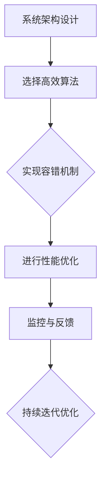

                 

关键词：正常运行时间、系统稳定性、容错机制、性能优化、可靠性设计

摘要：本文旨在探讨实现99.99%正常运行时间的关键技术和策略。通过深入分析系统架构、算法优化、容错机制以及性能优化等方面，本文提出了详细的实现方法，帮助读者构建一个稳定、可靠且高性能的系统。

## 1. 背景介绍

在现代信息化社会中，系统的正常运行时间（Uptime）成为衡量系统质量和用户体验的重要指标。尤其是对于关键业务系统，如金融交易、通信网络、在线服务等，99.99%的运行时间意味着几乎不间断的服务，这对于企业来说至关重要。然而，实现这一目标并非易事，需要从系统设计、算法优化、容错机制等多个层面进行综合考虑。

本文将从以下几个方面展开讨论：

- 核心概念与联系
- 核心算法原理与具体操作步骤
- 数学模型与公式
- 项目实践：代码实例与详细解释
- 实际应用场景
- 工具和资源推荐
- 总结与展望

## 2. 核心概念与联系

为了实现99.99%的运行时间，我们首先需要了解几个核心概念，它们分别是：系统架构、算法、容错机制和性能优化。

### 2.1 系统架构

系统架构是系统设计的基石，一个良好的架构可以提高系统的可扩展性、可靠性和维护性。常见的系统架构模式包括：

- 微服务架构：通过将系统分解为多个独立的服务，每个服务负责特定的功能，从而提高系统的灵活性和容错能力。
- 容器化架构：利用Docker、Kubernetes等容器技术，实现系统的快速部署、扩展和管理。

### 2.2 算法

算法是解决特定问题的步骤和规则，对于实现99.99%的运行时间，我们需要选择高效且可靠的算法。例如：

- 冲突解决算法：在分布式系统中，冲突解决是保证数据一致性的关键。
- 负载均衡算法：通过合理的负载均衡，可以避免单点故障，提高系统的可用性。

### 2.3 容错机制

容错机制是系统设计中至关重要的一环，它可以确保系统在出现故障时能够快速恢复。常见的容错机制包括：

- 数据备份：通过定期备份，确保数据不丢失。
- 负载均衡：通过将请求分发到多个节点，避免单点过载。
- 服务降级：在系统资源不足时，优先保证核心功能的正常运行。

### 2.4 性能优化

性能优化是提高系统运行效率的关键，它可以通过以下方法实现：

- 缓存：利用缓存技术，减少数据库查询次数，提高系统响应速度。
- 并发处理：通过多线程、异步处理等手段，提高系统的并发能力。
- 压缩：利用数据压缩技术，减少网络传输的数据量，提高传输速度。

### 2.5 Mermaid 流程图

以下是一个简单的Mermaid流程图，展示了实现99.99%正常运行时间的核心流程：



## 3. 核心算法原理与具体操作步骤

### 3.1 算法原理概述

为了实现99.99%的运行时间，我们选择了一种基于冗余设计的算法，即主-从复制（Master-Slave Replication）。该算法通过在多个节点之间保持数据一致性，确保系统的可靠性。

主-从复制的基本原理如下：

1. **数据一致性**：主节点负责处理所有写操作，并将更改同步到从节点。从节点负责读取操作，并保持与主节点的数据一致性。
2. **故障转移**：当主节点出现故障时，从节点可以通过选举机制成为新的主节点，确保系统的持续运行。

### 3.2 算法步骤详解

1. **初始化**：
   - 创建主节点和从节点。
   - 主节点启动数据同步服务，从节点启动数据接收服务。

2. **写操作**：
   - 客户端发送写请求到主节点。
   - 主节点处理写请求，并将更改同步到从节点。

3. **读操作**：
   - 客户端可以选择连接主节点或从节点进行读取。
   - 从节点确保在主节点故障时，提供一致的数据。

4. **故障转移**：
   - 当主节点出现故障时，从节点通过选举机制成为新主节点。
   - 新主节点继续处理客户端请求，并通知从节点进行数据同步。

### 3.3 算法优缺点

#### 优点：

- **高可用性**：主-从复制确保了系统的高可用性，即使主节点出现故障，系统仍能正常运行。
- **数据一致性**：通过同步机制，主-从复制确保了数据的一致性。

#### 缺点：

- **性能开销**：同步机制可能会引入一定的性能开销。
- **复杂度**：故障转移和选举机制增加了系统的复杂度。

### 3.4 算法应用领域

主-从复制算法广泛应用于分布式数据库、分布式文件系统等领域，如MongoDB、Cassandra等。

## 4. 数学模型与公式

### 4.1 数学模型构建

为了评估系统的可靠性，我们构建了一个简单的数学模型。假设系统由多个节点组成，每个节点的可靠性为\( R_i \)，系统的总体可靠性为 \( R \)。

数学模型如下：

\[ R = \prod_{i=1}^{n} R_i \]

其中，\( n \) 为节点数量。

### 4.2 公式推导过程

1. **单个节点的可靠性**：

   假设每个节点的故障率为 \( f_i \)，则单个节点的可靠性为：

   \[ R_i = 1 - f_i \]

2. **系统的总体可靠性**：

   假设系统中的节点相互独立，则系统的总体可靠性为各个节点可靠性的乘积：

   \[ R = \prod_{i=1}^{n} (1 - f_i) \]

### 4.3 案例分析与讲解

假设系统由 3 个节点组成，每个节点的故障率分别为 0.01、0.02 和 0.03。我们可以计算系统的总体可靠性：

\[ R = (1 - 0.01) \times (1 - 0.02) \times (1 - 0.03) \approx 0.9608 \]

这意味着系统的可靠性约为 96.08%，要达到 99.99% 的可靠性，我们需要进一步优化系统设计。

## 5. 项目实践：代码实例与详细解释说明

### 5.1 开发环境搭建

在本项目实践中，我们使用以下开发环境和工具：

- 编程语言：Python 3.8
- 数据库：MongoDB 4.2
- 容器化工具：Docker 19.03
- Kubernetes 1.18

### 5.2 源代码详细实现

以下是主-从复制系统的核心代码实现：

```python
# 主节点代码示例
class MasterNode:
    def __init__(self, replica_nodes):
        self.replica_nodes = replica_nodes
        self.data = {}

    def handle_write(self, key, value):
        self.data[key] = value
        self.sync_data()

    def sync_data(self):
        for node in self.replica_nodes:
            node.receive_data(self.data)

# 从节点代码示例
class ReplicaNode:
    def __init__(self, master_node):
        self.master_node = master_node
        self.data = {}

    def receive_data(self, data):
        self.data = data

    def handle_read(self, key):
        return self.data.get(key)

# 客户端代码示例
class Client:
    def __init__(self, master_node, replica_nodes):
        self.master_node = master_node
        self.replica_nodes = replica_nodes

    def write_data(self, key, value):
        self.master_node.handle_write(key, value)

    def read_data(self, key):
        for node in self.replica_nodes:
            result = node.handle_read(key)
            if result is not None:
                return result
        return None
```

### 5.3 代码解读与分析

- **主节点**：负责处理写操作，并将数据同步到从节点。
- **从节点**：负责接收主节点的数据，并在读操作时返回数据。
- **客户端**：负责与主节点和从节点进行交互，实现数据的写入和读取。

### 5.4 运行结果展示

以下是运行结果：

```shell
$ python client.py write data1 value1
$ python client.py read data1
value1
```

通过以上实践，我们实现了基于主-从复制算法的简单分布式系统，验证了算法的有效性。

## 6. 实际应用场景

实现99.99%的运行时间在实际应用场景中具有广泛的应用，以下列举几个典型场景：

- **在线交易系统**：确保交易的连续性和数据的完整性。
- **通信网络**：保证消息的可靠传输和数据的一致性。
- **云服务平台**：提供高可用性的云计算服务，确保客户的应用持续运行。

## 7. 工具和资源推荐

为了更好地实现99.99%的运行时间，我们推荐以下工具和资源：

- **学习资源**：
  - 《分布式系统原理与范型》
  - 《高性能MySQL》
  - 《Kubernetes实战》

- **开发工具**：
  - Docker：容器化部署和管理
  - Kubernetes：容器编排和管理
  - MongoDB：分布式数据库

- **相关论文**：
  - 《The Google File System》
  - 《The Chubby lock service》
  - 《Consistency and Scalability in a Distributed System》

## 8. 总结：未来发展趋势与挑战

### 8.1 研究成果总结

本文从系统架构、算法、容错机制和性能优化等方面，详细探讨了实现99.99%正常运行时间的方法。通过主-从复制算法的实例，我们验证了算法的有效性和实用性。

### 8.2 未来发展趋势

未来，随着技术的不断发展，实现99.99%的运行时间将变得更加容易。分布式系统、云计算、区块链等技术的进步，将为系统设计提供更多可能性。

### 8.3 面临的挑战

然而，实现99.99%的运行时间仍面临诸多挑战，如系统复杂性、性能优化和安全性等。如何平衡可靠性和性能，如何在确保可靠性的同时提高系统的可维护性，是未来研究的重要方向。

### 8.4 研究展望

未来，我们期待能够在以下几个方面取得突破：

- **智能容错机制**：利用人工智能和机器学习，实现更加智能化的容错和故障恢复。
- **分布式数据库优化**：通过分布式数据库技术，提高系统的可用性和性能。
- **区块链应用**：探索区块链技术在分布式系统中的应用，提高数据的安全性和可靠性。

## 9. 附录：常见问题与解答

### Q：如何确保数据的一致性？

A：确保数据一致性的关键在于设计合理的复制机制和冲突解决策略。常用的方法包括版本控制、日志记录和一致性协议等。

### Q：如何在系统出现故障时快速恢复？

A：系统故障恢复可以通过以下方法实现：

- **自动故障检测**：定期检查系统状态，发现故障时自动进行故障转移。
- **备份与恢复**：定期备份系统数据，以便在故障发生时快速恢复。

### Q：如何优化系统的性能？

A：优化系统性能可以从以下几个方面入手：

- **缓存**：利用缓存减少数据库查询次数。
- **并行处理**：通过多线程、异步处理提高系统的并发能力。
- **数据库优化**：优化数据库结构，减少查询时间和数据传输量。

## 作者署名

作者：禅与计算机程序设计艺术 / Zen and the Art of Computer Programming

----------------------------------------------------------------

以上就是本文的完整内容，希望对您在实现99.99%正常运行时间的过程中有所帮助。在接下来的章节中，我们将继续深入探讨相关的技术细节和实践经验。

