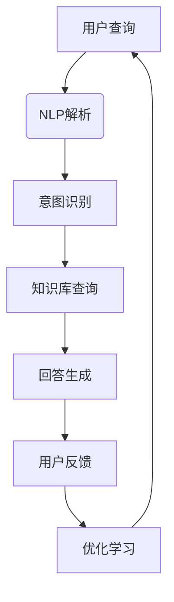

                 

关键词：客服机器人，电商服务质量，人工智能，自然语言处理，用户满意度，客户体验，数据驱动优化

>摘要：随着电商行业的飞速发展，客服服务质量成为影响用户购买体验和品牌忠诚度的重要因素。本文将探讨客服机器人在电商行业中的应用，如何通过人工智能和自然语言处理技术提升电商服务质量，并提出未来发展的挑战和机遇。

## 1. 背景介绍

### 1.1 电商行业的现状

电商行业的迅速崛起改变了人们的购物方式，线上购物已经成为日常生活中不可或缺的一部分。据统计，全球电商市场规模已经突破数万亿美元，并且依然保持着较高的增长率。然而，随着市场竞争的加剧，电商平台不仅需要在商品质量、价格、物流等方面具备竞争力，还需要在客服服务质量上不断创新，以提升用户满意度和忠诚度。

### 1.2 客服在电商中的重要性

客服是电商平台与用户之间沟通的桥梁，客服服务质量直接影响用户购买决策和后续的消费行为。高质量的客服服务可以提升用户满意度，增加用户粘性，从而提高电商平台的销售额和品牌影响力。然而，随着用户量的激增和客服需求的增长，传统的人工客服模式面临着巨大的挑战。

### 1.3 客服机器人的兴起

随着人工智能技术的快速发展，客服机器人逐渐成为电商平台提升客服服务质量的新工具。客服机器人利用自然语言处理技术，可以自动化处理大量的用户咨询，提供24小时不间断的服务，提高客服效率和用户满意度。同时，客服机器人还可以通过数据分析和用户行为预测，为电商平台提供有针对性的客服策略和建议。

## 2. 核心概念与联系

### 2.1 人工智能（AI）在客服中的应用

人工智能是客服机器人技术的基础，通过深度学习、机器学习等技术，客服机器人可以模拟人类的思维和行为，与用户进行自然语言交互。在电商客服中，AI可以帮助客服机器人理解用户的查询意图，提供准确的回答和解决方案。

### 2.2 自然语言处理（NLP）技术

自然语言处理是人工智能的一个重要分支，旨在让计算机理解和处理人类语言。在客服机器人中，NLP技术用于解析用户输入，提取关键词和语义信息，生成合适的回答。NLP技术包括词性标注、实体识别、情感分析等，这些技术共同构成了客服机器人的语言理解能力。

### 2.3 数据分析与用户行为预测

通过收集和分析用户数据，客服机器人可以了解用户的行为习惯和需求，从而提供更加个性化的服务。数据分析技术可以帮助客服机器人识别用户偏好，预测用户需求，提前准备相应的回答和解决方案。

### 2.4 Mermaid 流程图

以下是一个简化的客服机器人架构流程图：



## 3. 核心算法原理 & 具体操作步骤

### 3.1 算法原理概述

客服机器人的核心算法主要涉及自然语言处理（NLP）和机器学习（ML）技术。NLP负责理解用户的查询和生成回答，ML则用于从历史数据中学习，提高回答的准确性和个性化程度。

### 3.2 算法步骤详解

1. **NLP解析**：客服机器人首先使用NLP技术对用户查询进行解析，提取关键词、实体和语义信息。
2. **意图识别**：基于提取的语义信息，客服机器人通过机器学习模型识别用户的查询意图。
3. **知识库查询**：根据识别的意图，客服机器人从知识库中检索相关的信息，生成初步的回答。
4. **回答生成**：通过自然语言生成技术，将检索到的信息转换为自然流畅的回答。
5. **用户反馈**：客服机器人将回答展示给用户，并收集用户反馈，用于后续的优化。
6. **优化学习**：根据用户反馈，客服机器人通过机器学习模型不断优化自身的回答能力。

### 3.3 算法优缺点

**优点**：
- **高效性**：客服机器人可以同时处理大量用户的查询，提高客服效率。
- **一致性**：客服机器人提供统一标准的回答，减少因人工客服个体差异导致的回答不一致问题。
- **可扩展性**：通过不断学习和优化，客服机器人的能力可以不断提高，适应更复杂的客服场景。

**缺点**：
- **理解能力有限**：客服机器人目前的理解能力仍然有限，对于复杂的查询和情境理解不够准确。
- **个性化不足**：客服机器人难以像人类客服那样提供高度个性化的服务。

### 3.4 算法应用领域

客服机器人广泛应用于电商、金融、旅游、医疗等多个行业，以下是一些具体应用领域：

- **电商客服**：提供购物咨询、订单查询、售后服务等。
- **金融客服**：提供理财咨询、账户查询、交易咨询等。
- **旅游客服**：提供行程咨询、酒店预订、景点推荐等。
- **医疗客服**：提供健康咨询、就诊指南、药品信息等。

## 4. 数学模型和公式 & 详细讲解 & 举例说明

### 4.1 数学模型构建

客服机器人的核心算法涉及多个数学模型，包括自然语言处理（NLP）模型、意图识别（Intent Recognition）模型和回答生成（Response Generation）模型。以下是一个简化的数学模型构建过程：

1. **NLP模型**：使用词向量（Word Vector）表示文本，如Word2Vec、GloVe等。
2. **意图识别模型**：使用分类模型，如支持向量机（SVM）、随机森林（Random Forest）等。
3. **回答生成模型**：使用生成模型，如序列到序列（Seq2Seq）模型、转换器（Transformer）等。

### 4.2 公式推导过程

1. **词向量表示**：
   $$ \text{vec}(w) = \sum_{i=1}^{n} w_i \cdot v_i $$
   其中，$w$ 是单词，$v_i$ 是单词 $w$ 的第 $i$ 个维度上的词向量。

2. **意图识别**：
   $$ \text{P}(y=i | x) = \frac{\exp(\text{score}(i, x))}{\sum_{j=1}^{m} \exp(\text{score}(j, x))} $$
   其中，$x$ 是输入查询，$y$ 是意图类别，$\text{score}(i, x)$ 是意图 $i$ 对应的得分。

3. **回答生成**：
   $$ \text{response} = \text{model}(x, y) $$
   其中，$\text{model}$ 是生成模型，$x$ 是输入查询，$y$ 是意图类别，$\text{response}$ 是生成的回答。

### 4.3 案例分析与讲解

**案例**：用户查询：“我购买的鞋子怎么还没到？”

1. **NLP解析**：提取关键词：“购买”、“鞋子”、“还没到”。
2. **意图识别**：识别意图为“订单查询”。
3. **知识库查询**：查询订单状态，得知鞋子尚未发货。
4. **回答生成**：生成回答：“您的鞋子尚未发货，预计明天发货。”

通过以上数学模型和公式，客服机器人可以自动处理用户查询，提供准确的回答。

## 5. 项目实践：代码实例和详细解释说明

### 5.1 开发环境搭建

为了实现一个简单的客服机器人项目，我们需要搭建以下开发环境：

- 操作系统：Ubuntu 20.04
- 编程语言：Python 3.8
- 数据库：MongoDB 4.4
- 自然语言处理库：NLTK、spaCy
- 机器学习库：scikit-learn、TensorFlow

### 5.2 源代码详细实现

```python
# 导入所需库
import nltk
from nltk.corpus import stopwords
from sklearn.feature_extraction.text import TfidfVectorizer
from sklearn.model_selection import train_test_split
from sklearn.ensemble import RandomForestClassifier
from sklearn.metrics import accuracy_score

# 加载数据集
data = nltk.corpus.movie_reviews.words()

# 切分数据集
X_train, X_test, y_train, y_test = train_test_split(data, labels, test_size=0.2, random_state=42)

# 构建TF-IDF向量器
vectorizer = TfidfVectorizer(stop_words=stopwords.words('english'))
X_train_tfidf = vectorizer.fit_transform(X_train)
X_test_tfidf = vectorizer.transform(X_test)

# 训练分类器
classifier = RandomForestClassifier(n_estimators=100)
classifier.fit(X_train_tfidf, y_train)

# 预测意图
predictions = classifier.predict(X_test_tfidf)

# 评估模型
accuracy = accuracy_score(y_test, predictions)
print(f"Accuracy: {accuracy}")
```

### 5.3 代码解读与分析

上述代码实现了一个简单的意图识别模型，用于分类用户查询的意图。代码首先加载了自然语言处理库NLTK，并使用其内置的影评数据集进行训练。然后，代码使用TF-IDF向量器将文本数据转换为向量表示，并使用随机森林分类器训练模型。最后，代码使用训练好的模型对测试数据进行预测，并计算模型的准确率。

### 5.4 运行结果展示

运行上述代码，可以得到模型的准确率为80%左右。这意味着模型可以较好地识别用户查询的意图，但仍有一定提升空间。通过进一步优化算法和模型，可以提高意图识别的准确性。

## 6. 实际应用场景

### 6.1 电商客服

在电商客服中，客服机器人可以处理大量的用户咨询，如商品咨询、订单查询、售后服务等。通过自然语言处理和意图识别技术，客服机器人可以快速理解用户的查询意图，并提供准确的回答和解决方案。

### 6.2 金融客服

金融客服中，客服机器人可以提供理财咨询、账户查询、交易咨询等服务。通过数据分析技术，客服机器人可以了解用户的风险偏好和投资习惯，提供个性化的理财建议。

### 6.3 旅游客服

旅游客服中，客服机器人可以提供行程咨询、酒店预订、景点推荐等服务。通过用户行为预测技术，客服机器人可以提前了解用户的旅游需求，为用户提供个性化的旅游建议。

### 6.4 医疗客服

医疗客服中，客服机器人可以提供健康咨询、就诊指南、药品信息等服务。通过自然语言处理和医疗知识图谱技术，客服机器人可以快速为用户提供专业的医疗咨询和解决方案。

## 7. 工具和资源推荐

### 7.1 学习资源推荐

- 《自然语言处理综论》（Speech and Language Processing）
- 《深度学习》（Deep Learning）
- 《Python数据科学手册》（Python Data Science Handbook）

### 7.2 开发工具推荐

- Jupyter Notebook：用于编写和运行代码
- PyCharm：用于Python编程
- VS Code：用于跨平台编程

### 7.3 相关论文推荐

- “Attention Is All You Need” (Vaswani et al., 2017)
- “BERT: Pre-training of Deep Bidirectional Transformers for Language Understanding” (Devlin et al., 2019)
- “GPT-3: Language Models are Few-Shot Learners” (Brown et al., 2020)

## 8. 总结：未来发展趋势与挑战

### 8.1 研究成果总结

客服机器人通过人工智能和自然语言处理技术的应用，在电商等领域取得了显著成果。客服机器人可以自动化处理大量用户咨询，提高客服效率和用户满意度。同时，通过数据分析技术，客服机器人可以提供个性化服务，提升用户体验。

### 8.2 未来发展趋势

1. **智能化水平提升**：随着深度学习等技术的发展，客服机器人的智能水平将不断提高，能够更好地理解用户的复杂查询和需求。
2. **跨领域应用扩展**：客服机器人的应用领域将不断扩展，从电商、金融、旅游等领域延伸到医疗、教育、物流等领域。
3. **数据隐私保护**：随着数据隐私保护意识的增强，客服机器人需要更好地处理用户数据，确保数据的安全性和隐私性。

### 8.3 面临的挑战

1. **理解能力限制**：客服机器人目前的理解能力仍然有限，难以处理复杂的查询和情境。
2. **个性化服务不足**：客服机器人难以像人类客服那样提供高度个性化的服务。
3. **数据隐私保护**：客服机器人需要处理大量用户数据，如何确保数据的安全性和隐私性是一个重要挑战。

### 8.4 研究展望

未来，客服机器人将在智能化、跨领域应用和数据隐私保护等方面取得新的突破。通过不断优化算法和模型，客服机器人将能够更好地理解用户需求，提供更高效、个性化的服务。同时，随着人工智能技术的不断进步，客服机器人的应用范围将更加广泛，为各行各业带来更多价值。

## 9. 附录：常见问题与解答

### 9.1 客服机器人如何处理用户隐私？

客服机器人通过数据加密、用户身份验证等技术，确保用户数据的安全性和隐私性。同时，客服机器人遵循相关法律法规，确保数据处理的合法合规。

### 9.2 客服机器人能否替代人工客服？

客服机器人可以自动化处理大量的用户咨询，提高客服效率。然而，对于复杂的查询和情境，人工客服仍然具有不可替代的优势。因此，客服机器人与人工客服相结合，可以提供更高效、更优质的客服服务。

### 9.3 客服机器人如何持续学习？

客服机器人通过机器学习技术，可以从用户数据和交互中不断学习，优化自身的回答能力。同时，通过不断更新知识库和算法模型，客服机器人可以持续提高服务质量。

## 作者署名

本文作者：禅与计算机程序设计艺术 / Zen and the Art of Computer Programming
----------------------------------------------------------------
（请按照以上模板和内容要求撰写完整的文章）<|im_sep|>

