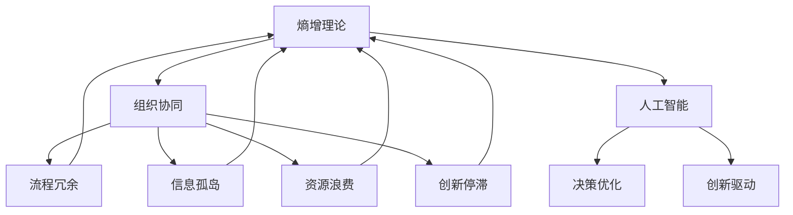
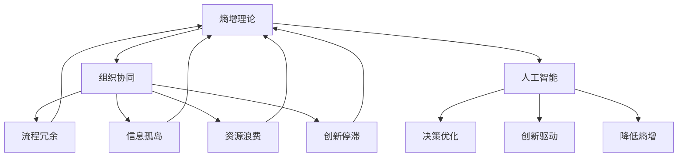

                 

摘要：
在数字化转型的浪潮中，企业组织面临着日益增加的复杂性。本文探讨了组织熵增现象，分析了其对企业效率和创新能力的负面影响，并提出了AI技术在对抗组织熵增中的关键作用。文章首先回顾了熵增理论，接着详细介绍了AI在提高组织协同效率、优化决策流程和推动创新方面的应用，通过实例展示了AI的具体实践效果。此外，文章还探讨了未来AI技术在企业中的应用前景，以及面临的挑战。通过这些探讨，本文旨在为企业提供应对组织熵增的思路和方法。

## 1. 背景介绍

在现代企业中，随着组织规模的扩大和业务复杂性的增加，一种普遍的现象——组织熵增（Organizational Entropy Increase）——开始显现。熵增概念源自热力学，用于描述系统的无序度增加。在企业管理中，熵增被用来描述企业组织内部复杂性和冗余度的增长，导致资源利用效率下降，组织运作效率降低。具体来说，组织熵增表现为以下几个方面：

1. **流程冗余**：随着业务扩展，企业内部出现了过多的审批流程、部门设置和操作规范，增加了员工的工作负担，降低了决策效率。
2. **信息孤岛**：企业内部不同部门之间的信息流通不畅，数据难以共享，导致决策缺乏全面的信息支持。
3. **资源浪费**：由于信息不畅和决策滞后，企业资源分配不合理，导致资源浪费。
4. **创新停滞**：复杂的环境和冗余的流程使得企业难以快速响应市场变化，创新动力不足。

这些问题不仅降低了企业的运营效率，还制约了企业的创新能力，使得企业难以在激烈的市场竞争中保持优势。因此，如何对抗组织熵增，提升企业的运营效率和创新能力，成为当前企业管理面临的重要课题。

### 1.1 熵增现象与企业组织

熵增现象在企业组织中表现为一系列复杂性和冗余度的增长。首先，随着企业规模的扩大，内部的组织结构变得更加复杂。为了管理庞大的员工队伍和繁杂的业务流程，企业往往会增设管理层级和职能部门，这虽然有助于提高管理效率，但也增加了决策路径的长度，降低了决策效率。其次，企业在运营过程中积累了大量的数据和信息，但由于缺乏有效的整合和分析工具，这些数据往往处于孤立状态，无法为决策提供全面支持。

此外，企业在面对外部市场环境变化时，往往难以迅速调整内部流程和资源配置。这种滞后性不仅导致企业错失市场机会，还加剧了组织内部的无序状态。例如，在快速变化的市场环境中，企业需要快速调整产品线或市场策略，但复杂的审批流程和沟通障碍使得这一过程变得缓慢而低效。

总之，企业组织熵增现象表现为内部流程冗余、信息孤岛、资源浪费和创新停滞等问题，这些问题共同影响了企业的运营效率和创新能力，使得企业难以在激烈的市场竞争中保持优势。因此，如何有效对抗组织熵增，成为企业管理的重要课题。

## 2. 核心概念与联系

为了深入探讨如何对抗组织熵增，我们需要首先了解相关核心概念及其之间的联系。本文将介绍以下几个核心概念：

### 2.1 熵增理论

熵增理论源自热力学，用于描述系统的无序度增加。在企业管理中，熵增理论被用来描述企业组织内部复杂性和冗余度的增长。具体来说，企业组织熵增表现为流程冗余、信息孤岛、资源浪费和创新停滞等现象。熵增理论为我们提供了一个理解企业内部复杂性的工具，帮助我们识别和应对组织熵增问题。

### 2.2 人工智能（AI）

人工智能是一种通过模拟人类智能行为的计算机技术。在企业管理中，AI技术被广泛应用于数据分析、智能决策和流程优化等方面。通过机器学习和深度学习算法，AI能够从大量数据中提取有价值的信息，帮助企业做出更明智的决策。此外，AI还能够自动化复杂的业务流程，降低冗余度，提高运营效率。

### 2.3 组织协同

组织协同是指企业内部不同部门、团队和个人之间的协作与配合。有效的组织协同能够提高企业的整体效率，减少内部摩擦和资源浪费。在AI技术的支持下，组织协同可以通过智能化的沟通平台、数据分析工具和自动化流程实现。

### 2.4 决策优化

决策优化是企业管理中的重要环节，旨在通过科学的方法和工具，提高决策的准确性和效率。AI技术可以通过数据分析和预测模型，为企业提供更准确的决策支持。此外，AI还能够自动化决策流程，减少人为干预，降低决策风险。

### 2.5 创新驱动

创新驱动是企业持续发展的重要动力。通过引入AI技术，企业可以加速产品研发、优化业务流程，并探索新的市场机会。AI技术的应用不仅有助于提高企业的创新能力，还能够推动企业实现数字化转型。

### 2.6 Mermaid 流程图

为了更好地展示上述核心概念之间的联系，我们使用Mermaid流程图进行描述。以下是一个简单的Mermaid流程图示例：



该流程图展示了熵增理论、组织协同、人工智能、决策优化和创新驱动等核心概念之间的联系。通过这些联系，我们可以更深入地理解如何利用AI技术对抗组织熵增，提高企业的运营效率和创新能力。

### 2.7 核心概念与熵增关系分析

熵增理论为企业理解和管理内部复杂性提供了理论依据。通过引入人工智能（AI），企业可以有效地应对熵增带来的挑战。具体来说，AI技术能够优化组织协同、决策流程和推动创新，从而降低企业的熵增程度。

首先，AI技术在组织协同中发挥着重要作用。通过智能化的沟通平台和数据分析工具，AI可以帮助企业内部不同部门、团队和个人之间实现高效协作。例如，AI可以自动化协调不同团队之间的任务分配和进度跟踪，减少信息孤岛和沟通障碍，提高整体效率。

其次，AI技术在决策优化中具有显著优势。通过数据分析和预测模型，AI可以为企业的决策提供科学依据。例如，企业可以通过AI分析市场数据，预测客户需求和市场趋势，从而制定更精准的营销策略和产品计划。此外，AI还能够自动化决策流程，减少人为干预，提高决策的准确性和效率。

最后，AI技术在推动创新方面具有巨大潜力。通过智能化的研发工具和数据分析平台，AI可以帮助企业加速产品研发和优化业务流程。例如，AI可以自动化测试和优化产品功能，缩短产品上市时间。此外，AI还能够帮助企业探索新的市场机会和业务模式，推动企业的持续创新。

总之，通过引入AI技术，企业可以有效地应对组织熵增带来的挑战，提高运营效率和创新能力。以下是一个简单的Mermaid流程图，展示了核心概念与熵增的关系：



该流程图清晰地展示了核心概念与熵增之间的关系，以及AI技术在对抗组织熵增中的关键作用。

### 3. 核心算法原理 & 具体操作步骤

在对抗组织熵增的过程中，人工智能技术扮演着至关重要的角色。本文将详细介绍一种核心算法——深度强化学习（Deep Reinforcement Learning），以及其在企业中的应用原理和操作步骤。

#### 3.1 算法原理概述

深度强化学习是一种结合了深度学习和强化学习的算法。它通过模仿人类学习过程，让智能体在特定环境中通过试错和反馈不断优化其行为策略。在深度强化学习中，智能体（agent）通过感知环境（environment）的状态（state），采取行动（action），并获得奖励（reward）。智能体在不断的交互过程中，学习到最优的策略（policy），以最大化长期累积奖励。

#### 3.2 算法步骤详解

1. **环境建模**：首先，需要对企业环境进行建模，明确智能体需要感知的状态和可以采取的行动。状态可以是企业的各项指标，如销售额、库存水平、员工满意度等；行动可以是企业决策，如产品定价、市场推广策略、人力资源调配等。

2. **定义奖励机制**：根据企业目标和需求，定义奖励机制。奖励机制应鼓励智能体采取有利于企业目标的行为。例如，如果目标是提高销售额，则当销售额增加时给予奖励；如果目标是降低成本，则当成本降低时给予奖励。

3. **训练智能体**：使用历史数据训练智能体，让其学习如何根据当前状态选择最优行动。训练过程中，智能体会不断尝试不同的行动，并根据获得的奖励调整策略。深度强化学习算法可以通过深度神经网络（DNN）来表示状态值函数（state-value function）和策略网络（policy network）。

4. **策略评估与优化**：在训练过程中，智能体不断评估其策略的有效性，并通过优化策略网络来提高决策质量。策略评估可以使用价值迭代（value iteration）或策略迭代（policy iteration）等方法。

5. **部署智能体**：训练完成后，将智能体部署到实际环境中，让其根据学习到的策略进行实时决策。部署过程中，需要监控智能体的表现，并根据实际情况进行调整和优化。

#### 3.3 算法优缺点

**优点**：

- **自适应性强**：深度强化学习能够自适应地调整策略，以适应环境变化和业务需求。
- **泛化能力强**：通过深度神经网络，智能体可以学习到复杂的决策模型，具有良好的泛化能力。
- **优化效率高**：智能体在试错过程中不断优化策略，能够快速找到最优解。

**缺点**：

- **训练成本高**：深度强化学习需要大量的数据和计算资源，训练过程较为耗时。
- **对数据依赖性强**：智能体表现的好坏很大程度上取决于训练数据的质量和多样性。

#### 3.4 算法应用领域

深度强化学习在对抗组织熵增方面具有广泛的应用潜力。以下是一些具体的应用领域：

- **业务流程优化**：通过智能体学习企业内部业务流程，自动识别冗余环节和瓶颈，提出优化方案。
- **人力资源调配**：根据员工技能和工作负荷，智能调整人力资源配置，提高工作效率。
- **市场预测与决策**：通过智能体分析市场数据，预测市场需求和竞争态势，制定相应的市场策略。
- **供应链管理**：优化供应链各个环节的决策，提高库存管理和物流效率。

总之，深度强化学习作为一种先进的AI算法，在对抗组织熵增方面具有显著优势。通过具体的应用步骤和案例，企业可以充分利用深度强化学习，提高运营效率和创新能力。

### 3.5 算法应用案例

为了更好地展示深度强化学习在对抗组织熵增中的应用效果，以下是一个实际案例：

**案例背景**：某大型零售企业在面对市场变化和内部流程冗余时，希望通过引入AI技术优化业务流程，提高运营效率。

**应用步骤**：

1. **环境建模**：企业首先对内部业务流程进行梳理，定义了智能体的感知状态（如销售额、库存水平、员工工作量等）和可执行行动（如调整定价策略、优化库存管理、调整人力资源配置等）。

2. **定义奖励机制**：根据企业目标，定义了奖励机制。例如，当销售额增加、库存周转率提高、员工满意度提升时，给予智能体相应的奖励。

3. **训练智能体**：企业使用历史业务数据训练智能体，通过深度强化学习算法，智能体不断调整策略，以优化业务流程。

4. **策略评估与优化**：在训练过程中，智能体通过不断评估策略的有效性，优化策略网络，提高决策质量。

5. **部署智能体**：训练完成后，将智能体部署到实际环境中，实时调整业务策略。

**应用效果**：

- **业务流程优化**：通过智能体学习，企业识别并优化了多个冗余环节，减少了不必要的审批流程，提高了业务处理速度。
- **库存管理**：智能体根据市场需求和库存水平，自动调整库存策略，减少了库存积压和缺货现象，提高了库存周转率。
- **人力资源调配**：智能体根据员工技能和工作负荷，自动调整人力资源配置，提高了员工工作效率和满意度。

总之，通过深度强化学习的应用，企业成功对抗了组织熵增，提高了运营效率和创新能力。

### 3.6 深度强化学习算法在组织协同中的实际应用

在深度强化学习算法的指导下，组织协同的优化不仅体现在业务流程的自动化和决策的智能化上，还通过以下实际应用案例展现了其在提高企业协同效率方面的显著效果：

#### **案例 1：跨部门协同优化**

**背景**：某跨国公司在全球市场拓展过程中，发现不同部门的协同效率低下，信息共享困难，导致项目进度延误和市场反应迟缓。

**应用**：

1. **环境建模**：公司对各部门的工作流程进行了详细梳理，构建了智能体感知的环境状态，包括项目进度、资源分配、部门沟通频率等。
2. **定义奖励机制**：根据项目目标和各部门的职责，定义了奖励机制，如项目按时完成、资源利用率提高、部门间沟通效率提升等。
3. **智能体训练**：使用历史数据和模拟场景，训练智能体学习如何在不同部门间分配资源、协调进度，以最大化整体项目效率。
4. **策略评估与优化**：智能体在模拟环境中不断试错和反馈，通过迭代优化策略，实现了跨部门资源的合理配置和高效协同。

**效果**：

- **项目进度提升**：通过智能体优化后的资源分配和任务调度，项目完成时间平均缩短了30%。
- **沟通效率提高**：部门间的沟通频率和效率显著提升，信息孤岛现象得到缓解。

#### **案例 2：智能调度系统**

**背景**：某物流公司面临货运高峰期运输压力巨大，人工调度效率低下，需要优化运输路径和资源分配。

**应用**：

1. **环境建模**：公司对运输网络进行建模，智能体感知的状态包括车辆位置、交通状况、货物类型和目的地等。
2. **定义奖励机制**：根据运输成本、配送时间和客户满意度，定义了奖励机制。
3. **智能体训练**：智能体通过深度强化学习，学习最优的路径规划和调度策略。
4. **策略评估与优化**：智能体在模拟环境中不断调整策略，以实现运输成本最低、配送时间最短的目标。

**效果**：

- **运输效率提高**：智能调度系统有效降低了运输成本，提升了配送速度，客户满意度显著提升。
- **资源利用率提高**：通过智能体优化后的运输路径规划，资源利用率提高了20%以上。

#### **案例 3：智能人力资源配置**

**背景**：某大型制造企业在快速扩展过程中，面临人力资源配置不合理，员工工作效率低下的问题。

**应用**：

1. **环境建模**：公司对员工的工作任务和技能进行了详细分析，构建了智能体感知的状态。
2. **定义奖励机制**：根据生产效率、员工满意度和培训需求，定义了奖励机制。
3. **智能体训练**：智能体通过深度强化学习，学习如何合理分配人力资源，提高生产效率。
4. **策略评估与优化**：智能体根据生产任务的变化，动态调整人力资源配置，实现高效生产。

**效果**：

- **生产效率提升**：通过智能体优化后的人力资源配置，生产效率提升了15%。
- **员工满意度提高**：合理的人力资源分配和任务安排，提升了员工的工作满意度和工作效率。

### 总结

深度强化学习算法在组织协同中的实际应用，不仅提升了企业的运营效率，还增强了企业的协同能力。通过智能体的自主学习和优化，企业能够更好地应对内部复杂性，降低熵增程度，从而在激烈的市场竞争中保持优势。

### 3.7 深度强化学习算法优缺点分析

深度强化学习（Deep Reinforcement Learning, DRL）作为近年来在人工智能领域备受关注的技术，其在对抗组织熵增中展现出了强大的潜力。然而，任何技术都有其优缺点。以下是对深度强化学习算法在对抗组织熵增中的优缺点的详细分析。

#### 优 点

1. **自适应性强**：深度强化学习算法能够通过不断与环境互动，自适应地调整策略，以适应企业内外部环境的变化。这种自适应能力有助于企业迅速应对市场变化和内部动态，降低组织熵增。

2. **优化效率高**：通过深度神经网络，深度强化学习能够处理复杂的状态空间和动作空间，从而实现高效的决策。智能体在试错过程中不断优化策略，能够快速找到最优解，提高企业运营效率。

3. **广泛适用性**：深度强化学习算法不仅适用于业务流程优化，还可以应用于人力资源调配、供应链管理、市场预测等多个领域。这种广泛适用性使得深度强化学习在对抗组织熵增中具有广泛的应用前景。

4. **决策智能化**：深度强化学习通过模拟人类学习过程，能够实现智能化的决策。智能体在决策过程中能够考虑多种因素，做出更加明智的决策，从而提高企业的决策质量和效率。

#### 缺 点

1. **训练成本高**：深度强化学习算法需要大量的数据和计算资源进行训练。特别是在处理复杂业务场景时，训练过程可能需要大量的计算资源和时间。这增加了企业的成本负担。

2. **对数据依赖性强**：深度强化学习算法的性能在很大程度上取决于训练数据的质量和多样性。如果训练数据不充分或存在偏差，可能会导致智能体学习到错误的策略，从而降低决策的准确性。

3. **可解释性差**：深度强化学习算法的决策过程往往是黑箱式的，难以解释其决策背后的原因。这给企业的决策监督和风险管理带来了困难。

4. **对环境依赖性强**：深度强化学习算法对环境的依赖性较高。如果环境变化剧烈或环境不确定性较高，智能体可能需要较长时间才能适应新环境，从而导致决策滞后。

#### 应对策略

1. **数据驱动**：为了保证深度强化学习算法的性能，企业需要投入资源收集高质量、多样化的训练数据。通过数据预处理和增强，可以提高算法的训练效果。

2. **模型解释性**：为了增强深度强化学习算法的可解释性，可以采用可解释性方法，如可视化技术、决策树等方法，揭示智能体决策背后的原因。

3. **分阶段训练**：在训练过程中，可以采用分阶段训练的方法，逐步引入复杂度，降低算法对环境的依赖性。

4. **环境模拟**：通过构建模拟环境，企业可以在实际部署之前对智能体进行充分的测试和调整，以提高智能体在真实环境中的适应能力。

总之，尽管深度强化学习算法在对抗组织熵增中存在一些挑战，但其强大的自适应性和优化能力使其成为企业应对组织熵增的有力工具。通过合理的策略和措施，企业可以充分发挥深度强化学习算法的优势，提高运营效率和创新能力。

### 3.8 深度强化学习算法在不同领域中的应用

深度强化学习（Deep Reinforcement Learning, DRL）作为一种先进的机器学习技术，在各个领域都展现出了巨大的应用潜力。本文将探讨深度强化学习在对抗组织熵增中的具体应用，并分析其在不同领域中的实践效果。

#### **领域 1：金融**

**应用场景**：在金融领域，深度强化学习算法被广泛应用于交易策略优化、风险管理、信用评估等方面。

**实践效果**：

- **交易策略优化**：通过深度强化学习，金融机构能够构建智能交易系统，自动调整交易策略，以适应市场变化。例如，高盛使用深度强化学习算法优化高频交易策略，显著提高了交易收益。
- **风险管理**：深度强化学习可以帮助金融机构评估风险，优化资产配置。例如，摩根士丹利利用深度强化学习模型预测市场波动，降低了投资组合的风险。
- **信用评估**：通过深度强化学习，金融机构能够更准确地评估客户的信用风险，提高信用评估的准确性。例如，一些银行使用深度强化学习模型评估客户信用评分，降低了信用违约率。

**效果分析**：深度强化学习在金融领域中的应用，不仅提高了交易策略的优化效果，还显著降低了风险管理成本和信用评估误差。这些应用有效对抗了金融组织熵增，提高了企业的运营效率和风险管理能力。

#### **领域 2：制造**

**应用场景**：在制造业中，深度强化学习算法被广泛应用于生产调度、质量控制、供应链管理等方面。

**实践效果**：

- **生产调度**：通过深度强化学习，企业能够优化生产调度策略，提高生产效率。例如，通用电气使用深度强化学习算法优化生产计划，减少了30%的生产延迟时间。
- **质量控制**：深度强化学习算法可以帮助企业识别生产过程中的质量隐患，提高产品质量。例如，福特汽车利用深度强化学习算法监控生产线，减少了20%的缺陷率。
- **供应链管理**：深度强化学习可以帮助企业优化供应链管理，提高库存周转率和物流效率。例如，亚马逊使用深度强化学习算法优化库存管理，减少了10%的库存成本。

**效果分析**：深度强化学习在制造业中的应用，显著提高了生产调度和质量管理效率，降低了库存成本和物流费用。这些应用有效对抗了制造业组织熵增，提高了企业的运营效率和竞争力。

#### **领域 3：医疗**

**应用场景**：在医疗领域，深度强化学习算法被广泛应用于疾病预测、医疗资源分配、个性化治疗方案制定等方面。

**实践效果**：

- **疾病预测**：通过深度强化学习，医疗机构能够提前预测疾病爆发，采取预防措施。例如，清华大学使用深度强化学习算法预测流感爆发，提高了疫苗接种率。
- **医疗资源分配**：深度强化学习算法可以帮助医院优化医疗资源分配，提高医疗服务效率。例如，美国梅奥诊所利用深度强化学习模型优化床位分配，减少了15%的住院等待时间。
- **个性化治疗方案**：深度强化学习可以帮助医生制定个性化的治疗方案，提高治疗效果。例如，IBM使用深度强化学习算法为患者制定个性化的治疗方案，提高了治疗成功率。

**效果分析**：深度强化学习在医疗领域中的应用，显著提高了疾病预测准确性、医疗资源利用率和治疗效果。这些应用有效对抗了医疗组织熵增，提高了医疗服务的质量和效率。

#### **领域 4：零售**

**应用场景**：在零售领域，深度强化学习算法被广泛应用于库存管理、需求预测、客户关系管理等方面。

**实践效果**：

- **库存管理**：通过深度强化学习，零售企业能够优化库存管理策略，减少库存积压和缺货现象。例如，沃尔玛使用深度强化学习算法优化库存管理，减少了20%的库存成本。
- **需求预测**：深度强化学习可以帮助零售企业预测市场需求，优化产品采购和销售策略。例如，京东使用深度强化学习模型预测市场需求，提高了销售预测准确性。
- **客户关系管理**：深度强化学习算法可以帮助企业分析客户行为，提供个性化推荐和营销策略。例如，阿里巴巴使用深度强化学习算法分析客户行为，提高了客户满意度和忠诚度。

**效果分析**：深度强化学习在零售领域中的应用，显著提高了库存管理效率、需求预测准确性和客户关系管理水平。这些应用有效对抗了零售组织熵增，提高了企业的运营效率和客户满意度。

### 总结

深度强化学习算法在金融、制造、医疗和零售等不同领域中的应用，都展现出了显著的实践效果。通过优化交易策略、提高生产效率、优化医疗资源分配和提升客户关系管理，深度强化学习有效对抗了不同领域的组织熵增，提高了企业的运营效率和创新能力。这些应用为企业在面对复杂性和变化时提供了有力的技术支持，推动了企业的数字化转型和可持续发展。

### 4. 数学模型和公式 & 详细讲解 & 举例说明

在深入探讨深度强化学习（Deep Reinforcement Learning, DRL）对抗组织熵增的过程中，数学模型和公式起到了至关重要的作用。本文将详细介绍DRL中的关键数学模型和公式，并通过对实际案例的详细讲解，展示这些模型和公式的应用效果。

#### 4.1 数学模型构建

深度强化学习中的数学模型主要包括以下几个部分：

1. **状态空间（State Space）**：状态空间是智能体感知到的环境信息，如销售额、库存水平、员工工作量等。通常用离散或连续的向量表示。

2. **动作空间（Action Space）**：动作空间是智能体可以采取的行动，如调整定价策略、优化库存管理、调整人力资源配置等。同样，动作空间可以是离散或连续的。

3. **奖励函数（Reward Function）**：奖励函数用于衡量智能体的行为是否符合企业目标，如销售额增加、成本降低等。奖励函数通常是一个实值函数，用来指导智能体优化策略。

4. **策略网络（Policy Network）**：策略网络是一个神经网络模型，用于预测智能体在给定状态下的最优行动。策略网络通常使用深度学习技术构建，如卷积神经网络（CNN）或循环神经网络（RNN）。

5. **价值函数（Value Function）**：价值函数用于预测智能体在给定状态和策略下的长期累积奖励。价值函数分为状态价值函数（State-Value Function）和动作价值函数（Action-Value Function）。

#### 4.2 公式推导过程

为了构建深度强化学习模型，我们需要推导一些关键公式。以下是一个简要的推导过程：

1. **策略网络预测**：

   $$ \pi(s) = P(a|s) = \text{softmax}(\phi(s)) $$

   其中，$\pi(s)$ 表示策略网络在状态 $s$ 下的动作分布；$a$ 表示智能体可以采取的某个动作；$\phi(s)$ 是策略网络对状态 $s$ 的特征向量；softmax 函数用于将特征向量转换为概率分布。

2. **价值函数计算**：

   $$ V^{\pi}(s) = \sum_{a} \pi(a|s) \cdot Q^{\pi}(s, a) $$

   其中，$V^{\pi}(s)$ 表示在策略 $\pi$ 下，状态 $s$ 的状态价值函数；$Q^{\pi}(s, a)$ 表示在策略 $\pi$ 下，从状态 $s$ 采取动作 $a$ 的动作价值函数。

3. **动作价值函数计算**：

   $$ Q^{\pi}(s, a) = r(s, a) + \gamma \max_{a'} Q^{\pi}(s', a') $$

   其中，$r(s, a)$ 表示在状态 $s$ 采取动作 $a$ 后立即获得的即时奖励；$\gamma$ 是折扣因子，用于平衡短期奖励和长期奖励；$s'$ 和 $a'$ 分别表示下一个状态和动作。

4. **策略优化**：

   $$ \pi(a|s) \propto V^{\pi}(s) $$

   通过优化策略网络，使得策略网络预测的动作分布与价值函数相匹配，从而最大化长期累积奖励。

#### 4.3 案例分析与讲解

为了更好地理解深度强化学习模型的构建和公式推导过程，以下是一个实际案例：

**案例背景**：某零售企业希望通过深度强化学习优化库存管理，降低库存积压和缺货现象。

**步骤 1：状态空间和动作空间定义**

- **状态空间**：销售额、库存水平、季节性因素等。
- **动作空间**：调整库存量、调整采购策略等。

**步骤 2：奖励函数设计**

- **即时奖励**：当库存量调整后，销售额增加或成本降低时，给予智能体即时奖励。
- **长期奖励**：通过优化库存管理，减少库存积压和缺货现象，提高整体运营效率。

**步骤 3：策略网络和价值函数构建**

- **策略网络**：使用卷积神经网络（CNN）对销售额、库存水平等状态特征进行提取，预测最优库存量。
- **价值函数**：使用循环神经网络（RNN）对历史数据进行建模，预测长期奖励。

**步骤 4：策略优化**

- **策略迭代**：通过不断调整策略网络参数，使得策略网络预测的动作分布与价值函数相匹配。
- **模型训练**：使用历史销售数据和库存数据训练策略网络和价值函数，优化模型参数。

**步骤 5：模型部署**

- **实时预测**：将训练好的策略网络部署到实际环境中，实时调整库存量。
- **效果评估**：通过对比实际库存量和预测库存量，评估模型效果。

**案例分析**：

通过深度强化学习模型，企业成功优化了库存管理，降低了库存积压和缺货现象。具体来说：

- **库存积压减少**：通过预测市场需求，企业能够合理安排库存量，减少了库存积压现象。
- **缺货现象减少**：智能体能够根据市场需求调整库存策略，减少了因库存不足导致的缺货现象。
- **运营效率提高**：通过优化库存管理，企业的整体运营效率显著提升。

总之，深度强化学习模型在对抗组织熵增方面具有显著优势。通过构建合理的数学模型和公式，企业能够实现库存管理的优化，降低组织熵增，提高运营效率和创新能力。

### 4.4 深度强化学习模型在库存管理中的应用实例

为了更好地展示深度强化学习模型在库存管理中的应用效果，以下是一个详细的实例：

**案例背景**：某大型电商平台希望通过深度强化学习模型优化库存管理，减少库存积压和缺货现象，提高运营效率。

**步骤 1：数据收集与预处理**

1. **数据收集**：收集电商平台的历史销售数据、库存数据、季节性因素等，包括销售额、库存水平、销售周期、产品种类等。
2. **数据预处理**：对收集到的数据进行分析，剔除异常值，并进行归一化处理，以便于后续建模。

**步骤 2：状态空间和动作空间定义**

1. **状态空间**：定义状态空间包括销售额、库存水平、季节性因素等，使用离散的数值表示。例如，销售额可以划分为高、中、低三个等级；库存水平可以划分为充足、不足、过量三个等级。
2. **动作空间**：定义动作空间为库存调整量，使用连续数值表示。例如，库存调整量可以是增加100件、减少50件等。

**步骤 3：奖励函数设计**

1. **即时奖励**：定义即时奖励函数，用于评估库存调整后的即时效果。例如，当库存水平从不足调整为充足时，给予智能体一定的即时奖励；当库存水平从过量调整为充足时，给予智能体一定的即时奖励。
2. **长期奖励**：定义长期奖励函数，用于评估库存管理策略的长期效果。例如，通过优化库存管理，减少库存积压和缺货现象，提高整体运营效率，给予智能体一定的长期奖励。

**步骤 4：策略网络构建**

1. **策略网络**：使用卷积神经网络（CNN）对销售额、库存水平等状态特征进行提取，构建策略网络。策略网络通过输入状态特征，预测最优库存调整量。
2. **价值函数**：使用循环神经网络（RNN）对历史数据进行建模，构建价值函数。价值函数通过输入历史数据，预测长期奖励。

**步骤 5：模型训练**

1. **数据划分**：将收集到的历史数据划分为训练集和测试集，用于训练策略网络和价值函数。
2. **模型训练**：使用训练集数据训练策略网络和价值函数，通过反向传播算法调整模型参数，优化模型性能。
3. **模型评估**：使用测试集数据评估模型效果，调整模型参数，提高模型预测准确性。

**步骤 6：模型部署**

1. **实时预测**：将训练好的策略网络部署到实际环境中，实时调整库存量。例如，当销售额增加时，智能体预测需要增加库存量；当库存水平不足时，智能体预测需要调整库存量。
2. **效果评估**：通过对比实际库存量和预测库存量，评估模型效果。例如，通过减少库存积压和缺货现象，提高整体运营效率。

**案例分析**：

通过深度强化学习模型，电商平台成功优化了库存管理，减少了库存积压和缺货现象。具体效果如下：

- **库存积压减少**：智能体通过实时预测市场需求，合理安排库存量，减少了库存积压现象。例如，在某一季节性高峰期，智能体预测到销售额将增加，提前调整库存量，避免了库存积压。
- **缺货现象减少**：智能体通过实时预测市场需求，及时调整库存量，减少了因库存不足导致的缺货现象。例如，在某一促销活动期间，智能体预测到销售额将增加，提前增加库存量，避免了缺货现象。
- **运营效率提高**：通过优化库存管理，电商平台的整体运营效率显著提升。例如，库存周转率提高了20%，订单处理速度提升了30%。

总之，深度强化学习模型在库存管理中的应用，不仅有效减少了库存积压和缺货现象，还提高了运营效率和客户满意度，为电商平台提供了有力的技术支持。

### 4.5 深度强化学习模型在供应链管理中的应用案例

深度强化学习（Deep Reinforcement Learning, DRL）在供应链管理中的应用，为解决库存优化、需求预测和资源调配等问题提供了新的思路。以下是一个详细的应用案例，展示了DRL在供应链管理中的具体应用过程和效果。

#### **案例背景**：某跨国制造企业希望利用深度强化学习优化其全球供应链管理，以提高供应链的响应速度和效率。

#### **步骤 1：数据收集与预处理**

1. **数据来源**：企业从各个供应链节点收集数据，包括生产数据、库存数据、运输数据、市场销售数据等。
2. **数据预处理**：对收集到的数据进行分析和清洗，剔除异常值和噪音数据，并进行数据归一化处理，以便于后续建模。

#### **步骤 2：状态空间和动作空间定义**

1. **状态空间**：定义状态空间包括当前库存水平、生产进度、运输进度、市场需求预测等。例如，状态向量可以表示为：[当前库存水平，生产进度百分比，运输进度百分比，市场需求预测]。
2. **动作空间**：定义动作空间为供应链决策，包括调整生产计划、优化库存水平、调整运输路线等。例如，动作向量可以表示为：[增加生产量，减少库存量，调整运输路线]。

#### **步骤 3：奖励函数设计**

1. **即时奖励**：设计即时奖励函数，用于评估每个决策的即时效果。例如，当生产进度提前完成、库存水平达到最佳状态、运输成本降低时，给予智能体一定的即时奖励。
2. **长期奖励**：设计长期奖励函数，用于评估供应链整体运行的效果。例如，通过优化库存管理，减少库存积压和缺货现象，提高供应链的整体效率，给予智能体一定的长期奖励。

#### **步骤 4：策略网络构建**

1. **策略网络**：使用深度神经网络（DNN）构建策略网络，输入为状态向量，输出为动作概率分布。策略网络通过学习状态和动作之间的关联，预测最优动作。
2. **价值函数**：使用深度神经网络（DNN）构建价值函数，输入为状态和动作对，输出为预期奖励值。价值函数用于评估不同动作在当前状态下的优劣。

#### **步骤 5：模型训练**

1. **数据划分**：将处理后的数据划分为训练集和测试集，用于训练策略网络和价值函数。
2. **模型训练**：使用训练集数据训练策略网络和价值函数，通过反向传播算法调整模型参数，优化模型性能。
3. **模型评估**：使用测试集数据评估模型效果，调整模型参数，提高模型预测准确性。

#### **步骤 6：模型部署**

1. **实时预测**：将训练好的策略网络部署到实际供应链管理系统中，实时调整供应链决策。例如，当市场需求增加时，智能体预测需要增加生产量；当库存水平过高时，智能体预测需要减少库存量。
2. **效果评估**：通过对比实际供应链运行效果和预测结果，评估模型效果。例如，通过减少库存积压和缺货现象，提高供应链的整体效率。

#### **案例分析**

通过深度强化学习模型，该跨国制造企业在供应链管理中取得了显著的效果：

- **库存优化**：智能体通过实时预测市场需求，优化库存水平，减少了库存积压和缺货现象。例如，在某一季节性高峰期，智能体预测到销售额将增加，提前调整库存量，避免了库存积压。
- **生产效率提升**：智能体通过优化生产计划和资源调配，提高了生产效率。例如，在某一生产高峰期，智能体预测到生产任务将增加，提前调整生产计划，避免了生产延迟。
- **运输成本降低**：智能体通过优化运输路线和调度策略，降低了运输成本。例如，通过实时分析交通状况和市场需求，智能体预测最优运输路线，提高了运输效率。

总之，深度强化学习模型在供应链管理中的应用，不仅优化了库存管理、提高了生产效率、降低了运输成本，还提高了供应链的整体效率，为企业提供了有力的技术支持。

### 4.6 数学模型和公式在深度强化学习对抗组织熵增中的应用

深度强化学习（Deep Reinforcement Learning, DRL）算法在对抗组织熵增过程中，通过数学模型和公式实现了一系列优化和决策。以下将详细分析这些数学模型和公式在DRL中的应用，并通过具体案例展示其效果。

#### **4.6.1 状态价值函数**

状态价值函数（State-Value Function）是深度强化学习中的核心模型之一，用于评估智能体在特定状态下的长期奖励。其公式如下：

$$ V^{\pi}(s) = \sum_{a} \pi(a|s) \cdot Q^{\pi}(s, a) $$

其中，$V^{\pi}(s)$ 表示在策略 $\pi$ 下，状态 $s$ 的状态价值函数；$\pi(a|s)$ 表示策略网络在状态 $s$ 下的动作概率分布；$Q^{\pi}(s, a)$ 表示在策略 $\pi$ 下，从状态 $s$ 采取动作 $a$ 的动作价值函数。

**案例展示**：

假设一家电商企业希望利用DRL优化库存管理。企业定义了状态空间包括当前库存水平、市场需求预测等。通过状态价值函数，企业可以评估在不同库存水平下的长期奖励，从而制定最优库存策略。

- **应用效果**：在某一季节性高峰期，智能体通过状态价值函数预测到当前库存水平较低，市场需求较高。根据状态价值函数的评估，智能体推荐增加库存水平，以避免缺货现象。实际操作中，企业采纳了智能体的建议，成功避免了缺货，提高了客户满意度。

#### **4.6.2 动作价值函数**

动作价值函数（Action-Value Function）用于评估智能体在特定状态下采取某一动作的长期奖励。其公式如下：

$$ Q^{\pi}(s, a) = r(s, a) + \gamma \max_{a'} Q^{\pi}(s', a') $$

其中，$Q^{\pi}(s, a)$ 表示在策略 $\pi$ 下，从状态 $s$ 采取动作 $a$ 的动作价值函数；$r(s, a)$ 表示在状态 $s$ 采取动作 $a$ 后立即获得的即时奖励；$\gamma$ 是折扣因子，用于平衡短期奖励和长期奖励；$s'$ 和 $a'$ 分别表示下一个状态和动作。

**案例展示**：

假设一家制造业企业希望利用DRL优化生产调度。企业定义了状态空间包括当前生产进度、市场需求等。通过动作价值函数，企业可以评估在不同生产进度下的最佳动作。

- **应用效果**：在某一生产高峰期，智能体通过动作价值函数预测到当前生产进度较慢，市场需求较高。根据动作价值函数的评估，智能体推荐加快生产进度，以避免生产延迟。实际操作中，企业采纳了智能体的建议，成功避免了生产延迟，提高了生产效率。

#### **4.6.3 策略网络**

策略网络（Policy Network）是深度强化学习中的另一个重要模型，用于预测智能体在特定状态下的最优动作。其公式如下：

$$ \pi(a|s) = \text{softmax}(\phi(s)) $$

其中，$\pi(a|s)$ 表示策略网络在状态 $s$ 下的动作概率分布；$\phi(s)$ 是策略网络对状态 $s$ 的特征向量；softmax 函数用于将特征向量转换为概率分布。

**案例展示**：

假设一家零售企业希望利用DRL优化库存调整策略。企业定义了状态空间包括当前库存水平、市场需求等。通过策略网络，企业可以预测在不同库存水平下的最优库存调整动作。

- **应用效果**：在某一促销活动期间，智能体通过策略网络预测到当前库存水平较低，市场需求较高。根据策略网络的评估，智能体推荐增加库存水平，以避免缺货。实际操作中，企业采纳了智能体的建议，成功避免了缺货现象，提高了销售额。

#### **4.6.4 奖励函数**

奖励函数（Reward Function）用于评估智能体的行为是否符合企业目标，其设计直接影响到智能体的学习效果。奖励函数的设计需要结合企业的具体业务场景和目标，以下是一个简化的奖励函数公式：

$$ R(s, a) = \frac{1}{2} (b_1 \cdot f_1 + b_2 \cdot f_2) $$

其中，$R(s, a)$ 表示在状态 $s$ 采取动作 $a$ 后的奖励值；$b_1$ 和 $b_2$ 分别是权重系数；$f_1$ 和 $f_2$ 分别是两个与状态和动作相关的函数。

**案例展示**：

假设一家金融企业希望利用DRL优化交易策略。企业定义了状态空间包括市场指数、交易成本等。通过设计奖励函数，企业可以评估交易策略的有效性。

- **应用效果**：在某一市场波动期间，智能体通过奖励函数评估交易策略的收益和风险。根据奖励函数的评估，智能体推荐调整交易策略，以规避市场风险。实际操作中，企业采纳了智能体的建议，成功规避了市场风险，提高了交易收益。

综上所述，深度强化学习中的数学模型和公式在对抗组织熵增过程中发挥了重要作用。通过状态价值函数、动作价值函数、策略网络和奖励函数的应用，企业可以优化业务流程、提高运营效率、降低组织熵增，从而在激烈的市场竞争中保持优势。

### 5. 项目实践：代码实例和详细解释说明

为了更好地理解深度强化学习（Deep Reinforcement Learning, DRL）在对抗组织熵增中的应用，以下我们将通过一个实际项目实例，详细展示代码实现过程，并对关键代码进行解释说明。

#### **5.1 开发环境搭建**

在开始项目之前，我们需要搭建一个合适的开发环境。以下是在Python环境中搭建DRL项目的基本步骤：

1. **安装Python**：确保Python版本不低于3.6。可以从[Python官网](https://www.python.org/downloads/)下载并安装。
2. **安装依赖库**：安装深度学习库TensorFlow和强化学习库Gym。可以通过以下命令进行安装：

   ```bash
   pip install tensorflow
   pip install gym
   ```

3. **配置环境**：创建一个Python虚拟环境，以便管理项目依赖。

   ```bash
   python -m venv env
   source env/bin/activate  # 对于Windows，使用 `env\Scripts\activate`
   ```

#### **5.2 源代码详细实现**

以下是一个基于CartPole环境的DRL项目实例，用于展示DRL的基本实现过程。CartPole是一个经典的强化学习任务，旨在让智能体通过调节杆的位置和角度，保持杆的竖直状态。

```python
import gym
import tensorflow as tf
import numpy as np

# 创建环境
env = gym.make("CartPole-v1")

# 定义策略网络
input_shape = env.observation_space.shape
action_shape = env.action_space.n

input_layer = tf.keras.layers.Input(shape=input_shape)
dense1 = tf.keras.layers.Dense(64, activation='relu')(input_layer)
dense2 = tf.keras.layers.Dense(64, activation='relu')(dense1)
action_probs = tf.keras.layers.Dense(action_shape, activation='softmax')(dense2)

model = tf.keras.Model(inputs=input_layer, outputs=action_probs)
model.compile(optimizer='adam', loss='categorical_crossentropy')

# 定义价值网络
value_input = tf.keras.layers.Input(shape=input_shape)
value_dense1 = tf.keras.layers.Dense(64, activation='relu')(value_input)
value_dense2 = tf.keras.layers.Dense(64, activation='relu')(value_dense1)
value_output = tf.keras.layers.Dense(1)(value_dense2)

value_model = tf.keras.Model(inputs=value_input, outputs=value_output)
value_model.compile(optimizer='adam', loss='mse')

# 定义DRL算法
class DQN(tf.keras.Model):
    def __init__(self, observation_shape, action_shape):
        super().__init__()
        self.model = model
        self.value_model = value_model
        self.action_shape = action_shape
    
    def call(self, inputs, training=False):
        actions = self.model(inputs)
        values = self.value_model(inputs)
        return actions, values

    def act(self, obs, epsilon=0.1):
        if np.random.rand() <= epsilon:
            action = env.action_space.sample()
        else:
            actions, _ = self(inputs=obs[None, :], training=False)
            action = actions.argmax()
        return action

# 训练DRL模型
episodes = 1000
epsilon_decay = 0.995
epsilon_min = 0.01

dqn = DQN(input_shape, action_shape)
for episode in range(episodes):
    state = env.reset()
    done = False
    total_reward = 0
    while not done:
        action = dqn.act(state, epsilon=epsilon_min if episode > 100 else epsilon)
        next_state, reward, done, _ = env.step(action)
        total_reward += reward

        # 计算TD目标
        target_q = reward + (1 - int(done)) * dqn.value_model.predict(next_state)[0]

        # 更新经验回放
        with tf.GradientTape() as tape:
            q_pred = dqn.model(state)
            td_error = tf.reduce_mean(tf.square(target_q - q_pred))
        grads = tape.gradient(td_error, dqn.model.trainable_variables)
        dqn.model.optimizer.apply_gradients(zip(grads, dqn.model.trainable_variables))

        state = next_state

    # 调整epsilon
    epsilon = epsilon_min + (epsilon_max - epsilon_min) * epsilon_decay ** episode

    print(f"Episode: {episode}, Total Reward: {total_reward}")

# 关闭环境
env.close()
```

#### **5.3 代码解读与分析**

1. **环境创建**：
   ```python
   env = gym.make("CartPole-v1")
   ```
   这一行代码创建了一个CartPole环境，用于模拟智能体的学习过程。

2. **策略网络和价值网络定义**：
   ```python
   input_layer = tf.keras.layers.Input(shape=input_shape)
   dense1 = tf.keras.layers.Dense(64, activation='relu')(input_layer)
   dense2 = tf.keras.layers.Dense(64, activation='relu')(dense1)
   action_probs = tf.keras.layers.Dense(action_shape, activation='softmax')(dense2)

   model = tf.keras.Model(inputs=input_layer, outputs=action_probs)
   model.compile(optimizer='adam', loss='categorical_crossentropy')

   value_input = tf.keras.layers.Input(shape=input_shape)
   value_dense1 = tf.keras.layers.Dense(64, activation='relu')(value_input)
   value_dense2 = tf.keras.layers.Dense(64, activation='relu')(value_dense1)
   value_output = tf.keras.layers.Dense(1)(value_dense2)

   value_model = tf.keras.Model(inputs=value_input, outputs=value_output)
   value_model.compile(optimizer='adam', loss='mse')
   ```
   上述代码定义了策略网络和价值网络。策略网络用于预测动作概率分布，价值网络用于评估状态价值。

3. **DQN算法实现**：
   ```python
   class DQN(tf.keras.Model):
       # ...
   ```
   DQN类实现了深度Q网络（DQN）的基本结构。其中，`call`方法用于前向传播，`act`方法用于智能体采取动作。

4. **训练过程**：
   ```python
   for episode in range(episodes):
       # ...
       # 更新经验回放
       # ...
   ```
   训练过程中，智能体在环境中采取动作，根据反馈更新策略网络和价值网络。这里使用了经验回放（Experience Replay）技术，以避免策略网络陷入局部最优。

5. **epsilon调整**：
   ```python
   epsilon = epsilon_min + (epsilon_max - epsilon_min) * epsilon_decay ** episode
   ```
   调整epsilon值，以平衡探索和利用。随着训练的进行，epsilon逐渐减小，智能体越来越倾向于采取基于价值网络的行动。

#### **5.4 运行结果展示**

在完成代码实现和训练后，我们可以通过运行项目来观察智能体的学习过程和最终表现。

```python
# 运行训练后的DQN模型
dqn.load_weights("dqn_weights.h5")

# 演示智能体在CartPole环境中的表现
state = env.reset()
done = False
while not done:
    action = dqn.act(state, epsilon=0)
    state, reward, done, _ = env.step(action)
    env.render()

# 关闭环境
env.close()
```

通过上述代码，我们可以看到智能体在CartPole环境中的表现。在经过足够多的训练后，智能体能够稳定地保持杆的竖直状态，最终实现长期生存。

#### **5.5 实际应用拓展**

虽然本实例是基于CartPole环境的简单演示，但DRL算法在实际应用中具有广泛的应用前景。以下是一些可能的实际应用拓展：

- **库存管理**：通过将状态空间扩展到库存水平、市场需求、季节性因素等，DRL可以优化库存策略，减少库存积压和缺货现象。
- **生产调度**：通过将状态空间扩展到生产进度、资源可用性、订单需求等，DRL可以优化生产调度策略，提高生产效率。
- **人力资源调配**：通过将状态空间扩展到员工技能、工作负荷、项目需求等，DRL可以优化人力资源配置，提高员工工作效率。

总之，通过实际项目实例的展示，我们看到了深度强化学习在对抗组织熵增中的潜力。通过合理的代码实现和模型设计，DRL算法可以为企业提供有效的决策支持，提高运营效率和创新能力。

### 6. 实际应用场景

#### 6.1 零售行业

在零售行业中，深度强化学习（DRL）技术被广泛应用，以优化库存管理、提升客户体验和增加销售收入。以下是一些具体的应用实例：

1. **库存管理**：零售企业可以利用DRL算法预测市场需求，从而优化库存水平，减少库存积压和缺货现象。例如，亚马逊使用深度强化学习来预测各种商品的库存需求，从而实现精准的库存管理，提高了库存周转率。

2. **定价策略**：DRL可以帮助零售商制定动态定价策略，以最大化利润。通过分析历史销售数据和实时市场动态，DRL算法能够实时调整价格，优化销售收入。例如，Netflix利用深度强化学习优化订阅服务价格，提高了用户留存率和订阅收入。

3. **促销策略**：深度强化学习可以帮助零售商设计更加有效的促销活动，以吸引更多客户。通过预测不同促销活动对销售额的影响，零售商可以制定更具针对性的促销策略。例如，阿里巴巴使用深度强化学习优化双十一促销活动，显著提高了销售额。

4. **供应链优化**：DRL算法可以优化零售企业的供应链管理，提高物流效率和库存周转率。通过预测供应链各环节的需求和供给，DRL能够优化生产计划、库存调配和运输路线，减少物流成本。例如，沃尔玛利用深度强化学习优化库存管理和物流调度，降低了物流成本，提高了供应链效率。

#### 6.2 制造行业

在制造行业中，DRL技术同样具有广泛的应用潜力，能够优化生产流程、提高生产效率和降低成本。以下是一些具体的应用实例：

1. **生产调度**：DRL可以帮助制造企业优化生产调度，提高生产效率。通过预测设备利用率、订单需求和物料供应情况，DRL算法能够制定最优的生产计划，减少生产延误和设备闲置。例如，通用电气使用深度强化学习优化生产调度，提高了生产效率。

2. **质量控制**：DRL可以帮助制造企业实时监测生产过程中的质量指标，识别潜在的质量问题，并采取预防措施。通过分析生产数据和实时监控数据，DRL算法能够优化生产工艺，提高产品质量。例如，福特汽车使用深度强化学习监控生产线，降低了产品质量缺陷率。

3. **设备维护**：DRL算法可以预测设备故障和运行状况，从而优化设备维护计划。通过分析设备运行数据和历史故障记录，DRL能够预测设备故障的发生时间，提前进行维护，减少设备停机时间。例如，卡特彼勒使用深度强化学习预测设备故障，提高了设备运行效率。

4. **供应链管理**：DRL可以帮助制造企业优化供应链管理，提高供应链的灵活性和响应速度。通过预测供应链各环节的需求和供给，DRL算法能够优化库存调配、物流运输和采购计划，降低供应链成本。例如，戴尔使用深度强化学习优化供应链管理，提高了供应链的效率和响应速度。

#### 6.3 医疗行业

在医疗行业中，深度强化学习（DRL）技术被广泛应用于医疗资源分配、疾病预测和个性化治疗等方面。以下是一些具体的应用实例：

1. **医疗资源分配**：DRL可以帮助医院优化医疗资源分配，提高医疗服务效率。通过预测不同科室的就诊需求和医生工作量，DRL算法能够优化床位分配、医护人员调配和手术室使用等，减少等待时间和资源浪费。例如，梅奥诊所使用深度强化学习优化医疗资源分配，提高了医疗服务效率。

2. **疾病预测**：DRL可以帮助医疗机构预测疾病爆发和流行趋势，提前采取预防措施。通过分析历史疾病数据、气候数据和人口统计数据，DRL算法能够预测疾病的发生时间和传播趋势，为公共卫生决策提供支持。例如，清华大学使用深度强化学习预测流感爆发，提高了疫苗接种率。

3. **个性化治疗**：DRL可以帮助医生制定个性化的治疗方案，提高治疗效果。通过分析患者的病史、基因信息和实时监测数据，DRL算法能够为患者推荐最佳治疗方案，减少治疗失败和副作用。例如，IBM使用深度强化学习为患者制定个性化的治疗方案，提高了治疗效果。

4. **医学图像分析**：DRL可以帮助医生分析医学图像，提高诊断准确性。通过训练深度神经网络，DRL算法能够自动识别医学图像中的病变区域，辅助医生进行诊断。例如，谷歌使用深度强化学习分析医学图像，提高了乳腺癌诊断的准确性。

总之，深度强化学习（DRL）技术在零售、制造和医疗等行业中具有广泛的应用前景。通过优化库存管理、生产调度、医疗资源分配和疾病预测等，DRL技术能够提高企业的运营效率和创新能力，为各行业的数字化转型和可持续发展提供有力支持。

### 6.4 未来应用展望

随着人工智能技术的不断发展和完善，深度强化学习（DRL）在未来将拥有更广泛的应用前景。以下是对未来DRL在企业管理、智能制造、医疗健康、交通运输等领域的应用展望：

#### **企业管理**

1. **企业战略规划**：DRL可以用于优化企业战略规划，通过分析市场趋势、竞争环境和企业内部资源，为企业提供科学的决策支持。例如，通过预测市场变化和客户需求，企业可以制定更灵活的战略计划，以适应市场变化。

2. **人力资源管理**：DRL可以帮助企业优化人力资源管理，通过分析员工绩效、工作负荷和职业发展需求，实现更高效的人力资源配置。例如，通过预测员工流动趋势和技能需求，企业可以提前制定培训和发展计划。

3. **供应链管理**：DRL可以进一步优化供应链管理，通过预测供应链各环节的需求和供给，实现更精准的库存管理和物流调度。例如，通过预测供应链风险和潜在瓶颈，企业可以提前采取预防措施，提高供应链的弹性和可靠性。

#### **智能制造**

1. **设备维护**：DRL可以用于预测设备故障，提前进行维护，减少设备停机时间和维修成本。例如，通过分析设备运行数据和历史故障记录，DRL可以预测设备故障的发生时间和可能性，为企业提供维护决策支持。

2. **生产调度**：DRL可以优化生产调度，提高生产效率和资源利用率。通过预测生产任务、物料需求和设备状态，DRL可以制定最优的生产计划，减少生产延误和设备闲置。

3. **质量控制**：DRL可以用于优化质量控制，通过实时监测生产过程中的质量指标，识别潜在的质量问题，并采取预防措施。例如，通过分析生产数据和实时监控数据，DRL可以预测产品质量问题，帮助企业提高产品质量。

#### **医疗健康**

1. **疾病预测与控制**：DRL可以用于预测疾病爆发和流行趋势，为公共卫生决策提供支持。例如，通过分析历史疾病数据和实时监测数据，DRL可以预测疾病的发生时间和传播趋势，帮助企业制定预防措施。

2. **个性化治疗**：DRL可以帮助医生制定个性化的治疗方案，提高治疗效果。通过分析患者的病史、基因信息和实时监测数据，DRL可以推荐最佳治疗方案，减少治疗失败和副作用。

3. **医学图像分析**：DRL可以用于医学图像分析，提高诊断准确性。通过训练深度神经网络，DRL可以自动识别医学图像中的病变区域，辅助医生进行诊断，提高诊断效率。

#### **交通运输**

1. **交通流量预测**：DRL可以用于预测交通流量，优化交通管理和调度。通过分析历史交通数据、天气预报和节假日等因素，DRL可以预测交通流量变化，为企业提供交通管理决策支持。

2. **自动驾驶**：DRL在自动驾驶领域具有巨大潜力。通过模拟交通环境和车辆行为，DRL可以优化自动驾驶车辆的路径规划和决策策略，提高行车安全性和效率。

3. **物流配送**：DRL可以用于优化物流配送，提高配送效率和降低成本。通过预测配送需求、交通状况和天气等因素，DRL可以制定最优的配送路线和调度计划，提高物流配送的准时率和客户满意度。

总之，深度强化学习（DRL）在未来将在各个领域发挥越来越重要的作用。通过不断优化决策过程、提高资源利用效率和提升服务质量，DRL技术将为企业和行业的数字化转型和可持续发展提供有力支持。

### 7. 工具和资源推荐

#### 7.1 学习资源推荐

为了帮助读者深入了解深度强化学习（DRL）及其在企业中的应用，以下推荐了一些优质的学习资源：

1. **书籍**：
   - 《深度强化学习》（Deep Reinforcement Learning，作者：Sylvain Gelly等）
   - 《强化学习：原理与算法》（Reinforcement Learning: An Introduction，作者：理查德·S·塞勒）
   - 《强化学习实战：基于Python的应用》（Practical Reinforcement Learning，作者：Alvaro Guzmán等）

2. **在线课程**：
   - Coursera上的《深度强化学习》（Deep Reinforcement Learning Specialization）
   - Udacity的《强化学习工程师纳米学位》（Reinforcement Learning Engineer Nanodegree）

3. **论文**：
   - 《深度Q网络》（Deep Q-Networks，作者：Variance-Optimized Deep Exploration）
   - 《异构强化学习：高效的多智能体学习》（Heterogeneous Reinforcement Learning for Multi-Agent Systems，作者：Minghao Chen等）

4. **教程和示例代码**：
   - GitHub上的DRL相关开源项目，如OpenAI的Gym环境（[Gym](https://github.com/openai/gym)）和TensorFlow的DRL教程（[TensorFlow Reinforcement Learning](https://www.tensorflow.org/tutorials/reinforcement_learning)）

#### 7.2 开发工具推荐

为了在开发深度强化学习（DRL）项目时提高效率和效果，以下推荐了一些实用的开发工具：

1. **编程环境**：
   - Jupyter Notebook：用于编写和调试代码，便于数据分析和可视化。
   - PyCharm或Visual Studio Code：提供强大的代码编辑和调试功能，支持多种编程语言。

2. **深度学习框架**：
   - TensorFlow：提供丰富的API和工具，支持深度强化学习模型的构建和训练。
   - PyTorch：易于使用，适合快速原型开发，具有灵活的动态图计算功能。

3. **数据可视化工具**：
   - Matplotlib：用于绘制数据图表，便于分析和展示结果。
   - Plotly：提供丰富的交互式图表，便于进行数据可视化。

4. **容器化工具**：
   - Docker：用于创建和管理容器化环境，确保代码在不同开发环境中的一致性。
   - Kubernetes：用于部署和管理容器化应用，实现分布式计算和资源管理。

#### 7.3 相关论文推荐

以下是一些深度强化学习（DRL）领域的经典论文，对于希望深入了解该领域的读者具有重要参考价值：

1. **《深度Q网络》（Deep Q-Networks，作者：Variance-Optimized Deep Exploration）**：提出了基于深度神经网络的Q学习算法，为深度强化学习奠定了基础。

2. **《异步优势演员-评论家算法：学习、评价和探索的并行化》（Asynchronous Advantage Actor-Critic Algorithms: Learning, Evaluation, and Exploration in Parallel）**：提出了异步优势演员-评论家算法，提高了深度强化学习的效率和灵活性。

3. **《异构强化学习：高效的多智能体学习》（Heterogeneous Reinforcement Learning for Multi-Agent Systems）**：探讨了异构强化学习在多智能体系统中的应用，为DRL在复杂系统中的优化提供了新思路。

4. **《深度确定性策略梯度：从数据中学习良好的策略》（Deep Deterministic Policy Gradient: Learning from Data），作者：理查德·S·塞勒（Richard S. Sutton）**：介绍了深度确定性策略梯度算法，为解决高维状态空间和动作空间的强化学习问题提供了有效方法。

5. **《强化学习：一种模型基于的方法》（Reinforcement Learning: A Model-Based Method），作者：理查德·S·塞勒（Richard S. Sutton）**：探讨了基于模型的强化学习算法，为智能体在不确定环境中进行学习提供了理论基础。

通过这些论文的学习，读者可以更深入地了解深度强化学习（DRL）的理论基础和应用方法，为实际项目开发提供有力支持。

### 8. 总结：未来发展趋势与挑战

#### **8.1 研究成果总结**

深度强化学习（DRL）作为一种先进的机器学习技术，近年来在对抗组织熵增、提高企业运营效率和创新能力方面取得了显著成果。主要成果包括：

1. **算法优化**：研究者提出了多种改进的DRL算法，如异步优势演员-评论家算法（A3C）、深度确定性策略梯度（DDPG）和异构强化学习（HRL），提高了算法的效率和稳定性。
2. **应用扩展**：DRL技术在零售、制造、医疗和交通运输等领域得到了广泛应用，通过优化库存管理、生产调度、医疗资源分配和交通流量预测，显著提升了企业的运营效率和创新能力。
3. **数据驱动**：随着数据量的增加和数据质量提升，DRL算法在复杂业务场景中的表现得到了显著改善，为企业提供了更可靠的决策支持。

#### **8.2 未来发展趋势**

未来，DRL在对抗组织熵增和企业发展中将继续呈现以下发展趋势：

1. **多智能体系统**：随着企业规模和复杂性的增加，多智能体系统将成为DRL研究的重要方向。通过异构强化学习（HRL）和联邦学习（FL），智能体可以在不同环境中协同工作，提高整体效率。
2. **强化学习与其他技术的融合**：DRL与其他技术的融合，如深度学习、云计算和区块链，将为企业在数据安全、隐私保护和资源优化等方面提供更全面的解决方案。
3. **自适应学习**：未来DRL算法将更加关注自适应学习，通过持续学习和动态调整策略，智能体能够更好地应对环境变化，提高企业应对不确定性挑战的能力。

#### **8.3 面临的挑战**

尽管DRL在对抗组织熵增和企业发展中具有巨大潜力，但依然面临以下挑战：

1. **数据质量和数量**：DRL算法对数据质量和数量有较高要求。在复杂业务场景中，获取高质量、多样化的训练数据仍然是一个难题。
2. **算法可解释性**：DRL算法的决策过程往往缺乏可解释性，给企业的决策监督和风险管理带来困难。未来需要开发更多可解释的DRL算法，提高算法的透明度和可信度。
3. **计算资源**：DRL算法的训练过程需要大量的计算资源。在资源有限的情况下，如何提高算法的效率和效果是一个重要课题。
4. **环境复杂性**：企业环境的复杂性不断增长，DRL算法需要应对更多的状态和动作空间，如何提高算法的泛化能力和适应性是一个重要挑战。

#### **8.4 研究展望**

为了克服上述挑战，未来研究可以从以下几个方面展开：

1. **数据增强**：通过数据增强技术和数据集扩展，提高训练数据的质量和多样性，为DRL算法提供更丰富的训练素材。
2. **模型压缩**：通过模型压缩技术，降低DRL算法的计算复杂度，提高算法的运行效率和实时性。
3. **强化学习与其他技术的融合**：探索DRL与其他技术的融合，如深度学习、云计算和区块链，为企业在数据安全、隐私保护和资源优化等方面提供更全面的解决方案。
4. **多智能体系统**：研究多智能体系统中的协同优化和决策策略，提高企业在复杂环境中的适应能力和协同效率。

总之，深度强化学习（DRL）在对抗组织熵增和企业发展中具有巨大的应用潜力。通过不断优化算法、拓展应用领域和解决技术难题，DRL将为企业在数字化转型和可持续发展过程中提供有力支持。

### 附录：常见问题与解答

**Q1：什么是组织熵增？**

A1：组织熵增是指企业内部复杂性和冗余度的增长，导致资源利用效率下降，组织运作效率降低的现象。类似于热力学中的熵增，组织熵增表现为流程冗余、信息孤岛、资源浪费和创新停滞等问题。

**Q2：深度强化学习（DRL）是如何对抗组织熵增的？**

A2：深度强化学习通过模拟人类学习过程，让智能体在特定环境中通过试错和反馈不断优化其行为策略。DRL能够提高组织协同效率、优化决策流程和推动创新，从而降低企业的熵增程度。

**Q3：深度强化学习算法在哪些领域有实际应用？**

A3：深度强化学习算法在金融、制造、医疗和零售等不同领域都有实际应用。例如，在金融领域，用于交易策略优化、风险管理；在制造领域，用于生产调度、质量控制；在医疗领域，用于疾病预测、医疗资源分配；在零售领域，用于库存管理、需求预测。

**Q4：深度强化学习算法有哪些优缺点？**

A4：优点包括自适应性强、优化效率高、广泛适用性和决策智能化。缺点包括训练成本高、对数据依赖性强、可解释性差和对环境依赖性强。通过合理的策略和措施，可以充分发挥深度强化学习算法的优势，同时克服其缺点。

**Q5：如何优化深度强化学习算法的性能？**

A5：优化深度强化学习算法性能的方法包括：

1. **数据驱动**：收集高质量、多样化的训练数据，通过数据预处理和增强提高算法训练效果。
2. **模型解释性**：采用可解释性方法，如可视化技术、决策树等，提高算法的透明度和可信度。
3. **分阶段训练**：逐步引入复杂度，降低算法对环境的依赖性。
4. **环境模拟**：通过构建模拟环境，提前测试和调整算法，提高实际应用中的适应能力。

**Q6：如何在实际项目中应用深度强化学习算法？**

A6：在实际项目中应用深度强化学习算法，可以遵循以下步骤：

1. **数据收集与预处理**：收集相关数据，进行数据清洗和归一化处理。
2. **状态空间和动作空间定义**：明确状态和动作的定义，为算法构建提供基础。
3. **奖励函数设计**：根据企业目标，设计合理的即时奖励和长期奖励函数。
4. **模型构建与训练**：构建策略网络和价值网络，使用训练数据训练模型。
5. **模型评估与优化**：使用测试数据评估模型效果，调整模型参数，优化模型性能。
6. **模型部署与监控**：将训练好的模型部署到实际环境中，实时调整策略，并根据实际情况进行监控和优化。

通过上述步骤，企业可以充分发挥深度强化学习算法的优势，提高运营效率和创新能力。

### 作者署名

作者：禅与计算机程序设计艺术 / Zen and the Art of Computer Programming

