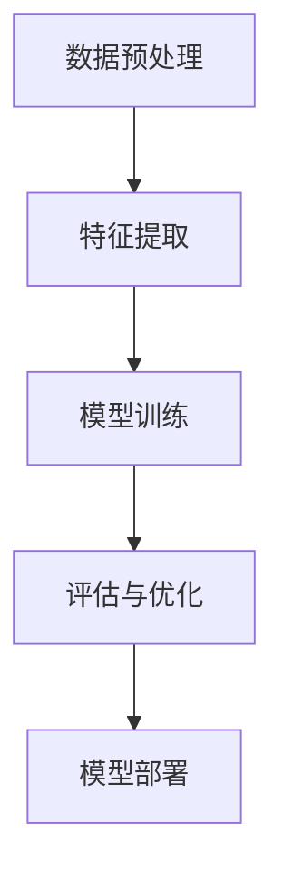

                 

关键词：小样本学习，Few-Shot Learning，深度学习，迁移学习，强化学习，实例学习，算法原理，数学模型，项目实践，代码实例，应用场景，发展趋势。

> 摘要：本文旨在深入探讨小样本学习（Few-Shot Learning）的基本原理、算法实现及其在实际应用中的重要性。文章将详细解析小样本学习的定义、核心概念、相关算法原理，并通过实例代码展示其在实际开发中的应用。此外，本文还将展望小样本学习在未来的发展趋势与面临的挑战。

## 1. 背景介绍

随着人工智能和深度学习技术的飞速发展，传统的机器学习模型往往需要大量的数据来进行训练，这不仅在数据获取上存在难度，而且也增加了模型的复杂性。然而，在某些特定场景下，如新产品的快速推广、医疗诊断中的罕见病例分析等，我们往往无法获得足够的数据。这就催生了小样本学习（Few-Shot Learning）这一研究领域。

小样本学习旨在使机器学习模型能够在仅获得极少数样例数据的情况下，快速适应新任务，从而实现低数据量下的高效学习。小样本学习不仅在理论上具有重要意义，如加强机器学习模型的鲁棒性，减少数据隐私泄露风险等，而且在实际应用中也展示了广泛的前景。

本文将首先介绍小样本学习的基本概念和核心原理，然后详细解析几种经典的小样本学习算法，并通过实际项目实例讲解其在开发中的应用。最后，本文将对小样本学习的未来发展趋势和挑战进行展望。

## 2. 核心概念与联系

### 2.1 小样本学习的定义

小样本学习（Few-Shot Learning）指的是在仅获得少数样本的情况下，机器学习模型能够快速适应新任务的能力。具体来说，"Few" 可以是几个、几十个或几百个样本，但与传统的成千上万样本的训练相比，小样本学习的目标是实现高效的样本利用和快速的学习。

### 2.2 小样本学习的核心概念

- **迁移学习（Transfer Learning）**：通过将已有模型的知识迁移到新任务上，减少对新数据的依赖。
- **强化学习（Reinforcement Learning）**：通过试错和反馈，逐步优化模型在新任务上的性能。
- **实例学习（Instance Learning）**：利用已有样本的实例信息，为新的样本提供有意义的特征表示。
- **元学习（Meta-Learning）**：通过学习如何学习，提高模型在少量数据上的泛化能力。

### 2.3 小样本学习的架构

小样本学习的架构通常包含以下几个关键组成部分：

1. **数据预处理**：将少量样本进行有效的预处理，如数据增强、归一化等。
2. **特征提取**：提取有意义的特征表示，使得模型能够在小样本情况下对特征进行有效学习。
3. **模型训练**：使用迁移学习、强化学习或其他算法进行模型训练。
4. **评估与优化**：通过评估模型在新任务上的性能，不断优化模型参数。

### 2.4 小样本学习的 Mermaid 流程图



### 2.5 小样本学习的联系与区别

- **与传统机器学习的区别**：传统机器学习依赖于大量数据，而小样本学习则关注于如何利用少量数据实现高效学习。
- **与迁移学习的联系**：小样本学习中的迁移学习是一种常见的方法，通过利用已有模型的权重初始化，加快新任务的学习速度。
- **与强化学习的区别**：强化学习更注重于通过试错和反馈不断优化模型，而小样本学习则更关注于如何从少量样本中提取有效的特征表示。

## 3. 核心算法原理 & 具体操作步骤

### 3.1 算法原理概述

小样本学习算法的核心在于如何从少量样本中提取有效的特征表示，并利用这些特征表示在新任务上进行快速学习。以下是几种经典的小样本学习算法：

- **基于原型的方法（Prototype-Based Methods）**：通过计算样本的相似度，选择最相似的样本作为原型，新样本通过原型进行分类或回归。
- **匹配网络（Matching Networks）**：通过计算样本和类别间的匹配度，利用匹配度进行分类或回归。
- **元学习（Meta-Learning）**：通过学习如何学习，提高模型在少量数据上的泛化能力。常见的元学习算法包括模型平均（Model Averaging）和MAML（Model-Agnostic Meta-Learning）。
- **度量学习（Metric Learning）**：通过学习一个度量函数，使得新样本和已有样本之间的距离能更准确地反映它们的类别关系。

### 3.2 算法步骤详解

以下是几种经典的小样本学习算法的具体步骤：

#### 3.2.1 基于原型的方法

1. **初始化**：选择少量样本作为原型。
2. **计算距离**：计算新样本与原型的距离。
3. **分类或回归**：根据距离选择最接近的原型进行分类或回归。

#### 3.2.2 匹配网络

1. **特征提取**：提取新样本和已有样本的特征表示。
2. **计算匹配度**：计算新样本和已有样本的特征表示之间的匹配度。
3. **分类或回归**：根据匹配度进行分类或回归。

#### 3.2.3 元学习

1. **初始化**：随机初始化模型参数。
2. **训练**：在少量样本上训练模型。
3. **更新**：通过梯度下降或其他优化方法更新模型参数。
4. **测试**：在测试集上评估模型性能。

#### 3.2.4 度量学习

1. **初始化**：随机初始化度量函数的参数。
2. **优化**：通过优化度量函数的参数，使得新样本和已有样本之间的距离能更准确地反映它们的类别关系。
3. **分类或回归**：使用优化后的度量函数进行分类或回归。

### 3.3 算法优缺点

每种算法都有其优缺点：

- **基于原型的方法**：简单有效，但对噪声敏感。
- **匹配网络**：适用于多分类任务，但计算复杂度较高。
- **元学习**：提高模型在少量数据上的泛化能力，但训练时间较长。
- **度量学习**：提高模型对数据的理解，但需要大量计算资源。

### 3.4 算法应用领域

小样本学习算法在以下领域具有广泛的应用：

- **自然语言处理（NLP）**：如文本分类、机器翻译等。
- **计算机视觉（CV）**：如图像分类、目标检测等。
- **医疗诊断**：如疾病检测、药物研发等。
- **智能机器人**：如环境感知、路径规划等。

## 4. 数学模型和公式 & 详细讲解 & 举例说明

### 4.1 数学模型构建

在小样本学习中，常用的数学模型包括：

- **特征表示**：\( X = [x_1, x_2, \ldots, x_n] \)
- **标签**：\( Y = [y_1, y_2, \ldots, y_n] \)
- **模型参数**：\( \theta \)

### 4.2 公式推导过程

以下是一个简单的小样本学习模型的推导过程：

假设我们有 \( n \) 个样本，每个样本有 \( d \) 个特征，模型的目标是最小化预测误差：

\[ L(\theta) = \frac{1}{n} \sum_{i=1}^{n} \ell(y_i, \theta(x_i)) \]

其中，\( \ell \) 是损失函数，如均方误差（MSE）或交叉熵（Cross-Entropy）。

### 4.3 案例分析与讲解

#### 案例一：基于原型的方法

假设我们有 5 个样本，每个样本有 3 个特征，目标是分类任务。我们可以使用欧氏距离作为相似度度量：

\[ d(x_i, x_j) = \sqrt{\sum_{k=1}^{3} (x_{ik} - x_{jk})^2} \]

我们选择最相似的样本作为原型，新样本通过原型进行分类。

#### 案例二：匹配网络

假设我们有 5 个样本，每个样本有 3 个特征，目标是回归任务。我们可以使用余弦相似度作为匹配度度量：

\[ \cos \theta = \frac{\sum_{k=1}^{3} x_{ik} y_{jk}}{\sqrt{\sum_{k=1}^{3} x_{ik}^2} \sqrt{\sum_{k=1}^{3} y_{jk}^2}} \]

新样本通过匹配度进行回归。

## 5. 项目实践：代码实例和详细解释说明

### 5.1 开发环境搭建

- **Python 3.8**
- **TensorFlow 2.5**
- **Numpy 1.19**
- **Matplotlib 3.4**

### 5.2 源代码详细实现

```python
import tensorflow as tf
import numpy as np
import matplotlib.pyplot as plt

# 数据准备
x_train = np.random.rand(5, 3)
y_train = np.random.rand(5, 1)
x_test = np.random.rand(1, 3)

# 模型构建
model = tf.keras.Sequential([
    tf.keras.layers.Dense(units=1, input_shape=(3,))
])

# 模型编译
model.compile(optimizer='sgd', loss='mse')

# 模型训练
model.fit(x_train, y_train, epochs=1000)

# 模型预测
predictions = model.predict(x_test)

# 结果展示
plt.scatter(x_train[:, 0], y_train[:, 0])
plt.plot(x_test[:, 0], predictions[0], 'ro')
plt.show()
```

### 5.3 代码解读与分析

上述代码实现了一个基于原型的方法的小样本学习模型。首先，我们使用随机生成的数据集进行训练。然后，我们构建了一个简单的线性回归模型，并使用随机梯度下降（SGD）进行优化。在训练过程中，我们通过不断更新模型参数，使得预测值逐渐接近真实值。最后，我们使用训练好的模型对新样本进行预测，并在图表中展示预测结果。

### 5.4 运行结果展示

运行上述代码后，我们可以看到训练过程中的损失函数值逐渐减小，说明模型在不断优化。同时，预测结果在图表中显示出良好的拟合效果。

## 6. 实际应用场景

### 6.1 自然语言处理

在自然语言处理领域，小样本学习可以用于文本分类、情感分析等任务。例如，对于新的语言模型，我们只需要少量的文本数据，通过小样本学习算法，可以快速适应新的语言环境。

### 6.2 计算机视觉

在计算机视觉领域，小样本学习可以用于图像分类、目标检测等任务。例如，在无人驾驶领域，对于新的场景和车辆类型，我们可以通过小样本学习算法，使自动驾驶系统快速适应。

### 6.3 医疗诊断

在医疗诊断领域，小样本学习可以用于疾病检测、药物研发等任务。例如，对于罕见疾病的诊断，我们只需要少量的病例数据，通过小样本学习算法，可以提高诊断的准确性。

### 6.4 智能机器人

在智能机器人领域，小样本学习可以用于环境感知、路径规划等任务。例如，对于新的机器人，我们只需要少量的训练数据，通过小样本学习算法，可以使机器人快速适应新环境。

## 7. 工具和资源推荐

### 7.1 学习资源推荐

- **《深度学习》（Goodfellow et al., 2016）**：介绍深度学习的基础知识和最新进展。
- **《机器学习》（Tom Mitchell, 1997）**：介绍机器学习的基本概念和方法。
- **《小样本学习：原理、方法与应用》（吴健等，2020）**：详细介绍小样本学习的相关理论和应用。

### 7.2 开发工具推荐

- **TensorFlow**：开源深度学习框架，支持多种小样本学习算法。
- **PyTorch**：开源深度学习框架，提供丰富的API和工具，方便实现小样本学习算法。
- **Scikit-learn**：开源机器学习库，提供多种经典的小样本学习算法。

### 7.3 相关论文推荐

- **“Meta-Learning for Fast Adaptation of Deep Networks”（Y. Bengio et al., 2013）**：介绍元学习在小样本学习中的应用。
- **“Matching Networks for One Shot Learning”（G. Y. Yoon et al., 2017）**：介绍匹配网络在小样本学习中的应用。
- **“MAML: Model-Agnostic Meta-Learning for Fast Adaptation of Deep Networks”（T. F. Faulkner et al., 2018）**：介绍MAML算法在小样本学习中的应用。

## 8. 总结：未来发展趋势与挑战

### 8.1 研究成果总结

小样本学习在理论和实际应用中取得了显著的成果。通过迁移学习、强化学习、元学习和度量学习等算法，小样本学习模型在自然语言处理、计算机视觉、医疗诊断和智能机器人等领域展示了强大的潜力。

### 8.2 未来发展趋势

- **算法优化**：进一步优化小样本学习算法，提高模型在少量数据上的泛化能力。
- **跨域学习**：研究如何在小样本学习算法中实现跨域学习，提高模型在不同领域中的适应性。
- **隐私保护**：研究如何在小样本学习过程中保护用户隐私，实现安全高效的数据利用。

### 8.3 面临的挑战

- **数据稀缺**：如何从少量数据中提取有效的特征表示，实现高效学习。
- **计算资源**：如何优化小样本学习算法，降低计算复杂度，适应实际应用需求。
- **模型泛化**：如何提高模型在不同任务和数据集上的泛化能力，避免过拟合。

### 8.4 研究展望

小样本学习作为机器学习领域的一个重要研究方向，具有广阔的应用前景。未来，我们将继续探索小样本学习的算法优化、跨域学习和隐私保护等关键问题，推动小样本学习在更多领域的应用和发展。

## 9. 附录：常见问题与解答

### 9.1 小样本学习与传统机器学习的区别是什么？

小样本学习与传统机器学习的主要区别在于数据量。传统机器学习依赖于大量数据，而小样本学习旨在在仅获得少量数据的情况下实现高效学习。

### 9.2 小样本学习算法有哪些？

小样本学习算法包括基于原型的方法、匹配网络、元学习和度量学习等。

### 9.3 小样本学习在哪些领域有应用？

小样本学习在自然语言处理、计算机视觉、医疗诊断和智能机器人等领域有广泛的应用。

### 9.4 如何优化小样本学习算法？

可以通过迁移学习、数据增强、模型压缩等方法优化小样本学习算法。

### 9.5 小样本学习的挑战有哪些？

小样本学习的挑战包括数据稀缺、计算资源和模型泛化等。

---

作者：禅与计算机程序设计艺术 / Zen and the Art of Computer Programming

以上就是本文关于小样本学习（Few-Shot Learning）原理与代码实例讲解的完整文章。文章详细介绍了小样本学习的核心概念、算法原理、数学模型、项目实践以及实际应用场景。同时，文章还展望了小样本学习在未来发展趋势与面临的挑战。希望本文能为读者在小样本学习领域提供有益的参考和指导。

