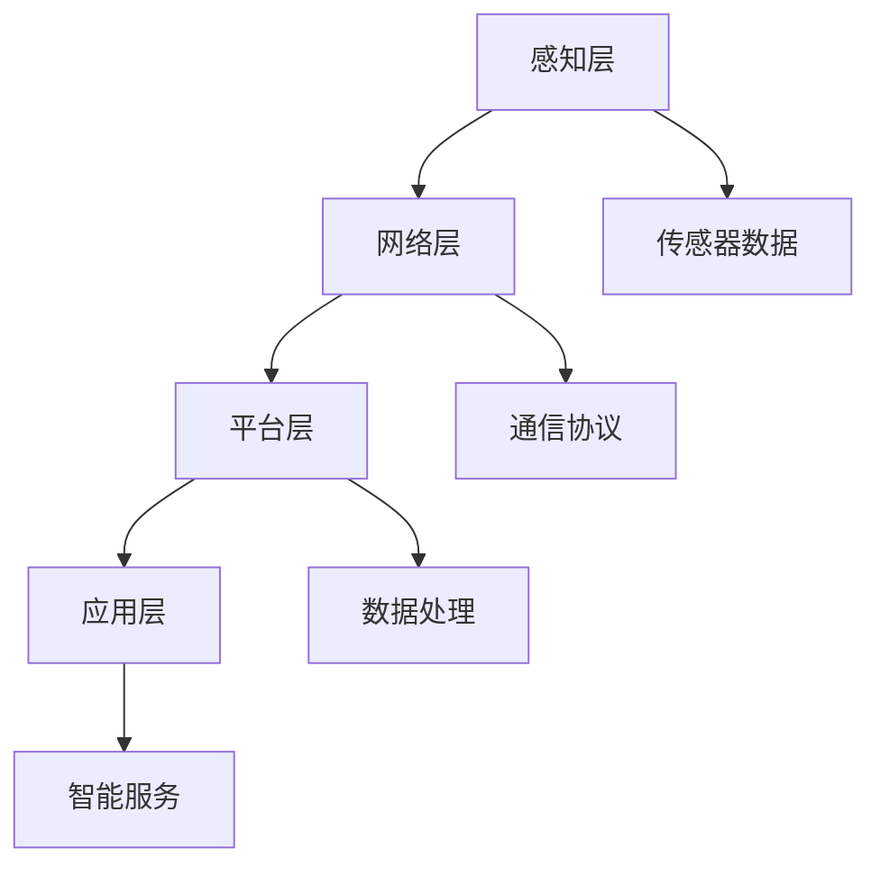

                 

关键词：小米、2024IoT平台、开发面试题、解析、物联网、技术挑战、实践应用、算法原理、项目实践、未来展望。

> 摘要：本文将深入解析小米2024年IoT平台校招开发面试题，涵盖核心算法原理、数学模型、项目实践以及未来应用展望，旨在为物联网开发者提供有价值的参考。

## 1. 背景介绍

物联网（Internet of Things，IoT）作为新一代信息通信技术的核心，正迅速改变着我们的生活方式和商业模式。小米作为全球领先的智能硬件及互联网公司，其IoT平台已成为行业内的重要标杆。本文将围绕小米2024年IoT平台校招开发面试题，深入探讨相关技术话题，帮助开发者应对物联网开发中的各种挑战。

## 2. 核心概念与联系

### 2.1 物联网基础概念

物联网是一种将各种信息传感设备与网络结合起来，实现智能化管理和控制的技术。其核心包括传感器、网络通信、数据处理和智能决策等组成部分。

### 2.2 小米IoT平台架构

小米IoT平台采用分层架构，包括感知层、网络层、平台层和应用层。感知层负责数据采集，网络层负责数据传输，平台层负责数据处理和存储，应用层则为用户提供各类智能服务。

### 2.3 Mermaid 流程图



## 3. 核心算法原理 & 具体操作步骤

### 3.1 算法原理概述

物联网应用中，常用的核心算法包括数据加密、机器学习、数据挖掘等。这些算法用于保障数据安全、实现智能分析和优化。

### 3.2 算法步骤详解

#### 3.2.1 数据加密

数据加密是保障物联网数据安全的关键。常用的加密算法有AES、RSA等。具体步骤如下：

1. 生成密钥。
2. 使用密钥对数据进行加密。
3. 解密数据。

#### 3.2.2 机器学习

机器学习用于实现智能分析和决策。常见算法有KNN、SVM、决策树等。具体步骤如下：

1. 数据预处理。
2. 选择合适的算法。
3. 训练模型。
4. 预测结果。

#### 3.2.3 数据挖掘

数据挖掘用于发现数据中的规律和模式。常见算法有关联规则挖掘、聚类分析、分类分析等。具体步骤如下：

1. 数据预处理。
2. 选择合适的算法。
3. 分析结果。

### 3.3 算法优缺点

- 数据加密：优点是保障数据安全，缺点是加密和解密过程会消耗计算资源。
- 机器学习：优点是实现智能分析，缺点是需要大量数据进行训练。
- 数据挖掘：优点是发现数据中的规律，缺点是需要大量计算资源。

### 3.4 算法应用领域

- 数据加密：应用于智能家居、智能安防等场景。
- 机器学习：应用于智能交通、智能医疗等场景。
- 数据挖掘：应用于电商推荐、智能农业等场景。

## 4. 数学模型和公式 & 详细讲解 & 举例说明

### 4.1 数学模型构建

物联网应用中，常用的数学模型包括马尔可夫链、线性回归、支持向量机等。下面以线性回归为例进行介绍。

### 4.2 公式推导过程

线性回归公式为：

$$y = \beta_0 + \beta_1 \cdot x$$

其中，$y$ 为因变量，$x$ 为自变量，$\beta_0$ 和 $\beta_1$ 为模型参数。

### 4.3 案例分析与讲解

假设我们想预测房屋价格，以房屋面积（$x$）为自变量，以房屋价格（$y$）为因变量。我们可以收集一些数据，使用线性回归模型进行预测。

1. 数据预处理：将数据分为训练集和测试集。
2. 模型训练：使用训练集数据计算参数 $\beta_0$ 和 $\beta_1$。
3. 预测结果：使用测试集数据计算预测价格。

## 5. 项目实践：代码实例和详细解释说明

### 5.1 开发环境搭建

本文以Python为例，介绍物联网开发实践。首先需要安装Python环境和相关库。

```bash
pip install numpy pandas scikit-learn matplotlib
```

### 5.2 源代码详细实现

以下是一个简单的线性回归示例代码：

```python
import numpy as np
import pandas as pd
from sklearn.linear_model import LinearRegression
import matplotlib.pyplot as plt

# 数据预处理
data = pd.read_csv('house_price_data.csv')
X = data['area'].values.reshape(-1, 1)
y = data['price'].values

# 模型训练
model = LinearRegression()
model.fit(X, y)

# 预测结果
y_pred = model.predict(X)

# 可视化
plt.scatter(X, y)
plt.plot(X, y_pred, color='red')
plt.xlabel('Area')
plt.ylabel('Price')
plt.show()
```

### 5.3 代码解读与分析

- 导入相关库。
- 读取数据。
- 分割数据集。
- 训练模型。
- 预测结果。
- 可视化结果。

### 5.4 运行结果展示

运行代码后，会生成一个散点图和一条红色趋势线，表示房屋面积和价格之间的关系。

## 6. 实际应用场景

### 6.1 智能家居

智能家居是物联网应用的重要领域。通过物联网设备，用户可以实现远程控制家中的电器，提高生活质量。

### 6.2 智能交通

智能交通利用物联网技术实现车辆监控、路况分析和交通流量优化，提高交通效率，减少交通事故。

### 6.3 智能医疗

智能医疗通过物联网技术实现医疗设备的联网和数据共享，提高医疗服务的效率和质量。

## 7. 工具和资源推荐

### 7.1 学习资源推荐

- 《物联网技术与应用》
- 《机器学习实战》
- 《数据挖掘：概念与技术》

### 7.2 开发工具推荐

- Python
- Node.js
- Arduino

### 7.3 相关论文推荐

- "A Survey of IoT Security: Attacks, Countermeasures, and Open Problems"
- "Deep Learning for Internet of Things: A Survey"
- "An Overview of Data Mining in IoT: Applications and Challenges"

## 8. 总结：未来发展趋势与挑战

### 8.1 研究成果总结

物联网技术在过去几年取得了显著成果，但仍然存在很多挑战。

### 8.2 未来发展趋势

- 5G技术的普及将推动物联网发展。
- 边缘计算将成为物联网的重要技术趋势。
- 物联网安全将成为重点关注领域。

### 8.3 面临的挑战

- 数据安全与隐私保护。
- 网络协议标准化。
- 跨平台互操作性问题。

### 8.4 研究展望

未来，物联网技术将在更多领域得到应用，实现更加智能和高效的连接。研究人员需要关注物联网安全、隐私保护、边缘计算等领域，为物联网技术的可持续发展贡献力量。

## 9. 附录：常见问题与解答

### 9.1 物联网的定义是什么？

物联网是指通过互联网将各种信息传感设备连接起来，实现智能化管理和控制的技术。

### 9.2 物联网安全有哪些挑战？

物联网安全主要面临数据泄露、设备被攻击、隐私保护等挑战。

### 9.3 如何保证物联网设备的安全？

确保物联网设备的安全需要从硬件、软件、网络等多个方面进行综合防护。

---

### 作者署名

作者：禅与计算机程序设计艺术 / Zen and the Art of Computer Programming

----------------------------------------------------------------

请注意，以上内容仅为示例，实际撰写时需根据具体面试题和实际应用场景进行详细阐述。希望本文能对物联网开发者有所帮助。

