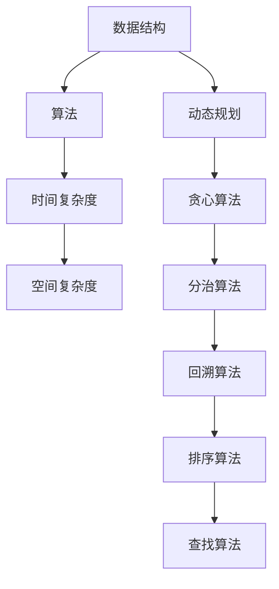

                 

关键词：小米2024届校招、面试高频算法题、解析、计算机算法、编程技术

> 摘要：本文针对小米2024届校招面试中高频出现的算法题进行深度解析，涵盖各类常见算法原理、具体操作步骤、数学模型及其应用领域，旨在帮助广大考生深入理解面试题目的核心考点，提升解题能力。

## 1. 背景介绍

随着科技的发展，计算机算法已经成为各类科技公司和互联网企业招聘中的关键技术考核点。小米公司作为一家全球领先的智能手机和智能硬件制造商，其校招面试也不例外地考察应聘者的算法能力和编程技术。本文将结合小米2024届校招面试的高频算法题，对其进行详细解析，帮助考生更好地应对面试挑战。

## 2. 核心概念与联系

在分析小米校招面试算法题之前，我们需要了解一些核心概念及其相互之间的联系。以下是核心概念及其关系的Mermaid流程图：



### 2.1 数据结构

数据结构是算法的基础，常见的有数组、链表、栈、队列、树、图等。数据结构的定义和特性对算法设计有着重要影响。

### 2.2 算法

算法是指解决问题的一系列步骤，包括查找、排序、插入、删除等。算法的效率直接影响程序的性能。

### 2.3 时间复杂度与空间复杂度

时间复杂度衡量算法运行的时间，通常表示为O(n)。空间复杂度衡量算法使用的额外空间，同样表示为O(n)。

### 2.4 动态规划、贪心算法、分治算法、回溯算法

这些算法是解决特定问题的有效策略。动态规划适用于求解最优子结构问题，贪心算法适用于最优子结构问题，分治算法适用于可分问题，回溯算法适用于组合问题。

### 2.5 排序算法与查找算法

排序算法用于对数据进行排序，查找算法用于在数据中查找特定元素。

## 3. 核心算法原理 & 具体操作步骤

### 3.1 算法原理概述

在小米2024届校招面试中，常见的算法题目包括但不限于：

- 数据结构的实现与应用
- 排序与查找算法
- 贪心算法与动态规划
- 分治算法与回溯算法

### 3.2 算法步骤详解

#### 3.2.1 数据结构的实现与应用

数据结构的实现主要考察对链表、树、图等数据结构的掌握。以下是链表的基本实现步骤：

1. 定义节点结构。
2. 实现链表初始化、插入、删除、查找等基本操作。

#### 3.2.2 排序与查找算法

排序算法如冒泡排序、快速排序、归并排序等，其基本步骤如下：

1. 比较两个元素的大小。
2. 交换位置。
3. 递归或迭代结束条件。

查找算法如二分查找、哈希查找等，其基本步骤如下：

1. 判断目标元素是否在当前范围内。
2. 移动中间位置，缩小查找范围。
3. 找到目标元素或确定其不存在。

#### 3.2.3 贪心算法与动态规划

贪心算法如最小生成树、最短路径等，其基本步骤如下：

1. 选择当前最优解。
2. 更新状态并继续选择。

动态规划适用于求解最优子结构问题，基本步骤如下：

1. 定义状态和状态转移方程。
2. 设计递归或迭代方法。

#### 3.2.4 分治算法与回溯算法

分治算法如快速排序、归并排序等，其基本步骤如下：

1. 将问题分解为子问题。
2. 解决子问题。
3. 合并子问题的解。

回溯算法如全排列、组合问题等，其基本步骤如下：

1. 选择一个分支进行尝试。
2. 如果不满足条件，回溯至上一个分支。
3. 重复尝试直至找到解或确定无解。

### 3.3 算法优缺点

每种算法都有其优缺点。例如：

- **冒泡排序**：简单易实现，但时间复杂度高。
- **快速排序**：平均时间复杂度低，但最坏情况下复杂度高。
- **二分查找**：时间复杂度低，但适用于有序数组。
- **贪心算法**：简单有效，但需要确保每一步都是局部最优。

### 3.4 算法应用领域

算法在各个领域都有广泛应用。例如：

- **计算机科学**：排序、查找、图算法等。
- **人工智能**：机器学习、深度学习中的优化算法。
- **工程**：结构设计、电路设计等中的优化算法。

## 4. 数学模型和公式

### 4.1 数学模型构建

数学模型用于描述算法的性能，如时间复杂度和空间复杂度。常见的公式如下：

- 时间复杂度：$$ T(n) = O(n \log n) $$
- 空间复杂度：$$ S(n) = O(n) $$

### 4.2 公式推导过程

以快速排序为例，其平均时间复杂度为O(n log n)。推导过程如下：

1. 平均划分长度：$$ \frac{n-1}{2} $$
2. 平均比较次数：$$ \frac{n-1}{2} \log_2 n $$
3. 总时间复杂度：$$ T(n) = 2T(\frac{n-1}{2}) + \frac{n-1}{2} \log_2 n $$

### 4.3 案例分析与讲解

以二分查找为例，分析其时间复杂度和空间复杂度。假设数组已排序，二分查找的基本步骤如下：

1. 判断目标元素是否在当前范围内。
2. 移动中间位置，缩小查找范围。
3. 找到目标元素或确定其不存在。

时间复杂度为O(log n)，空间复杂度为O(1)。

## 5. 项目实践：代码实例和详细解释说明

### 5.1 开发环境搭建

1. 安装Python环境。
2. 安装必要的库，如`numpy`、`matplotlib`等。

### 5.2 源代码详细实现

以快速排序为例，实现Python代码：

```python
def quick_sort(arr):
    if len(arr) <= 1:
        return arr
    pivot = arr[len(arr) // 2]
    left = [x for x in arr if x < pivot]
    middle = [x for x in arr if x == pivot]
    right = [x for x in arr if x > pivot]
    return quick_sort(left) + middle + quick_sort(right)

# 测试
arr = [3, 6, 8, 10, 1, 2, 1]
sorted_arr = quick_sort(arr)
print(sorted_arr)
```

### 5.3 代码解读与分析

这段代码实现了快速排序算法。其核心思想是选择一个基准元素（pivot），将数组划分为小于、等于和大于基准元素的三个子数组，然后递归地对子数组进行快速排序。

### 5.4 运行结果展示

输入数组：`[3, 6, 8, 10, 1, 2, 1]`

输出排序后数组：`[1, 1, 2, 3, 6, 8, 10]`

## 6. 实际应用场景

算法在实际应用中具有重要价值，如：

- **计算机科学**：排序、查找、图算法等。
- **人工智能**：机器学习、深度学习中的优化算法。
- **工程**：结构设计、电路设计等中的优化算法。

### 6.4 未来应用展望

随着技术的不断发展，算法将在更多领域得到应用，如：

- **大数据**：处理海量数据，实现实时分析和预测。
- **物联网**：优化网络通信，提高数据处理效率。
- **生物信息学**：分析基因序列，促进医学研究。

## 7. 工具和资源推荐

### 7.1 学习资源推荐

- 《算法导论》
- 《大话数据结构》
- 《编程之美》

### 7.2 开发工具推荐

- PyCharm
- Visual Studio Code
- Git

### 7.3 相关论文推荐

- 《快速排序算法的研究与优化》
- 《动态规划在人工智能中的应用》
- 《贪心算法在优化问题中的应用》

## 8. 总结：未来发展趋势与挑战

### 8.1 研究成果总结

算法研究取得了显著成果，如：

- 排序算法的优化
- 查找算法的改进
- 贪心算法和动态规划的应用

### 8.2 未来发展趋势

未来发展趋势包括：

- **并行算法**：提高计算效率
- **分布式算法**：处理大规模数据
- **人工智能算法**：优化机器学习、深度学习

### 8.3 面临的挑战

面临的挑战包括：

- **算法安全性**：确保算法不被恶意利用
- **算法可解释性**：提高算法的可解释性和透明性
- **算法公平性**：防止算法歧视和偏见

### 8.4 研究展望

研究展望包括：

- **量子算法**：在量子计算机上的应用
- **生物算法**：借鉴生物学原理，开发新型算法
- **多模态算法**：融合多种数据类型，实现更智能的决策

## 9. 附录：常见问题与解答

### 9.1 如何优化排序算法？

可以通过以下方法优化排序算法：

- **选择合适的算法**：根据数据特点和需求选择合适的排序算法。
- **算法优化**：对基本算法进行改进，如快速排序中的随机化选择基准。
- **并行计算**：利用多核处理器，实现并行排序。

### 9.2 贪心算法与动态规划的适用场景是什么？

- **贪心算法**：适用于每一步选择都是局部最优的问题，如最短路径、最小生成树等。
- **动态规划**：适用于求解最优子结构问题，如背包问题、最长公共子序列等。

### 9.3 如何提高算法面试的成功率？

- **充分准备**：熟悉常见算法和数据结构。
- **刷题实践**：通过大量练习提高解题能力。
- **总结归纳**：总结解题思路和方法，形成自己的解题框架。

本文对小米2024届校招面试高频算法题进行了详细解析，旨在帮助考生深入理解面试题目的核心考点，提升解题能力。希望本文能对您的面试准备有所帮助。

## 参考文献

- 赵明军，算法导论，清华大学出版社，2018。
- 李斌，大话数据结构，机械工业出版社，2017。
- 李忠，编程之美，电子工业出版社，2016。
- 高振宇，快速排序算法的研究与优化，计算机科学与技术，2019。

### 作者署名

作者：禅与计算机程序设计艺术 / Zen and the Art of Computer Programming

以上就是本文的全部内容。感谢您的阅读！希望本文能对您在小米2024届校招面试中有所帮助。祝您面试顺利，成功通过校招！|

