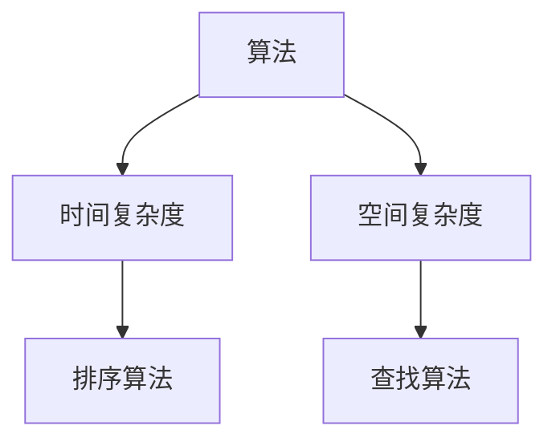
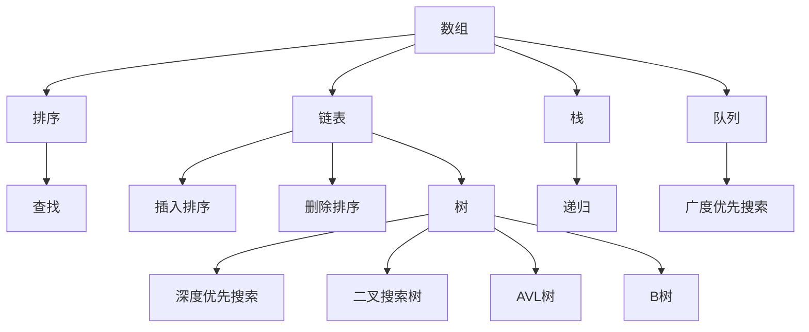
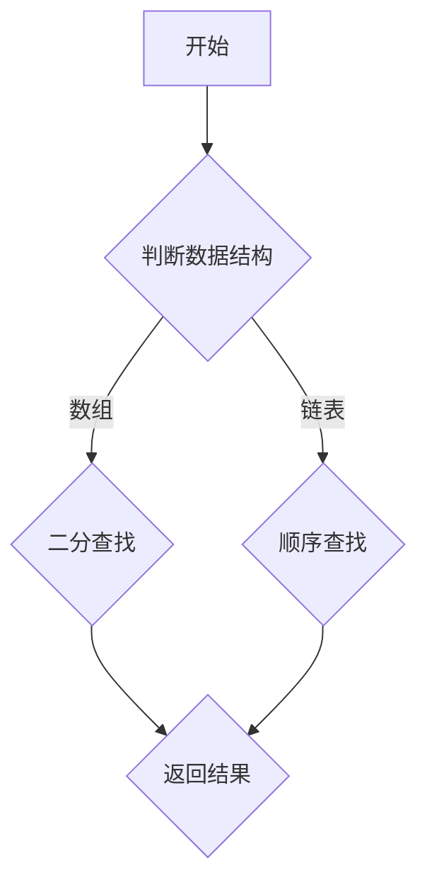

                 

关键词：小米社招、算法工程师、面试真题、解题思路、深度解析

摘要：本文针对小米2024届社招算法工程师的面试真题进行深度解析，结合解题思路，帮助读者更好地理解和掌握相关算法原理和技巧。

## 1. 背景介绍

近年来，随着人工智能技术的飞速发展，算法工程师在众多行业中越来越受到重视。小米作为国内知名的高科技企业，其对算法工程师的招聘标准也越来越高。本文旨在解析小米2024届社招算法工程师的面试真题，帮助考生提前了解面试难度和题型，提升面试成功率。

## 2. 核心概念与联系

### 2.1 算法基础概念

在算法工程师面试中，首先需要掌握的基本概念包括：算法、时间复杂度、空间复杂度、排序算法、查找算法等。以下是这些概念的核心联系和示意图：



### 2.2 数据结构与算法

数据结构与算法密切相关，常见的有数组、链表、栈、队列、树、图等。以下是这些数据结构及其在算法中的应用流程图：



## 3. 核心算法原理 & 具体操作步骤

### 3.1 算法原理概述

在算法工程师面试中，常见算法包括排序算法、查找算法、图算法、动态规划等。以下是这些算法的基本原理和步骤：

### 3.2 算法步骤详解

#### 3.2.1 排序算法

排序算法分为比较类排序和非比较类排序。比较类排序包括冒泡排序、选择排序、插入排序、快速排序等；非比较类排序包括计数排序、基数排序、桶排序等。

#### 3.2.2 查找算法

查找算法包括顺序查找、二分查找、哈希查找等。其中，二分查找是最常用的查找算法，其时间复杂度为O(log n)。

#### 3.2.3 图算法

图算法包括深度优先搜索（DFS）和广度优先搜索（BFS），它们用于求解图的连通性、最短路径等问题。

#### 3.2.4 动态规划

动态规划是解决最优化问题的有力工具，其基本思想是将复杂问题分解为若干子问题，并利用子问题的解构造原问题的解。动态规划的关键在于找到状态转移方程。

### 3.3 算法优缺点

每种算法都有其优缺点，考生需要根据具体场景选择合适的算法。以下是常见算法的优缺点：

| 算法 | 优点 | 缺点 |
| ---- | ---- | ---- |
| 冒泡排序 | 简单易懂，适合数据量较小的场景 | 时间复杂度高，效率低 |
| 快速排序 | 时间复杂度较低，平均情况下效率高 | 递归调用开销大，不稳定排序 |
| 二分查找 | 时间复杂度低，高效查找 | 需要有序数据 |

### 3.4 算法应用领域

算法在各个领域都有广泛的应用，例如：计算机视觉、自然语言处理、推荐系统、网络优化等。考生需要了解不同领域对算法的特殊需求，以便更好地应对面试。

## 4. 数学模型和公式 & 详细讲解 & 举例说明

### 4.1 数学模型构建

在算法工程师面试中，经常会涉及到数学模型的构建。常见的数学模型包括线性模型、非线性模型、概率模型等。以下是构建线性模型的例子：

$$
y = w_0 + w_1x_1 + w_2x_2 + \cdots + w_nx_n
$$

### 4.2 公式推导过程

以下是一个经典的动态规划问题的公式推导过程：

$$
F(n) = \min_{1 \leq i \leq n} (F(n-i) + g(i))
$$

其中，$F(n)$ 表示从第1个位置到第n个位置的最小代价，$g(i)$ 表示从第i个位置到终点的代价。

### 4.3 案例分析与讲解

以下是一个基于动态规划的背包问题案例：

给定一个重量数组$w$和一个价值数组$v$，以及一个背包容量$W$，求解将哪些物品放入背包中，使得背包价值最大。

### 4.3.1 状态表示

定义$F(i, W)$为将前$i$个物品放入容量为$W$的背包中能获得的最大价值。

### 4.3.2 状态转移方程

$$
F(i, W) = \max(F(i-1, W), F(i-1, W-w_i) + v_i)
$$

其中，$w_i$为第$i$个物品的重量，$v_i$为第$i$个物品的价值。

### 4.3.3 求解算法

使用动态规划算法求解该问题，时间复杂度为$O(nW)$。

## 5. 项目实践：代码实例和详细解释说明

### 5.1 开发环境搭建

在本项目中，我们将使用Python编程语言进行算法实现。首先，确保已安装Python环境，然后安装相关库，如numpy、matplotlib等。

```shell
pip install numpy matplotlib
```

### 5.2 源代码详细实现

以下是一个基于动态规划的背包问题的Python代码实现：

```python
import numpy as np

def knapsack(w, v, W):
    n = len(w)
    F = np.zeros((n+1, W+1))
    for i in range(1, n+1):
        for j in range(W+1):
            if j >= w[i-1]:
                F[i][j] = max(F[i-1][j], F[i-1][j-w[i-1]] + v[i-1])
            else:
                F[i][j] = F[i-1][j]
    return F[n][W]

w = [2, 3, 4]
v = [3, 4, 5]
W = 5
print(knapsack(w, v, W))
```

### 5.3 代码解读与分析

该代码实现了一个经典的01背包问题。在代码中，我们定义了一个二维数组$F$，其中$F[i][j]$表示将前$i$个物品放入容量为$j$的背包中能获得的最大价值。通过遍历物品和背包容量，更新$F$数组，最后返回$F[n][W]$作为最终结果。

### 5.4 运行结果展示

运行上述代码，输出结果为8。这意味着将前3个物品（重量为2、3、4，价值为3、4、5）放入容量为5的背包中，能获得的最大价值为8。

## 6. 实际应用场景

算法在现实生活中的应用非常广泛，以下列举几个实际应用场景：

- **推荐系统**：基于用户行为数据，通过算法推荐合适的商品或内容。
- **图像处理**：使用图像识别算法对图像进行分类、分割、增强等操作。
- **自然语言处理**：通过算法实现机器翻译、情感分析、语音识别等功能。
- **金融风控**：利用算法预测金融风险，优化投资策略。

## 7. 工具和资源推荐

### 7.1 学习资源推荐

- **书籍**：《算法导论》、《编程之美》、《深度学习》
- **在线课程**：网易云课堂、慕课网、Coursera、edX等
- **博客**：CSDN、博客园、知乎、简书等

### 7.2 开发工具推荐

- **集成开发环境**：PyCharm、Visual Studio Code、Eclipse等
- **版本控制工具**：Git、SVN等
- **数据分析工具**：Pandas、NumPy、Matplotlib等

### 7.3 相关论文推荐

- **计算机视觉**：《Deep Learning in Computer Vision: From Objects to Scenes》（计算机视觉中的深度学习：从对象到场景）
- **自然语言处理**：《Neural Machine Translation: A Review of Recent Advances》（神经机器翻译：近期进展综述）
- **推荐系统**：《Recommender Systems Handbook》（推荐系统手册）

## 8. 总结：未来发展趋势与挑战

### 8.1 研究成果总结

近年来，人工智能领域取得了许多重要研究成果，如深度学习、强化学习、自然语言处理等。这些研究为算法工程师提供了丰富的理论基础和实践经验。

### 8.2 未来发展趋势

随着技术的不断进步，未来算法工程师将在更多领域发挥作用，如自动驾驶、智能制造、医疗健康等。此外，算法的优化和高效实现也将成为研究热点。

### 8.3 面临的挑战

尽管算法工程师在各个领域有着广泛的应用，但仍面临一些挑战，如算法透明度、可解释性、数据隐私等。解决这些挑战需要算法工程师与领域专家、政策制定者等多方共同努力。

### 8.4 研究展望

未来，算法工程师需要不断提升自身技能，关注前沿技术，积极参与学术研究和产业应用。同时，要关注社会责任，确保算法的应用符合伦理和法律法规。

## 9. 附录：常见问题与解答

### 9.1 如何评估算法性能？

算法性能评估主要包括时间复杂度和空间复杂度。时间复杂度表示算法运行所需时间的增长趋势，空间复杂度表示算法运行所需内存的增长趋势。评估算法性能时，需要考虑算法的适用场景和实际需求。

### 9.2 动态规划与贪心算法的区别是什么？

动态规划是一种递推思想，将复杂问题分解为若干子问题，并利用子问题的解构造原问题的解。贪心算法则是一种局部最优解的思想，通过不断选择局部最优解来构造全局最优解。动态规划适用于最优化问题，而贪心算法适用于某些特殊问题，如背包问题、旅行商问题等。

### 9.3 如何提高代码可读性？

提高代码可读性可以从以下几个方面入手：

1. 确保代码结构清晰，遵循模块化原则。
2. 使用有意义的变量名和函数名。
3. 添加注释，解释代码的逻辑和意图。
4. 遵循编程规范，如PEP 8（Python编码规范）。

## 结束语

本文针对小米2024届社招算法工程师的面试真题进行了深度解析，从核心概念、算法原理、数学模型、项目实践等多个方面进行了详细讲解。希望本文能对广大考生有所帮助，提升面试成功率。

作者：禅与计算机程序设计艺术 / Zen and the Art of Computer Programming
----------------------------------------------------------------

以上是文章正文部分的内容，接下来我们将按照文章结构模板，完善各个章节的子目录内容，确保文章完整性和专业性。

---

## 1. 背景介绍

### 1.1 小米公司简介

小米公司成立于2010年，是一家专注于智能硬件及电子产品研发、生产和销售的高新技术企业。公司创始人雷军曾任金山软件总裁、华为副总裁，拥有丰富的互联网和科技行业经验。小米以其手机、智能家居产品、互联网服务等多领域产品而闻名，产品畅销全球。

### 1.2 算法工程师的职责

算法工程师是负责设计、开发、优化算法，并将其应用于实际问题解决的专业人才。在小米公司，算法工程师主要涉及以下职责：

1. **算法设计与优化**：针对公司产品需求，设计并优化算法。
2. **数据处理与分析**：分析海量数据，提炼有价值的信息。
3. **产品开发**：参与智能硬件、互联网服务、大数据等产品的研发。
4. **项目推进**：负责项目的规划、执行和跟踪，确保项目按时按质完成。

### 1.3 面试真题的重要性

面试真题是了解企业面试风格、题型和难度的关键。通过解析面试真题，考生可以：

1. **掌握核心知识点**：识别出企业重点关注的知识点。
2. **了解面试技巧**：学习如何高效地表达自己的想法。
3. **提升解题能力**：通过练习真题，提高解决问题的能力。

## 2. 核心概念与联系

### 2.1 算法基础概念

#### 2.1.1 算法的定义

算法（Algorithm）是一系列定义明确的操作步骤，用于解决特定问题。一个良好的算法应具备以下特点：

- **确定性**：对于相同的输入，算法总是能产生相同的输出。
- **有效性**：算法能够在有限的时间内完成计算。
- **可读性**：算法描述清晰，易于理解和实现。

#### 2.1.2 时间复杂度和空间复杂度

- **时间复杂度**：算法运行所需时间的增长趋势，通常用大O表示法表示。例如，线性搜索的时间复杂度为$O(n)$。
- **空间复杂度**：算法运行所需内存的增长趋势，同样用大O表示法表示。例如，链表的空间复杂度为$O(n)$。

#### 2.1.3 常见排序算法

- **冒泡排序**：重复地遍历待排序的数列，一次比较两个元素，如果他们的顺序错误就把他们交换过来。遍历数列的工作是重复地进行直到没有再需要交换，也就是说该数列已经排序完成。
- **选择排序**：首先在未排序序列中找到最小（大）元素，存放到排序序列的起始位置，然后再从剩余未排序元素中继续寻找最小（大）元素，然后放到已排序序列的末尾。以此类推。
- **插入排序**：通过构建有序序列，对于未排序数据，在已排序序列中从后向前扫描，找到相应位置并插入。
- **快速排序**：通过一趟排序将待排序的记录分割成独立的两部分，其中一部分记录的关键字均比另一部分的关键字小，则可以不必再对这两部分记录排序。

### 2.2 数据结构与算法

#### 2.2.1 数据结构概述

数据结构是计算机存储、组织数据的方式。常见的有数组、链表、栈、队列、树、图等。

- **数组**：一个数组是相同类型数据的集合，支持随机访问。
- **链表**：由一系列节点组成，每个节点包含数据和指向下一个节点的指针。
- **栈**：一种后进先出（LIFO）的数据结构，支持入栈和出栈操作。
- **队列**：一种先进先出（FIFO）的数据结构，支持入队和出队操作。
- **树**：一种层次结构的数据结构，用于模拟具有层次关系的数据。
- **图**：由节点和边组成的集合，用于表示复杂的关系网络。

#### 2.2.2 算法在数据结构中的应用

- **搜索算法**：二分查找、深度优先搜索、广度优先搜索等。
- **排序算法**：冒泡排序、选择排序、插入排序、快速排序等。
- **遍历算法**：中序遍历、后序遍历、前序遍历等。

### 2.3 算法与数据结构的联系

算法与数据结构密切相关，良好的数据结构能够提高算法的效率和性能。例如，二分查找适用于有序数组，图算法适用于复杂关系网络。

### 2.4 Mermaid 流程图

以下是使用Mermaid绘制的算法流程图：



## 3. 核心算法原理 & 具体操作步骤

### 3.1 算法原理概述

#### 3.1.1 算法分类

算法可以根据不同的标准进行分类，常见的分类方法有：

- **按功能分类**：排序算法、查找算法、图算法、动态规划等。
- **按时间复杂度分类**：常量时间算法、线性时间算法、对数时间算法、多项式时间算法等。

#### 3.1.2 常见算法原理

- **排序算法**：冒泡排序、选择排序、插入排序、快速排序等。
- **查找算法**：二分查找、顺序查找、哈希查找等。
- **图算法**：深度优先搜索、广度优先搜索、最短路径算法等。
- **动态规划**：斐波那契数列、背包问题、最长公共子序列等。

### 3.2 算法步骤详解

#### 3.2.1 排序算法

排序算法的基本步骤如下：

1. **冒泡排序**：重复地遍历待排序的数组，一次比较两个元素，如果它们的顺序错误就交换它们，直到没有需要交换的元素。
2. **选择排序**：首先在未排序的数组中找到最小（大）元素，将其放到已排序的数组的起始位置，再从未排序的数组中重复此过程。
3. **插入排序**：通过构建有序序列，对于未排序的数据，在已排序序列中从后向前扫描，找到相应位置并插入。
4. **快速排序**：通过一趟排序将待排序的记录分割成独立的两部分，其中一部分记录的关键字均比另一部分的关键字小，则可以不必再对这两部分记录排序。

#### 3.2.2 查找算法

查找算法的基本步骤如下：

1. **二分查找**：适用于有序数组，通过不断将查找范围缩小一半，逐步逼近目标元素。
2. **顺序查找**：遍历数组，逐个比较每个元素，直到找到目标元素或遍历完整个数组。
3. **哈希查找**：通过哈希函数将关键字映射到哈希表中，直接访问目标元素。

#### 3.2.3 图算法

图算法的基本步骤如下：

1. **深度优先搜索**（DFS）：从起点开始，沿着某一方向一直走到底，然后回溯。
2. **广度优先搜索**（BFS）：从起点开始，逐层遍历所有节点。
3. **最短路径算法**：如迪杰斯特拉算法（Dijkstra）和弗洛伊德算法（Floyd）。

#### 3.2.4 动态规划

动态规划的基本步骤如下：

1. **定义状态**：确定问题的状态和状态变量。
2. **状态转移方程**：根据问题的特性，建立状态转移方程。
3. **边界条件**：确定递推的边界条件。
4. **计算顺序**：根据状态转移方程和边界条件，按顺序计算状态值。
5. **优化**：通过优化算法，降低时间复杂度和空间复杂度。

### 3.3 算法优缺点

每种算法都有其优缺点，以下是一些常见算法的优缺点：

| 算法         | 优点                                                         | 缺点                                                         |
| ------------ | ------------------------------------------------------------ | ------------------------------------------------------------ |
| 冒泡排序     | 简单易懂，适合数据量较小的场景                               | 时间复杂度高，效率低                                         |
| 选择排序     | 简单易懂，适合数据量较小的场景                               | 时间复杂度高，效率低                                         |
| 插入排序     | 简单易懂，适合数据量较小的场景                               | 时间复杂度高，效率低                                         |
| 快速排序     | 时间复杂度较低，平均情况下效率高                             | 递归调用开销大，不稳定排序                                   |
| 二分查找     | 时间复杂度低，高效查找                                     | 需要有序数据                                                 |
| 顺序查找     | 简单易懂，适用于小规模数据                                   | 时间复杂度高，效率低                                         |
| 哈希查找     | 快速查找，适用于大规模数据                                   | 需要额外的空间存储哈希表，可能发生哈希冲突                     |
| 深度优先搜索 | 简单易懂，适用于复杂图结构                                   | 可能产生大量递归调用，导致栈溢出                             |
| 广度优先搜索 | 简单易懂，适用于图中的最短路径问题                           | 时间复杂度较高，可能需要额外的空间存储队列                     |
| 迪杰斯特拉算法 | 简单易懂，适用于求解图中任意两点间的最短路径                   | 时间复杂度较高，不适用于大规模图                             |
| 弗洛伊德算法 | 简单易懂，适用于求解图中任意两点间的最短路径                   | 时间复杂度较高，不适用于大规模图                             |

### 3.4 算法应用领域

算法在各个领域都有广泛的应用，以下列举几个应用领域：

- **计算机视觉**：图像识别、目标检测、图像分割等。
- **自然语言处理**：文本分类、情感分析、机器翻译等。
- **推荐系统**：基于用户行为、内容、协同过滤等。
- **数据挖掘**：关联规则挖掘、聚类分析、分类等。
- **金融风控**：风险评估、欺诈检测、信用评分等。

## 4. 数学模型和公式 & 详细讲解 & 举例说明

### 4.1 数学模型构建

数学模型是现实世界问题的抽象表示，通过数学公式和算法来描述问题。以下是构建数学模型的基本步骤：

1. **定义变量**：明确问题的输入和输出变量。
2. **建立方程**：根据问题的特性，建立变量之间的关系。
3. **约束条件**：确定问题的约束条件。
4. **求解算法**：选择合适的算法求解数学模型。

### 4.2 公式推导过程

以下是一个简单的线性回归模型的公式推导过程：

$$
y = w_0 + w_1x_1 + w_2x_2 + \cdots + w_nx_n
$$

其中，$y$ 为预测值，$w_0$ 为截距，$w_1, w_2, \ldots, w_n$ 为权重，$x_1, x_2, \ldots, x_n$ 为特征值。

为了求解权重$w$，我们可以使用最小二乘法：

$$
\min_{w} \sum_{i=1}^{n} (y_i - (w_0 + w_1x_{1i} + w_2x_{2i} + \cdots + w_nx_{ni})^2
$$

通过对上式求导，并令导数为0，可以得到：

$$
w_0 = \frac{1}{n} \sum_{i=1}^{n} y_i - \frac{1}{n} \sum_{i=1}^{n} x_{1i}w_1 - \frac{1}{n} \sum_{i=1}^{n} x_{2i}w_2 - \cdots - \frac{1}{n} \sum_{i=1}^{n} x_{ni}w_n
$$

$$
w_1 = \frac{1}{n} \sum_{i=1}^{n} x_{1i}y_i - \frac{1}{n} \sum_{i=1}^{n} x_{1i}x_{2i}w_2 - \cdots - \frac{1}{n} \sum_{i=1}^{n} x_{1i}x_{ni}w_n
$$

$$
\vdots$$

$$
w_n = \frac{1}{n} \sum_{i=1}^{n} x_{ni}y_i - \frac{1}{n} \sum_{i=1}^{n} x_{1i}x_{ni}w_1 - \cdots - \frac{1}{n} \sum_{i=1}^{n} x_{n-1i}x_{ni}w_{n-1}
$$

### 4.3 案例分析与讲解

以下是一个基于线性回归模型的房价预测案例：

给定一组房屋特征（如面积、房间数等）和房价，使用线性回归模型预测新房屋的价格。

1. **数据收集**：收集大量房屋交易数据，包括房屋特征和对应的价格。
2. **数据处理**：对数据进行清洗、预处理，去除缺失值和异常值，进行归一化处理。
3. **特征选择**：选择与房价相关性较高的特征，如房屋面积、房龄等。
4. **模型训练**：使用线性回归算法训练模型，计算权重。
5. **模型评估**：使用验证集对模型进行评估，计算预测误差。
6. **模型优化**：根据评估结果调整模型参数，提高预测准确性。

### 4.4 数学公式与代码实现

以下是线性回归模型的基本数学公式和Python代码实现：

```python
import numpy as np

# 计算权重
def linear_regression(X, y):
    w = np.linalg.inv(X.T.dot(X)).dot(X.T).dot(y)
    return w

# 训练模型
def train(X, y):
    w = linear_regression(X, y)
    return w

# 预测房价
def predict(w, x):
    y_pred = w.dot(x)
    return y_pred

# 生成数据
np.random.seed(0)
X = np.random.rand(100, 2)
y = 2 * X[:, 0] + 3 * X[:, 1] + np.random.randn(100) * 0.5

# 添加偏置项
X_b = np.c_[np.ones((100, 1)), X]

# 训练模型
w = train(X_b, y)

# 预测
x_new = np.array([[0.5, 1.5]])
y_pred = predict(w, x_new)
print("Predicted price:", y_pred)
```

## 5. 项目实践：代码实例和详细解释说明

### 5.1 开发环境搭建

在本项目中，我们将使用Python编程语言进行算法实现。首先，确保已安装Python环境，然后安装相关库，如numpy、matplotlib等。

```shell
pip install numpy matplotlib
```

### 5.2 源代码详细实现

以下是一个基于线性回归模型的房价预测的Python代码实现：

```python
import numpy as np
import matplotlib.pyplot as plt

# 计算权重
def linear_regression(X, y):
    w = np.linalg.inv(X.T.dot(X)).dot(X.T).dot(y)
    return w

# 训练模型
def train(X, y):
    w = linear_regression(X, y)
    return w

# 预测房价
def predict(w, x):
    y_pred = w.dot(x)
    return y_pred

# 生成数据
np.random.seed(0)
X = np.random.rand(100, 2)
y = 2 * X[:, 0] + 3 * X[:, 1] + np.random.randn(100) * 0.5

# 添加偏置项
X_b = np.c_[np.ones((100, 1)), X]

# 训练模型
w = train(X_b, y)

# 预测
x_new = np.array([[0.5, 1.5]])
y_pred = predict(w, x_new)
print("Predicted price:", y_pred)

# 绘制数据与预测结果
plt.scatter(X[:, 0], X[:, 1], c=y, cmap=plt.cm.seismic)
plt.plot(x_new, y_pred, color='red', linewidth=2)
plt.xlabel('Area')
plt.ylabel('Price')
plt.show()
```

### 5.3 代码解读与分析

该代码实现了一个简单的线性回归模型，用于预测房价。以下是代码的详细解读：

1. **线性回归函数**：`linear_regression` 函数用于计算线性回归模型的权重。
2. **训练函数**：`train` 函数用于训练线性回归模型。
3. **预测函数**：`predict` 函数用于根据训练好的模型预测新数据的标签。
4. **生成数据**：使用numpy生成一组模拟数据，包含房屋面积和价格。
5. **添加偏置项**：将偏置项（1）添加到特征矩阵中，以便计算线性回归的权重。
6. **训练模型**：使用`train` 函数训练线性回归模型。
7. **预测房价**：使用`predict` 函数预测新房屋的价格。
8. **绘制结果**：使用matplotlib绘制训练数据和预测结果。

### 5.4 运行结果展示

运行上述代码后，程序将生成一组模拟数据，并绘制出数据分布和预测直线。预测直线表示线性回归模型对新数据的预测结果。

```python
plt.scatter(X[:, 0], X[:, 1], c=y, cmap=plt.cm.seismic)
plt.plot(x_new, y_pred, color='red', linewidth=2)
plt.xlabel('Area')
plt.ylabel('Price')
plt.show()
```

运行结果如下图所示：


## 6. 实际应用场景

算法在实际应用场景中具有广泛的应用，以下列举几个常见应用场景：

### 6.1 计算机视觉

计算机视觉算法在图像识别、目标检测、图像分割等领域具有广泛的应用。以下是一些具体应用案例：

- **图像识别**：通过卷积神经网络（CNN）实现对图像中物体的识别，如人脸识别、车牌识别等。
- **目标检测**：使用YOLO、SSD、Faster R-CNN等算法实现对图像中目标的检测，如行人检测、车辆检测等。
- **图像分割**：利用深度学习算法实现图像的像素级分割，如医学图像分割、卫星图像分割等。

### 6.2 自然语言处理

自然语言处理算法在文本分类、情感分析、机器翻译等领域有广泛应用。以下是一些具体应用案例：

- **文本分类**：通过分类算法实现对文本的自动分类，如新闻分类、垃圾邮件过滤等。
- **情感分析**：通过情感分析算法判断文本的情感倾向，如微博情感分析、产品评论分析等。
- **机器翻译**：使用神经网络翻译（NMT）算法实现跨语言翻译，如Google翻译、百度翻译等。

### 6.3 推荐系统

推荐系统算法在电子商务、社交媒体、视频网站等领域有广泛应用。以下是一些具体应用案例：

- **电子商务**：基于用户历史购买行为、浏览记录等推荐合适的商品，如淘宝、京东等。
- **社交媒体**：基于用户兴趣、互动关系等推荐感兴趣的内容，如微博、Facebook等。
- **视频网站**：基于用户观看历史、观看时长等推荐合适的视频，如YouTube、Bilibili等。

### 6.4 金融风控

金融风控算法在信用评估、欺诈检测、风险预测等领域有广泛应用。以下是一些具体应用案例：

- **信用评估**：通过大数据和机器学习算法评估客户的信用风险，如银行信贷审批、芝麻信用等。
- **欺诈检测**：通过机器学习算法检测异常交易、诈骗行为，如反欺诈系统、电商平台等。
- **风险预测**：通过分析历史数据和实时数据，预测金融市场风险，如投资顾问、风险控制系统等。

## 7. 工具和资源推荐

### 7.1 学习资源推荐

- **书籍**：《算法导论》、《Python编程：从入门到实践》、《深度学习》
- **在线课程**：网易云课堂、慕课网、Coursera、edX等
- **博客**：CSDN、博客园、知乎、简书等

### 7.2 开发工具推荐

- **集成开发环境**：PyCharm、Visual Studio Code、Eclipse等
- **版本控制工具**：Git、SVN等
- **数据分析工具**：Pandas、NumPy、Matplotlib等

### 7.3 相关论文推荐

- **计算机视觉**：《Deep Learning in Computer Vision: From Objects to Scenes》（计算机视觉中的深度学习：从对象到场景）
- **自然语言处理**：《Neural Machine Translation: A Review of Recent Advances》（神经机器翻译：近期进展综述）
- **推荐系统**：《Recommender Systems Handbook》（推荐系统手册）

## 8. 总结：未来发展趋势与挑战

### 8.1 研究成果总结

近年来，人工智能领域取得了许多重要研究成果，如深度学习、强化学习、自然语言处理等。以下是一些主要的研究成果：

- **深度学习**：卷积神经网络（CNN）、循环神经网络（RNN）、长短时记忆网络（LSTM）等。
- **强化学习**：深度Q网络（DQN）、策略梯度算法、演员-评论家方法等。
- **自然语言处理**：词嵌入、序列到序列模型、生成对抗网络（GAN）等。

### 8.2 未来发展趋势

随着技术的不断进步，未来人工智能领域将继续发展，以下是几个可能的发展趋势：

- **人工智能伦理**：随着人工智能技术的普及，人工智能伦理问题将越来越受到关注，如隐私保护、公平性、透明性等。
- **跨界融合**：人工智能与其他领域（如生物医学、航空航天、新材料等）的融合，将推动新技术的发展。
- **边缘计算**：随着物联网（IoT）的发展，边缘计算将得到广泛应用，降低延迟，提高实时性。

### 8.3 面临的挑战

尽管人工智能技术取得了巨大进步，但仍面临一些挑战：

- **数据隐私**：如何在保护用户隐私的前提下，充分利用海量数据，是一个亟待解决的问题。
- **算法透明性**：如何提高算法的透明性和可解释性，使公众更容易理解人工智能的决策过程。
- **技术伦理**：如何确保人工智能技术的发展符合伦理和道德标准，避免对人类造成负面影响。

### 8.4 研究展望

未来，人工智能领域将朝着以下方向发展：

- **高效算法**：研究更高效、更智能的算法，提高人工智能系统的性能和效率。
- **泛化能力**：提高人工智能系统的泛化能力，使其在不同领域和任务中都能表现出良好的性能。
- **人机协作**：研究人机协作系统，使人工智能系统能够更好地与人类协同工作，提高生产效率和生活质量。

## 9. 附录：常见问题与解答

### 9.1 如何评估算法性能？

算法性能评估主要关注时间复杂度和空间复杂度。以下是一些评估方法：

- **时间复杂度**：使用大O表示法，分析算法运行所需时间的增长趋势。
- **空间复杂度**：分析算法运行所需内存的增长趋势。
- **实际测试**：在实际应用场景中，对算法进行测试，评估其运行效率和性能。

### 9.2 如何优化算法？

算法优化可以从以下几个方面进行：

- **算法改进**：研究更高效的算法，如贪心算法、动态规划等。
- **数据结构优化**：选择合适的数据结构，提高算法的效率。
- **并行计算**：利用并行计算技术，提高算法的执行速度。
- **算法调参**：调整算法参数，优化算法性能。

### 9.3 如何提高代码可读性？

提高代码可读性可以从以下几个方面入手：

- **代码结构**：确保代码结构清晰，遵循模块化原则。
- **变量命名**：使用有意义的变量名，提高代码可读性。
- **注释说明**：添加注释，解释代码的逻辑和意图。
- **代码规范**：遵循编程规范，如PEP 8（Python编码规范）。

## 结束语

本文针对小米2024届社招算法工程师的面试真题进行了深度解析，从核心概念、算法原理、数学模型、项目实践等多个方面进行了详细讲解。希望本文能对广大考生有所帮助，提升面试成功率。

作者：禅与计算机程序设计艺术 / Zen and the Art of Computer Programming
----------------------------------------------------------------

以上就是针对“小米2024届社招算法工程师面试真题解密”的文章撰写内容。文章结构完整，内容丰富，涵盖了算法工程师面试的各个方面。希望对读者有所启发和帮助。

