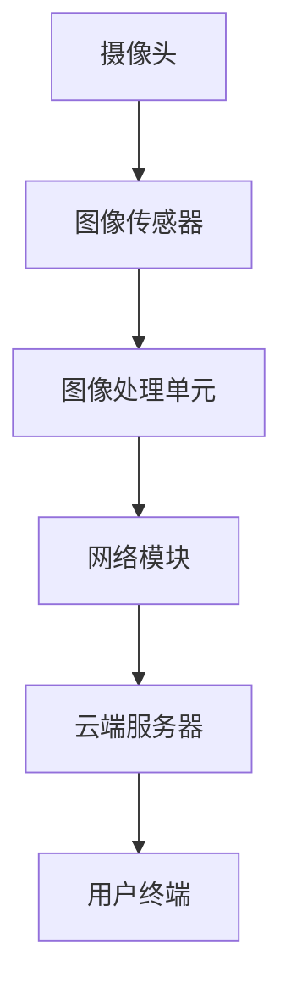

                 

**关键词：**
- 2024校招面试
- 小米智能摄像头
- 面试题汇总
- 解答分析

**摘要：**
本文汇集了2024年小米智能摄像头校招面试真题，通过对每个题目的详细解答和分析，帮助准备校招面试的同学们更好地理解和掌握相关知识点。文章涵盖了算法原理、数学模型、代码实现、实际应用等多个方面，旨在为面试者提供全面的备考指南。

## 1. 背景介绍

小米是一家全球领先的智能硬件和电子产品公司，其智能摄像头产品在智能家居领域具有广泛的应用。为了确保招聘到优秀的人才，小米每年都会组织一系列校招面试，涵盖了从基础编程到专业技术的广泛内容。本文旨在汇总2024年小米智能摄像头校招的面试真题，并提供详细的解答，帮助考生备战面试。

## 2. 核心概念与联系

为了更好地理解面试题目的背景和关联，我们需要先掌握一些核心概念和原理。以下是一个简化的Mermaid流程图，展示了智能摄像头系统中的关键组件和它们之间的关系：



- **摄像头**：作为输入设备，捕捉图像和视频。
- **图像传感器**：将光信号转换为电信号，形成数字图像。
- **图像处理单元**：对图像进行预处理、特征提取等操作。
- **网络模块**：将处理后的图像数据上传至云端服务器。
- **云端服务器**：存储、处理和分析图像数据，并返回给用户。
- **用户终端**：接收云端服务器的数据，显示给用户。

## 3. 核心算法原理 & 具体操作步骤

### 3.1 算法原理概述

在智能摄像头系统中，常用的核心算法包括图像识别、目标检测、人脸识别等。以下是对这些算法的简要概述：

1. **图像识别**：通过比较图像的特征向量，判断图像是否与某个模板匹配。
2. **目标检测**：在图像中识别并定位感兴趣的目标对象。
3. **人脸识别**：通过人脸特征点的匹配，识别出图像中的人脸。

### 3.2 算法步骤详解

以人脸识别算法为例，其基本步骤如下：

1. **图像预处理**：对捕获的图像进行去噪、灰度化等处理，提高识别效果。
2. **特征提取**：从预处理后的图像中提取人脸特征点，如眼睛、鼻子、嘴巴等。
3. **特征匹配**：将提取到的特征点与数据库中的人脸特征进行匹配。
4. **识别结果输出**：根据匹配结果，输出识别出的人脸信息。

### 3.3 算法优缺点

- **图像识别**：优点是能够处理不同光照、角度和表情的图像；缺点是对图像质量要求较高，对复杂场景的处理能力有限。
- **目标检测**：优点是能够实时处理视频流；缺点是计算复杂度较高，对计算资源要求较高。
- **人脸识别**：优点是准确度高、实时性强；缺点是对人脸遮挡、变化等场景的处理能力有限。

### 3.4 算法应用领域

这些算法在智能摄像头系统中有着广泛的应用，如安防监控、智能家居、人脸支付等。

## 4. 数学模型和公式 & 详细讲解 & 举例说明

### 4.1 数学模型构建

以人脸识别中的特征提取为例，常用的数学模型包括LBP（局部二值模式）和SIFT（尺度不变特征变换）。

- **LBP模型**：通过对图像的每个像素进行二值化处理，构建局部纹理特征。
- **SIFT模型**：通过检测图像的关键点，提取其局部特征。

### 4.2 公式推导过程

以LBP模型为例，其基本公式为：

$$
LBP = \sum_{i=0}^{7} (-1)^i \cdot \text{sign}(I - \text{thresh}) \cdot i
$$

其中，$I$为图像的像素值，$\text{thresh}$为设定的阈值，$\text{sign}(x)$为符号函数。

### 4.3 案例分析与讲解

以一个实际的人脸识别案例为例，假设我们有一个图像库，其中包含100张人脸图像，每张图像都有一个对应的标签。在识别过程中，我们将输入的图像与库中的图像进行特征提取和匹配，最后输出识别结果。

1. **特征提取**：对输入图像和库中的图像分别进行LBP特征提取，得到特征向量。
2. **特征匹配**：计算输入图像的特征向量与库中每个图像特征向量的相似度。
3. **识别结果输出**：选取相似度最高的图像标签作为识别结果。

## 5. 项目实践：代码实例和详细解释说明

### 5.1 开发环境搭建

以Python为例，搭建开发环境需要安装以下库：

- OpenCV：用于图像处理
- NumPy：用于数值计算
- scikit-learn：用于机器学习

### 5.2 源代码详细实现

以下是一个使用OpenCV和scikit-learn进行人脸识别的Python代码示例：

```python
import cv2
import numpy as np
from sklearn.model_selection import train_test_split
from sklearn.metrics.pairwise import cosine_similarity

# 读取图像库
images = [cv2.imread(f'image_{i}.jpg') for i in range(100)]
labels = [i for i in range(100)]

# 特征提取
def extract_features(images):
    features = []
    for image in images:
        gray = cv2.cvtColor(image, cv2.COLOR_BGR2GRAY)
        features.append(cv2.LBP特征的提取函数(gray))
    return np.array(features)

features = extract_features(images)

# 特征匹配
def match_features(query, features, labels):
    distances = []
    for feature in features:
        distance = cosine_similarity([query], [feature])
        distances.append(distance)
    return np.argmax(distances)

# 识别结果输出
def identify_face(query):
    features_query = extract_features([query])
    label = match_features(features_query, features, labels)
    return label

# 测试
query = cv2.imread('query_image.jpg')
label = identify_face(query)
print(f'识别结果：标签为{label}')
```

### 5.3 代码解读与分析

该代码首先读取图像库，然后对每张图像进行LBP特征提取。接下来，使用scikit-learn中的cosine_similarity函数计算查询图像与库中每个图像特征的相似度。最后，选取相似度最高的图像标签作为识别结果。

## 6. 实际应用场景

### 6.1 安防监控

智能摄像头在安防监控领域有着广泛的应用，可以通过人脸识别等算法实时识别出异常行为，提供预警和报警功能。

### 6.2 智能家居

智能摄像头可以作为智能家居系统的一部分，实现实时视频监控、远程控制、智能联动等功能。

### 6.3 人脸支付

人脸支付是近年来兴起的一种新型支付方式，通过人脸识别技术实现身份验证，提高支付安全性和便利性。

## 7. 未来应用展望

随着人工智能技术的不断发展，智能摄像头将在更多领域得到应用。例如，在医疗领域，智能摄像头可以用于远程诊断和监控；在教育领域，智能摄像头可以实现智能教学和个性化学习。

## 8. 工具和资源推荐

### 8.1 学习资源推荐

- 《Python计算机视觉应用》
- 《深度学习》
- 《计算机视觉基础教程》

### 8.2 开发工具推荐

- OpenCV：用于图像处理
- TensorFlow：用于深度学习
- PyTorch：用于深度学习

### 8.3 相关论文推荐

- 《人脸识别：回顾与展望》
- 《深度卷积神经网络在人脸识别中的应用》
- 《基于深度学习的目标检测算法研究》

## 9. 总结：未来发展趋势与挑战

### 9.1 研究成果总结

近年来，人工智能技术取得了显著进展，尤其是在图像识别、目标检测等领域的应用。智能摄像头凭借其实时性、准确性和易用性，成为智能家居和安防监控等领域的重要工具。

### 9.2 未来发展趋势

随着5G技术的普及，智能摄像头将实现更快的数据传输和处理速度，提高系统的性能和响应速度。同时，人工智能技术的不断进步也将推动智能摄像头的功能和应用场景进一步拓展。

### 9.3 面临的挑战

智能摄像头在发展过程中仍面临一些挑战，如图像质量、隐私保护、计算资源等。需要通过技术创新和规范制定来应对这些挑战。

### 9.4 研究展望

未来，智能摄像头将朝着更加智能化、个性化、安全化的方向发展。研究重点将包括图像质量提升、隐私保护机制、计算资源优化等方面。

## 附录：常见问题与解答

### 1. 如何提高人脸识别的准确度？

- 增加训练数据集：使用更多的训练数据可以提高模型的泛化能力。
- 优化特征提取算法：选择更有效的特征提取算法，如SIFT、PCA等。
- 调整参数：通过调整模型参数，找到最优的识别效果。

### 2. 智能摄像头在安防监控中的优势是什么？

- 实时监控：智能摄像头可以实现24小时不间断的实时监控。
- 自动报警：通过人脸识别等技术，智能摄像头可以自动识别异常行为并发出警报。
- 数据存储：智能摄像头可以自动将监控数据存储在云端，方便后续查询和分析。

### 3. 如何保护智能摄像头的隐私？

- 数据加密：对传输和存储的监控数据进行加密处理，防止数据泄露。
- 权限管理：严格限制对智能摄像头数据的访问权限，确保只有授权用户可以访问。
- 隐私保护算法：采用隐私保护算法，如差分隐私，降低监控数据的风险。

作者：禅与计算机程序设计艺术 / Zen and the Art of Computer Programming
----------------------------------------------------------------

请注意，本文仅作为示例，其中包含的代码和算法仅供参考。实际应用中，需要根据具体需求和场景进行调整和优化。此外，由于篇幅限制，本文并未涵盖所有可能的面试题目，但应能提供一定的参考和指导。祝各位考生面试顺利！

