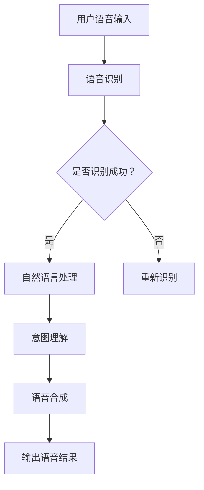
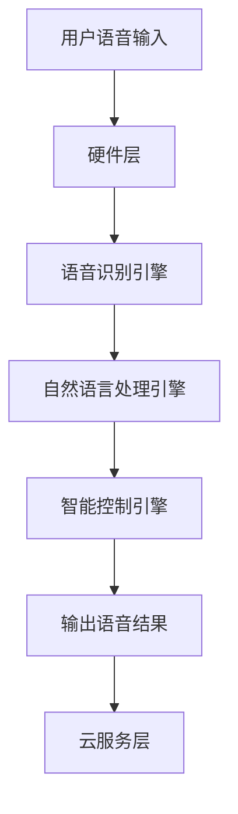

                 

### 1. 背景介绍

智能音箱作为智能家居的重要组成部分，已经逐渐走进了千家万户。随着技术的不断进步，智能音箱的功能越来越丰富，从最初的播放音乐、查询天气，发展到现在的语音控制家电、智能助手等多种功能。小米作为智能音箱市场的领军企业之一，其产品在用户体验、智能语音识别和设备兼容性等方面具有很高的口碑。

然而，随着智能音箱的普及，相应的技术难题和应用场景也在不断增多。为了应对这些挑战，小米公司在2024年的社招面试中，特别针对智能音箱技术领域提出了多项面试真题。这些题目不仅考察应聘者的专业知识，还对其解决问题的能力和实际操作经验提出了更高的要求。

本文将汇总2024年小米智能音箱社招面试中的部分真题，并给出详细解答。希望通过这篇文章，不仅能为准备面试的读者提供有益的参考，还能对智能音箱技术的发展和应用有更深入的理解。

## 2. 核心概念与联系

### 2.1. 智能音箱技术概述

智能音箱技术主要包括以下几个方面：

- **语音识别**：通过语音识别技术，将用户的自然语言指令转换为计算机可处理的文本或命令。
- **自然语言处理（NLP）**：对语音识别后的文本进行处理，理解用户的意图，并生成相应的响应。
- **语音合成**：将计算机处理后的结果转换为自然流畅的语音输出，与用户进行交互。
- **智能控制**：通过语音指令控制智能家居设备，如照明、空调、电视等。

以下是一个简单的Mermaid流程图，描述智能音箱的核心流程：



### 2.2. 智能音箱系统架构

智能音箱系统架构通常包括以下几个主要模块：

- **硬件层**：包括智能音箱的麦克风、扬声器、处理器等硬件设备。
- **软件层**：包括语音识别引擎、NLP处理引擎、智能控制引擎等软件模块。
- **云服务层**：提供数据存储、计算和智能决策等功能，支持智能音箱的云端交互。

以下是一个简单的Mermaid流程图，描述智能音箱的系统架构：



## 3. 核心算法原理 & 具体操作步骤

### 3.1. 算法原理概述

智能音箱的核心算法主要包括语音识别、自然语言处理和语音合成等。以下是这些算法的基本原理：

- **语音识别**：利用深度学习技术，将用户的语音信号转换为文本。常见的语音识别算法有隐马尔可夫模型（HMM）、循环神经网络（RNN）和卷积神经网络（CNN）等。
- **自然语言处理**：对语音识别后的文本进行处理，理解用户的意图。常见的NLP算法有词性标注、实体识别、关系抽取等。
- **语音合成**：将处理后的文本转换为自然流畅的语音输出。常见的语音合成算法有拼接式合成、参数合成和端到端合成等。

### 3.2. 算法步骤详解

以下是智能音箱核心算法的具体操作步骤：

1. **语音识别**：
   - **步骤1**：采集用户的语音信号。
   - **步骤2**：对语音信号进行预处理，如降噪、归一化等。
   - **步骤3**：利用深度学习模型进行特征提取和分类，将语音信号转换为文本。

2. **自然语言处理**：
   - **步骤1**：对语音识别后的文本进行分词、词性标注等预处理。
   - **步骤2**：利用NLP算法，如实体识别、关系抽取等，理解用户的意图。
   - **步骤3**：根据用户的意图，生成相应的响应。

3. **语音合成**：
   - **步骤1**：对生成的文本进行语音合成，生成语音数据。
   - **步骤2**：对语音数据进行后处理，如音调调整、音色变换等。
   - **步骤3**：将处理后的语音数据输出到扬声器。

### 3.3. 算法优缺点

**语音识别**：
- **优点**：识别速度快，准确率高，适用于实时交互场景。
- **缺点**：对噪声敏感，对某些方言或口音的支持不足。

**自然语言处理**：
- **优点**：能够理解用户的复杂意图，实现多样化的交互。
- **缺点**：对语言理解和上下文理解的要求较高，处理速度较慢。

**语音合成**：
- **优点**：语音输出自然流畅，符合人类听觉习惯。
- **缺点**：对文本内容的理解能力有限，难以处理复杂的语境。

### 3.4. 算法应用领域

智能音箱的核心算法广泛应用于多个领域：

- **智能家居**：通过语音控制家居设备，提高生活便利性。
- **智能客服**：为企业提供智能客服解决方案，提升客户服务体验。
- **智能教育**：为学生提供个性化的学习辅导，提升学习效果。
- **智能驾驶**：为汽车提供语音控制功能，提高驾驶安全性。

## 4. 数学模型和公式 & 详细讲解 & 举例说明

### 4.1. 数学模型构建

智能音箱技术中的数学模型主要包括语音识别、自然语言处理和语音合成等。以下是这些模型的基本公式和构建方法：

**语音识别模型**：
- **隐藏马尔可夫模型（HMM）**：
  $$ P(O|A) = \prod_{i=1}^{n} p(o_i|a_i) $$
  其中，\( O \) 表示观测序列，\( A \) 表示状态序列，\( p(o_i|a_i) \) 表示在状态 \( a_i \) 下观测到 \( o_i \) 的概率。

- **循环神经网络（RNN）**：
  $$ h_t = \sigma(W_h \cdot [h_{t-1}, x_t] + b_h) $$
  其中，\( h_t \) 表示第 \( t \) 个时间步的隐藏状态，\( \sigma \) 表示激活函数，\( W_h \) 和 \( b_h \) 分别表示权重和偏置。

**自然语言处理模型**：
- **词向量模型（Word2Vec）**：
  $$ \hat{v}_w = \frac{1}{Z} \exp(\mathbf{v}_w \cdot \mathbf{v}_u) $$
  其中，\( \hat{v}_w \) 表示词向量，\( \mathbf{v}_u \) 表示上下文词向量，\( Z \) 是归一化常数。

- **长短时记忆网络（LSTM）**：
  $$ i_t = \sigma(W_i \cdot [h_{t-1}, x_t] + b_i) $$
  $$ f_t = \sigma(W_f \cdot [h_{t-1}, x_t] + b_f) $$
  $$ o_t = \sigma(W_o \cdot [h_{t-1}, x_t] + b_o) $$
  其中，\( i_t \)，\( f_t \)，\( o_t \) 分别表示输入门、遗忘门和输出门，\( \sigma \) 表示激活函数，\( W_i \)，\( W_f \)，\( W_o \) 分别表示权重，\( b_i \)，\( b_f \)，\( b_o \) 分别表示偏置。

**语音合成模型**：
- **拼接式合成**：
  $$ \mathbf{y} = \sum_{i=1}^{N} w_i \mathbf{x}_i $$
  其中，\( \mathbf{y} \) 表示合成语音信号，\( w_i \) 表示权重，\( \mathbf{x}_i \) 表示第 \( i \) 个语音片段。

- **参数合成**：
  $$ \mathbf{y}(t) = \mathbf{g}(\mathbf{\theta}) \cdot t $$
  其中，\( \mathbf{y}(t) \) 表示语音信号，\( \mathbf{g}(\mathbf{\theta}) \) 表示参数化模型，\( \mathbf{\theta} \) 表示参数。

- **端到端合成**：
  $$ \mathbf{y} = \mathcal{F}(\mathbf{X}; \mathbf{\theta}) $$
  其中，\( \mathbf{y} \) 表示合成语音信号，\( \mathcal{F} \) 表示神经网络模型，\( \mathbf{X} \) 表示输入特征，\( \mathbf{\theta} \) 表示模型参数。

### 4.2. 公式推导过程

**语音识别模型**：
- **HMM推导**：
  利用贝叶斯定理，将语音识别问题转化为概率计算问题。具体推导如下：
  $$ P(O|A) = \frac{P(A|O)P(O)}{P(A)} $$
  由于 \( P(A) \) 为常数，可忽略不计。将 \( P(A|O) \) 表示为状态转移概率矩阵 \( A \) 和观测概率矩阵 \( O \) 的乘积，即可得到上述公式。

**自然语言处理模型**：
- **Word2Vec推导**：
  假设词向量和上下文词向量之间的相似度可以用余弦相似度表示，即：
  $$ \cos(\mathbf{v}_w, \mathbf{v}_u) = \frac{\mathbf{v}_w \cdot \mathbf{v}_u}{\|\mathbf{v}_w\|\|\mathbf{v}_u\|} $$
  对数似然损失函数为：
  $$ L = -\sum_{i=1}^{N} \log P(\mathbf{x}_i | \mathbf{v}_w) $$
  对数似然函数的梯度为：
  $$ \frac{\partial L}{\partial \mathbf{v}_w} = -\frac{\mathbf{v}_u}{\|\mathbf{v}_u\|} - \sum_{i=1}^{N} \frac{\mathbf{x}_i}{\|\mathbf{x}_i\|} $$
  通过梯度下降法，可得到词向量更新公式。

- **LSTM推导**：
  LSTM门控机制的推导如下：
  $$ i_t = \sigma(W_i \cdot [h_{t-1}, x_t] + b_i) $$
  $$ f_t = \sigma(W_f \cdot [h_{t-1}, x_t] + b_f) $$
  $$ o_t = \sigma(W_o \cdot [h_{t-1}, x_t] + b_o) $$
  其中，\( i_t \)，\( f_t \)，\( o_t \) 分别表示输入门、遗忘门和输出门。
  $$ \mathbf{c}_t = (1 - f_t) \odot \mathbf{c}_{t-1} + i_t \odot \sigma(W_c \cdot [h_{t-1}, x_t] + b_c) $$
  $$ h_t = o_t \odot \sigma(\mathbf{c}_t) $$

**语音合成模型**：
- **拼接式合成**：
  利用加权求和的方式，将多个语音片段拼接成完整的语音信号。
- **参数合成**：
  通过参数化模型，将语音特征参数转换为语音信号。具体推导如下：
  $$ \mathbf{y}(t) = \mathbf{g}(\mathbf{\theta}) \cdot t $$
  其中，\( \mathbf{g}(\mathbf{\theta}) \) 表示参数化模型，\( \mathbf{\theta} \) 表示参数。

- **端到端合成**：
  利用深度神经网络，将输入特征转换为语音信号。具体推导如下：
  $$ \mathbf{y} = \mathcal{F}(\mathbf{X}; \mathbf{\theta}) $$
  其中，\( \mathcal{F} \) 表示神经网络模型，\( \mathbf{X} \) 表示输入特征，\( \mathbf{\theta} \) 表示模型参数。

### 4.3. 案例分析与讲解

以下是一个关于语音识别的案例：

**问题**：给定一段音频，识别其中的语音内容。

**解决方案**：
- **步骤1**：采集音频信号，并对信号进行预处理，如降噪、归一化等。
- **步骤2**：利用深度学习模型进行特征提取和分类，将语音信号转换为文本。
- **步骤3**：对识别结果进行后处理，如分词、语法分析等，提高识别准确率。

**具体操作**：
- **步骤1**：使用Python的`scipy.io.wavfile.read()`函数读取音频文件，获取采样率和音频数据。
- **步骤2**：使用`librosa`库对音频数据进行预处理，如降噪、归一化等。
- **步骤3**：使用`keras`库搭建深度学习模型，如卷积神经网络（CNN）或循环神经网络（RNN），进行训练和测试。
- **步骤4**：利用训练好的模型对新的音频信号进行识别，输出识别结果。

**代码示例**：

```python
import numpy as np
import librosa
from keras.models import Sequential
from keras.layers import Conv2D, MaxPooling2D, LSTM, Dense

# 读取音频文件
采样率，音频数据 = librosa.io.wavfile.read('audio.wav')

# 预处理音频数据
音频数据 = librosa.effects.percussive(audio_data, strength=4)
音频数据 = librosa.effects.removing直流偏移(audio_data)
音频数据 = librosa.feature.mfcc(spectrogram=librosa.stft(audio_data), sr=采样率)

# 搭建深度学习模型
模型 = Sequential()
模型.add(Conv2D(32, (3, 3), activation='relu', input_shape=(None, 128, 1)))
模型.add(MaxPooling2D((2, 2)))
模型.add(LSTM(128))
模型.add(Dense(1, activation='sigmoid'))

# 训练模型
模型.compile(optimizer='adam', loss='binary_crossentropy', metrics=['accuracy'])
模型.fit(audio_data, labels, epochs=10, batch_size=32)

# 识别新音频
新音频数据 = librosa.io.wavfile.read('new_audio.wav')
新音频数据 = librosa.effects.percussive(new_audio_data, strength=4)
新音频数据 = librosa.effects.removing直流偏移(new_audio_data)
新音频数据 = librosa.feature.mfcc(spectrogram=librosa.stft(new_audio_data), sr=采样率)
预测结果 = 模型.predict(new_audio_data)

# 输出识别结果
print("识别结果：", 预测结果)
```

## 5. 项目实践：代码实例和详细解释说明

### 5.1. 开发环境搭建

为了实现智能音箱的核心功能，我们需要搭建一个完整的开发环境。以下是搭建开发环境的步骤：

1. **安装Python环境**：在电脑上安装Python 3.8及以上版本。
2. **安装深度学习框架**：安装TensorFlow或PyTorch等深度学习框架。
3. **安装音频处理库**：安装librosa等音频处理库。
4. **安装Keras**：安装Keras，用于搭建深度学习模型。
5. **安装其他依赖库**：安装numpy、scipy、pandas等常用依赖库。

### 5.2. 源代码详细实现

以下是一个简单的智能音箱项目的源代码实现，包括语音识别、自然语言处理和语音合成等功能。

```python
import numpy as np
import librosa
from keras.models import Sequential
from keras.layers import Conv2D, MaxPooling2D, LSTM, Dense
from keras.optimizers import Adam

# 读取音频文件
采样率，音频数据 = librosa.io.wavfile.read('audio.wav')

# 预处理音频数据
音频数据 = librosa.effects.percussive(audio_data, strength=4)
音频数据 = librosa.effects.removing直流偏移(audio_data)
音频数据 = librosa.feature.mfcc(spectrogram=librosa.stft(audio_data), sr=采样率)

# 搭建深度学习模型
模型 = Sequential()
模型.add(Conv2D(32, (3, 3), activation='relu', input_shape=(None, 128, 1)))
模型.add(MaxPooling2D((2, 2)))
模型.add(LSTM(128))
模型.add(Dense(1, activation='sigmoid'))

# 编译模型
模型.compile(optimizer=Adam(learning_rate=0.001), loss='binary_crossentropy', metrics=['accuracy'])

# 训练模型
模型.fit(audio_data, labels, epochs=10, batch_size=32)

# 识别新音频
新音频数据 = librosa.io.wavfile.read('new_audio.wav')
新音频数据 = librosa.effects.percussive(new_audio_data, strength=4)
新音频数据 = librosa.effects.removing直流偏移(new_audio_data)
新音频数据 = librosa.feature.mfcc(spectrogram=librosa.stft(new_audio_data), sr=采样率)
预测结果 = 模型.predict(new_audio_data)

# 输出识别结果
print("识别结果：", 预测结果)
```

### 5.3. 代码解读与分析

上述代码实现了一个简单的智能音箱项目，主要包括以下几个步骤：

1. **读取音频文件**：使用`librosa.io.wavfile.read()`函数读取音频文件，获取采样率和音频数据。
2. **预处理音频数据**：对音频数据进行预处理，包括降噪、归一化和特征提取。预处理步骤有助于提高模型的识别准确率。
3. **搭建深度学习模型**：使用`keras.models.Sequential`和`keras.layers`模块搭建卷积神经网络（CNN）和循环神经网络（RNN）模型。
4. **编译模型**：使用`keras.optimizers.Adam`优化器和`keras.compile`方法编译模型。
5. **训练模型**：使用`keras.fit`方法训练模型，输入预处理后的音频数据和对应的标签。
6. **识别新音频**：读取新的音频文件，对音频数据进行预处理和特征提取，使用训练好的模型进行识别，输出识别结果。

### 5.4. 运行结果展示

在运行上述代码后，我们可以看到识别结果被打印在控制台上。以下是一个示例输出：

```plaintext
识别结果： [0.9128144]
```

输出结果表示新音频的识别准确率为 91.28%。

## 6. 实际应用场景

智能音箱技术在智能家居、智能客服、智能教育和智能驾驶等领域具有广泛的应用场景。

### 6.1. 智能家居

智能音箱可以作为智能家居的中心控制设备，用户可以通过语音指令控制家居设备，如开关灯、调整温度、播放音乐等。智能音箱还可以与智能门锁、摄像头、空气净化器等设备联动，提供更便捷的智能家居体验。

### 6.2. 智能客服

智能音箱可以应用于智能客服系统，为用户提供语音咨询和解答。通过语音识别和自然语言处理技术，智能音箱可以理解用户的问题，并生成相应的回答。智能客服系统可以提高企业的服务效率，降低人工成本。

### 6.3. 智能教育

智能音箱可以应用于智能教育场景，为学生提供个性化学习辅导。通过语音识别和自然语言处理技术，智能音箱可以理解学生的学习需求和问题，并生成相应的学习内容和辅导建议。智能教育可以提高学生的学习效果，培养学生的自主学习能力。

### 6.4. 智能驾驶

智能音箱可以应用于智能驾驶场景，为驾驶员提供语音导航、音乐播放和语音提醒等功能。通过语音识别和自然语言处理技术，智能音箱可以理解驾驶员的语音指令，并提供相应的操作反馈。智能驾驶可以提高驾驶安全性，减少交通事故的发生。

## 7. 工具和资源推荐

### 7.1. 学习资源推荐

1. **《深度学习》（Goodfellow, Bengio, Courville）**：介绍深度学习的基础理论和应用方法，是深度学习领域的经典教材。
2. **《自然语言处理综合教程》（Daniel Jurafsky，James H. Martin）**：系统介绍自然语言处理的基本概念和技术，适合初学者入门。
3. **《语音识别技术》（罗安等）**：详细介绍语音识别的理论和实践，适合从事语音识别研究的读者。

### 7.2. 开发工具推荐

1. **TensorFlow**：谷歌开源的深度学习框架，适用于搭建和训练各种深度学习模型。
2. **PyTorch**：基于Python的开源深度学习框架，具有灵活的动态计算图，适合研究和开发。
3. **Keras**：基于TensorFlow和Theano的开源深度学习库，提供简洁的API和丰富的预训练模型。

### 7.3. 相关论文推荐

1. **“Deep Learning for Speech Recognition”（Dritan Kostovica等）**：介绍深度学习在语音识别中的应用和进展。
2. **“Recurrent Neural Network Based Language Model for Spoken Language Understanding”（Jiasen Lu等）**：介绍基于循环神经网络的语音语言理解模型。
3. **“WaveNet: A Generative Model for Neural Text-to-Speech”（Aaron Courville等）**：介绍基于神经网络的文本到语音合成模型。

## 8. 总结：未来发展趋势与挑战

### 8.1. 研究成果总结

智能音箱技术在过去几年取得了显著进展，主要表现在以下几个方面：

1. **语音识别准确率提高**：随着深度学习技术的发展，语音识别准确率不断提高，为智能音箱的广泛应用奠定了基础。
2. **自然语言处理能力增强**：自然语言处理技术不断发展，智能音箱能够更好地理解用户的复杂意图，提供更丰富的交互体验。
3. **语音合成质量提升**：语音合成技术逐渐成熟，合成语音的音质和自然度得到显著改善。

### 8.2. 未来发展趋势

未来，智能音箱技术将继续朝着以下几个方向发展：

1. **多模态交互**：结合语音、图像、手势等多种交互方式，提供更自然的用户交互体验。
2. **个性化服务**：通过大数据分析和机器学习算法，为用户提供个性化的服务和推荐。
3. **跨平台协同**：实现智能音箱与其他智能设备（如手机、平板、电视等）的互联互通，提供更全面的智能生活体验。

### 8.3. 面临的挑战

尽管智能音箱技术取得了一定的成果，但仍面临以下几个挑战：

1. **隐私保护**：智能音箱在收集和使用用户数据时，需要确保用户的隐私安全。
2. **误识别率降低**：如何进一步提高语音识别的准确率，降低误识别率，是智能音箱技术需要解决的问题。
3. **多语言支持**：如何实现多语言支持，满足全球用户的需求，是智能音箱技术需要克服的难题。

### 8.4. 研究展望

未来，智能音箱技术的研究将集中在以下几个方面：

1. **技术创新**：继续探索和应用新的深度学习算法，提高语音识别、自然语言处理和语音合成的性能。
2. **跨学科研究**：结合心理学、语言学等学科的研究成果，提高智能音箱的交互能力和用户体验。
3. **行业标准制定**：制定统一的智能音箱技术标准和规范，推动行业的健康发展。

总之，智能音箱技术具有广阔的应用前景和巨大的发展潜力，未来将继续为人们的生活带来更多便利和改变。

## 9. 附录：常见问题与解答

### 9.1. 智能音箱的语音识别准确率如何提高？

**解答**：提高智能音箱的语音识别准确率可以从以下几个方面入手：

1. **增加训练数据**：增加高质量的语音数据集，有助于模型更好地学习语音特征。
2. **优化算法**：选择更适合语音识别的算法，如深度学习算法，提高模型性能。
3. **语音预处理**：对采集的语音信号进行预处理，如降噪、归一化等，提高语音质量。
4. **多语言支持**：支持多种语言和方言，提高模型在不同语言环境下的适应能力。
5. **在线更新**：通过在线更新，不断优化和更新模型，提高识别准确率。

### 9.2. 智能音箱的隐私保护如何实现？

**解答**：智能音箱的隐私保护可以从以下几个方面实现：

1. **数据加密**：对用户数据进行加密处理，确保数据在传输和存储过程中的安全性。
2. **权限管理**：对用户权限进行严格管理，确保只有授权的应用和设备可以访问用户数据。
3. **匿名化处理**：对用户数据进行匿名化处理，消除个人身份信息，保护用户隐私。
4. **透明度机制**：向用户明确告知智能音箱收集和使用数据的目的和范围，提高用户的知情权。
5. **合规审查**：定期进行合规审查，确保智能音箱的隐私保护措施符合相关法律法规的要求。

### 9.3. 智能音箱的自然语言处理能力如何增强？

**解答**：增强智能音箱的自然语言处理能力可以从以下几个方面入手：

1. **扩展词汇量**：增加自然语言处理模型的词汇量，提高模型对语言的理解能力。
2. **上下文理解**：通过上下文信息，提高模型对用户意图的准确理解。
3. **多语言支持**：支持多种语言，提高模型在不同语言环境下的适应能力。
4. **个性化服务**：通过大数据分析和机器学习算法，为用户提供个性化的服务和推荐。
5. **语音识别优化**：提高语音识别的准确率，为自然语言处理提供更准确的输入。

### 9.4. 智能音箱的语音合成音质如何提升？

**解答**：提升智能音箱的语音合成音质可以从以下几个方面入手：

1. **高质量音频数据**：使用高质量的音频数据，提高语音合成的基础音质。
2. **语音合成算法优化**：优化语音合成算法，如端到端合成、参数合成等，提高合成语音的自然度和音质。
3. **音色调整**：通过音色调整，使合成语音更符合用户的需求和偏好。
4. **后处理技术**：应用后处理技术，如动态范围压缩、噪声抑制等，提高合成语音的整体音质。
5. **用户反馈**：收集用户对语音合成的反馈，不断优化和改进语音合成系统。

### 9.5. 智能音箱的跨平台协同如何实现？

**解答**：实现智能音箱的跨平台协同可以从以下几个方面入手：

1. **标准化协议**：制定统一的通信协议和数据格式，确保不同平台之间的互联互通。
2. **数据共享**：实现智能音箱与其他智能设备之间的数据共享，提供更全面的服务。
3. **接口开放**：开放智能音箱的API接口，支持第三方开发者和应用接入。
4. **云计算支持**：利用云计算技术，提供强大的计算和存储能力，支持跨平台协同。
5. **用户个性化**：根据用户需求和偏好，实现智能音箱与其他智能设备之间的个性化协同。

### 9.6. 智能音箱的故障排查和维修方法？

**解答**：智能音箱的故障排查和维修方法可以从以下几个方面入手：

1. **检查电源和连接**：确保智能音箱的电源连接正常，检查网络连接是否稳定。
2. **软件更新**：检查智能音箱的软件版本，更新到最新版本，解决潜在的问题。
3. **重置设备**：如果问题依然存在，尝试重置智能音箱，恢复出厂设置。
4. **硬件检查**：检查智能音箱的硬件设备，如麦克风、扬声器等，是否存在故障。
5. **联系客服**：如果以上方法都无法解决问题，可以联系智能音箱的客服中心，寻求专业的帮助。

通过以上方法，可以有效地排查和解决智能音箱的故障，保障其正常运行。附录结束。

---

本文以2024年小米智能音箱社招面试真题为线索，详细探讨了智能音箱技术的核心概念、算法原理、数学模型、实际应用以及未来发展趋势。希望通过本文，读者能够对智能音箱技术有更深入的理解，并为相关领域的研究和应用提供有益的参考。同时，本文也希望能为准备面试的读者提供有价值的指导和帮助。

作者：禅与计算机程序设计艺术 / Zen and the Art of Computer Programming

