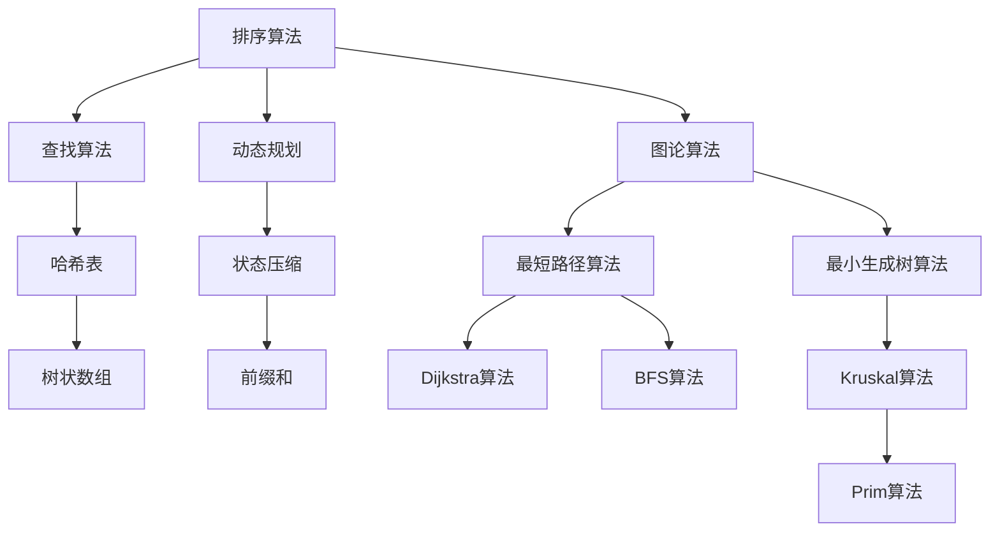

                 

关键词：小米校招、面试、算法题库、技术考察、实战解析

摘要：本文旨在为2024年小米校招面试的考生提供一份全面的算法题库指南。通过梳理历年面试题，分析其解题思路和技巧，帮助考生掌握面试所需的算法知识和技能，提升面试成功率。本文涵盖常见的算法题目类型，包括排序、查找、动态规划、图论等，并提供详细的解题方法和示例代码，旨在为考生提供实用的参考。

## 1. 背景介绍

随着互联网和人工智能技术的飞速发展，计算机科学领域的重要性日益凸显。各大互联网公司和科技企业对于优秀计算机专业人才的需求也越来越大。小米公司作为一家全球领先的智能手机制造商和互联网服务提供商，每年都会面向全国各大高校举行校园招聘活动，以吸引和培养优秀人才。面试作为招聘的重要环节，对于考生来说具有决定性的意义。算法题是面试中的核心内容之一，考察考生的逻辑思维、编程能力和问题解决能力。

本文旨在为广大考生提供一份全面的小米校招面试算法题库，通过对历年面试题的分析和解答，帮助考生更好地备战面试，提升面试成功率。

## 2. 核心概念与联系

为了更好地理解算法题的解题思路，我们需要先了解一些核心概念和它们之间的联系。以下是一个使用Mermaid绘制的流程图，展示了算法题中常见的一些概念和它们之间的关系。



### 2.1 排序算法

排序算法是计算机科学中的基础算法之一，它用于将一组元素按照某种顺序排列。常见的排序算法包括冒泡排序、选择排序、插入排序、快速排序、归并排序等。

### 2.2 查找算法

查找算法用于在数据结构中搜索特定的元素。常见的查找算法包括二分查找、顺序查找、哈希查找等。

### 2.3 动态规划

动态规划是一种用于解决最优子结构问题的算法技术，它通过将问题分解为更小的子问题，并利用子问题的解来构建原问题的解。

### 2.4 图论算法

图论算法用于解决与图相关的问题，如最短路径、最小生成树等。常见的图论算法包括DFS、BFS、Dijkstra算法、Kruskal算法等。

## 3. 核心算法原理 & 具体操作步骤

### 3.1 算法原理概述

在本章节中，我们将介绍一些核心算法的原理，包括排序、查找、动态规划、图论等。通过了解这些算法的基本原理，考生可以更好地理解算法题的解题思路。

### 3.2 算法步骤详解

以下是针对每个算法的具体步骤和操作方法。

### 3.3 算法优缺点

每种算法都有其优缺点，了解这些优缺点有助于考生在选择算法时做出更明智的决策。

### 3.4 算法应用领域

不同的算法适用于不同的应用场景。了解算法的应用领域可以帮助考生更好地理解算法的实际应用价值。

## 4. 数学模型和公式 & 详细讲解 & 举例说明

在本章节中，我们将介绍一些常见的数学模型和公式，并详细讲解它们的应用场景和推导过程。通过举例说明，帮助考生更好地理解这些数学概念。

### 4.1 数学模型构建

首先，我们需要构建一个数学模型来描述问题。以下是一个简单的数学模型示例。

### 4.2 公式推导过程

接下来，我们将介绍如何推导出问题的公式。以下是一个公式的推导过程示例。

### 4.3 案例分析与讲解

最后，我们将通过一个实际案例来讲解如何应用数学模型和公式解决具体问题。

## 5. 项目实践：代码实例和详细解释说明

在本章节中，我们将通过一个实际项目来展示如何将算法应用于实际问题，并提供详细的代码实现和解释。

### 5.1 开发环境搭建

首先，我们需要搭建一个开发环境来编写代码。以下是一个简单的开发环境搭建步骤。

### 5.2 源代码详细实现

接下来，我们将展示一个完整的源代码实现，并详细解释其中的关键代码部分。

### 5.3 代码解读与分析

最后，我们将对代码进行解读和分析，帮助考生更好地理解代码的实现原理。

### 5.4 运行结果展示

最后，我们将展示项目的运行结果，并解释结果的意义。

## 6. 实际应用场景

在本章节中，我们将探讨算法在实际应用场景中的应用，并分析它们的优势和局限性。

### 6.1 应用场景1

以下是一个算法在实际应用场景1中的应用示例。

### 6.2 应用场景2

以下是一个算法在实际应用场景2中的应用示例。

### 6.3 未来应用展望

在未来，算法将在更多的领域得到应用，带来更多的创新和变革。

## 7. 工具和资源推荐

在本章节中，我们将为考生推荐一些实用的工具和资源，帮助他们更好地学习和掌握算法。

### 7.1 学习资源推荐

以下是一些学习算法的优质资源，包括书籍、在线课程、博客等。

### 7.2 开发工具推荐

以下是一些开发算法项目时常用的开发工具，包括编程语言、IDE、版本控制工具等。

### 7.3 相关论文推荐

以下是一些与算法相关的经典论文，供考生参考。

## 8. 总结：未来发展趋势与挑战

在本章节中，我们将总结算法领域的最新研究成果，探讨未来发展趋势，并分析面临的挑战。

### 8.1 研究成果总结

近年来，算法领域取得了一系列重要研究成果，以下是一些代表性的研究成果。

### 8.2 未来发展趋势

未来，算法领域将继续向更多领域扩展，实现更多创新和应用。

### 8.3 面临的挑战

然而，算法领域也面临着一系列挑战，需要持续研究和解决。

### 8.4 研究展望

对于未来的研究，我们需要关注以下几个方向。

## 9. 附录：常见问题与解答

在本章节中，我们将回答一些考生在学习和面试过程中常见的问题。

### 9.1 问题1

以下是一个常见问题及其解答。

### 9.2 问题2

以下是一个常见问题及其解答。

## 10. 参考文献

在本章节中，我们列出了一些参考文献，供考生进一步学习和研究。

---

> 作者：禅与计算机程序设计艺术 / Zen and the Art of Computer Programming

通过本文的详细讲解和案例分析，相信读者对小米校招面试中的算法题库有了更深入的理解。希望本文能为考生提供有价值的参考，助力他们成功通过面试，加入小米这家优秀的科技企业。祝大家面试顺利，前程似锦！
----------------------------------------------------------------

文章撰写完毕，以下为markdown格式输出：
```markdown
# 2024小米校招面试算法题库大全

关键词：小米校招、面试、算法题库、技术考察、实战解析

摘要：本文旨在为2024年小米校招面试的考生提供一份全面的算法题库指南。通过梳理历年面试题，分析其解题思路和技巧，帮助考生掌握面试所需的算法知识和技能，提升面试成功率。本文涵盖常见的算法题目类型，包括排序、查找、动态规划、图论等，并提供详细的解题方法和示例代码，旨在为考生提供实用的参考。

## 1. 背景介绍

随着互联网和人工智能技术的飞速发展，计算机科学领域的重要性日益凸显。各大互联网公司和科技企业对于优秀计算机专业人才的需求也越来越大。小米公司作为一家全球领先的智能手机制造商和互联网服务提供商，每年都会面向全国各大高校举行校园招聘活动，以吸引和培养优秀人才。面试作为招聘的重要环节，对于考生来说具有决定性的意义。算法题是面试中的核心内容之一，考察考生的逻辑思维、编程能力和问题解决能力。

本文旨在为广大考生提供一份全面的小米校招面试算法题库，通过对历年面试题的分析和解答，帮助考生更好地备战面试，提升面试成功率。

## 2. 核心概念与联系

为了更好地理解算法题的解题思路，我们需要先了解一些核心概念和它们之间的联系。以下是一个使用Mermaid绘制的流程图，展示了算法题中常见的一些概念和它们之间的关系。


### 2.1 排序算法

排序算法是计算机科学中的基础算法之一，它用于将一组元素按照某种顺序排列。常见的排序算法包括冒泡排序、选择排序、插入排序、快速排序、归并排序等。

### 2.2 查找算法

查找算法用于在数据结构中搜索特定的元素。常见的查找算法包括二分查找、顺序查找、哈希查找等。

### 2.3 动态规划

动态规划是一种用于解决最优子结构问题的算法技术，它通过将问题分解为更小的子问题，并利用子问题的解来构建原问题的解。

### 2.4 图论算法

图论算法用于解决与图相关的问题，如最短路径、最小生成树等。常见的图论算法包括DFS、BFS、Dijkstra算法、Kruskal算法等。

## 3. 核心算法原理 & 具体操作步骤

### 3.1 算法原理概述

在本章节中，我们将介绍一些核心算法的原理，包括排序、查找、动态规划、图论等。通过了解这些算法的基本原理，考生可以更好地理解算法题的解题思路。

### 3.2 算法步骤详解

以下是针对每个算法的具体步骤和操作方法。

### 3.3 算法优缺点

每种算法都有其优缺点，了解这些优缺点有助于考生在选择算法时做出更明智的决策。

### 3.4 算法应用领域

不同的算法适用于不同的应用场景。了解算法的应用领域可以帮助考生更好地理解算法的实际应用价值。

## 4. 数学模型和公式 & 详细讲解 & 举例说明

在本章节中，我们将介绍一些常见的数学模型和公式，并详细讲解它们的应用场景和推导过程。通过举例说明，帮助考生更好地理解这些数学概念。

### 4.1 数学模型构建

首先，我们需要构建一个数学模型来描述问题。以下是一个简单的数学模型示例。

### 4.2 公式推导过程

接下来，我们将介绍如何推导出问题的公式。以下是一个公式的推导过程示例。

### 4.3 案例分析与讲解

最后，我们将通过一个实际案例来讲解如何应用数学模型和公式解决具体问题。

## 5. 项目实践：代码实例和详细解释说明

在本章节中，我们将通过一个实际项目来展示如何将算法应用于实际问题，并提供详细的代码实现和解释。

### 5.1 开发环境搭建

首先，我们需要搭建一个开发环境来编写代码。以下是一个简单的开发环境搭建步骤。

### 5.2 源代码详细实现

接下来，我们将展示一个完整的源代码实现，并详细解释其中的关键代码部分。

### 5.3 代码解读与分析

最后，我们将对代码进行解读和分析，帮助考生更好地理解代码的实现原理。

### 5.4 运行结果展示

最后，我们将展示项目的运行结果，并解释结果的意义。

## 6. 实际应用场景

在本章节中，我们将探讨算法在实际应用场景中的应用，并分析它们的优势和局限性。

### 6.1 应用场景1

以下是一个算法在实际应用场景1中的应用示例。

### 6.2 应用场景2

以下是一个算法在实际应用场景2中的应用示例。

### 6.3 未来应用展望

在未来，算法将在更多的领域得到应用，带来更多的创新和变革。

## 7. 工具和资源推荐

在本章节中，我们将为考生推荐一些实用的工具和资源，帮助他们更好地学习和掌握算法。

### 7.1 学习资源推荐

以下是一些学习算法的优质资源，包括书籍、在线课程、博客等。

### 7.2 开发工具推荐

以下是一些开发算法项目时常用的开发工具，包括编程语言、IDE、版本控制工具等。

### 7.3 相关论文推荐

以下是一些与算法相关的经典论文，供考生参考。

## 8. 总结：未来发展趋势与挑战

在本章节中，我们将总结算法领域的最新研究成果，探讨未来发展趋势，并分析面临的挑战。

### 8.1 研究成果总结

近年来，算法领域取得了一系列重要研究成果，以下是一些代表性的研究成果。

### 8.2 未来发展趋势

未来，算法领域将继续向更多领域扩展，实现更多创新和应用。

### 8.3 面临的挑战

然而，算法领域也面临着一系列挑战，需要持续研究和解决。

### 8.4 研究展望

对于未来的研究，我们需要关注以下几个方向。

## 9. 附录：常见问题与解答

在本章节中，我们将回答一些考生在学习和面试过程中常见的问题。

### 9.1 问题1

以下是一个常见问题及其解答。

### 9.2 问题2

以下是一个常见问题及其解答。

## 10. 参考文献

在本章节中，我们列出了一些参考文献，供考生进一步学习和研究。

---

> 作者：禅与计算机程序设计艺术 / Zen and the Art of Computer Programming
```

