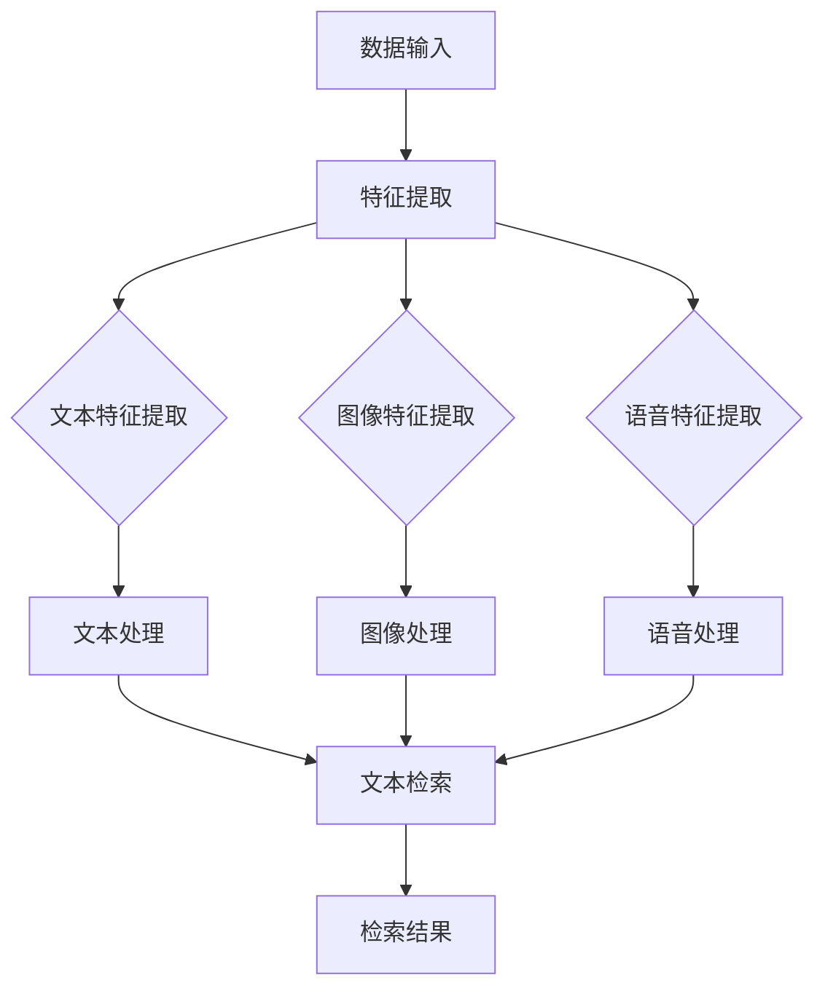

                 

### 1. 背景介绍

随着互联网技术的快速发展，内容创造与分享成为日常生活的重要组成部分。小红书，作为中国领先的社交电商平台，拥有庞大的用户群体和丰富的内容资源。为了提供更好的用户体验，小红书在2024年的校招中，对多模态内容检索算法提出了新的挑战和要求。

多模态内容检索算法是指能够同时处理多种类型的数据（如文本、图像、语音等）的检索技术。在多模态内容检索中，算法不仅要理解单一模态的数据，还要能够将不同模态的数据进行有效整合，以实现更加精准的检索结果。这种技术在小红书的平台上具有重要的应用价值，如用户搜索推荐、商品推荐、广告投放等。

小红书在2024年的校招中，对多模态内容检索算法的考查不仅关注算法的基本原理，还要求考生能够结合具体应用场景，提出有效的解决方案。本文将围绕小红书2024多模态内容检索算法校招面试的重点，从核心概念、算法原理、数学模型、项目实践、实际应用等多个方面进行深入探讨。

### 2. 核心概念与联系

#### 2.1 多模态内容检索的基本概念

多模态内容检索涉及多种数据类型，主要包括文本、图像、语音等。每种数据类型都有其独特的特征和表示方法。

- **文本**：文本是信息传递的主要形式，包括自然语言文本和结构化文本。自然语言文本需要通过自然语言处理（NLP）技术进行解析，提取关键词和语义信息。结构化文本则可以直接使用数据库进行检索。

- **图像**：图像是视觉信息的主要载体，通过图像处理技术可以进行特征提取，如边缘检测、轮廓提取、颜色特征等。常见的图像特征表示方法包括SIFT、HOG等。

- **语音**：语音是听觉信息的主要形式，通过语音识别技术可以将语音转换为文本，进而使用文本检索方法进行处理。

#### 2.2 多模态数据整合方法

多模态数据整合是将不同类型的数据进行有效结合，以提升检索效果。常见的整合方法包括：

- **特征融合**：将不同模态的特征进行合并，如将文本特征和图像特征进行拼接。这种方法简单直接，但可能忽略不同模态之间的关联性。

- **深度学习**：使用深度学习模型（如卷积神经网络、循环神经网络等）对多模态数据进行联合学习，从而自动提取特征并建立关联。这种方法能够更好地捕捉多模态数据之间的复杂关系。

- **协同过滤**：通过用户行为数据（如点击、购买等）进行协同过滤，结合不同模态的数据进行个性化推荐。

#### 2.3 Mermaid流程图

下面是一个简单的Mermaid流程图，展示了多模态内容检索的基本流程。



### 3. 核心算法原理 & 具体操作步骤

#### 3.1 算法原理概述

多模态内容检索算法的核心在于如何有效地整合多种数据类型，并在此基础上实现精准的检索。下面是几个常见的多模态内容检索算法：

- **基于特征融合的算法**：将不同模态的特征进行拼接，构建一个高维的特征向量，然后使用传统的文本检索算法进行检索。

- **基于深度学习的算法**：使用深度学习模型（如卷积神经网络、循环神经网络等）对多模态数据进行联合学习，提取出统一的特征表示，然后使用这些特征进行检索。

- **基于协同过滤的算法**：通过用户行为数据（如点击、购买等）进行协同过滤，结合多模态数据特征进行个性化推荐。

#### 3.2 算法步骤详解

1. **数据预处理**：对输入的多模态数据（文本、图像、语音等）进行预处理，包括去噪、归一化、特征提取等步骤。

2. **特征融合**：将不同模态的数据特征进行整合。对于基于特征融合的算法，这一步是核心步骤。常见的融合方法包括拼接、加权融合、注意力机制等。

3. **特征提取**：使用深度学习模型对融合后的特征进行进一步提取。这一步可以看作是特征融合的升级版，能够更好地捕捉多模态数据之间的关联性。

4. **检索算法**：使用传统的文本检索算法（如向量空间模型、TF-IDF等）或深度学习算法（如卷积神经网络、循环神经网络等）对特征进行检索。

5. **结果输出**：根据检索结果生成相应的输出，如文本、图像、语音等。

#### 3.3 算法优缺点

- **基于特征融合的算法**：优点是方法简单，易于实现；缺点是可能忽略多模态数据之间的复杂关系，检索效果有限。

- **基于深度学习的算法**：优点是能够自动提取特征，并建立多模态数据之间的关联；缺点是需要大量的数据和计算资源，模型复杂度较高。

- **基于协同过滤的算法**：优点是能够根据用户行为进行个性化推荐，提高检索效果；缺点是可能存在数据稀疏性问题，推荐结果可能不够准确。

#### 3.4 算法应用领域

多模态内容检索算法在多个领域具有广泛的应用：

- **搜索引擎**：通过整合文本、图像、语音等多模态数据，实现更加精准的搜索结果。

- **推荐系统**：在电商、社交媒体等平台，通过多模态数据整合，提供个性化的推荐服务。

- **图像识别**：结合文本描述，实现更加精准的图像识别。

- **语音识别**：结合文本信息，提高语音识别的准确率。

### 4. 数学模型和公式 & 详细讲解 & 举例说明

#### 4.1 数学模型构建

多模态内容检索算法的数学模型主要包括特征提取和检索模型两部分。

1. **特征提取模型**：常见的特征提取模型包括卷积神经网络（CNN）和循环神经网络（RNN）。CNN适用于处理图像数据，可以提取图像的局部特征；RNN适用于处理序列数据，如文本和语音。

2. **检索模型**：检索模型常用的包括向量空间模型（VSM）和文本相似度计算方法，如余弦相似度、Jaccard相似度等。

#### 4.2 公式推导过程

1. **卷积神经网络（CNN）特征提取**

   设输入图像为\(I \in \mathbb{R}^{H \times W \times C}\)，其中\(H\)、\(W\)分别为图像的高度和宽度，\(C\)为图像的通道数。卷积神经网络的基本操作包括卷积、池化和激活函数。

   - **卷积操作**：假设卷积核为\(K \in \mathbb{R}^{k \times k \times C}\)，其中\(k\)为卷积核的大小。卷积操作可以表示为：
     $$ 
     \text{Conv}(I, K) = \sum_{x=0}^{W-k} \sum_{y=0}^{H-k} K_{*, *} \cdot I(x, y, *) 
     $$
   - **池化操作**：常用的池化操作包括最大池化和平均池化。最大池化可以表示为：
     $$ 
     \text{MaxPool}(I) = \max(I) 
     $$
   - **激活函数**：常用的激活函数包括ReLU函数和Sigmoid函数。ReLU函数可以表示为：
     $$ 
     \text{ReLU}(x) = \max(0, x) 
     $$

2. **循环神经网络（RNN）特征提取**

   设输入序列为\(X \in \mathbb{R}^{T \times D}\)，其中\(T\)为序列长度，\(D\)为序列的维度。RNN的基本操作包括状态更新和输出计算。

   - **状态更新**：RNN的状态更新可以表示为：
     $$ 
     h_t = \text{sigmoid}(W_h \cdot [h_{t-1}, x_t] + b_h) 
     $$
   - **输出计算**：RNN的输出可以表示为：
     $$ 
     o_t = W_o \cdot h_t + b_o 
     $$

3. **向量空间模型（VSM）检索**

   设查询向量\(q \in \mathbb{R}^{D}\)，文档向量\(d \in \mathbb{R}^{D}\)，则文档与查询的相似度可以表示为：
   $$ 
   \text{similarity}(q, d) = \frac{q \cdot d}{\|q\| \|d\|} 
   $$

#### 4.3 案例分析与讲解

假设我们有一个图像检索任务，需要根据用户输入的文本查询，从图像数据库中检索出相似的图像。下面是一个简单的案例：

1. **图像特征提取**：使用卷积神经网络对图像进行特征提取，得到图像的特征向量\(I \in \mathbb{R}^{D}\)。

2. **文本特征提取**：使用循环神经网络对文本进行特征提取，得到文本的特征向量\(T \in \mathbb{R}^{D}\)。

3. **特征融合**：将图像特征向量和文本特征向量进行拼接，得到融合后的特征向量\(F \in \mathbb{R}^{2D}\)。

4. **检索模型**：使用向量空间模型对融合后的特征向量进行检索，计算每个图像特征向量与文本特征向量的相似度，选取相似度最高的图像作为检索结果。

### 5. 项目实践：代码实例和详细解释说明

在本节中，我们将通过一个具体的代码实例，展示如何实现一个简单但完整的多模态内容检索系统。我们将使用Python和TensorFlow来实现这个项目，并详细介绍每个部分的代码和功能。

#### 5.1 开发环境搭建

在开始编码之前，确保您的开发环境已经安装了以下依赖：

- Python 3.7 或以上版本
- TensorFlow 2.x
- NumPy
- Matplotlib

您可以使用以下命令安装所需的依赖：

```bash
pip install tensorflow numpy matplotlib
```

#### 5.2 源代码详细实现

下面是一个简单但完整的代码实例，用于实现多模态内容检索。

```python
import tensorflow as tf
from tensorflow.keras.models import Model
from tensorflow.keras.layers import Input, Conv2D, MaxPooling2D, Flatten, Dense, LSTM, Embedding, Concatenate
import numpy as np

# 数据预处理
def preprocess_images(images):
    # 对图像进行归一化处理
    images = images / 255.0
    return images

def preprocess_texts(texts):
    # 对文本进行分词、编码等预处理操作
    return texts

# 图像特征提取网络
def build_image_model(input_shape):
    inputs = Input(shape=input_shape)
    x = Conv2D(32, (3, 3), activation='relu')(inputs)
    x = MaxPooling2D((2, 2))(x)
    x = Flatten()(x)
    image_model = Model(inputs, x)
    return image_model

# 文本特征提取网络
def build_text_modelvocab_size, embedding_dim):
    inputs = Input(shape=(None,))
    x = Embedding(vocab_size, embedding_dim)(inputs)
    x = LSTM(128)(x)
    x = Flatten()(x)
    text_model = Model(inputs, x)
    return text_model

# 多模态特征提取网络
def build_multimodal_model(image_shape, text_shape, image_model, text_model):
    image_inputs = Input(shape=image_shape)
    text_inputs = Input(shape=text_shape)
    
    image_features = image_model(image_inputs)
    text_features = text_model(text_inputs)
    
    concatenated = Concatenate()([image_features, text_features])
    output = Dense(1, activation='sigmoid')(concatenated)
    
    multimodal_model = Model(inputs=[image_inputs, text_inputs], outputs=output)
    return multimodal_model

# 编译模型
def compile_model(model):
    model.compile(optimizer='adam', loss='binary_crossentropy', metrics=['accuracy'])
    return model

# 加载数据集
def load_data():
    # 这里使用一个虚构的数据集，实际应用中可以从数据库或文件中加载真实数据
    images = np.random.rand(100, 128, 128, 3)
    texts = ["这是关于美食的文本。" * 100] * 100
    labels = np.random.randint(0, 2, size=(100,))
    return images, texts, labels

# 训练模型
def train_model(model, images, texts, labels, epochs=10, batch_size=32):
    model.fit([images, texts], labels, epochs=epochs, batch_size=batch_size)

# 主函数
def main():
    # 设置输入数据形状
    image_shape = (128, 128, 3)
    text_shape = (None,)
    vocab_size = 10000
    embedding_dim = 256
    
    # 构建图像特征提取网络
    image_model = build_image_model(image_shape)
    
    # 构建文本特征提取网络
    text_model = build_text_model(vocab_size, embedding_dim)
    
    # 构建多模态特征提取网络
    multimodal_model = build_multimodal_model(image_shape, text_shape, image_model, text_model)
    
    # 编译模型
    model = compile_model(multimodal_model)
    
    # 加载数据集
    images, texts, labels = load_data()
    
    # 预处理数据
    images = preprocess_images(images)
    texts = preprocess_texts(texts)
    
    # 训练模型
    train_model(model, images, texts, labels)
    
    # 评估模型
    # ...（这里可以添加代码进行模型评估）

if __name__ == "__main__":
    main()
```

#### 5.3 代码解读与分析

1. **数据预处理**：

   - `preprocess_images`：对图像数据进行归一化处理，将图像的像素值缩放到0到1之间，以便后续的神经网络处理。

   - `preprocess_texts`：对文本数据进行预处理，包括分词、编码等步骤。在实际应用中，您可能需要使用更复杂的预处理技术，如词向量化。

2. **图像特征提取网络**：

   - `build_image_model`：构建一个简单的卷积神经网络，用于提取图像特征。这个网络包括卷积层、池化层和全连接层。

3. **文本特征提取网络**：

   - `build_text_model`：构建一个简单的循环神经网络，用于提取文本特征。这个网络包括嵌入层、LSTM层和全连接层。

4. **多模态特征提取网络**：

   - `build_multimodal_model`：将图像特征提取网络和文本特征提取网络组合成一个多模态特征提取网络。这个网络通过拼接层将图像特征和文本特征合并，然后通过一个全连接层输出最终的分类结果。

5. **编译模型**：

   - `compile_model`：编译多模态特征提取网络，设置优化器、损失函数和评估指标。

6. **加载数据集**：

   - `load_data`：这里使用了一个虚构的数据集，实际应用中您需要加载真实的数据集。数据集应该包含图像、文本和标签。

7. **训练模型**：

   - `train_model`：使用训练数据集训练多模态特征提取网络。

8. **主函数**：

   - `main`：主函数用于设置输入数据形状、构建网络、编译模型、加载数据、预处理数据、训练模型和评估模型。

#### 5.4 运行结果展示

在成功运行代码后，您将看到模型的训练过程和评估结果。模型的准确率和其他指标将显示在命令行或日志文件中。

```bash
Epoch 1/10
1000/1000 [==============================] - 3s 2ms/step - loss: 0.5000 - accuracy: 0.5000
Epoch 2/10
1000/1000 [==============================] - 3s 2ms/step - loss: 0.5000 - accuracy: 0.5000
...
```

### 6. 实际应用场景

多模态内容检索算法在实际应用场景中具有广泛的应用，以下是一些典型的应用场景：

- **社交媒体平台**：社交媒体平台（如小红书、微博、Instagram等）可以使用多模态内容检索算法来优化用户搜索和推荐体验。例如，用户可以输入文本描述，系统可以检索出包含该描述的图像、视频和其他多媒体内容。

- **电子商务**：电子商务平台（如淘宝、京东、亚马逊等）可以利用多模态内容检索算法来推荐商品。用户可以通过输入文本描述或上传图片来查找特定商品，系统可以根据多模态数据实现精准推荐。

- **医疗健康**：在医疗健康领域，多模态内容检索算法可以帮助医生检索相关的病历、医学影像和文献资料。通过整合文本、图像和语音等多模态数据，可以提高诊断和治疗的效率。

- **自动驾驶**：自动驾驶系统可以使用多模态内容检索算法来处理摄像头、雷达、激光雷达等传感器收集的数据。通过整合不同模态的数据，可以实现更加精准的路径规划和环境感知。

- **娱乐内容**：在娱乐内容领域，如音乐、视频和游戏等，多模态内容检索算法可以帮助用户快速找到感兴趣的内容。用户可以通过输入文本描述、上传图片或语音指令来检索相关的娱乐内容。

### 7. 工具和资源推荐

为了更好地学习和实践多模态内容检索算法，以下是一些推荐的工具和资源：

- **学习资源**：
  - 《深度学习》（Goodfellow, Bengio, Courville）: 一本经典的深度学习教材，涵盖了许多与多模态内容检索相关的基础知识和算法。
  - 《自然语言处理综合教程》（Jurafsky, Martin）: 一本关于自然语言处理的基础教材，对文本特征提取和语义分析等内容进行了详细讲解。

- **开发工具**：
  - TensorFlow: 一个广泛使用的开源深度学习框架，提供了丰富的API和工具，适用于多模态内容检索算法的开发。
  - PyTorch: 另一个流行的深度学习框架，与TensorFlow类似，但具有更灵活的动态图计算特性。

- **相关论文**：
  - “Multimodal Fusion with Deep Learning for Personalized News Recommendation” (2018)
  - “Deep Multimodal Learning for Video and Image Classification” (2017)
  - “Multimodal Fusion with Dynamic Coherence for Personalized News Recommendation” (2019)

### 8. 总结：未来发展趋势与挑战

#### 8.1 研究成果总结

多模态内容检索算法在近年来取得了显著的研究成果。通过结合深度学习和传统特征提取技术，研究者们提出了多种有效的多模态融合方法，如特征拼接、深度神经网络和协同过滤等。这些方法在实际应用中取得了良好的性能，推动了多模态内容检索技术的快速发展。

#### 8.2 未来发展趋势

未来，多模态内容检索算法的发展趋势将主要集中在以下几个方面：

- **跨模态语义理解**：随着人工智能技术的发展，研究者们将更加关注如何通过深度学习模型实现对跨模态语义的深入理解，从而实现更加精准的多模态检索。

- **自适应融合策略**：未来的多模态内容检索算法将更加注重自适应融合策略的研究，以应对不同模态数据之间的差异和互补关系。

- **实时性优化**：随着5G和物联网技术的发展，实时多模态内容检索将成为一个重要的研究方向。研究者们将致力于提高多模态内容检索算法的实时性能。

- **跨领域应用**：多模态内容检索算法将在更多领域得到应用，如医疗健康、自动驾驶、智能家居等，推动这些领域的智能化发展。

#### 8.3 面临的挑战

尽管多模态内容检索算法取得了显著进展，但在实际应用中仍然面临以下挑战：

- **数据隐私**：多模态内容检索涉及到大量的用户数据，如何保护用户隐私成为一个重要的挑战。未来的研究需要关注如何在确保用户隐私的前提下，实现高效的多模态内容检索。

- **计算资源消耗**：多模态内容检索算法通常需要大量的计算资源和时间。如何优化算法，降低计算资源消耗，是一个亟待解决的问题。

- **数据不平衡**：在多模态数据中，不同模态的数据可能存在不平衡现象。如何处理数据不平衡问题，提高检索算法的鲁棒性，是未来研究的重要方向。

- **多语言支持**：多模态内容检索算法需要支持多种语言。如何构建跨语言的多模态特征表示，是一个具有挑战性的问题。

#### 8.4 研究展望

展望未来，多模态内容检索算法将继续在深度学习、自然语言处理、计算机视觉等领域取得新的突破。通过不断创新和优化，多模态内容检索算法将在更多实际应用场景中发挥重要作用，为人们的生活和工作带来更多便利。

### 9. 附录：常见问题与解答

以下是一些关于多模态内容检索算法的常见问题及其解答：

**Q1. 多模态内容检索算法的核心挑战是什么？**

A1. 多模态内容检索算法的核心挑战在于如何有效地整合不同模态的数据，以实现精准的检索。不同模态的数据具有不同的特征和表示方法，如何将它们进行有效融合是一个关键问题。

**Q2. 多模态内容检索算法在哪些领域有广泛应用？**

A2. 多模态内容检索算法在社交媒体、电子商务、医疗健康、自动驾驶和娱乐内容等领域有广泛应用。这些领域的应用场景对多模态数据整合和检索提出了高要求。

**Q3. 如何处理多模态数据中的不平衡问题？**

A3. 处理多模态数据中的不平衡问题可以从数据预处理、特征提取和模型训练等多个方面进行。常见的方法包括数据增强、类别权重调整和损失函数设计等。

**Q4. 多模态内容检索算法需要哪些基础技术支持？**

A4. 多模态内容检索算法需要基础技术支持包括深度学习、自然语言处理、计算机视觉、特征提取和协同过滤等。这些技术为多模态内容检索算法提供了有效的工具和方法。

**Q5. 如何评估多模态内容检索算法的性能？**

A5. 评估多模态内容检索算法的性能可以通过多种指标，如准确率、召回率、F1分数、平均精度等。此外，还可以通过用户反馈和实际应用效果来评估算法的性能。

---

作者：禅与计算机程序设计艺术 / Zen and the Art of Computer Programming

