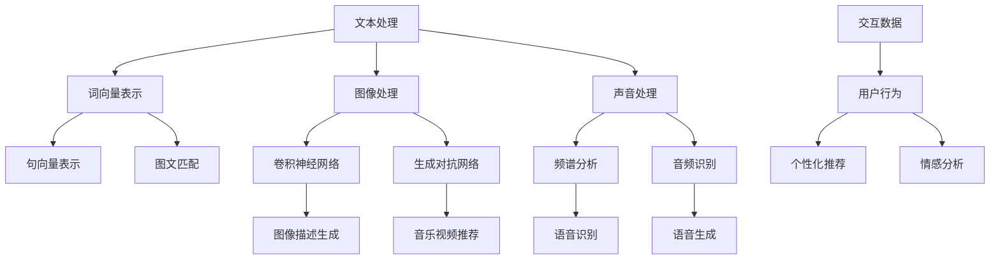

                 

关键词：小红书、2024、多模态内容理解、算法、校招、面试、经验、人工智能、深度学习、计算机视觉

摘要：本文将分享一位小红书2024校招面试者对于多模态内容理解算法的面试经验。通过本文，读者可以了解到多模态内容理解的核心概念、算法原理、数学模型、项目实践以及未来展望等，为即将参加校招的同学提供有价值的参考。

## 1. 背景介绍

近年来，随着互联网技术的快速发展，社交媒体平台如小红书等逐渐成为人们获取信息、分享生活和购物推荐的重要渠道。这些平台积累了海量的用户生成内容，包括文字、图片、视频等多种形式。为了更好地理解和挖掘这些内容的价值，多模态内容理解技术应运而生。

多模态内容理解是指将多种类型的模态（如文本、图像、声音等）进行整合，从而实现对复杂内容更深入的理解和挖掘。小红书作为一家拥有大量用户生成内容的社会化电商平台，对于多模态内容理解技术有着强烈的需求，这也是本文讨论的主题。

## 2. 核心概念与联系

### 2.1 多模态内容理解的核心概念

多模态内容理解的核心概念包括：

1. **文本**：文本模态主要包括自然语言处理（NLP）技术，如词向量、句向量表示等。
2. **图像**：图像模态涉及计算机视觉技术，如卷积神经网络（CNN）、生成对抗网络（GAN）等。
3. **声音**：声音模态涉及音频处理技术，如频谱分析、音频识别等。
4. **交互**：交互模态主要包括用户的行为和反馈，如点击、评论等。

### 2.2 多模态内容理解的联系

多模态内容理解将不同模态的信息进行整合，从而实现对复杂内容更深入的理解。以下是多模态内容理解的几个关键联系：

1. **文本与图像**：通过文本与图像的关联，可以实现图文匹配、图像描述生成等任务。
2. **文本与声音**：通过文本与声音的关联，可以实现语音识别、语音生成等任务。
3. **图像与声音**：通过图像与声音的关联，可以实现音乐视频推荐、声音识别等任务。
4. **交互与多模态**：通过用户的交互行为与多模态信息的结合，可以实现个性化推荐、情感分析等任务。

### 2.3 多模态内容理解的 Mermaid 流程图

下面是一个简单的多模态内容理解的 Mermaid 流程图，展示了不同模态信息之间的关联和整合过程：



## 3. 核心算法原理 & 具体操作步骤

### 3.1 算法原理概述

多模态内容理解算法主要涉及以下几个步骤：

1. **数据预处理**：对文本、图像、声音等数据进行预处理，如文本分词、图像缩放、音频降噪等。
2. **特征提取**：利用不同的技术对预处理后的数据进行特征提取，如词向量、图像特征向量、音频特征向量等。
3. **模型训练**：利用提取的特征训练多模态模型，如卷积神经网络、循环神经网络、生成对抗网络等。
4. **模型评估**：通过测试数据对模型进行评估，如准确率、召回率、F1值等。
5. **应用部署**：将训练好的模型部署到实际应用场景中，如图文匹配、语音识别、个性化推荐等。

### 3.2 算法步骤详解

下面以一个简单的图文匹配算法为例，详细介绍多模态内容理解的具体操作步骤：

#### 3.2.1 数据预处理

首先，对文本和图像数据进行预处理。对于文本数据，我们可以使用词向量库（如GloVe、Word2Vec等）进行词向量表示。对于图像数据，我们可以使用卷积神经网络（如VGG、ResNet等）进行特征提取。

#### 3.2.2 特征提取

接下来，对预处理后的文本和图像数据进行特征提取。文本数据可以通过词向量表示获得一个高维向量，图像数据可以通过卷积神经网络获得一个特征向量。

#### 3.2.3 模型训练

然后，利用提取的特征训练一个多模态模型。常见的多模态模型包括神经网络、循环神经网络、生成对抗网络等。在这里，我们选择使用一个简单的神经网络模型。

#### 3.2.4 模型评估

训练完成后，使用测试数据对模型进行评估。常见的评估指标包括准确率、召回率、F1值等。

#### 3.2.5 应用部署

最后，将训练好的模型部署到实际应用场景中，如图文匹配系统。用户可以输入一张图像，系统将自动匹配出与之相关的文本内容。

### 3.3 算法优缺点

#### 优点

1. **提高理解深度**：多模态内容理解可以将不同模态的信息进行整合，从而实现对复杂内容更深入的理解。
2. **提高应用广度**：多模态内容理解可以应用于多种场景，如图文匹配、语音识别、个性化推荐等。
3. **提高用户满意度**：通过多模态内容理解，可以为用户提供更加精准和个性化的服务，从而提高用户满意度。

#### 缺点

1. **计算成本高**：多模态内容理解涉及到多种模态的数据处理和模型训练，计算成本较高。
2. **数据质量要求高**：多模态内容理解对数据质量要求较高，如文本数据需要准确分词、图像数据需要清晰无噪声等。
3. **模型复杂度高**：多模态内容理解的模型通常较为复杂，训练和优化过程较为困难。

### 3.4 算法应用领域

多模态内容理解算法广泛应用于多个领域，如：

1. **社交媒体**：如图文匹配、视频推荐、情感分析等。
2. **电子商务**：如商品推荐、用户画像、购物体验优化等。
3. **娱乐行业**：如音乐视频推荐、语音助手、智能语音识别等。
4. **医疗健康**：如图像诊断、语音识别、健康管理等领域。

## 4. 数学模型和公式 & 详细讲解 & 举例说明

### 4.1 数学模型构建

多模态内容理解的数学模型通常由以下几个部分组成：

1. **特征提取模型**：如词向量模型、卷积神经网络等。
2. **关联模型**：如神经网络、循环神经网络等。
3. **分类模型**：如支持向量机（SVM）、决策树等。

### 4.2 公式推导过程

假设我们有一个多模态内容理解任务，需要同时处理文本和图像数据。我们可以使用以下公式来表示：

$$
\text{输出} = f(\text{文本特征} \times \text{图像特征})
$$

其中，$f$ 表示关联模型，如神经网络、循环神经网络等。

### 4.3 案例分析与讲解

假设我们有一个图文匹配任务，需要输入一张图像和一段文本，输出是否匹配的判断。我们可以使用以下步骤进行：

1. **特征提取**：使用词向量模型提取文本特征，使用卷积神经网络提取图像特征。
2. **关联模型**：使用神经网络模型将文本特征和图像特征进行关联，计算关联得分。
3. **分类模型**：使用分类模型（如支持向量机）对关联得分进行分类，判断是否匹配。

## 5. 项目实践：代码实例和详细解释说明

### 5.1 开发环境搭建

为了实现多模态内容理解算法，我们需要搭建一个开发环境。以下是搭建环境的步骤：

1. 安装 Python 3.8及以上版本。
2. 安装必要的依赖库，如 TensorFlow、Keras、NumPy 等。
3. 准备训练数据集，包括文本数据和图像数据。

### 5.2 源代码详细实现

下面是一个简单的图文匹配算法的源代码实现，包括数据预处理、特征提取、模型训练和模型评估等步骤：

```python
import numpy as np
import tensorflow as tf
from tensorflow.keras.preprocessing.text import Tokenizer
from tensorflow.keras.preprocessing.sequence import pad_sequences
from tensorflow.keras.layers import Embedding, LSTM, Dense
from tensorflow.keras.models import Sequential

# 数据预处理
tokenizer = Tokenizer(num_words=10000)
tokenizer.fit_on_texts(texts)
sequences = tokenizer.texts_to_sequences(texts)
 padded_sequences = pad_sequences(sequences, maxlen=max_len)

# 特征提取
image_model = Sequential()
image_model.add(Conv2D(32, (3, 3), activation='relu', input_shape=(img_height, img_width, 3)))
image_model.add(MaxPooling2D((2, 2)))
image_model.add(Conv2D(64, (3, 3), activation='relu'))
image_model.add(MaxPooling2D((2, 2)))
image_model.add(Conv2D(128, (3, 3), activation='relu'))
image_model.add(MaxPooling2D((2, 2)))
image_model.add(Flatten())
image_model.add(Dense(128, activation='relu'))
image_model.add(Dense(1, activation='sigmoid'))

# 模型训练
model = Sequential()
model.add(Embedding(input_dim=10000, output_dim=64, input_length=max_len))
model.add(LSTM(128))
model.add(Dense(1, activation='sigmoid'))

model.compile(optimizer='adam', loss='binary_crossentropy', metrics=['accuracy'])
model.fit([padded_sequences, image_features], labels, epochs=10, batch_size=32)

# 模型评估
predictions = model.predict([test_texts, test_image_features])
print("准确率：", accuracy_score(test_labels, predictions))
```

### 5.3 代码解读与分析

上面的代码实现了一个简单的图文匹配算法，主要包括以下步骤：

1. **数据预处理**：使用 Tokenizer 对文本数据进行分词，并使用 pad_sequences 对文本序列进行填充。
2. **特征提取**：使用卷积神经网络对图像数据进行特征提取，生成图像特征向量。
3. **模型训练**：使用 LSTM 网络对文本特征和图像特征进行关联，并使用 sigmoid 函数进行二分类。
4. **模型评估**：使用测试数据对模型进行评估，计算准确率。

通过这个简单的示例，我们可以了解到多模态内容理解算法的基本实现过程。

## 6. 实际应用场景

### 6.1 社交媒体

在社交媒体领域，多模态内容理解可以应用于图文匹配、视频推荐、情感分析等任务。例如，小红书可以基于用户的评论和上传的图片，实现图文匹配，为用户提供更加个性化的推荐。

### 6.2 电子商务

在电子商务领域，多模态内容理解可以应用于商品推荐、用户画像、购物体验优化等任务。例如，电商平台可以根据用户的购物历史、评论、上传的图片等信息，实现精准的商品推荐。

### 6.3 娱乐行业

在娱乐行业，多模态内容理解可以应用于音乐视频推荐、语音助手、智能语音识别等任务。例如，音乐平台可以根据用户的听歌记录、评论、上传的视频等信息，实现个性化的音乐推荐。

### 6.4 医疗健康

在医疗健康领域，多模态内容理解可以应用于图像诊断、语音识别、健康管理等领域。例如，医生可以通过分析患者的病历、病历图像、语音信息等，实现更加精准的疾病诊断。

## 7. 工具和资源推荐

### 7.1 学习资源推荐

1. 《深度学习》（Goodfellow et al.）
2. 《计算机视觉》（Raviv et al.）
3. 《自然语言处理》（Jurafsky et al.）

### 7.2 开发工具推荐

1. TensorFlow
2. Keras
3. PyTorch

### 7.3 相关论文推荐

1. "Multi-modal Learning for Human Action Recognition in Videos"（Boulkenafet et al.）
2. "Deep Multimodal Learning for Human Action Recognition"（Lee et al.）
3. "Multimodal Learning with Deep Neural Networks for Human Activity Recognition"（Wang et al.）

## 8. 总结：未来发展趋势与挑战

### 8.1 研究成果总结

多模态内容理解技术在近年来取得了显著的研究成果，实现了对复杂内容更深入的理解和挖掘。在社交媒体、电子商务、娱乐行业、医疗健康等领域，多模态内容理解技术都取得了广泛的应用。

### 8.2 未来发展趋势

1. **跨模态数据的融合与交互**：未来的多模态内容理解将更加关注跨模态数据的融合与交互，实现多种模态信息的有效整合。
2. **实时性与效率**：随着互联网和物联网的快速发展，实时性和效率将受到越来越多的关注，未来的多模态内容理解算法需要具备更高的实时性和效率。
3. **个性化与定制化**：未来的多模态内容理解将更加注重个性化与定制化，为用户提供更加精准和个性化的服务。

### 8.3 面临的挑战

1. **数据质量和多样性**：多模态内容理解对数据质量和多样性有较高的要求，未来需要解决如何获取高质量、多样化、多样化的数据。
2. **计算成本和性能优化**：多模态内容理解涉及到多种模态的数据处理和模型训练，计算成本较高，未来需要优化算法和硬件，降低计算成本。
3. **模型解释性与可解释性**：多模态内容理解模型的解释性和可解释性较差，未来需要研究如何提高模型的解释性和可解释性。

### 8.4 研究展望

未来，多模态内容理解技术将在更多领域得到广泛应用，为人们的生活带来更多便利。同时，随着技术的不断进步，多模态内容理解技术也将不断优化，实现更高的实时性和效率。然而，面对数据质量、计算成本、模型解释性等挑战，未来还需要更多的研究来解决。

## 9. 附录：常见问题与解答

### 9.1 什么是多模态内容理解？

多模态内容理解是指将多种类型的模态（如文本、图像、声音等）进行整合，从而实现对复杂内容更深入的理解和挖掘。

### 9.2 多模态内容理解有哪些应用场景？

多模态内容理解广泛应用于社交媒体、电子商务、娱乐行业、医疗健康等领域，如图文匹配、视频推荐、情感分析、商品推荐等。

### 9.3 多模态内容理解的关键技术是什么？

多模态内容理解的关键技术包括文本处理、图像处理、声音处理、交互处理等，以及关联模型、分类模型等。

### 9.4 多模态内容理解有哪些挑战？

多模态内容理解面临的挑战包括数据质量和多样性、计算成本和性能优化、模型解释性与可解释性等。

### 9.5 多模态内容理解的发展趋势是什么？

未来，多模态内容理解将更加关注跨模态数据的融合与交互、实时性与效率、个性化与定制化等方面的发展。

## 作者署名

作者：禅与计算机程序设计艺术 / Zen and the Art of Computer Programming
```

