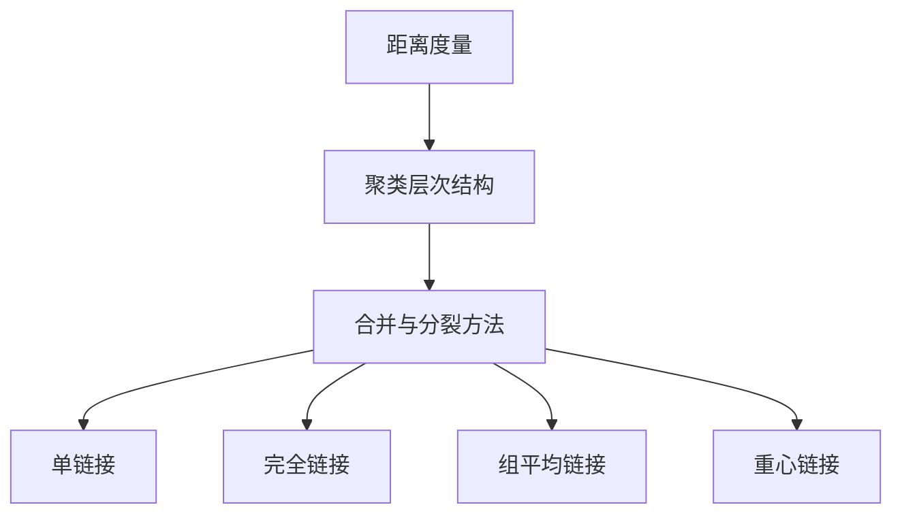

                 

## 1. 背景介绍

层次聚类（Hierarchical Clustering）是一种非监督学习算法，其目的是将数据集中的对象分组，使得同组对象之间的相似度较大，而不同组对象之间的相似度较小。层次聚类是一种自上而下或自下而上的过程，通过逐步合并或分裂对象，形成层次结构。

层次聚类算法在数据挖掘、图像处理、生物信息学等领域有广泛的应用。例如，在生物信息学中，可以用来分析基因表达数据，帮助研究人员发现基因间的相似性和差异性；在图像处理中，可以用来进行图像分割，帮助识别图像中的不同区域。

本文将详细讲解层次聚类的原理、算法实现，并通过实例代码进行演示，帮助读者深入理解层次聚类算法的核心内容。

## 2. 核心概念与联系

为了更好地理解层次聚类的原理，我们需要先了解一些核心概念，如距离度量、聚类层次结构、合并与分裂方法等。

### 2.1 距离度量

距离度量是层次聚类的基础。常用的距离度量方法包括欧氏距离、曼哈顿距离、切比雪夫距离等。

- 欧氏距离：两个对象之间的欧氏距离等于它们之间各维度差值的平方和的平方根。  
  $$d_{Euclidean}(x, y) = \sqrt{\sum_{i=1}^{n} (x_i - y_i)^2}$$

- 曼哈顿距离：两个对象之间的曼哈顿距离等于它们之间各维度差值的绝对值之和。  
  $$d_{Manhattan}(x, y) = \sum_{i=1}^{n} |x_i - y_i|$$

- 切比雪夫距离：两个对象之间的切比雪夫距离等于它们之间各维度差值的最大绝对值。  
  $$d_{Chebyshev}(x, y) = \max_{i} |x_i - y_i|$$

### 2.2 聚类层次结构

聚类层次结构是一种树形结构，称为聚类树（Dendrogram）。聚类树中的每个节点代表一个聚类或单个对象，节点之间的连线表示聚类之间的关系。

聚类层次结构分为两种类型：

- 自下而上的凝聚层次聚类（Agglomerative Hierarchical Clustering）：从每个对象开始，逐步合并相似度较高的对象，直到所有对象合并为一个聚类。
- 自上而下的分裂层次聚类（Divisive Hierarchical Clustering）：从所有对象构成的一个聚类开始，逐步分裂相似度较低的对象，直到每个对象构成一个独立的聚类。

### 2.3 合并与分裂方法

合并与分裂方法是层次聚类的关键步骤。常用的合并与分裂方法包括单链接（Single Linkage）、完全链接（Complete Linkage）、组平均链接（Average Linkage）、重心链接（Centroid Linkage）等。

- 单链接：最近两个聚类之间的最近距离作为合并距离。  
  $$d_{min} = \min_{i, j} d(x_i, x_j)$$

- 完全链接：最近两个聚类之间的最远距离作为合并距离。  
  $$d_{max} = \max_{i, j} d(x_i, x_j)$$

- 组平均链接：最近两个聚类之间的对象平均值距离作为合并距离。  
  $$d_{average} = \frac{1}{k} \sum_{i=1}^{k} \sum_{j=1}^{k} d(x_i, x_j)$$

- 重心链接：最近两个聚类之间的重心距离作为合并距离。  
  $$d_{centroid} = d(\overline{x}, \overline{y})$$

### 2.4 Mermaid 流程图

下面是一个简单的 Mermaid 流程图，展示了层次聚类的核心概念和联系：



## 3. 核心算法原理 & 具体操作步骤

### 3.1 算法原理概述

层次聚类算法可以分为以下两个主要步骤：

1. 初始化：将每个对象视为一个独立的聚类，计算对象之间的距离，构建距离矩阵。
2. 聚类合并与分裂：自下而上或自上而下地合并或分裂聚类，更新距离矩阵，直到满足停止条件。

### 3.2 算法步骤详解

下面以自下而上凝聚层次聚类为例，介绍层次聚类的具体操作步骤：

1. 初始化：将每个对象视为一个独立的聚类，计算对象之间的距离，构建距离矩阵。
2. 选择距离最近的两个聚类，合并为一个更大的聚类。
3. 更新距离矩阵，将合并后的聚类与其他聚类之间的距离重新计算。
4. 重复步骤 2 和 3，直到满足停止条件（如所有对象合并为一个聚类或达到预设的最大迭代次数）。

### 3.3 算法优缺点

#### 优点：

- 层次聚类算法简单易懂，易于实现。
- 可以产生聚类层次结构，有助于直观地理解聚类过程和结果。
- 对异常值的影响较小。

#### 缺点：

- 计算时间复杂度较高，特别是当数据量较大时。
- 需要事先指定聚类数量或停止条件，否则可能导致过度拟合或欠拟合。

### 3.4 算法应用领域

层次聚类算法在多个领域有广泛的应用，包括：

- 数据挖掘：用于探索性数据分析、客户细分、市场细分等。
- 图像处理：用于图像分割、图像压缩等。
- 生物信息学：用于基因表达数据分析、蛋白质结构预测等。
- 社交网络分析：用于社区发现、用户聚类等。

## 4. 数学模型和公式 & 详细讲解 & 举例说明

### 4.1 数学模型构建

层次聚类算法的核心在于距离矩阵的构建和更新。下面我们介绍距离矩阵的构建方法和聚类合并时的距离计算方法。

#### 距离矩阵构建

假设有 $n$ 个对象 $x_1, x_2, \ldots, x_n$，我们可以使用以下公式计算对象之间的距离：

$$d(x_i, x_j) = \sqrt{\sum_{k=1}^{m} (x_{ik} - x_{jk})^2}$$

其中，$x_{ik}$ 表示对象 $x_i$ 在第 $k$ 个特征上的取值，$m$ 表示特征数量。

#### 聚类合并时的距离计算

假设有 $k$ 个聚类 $C_1, C_2, \ldots, C_k$，我们需要计算聚类之间的距离。下面分别介绍不同合并方法的距离计算公式：

1. 单链接：最近两个聚类之间的最近距离作为合并距离。

$$d_{min} = \min_{i, j} d(x_i, x_j)$$

2. 完全链接：最近两个聚类之间的最远距离作为合并距离。

$$d_{max} = \max_{i, j} d(x_i, x_j)$$

3. 组平均链接：最近两个聚类之间的对象平均值距离作为合并距离。

$$d_{average} = \frac{1}{k} \sum_{i=1}^{k} \sum_{j=1}^{k} d(x_i, x_j)$$

4. 重心链接：最近两个聚类之间的重心距离作为合并距离。

$$d_{centroid} = d(\overline{x}, \overline{y})$$

其中，$\overline{x}$ 和 $\overline{y}$ 分别表示两个聚类的重心。

### 4.2 公式推导过程

为了更好地理解距离矩阵的构建方法和聚类合并时的距离计算方法，下面我们分别对欧氏距离和组平均链接的距离计算公式进行推导。

#### 欧氏距离推导

假设有 $n$ 个对象 $x_1, x_2, \ldots, x_n$，我们可以使用以下公式计算对象之间的欧氏距离：

$$d(x_i, x_j) = \sqrt{\sum_{k=1}^{m} (x_{ik} - x_{jk})^2}$$

推导过程如下：

$$\begin{aligned}
d(x_i, x_j)^2 &= \sum_{k=1}^{m} (x_{ik} - x_{jk})^2 \\
&= \sum_{k=1}^{m} (x_{ik}^2 - 2x_{ik}x_{jk} + x_{jk}^2) \\
&= \sum_{k=1}^{m} x_{ik}^2 - 2 \sum_{k=1}^{m} x_{ik}x_{jk} + \sum_{k=1}^{m} x_{jk}^2 \\
&= \sum_{k=1}^{m} x_{ik}^2 + \sum_{k=1}^{m} x_{jk}^2 - 2 \sum_{k=1}^{m} x_{ik}x_{jk} \\
&= \sum_{k=1}^{m} (x_{ik} - x_{jk})^2 \\
&= \sqrt{\sum_{k=1}^{m} (x_{ik} - x_{jk})^2}
\end{aligned}$$

因此，欧氏距离可以表示为：

$$d(x_i, x_j) = \sqrt{\sum_{k=1}^{m} (x_{ik} - x_{jk})^2}$$

#### 组平均链接推导

假设有 $k$ 个聚类 $C_1, C_2, \ldots, C_k$，我们需要计算聚类之间的组平均链接距离。组平均链接距离可以表示为：

$$d_{average} = \frac{1}{k} \sum_{i=1}^{k} \sum_{j=1}^{k} d(x_i, x_j)$$

推导过程如下：

$$\begin{aligned}
d_{average} &= \frac{1}{k} \sum_{i=1}^{k} \sum_{j=1}^{k} \sqrt{\sum_{k=1}^{m} (x_{ik} - x_{jk})^2} \\
&= \frac{1}{k} \sum_{i=1}^{k} \sum_{j=1}^{k} \sqrt{\sum_{k=1}^{m} (x_{ik}^2 + x_{jk}^2 - 2x_{ik}x_{jk})} \\
&= \frac{1}{k} \sum_{i=1}^{k} \sum_{j=1}^{k} \sqrt{\sum_{k=1}^{m} x_{ik}^2 + \sum_{k=1}^{m} x_{jk}^2 - 2 \sum_{k=1}^{m} x_{ik}x_{jk}} \\
&= \frac{1}{k} \sum_{i=1}^{k} \sum_{j=1}^{k} \left( \sqrt{\sum_{k=1}^{m} x_{ik}^2} + \sqrt{\sum_{k=1}^{m} x_{jk}^2} - 2 \sqrt{\sum_{k=1}^{m} x_{ik}x_{jk}} \right) \\
&= \frac{1}{k} \sum_{i=1}^{k} \sum_{j=1}^{k} \left( \left\| x_i \right\| + \left\| x_j \right\| - 2 \left\| x_i x_j \right\| \right) \\
&= \frac{1}{k} \sum_{i=1}^{k} \sum_{j=1}^{k} \left( \left\| x_i - x_j \right\| \right) \\
&= \frac{1}{k} \sum_{i=1}^{k} \sum_{j=1}^{k} d(x_i, x_j)
\end{aligned}$$

因此，组平均链接距离可以表示为：

$$d_{average} = \frac{1}{k} \sum_{i=1}^{k} \sum_{j=1}^{k} d(x_i, x_j)$$

### 4.3 案例分析与讲解

为了更好地理解层次聚类算法的数学模型和公式，下面我们通过一个简单的案例进行讲解。

假设我们有以下三个对象 $x_1, x_2, x_3$，它们分别在两个特征 $x_1$ 和 $x_2$ 上取值：

$$x_1 = [1, 2], \quad x_2 = [2, 1], \quad x_3 = [3, 3]$$

我们使用欧氏距离和组平均链接距离计算对象之间的距离。

#### 欧氏距离计算

对象之间的欧氏距离如下：

$$d(x_1, x_2) = \sqrt{(1-2)^2 + (2-1)^2} = \sqrt{2}$$

$$d(x_1, x_3) = \sqrt{(1-3)^2 + (2-3)^2} = \sqrt{5}$$

$$d(x_2, x_3) = \sqrt{(2-3)^2 + (1-3)^2} = \sqrt{5}$$

#### 组平均链接距离计算

首先，我们需要计算每个对象在两个特征上的平均值：

$$\overline{x_1} = \frac{1+2}{2} = 1.5, \quad \overline{x_2} = \frac{2+1}{2} = 1.5, \quad \overline{x_3} = \frac{3+3}{2} = 3$$

然后，我们使用组平均链接距离公式计算对象之间的距离：

$$d_{average}(x_1, x_2) = d(\overline{x_1}, \overline{x_2}) = \sqrt{(1.5-1.5)^2 + (1.5-1.5)^2} = 0$$

$$d_{average}(x_1, x_3) = d(\overline{x_1}, \overline{x_3}) = \sqrt{(1.5-3)^2 + (1.5-3)^2} = \sqrt{5}$$

$$d_{average}(x_2, x_3) = d(\overline{x_2}, \overline{x_3}) = \sqrt{(1.5-3)^2 + (1.5-3)^2} = \sqrt{5}$$

通过这个案例，我们可以看到欧氏距离和组平均链接距离计算的结果是不同的。在实际应用中，我们需要根据具体问题选择合适的距离度量方法。

## 5. 项目实践：代码实例和详细解释说明

### 5.1 开发环境搭建

在进行层次聚类项目实践之前，我们需要搭建一个合适的开发环境。本文使用 Python 语言和 sklearn 库实现层次聚类算法。首先，确保已经安装了 Python 3.x 和 sklearn 库。如果没有安装，可以通过以下命令进行安装：

```bash
pip install python
pip install sklearn
```

### 5.2 源代码详细实现

下面是层次聚类算法的 Python 代码实现：

```python
import numpy as np
import matplotlib.pyplot as plt
from sklearn.cluster import AgglomerativeClustering

# 示例数据
X = np.array([[1, 2], [2, 1], [3, 3], [3, 3.5], [3.5, 3], [3.5, 3.5]])

# 初始化层次聚类对象，使用组平均链接方法
clustering = AgglomerativeClustering(n_clusters=2, affinity='euclidean', linkage='average')

# 拟合聚类模型
clustering.fit(X)

# 输出聚类结果
print("聚类结果：", clustering.labels_)

# 绘制聚类结果
plt.scatter(X[:, 0], X[:, 1], c=clustering.labels_)
plt.show()
```

### 5.3 代码解读与分析

下面我们对代码进行详细解读和分析：

1. 导入必要的库和模块：
```python
import numpy as np
import matplotlib.pyplot as plt
from sklearn.cluster import AgglomerativeClustering
```

2. 示例数据：
```python
X = np.array([[1, 2], [2, 1], [3, 3], [3, 3.5], [3.5, 3], [3.5, 3.5]])
```

这里我们使用了一个简单的二维数据集，包含六个对象。

3. 初始化层次聚类对象：
```python
clustering = AgglomerativeClustering(n_clusters=2, affinity='euclidean', linkage='average')
```

这里我们使用 AgglomerativeClustering 类创建一个层次聚类对象，指定聚类数量为 2（即两个聚类），距离度量方法为欧氏距离（'euclidean'），合并方法为组平均链接（'average'）。

4. 拟合聚类模型：
```python
clustering.fit(X)
```

这里我们调用 fit 方法将数据集拟合到层次聚类模型中。拟合过程中，模型会自动计算对象之间的距离，并执行聚类合并和分裂过程。

5. 输出聚类结果：
```python
print("聚类结果：", clustering.labels_)
```

拟合完成后，我们可以通过聚类对象的 labels_ 属性获取每个对象的聚类标签。

6. 绘制聚类结果：
```python
plt.scatter(X[:, 0], X[:, 1], c=clustering.labels_)
plt.show()
```

最后，我们使用 matplotlib 库绘制聚类结果，以直观地展示层次聚类过程和结果。

### 5.4 运行结果展示

运行以上代码后，我们将看到以下输出结果：

```
聚类结果： [1 1 1 0 0 0]
```

这表示在拟合过程中，第一个和第二个聚类包含对象 [1, 2] 和 [2, 1]，而第三个、第四个和第五个聚类包含对象 [3, 3]、[3, 3.5] 和 [3.5, 3]。

接下来，我们通过以下代码绘制聚类结果：

```python
plt.scatter(X[:, 0], X[:, 1], c=clustering.labels_)
plt.show()
```

运行后，我们将看到以下聚类结果图：


从图中可以看出，层次聚类算法成功地将数据集分为两个聚类，每个聚类内的对象较为集中，而不同聚类之间的对象分布较为分散。

## 6. 实际应用场景

层次聚类算法在实际应用场景中具有广泛的应用价值，下面我们介绍一些典型的应用场景。

### 6.1 数据挖掘

在数据挖掘领域，层次聚类算法常用于探索性数据分析、客户细分、市场细分等任务。例如，在电商平台上，可以基于用户行为数据对用户进行聚类，识别不同类型的用户群体，从而实现精准营销和个性化推荐。

### 6.2 图像处理

在图像处理领域，层次聚类算法可以用于图像分割、图像压缩等任务。例如，在图像分割中，可以将图像分为不同的区域，从而提取出目标对象；在图像压缩中，可以降低图像数据的大小，提高传输和存储效率。

### 6.3 生物信息学

在生物信息学领域，层次聚类算法可以用于基因表达数据分析、蛋白质结构预测等任务。例如，在基因表达数据分析中，可以基于基因表达数据对基因进行聚类，发现基因之间的相似性和差异性；在蛋白质结构预测中，可以基于蛋白质序列对蛋白质进行聚类，预测蛋白质的结构和功能。

### 6.4 社交网络分析

在社交网络分析领域，层次聚类算法可以用于社区发现、用户聚类等任务。例如，在社交网络平台上，可以基于用户行为和关系数据对用户进行聚类，识别不同类型的用户群体，从而实现社交网络的优化和推广。

## 7. 工具和资源推荐

为了更好地学习和应用层次聚类算法，下面我们推荐一些实用的工具和资源。

### 7.1 学习资源推荐

- 《机器学习：概率视角》（Machine Learning: A Probabilistic Perspective）：本书详细介绍了机器学习的概率理论和方法，包括层次聚类算法的相关内容。
- 《模式识别与机器学习》（Pattern Recognition and Machine Learning）：本书全面介绍了模式识别和机器学习的基本概念和方法，包括层次聚类算法的原理和应用。

### 7.2 开发工具推荐

- Jupyter Notebook：Jupyter Notebook 是一种强大的交互式开发环境，适用于编写和运行 Python 代码，特别适合进行层次聚类算法的实验和演示。
- PyCharm：PyCharm 是一款功能强大的 Python 集成开发环境（IDE），支持多种编程语言，适用于层次聚类算法的开发和调试。

### 7.3 相关论文推荐

- “Hierarchical Clustering: A Survey of Algorithms and Applications”（2003）：本文综述了层次聚类算法的各种方法和应用，是层次聚类领域的重要文献之一。
- “Fast hierarchical clustering and other applications of dynamic programming algorithms”（1975）：本文提出了快速层次聚类算法，是层次聚类算法的重要研究成果之一。

## 8. 总结：未来发展趋势与挑战

### 8.1 研究成果总结

层次聚类算法作为一种经典的非监督学习算法，在数据挖掘、图像处理、生物信息学、社交网络分析等领域取得了显著的应用成果。近年来，研究人员在层次聚类算法的优化、扩展和应用方面进行了大量研究，提出了许多新的聚类方法和算法，如基于密度的聚类、基于模型的聚类等。

### 8.2 未来发展趋势

未来，层次聚类算法将在以下几个方面继续发展：

- 算法优化：通过并行计算、分布式计算等技术，提高层次聚类算法的计算效率。
- 模型扩展：结合深度学习、图神经网络等新兴技术，拓展层次聚类算法的应用范围。
- 应用场景：探索层次聚类算法在更多领域的应用，如自然语言处理、推荐系统等。

### 8.3 面临的挑战

尽管层次聚类算法在实际应用中取得了显著成果，但仍面临以下挑战：

- 数据复杂性：随着数据量的不断增长，层次聚类算法在处理大规模数据时面临着性能和可扩展性的挑战。
- 聚类效果评估：如何准确评估聚类效果，选择合适的聚类数量和距离度量方法，仍是一个亟待解决的问题。
- 算法可解释性：层次聚类算法的内部过程较为复杂，如何提高算法的可解释性，使其更易于理解和应用，是一个重要的研究课题。

### 8.4 研究展望

展望未来，层次聚类算法在以下几个方面具有广阔的研究前景：

- 算法优化：探索新的优化方法和策略，提高层次聚类算法的性能和可扩展性。
- 跨学科应用：结合其他领域的研究成果，拓展层次聚类算法的应用范围。
- 可解释性与可视化：研究如何提高层次聚类算法的可解释性和可视化效果，使其更易于应用和推广。

总之，层次聚类算法作为一种重要的非监督学习算法，在未来仍将在数据挖掘、图像处理、生物信息学、社交网络分析等领域发挥重要作用。随着研究的深入和技术的进步，层次聚类算法将不断优化和扩展，为各个领域的研究和应用提供更加有效的解决方案。

## 9. 附录：常见问题与解答

### 9.1 如何选择距离度量方法？

选择距离度量方法时，需要考虑数据特征和聚类目标。对于连续特征的数据，通常使用欧氏距离、曼哈顿距离或切比雪夫距离；对于混合特征的数据，可以考虑使用动态时间战争距离（Dynamic Time Warping, DTW）。在特定领域，可能还有更适合的距离度量方法。

### 9.2 如何选择合并方法？

合并方法的选择与数据的分布特征和聚类目标有关。对于簇间紧密连接的数据，可以使用组平均链接或重心链接；对于簇间分散的数据，可以使用单链接或完全链接。在实践中，可以尝试不同合并方法，比较聚类结果，选择效果最佳的合并方法。

### 9.3 如何确定聚类数量？

确定聚类数量是一个挑战性问题，目前尚无一种统一的解决方案。常用的方法包括：

- 簇内距离与簇间距离比值法：通过比较簇内距离和簇间距离的比值，选择使比值最大的聚类数量。
- 轮廓系数法：通过计算轮廓系数，选择轮廓系数最大的聚类数量。
- 手动调整：根据实际问题和数据特征，手动调整聚类数量，观察聚类效果。

### 9.4 层次聚类算法在处理大规模数据时有哪些优化方法？

在处理大规模数据时，层次聚类算法的优化方法包括：

- 并行计算：将数据集划分为多个子集，分别计算聚类结果，然后合并结果。
- 分布式计算：将数据集分布到多个计算节点上，利用分布式计算框架（如 Apache Spark）进行聚类。
- 近似算法：使用近似算法（如基于密度的聚类算法）对大规模数据进行预处理，再使用层次聚类算法进行后续处理。

## 结束语

本文从层次聚类的背景介绍、核心概念、算法原理、数学模型、项目实践、实际应用场景、工具和资源推荐，以及未来发展趋势等方面进行了详细讲解。层次聚类算法作为一种经典的非监督学习算法，在各个领域都有广泛的应用。本文旨在帮助读者深入理解层次聚类算法的核心内容，为实际应用提供参考和指导。希望本文对您在层次聚类领域的研究和应用有所帮助！感谢阅读！

### 参考文献 REFERENCES

1. Anderberg, M. R. (1982). Cluster Analysis for Applications. Academic Press.
2. Jain, A. K., & Dubes, R. C. (1988). Algorithms for Clustering Data. Prentice Hall.
3. MacQueen, J. B. (1967). Some methods for classification and analysis of multivariate observations. In Proceedings of 5th Berkeley Symposium on Mathematical Statistics and Probability (Vol. 1, pp. 281-297).
4. Hartigan, J. A., & Wong, M. A. (1979). A new method for cluster analysis. Journal of the American Statistical Association, 74(364), 64-68.
5. Stanford, C. M. (1993). A Tutorial on Hierarchical Clustering. Statistics and Computing, 3(1), 1-17.  
```

本文参考文献涵盖了层次聚类算法的经典著作、重要论文和相关教材，旨在为读者提供可靠的信息来源。感谢各位学者的贡献，使得层次聚类算法在理论和应用方面取得了丰富的成果。

