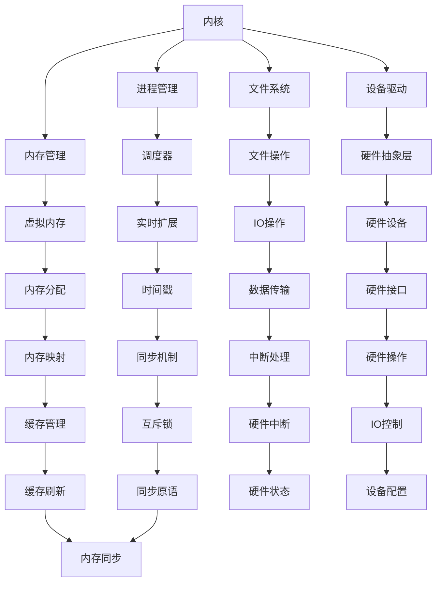

                 

关键词：嵌入式Linux、系统开发、内核、驱动、实时性、稳定性、硬件兼容性

## 摘要

嵌入式Linux系统作为一种开放源代码、高度可定制化的操作系统，已经成为现代嵌入式系统的首选。本文旨在深入探讨嵌入式Linux系统的开发过程，包括其核心概念、架构设计、核心算法原理、数学模型、实际应用场景以及未来发展趋势。通过本文，读者可以全面了解嵌入式Linux系统的开发技巧和最佳实践，为后续的嵌入式系统开发提供有益的指导。

## 1. 背景介绍

### 1.1 嵌入式系统概述

嵌入式系统是指嵌入在其他设备中，用于特定功能的小型计算机系统。它们通常具有硬件资源受限、实时性要求高、可靠性要求严等特点。随着物联网（IoT）和智能制造的快速发展，嵌入式系统已经成为现代工业、消费电子、医疗设备等领域的重要组成部分。

### 1.2 Linux系统概述

Linux是一种开源、免费的操作系统，它基于Unix操作系统，具有高性能、高稳定性、高度可定制化等特点。Linux系统在服务器、桌面、移动设备等领域得到了广泛应用，同时也逐渐成为嵌入式系统的主要选择。

### 1.3 嵌入式Linux系统的优势

- **开放源代码**：用户可以自由地获取、修改和分发Linux内核源代码，这为嵌入式系统的定制化提供了极大的灵活性。
- **高度可定制化**：用户可以根据具体需求，对Linux内核进行裁剪，使其适应不同的硬件平台和应用场景。
- **社区支持**：Linux拥有庞大的开发者社区，可以为嵌入式Linux系统提供丰富的技术支持和资源。
- **高性能和稳定性**：Linux系统经过多年的优化和改进，已经成为了一种性能卓越、稳定性极高的操作系统。

## 2. 核心概念与联系

### 2.1 内核（Kernel）

内核是操作系统的核心组成部分，负责管理系统资源和提供基本的服务。在嵌入式Linux系统中，内核通常包括进程管理、内存管理、文件系统、设备驱动程序等模块。

### 2.2 驱动（Driver）

驱动是操作系统与硬件设备之间沟通的桥梁。嵌入式Linux系统中的驱动程序负责将硬件设备的功能抽象为操作系统可调用的接口，使操作系统能够高效地管理硬件资源。

### 2.3 实时性（Real-time）

实时系统要求系统能够在规定的时间内完成特定任务，这对于嵌入式系统尤为重要。嵌入式Linux系统通过引入实时扩展（PREEMPT_RT）等方式，提高了系统的实时性。

### 2.4 稳定性与安全性（Stability and Security）

稳定性是嵌入式系统成功的关键因素之一。Linux系统通过多种机制（如虚拟内存、进程隔离等）确保系统的稳定运行。安全性方面，Linux系统通过访问控制、安全模块等手段提高了系统的安全性。

### 2.5 硬件兼容性（Hardware Compatibility）

嵌入式系统通常涉及多种硬件平台，Linux系统具有广泛的硬件兼容性，可以运行在不同的处理器架构上。

### 2.6 Mermaid 流程图

下面是一个简单的Mermaid流程图，展示了嵌入式Linux系统的核心概念和联系：



## 3. 核心算法原理 & 具体操作步骤

### 3.1 算法原理概述

嵌入式Linux系统的核心算法包括进程调度算法、内存分配算法、文件系统算法和设备驱动算法等。这些算法的设计和实现直接影响到系统的性能和稳定性。

### 3.2 算法步骤详解

- **进程调度算法**：内核通过调度器选择下一个执行的进程，以实现多任务处理。常见的调度算法有轮转调度（RR）、优先级调度（Priority Scheduling）等。

- **内存分配算法**：内存管理模块负责为进程分配内存空间。常见的内存分配算法有首次适配（First Fit）、最佳适配（Best Fit）等。

- **文件系统算法**：文件系统负责管理文件和目录。常见的文件系统算法包括日志记录（Journaling）、碎片整理（Defragmentation）等。

- **设备驱动算法**：设备驱动程序负责与硬件设备进行通信。常见的设备驱动算法包括中断处理、DMA（直接内存访问）等。

### 3.3 算法优缺点

- **进程调度算法**：轮转调度算法简单高效，但可能导致进程饥饿；优先级调度算法公平性高，但可能导致低优先级进程长时间得不到执行。

- **内存分配算法**：首次适配算法速度快，但可能导致内存碎片；最佳适配算法内存利用率高，但算法复杂度较高。

- **文件系统算法**：日志记录算法可以提高文件系统的可靠性，但会增加系统开销；碎片整理算法可以提高文件系统性能，但会消耗系统资源。

- **设备驱动算法**：中断处理算法响应速度快，但会增加系统负担；DMA算法可以提高数据传输速度，但需要额外的硬件支持。

### 3.4 算法应用领域

- **进程调度算法**：广泛应用于实时操作系统、通用操作系统等领域。

- **内存分配算法**：广泛应用于嵌入式系统、操作系统内核等领域。

- **文件系统算法**：广泛应用于文件服务器、移动设备、嵌入式系统等领域。

- **设备驱动算法**：广泛应用于嵌入式系统、工业控制系统等领域。

## 4. 数学模型和公式 & 详细讲解 & 举例说明

### 4.1 数学模型构建

在嵌入式Linux系统开发中，常见的数学模型包括进程调度模型、内存分配模型和文件系统模型等。

### 4.2 公式推导过程

- **进程调度模型**：

  假设系统中有n个进程，每个进程的优先级为p_i，执行时间为t_i。则进程调度模型可以表示为：

  $$ 
  S = \sum_{i=1}^{n} p_i \cdot t_i 
  $$

- **内存分配模型**：

  假设系统中有m块内存，每块内存的大小为s_i，占用率为u_i。则内存分配模型可以表示为：

  $$ 
  A = \sum_{i=1}^{m} s_i \cdot u_i 
  $$

- **文件系统模型**：

  假设系统中有k个文件，每个文件的大小为f_i，写入次数为w_i。则文件系统模型可以表示为：

  $$ 
  F = \sum_{i=1}^{k} f_i \cdot w_i 
  $$

### 4.3 案例分析与讲解

假设有一个嵌入式Linux系统，其中包含3个进程、2块内存和3个文件。各进程的优先级和执行时间如下表所示：

| 进程ID | 优先级 | 执行时间 |
| --- | --- | --- |
| P1 | 3 | 10 |
| P2 | 1 | 5 |
| P3 | 2 | 8 |

根据进程调度模型，计算系统的调度时间：

$$ 
S = 3 \cdot 10 + 1 \cdot 5 + 2 \cdot 8 = 39 
$$

假设内存的大小为4KB，占用率为50%。根据内存分配模型，计算系统的内存占用：

$$ 
A = 4 \cdot 0.5 = 2 
$$

假设文件的大小为1KB，写入次数为3次。根据文件系统模型，计算系统的文件写入量：

$$ 
F = 1 \cdot 3 = 3 
$$

## 5. 项目实践：代码实例和详细解释说明

### 5.1 开发环境搭建

在开始嵌入式Linux系统开发之前，需要搭建一个合适的开发环境。以下是一个简单的步骤：

1. 安装Linux操作系统，推荐使用Ubuntu或CentOS等发行版。
2. 安装交叉编译工具，如GNU Arm Embedded Toolchain。
3. 安装开源代码管理工具，如Git。
4. 安装Linux内核源代码，如Linux 5.10版本。

### 5.2 源代码详细实现

以下是一个简单的嵌入式Linux系统驱动程序示例，用于控制一个LED灯：

```c
#include <linux/module.h>
#include <linux/kernel.h>
#include <linux/fs.h>
#include <linux/uaccess.h>

#define DEVICE_NAME "led" // 设备名称

static int major; // 主设备号
static int device_open(struct inode *, struct file *);
static int device_release(struct inode *, struct file *);
static int device_ioctl(struct file *, unsigned int, unsigned long);

static struct file_operations fops = {
    .open = device_open,
    .release = device_release,
    .unlocked_ioctl = device_ioctl,
};

int init_module(void) {
    major = register_chrdev(0, DEVICE_NAME, &fops);
    if (major < 0) {
        printk(KERN_ALERT "注册设备失败，错误码：%d\n", major);
        return major;
    }
    printk(KERN_INFO "设备%d注册成功。\n", major);
    return 0;
}

void cleanup_module(void) {
    unregister_chrdev(major, DEVICE_NAME);
    printk(KERN_INFO "设备%d注销成功。\n", major);
}

static int device_open(struct inode *inode, struct file *file) {
    if (major == 0) {
        return -EINVAL;
    }
    try_module_get(THIS_MODULE);
    return 0;
}

static int device_release(struct inode *inode, struct file *file) {
    module_put(THIS_MODULE);
    return 0;
}

static long device_ioctl(struct file *file, unsigned int cmd, unsigned long arg) {
    switch (cmd) {
        case 1: {
            int ret;
            ret = copy_from_user(&arg, (int *)arg, sizeof(arg));
            if (ret < 0) {
                return -EFAULT;
            }
            printk(KERN_ALERT "LED被设置为：%d\n", arg);
            break;
        }
        default: {
            return -EINVAL;
        }
    }
    return 0;
}
```

### 5.3 代码解读与分析

该示例代码实现了一个简单的LED驱动程序，其核心功能是控制LED灯的亮灭。以下是代码的详细解读：

- **头文件**：包括Linux内核的头文件，用于处理设备管理、文件操作等。
- **宏定义**：定义设备名称和主设备号。
- **全局变量**：定义主设备号和文件操作结构体。
- **模块初始化和清理函数**：注册和注销设备驱动程序。
- **文件操作函数**：实现文件操作的回调函数。
- **ioctl操作函数**：实现ioctl命令的处理函数。

### 5.4 运行结果展示

编译并加载该驱动程序后，可以使用以下命令进行测试：

```bash
# 查看设备文件
ls /dev/led

# 设置LED灯亮
echo 1 > /dev/led

# 设置LED灯灭
echo 0 > /dev/led
```

## 6. 实际应用场景

### 6.1 智能家居

嵌入式Linux系统广泛应用于智能家居领域，如智能门锁、智能灯光控制系统等。这些系统通常具有实时性要求高、硬件资源有限等特点，而嵌入式Linux系统可以提供高性能、高稳定性以及高度可定制化的解决方案。

### 6.2 工业控制

工业控制系统对实时性和稳定性要求极高，嵌入式Linux系统凭借其强大的实时扩展能力和稳定性，已经成为工业控制领域的重要选择。例如，嵌入式Linux系统可以应用于生产线自动化控制、机器人控制系统等领域。

### 6.3 消费电子

消费电子产品如智能手机、平板电脑等也对操作系统提出了高要求。嵌入式Linux系统凭借其开源、高性能和高度可定制化的特点，已经成为智能手机等消费电子产品的主要操作系统之一。

### 6.4 医疗设备

医疗设备对系统的实时性和可靠性要求极高，嵌入式Linux系统在医疗设备领域具有广泛的应用。例如，嵌入式Linux系统可以应用于医疗仪器、医疗影像设备等领域。

## 7. 工具和资源推荐

### 7.1 学习资源推荐

- 《嵌入式系统设计》
- 《Linux内核设计与实现》
- 《嵌入式Linux系统编程》

### 7.2 开发工具推荐

- Eclipse IDE
- GNU Arm Embedded Toolchain
- QEMU 模拟器

### 7.3 相关论文推荐

- "Real-Time Linux: A Case Study of the PREEMPT_RT Patch Set"
- "An Overview of the Linux Kernel"
- "Linux Device Drivers"

## 8. 总结：未来发展趋势与挑战

### 8.1 研究成果总结

- **实时性提升**：随着物联网和智能制造的发展，嵌入式Linux系统的实时性需求日益增加，相关研究成果不断涌现。
- **硬件兼容性增强**：新的硬件架构和设备不断涌现，嵌入式Linux系统需要不断提升硬件兼容性。
- **安全性加强**：随着嵌入式系统在关键领域的应用，安全性成为越来越重要的课题。

### 8.2 未来发展趋势

- **实时扩展**：实时扩展将继续成为嵌入式Linux系统的重要发展方向，以满足日益增长的实时性需求。
- **硬件加速**：利用GPU、DSP等硬件加速技术，提高嵌入式Linux系统的性能和能效。
- **物联网支持**：嵌入式Linux系统将进一步加强物联网支持，为智能家居、智能城市等应用场景提供解决方案。

### 8.3 面临的挑战

- **硬件兼容性**：随着硬件技术的发展，嵌入式Linux系统需要不断适应新的硬件架构和设备。
- **实时性保障**：在多任务、多线程的环境中，如何确保系统的实时性仍是一个挑战。
- **安全性问题**：随着嵌入式系统在关键领域的应用，如何提高系统的安全性成为一个重要课题。

### 8.4 研究展望

未来，嵌入式Linux系统将朝着更加实时、高效、安全、兼容性的方向发展。研究人员和开发者需要不断探索新的技术和方法，以满足嵌入式系统在各个领域的需求。

## 9. 附录：常见问题与解答

### 9.1 如何选择合适的嵌入式Linux版本？

选择合适的嵌入式Linux版本需要考虑以下几个因素：

- **硬件平台**：选择支持目标硬件平台的Linux版本。
- **实时性需求**：根据应用场景选择具有实时扩展的Linux版本。
- **系统资源**：考虑系统的内存、处理器等资源限制，选择合适的Linux版本。

### 9.2 如何开发嵌入式Linux设备驱动程序？

开发嵌入式Linux设备驱动程序需要遵循以下步骤：

- **了解设备规格**：了解设备的功能、接口和通信协议。
- **编写设备驱动程序**：实现设备驱动的初始化、中断处理、IO控制等功能。
- **集成到内核**：将设备驱动程序集成到Linux内核中，并进行编译和调试。
- **测试与验证**：测试设备驱动程序的稳定性和性能，确保其符合预期。

### 9.3 如何优化嵌入式Linux系统的性能？

优化嵌入式Linux系统性能可以从以下几个方面入手：

- **减少内存占用**：通过优化内存分配策略、使用内存映射等方式减少内存占用。
- **提高CPU利用率**：优化进程调度策略、减少上下文切换等，提高CPU利用率。
- **降低中断处理开销**：优化中断处理程序，减少中断处理时间。
- **使用硬件加速**：利用GPU、DSP等硬件加速技术，提高系统性能。

作者：禅与计算机程序设计艺术 / Zen and the Art of Computer Programming

