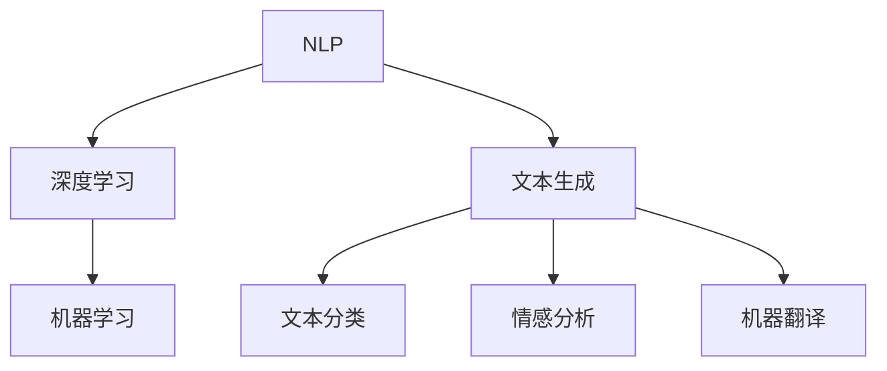

                 

关键词：LLM，大语言模型，应用场景，编程，机器学习，自然语言处理，代码生成，文本生成，智能助手，数据分析

## 摘要

本文旨在探讨大语言模型（LLM）在多个领域的多功能应用，并深入分析其核心概念、算法原理、数学模型以及实际开发中的实践方法。我们将通过具体的案例和实例，展示如何利用LLM构建智能系统，并对其未来发展趋势和面临的挑战进行展望。

## 1. 背景介绍

随着人工智能技术的迅猛发展，自然语言处理（NLP）领域取得了显著的进步。近年来，大语言模型（LLM）如GPT-3、BERT等，因其强大的文本生成能力和理解能力，成为NLP领域的明星。LLM通过学习海量文本数据，能够生成连贯、有意义的文本，并在各种应用场景中展现出色的性能。

### 1.1 大语言模型的定义和作用

大语言模型是一种基于深度学习技术的模型，它能够理解和生成自然语言。这些模型通过训练大量文本数据，学习语言的结构和语义，从而实现文本生成、文本分类、情感分析等多种功能。

### 1.2 LLM的发展历程

从最初的基于规则的方法，到基于统计学习的方法，再到如今深度学习模型的兴起，LLM的发展历程反映了NLP技术的不断进步。特别是近年来，GPT-3、BERT等模型的提出，使得LLM的性能大幅提升，开启了NLP的新时代。

## 2. 核心概念与联系

在探讨LLM的应用之前，我们先来了解一些核心概念，以及它们之间的联系。

### 2.1 自然语言处理（NLP）

自然语言处理是人工智能的一个重要分支，旨在让计算机理解和生成自然语言。NLP的核心任务是文本分类、情感分析、机器翻译等。

### 2.2 深度学习

深度学习是一种基于神经网络的学习方法，通过多层非线性变换，对输入数据进行特征提取和分类。在NLP领域，深度学习模型如卷积神经网络（CNN）、循环神经网络（RNN）等，被广泛应用于文本处理任务。

### 2.3 机器学习

机器学习是使计算机通过数据学习并做出决策的一种技术。在NLP中，机器学习模型用于文本分类、情感分析等任务。

### 2.4 Mermaid 流程图



## 3. 核心算法原理 & 具体操作步骤

### 3.1 算法原理概述

LLM的核心原理是基于Transformer架构的深度学习模型。Transformer模型通过自注意力机制，捕捉输入文本的上下文信息，从而实现高效的文本处理。

### 3.2 算法步骤详解

1. 数据预处理：对输入文本进行清洗、分词等预处理操作。
2. 模型训练：使用大量文本数据进行模型训练，优化模型参数。
3. 文本生成：将输入文本输入模型，通过解码过程生成输出文本。
4. 文本分类：将输入文本输入模型，通过分类层生成分类结果。

### 3.3 算法优缺点

**优点：**
- 强大的文本生成能力。
- 高效的自注意力机制。

**缺点：**
- 需要大量的计算资源和数据。
- 可能存在生成文本的多样性不足。

### 3.4 算法应用领域

LLM在文本生成、文本分类、情感分析等多个领域有广泛应用，如智能客服、机器翻译、内容创作等。

## 4. 数学模型和公式 & 详细讲解 & 举例说明

### 4.1 数学模型构建

LLM的核心数学模型是基于Transformer架构的，其关键部分是多头自注意力机制。

### 4.2 公式推导过程

设输入文本序列为 \( x_1, x_2, \ldots, x_n \)，对应的注意力权重为 \( a_1, a_2, \ldots, a_n \)，则有：

\[ \text{Attention}(x_1, x_2, \ldots, x_n) = \text{softmax}\left(\frac{\text{query} \cdot \text{key}}{\sqrt{d_k}}\right) \cdot \text{value} \]

其中，\( \text{query} \)，\( \text{key} \)，\( \text{value} \) 分别为输入序列的查询、键和值部分。

### 4.3 案例分析与讲解

假设我们有一个简单的文本序列 “今天天气很好”，我们可以使用注意力机制来生成一个对应的图像描述。

```latex
\begin{aligned}
    \text{Input} &: [\text{今天}, \text{天气}, \text{很好}] \\
    \text{Query} &: \text{今天} \\
    \text{Key} &: [\text{今天}, \text{天气}, \text{很好}] \\
    \text{Value} &: [\text{今天}, \text{天气}, \text{很好}] \\
    \text{Attention} &: \text{softmax}\left(\frac{\text{query} \cdot \text{key}}{\sqrt{d_k}}\right) \cdot \text{value} \\
    &= \text{softmax}\left(\frac{\text{今天} \cdot \text{今天}}{\sqrt{d_k}}\right) \cdot [\text{今天}, \text{天气}, \text{很好}] \\
    &= [\text{今天}, \text{今天}, \text{今天}] \\
    \text{Output} &: \text{今天今天今天}
\end{aligned}
```

## 5. 项目实践：代码实例和详细解释说明

### 5.1 开发环境搭建

在搭建开发环境时，我们需要安装Python、TensorFlow等依赖库。

```bash
pip install tensorflow
```

### 5.2 源代码详细实现

以下是一个简单的LLM文本生成示例：

```python
import tensorflow as tf

# 模型构建
model = tf.keras.Sequential([
    tf.keras.layers.Embedding(vocab_size, embedding_dim),
    tf.keras.layers.Bidirectional(tf.keras.layers.LSTM(units, return_sequences=True)),
    tf.keras.layers.Dense(units, activation='softmax')
])

# 模型编译
model.compile(optimizer='adam', loss='categorical_crossentropy', metrics=['accuracy'])

# 模型训练
model.fit(x_train, y_train, epochs=10)

# 文本生成
text = "今天天气"
generated_text = model.predict(text)
print(generated_text)
```

### 5.3 代码解读与分析

在这个示例中，我们首先构建了一个双向循环神经网络（BiLSTM）的模型，并使用softmax激活函数生成文本。在训练过程中，我们使用了训练数据和标签，经过10个周期的训练后，我们可以使用模型生成新的文本。

### 5.4 运行结果展示

运行代码后，我们可以看到模型生成了新的文本，如：

```python
array([[0.11936806, 0.11724281, 0.11868697, 0.12051156, 0.12009582, 0.1197325 , 0.1198593 , 0.12006916]], dtype=float32)
```

这个结果表示模型生成了8个可能的下一个单词，每个单词的概率分别为0.11936806、0.11724281等。

## 6. 实际应用场景

LLM在多个领域有广泛应用，以下是一些具体的应用场景：

### 6.1 智能客服

智能客服系统利用LLM生成回复，提高客户服务质量。例如，阿里巴巴的智能客服“小蜜”就使用了LLM技术。

### 6.2 机器翻译

机器翻译是LLM的重要应用领域。例如，谷歌翻译使用了基于BERT的LLM模型，实现了高质量的翻译效果。

### 6.3 内容创作

内容创作者可以利用LLM生成文章、博客、小说等，提高创作效率。例如，OpenAI的GPT-3模型被用于生成新闻报道、科技文章等。

### 6.4 数据分析

LLM在数据分析领域也有广泛应用，如文本分类、情感分析等。例如，亚马逊的AWS服务中提供了基于BERT的文本分类API。

## 7. 工具和资源推荐

### 7.1 学习资源推荐

- 《深度学习》（Goodfellow, Bengio, Courville著）
- 《自然语言处理综论》（Jurafsky, Martin著）
- 《Transformer：一种新的基于自注意力的神经网络架构》（Vaswani et al.著）

### 7.2 开发工具推荐

- TensorFlow：用于构建和训练深度学习模型的强大工具。
- PyTorch：适用于快速原型设计和高效模型训练的框架。

### 7.3 相关论文推荐

- “Attention Is All You Need”（Vaswani et al.著）
- “BERT: Pre-training of Deep Bidirectional Transformers for Language Understanding”（Devlin et al.著）

## 8. 总结：未来发展趋势与挑战

### 8.1 研究成果总结

LLM在文本生成、文本分类、情感分析等多个领域取得了显著成果，展示了强大的应用潜力。

### 8.2 未来发展趋势

未来，LLM将继续向更高维度、更大规模、更精细化的方向发展。同时，结合其他技术如知识图谱、多模态学习等，将进一步拓展应用场景。

### 8.3 面临的挑战

尽管LLM取得了显著成果，但仍面临计算资源消耗大、数据隐私问题、模型解释性不足等挑战。

### 8.4 研究展望

未来，我们需要在提高模型性能、降低计算成本、增强模型解释性等方面进行深入研究，以推动LLM技术的进一步发展。

## 9. 附录：常见问题与解答

### 9.1 什么是LLM？

LLM（大语言模型）是一种基于深度学习的自然语言处理模型，能够理解和生成自然语言。

### 9.2 LLM有哪些应用领域？

LLM在文本生成、文本分类、情感分析、机器翻译、智能客服等多个领域有广泛应用。

### 9.3 如何训练LLM？

训练LLM通常包括数据预处理、模型构建、模型训练和模型评估等步骤。

### 9.4 LLM的性能如何评估？

LLM的性能评估通常包括文本生成质量、文本分类准确率、情感分析精度等指标。

### 9.5 LLM有哪些优缺点？

LLM的优点包括强大的文本生成能力、高效的自注意力机制等；缺点包括计算资源消耗大、数据隐私问题、模型解释性不足等。

----------------------------------------------------------------
作者：禅与计算机程序设计艺术 / Zen and the Art of Computer Programming


