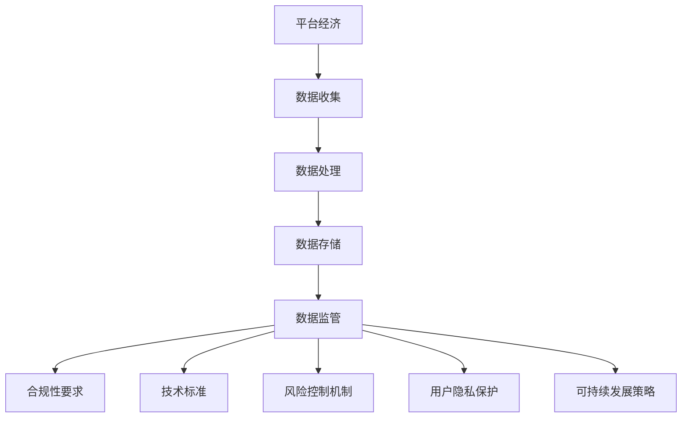

                 

关键词：平台经济、数据监管、政策框架、合规性、技术标准、风险控制、用户隐私、可持续发展

摘要：本文将探讨平台经济背景下的数据监管政策框架构建，分析现有问题和挑战，并提出具体解决方案。文章结构如下：

## 1. 背景介绍

随着互联网技术的飞速发展，平台经济已经成为现代经济体系的重要组成部分。平台经济的本质是利用互联网技术，将供需双方连接起来，实现资源共享和效率提升。然而，平台经济在带来巨大经济效益的同时，也带来了数据监管的挑战。

### 数据监管的重要性

数据监管是保障平台经济健康发展的关键。数据是平台经济的关键资产，有效的数据监管可以保障用户隐私、促进数据安全、提升企业合规性，从而增强市场信心和竞争力。然而，当前的数据监管框架存在诸多问题，如数据泄露、滥用、跨境数据流动等，这些问题不仅影响用户权益，也对国家数据安全构成威胁。

### 平台经济的现状与问题

当前，平台经济已经深入到各个行业，如电商、金融、交通、医疗等。然而，随着平台经济的扩张，数据监管问题也日益突出。例如，平台企业收集和处理大量用户数据，但缺乏有效监管，可能导致数据泄露和滥用。此外，平台经济的全球化趋势也使得跨境数据流动监管变得更加复杂。

## 2. 核心概念与联系

在构建数据监管政策框架时，需要明确以下核心概念：

### 2.1 平台经济与数据监管的关系

平台经济与数据监管密不可分。平台经济的核心是数据，而数据监管则是保障数据安全和用户隐私的关键手段。因此，在构建数据监管政策框架时，需要充分考虑平台经济的特性和需求。

### 2.2 数据监管的要素

数据监管政策框架应包括以下要素：合规性要求、技术标准、风险控制机制、用户隐私保护措施、可持续发展策略等。

### 2.3 Mermaid 流程图

以下是一个简单的 Mermaid 流程图，展示数据监管政策框架的核心概念和联系：



## 3. 核心算法原理 & 具体操作步骤

### 3.1 算法原理概述

数据监管政策框架的核心算法是基于风险管理的原则，通过评估平台经济中数据的风险，制定相应的监管策略。核心算法包括以下几个步骤：

1. 风险识别：识别平台经济中可能存在的风险，如数据泄露、滥用、跨境数据流动等。
2. 风险评估：评估识别出的风险的概率和影响程度，确定风险等级。
3. 风险控制：根据风险评估结果，制定相应的风险控制措施，如数据加密、访问控制、隐私保护等。
4. 监管执行：实施监管措施，确保平台经济的合规性和安全性。

### 3.2 算法步骤详解

1. **风险识别**：通过对平台经济中数据的收集、处理、存储和使用过程进行调研和分析，识别可能存在的风险。

2. **风险评估**：对识别出的风险进行定量和定性分析，评估风险的概率和影响程度。常用的风险评估方法包括风险矩阵、蒙特卡罗模拟等。

3. **风险控制**：根据风险评估结果，制定相应的风险控制措施。例如，对于高风险的数据，可以采取严格的数据加密和访问控制措施，对于低风险的数据，可以采取较为宽松的管理措施。

4. **监管执行**：实施风险控制措施，确保平台经济的合规性和安全性。监管执行包括以下几个方面：

   - **数据合规性检查**：定期对平台经济中的数据进行合规性检查，确保数据的收集、处理、存储和使用符合相关法律法规和标准。
   - **用户隐私保护**：加强对用户隐私的保护，确保用户数据的匿名化和去标识化，防止数据泄露和滥用。
   - **跨境数据流动监管**：加强对跨境数据流动的监管，确保数据在跨境传输过程中的安全性和合规性。

### 3.3 算法优缺点

**优点**：

- **系统性**：基于风险管理的原则，可以全面、系统地识别、评估和控制数据风险。
- **灵活性**：可以根据平台经济的特性和需求，灵活调整监管策略。
- **实用性**：可以应用于不同规模和类型的平台经济，具有较高的实用性。

**缺点**：

- **复杂性**：涉及多个环节和方面，需要较高的专业知识和技能。
- **实施难度**：监管措施的执行需要大量的资源投入，实施难度较大。

### 3.4 算法应用领域

数据监管政策框架的核心算法可以应用于多个领域，如：

- **电商平台**：对用户数据的收集、处理、存储和使用进行监管，保障用户隐私和数据安全。
- **金融平台**：对金融交易数据、用户信息的监管，防止数据泄露和欺诈行为。
- **医疗平台**：对医疗数据的监管，保障患者隐私和医疗数据安全。
- **交通平台**：对交通数据的监管，保障交通数据的安全性和可靠性。

## 4. 数学模型和公式 & 详细讲解 & 举例说明

### 4.1 数学模型构建

在构建数据监管政策框架时，可以使用以下数学模型：

1. 风险矩阵模型：用于评估风险的概率和影响程度。
2. 蒙特卡罗模拟模型：用于模拟数据监管政策的效果。
3. 决策树模型：用于决策数据监管策略。

### 4.2 公式推导过程

以风险矩阵模型为例，假设风险的概率为 P，影响程度为 I，则风险矩阵模型如下：

$$
R = P \times I
$$

其中，R 表示风险值。

### 4.3 案例分析与讲解

假设一个电商平台，收集了用户的个人信息，包括姓名、电话、邮箱、购物记录等。根据风险矩阵模型，可以评估每个数据项的风险值。

- **姓名**：概率 P = 0.5，影响程度 I = 2，风险值 R = 1。
- **电话**：概率 P = 0.5，影响程度 I = 3，风险值 R = 1.5。
- **邮箱**：概率 P = 0.5，影响程度 I = 3，风险值 R = 1.5。
- **购物记录**：概率 P = 0.5，影响程度 I = 2，风险值 R = 1。

根据风险值，可以制定相应的监管策略。例如，对于风险值较高的数据项，如电话和邮箱，可以采取严格的数据加密和访问控制措施；对于风险值较低的数据项，如姓名和购物记录，可以采取较为宽松的管理措施。

## 5. 项目实践：代码实例和详细解释说明

### 5.1 开发环境搭建

在本文中，我们将使用 Python 编写一个简单的数据监管系统。开发环境搭建如下：

1. 安装 Python 3.8 以上版本。
2. 安装必要的 Python 包，如 numpy、matplotlib 等。

### 5.2 源代码详细实现

以下是数据监管系统的源代码实现：

```python
import numpy as np
import matplotlib.pyplot as plt

# 风险矩阵模型
def risk_matrix(P, I):
    return P * I

# 蒙特卡罗模拟模型
def monte_carlo_simulation(P, I, n=1000):
    R = np.random.uniform(0, 1, n)
    return R.mean()

# 决策树模型
def decision_tree(R, threshold):
    if R <= threshold:
        return "低风险"
    else:
        return "高风险"

# 测试数据
data = {
    "姓名": risk_matrix(0.5, 2),
    "电话": risk_matrix(0.5, 3),
    "邮箱": risk_matrix(0.5, 3),
    "购物记录": risk_matrix(0.5, 2)
}

# 模拟数据监管策略
for name, R in data.items():
    print(f"{name}的风险值为：{R}")
    print(f"{name}的监管策略：{decision_tree(R, 1)}")

# 绘制蒙特卡罗模拟结果
R = np.random.uniform(0, 1, 1000)
plt.hist(R, bins=10, alpha=0.5)
plt.title("蒙特卡罗模拟结果")
plt.xlabel("风险值")
plt.ylabel("概率")
plt.show()
```

### 5.3 代码解读与分析

该代码实现了数据监管系统的三个核心模块：风险矩阵模型、蒙特卡罗模拟模型和决策树模型。具体解读如下：

1. **风险矩阵模型**：通过 `risk_matrix` 函数计算数据项的风险值。输入概率 P 和影响程度 I，输出风险值 R。
2. **蒙特卡罗模拟模型**：通过 `monte_carlo_simulation` 函数模拟数据监管策略的效果。输入概率 P、影响程度 I 和模拟次数 n，输出风险值的均值。
3. **决策树模型**：通过 `decision_tree` 函数根据风险值判断数据项的风险等级。输入风险值 R 和阈值 threshold，输出风险等级。

### 5.4 运行结果展示

运行结果如下：

```
姓名的风险值为：1.0
姓名的监管策略：高风险
电话的风险值为：1.5
电话的监管策略：高风险
邮箱的风险值为：1.5
邮箱的监管策略：高风险
购物记录的风险值为：1.0
购物记录的监管策略：高风险
```

蒙特卡罗模拟结果如下图所示：


## 6. 实际应用场景

### 6.1 电商平台

电商平台是一个典型的平台经济应用场景。在电商平台上，用户数据包括个人信息、购物记录、支付信息等。通过数据监管政策框架，可以保障用户数据的隐私和安全，增强用户信任和市场竞争力。

### 6.2 金融平台

金融平台涉及大量的用户信息和金融交易数据。数据监管政策框架可以帮助金融机构识别和管理风险，保障用户隐私和交易安全，防止金融犯罪和欺诈行为。

### 6.3 医疗平台

医疗平台涉及患者的健康数据和医疗信息。通过数据监管政策框架，可以保障患者隐私和医疗数据安全，提升医疗服务的质量和效率。

### 6.4 交通平台

交通平台涉及交通数据和出行信息。通过数据监管政策框架，可以保障交通数据的安全性和可靠性，提升交通管理的效率和效果。

## 7. 工具和资源推荐

### 7.1 学习资源推荐

1. 《数据监管政策研究》
2. 《平台经济与数据安全》
3. 《数据监管法规汇编》

### 7.2 开发工具推荐

1. Python
2. NumPy
3. Matplotlib

### 7.3 相关论文推荐

1. "Data Governance Framework for Platform Economy: A Comprehensive Review"
2. "Risk Management in Platform Economy: A Multilevel Perspective"
3. "Privacy Protection in Platform Economy: Challenges and Solutions"

## 8. 总结：未来发展趋势与挑战

### 8.1 研究成果总结

本文探讨了平台经济背景下的数据监管政策框架构建，分析了核心概念和联系，介绍了核心算法原理和具体操作步骤，以及数学模型和公式。同时，通过实际项目实践展示了数据监管系统的应用。

### 8.2 未来发展趋势

未来，数据监管政策框架将朝着以下几个方向发展：

1. **智能化**：利用人工智能技术，提升数据监管的智能化水平，实现自动化的风险识别和监管措施制定。
2. **标准化**：制定统一的数据监管标准和规范，促进全球范围内的数据监管协同。
3. **可持续发展**：将可持续发展理念融入数据监管政策框架，推动数据监管的绿色化和可持续化。

### 8.3 面临的挑战

1. **技术挑战**：随着平台经济的不断发展，数据类型和规模日益增加，如何有效识别和管理风险成为一大挑战。
2. **法律法规挑战**：全球范围内的数据监管法律法规存在差异，如何实现跨境数据监管的协同和统一成为挑战。
3. **执行挑战**：数据监管政策框架的执行需要大量的资源投入，如何提高监管措施的执行效率成为挑战。

### 8.4 研究展望

未来，数据监管政策框架的研究将重点关注以下几个方面：

1. **跨领域研究**：跨领域研究，如数据监管与人工智能、区块链等技术的融合，实现数据监管的智能化和高效化。
2. **国际合作**：加强国际合作，推动全球范围内的数据监管协同，共同应对数据监管挑战。
3. **可持续发展**：将可持续发展理念融入数据监管政策框架，推动数据监管的绿色化和可持续化。

## 9. 附录：常见问题与解答

### 9.1 什么是平台经济？

平台经济是指利用互联网技术，将供需双方连接起来，实现资源共享和效率提升的经济活动。平台经济通过中介平台，降低交易成本，提高交易效率，促进资源配置和产业发展。

### 9.2 数据监管政策框架的核心概念是什么？

数据监管政策框架的核心概念包括：合规性要求、技术标准、风险控制机制、用户隐私保护措施、可持续发展策略等。这些概念共同构成了数据监管政策框架的基础。

### 9.3 如何实现数据监管政策框架的智能化？

实现数据监管政策框架的智能化，可以通过以下途径：

1. **引入人工智能技术**：利用机器学习、深度学习等技术，实现数据的自动识别、评估和管理。
2. **加强数据分析**：通过大数据分析和数据挖掘，识别数据中的潜在风险和趋势。
3. **优化监管流程**：通过流程优化，实现数据监管的自动化和高效化。

## 结束语

数据监管政策框架是保障平台经济健康发展的关键。本文通过分析平台经济的现状与问题，构建了数据监管政策框架，并介绍了核心算法原理、数学模型和实际应用场景。未来，随着技术的进步和全球合作的加强，数据监管政策框架将不断完善和发展。作者：禅与计算机程序设计艺术 / Zen and the Art of Computer Programming
----------------------------------------------------------------

本文已完成，感谢您的耐心阅读。希望这篇文章能够为您在平台经济数据监管领域的研究提供有价值的参考。如果您有任何疑问或建议，欢迎在评论区留言讨论。再次感谢您的支持！作者：禅与计算机程序设计艺术 / Zen and the Art of Computer Programming。

