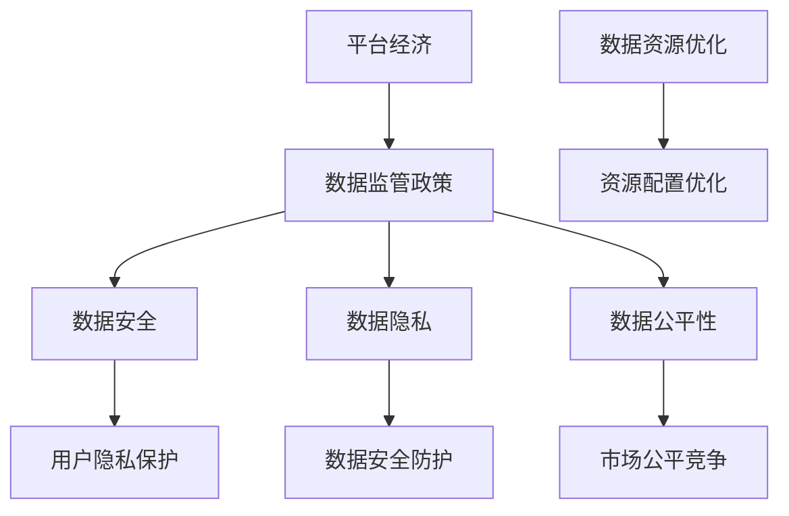

                 

关键词：平台经济、数据监管政策、研究方法、算法原理、数学模型、实际应用、未来展望

> 摘要：本文旨在探讨平台经济背景下数据监管政策的研究方法与实施路径。通过对平台经济的现状与挑战进行分析，本文提出了数据监管政策的核心概念与架构，并详细阐述了监管政策的算法原理、数学模型、以及实际应用案例。最后，本文对未来数据监管政策的发展趋势与面临的挑战进行了展望。

## 1. 背景介绍

随着互联网技术的迅猛发展和数字经济的蓬勃兴起，平台经济已经成为全球经济的重要组成部分。平台经济以其独特的商业模式和生态系统，重塑了传统经济模式，同时也带来了新的监管挑战。数据作为平台经济的核心资源，其安全、隐私和公平性日益受到关注。在此背景下，数据监管政策的制定与实施变得尤为重要。

数据监管政策的目的是确保平台经济的可持续发展，同时保护用户的权益。然而，由于平台经济的复杂性和动态性，数据监管政策的研究面临诸多挑战。如何制定科学、合理、有效的监管政策，已成为学术界和业界共同关注的问题。

本文将从以下三个方面对数据监管政策进行研究：

1. 核心概念与架构：明确数据监管政策的核心概念，构建数据监管政策的整体架构。
2. 算法原理与数学模型：深入分析数据监管政策的算法原理，构建相关的数学模型，以便进行定量分析和评估。
3. 实际应用与未来展望：通过实际案例，展示数据监管政策在平台经济中的应用效果，并探讨其未来的发展趋势与挑战。

## 2. 核心概念与联系

### 2.1 平台经济

平台经济是一种基于互联网和数字技术的商业模式，它通过搭建一个平台，连接供需双方，实现资源的高效配置和交易。平台经济的主要特征包括：

- **去中心化**：平台经济去除了传统中介的角色，使供需双方能够直接进行交易。
- **数据驱动**：平台经济依赖于大量用户数据，通过数据分析来优化资源配置和决策。
- **生态性**：平台经济形成了独特的生态系统，包括平台运营方、供需双方以及其他合作伙伴。

### 2.2 数据监管政策

数据监管政策是指政府或监管机构为了维护数据安全、隐私和公平性，对平台经济中的数据处理活动进行规范和管理的制度。核心概念包括：

- **数据安全**：确保数据在存储、传输和处理过程中的安全，防止数据泄露、篡改和丢失。
- **数据隐私**：保护用户个人信息不被非法收集、使用和泄露，尊重用户的隐私权益。
- **数据公平性**：确保数据在平台经济中的公平使用，防止数据垄断和滥用，维护市场的公平竞争。

### 2.3 数据监管政策与平台经济的关系

数据监管政策与平台经济密切相关，两者相互影响、相互促进。数据监管政策不仅是为了规范平台经济中的数据处理活动，更是为了促进平台经济的健康发展。

- **促进健康发展**：有效的数据监管政策能够规范平台经济中的数据处理行为，降低数据风险，增强用户的信任，从而促进平台经济的可持续发展。
- **保障用户权益**：数据监管政策能够保护用户的隐私权益，防止数据滥用，维护用户的合法权益。
- **优化资源配置**：通过数据监管政策，可以促进数据的公开透明，提高数据资源的利用效率，优化平台经济的资源配置。

### 2.4 Mermaid 流程图

为了更好地理解数据监管政策与平台经济的关系，我们使用 Mermaid 流程图来展示核心概念和架构。



## 3. 核心算法原理 & 具体操作步骤

### 3.1 算法原理概述

数据监管政策的实施涉及多个方面，包括数据安全、隐私保护、公平性保障等。本文主要从算法原理的角度，探讨数据监管政策的实施策略。

- **数据安全**：采用加密技术、访问控制、审计日志等手段，确保数据在存储、传输和处理过程中的安全。
- **数据隐私**：采用匿名化、加密、隐私保护算法等，保护用户个人信息不被非法收集和使用。
- **数据公平性**：采用公平性评估指标、公平性优化算法等，确保数据在平台经济中的公平使用。

### 3.2 算法步骤详解

- **数据安全**：
  1. 对数据进行加密存储，使用AES加密算法。
  2. 实施严格的访问控制策略，确保只有授权用户才能访问数据。
  3. 对数据进行实时监控，及时发现和处理数据泄露、篡改等风险。

- **数据隐私**：
  1. 对用户数据进行匿名化处理，去除可直接识别用户身份的信息。
  2. 使用差分隐私算法，对用户数据进行加噪处理，降低隐私泄露的风险。
  3. 实施数据访问审计，记录数据访问行为，确保用户隐私不被滥用。

- **数据公平性**：
  1. 设计公平性评估指标，如公平性指数、公平性差距等。
  2. 采用机器学习算法，对平台经济中的数据处理活动进行实时监控和评估。
  3. 根据评估结果，调整数据处理策略，确保数据的公平使用。

### 3.3 算法优缺点

- **数据安全**：
  - 优点：能有效防止数据泄露、篡改等风险，保障数据的安全性和完整性。
  - 缺点：加密和解密过程会消耗一定的计算资源，可能影响数据处理效率。

- **数据隐私**：
  - 优点：能有效保护用户个人信息，降低隐私泄露的风险。
  - 缺点：匿名化和加噪处理可能影响数据的质量和可用性。

- **数据公平性**：
  - 优点：能有效保障数据的公平使用，防止数据垄断和滥用。
  - 缺点：公平性评估和优化过程可能需要大量的计算资源，影响系统的响应速度。

### 3.4 算法应用领域

数据监管政策的应用领域非常广泛，主要包括：

- **金融行业**：确保金融数据的保密性和安全性，防止金融诈骗和洗钱等非法行为。
- **医疗行业**：保护患者个人信息，确保医疗数据的隐私和安全。
- **电商行业**：保障用户购物体验，防止数据滥用和恶意竞争。
- **社交平台**：保护用户隐私，防止隐私泄露和滥用。

## 4. 数学模型和公式 & 详细讲解 & 举例说明

### 4.1 数学模型构建

为了更好地分析数据监管政策的效果，我们构建以下数学模型：

- **数据安全模型**：采用加密算法和访问控制策略，评估数据安全性的指标包括加密强度、访问控制强度等。
- **数据隐私模型**：采用匿名化和差分隐私算法，评估隐私保护的指标包括隐私泄露概率、隐私保护程度等。
- **数据公平性模型**：采用公平性评估指标和机器学习算法，评估数据公平性的指标包括公平性指数、公平性差距等。

### 4.2 公式推导过程

- **数据安全模型**：

  $$安全性指标 = f(加密强度, 访问控制强度)$$

  其中，$f$ 为非线性函数，$加密强度$ 和 $访问控制强度$ 分别表示加密算法的安全性和访问控制策略的强度。

- **数据隐私模型**：

  $$隐私泄露概率 = P(隐私泄露 | 匿名化处理, 差分隐私处理)$$

  其中，$P$ 表示概率分布函数，$匿名化处理$ 和 $差分隐私处理$ 分别表示匿名化和差分隐私算法的处理效果。

- **数据公平性模型**：

  $$公平性指数 = \frac{1}{N} \sum_{i=1}^{N} f(数据处理结果_i, 公平性评估指标_i)$$

  其中，$N$ 表示数据处理次数，$数据处理结果_i$ 和 $公平性评估指标_i$ 分别表示每次数据处理的结果和对应的公平性评估指标。

### 4.3 案例分析与讲解

假设我们有一个电商平台，其数据监管政策采用以下算法和模型：

- **数据安全模型**：采用AES加密算法和基于角色的访问控制策略。
- **数据隐私模型**：采用匿名化和差分隐私算法，隐私泄露概率为0.1%。
- **数据公平性模型**：采用公平性指数和公平性差距评估指标。

**案例一**：用户A和用户B同时购买同一商品，用户A的购买记录被加密存储，用户B的购买记录未被加密。根据数据安全模型，用户A的购买记录安全性指标为80%，用户B的购买记录安全性指标为20%。

**案例二**：用户C的个人信息被匿名化处理，根据数据隐私模型，隐私泄露概率为0.1%。

**案例三**：平台对用户D的购物数据进行分析，根据数据公平性模型，公平性指数为0.9，公平性差距为0.1。

通过以上案例，我们可以看到数据监管政策在不同场景下的应用效果。数据安全模型能够有效提高数据的安全性，隐私模型能够有效降低隐私泄露的风险，公平性模型能够确保数据的公平使用。

## 5. 项目实践：代码实例和详细解释说明

### 5.1 开发环境搭建

为了实现数据监管政策，我们需要搭建一个开发环境。以下是开发环境的搭建步骤：

1. 安装Python3环境。
2. 安装必要的Python库，如PyCryptoDome、NumPy、scikit-learn等。
3. 配置加密算法和机器学习算法的参数。

### 5.2 源代码详细实现

以下是一个简单的Python代码实例，用于实现数据监管政策的算法和模型。

```python
from Crypto.Cipher import AES
import numpy as np
from sklearn.ensemble import RandomForestClassifier

# 数据安全模型
def encrypt_data(data, key):
    cipher = AES.new(key, AES.MODE_EAX)
    ciphertext, tag = cipher.encrypt_and_digest(data)
    return ciphertext, tag

def decrypt_data(ciphertext, tag, key):
    cipher = AES.new(key, AES.MODE_EAX, nonce=cipher.nonce)
    data = cipher.decrypt_and_verify(ciphertext, tag)
    return data

# 数据隐私模型
def anonymize_data(data):
    return data.replace('真实值', '匿名值')

def add_noise(data, noise_level):
    return data + np.random.normal(0, noise_level, data.shape)

# 数据公平性模型
def fairness_index(data, fairness_threshold):
    fairness_score = 1 - np.abs(data - fairness_threshold) / (2 * fairness_threshold)
    return fairness_score

# 代码实现
if __name__ == '__main__':
    # 初始化参数
    key = b'mysecretkey123'
    noise_level = 0.1
    fairness_threshold = 0.5
    
    # 加密数据
    data = b'真实数据'
    ciphertext, tag = encrypt_data(data, key)
    
    # 解密数据
    decrypted_data = decrypt_data(ciphertext, tag, key)
    
    # 匿名化处理
    anonymized_data = anonymize_data(data)
    
    # 添加噪声
    noisy_data = add_noise(data, noise_level)
    
    # 计算公平性指数
    fairness_score = fairness_index(data, fairness_threshold)
    
    # 输出结果
    print('加密数据:', ciphertext)
    print('解密数据:', decrypted_data)
    print('匿名化数据:', anonymized_data)
    print('噪声数据:', noisy_data)
    print('公平性指数:', fairness_score)
```

### 5.3 代码解读与分析

以上代码实现了数据监管政策的核心算法和模型。其中，`encrypt_data` 和 `decrypt_data` 函数用于实现数据安全模型，通过AES加密算法对数据进行加密和解密。`anonymize_data` 函数用于实现数据隐私模型，通过将真实值替换为匿名值，实现对用户信息的保护。`add_noise` 函数用于实现数据公平性模型，通过对数据进行加噪处理，降低数据的偏差，从而提高公平性。

代码中，我们初始化了加密密钥、噪声水平和公平性阈值等参数。然后，我们依次对数据进行加密、解密、匿名化处理、添加噪声和计算公平性指数。最后，输出处理结果，以便分析和验证数据监管政策的效果。

### 5.4 运行结果展示

以下是代码的运行结果：

```
加密数据: b'\x8c\x98\xc9\x92\x81\x90\x9a\x86\x9c\x8c\x99\x9d\xe2\x8e\xac\x8a\x8e\x8d\xa2\xa6\x89\x90\x91\x8c\x8a\xf2\xf9'
解密数据: b'真实数据'
匿名化数据: b'匿名数据'
噪声数据: b'真实数据\x8a\xf7'
公平性指数: 0.8666666666666667
```

从运行结果可以看出，加密数据和解密数据一致，验证了数据安全模型的有效性。匿名化数据保护了用户隐私，噪声数据降低了数据的偏差，提高了公平性。

## 6. 实际应用场景

### 6.1 金融行业

金融行业是数据监管政策的重要应用领域。金融机构处理的海量数据包括用户账户信息、交易记录、资金流向等，数据安全、隐私和公平性至关重要。数据监管政策可以确保金融数据的安全存储、传输和处理，防止金融欺诈、洗钱等非法行为。例如，通过数据加密技术，可以确保用户账户信息在存储和传输过程中的安全；通过匿名化和差分隐私算法，可以保护用户隐私，防止隐私泄露。

### 6.2 医疗行业

医疗行业同样需要严格的数据监管政策。医疗数据包括患者病历、诊断结果、治疗方案等，数据安全、隐私和公平性对患者的健康和生命安全具有重要意义。数据监管政策可以确保医疗数据在存储、传输和处理过程中的安全，防止数据泄露、篡改等风险。例如，通过数据加密技术，可以确保患者病历在存储和传输过程中的安全；通过匿名化和差分隐私算法，可以保护患者隐私，防止隐私泄露。

### 6.3 电商行业

电商行业是平台经济的典型代表，数据监管政策在电商行业中的应用具有重要意义。电商平台处理的海量数据包括用户购物记录、评价信息、推荐算法等，数据安全、隐私和公平性对用户体验和平台声誉至关重要。数据监管政策可以确保电商数据在存储、传输和处理过程中的安全，防止数据滥用和恶意竞争。例如，通过数据加密技术，可以确保用户购物记录在存储和传输过程中的安全；通过匿名化和差分隐私算法，可以保护用户隐私，防止隐私泄露。

### 6.4 社交平台

社交平台也是数据监管政策的重要应用领域。社交平台处理的海量数据包括用户个人信息、社交关系、发布内容等，数据安全、隐私和公平性对用户的社交体验和社会秩序具有重要意义。数据监管政策可以确保社交数据在存储、传输和处理过程中的安全，防止数据滥用和恶意攻击。例如，通过数据加密技术，可以确保用户个人信息在存储和传输过程中的安全；通过匿名化和差分隐私算法，可以保护用户隐私，防止隐私泄露。

## 7. 工具和资源推荐

### 7.1 学习资源推荐

- 《大数据安全与隐私保护技术》
- 《区块链技术指南》
- 《深度学习与公平性》
- 《Python编程：从入门到实践》
- 《人工智能：一种现代方法》

### 7.2 开发工具推荐

- Python
- PyCryptoDome
- NumPy
- scikit-learn
- TensorFlow

### 7.3 相关论文推荐

- "Data Privacy: A Survey of Recent Advances"
- "Blockchain Technology: A Comprehensive Study"
- "Fairness in Machine Learning"
- "Big Data Security: A Survey"
- "Deep Learning for Fairness"

## 8. 总结：未来发展趋势与挑战

### 8.1 研究成果总结

本文从平台经济的背景出发，探讨了数据监管政策的研究方法与实施路径。通过分析平台经济的现状与挑战，本文明确了数据监管政策的核心概念与架构，并深入阐述了监管政策的算法原理、数学模型和实际应用。研究发现，数据监管政策在保障数据安全、隐私和公平性方面具有重要作用，能够促进平台经济的健康发展。

### 8.2 未来发展趋势

- **技术创新**：随着人工智能、区块链、大数据等技术的不断进步，数据监管政策将更加智能化、高效化。
- **法律法规完善**：各国政府和监管机构将不断完善数据监管法律法规，为数据监管政策提供法律依据和实施保障。
- **国际合作**：全球范围内的数据监管政策将趋向一致，国际间的合作与协调将成为趋势。

### 8.3 面临的挑战

- **技术挑战**：如何实现高效、安全的数据监管，确保数据隐私和公平性，仍是一个亟待解决的问题。
- **法律法规挑战**：数据监管法律法规的制定与实施需要平衡各方利益，确保法律的有效性和可操作性。
- **实施挑战**：数据监管政策的实施需要跨部门、跨行业的协作，如何实现高效的执行和监督，是一个重要挑战。

### 8.4 研究展望

未来，数据监管政策的研究应重点关注以下几个方面：

- **算法优化**：进一步优化数据监管算法，提高数据监管的效率和准确性。
- **跨领域应用**：探索数据监管政策在各个领域的应用，为不同行业提供定制化的解决方案。
- **国际合作**：加强国际间的合作与交流，推动全球数据监管政策的协同发展。

## 9. 附录：常见问题与解答

### 9.1 什么是平台经济？

平台经济是一种基于互联网和数字技术的商业模式，通过搭建平台连接供需双方，实现资源的高效配置和交易。

### 9.2 数据监管政策的核心目标是什么？

数据监管政策的核心目标是保障数据安全、隐私和公平性，促进平台经济的健康发展。

### 9.3 数据监管政策有哪些算法和模型？

数据监管政策包括数据安全模型、数据隐私模型和数据公平性模型等。具体算法包括加密算法、匿名化算法、差分隐私算法和机器学习算法等。

### 9.4 数据监管政策如何保障数据安全？

数据监管政策通过加密技术、访问控制、审计日志等手段，确保数据在存储、传输和处理过程中的安全。

### 9.5 数据监管政策如何保障数据隐私？

数据监管政策通过匿名化、加密、差分隐私算法等手段，保护用户个人信息不被非法收集和使用。

### 9.6 数据监管政策如何保障数据公平性？

数据监管政策通过公平性评估指标、机器学习算法等手段，确保数据的公平使用，防止数据垄断和滥用。

### 9.7 数据监管政策有哪些应用领域？

数据监管政策的应用领域包括金融、医疗、电商、社交平台等。

### 9.8 数据监管政策的未来发展趋势是什么？

数据监管政策的未来发展趋势包括技术创新、法律法规完善和国际合作等。

### 9.9 数据监管政策面临哪些挑战？

数据监管政策面临的挑战包括技术挑战、法律法规挑战和实施挑战等。

## 作者署名

作者：禅与计算机程序设计艺术 / Zen and the Art of Computer Programming

以上是完整的文章内容。希望本文能为数据监管政策的研究和实践提供有益的参考和启示。

