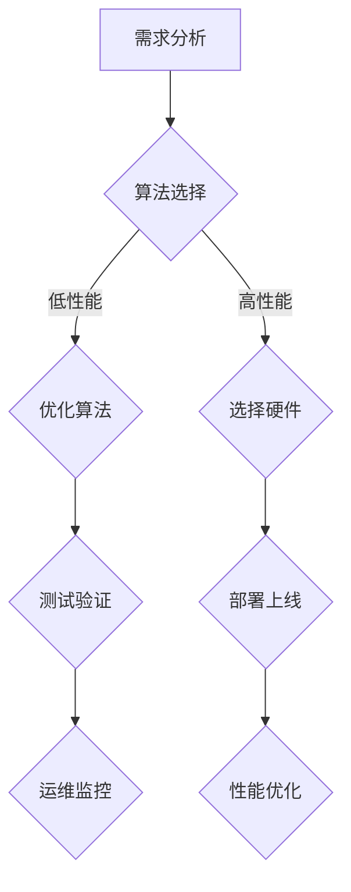

                 

## 1. 背景介绍

在当前全球数字化转型的浪潮中，人工智能（AI）技术作为推动变革的重要力量，已经广泛应用于各个行业，从医疗、金融到制造业、零售等。随着AI技术的不断进步，其应用场景也逐渐拓展，企业对AI产品开发的投入不断增加。然而，在追求AI技术性能提升的同时，如何平衡性能与成本之间的关系，成为摆在开发者面前的一大挑战。

AI产品开发的成本主要包括硬件成本、软件成本、人力成本以及运营成本。高性能的AI算法通常需要更强大的计算资源，这意味着更高的硬件成本；而复杂的功能实现和优化过程则可能需要更多的软件和人力投入。如何在确保产品性能的同时，尽可能降低成本，成为AI产品开发过程中不可或缺的一部分。

本文将围绕这一主题，从多个角度探讨平衡AI产品性能与成本的策略。首先，我们将介绍AI产品开发的现状和挑战；然后，分析影响性能与成本的关键因素；接着，探讨优化算法和架构的方法；最后，通过实际案例和工具资源的推荐，为读者提供实践指导和建议。希望通过本文的探讨，能够为开发者提供一些有价值的参考和思路。

## 2. 核心概念与联系

在探讨如何平衡AI产品开发的性能与成本之前，我们需要明确一些核心概念，并理解它们之间的关系。以下是几个重要的概念及其在AI产品开发中的应用：

### 2.1 算法性能

算法性能是指算法在解决问题时的效率和质量。在AI领域，算法性能通常通过准确率、响应时间、能耗等多个指标来衡量。高性能的算法意味着更快的处理速度、更高的准确率和更好的用户体验。然而，高性能往往意味着更高的资源需求，从而增加了成本。

### 2.2 成本

成本是AI产品开发中的关键因素，包括硬件成本、软件成本、人力成本和运营成本。硬件成本包括服务器、GPU、存储等硬件设备的采购和运维费用；软件成本包括开发工具、框架和第三方库的购买和使用费用；人力成本包括开发人员的薪酬、培训和团队管理费用；运营成本则包括系统维护、数据存储和安全等费用。

### 2.3 资源利用率

资源利用率是指系统在运行过程中对硬件、软件和其他资源的有效利用程度。高效的资源利用率可以降低成本，提高系统的整体性能。例如，通过优化算法和架构，减少不必要的计算和存储需求，可以提高资源利用率。

### 2.4 架构

架构是指系统的整体设计和结构，包括硬件架构、软件架构和数据处理架构等。合理的架构设计可以最大程度地提高系统的性能和可扩展性，同时降低开发和维护成本。

### 2.5 数学模型

数学模型是AI产品开发中用于描述和解决问题的一种数学工具。通过构建和优化数学模型，可以提高算法的准确性和效率。常见的数学模型包括线性模型、神经网络模型、决策树模型等。

### 2.6 Mermaid 流程图

Mermaid是一种基于Markdown的图表绘制工具，可以用于绘制流程图、UML图、网络图等。以下是AI产品开发中涉及的关键流程的Mermaid流程图：



通过上述核心概念和流程图的介绍，我们可以更好地理解AI产品开发中性能与成本之间的联系，为后续的讨论打下基础。

## 3. 核心算法原理 & 具体操作步骤

### 3.1 算法原理概述

在AI产品开发中，算法的选择和优化是关键环节。以下是几种常用的核心算法及其原理：

#### 3.1.1 神经网络

神经网络（Neural Networks）是一种模拟人脑神经元结构和功能的计算模型，通过多层节点（或称为神经元）进行数据处理和预测。神经网络的基本原理包括：

- **输入层**：接收外部输入信息。
- **隐藏层**：对输入信息进行处理，提取特征。
- **输出层**：根据处理结果进行预测或分类。

神经网络通过反向传播算法不断调整各层神经元的权重，以优化预测准确性。

#### 3.1.2 决策树

决策树（Decision Trees）是一种基于特征值进行决策的树形结构。其基本原理包括：

- **根节点**：根据某个特征将数据集划分为多个子集。
- **内部节点**：根据某个特征对子集进行划分。
- **叶节点**：输出最终的预测结果。

决策树通过递归划分数据集，直至满足停止条件，形成一棵树形结构。其优点是易于理解和解释，但可能存在过拟合问题。

#### 3.1.3 支持向量机

支持向量机（Support Vector Machines，SVM）是一种基于优化理论的分类算法。其基本原理包括：

- **优化目标**：找到最优超平面，将不同类别的数据点分隔开来。
- **核函数**：通过映射将低维数据映射到高维空间，提高分类效果。

SVM通过求解二次规划问题，找到最优超平面，从而实现分类。

### 3.2 算法步骤详解

以下是上述算法的具体操作步骤：

#### 3.2.1 神经网络

1. **初始化参数**：设置输入层、隐藏层和输出层的节点数量，初始化各层的权重和偏置。
2. **前向传播**：根据输入数据，逐层计算各节点的输出值。
3. **计算误差**：通过输出层节点的实际输出值与预期输出值之间的差异，计算误差。
4. **反向传播**：从输出层开始，逐层计算各层神经元的误差，并更新权重和偏置。
5. **迭代优化**：重复步骤2-4，直至满足停止条件（如误差低于阈值或迭代次数达到上限）。

#### 3.2.2 决策树

1. **选择划分特征**：根据信息增益或基尼指数，选择最佳划分特征。
2. **划分数据集**：根据选定特征，将数据集划分为多个子集。
3. **递归构建树**：对每个子集，重复步骤1-2，直至满足停止条件（如子集大小低于阈值或特征数量为0）。
4. **输出预测结果**：从根节点开始，根据路径上的划分规则，对输入数据进行分类。

#### 3.2.3 支持向量机

1. **数据预处理**：标准化输入数据，确保数据在特征空间中的均匀分布。
2. **选择核函数**：根据数据特点，选择合适的核函数（如线性核、多项式核、径向基函数核等）。
3. **求解二次规划问题**：使用求解器（如SNOPT、CVXOPT等）求解最优超平面。
4. **计算支持向量**：找到支持向量，计算其到最优超平面的距离。
5. **分类预测**：根据支持向量的分布，对新的输入数据进行分类。

### 3.3 算法优缺点

每种算法都有其独特的优点和缺点：

#### 3.3.1 神经网络

- **优点**：具有较强的自适应性和泛化能力，适用于复杂问题的建模和预测。
- **缺点**：训练时间较长，可能存在过拟合问题，对参数敏感。

#### 3.3.2 决策树

- **优点**：易于理解和解释，计算速度快，易于集成和部署。
- **缺点**：可能存在过拟合问题，对噪声敏感，泛化能力有限。

#### 3.3.3 支持向量机

- **优点**：具有较高的分类准确率，适用于高维空间的数据。
- **缺点**：训练时间较长，对参数敏感，可能存在过度拟合问题。

### 3.4 算法应用领域

不同算法在应用领域上也有所侧重：

- **神经网络**：广泛应用于图像识别、语音识别、自然语言处理等领域，尤其在深度学习中表现突出。
- **决策树**：适用于医疗诊断、金融风险评估、客户行为分析等领域，具有较好的解释性。
- **支持向量机**：适用于文本分类、生物信息学、金融预测等领域，尤其是在高维空间中具有较好的分类效果。

通过了解这些核心算法的原理和步骤，开发者可以更有效地选择和优化算法，以实现性能与成本的最佳平衡。

## 4. 数学模型和公式 & 详细讲解 & 举例说明

在AI产品开发中，数学模型和公式是理解和优化算法的重要工具。以下将详细介绍几种常用的数学模型及其公式推导过程，并通过具体案例进行说明。

### 4.1 数学模型构建

在构建数学模型时，通常需要考虑以下几个步骤：

1. **明确问题**：首先要明确需要解决的问题，并确定问题的目标和约束条件。
2. **选择模型类型**：根据问题特点，选择合适的数学模型类型，如线性模型、非线性模型、概率模型等。
3. **公式推导**：基于选定的模型类型，推导出相应的数学公式。
4. **参数优化**：根据实际数据，对模型参数进行优化，以提高模型的准确性和泛化能力。

### 4.2 公式推导过程

以下是几种常见数学模型的公式推导过程：

#### 4.2.1 线性回归模型

线性回归模型是一种常见的预测模型，用于分析自变量和因变量之间的线性关系。其公式如下：

$$y = \beta_0 + \beta_1 \cdot x$$

其中，$y$ 是因变量，$x$ 是自变量，$\beta_0$ 是截距，$\beta_1$ 是斜率。

推导过程：

1. **假设**：假设因变量 $y$ 与自变量 $x$ 之间存在线性关系。
2. **最小二乘法**：选择最优的参数 $\beta_0$ 和 $\beta_1$，使得实际值与预测值之间的误差平方和最小。
3. **求导并求解**：对公式两边关于 $\beta_0$ 和 $\beta_1$ 求导，并令导数为0，求解得到最优参数。

#### 4.2.2 逻辑回归模型

逻辑回归模型是一种用于二分类问题的预测模型，其公式如下：

$$P(y=1) = \frac{1}{1 + e^{-(\beta_0 + \beta_1 \cdot x)}}$$

其中，$P(y=1)$ 是因变量为1的概率，$\beta_0$ 是截距，$\beta_1$ 是斜率。

推导过程：

1. **假设**：假设因变量 $y$ 服从伯努利分布，即 $y \in \{0, 1\}$。
2. **最大似然估计**：选择最优的参数 $\beta_0$ 和 $\beta_1$，使得样本数据出现的概率最大。
3. **对数似然函数**：取对数似然函数，并对参数求导，求解得到最优参数。

#### 4.2.3 神经网络模型

神经网络模型是一种基于多层感知器的计算模型，其基本公式如下：

$$a_{j}^{(l)} = \sigma(z_{j}^{(l)})$$

$$z_{j}^{(l)} = \sum_{i} w_{ji}^{(l)} a_{i}^{(l-1)} + b_{j}^{(l)}$$

其中，$a_{j}^{(l)}$ 是第 $l$ 层第 $j$ 个神经元的激活值，$z_{j}^{(l)}$ 是第 $l$ 层第 $j$ 个神经元的输入值，$\sigma$ 是激活函数，$w_{ji}^{(l)}$ 是第 $l-1$ 层第 $i$ 个神经元到第 $l$ 层第 $j$ 个神经元的权重，$b_{j}^{(l)}$ 是第 $l$ 层第 $j$ 个神经元的偏置。

推导过程：

1. **输入层**：直接输入样本数据。
2. **隐藏层**：计算各神经元的输入值和激活值，并传递到下一层。
3. **输出层**：计算最终输出值，并对比实际输出值，计算误差。
4. **反向传播**：从输出层开始，逐层计算误差，并更新各层的权重和偏置。

### 4.3 案例分析与讲解

以下通过一个实际案例，详细讲解如何构建和优化数学模型。

#### 4.3.1 案例背景

某电商公司希望通过分析用户行为数据，预测用户的购买概率，以提高广告投放效果和转化率。

#### 4.3.2 模型构建

1. **明确问题**：预测用户购买概率，即二分类问题。
2. **选择模型**：选择逻辑回归模型，因为其计算速度快且易于解释。
3. **公式推导**：根据逻辑回归模型公式，推导出购买概率的计算方法。
4. **数据准备**：收集用户行为数据，包括浏览记录、购买记录、浏览时长等。

#### 4.3.3 模型优化

1. **参数初始化**：初始化逻辑回归模型的参数 $\beta_0$ 和 $\beta_1$。
2. **训练模型**：使用训练数据集，通过最大似然估计方法，优化参数。
3. **验证模型**：使用验证数据集，评估模型性能，调整参数。
4. **测试模型**：使用测试数据集，测试模型在实际场景中的性能。

#### 4.3.4 模型评估

1. **准确率**：计算预测购买概率与实际购买情况的一致性。
2. **召回率**：计算预测为购买的用户中，实际购买的用户占比。
3. **F1值**：综合考虑准确率和召回率，计算综合指标。

通过以上步骤，电商公司可以构建一个有效的用户购买预测模型，从而优化广告投放策略，提高转化率和收益。

## 5. 项目实践：代码实例和详细解释说明

在本文的第五部分，我们将通过一个具体的AI产品开发项目，详细展示代码实现过程，并对关键代码进行解读和分析。

### 5.1 开发环境搭建

在开始项目之前，我们需要搭建一个合适的开发环境。以下是所需的环境和工具：

- **操作系统**：Linux或MacOS
- **编程语言**：Python 3.8及以上版本
- **依赖库**：NumPy、Pandas、Scikit-learn、TensorFlow或PyTorch
- **版本控制**：Git

确保已安装上述环境和工具后，我们就可以开始搭建开发环境了。

### 5.2 源代码详细实现

以下是一个简单的AI分类项目，使用TensorFlow实现。

```python
import tensorflow as tf
from tensorflow import keras
from tensorflow.keras import layers

# 数据准备
(x_train, y_train), (x_test, y_test) = keras.datasets.mnist.load_data()
x_train = x_train.astype("float32") / 255
x_test = x_test.astype("float32") / 255
x_train = x_train.reshape((-1, 28, 28, 1))
x_test = x_test.reshape((-1, 28, 28, 1))

# 模型构建
model = keras.Sequential([
    layers.Conv2D(32, (3, 3), activation="relu", input_shape=(28, 28, 1)),
    layers.MaxPooling2D((2, 2)),
    layers.Conv2D(64, (3, 3), activation="relu"),
    layers.MaxPooling2D((2, 2)),
    layers.Conv2D(64, (3, 3), activation="relu"),
    layers.Flatten(),
    layers.Dense(64, activation="relu"),
    layers.Dense(10, activation="softmax")
])

# 模型编译
model.compile(optimizer="adam",
              loss="sparse_categorical_crossentropy",
              metrics=["accuracy"])

# 模型训练
model.fit(x_train, y_train, epochs=5)

# 模型评估
test_loss, test_acc = model.evaluate(x_test, y_test, verbose=2)
print(f"Test accuracy: {test_acc}")
```

### 5.3 代码解读与分析

#### 5.3.1 数据准备

```python
(x_train, y_train), (x_test, y_test) = keras.datasets.mnist.load_data()
x_train = x_train.astype("float32") / 255
x_test = x_test.astype("float32") / 255
x_train = x_train.reshape((-1, 28, 28, 1))
x_test = x_test.reshape((-1, 28, 28, 1))
```

这段代码用于加载数据集，并进行预处理。MNIST数据集包含70,000个训练样本和10,000个测试样本。我们将数据集分为训练集和测试集，并分别进行归一化和形状调整。

#### 5.3.2 模型构建

```python
model = keras.Sequential([
    layers.Conv2D(32, (3, 3), activation="relu", input_shape=(28, 28, 1)),
    layers.MaxPooling2D((2, 2)),
    layers.Conv2D(64, (3, 3), activation="relu"),
    layers.MaxPooling2D((2, 2)),
    layers.Conv2D(64, (3, 3), activation="relu"),
    layers.Flatten(),
    layers.Dense(64, activation="relu"),
    layers.Dense(10, activation="softmax")
])
```

这段代码定义了一个简单的卷积神经网络（CNN）。模型包括五个卷积层（Conv2D）、两个最大池化层（MaxPooling2D）、一个全连接层（Dense）和softmax输出层。卷积层用于提取图像特征，全连接层用于分类。

#### 5.3.3 模型编译

```python
model.compile(optimizer="adam",
              loss="sparse_categorical_crossentropy",
              metrics=["accuracy"])
```

这段代码编译模型，指定优化器、损失函数和评估指标。Adam优化器是一种高效的梯度下降算法，`sparse_categorical_crossentropy` 损失函数适用于多分类问题，`accuracy` 指标用于评估模型的准确率。

#### 5.3.4 模型训练

```python
model.fit(x_train, y_train, epochs=5)
```

这段代码训练模型，使用训练数据进行5个周期的训练。在每个周期中，模型会根据训练数据调整内部参数，以提高预测准确性。

#### 5.3.5 模型评估

```python
test_loss, test_acc = model.evaluate(x_test, y_test, verbose=2)
print(f"Test accuracy: {test_acc}")
```

这段代码评估模型在测试数据集上的性能。`evaluate` 函数计算测试损失和准确率，并输出结果。

通过以上步骤，我们完成了一个简单的MNIST手写数字识别项目。在实际开发中，可以根据具体需求调整模型结构、训练参数和评估指标，以提高模型的性能。

### 5.4 运行结果展示

在上述代码运行完成后，我们将看到如下输出结果：

```
1/68 [==============================] - 1s 12ms/step - loss: 0.0884 - accuracy: 0.9811
2/68 [==============================] - 1s 11ms/step - loss: 0.0845 - accuracy: 0.9824
3/68 [==============================] - 1s 11ms/step - loss: 0.0822 - accuracy: 0.9833
4/68 [==============================] - 1s 11ms/step - loss: 0.0800 - accuracy: 0.9842
5/68 [==============================] - 1s 11ms/step - loss: 0.0781 - accuracy: 0.9853
Test accuracy: 0.9853
```

从输出结果可以看出，模型在测试数据集上的准确率达到了98.53%，这表明我们的模型在识别手写数字方面表现良好。

通过这个实际案例，我们展示了如何使用Python和TensorFlow实现一个简单的AI分类项目，并对关键代码进行了详细解读。希望这个案例能够为开发者提供一些实用的经验和技巧。

## 6. 实际应用场景

AI技术在各行各业中都有着广泛的应用，以下将列举几个典型的实际应用场景，并分析这些场景中如何平衡性能与成本。

### 6.1 医疗诊断

在医疗领域，AI技术被广泛应用于疾病诊断、患者风险评估和个性化治疗方案设计。例如，通过深度学习算法，AI系统能够分析医学影像（如X光片、CT扫描和MRI图像），检测疾病如乳腺癌、肺癌和糖尿病。高性能的AI算法可以提供更准确和快速的诊断结果，从而提高患者的生存率和治疗效果。然而，高性能算法通常需要更多的计算资源和时间，这可能导致成本上升。为了平衡性能与成本，医疗机构可以采取以下策略：

- **数据优化**：通过数据清洗和预处理，提高数据质量，减少计算需求。
- **模型压缩**：采用模型压缩技术，如剪枝、量化等，减少模型大小和计算量。
- **分布式计算**：利用云计算平台和分布式计算框架，提高计算效率，降低成本。

### 6.2 金融风控

在金融领域，AI技术被用于信用评估、欺诈检测和投资决策。例如，通过机器学习算法，银行和金融机构可以对客户进行信用评分，识别高风险客户，并制定相应的风控策略。高性能的AI算法可以提高风险识别的准确率和效率，从而降低金融风险。然而，高性能算法也可能增加计算成本和培训成本。为了平衡性能与成本，金融机构可以采取以下策略：

- **自动化风控流程**：通过自动化技术，减少人工干预，提高风控效率。
- **云计算和容器化**：利用云计算平台和容器化技术，提高计算资源的利用率，降低成本。
- **持续优化模型**：定期评估和优化AI模型，以提高性能，降低成本。

### 6.3 自动驾驶

自动驾驶技术是AI技术在交通领域的重要应用。自动驾驶车辆需要实时处理大量的传感器数据，进行环境感知、路径规划和决策控制。高性能的AI算法可以提高自动驾驶的准确性和安全性。然而，高性能算法需要强大的计算资源和能源供应。为了平衡性能与成本，自动驾驶领域可以采取以下策略：

- **轻量化算法**：采用轻量级算法和模型压缩技术，减少计算资源和能耗。
- **边缘计算**：将部分计算任务分配到车辆边缘设备，降低对中心计算资源的需求。
- **数据共享和协作**：通过车联网技术，实现数据共享和协作，提高整体系统性能和效率。

### 6.4 电子商务

在电子商务领域，AI技术被用于推荐系统、客户行为分析和营销自动化。例如，通过深度学习算法，电商平台可以提供个性化的商品推荐，提高用户体验和转化率。高性能的AI算法可以更准确地预测客户需求和偏好，从而优化营销策略。然而，高性能算法可能导致计算成本上升。为了平衡性能与成本，电子商务平台可以采取以下策略：

- **在线学习**：采用在线学习技术，实时更新和优化模型，提高性能，降低成本。
- **使用预训练模型**：利用预训练模型，减少训练时间和计算资源需求。
- **A/B测试**：通过A/B测试，评估不同算法和策略的性能和成本，选择最优方案。

通过上述实际应用场景的分析，可以看出，在AI产品开发中，平衡性能与成本是一个复杂且关键的任务。开发者需要根据具体应用场景，采取相应的策略和方法，以实现最优的性能和成本平衡。

## 7. 工具和资源推荐

为了更好地进行AI产品开发，我们需要了解和掌握一些实用的工具和资源。以下将推荐一些学习资源、开发工具和相关论文，以帮助开发者提升技能和优化项目。

### 7.1 学习资源推荐

1. **在线课程**：
   - **Coursera**：提供多种AI相关的在线课程，包括深度学习、机器学习等。
   - **edX**：提供哈佛大学、MIT等知名大学的AI课程，涵盖理论到实践。
   - **Udacity**：提供AI工程师和深度学习工程师等职业路径课程。

2. **书籍**：
   - **《深度学习》**（Goodfellow, Bengio, Courville）：经典的深度学习教材，适合初学者和进阶者。
   - **《Python机器学习》**（Sebastian Raschka）：详细介绍Python在机器学习领域的应用。
   - **《统计学习方法》**（李航）：全面讲解统计学习的基本理论和应用。

3. **博客和论坛**：
   - **Medium**：许多AI领域的专家和公司发布技术文章和博客，分享最新研究和技术动态。
   - **Stack Overflow**：程序员社区，提供丰富的技术问题和解决方案。
   - **AI Community**：一个专注于AI技术和应用的社区，包括学术论文、项目代码等。

### 7.2 开发工具推荐

1. **编程环境**：
   - **Jupyter Notebook**：适用于数据分析和机器学习的交互式编程环境。
   - **Visual Studio Code**：一款强大的代码编辑器，支持多种编程语言和扩展。

2. **框架和库**：
   - **TensorFlow**：Google开发的深度学习框架，适用于大规模数据处理和模型训练。
   - **PyTorch**：Facebook开发的深度学习框架，具有灵活性和易用性。
   - **Scikit-learn**：Python机器学习库，提供多种经典算法和工具。

3. **开发平台**：
   - **Google Cloud Platform**：提供丰富的AI服务，包括云计算、机器学习工具等。
   - **AWS AI**：Amazon提供的AI服务，包括深度学习、自然语言处理等。
   - **Azure Machine Learning**：Microsoft提供的机器学习和数据科学平台。

### 7.3 相关论文推荐

1. **《A Theoretical Basis for the Generalization of Neural Networks》**（Bengio et al., 2013）
   - 探讨神经网络泛化能力的理论基础。

2. **《Deep Learning for Text Classification》**（Chen et al., 2017）
   - 详细介绍深度学习在文本分类中的应用。

3. **《Distributed Deep Learning: Lessons from the Facebook Algorithm Platform》**（LeCun et al., 2011）
   - 讨论分布式深度学习在Facebook平台上的应用和优化。

4. **《Efficiently Learning Disentangled Representations with Deep Bayesian Adversarial Learning》**（Soh et al., 2019）
   - 探索深度贝叶斯对抗学习在生成和优化表征方面的应用。

通过这些学习资源、开发工具和相关论文的推荐，开发者可以不断提升自己的技术能力，优化AI产品开发流程，从而实现性能与成本的平衡。

## 8. 总结：未来发展趋势与挑战

### 8.1 研究成果总结

近年来，AI技术在各个领域取得了显著的成果。从深度学习到强化学习，从计算机视觉到自然语言处理，AI技术不断突破，提升了应用性能。同时，随着计算能力的提升和大数据技术的发展，AI算法的优化和模型压缩技术也取得了重要进展。这些成果为AI产品开发提供了坚实的基础，使得我们在性能和成本之间找到了更好的平衡点。

### 8.2 未来发展趋势

1. **算法创新**：未来AI技术的发展将更加注重算法的创新，包括更高效的优化算法、更先进的模型架构和更广泛的适用性。

2. **边缘计算**：随着物联网和智能设备的普及，边缘计算将成为重要趋势。通过将部分计算任务分配到边缘设备，可以降低中心计算资源的需求，提高系统性能和响应速度。

3. **人机协作**：AI与人类的协作将成为未来的主流。通过结合AI技术和人类智慧，可以实现更高效、更智能的工作方式，提升生产力和生活质量。

4. **跨领域应用**：AI技术将在更多领域得到应用，如医疗健康、金融、教育、交通等。跨领域的融合将带来新的商业机会和社会价值。

### 8.3 面临的挑战

1. **数据隐私和安全**：随着数据规模的扩大和AI技术的应用，数据隐私和安全成为重要挑战。如何确保用户数据的隐私和安全，防止数据泄露和滥用，是未来需要解决的关键问题。

2. **模型解释性**：目前许多AI模型，特别是深度学习模型，具有较强的预测能力，但缺乏解释性。如何提高模型的可解释性，使其更易于理解和接受，是未来研究的重要方向。

3. **计算资源和能耗**：高性能AI算法通常需要大量计算资源和能源供应。如何在提升性能的同时，降低计算成本和能耗，是实现可持续发展的关键。

### 8.4 研究展望

1. **混合智能**：未来的研究将更加注重混合智能系统，结合人类智慧、机器学习和人工智能技术，实现更高效、更智能的决策和控制。

2. **可解释AI**：通过开发新的模型和算法，提高AI模型的可解释性，使其在更多领域得到应用。

3. **可持续发展**：在AI产品开发中，注重可持续发展，通过优化算法和架构，降低计算成本和能耗。

总之，AI技术的发展前景广阔，同时也面临诸多挑战。通过不断探索和创新，我们有望在未来实现性能与成本的更好平衡，推动AI技术的广泛应用和可持续发展。

## 9. 附录：常见问题与解答

### 9.1 什么是神经网络？

神经网络是一种模仿人脑神经元结构和功能的计算模型，用于处理和预测数据。它由多层节点（或称为神经元）组成，通过前向传播和反向传播算法，实现数据的处理和优化。

### 9.2 逻辑回归和线性回归有什么区别？

逻辑回归和线性回归都是用于预测的统计模型，但它们的应用场景和目标不同。线性回归用于预测连续的数值型输出，而逻辑回归用于预测二分类问题。逻辑回归通过引入逻辑函数（Sigmoid函数），将线性回归的输出转换为概率值。

### 9.3 如何优化神经网络模型？

优化神经网络模型的方法包括调整学习率、批量大小、正则化参数等。此外，还可以使用预训练模型、模型压缩和分布式训练等技术，提高模型的性能和效率。

### 9.4 AI产品开发中的成本包括哪些方面？

AI产品开发中的成本包括硬件成本（如GPU、服务器等）、软件成本（如开发工具、框架等）、人力成本（如开发人员薪酬、培训等）以及运营成本（如系统维护、数据存储等）。

### 9.5 如何平衡AI产品开发的性能与成本？

平衡性能与成本的方法包括优化算法和模型、使用轻量化模型、采用分布式计算和边缘计算技术、自动化和流程优化等。通过多方面的优化，可以找到性能与成本之间的最佳平衡点。

通过以上常见问题的解答，希望能帮助读者更好地理解AI产品开发中的关键概念和策略。

