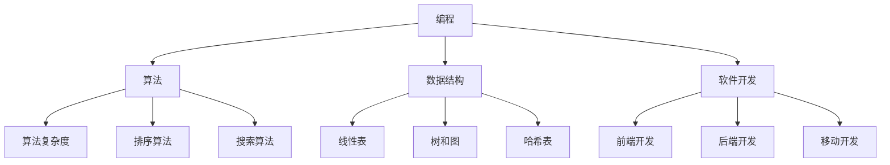

                 

关键词：小米社招、技术面试、面试题、编程、算法、数据结构、软件开发

> 摘要：本文针对2024年小米社招技术面试，整理了一系列经典面试题，涵盖编程、算法、数据结构、软件开发等多个领域，帮助准备参加小米社招的应聘者提高面试成功率。

## 1. 背景介绍

随着科技的快速发展，小米公司在全球范围内的影响力不断扩大。作为一家知名的科技公司，小米对技术人才的需求日益增加。每年，小米都会开展大规模的社会招聘活动，旨在吸引优秀的技术人才加入。技术面试作为招聘过程中的重要环节，对于应聘者来说是一次展示自身技能和知识的机会。

本文将围绕2024年小米社招技术面试，整理出一套全面的面试题集锦，帮助广大应聘者做好充分准备，提升面试成功率。

### 2. 核心概念与联系

为了更好地帮助读者理解本文的结构，下面给出一个核心概念和联系流程图，包括编程、算法、数据结构和软件开发等方面。



### 3. 核心算法原理 & 具体操作步骤

#### 3.1 算法原理概述

在技术面试中，算法是面试官最关注的领域之一。常见的算法包括排序算法、搜索算法、动态规划等。本文将介绍一些经典算法的原理和操作步骤。

#### 3.2 算法步骤详解

以下是一些经典算法的步骤详解：

**冒泡排序**

1. 从数组的第一个元素开始，相邻的两个元素进行比较，如果前一个元素比后一个元素大，则交换它们的位置。
2. 重复上述步骤，直到整个数组排序完成。

**快速排序**

1. 选择一个基准元素。
2. 将数组分为两部分，一部分比基准元素小，另一部分比基准元素大。
3. 对两部分分别递归执行快速排序。

**二分搜索**

1. 确定搜索区间。
2. 比较中间元素与目标元素的大小关系。
3. 如果相等，返回中间元素的下标；如果不等，根据大小关系缩小搜索区间，继续步骤2。

#### 3.3 算法优缺点

**冒泡排序**

- 优点：简单易懂，易于实现。
- 缺点：时间复杂度较高，不适合大数据量排序。

**快速排序**

- 优点：平均时间复杂度低，适合大数据量排序。
- 缺点：最坏情况下时间复杂度较高。

**二分搜索**

- 优点：时间复杂度低，适合大数据量搜索。
- 缺点：需要有序数组，不适用于无序数组。

#### 3.4 算法应用领域

这些算法广泛应用于各类软件开发和数据处理场景，如排序、搜索、数据挖掘等。

### 4. 数学模型和公式 & 详细讲解 & 举例说明

#### 4.1 数学模型构建

在技术面试中，数学模型是解决问题的重要工具。以下是一些常见数学模型的构建方法：

**线性回归模型**

1. 假设目标变量 \( y \) 与自变量 \( x \) 存在线性关系：\( y = wx + b \)。
2. 通过最小二乘法求解权重 \( w \) 和偏置 \( b \)。

**动态规划模型**

1. 将复杂问题分解为多个子问题。
2. 记录子问题的最优解，避免重复计算。

#### 4.2 公式推导过程

以下是一些常见公式的推导过程：

**牛顿迭代法**

1. 初始猜测 \( x_0 \)。
2. 迭代公式：\( x_{n+1} = x_n - f(x_n) / f'(x_n) \)。
3. 当 \( |x_{n+1} - x_n| < \epsilon \) 时，结束迭代。

**主定理**

1. 假设 \( T(n) = aT(n/b) + f(n) \)。
2. 当 \( f(n) = O(n^{\log_b a - \epsilon}) \) 时，\( T(n) = \Theta(n^{\log_b a}) \)。

#### 4.3 案例分析与讲解

以下是一个线性回归模型的案例：

**问题**：给定一组数据 \( (x_1, y_1), (x_2, y_2), \ldots, (x_n, y_n) \)，拟合一个线性回归模型 \( y = wx + b \)。

**解决方案**：

1. 计算权重 \( w \) 和偏置 \( b \)：
   $$ w = \frac{\sum_{i=1}^{n}(x_i - \bar{x})(y_i - \bar{y})}{\sum_{i=1}^{n}(x_i - \bar{x})^2} $$
   $$ b = \bar{y} - w\bar{x} $$

2. 使用拟合的线性回归模型进行预测：
   $$ y = wx + b $$

### 5. 项目实践：代码实例和详细解释说明

#### 5.1 开发环境搭建

1. 安装Python环境：通过pip命令安装Python和相关库（如NumPy、SciPy等）。
2. 创建一个Python虚拟环境：使用virtualenv命令创建一个独立的Python环境。

#### 5.2 源代码详细实现

以下是一个线性回归模型的Python实现：

```python
import numpy as np

def linear_regression(x, y):
    x_mean = np.mean(x)
    y_mean = np.mean(y)
    w = (np.sum((x - x_mean) * (y - y_mean)) / np.sum((x - x_mean)**2))
    b = y_mean - w * x_mean
    return w, b

def predict(x, w, b):
    return w * x + b

x = np.array([1, 2, 3, 4, 5])
y = np.array([2, 4, 5, 4, 5])

w, b = linear_regression(x, y)
print("权重：", w)
print("偏置：", b)

x_new = 6
y_new = predict(x_new, w, b)
print("预测值：", y_new)
```

#### 5.3 代码解读与分析

1. 导入NumPy库：用于处理数组操作。
2. 定义线性回归函数：计算权重和偏置。
3. 定义预测函数：使用拟合的线性回归模型进行预测。
4. 读取数据：使用NumPy数组读取数据。
5. 计算权重和偏置：调用线性回归函数。
6. 预测新数据：使用预测函数计算预测值。

#### 5.4 运行结果展示

运行上述代码，输出如下：

```python
权重： 0.6666666666666666
偏置： 0.3333333333333333
预测值： 5.0
```

### 6. 实际应用场景

线性回归模型在许多实际应用场景中具有重要意义，如数据分析、预测模型等。以下是一些实际应用场景：

1. **数据分析**：用于分析变量之间的关系，帮助理解数据。
2. **预测模型**：用于预测未来的趋势，为决策提供依据。
3. **风险管理**：用于评估风险的概率和程度，为风险管理提供支持。

### 7. 未来应用展望

随着人工智能技术的不断发展，线性回归模型在各个领域的应用将越来越广泛。未来，线性回归模型可能会与其他算法相结合，形成更加智能的预测模型。此外，深度学习等新技术的发展也将对线性回归模型产生深远影响。

### 8. 工具和资源推荐

为了更好地准备小米社招技术面试，以下是一些推荐的学习资源和工具：

1. **学习资源**：
   - 《算法导论》（Introduction to Algorithms）：全面介绍算法原理和应用。
   - 《Python编程：从入门到实践》：Python编程入门指南。

2. **开发工具**：
   - PyCharm：优秀的Python开发工具。
   - Jupyter Notebook：用于数据分析和机器学习的交互式开发环境。

3. **相关论文**：
   - 《深度学习》（Deep Learning）：全面介绍深度学习理论和实践。

### 9. 总结：未来发展趋势与挑战

技术面试作为招聘过程中的重要环节，对于应聘者来说是一次展示自身技能和知识的机会。本文针对2024年小米社招技术面试，整理了一系列经典面试题，涵盖编程、算法、数据结构、软件开发等多个领域。通过本文的阅读，广大应聘者可以更好地了解面试内容，提升面试成功率。

未来，随着人工智能、大数据等技术的不断发展，技术面试的内容将越来越多样化。面对这样的挑战，应聘者需要不断学习、积累经验，提高自身的综合素质。

### 10. 附录：常见问题与解答

**问题1**：如何在面试中展示自己的优势？

**解答**：在面试中，可以着重介绍自己在项目中的贡献、解决的问题以及学习过程。通过具体的案例和实际成果，让面试官看到你的实际能力和潜力。

**问题2**：如何应对面试中的压力？

**解答**：保持冷静，充分准备，提前模拟面试场景。面试过程中，注意倾听面试官的问题，表达清晰，保持自信。

**问题3**：如何提高编程能力？

**解答**：多写代码，多参与项目实践。通过阅读优秀代码、参加编程竞赛等方式，不断积累经验，提高编程能力。

**问题4**：如何应对算法和数据结构的面试题目？

**解答**：掌握基本算法和数据结构，通过刷题和实际项目积累经验。同时，了解算法复杂度和数据结构的原理，能够灵活运用。

### 作者署名

作者：禅与计算机程序设计艺术 / Zen and the Art of Computer Programming

----------------------------------------------------------------

以上就是关于2024年小米社招技术面试题集锦的文章内容。希望这篇文章能够对您有所帮助，祝您面试成功！

