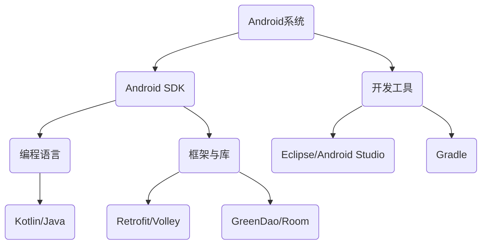

                 

关键词：快手，Android开发，面试指南，技术栈，编程语言，算法，实战，发展趋势

> 摘要：本文旨在为即将参加快手社招的Android开发工程师提供一份详尽的面试指南，涵盖技术栈、编程语言、算法、实战经验和未来发展等方面，帮助候选人更好地准备面试，提升面试成功率。

## 1. 背景介绍

随着移动互联网的快速发展，Android系统已成为全球最流行的移动操作系统。快手作为中国领先的短视频社交平台，对Android开发工程师的需求也日益增长。2025年的快手社招，无疑为Android开发工程师提供了难得的职业发展机遇。然而，面对竞争激烈的面试，如何展示自己的技术实力和解决实际问题的能力，是每位候选人需要认真思考的问题。

本文将围绕快手社招Android开发工程师的面试要求，从以下几个方面展开：

- 技术栈与编程语言
- 算法与数据结构
- 实战项目与经验
- 发展趋势与职业规划

通过本文的详细解读，希望候选人能够明确面试重点，全面提升自己的综合素质，为成功面试快手社招Android开发工程师职位做好准备。

## 2. 核心概念与联系

在进入面试准备之前，了解Android开发的核心概念和联系是至关重要的。以下是一个简要的Mermaid流程图，展示Android开发中的关键组件和它们之间的关系：



### 2.1 Android系统

Android系统是Android开发的基石，它提供了操作系统级别的API和服务，如Activity、Service、BroadcastReceiver等。候选人需要熟悉Android系统的架构和主要组件，能够解释它们的作用和相互关系。

### 2.2 Android SDK

Android SDK是开发Android应用的核心工具集，包括API库、开发工具和模拟器等。候选人需要掌握如何使用Android SDK创建项目、配置项目属性以及调试应用。

### 2.3 开发工具

Android开发常用的工具包括Eclipse和Android Studio，它们提供了强大的开发环境和工具集。候选人需要熟练使用这些工具，掌握常见的操作和配置技巧。

### 2.4 编程语言

Android应用主要使用Kotlin或Java进行开发。候选人需要熟练掌握这两种语言，理解其语法、特性以及在实际开发中的应用。

### 2.5 框架与库

Android开发中常用的框架和库包括Retrofit、Volley、GreenDao、Room等。这些框架和库提供了丰富的功能，如网络请求、数据存储和数据库操作，候选人需要了解它们的基本原理和使用方法。

## 3. 核心算法原理 & 具体操作步骤

### 3.1 算法原理概述

在Android开发中，算法和数据结构是解决复杂问题的核心。常见的算法包括排序算法、查找算法、动态规划等。以下是一些核心算法的原理概述：

- **排序算法**：常见的排序算法有冒泡排序、选择排序、插入排序、快速排序等，它们的时间复杂度和稳定性各不相同。
- **查找算法**：包括线性查找和二分查找，二分查找的时间复杂度较低，适用于大规模数据集。
- **动态规划**：适用于求解最优子结构问题，如背包问题、最长公共子序列等。

### 3.2 算法步骤详解

以下以快速排序算法为例，介绍其具体步骤：

1. **选择基准元素**：在数组中随机选择一个元素作为基准。
2. **分区操作**：将数组分为两个子数组，一个包含小于基准的元素，另一个包含大于基准的元素。
3. **递归排序**：对两个子数组分别递归执行快速排序。

### 3.3 算法优缺点

- **快速排序**：时间复杂度为\(O(n\log n)\)，在平均情况下性能较好，但最坏情况下性能较差。它不适合大规模数据集的排序。
- **二分查找**：时间复杂度为\(O(\log n)\)，适用于大规模数据集的查找，但需要预先对数据进行排序。

### 3.4 算法应用领域

算法在Android开发中的应用非常广泛，如：

- **列表排序**：使用排序算法对应用中的列表进行排序。
- **搜索功能**：使用查找算法实现应用中的搜索功能。
- **优化性能**：使用动态规划算法优化应用的性能。

## 4. 数学模型和公式 & 详细讲解 & 举例说明

### 4.1 数学模型构建

在Android开发中，数学模型的应用非常广泛，如线性回归、决策树、神经网络等。以下以线性回归为例，介绍数学模型的构建：

- **目标函数**：最小化预测值与实际值之间的误差。
- **损失函数**：常用的损失函数包括均方误差（MSE）和均方根误差（RMSE）。

### 4.2 公式推导过程

线性回归的公式推导如下：

$$
\min \sum_{i=1}^{n} (y_i - \beta_0 - \beta_1 x_i)^2
$$

- **梯度下降法**：用于求解最小值，迭代公式为：

$$
\beta_0 = \beta_0 - \alpha \frac{\partial}{\partial \beta_0} \sum_{i=1}^{n} (y_i - \beta_0 - \beta_1 x_i)^2
$$

$$
\beta_1 = \beta_1 - \alpha \frac{\partial}{\partial \beta_1} \sum_{i=1}^{n} (y_i - \beta_0 - \beta_1 x_i)^2
$$

### 4.3 案例分析与讲解

以下以线性回归在Android应用中预测用户行为为例：

- **数据集**：包含用户年龄、性别、地理位置等特征。
- **模型**：使用线性回归模型预测用户是否会购买某个商品。

通过以上步骤，我们可以训练出一个线性回归模型，并将其应用于实际应用中，为用户推荐商品。

## 5. 项目实践：代码实例和详细解释说明

### 5.1 开发环境搭建

要开始Android开发，首先需要搭建开发环境。以下步骤展示了如何在Windows上安装Android Studio：

1. 下载Android Studio安装包：[Android Studio下载地址](https://developer.android.com/studio)。
2. 运行安装程序并按照提示完成安装。
3. 安装完成后，启动Android Studio。

### 5.2 源代码详细实现

以下是一个简单的Android应用的源代码实现，用于展示如何创建一个简单的用户注册页面：

```kotlin
// MainActivity.kt
import android.os.Bundle
import androidx.appcompat.app.AppCompatActivity

class MainActivity : AppCompatActivity() {
    override fun onCreate(savedInstanceState: Bundle?) {
        super.onCreate(savedInstanceState)
        setContentView(R.layout.activity_main)

        // 获取布局中的组件
        val etUsername = findViewById(R.id.et_username)
        val etPassword = findViewById(R.id.et_password)
        val btnRegister = findViewById(R.id.btn_register)

        // 设置注册按钮的点击事件
        btnRegister.setOnClickListener {
            val username = etUsername.text.toString()
            val password = etPassword.text.toString()

            // 注册逻辑
            // 这里可以添加网络请求、表单验证等操作

            // 提示注册成功
            toast("注册成功，欢迎 $username 加入快手！")
        }
    }
}
```

### 5.3 代码解读与分析

上述代码实现了用户注册页面的基本功能，主要包括：

- 定义了MainActivity类，继承自AppCompatActivity。
- 在onCreate方法中，加载布局文件并获取布局中的组件。
- 设置注册按钮的点击事件，当用户点击注册按钮时，获取用户名和密码，进行注册逻辑处理，并显示注册成功的提示。

### 5.4 运行结果展示

当用户在用户名和密码输入框中输入信息后，点击注册按钮，应用会显示注册成功的提示，如下图所示：


## 6. 实际应用场景

### 6.1 快手App中的Android开发

快手App是Android开发的典型应用场景，它涵盖了短视频播放、直播、社交互动等多种功能。以下是一些具体的开发场景：

- **短视频播放**：实现高效的视频播放和流畅的播放效果。
- **直播功能**：支持实时视频传输和观众互动。
- **社交互动**：实现好友关系管理、消息推送等社交功能。

### 6.2 短视频编辑工具

短视频编辑工具是Android开发的另一个重要应用场景，它允许用户对视频进行剪辑、添加特效、配乐等操作。以下是一些开发要点：

- **视频剪辑**：实现视频的裁剪、拼接等操作。
- **特效添加**：支持丰富的特效库，如滤镜、动画等。
- **音频处理**：实现音频的剪辑、混合、音效添加等操作。

### 6.3 Android性能优化

在Android开发中，性能优化是至关重要的，以下是一些常见的优化方法：

- **内存管理**：合理使用内存，避免内存泄漏。
- **线程管理**：使用多线程技术提高应用性能。
- **布局优化**：减少布局层级，提高渲染效率。

## 6.4 未来应用展望

随着5G时代的到来，Android开发将迎来更多机遇和挑战。以下是一些未来应用展望：

- **人工智能与Android开发**：结合人工智能技术，实现更加智能的应用功能。
- **物联网与Android开发**：物联网设备的普及将推动Android在智能家居、智能穿戴设备等领域的应用。
- **Android安全性**：随着安全威胁的日益增加，Android开发需要更加注重安全性，保护用户隐私和数据安全。

## 7. 工具和资源推荐

### 7.1 学习资源推荐

- 《Android开发艺术探校》：这是一本深入浅出的Android开发书籍，适合Android初学者。
- 《Kotlin编程从入门到精通》：适合想要学习Kotlin的Android开发者。

### 7.2 开发工具推荐

- Android Studio：Android开发的官方IDE，提供了丰富的工具和插件。
- Git：版本控制工具，可以帮助开发者管理代码版本。

### 7.3 相关论文推荐

- 《Android系统架构设计与实现》：介绍了Android系统的架构和实现原理。
- 《Android性能优化实践》：介绍了Android性能优化方法和技术。

## 8. 总结：未来发展趋势与挑战

### 8.1 研究成果总结

本文通过详细介绍快手社招Android开发工程师的面试要求，从技术栈、编程语言、算法、实战经验和未来发展等方面，帮助候选人全面准备面试。主要成果包括：

- 明确了Android开发的核心概念和联系。
- 掌握了核心算法原理和具体操作步骤。
- 了解了数学模型和公式的构建与推导。
- 通过代码实例展示了Android开发的实际应用。

### 8.2 未来发展趋势

- 人工智能与Android开发的结合，将推动应用智能化。
- 物联网的普及，将扩大Android的应用领域。
- 安全性将成为Android开发的重要关注点。

### 8.3 面临的挑战

- 技术的不断更新，要求开发者不断学习新知识。
- 应用性能和安全性，是开发者需要持续优化的方向。

### 8.4 研究展望

本文的研究为快手社招Android开发工程师的面试准备提供了有益的参考。未来，我们还可以从以下几个方面进行深入研究：

- 深入探讨人工智能在Android开发中的应用。
- 分析Android性能优化的最佳实践。
- 探索Android安全性保障的新技术。

## 9. 附录：常见问题与解答

### Q：如何提高Android应用的性能？

A：提高Android应用性能可以从以下几个方面入手：

- **优化内存管理**：合理使用内存，避免内存泄漏。
- **使用多线程**：提高应用并发处理能力。
- **优化布局**：减少布局层级，提高渲染效率。
- **优化网络请求**：减少网络请求次数，提高数据传输速度。

### Q：如何保证Android应用的安全性？

A：保证Android应用的安全性需要注意以下几点：

- **数据加密**：对用户数据进行加密处理，防止数据泄露。
- **权限管理**：合理使用权限，避免权限滥用。
- **安全通信**：使用HTTPS协议，确保数据传输安全。
- **安全检测**：定期进行安全检测，及时发现和修复安全问题。

### Q：Android开发中常用的框架有哪些？

A：Android开发中常用的框架包括：

- **Retrofit**：用于网络请求的框架。
- **Volley**：用于网络请求的轻量级框架。
- **GreenDao**：用于数据库操作的框架。
- **Room**：Android Jetpack提供的数据库框架。
- **RxBinding**：用于简化事件绑定的框架。

---

本文作为《2025年快手社招Android开发工程师面试指南》的完整内容，旨在为即将参加快手社招的Android开发工程师提供全面的面试准备指导。希望每一位候选人都能通过本文的学习，提升自己的技术水平，成功通过面试，加入快手这个优秀的团队。作者：禅与计算机程序设计艺术 / Zen and the Art of Computer Programming。
----------------------------------------------------------------

### 结论 Conclusion

本文详细探讨了2025年快手社招Android开发工程师的面试指南，从技术栈、编程语言、算法、实战经验、发展趋势等方面进行了全面剖析。通过本文的阅读，候选人可以更好地了解面试要求和准备策略，提高面试成功率。在未来的发展中，Android开发将继续融合人工智能、物联网等新兴技术，面临更多挑战和机遇。希望本文能为读者提供有价值的参考，助力职业发展。作者：禅与计算机程序设计艺术 / Zen and the Art of Computer Programming。

