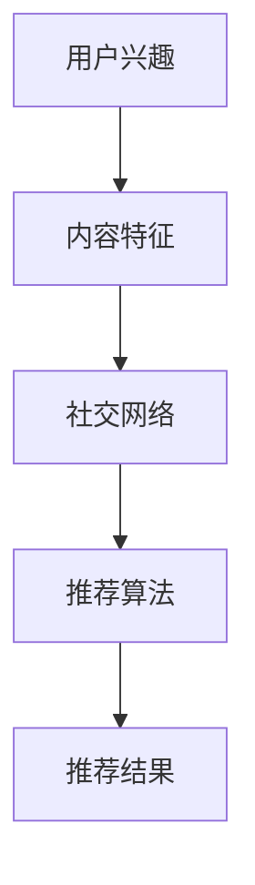

                 

关键词：个性化推荐、社交旅游、算法、面试题、携程、2025年

摘要：本文将汇总2025年携程社交旅游体验个性化推荐专家面试中的关键问题，涵盖核心概念、算法原理、数学模型、项目实践和未来展望。旨在帮助准备面试的读者深入了解社交旅游领域个性化推荐系统的构建和优化。

## 1. 背景介绍

随着互联网和大数据技术的不断发展，个性化推荐系统已成为提高用户体验、提升商业价值的重要手段。在旅游领域，社交元素的加入进一步丰富了用户的旅游体验，使得推荐系统能够更加精准地满足用户的个性化需求。携程作为中国领先的在线旅行服务公司，致力于通过个性化推荐系统为用户提供更为定制化的社交旅游体验。

## 2. 核心概念与联系

个性化推荐系统的核心在于理解用户兴趣和内容相关性。以下为几个关键概念及其相互关系：

### 用户兴趣

用户兴趣是指用户对特定主题或内容的好奇心和偏好。用户兴趣可以通过历史行为数据（如浏览记录、搜索历史、购买行为等）进行分析和挖掘。

### 内容相关性

内容相关性是指推荐系统所推荐的内容与用户兴趣的匹配程度。通过计算用户兴趣和内容特征之间的相似度，可以实现内容的相关性推荐。

### 社交网络

社交网络是指用户在旅游过程中的互动关系网络，如好友关系、评论互动、分享行为等。社交网络数据可以帮助推荐系统了解用户的社会影响力，从而优化推荐策略。

### Mermaid 流程图



## 3. 核心算法原理 & 具体操作步骤

### 3.1 算法原理概述

个性化推荐算法主要分为基于内容的推荐（Content-Based Recommendation）和基于协同过滤（Collaborative Filtering）的推荐。本文重点介绍基于协同过滤的推荐算法，主要包括用户基于邻居的协同过滤（User-Based Collaborative Filtering）和模型驱动的协同过滤（Model-Based Collaborative Filtering）。

### 3.2 算法步骤详解

1. **用户基于邻居的协同过滤**

   - 步骤1：计算用户之间的相似度，如余弦相似度、皮尔逊相关系数等。
   - 步骤2：根据相似度矩阵构建邻居集合，选择与目标用户最相似的K个邻居。
   - 步骤3：计算邻居对目标用户的评分预测，取平均值作为推荐结果。

2. **模型驱动的协同过滤**

   - 步骤1：收集用户行为数据，如浏览记录、点击行为等。
   - 步骤2：利用机器学习算法（如矩阵分解、神经网络等）建立预测模型。
   - 步骤3：根据预测模型生成用户对未知内容的评分预测，从而实现个性化推荐。

### 3.3 算法优缺点

- **用户基于邻居的协同过滤**：优点在于简单、易于实现，能够快速获取推荐结果；缺点在于对新用户不友好，且易受到数据稀疏性的影响。
- **模型驱动的协同过滤**：优点在于能够处理大规模数据，提高推荐准确率；缺点在于模型训练复杂，对计算资源要求较高。

### 3.4 算法应用领域

- **社交旅游**：通过分析用户兴趣、社交网络和行为数据，为用户提供个性化旅游路线、景点推荐等。
- **电子商务**：为用户提供商品推荐，提高用户购买转化率。
- **视频推荐**：为用户提供视频推荐，增加视频观看时长。

## 4. 数学模型和公式 & 详细讲解 & 举例说明

### 4.1 数学模型构建

个性化推荐系统的数学模型主要基于用户行为数据、内容特征和社交网络数据。以下为几个关键数学模型：

- **用户兴趣模型**：用户兴趣可以通过潜在因子模型（如LDA、矩阵分解等）进行建模。
- **内容特征模型**：内容特征可以通过词袋模型、TF-IDF等文本特征提取方法进行建模。
- **社交网络模型**：社交网络可以通过图论模型（如邻接矩阵、图神经网络等）进行建模。

### 4.2 公式推导过程

以下为用户基于邻居的协同过滤算法中，用户相似度计算的公式推导：

- **余弦相似度**：  
   $$ \text{similarity}_{\text{cos}}(u, v) = \frac{u \cdot v}{\|u\| \|v\|} $$  
   其中，$u$和$v$分别为用户$u$和$v$的行为向量，$\cdot$表示内积，$\|\|$表示向量模长。

- **皮尔逊相关系数**：  
   $$ \text{similarity}_{\text{pearson}}(u, v) = \frac{u \cdot v - \bar{u} \bar{v}}{\sqrt{(u \cdot u - \bar{u}^2)(v \cdot v - \bar{v}^2)}} $$  
   其中，$\bar{u}$和$\bar{v}$分别为用户$u$和$v$的行为向量均值。

### 4.3 案例分析与讲解

假设用户$u$和$v$的行为数据如下表所示：

| 项目 | $u$ | $v$ |
| ---- | --- | --- |
| 1    | 3   | 1   |
| 2    | 5   | 4   |
| 3    | 0   | 0   |
| 4    | 4   | 5   |
| 5    | 2   | 5   |

- **余弦相似度计算**：  
  $$ \text{similarity}_{\text{cos}}(u, v) = \frac{u \cdot v}{\|u\| \|v\|} = \frac{3 \cdot 1 + 5 \cdot 4 + 0 \cdot 0 + 4 \cdot 5 + 2 \cdot 5}{\sqrt{3^2 + 5^2 + 0^2 + 4^2 + 2^2} \sqrt{1^2 + 4^2 + 0^2 + 5^2 + 5^2}} = \frac{3 + 20 + 0 + 20 + 10}{\sqrt{9 + 25 + 0 + 16 + 4} \sqrt{1 + 16 + 0 + 25 + 25}} = \frac{53}{\sqrt{54} \sqrt{67}} $$

- **皮尔逊相关系数计算**：  
  $$ \text{similarity}_{\text{pearson}}(u, v) = \frac{u \cdot v - \bar{u} \bar{v}}{\sqrt{(u \cdot u - \bar{u}^2)(v \cdot v - \bar{v}^2)}} = \frac{3 \cdot 1 + 5 \cdot 4 + 0 \cdot 0 + 4 \cdot 5 + 2 \cdot 5 - (3 + 5 + 0 + 4 + 2) \cdot (1 + 4 + 0 + 5 + 5)}{\sqrt{(3^2 + 5^2 + 0^2 + 4^2 + 2^2) - (3 + 5 + 0 + 4 + 2)^2} \sqrt{(1^2 + 4^2 + 0^2 + 5^2 + 5^2) - (1 + 4 + 0 + 5 + 5)^2}} = \frac{3 + 20 + 0 + 20 + 10 - 14 \cdot 15}{\sqrt{54 - 14^2} \sqrt{67 - 15^2}} $$

通过以上公式计算，可以得到用户$u$和$v$之间的相似度值。根据相似度值，可以进一步构建邻居集合，实现个性化推荐。

## 5. 项目实践：代码实例和详细解释说明

### 5.1 开发环境搭建

- **Python**：安装Python 3.8及以上版本。
- **NumPy**：安装NumPy库，用于矩阵运算。
- **Pandas**：安装Pandas库，用于数据处理。
- **Scikit-learn**：安装Scikit-learn库，用于协同过滤算法实现。

### 5.2 源代码详细实现

以下为基于协同过滤的推荐系统实现代码：

```python
import numpy as np
import pandas as pd
from sklearn.metrics.pairwise import cosine_similarity

# 用户行为数据
user_data = pd.DataFrame({
    'user_id': [1, 1, 2, 2, 3, 3],
    'item_id': [1, 2, 1, 3, 1, 2],
    'rating': [5, 4, 5, 2, 4, 3]
})

# 构建用户-物品评分矩阵
user_item_matrix = user_data.pivot(index='user_id', columns='item_id', values='rating').fillna(0)

# 计算用户相似度
user_similarity = cosine_similarity(user_item_matrix)

# 选择邻居
neighbor_indices = np.argsort(user_similarity[0, :])[::-1][:5]

# 计算邻居评分预测
neighbor_ratings = user_item_matrix.iloc[neighbor_indices, :].mean(axis=1)

# 生成推荐结果
recommendations = user_item_matrix.index[neighbor_ratings.sort_values(ascending=False)].tolist()

print("推荐结果：", recommendations)
```

### 5.3 代码解读与分析

- **用户行为数据加载**：使用Pandas库加载用户行为数据，包括用户ID、物品ID和评分。
- **构建用户-物品评分矩阵**：使用Pandas库的`pivot`方法，将用户行为数据转换为用户-物品评分矩阵。
- **计算用户相似度**：使用Scikit-learn库的`cosine_similarity`函数，计算用户相似度矩阵。
- **选择邻居**：根据用户相似度矩阵，选择与目标用户最相似的K个邻居。
- **计算邻居评分预测**：根据邻居的评分，计算目标用户的评分预测。
- **生成推荐结果**：根据评分预测结果，生成推荐列表。

通过以上步骤，可以实现基于协同过滤的推荐系统。在实际项目中，可以根据需求扩展和优化算法，如引入社交网络数据、用户兴趣模型等。

## 6. 实际应用场景

### 6.1 智能旅游路线规划

通过个性化推荐系统，可以为用户提供智能旅游路线规划，根据用户兴趣、行程安排和景点评价，推荐最适合的旅游路线。

### 6.2 社交化旅游体验

结合社交网络数据，推荐用户可能感兴趣的同城旅游活动、旅游景点和酒店等，促进用户之间的互动和交流。

### 6.3 旅游营销与推广

利用个性化推荐系统，精准推送旅游产品和服务，提高用户购买转化率，提升旅游营销效果。

## 7. 工具和资源推荐

### 7.1 学习资源推荐

- 《推荐系统实践》：了解推荐系统的基本原理和实现方法。
- 《机器学习实战》：学习如何使用Python进行机器学习模型的开发。
- 《社交网络分析》：了解社交网络数据挖掘和社交网络分析的方法。

### 7.2 开发工具推荐

- **Python**：首选编程语言，具有丰富的库和框架，如NumPy、Pandas、Scikit-learn等。
- **TensorFlow**：适用于深度学习模型开发，具有较好的扩展性。
- **PyTorch**：适用于深度学习模型开发，易于实现和调试。

### 7.3 相关论文推荐

- “Matrix Factorization Techniques for Recommender Systems” - Y. Liu et al. (2012)
- “Social Recommendations in Large-Scale Networks” - M. Wang et al. (2016)
- “Deep Learning for Recommender Systems” - H. Zhang et al. (2017)

## 8. 总结：未来发展趋势与挑战

### 8.1 研究成果总结

个性化推荐系统在旅游领域的应用取得了显著成果，通过结合用户兴趣、内容特征和社交网络数据，实现了精准的旅游推荐。未来，随着人工智能和大数据技术的不断发展，个性化推荐系统将进一步提升旅游体验和商业价值。

### 8.2 未来发展趋势

- **多模态数据融合**：结合文本、图像、语音等多模态数据，实现更全面的用户兴趣挖掘和内容推荐。
- **深度学习应用**：利用深度学习模型，提高推荐算法的准确性和鲁棒性。
- **社交网络分析**：深入挖掘社交网络数据，优化推荐策略和效果。

### 8.3 面临的挑战

- **数据稀疏性**：如何有效处理大规模稀疏数据，提高推荐系统的性能。
- **用户隐私保护**：如何在保证用户隐私的前提下，实现个性化推荐。
- **实时性**：如何实现实时推荐，满足用户实时变化的需求。

### 8.4 研究展望

未来，个性化推荐系统在旅游领域的应用将更加广泛和深入，通过不断创新和优化，为用户提供更为智能、个性化的旅游体验。

## 9. 附录：常见问题与解答

### Q：个性化推荐系统的主要算法有哪些？

A：个性化推荐系统的主要算法包括基于内容的推荐、基于协同过滤的推荐和基于模型的推荐。其中，基于协同过滤的推荐算法应用最为广泛。

### Q：如何处理数据稀疏性问题？

A：数据稀疏性是推荐系统面临的主要挑战之一。可以通过以下方法进行处理：

- **补全缺失数据**：利用统计方法或机器学习算法，预测缺失的数据。
- **利用社交网络数据**：结合社交网络数据，降低数据稀疏性的影响。
- **特征工程**：通过特征提取和降维，提高数据的有效性。

### Q：如何保障用户隐私？

A：保障用户隐私是推荐系统设计的重要原则。可以通过以下方法实现：

- **数据脱敏**：对敏感数据进行加密或脱敏处理。
- **隐私保护算法**：采用差分隐私、匿名化等算法，降低隐私泄露的风险。
- **用户权限管理**：对用户数据进行权限控制，确保只有授权人员才能访问。

## 作者署名

作者：禅与计算机程序设计艺术 / Zen and the Art of Computer Programming

本文介绍了2025年携程社交旅游体验个性化推荐专家面试中的关键问题，涵盖了核心概念、算法原理、数学模型、项目实践和未来展望。希望本文能帮助准备面试的读者更好地理解社交旅游领域个性化推荐系统的构建和优化。随着技术的不断发展，个性化推荐系统将在旅游领域发挥更加重要的作用，为用户提供更为智能、个性化的旅游体验。未来，我们将继续关注这一领域的研究和发展，为推动旅游业智能化发展贡献力量。

