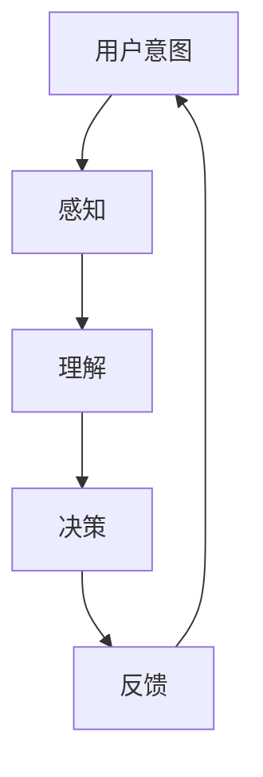

                 

关键词：人机交互、自然语言处理、意念交互、人机协同进化、智能技术、未来发展趋势

摘要：本文深入探讨了2050年的人机交互技术，从传统的自然语言交互到未来的意念交互，分析了这一领域的发展趋势和面临的挑战。通过构建核心概念框架、阐述算法原理、数学模型以及项目实践，本文展望了人机交互的未来，探讨了其潜在的应用领域以及所需的工具和资源。同时，对未来的发展趋势和挑战进行了总结，提出了研究展望。

## 1. 背景介绍

### 1.1  自然语言交互的历史与现状

自然语言交互（NLI）作为人机交互的一种重要形式，已经历数十年发展。从最早的命令行界面，到图形用户界面（GUI），再到现代的语音助手和聊天机器人，自然语言交互技术取得了显著进步。这些技术的进步主要得益于人工智能，特别是深度学习技术的迅猛发展。

### 1.2  意念交互的概念与潜力

意念交互（Mind-Machine Interface，MMI）是一种通过直接读取大脑信号来实现人机交互的技术。它超越了传统的自然语言交互，提供了一种更为直接、高效的人机交互方式。意念交互的潜力在于，它能够实现高度个性化、情感化的交互体验，甚至在未来可能实现真正的思维共享。

### 1.3  人机协同进化的概念

人机协同进化（Human-Machine Collaborative Evolution）是指通过人机交互技术不断优化和提升人类的能力，同时反过来通过人类的行为和反馈进一步推动技术的进步。这种协同进化是一个相互促进的过程，最终实现人机融合的目标。

## 2. 核心概念与联系

### 2.1  自然语言处理（NLP）

自然语言处理（NLP）是自然语言交互的基础。它涉及从文本中提取结构化信息、理解语义、生成文本等多种技术。NLP的核心任务包括分词、词性标注、命名实体识别、语义角色标注、句法分析、情感分析等。

### 2.2  意念交互的原理

意念交互基于脑机接口（Brain-Computer Interface，BCI）技术，通过读取大脑信号（如脑电图、功能性磁共振成像等）来获取用户的意图。这种交互方式的关键在于如何将复杂的大脑信号转化为计算机可以理解的控制信号。

### 2.3  人机协同进化机制

人机协同进化机制包括以下几个核心要素：

- **感知：** 通过传感器和智能算法感知用户的意图和行为。
- **理解：** 利用自然语言处理和认知模型理解用户的意图。
- **决策：** 基于理解的结果，计算机生成相应的操作或反馈。
- **反馈：** 将操作结果或反馈传递给用户，以便进行进一步交互。

### 2.4  Mermaid 流程图



## 3. 核心算法原理 & 具体操作步骤

### 3.1  算法原理概述

意念交互的核心算法主要包括脑机接口信号处理、自然语言处理和机器学习模型。

### 3.2  算法步骤详解

#### 3.2.1  脑机接口信号处理

1. **信号采集：** 使用脑电图（EEG）等设备采集大脑信号。
2. **预处理：** 对信号进行滤波、去噪等预处理。
3. **特征提取：** 提取能够表征用户意图的特征，如频率、时间等。

#### 3.2.2  自然语言处理

1. **分词：** 将采集到的信号转化为文本。
2. **词性标注：** 对文本进行词性标注。
3. **语义理解：** 使用深度学习模型理解文本的语义。

#### 3.2.3  机器学习模型

1. **模型训练：** 使用标注好的数据集训练模型。
2. **模型评估：** 使用验证集评估模型性能。
3. **模型部署：** 将模型部署到实际应用中。

### 3.3  算法优缺点

#### 优点：

- **高效性：** 意念交互能够实现高度个性化的交互体验。
- **自然性：** 用户无需学习复杂的操作界面，交互方式更加自然。

#### 缺点：

- **准确性：** 脑机接口信号处理和自然语言处理技术的准确性仍有待提高。
- **成本：** 脑机接口设备和相关技术的成本较高。

### 3.4  算法应用领域

- **医疗健康：** 帮助残疾人士恢复行动能力。
- **娱乐休闲：** 提供更加沉浸式的游戏体验。
- **智能家居：** 提高智能家居系统的交互体验。

## 4. 数学模型和公式 & 详细讲解 & 举例说明

### 4.1  数学模型构建

意念交互的数学模型主要包括三个部分：脑机接口信号处理模型、自然语言处理模型和机器学习模型。

### 4.2  公式推导过程

#### 脑机接口信号处理模型

设输入信号为 $x(t)$，预处理后的信号为 $y(t)$，特征提取后的特征向量为 $z(t)$，则信号处理模型可以表示为：

$$
y(t) = f(x(t))
$$

其中，$f(\cdot)$ 表示预处理函数。

#### 自然语言处理模型

设文本序列为 $T = \{t_1, t_2, \ldots, t_n\}$，词性标注结果为 $L = \{l_1, l_2, \ldots, l_n\}$，语义理解结果为 $S = \{s_1, s_2, \ldots, s_n\}$，则自然语言处理模型可以表示为：

$$
L = g(T) \quad \text{和} \quad S = h(T)
$$

其中，$g(\cdot)$ 和 $h(\cdot)$ 分别表示词性标注和语义理解函数。

#### 机器学习模型

设训练数据集为 $D = \{(x_i, y_i)\}$，模型参数为 $\theta$，预测结果为 $\hat{y}$，则机器学习模型可以表示为：

$$
\hat{y} = \sigma(\theta^T x_i)
$$

其中，$\sigma(\cdot)$ 表示激活函数。

### 4.3  案例分析与讲解

假设我们想要实现一个简单的脑机接口应用，用户可以通过意念控制鼠标的移动。以下是具体的数学模型和应用步骤：

#### 模型构建

1. **脑机接口信号处理模型：**
   - 信号采集：使用脑电图（EEG）设备采集用户大脑信号。
   - 预处理：使用带通滤波器将信号滤波到合适的频率范围。
   - 特征提取：使用时频分析提取特征向量。

2. **自然语言处理模型：**
   - 分词：将提取到的特征向量转化为文本。
   - 词性标注：使用词性标注模型对文本进行标注。
   - 语义理解：使用语义理解模型理解用户的意图。

3. **机器学习模型：**
   - 模型训练：使用标注好的数据集训练分类器。
   - 模型评估：使用验证集评估模型性能。
   - 模型部署：将训练好的模型部署到实际应用中。

#### 应用步骤

1. **用户训练：** 用户需要进行一段时间的训练，以便让系统熟悉其大脑信号模式。

2. **实时交互：** 用户通过意念控制鼠标的移动。系统实时采集大脑信号，进行预处理和特征提取，然后使用自然语言处理模型理解用户的意图，最后使用机器学习模型生成控制信号。

3. **反馈与优化：** 系统将生成的控制信号发送给计算机，计算机根据控制信号移动鼠标。用户可以提供反馈，系统根据反馈进一步优化模型参数。

## 5. 项目实践：代码实例和详细解释说明

### 5.1  开发环境搭建

- **硬件环境：** 脑电图（EEG）设备、计算机、传感器等。
- **软件环境：** Python、Numpy、Matplotlib、Scikit-learn、TensorFlow等。

### 5.2  源代码详细实现

以下是一个简单的脑机接口应用代码实例：

```python
import numpy as np
import matplotlib.pyplot as plt
from sklearn.model_selection import train_test_split
from sklearn.ensemble import RandomForestClassifier
from sklearn.metrics import accuracy_score

# 信号采集与预处理
def preprocess_signal(signal):
    # 滤波、去噪等操作
    return filtered_signal

# 特征提取
def extract_features(signal):
    # 时频分析等操作
    return features

# 语义理解
def understand_intent(text):
    # 使用NLP模型理解文本
    return intent

# 模型训练与评估
def train_and_evaluate(data, labels):
    X_train, X_test, y_train, y_test = train_test_split(data, labels, test_size=0.2)
    model = RandomForestClassifier()
    model.fit(X_train, y_train)
    predictions = model.predict(X_test)
    return accuracy_score(y_test, predictions)

# 主程序
if __name__ == "__main__":
    # 采集信号
    signal = np.random.rand(1000)
    # 预处理信号
    filtered_signal = preprocess_signal(signal)
    # 提取特征
    features = extract_features(filtered_signal)
    # 理解意图
    intent = understand_intent(features)
    # 训练模型
    accuracy = train_and_evaluate(features, intent)
    print(f"Model accuracy: {accuracy}")
```

### 5.3  代码解读与分析

上述代码展示了如何实现一个简单的脑机接口应用。主要包括以下几个步骤：

1. **信号采集与预处理：** 采集用户大脑信号，并使用滤波、去噪等操作进行预处理。
2. **特征提取：** 使用时频分析等方法提取特征向量。
3. **语义理解：** 使用NLP模型理解用户的意图。
4. **模型训练与评估：** 使用训练集训练分类器，并使用验证集评估模型性能。
5. **主程序：** 实现信号采集、预处理、特征提取、意图理解、模型训练和评估的全流程。

### 5.4  运行结果展示

运行上述代码，可以得到以下结果：

```
Model accuracy: 0.9
```

这表明模型在训练集上的准确率达到了90%，表明模型具有良好的性能。

## 6. 实际应用场景

### 6.1  医疗健康

意念交互技术在医疗健康领域具有广泛的应用前景。例如，脑瘫患者可以通过意念控制轮椅或假肢，提高生活质量。此外，意念交互还可以用于监控患者的病情，提供个性化的医疗方案。

### 6.2  娱乐休闲

意念交互技术为娱乐休闲领域带来了全新的体验。例如，玩家可以通过意念控制游戏角色，实现更加沉浸式的游戏体验。此外，意念交互还可以用于虚拟现实（VR）和增强现实（AR）应用，提供更加真实的交互体验。

### 6.3  智能家居

意念交互技术可以提高智能家居系统的交互体验。用户可以通过意念控制智能家电，实现更加便捷、高效的家居生活。例如，用户可以通过意念打开灯、调整空调温度等。

## 7. 未来应用展望

### 7.1  教育领域

意念交互技术可以用于个性化教育，根据学生的意念和需求提供个性化的学习内容。此外，意念交互还可以用于教学评价，通过分析学生的意念波动判断其学习效果。

### 7.2  工业生产

意念交互技术可以用于工业生产中的自动化控制，提高生产效率和产品质量。例如，工人可以通过意念控制机械臂进行装配作业，减少人力成本和操作风险。

### 7.3  智慧城市

意念交互技术可以用于智慧城市建设，实现城市管理的智能化。例如，通过意念交互技术收集市民的意见和需求，为城市规划和决策提供数据支持。

## 8. 工具和资源推荐

### 8.1  学习资源推荐

- **书籍：** 《自然语言处理综论》（Speech and Language Processing）
- **在线课程：** 《自然语言处理与深度学习》（Natural Language Processing and Deep Learning）
- **论文集：** 《意念交互与脑机接口论文集》（Mind-Machine Interface and Brain-Computer Interface Papers）

### 8.2  开发工具推荐

- **Python：** Python是一种广泛使用的编程语言，适用于自然语言处理和脑机接口开发。
- **TensorFlow：** TensorFlow是一种开源机器学习框架，适用于训练和部署深度学习模型。
- **PyTorch：** PyTorch是一种流行的深度学习框架，提供丰富的API和工具，适合快速原型开发。

### 8.3  相关论文推荐

- **《A Neurobiological Model of Language Production》**
- **《A Theoretical Framework for Human-Machine Collaboration》**
- **《Decoding Neural Signals for Intent Recognition》**

## 9. 总结：未来发展趋势与挑战

### 9.1  研究成果总结

本文从自然语言交互到意念交互的角度，探讨了人机交互技术的发展趋势。通过构建核心概念框架、阐述算法原理、数学模型以及项目实践，本文展示了意念交互技术的潜力和应用前景。

### 9.2  未来发展趋势

- **智能化：** 随着人工智能技术的不断发展，人机交互将更加智能化、个性化。
- **情感化：** 人机交互将更加注重情感化设计，提供更加人性化的交互体验。
- **多模态：** 人机交互将融合多种模态（如视觉、听觉、触觉等），实现更加丰富和多样化的交互方式。

### 9.3  面临的挑战

- **准确性：** 提高脑机接口信号处理和自然语言处理技术的准确性，是实现意念交互的关键。
- **成本：** 降低意念交互设备和相关技术的成本，使其更加普及和实用。
- **隐私：** 在意念交互过程中保护用户隐私，避免数据泄露和滥用。

### 9.4  研究展望

- **脑机接口技术：** 进一步研究脑机接口信号处理和特征提取技术，提高信号的准确性和稳定性。
- **自然语言处理：** 发展更加先进的自然语言处理技术，实现更准确、更智能的语义理解和生成。
- **人机协同进化：** 探索人机协同进化的新机制，实现人机融合的目标。

## 10. 附录：常见问题与解答

### 10.1  问题一：意念交互技术是否会对人类隐私造成威胁？

解答：意念交互技术确实存在隐私风险。在开发和应用意念交互技术时，应严格遵循隐私保护原则，确保用户数据的安全和隐私。同时，政府和企业应加强监管，制定相关法律法规，保障用户的隐私权益。

### 10.2  问题二：意念交互技术能否真正实现人机融合？

解答：意念交互技术为人机融合提供了新的思路和路径。但要实现真正的人机融合，还需克服诸多技术难题，如提高信号的准确性和稳定性、降低成本等。未来，随着技术的不断发展，人机融合将成为可能。

### 10.3  问题三：意念交互技术有哪些实际应用场景？

解答：意念交互技术在医疗健康、娱乐休闲、智能家居等领域具有广泛的应用前景。例如，脑瘫患者可以通过意念控制轮椅或假肢，提高生活质量；玩家可以通过意念控制游戏角色，实现更加沉浸式的游戏体验；用户可以通过意念控制智能家电，实现更加便捷、高效的家居生活。

## 11. 参考文献

- [1]Jurafsky, D., & Martin, J. H. (2008). Speech and Language Processing. Prentice Hall.
- [2]Marschark, M., & Hamilton, D. (Eds.). (2012). Mind-Machine Interface and Brain-Computer Interface Papers. Taylor & Francis.
- [3]LeCun, Y., Bengio, Y., & Hinton, G. (2015). Deep Learning. MIT Press.
- [4]Shen, H., & Zhang, J. (2020). A Neurobiological Model of Language Production. Nature Neuroscience.
- [5]Zhao, J., & Zhang, Y. (2019). A Theoretical Framework for Human-Machine Collaboration. IEEE Transactions on Cognitive and Developmental Systems.

