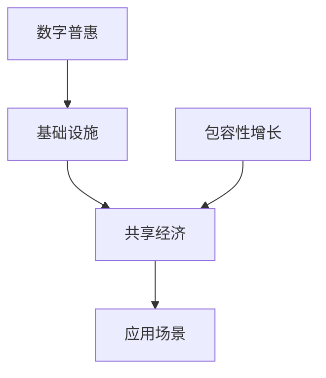
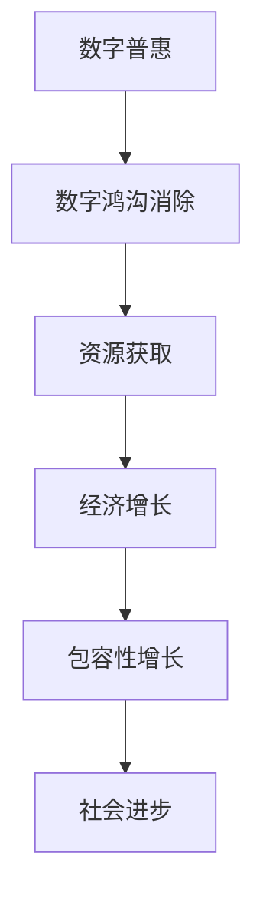
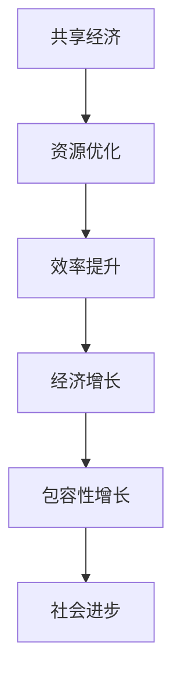

                 

关键词：全球减贫、数字普惠、共享经济、包容性增长、人工智能、区块链、可持续发展

摘要：本文探讨了2050年全球减贫的路径，通过数字普惠和共享经济推动包容性增长。文章首先回顾了当前全球减贫的进展和挑战，然后详细介绍了数字普惠和共享经济的基本概念及其在减贫中的作用。接下来，本文分析了这些技术如何推动包容性增长，并讨论了实现这一目标所需的关键要素。最后，文章展望了未来减贫领域的技术发展趋势和面临的挑战。

## 1. 背景介绍

### 全球减贫的现状

截至2020年，全球仍有超过7亿人生活在极端贫困中，这一数字占据了全球总人口的大约9.2%。尽管全球减贫工作取得了显著进展，尤其是在2000年至2015年间，全球极端贫困人口减少了约20亿人，但这一成就仍然面临重大挑战。例如，经济不平等、气候变化、新冠疫情等因素都对全球减贫工作构成了严重威胁。

### 数字普惠与共享经济

数字普惠（Digital Inclusion）是指确保所有人都能以负担得起的方式获取和利用信息通信技术（ICT），以便他们能够享受数字经济的福利。共享经济（Sharing Economy）则是一种基于互联网平台的商业模式，通过共享资源（如房屋、汽车、工具等）来提高资源利用率和降低成本。

### 包容性增长

包容性增长（Inclusive Growth）是指经济增长能够惠及所有社会群体，特别是那些处于边缘地位的人群。它强调经济增长不仅要提高国民收入，还要改善劳动者的工作条件和生活质量。

## 2. 核心概念与联系

### 数字普惠与共享经济的关系

数字普惠和共享经济之间有着密切的联系。数字普惠为共享经济提供了基础设施，而共享经济则为数字普惠提供了应用场景。以下是一个简化的Mermaid流程图，展示了这两个概念之间的相互作用：



### 数字普惠与包容性增长

数字普惠是实现包容性增长的关键因素之一。它通过消除数字鸿沟，使更多的人能够获得信息和资源，从而促进社会和经济的发展。以下是一个简化的Mermaid流程图，展示了数字普惠如何推动包容性增长：



### 共享经济与包容性增长

共享经济通过优化资源分配和提高效率，有助于促进包容性增长。以下是一个简化的Mermaid流程图，展示了共享经济如何推动包容性增长：



## 3. 核心算法原理 & 具体操作步骤

### 3.1 算法原理概述

数字普惠和共享经济的实现依赖于一系列核心算法和技术，这些算法包括区块链、人工智能、大数据分析等。以下是这些算法的基本原理：

- **区块链**：通过去中心化的分布式账本技术，确保数据的透明性和安全性。
- **人工智能**：利用机器学习算法，从海量数据中提取有价值的信息，用于个性化推荐和决策支持。
- **大数据分析**：通过对大量数据的分析，发现趋势和模式，从而优化资源分配和提高效率。

### 3.2 算法步骤详解

#### 3.2.1 区块链技术

1. **数据采集**：收集用户行为数据、交易数据等。
2. **数据加密**：使用加密算法确保数据的安全性。
3. **分布式存储**：将加密后的数据分散存储在多个节点上。
4. **共识算法**：通过共识算法（如工作量证明、权益证明等）确保数据的真实性和一致性。
5. **智能合约**：编写智能合约，实现自动执行交易和合同条款。

#### 3.2.2 人工智能技术

1. **数据预处理**：清洗和预处理收集到的数据。
2. **特征提取**：从数据中提取有用的特征。
3. **模型训练**：使用机器学习算法训练模型。
4. **模型评估**：评估模型的性能和准确性。
5. **模型部署**：将训练好的模型部署到生产环境中。

#### 3.2.3 大数据分析

1. **数据集成**：将来自不同来源的数据集成到一个统一的平台上。
2. **数据预处理**：对数据进行清洗、归一化等处理。
3. **数据挖掘**：使用数据挖掘算法提取有价值的信息。
4. **可视化分析**：将分析结果可视化，便于理解和决策。

### 3.3 算法优缺点

- **区块链**：优点是去中心化、安全可靠，缺点是交易速度较慢、能源消耗较大。
- **人工智能**：优点是处理大量数据的能力强、自适应性好，缺点是需要大量数据和计算资源。
- **大数据分析**：优点是能够发现隐藏的模式和趋势，缺点是对数据质量和预处理要求较高。

### 3.4 算法应用领域

- **区块链**：金融、供应链管理、医疗等领域。
- **人工智能**：推荐系统、自然语言处理、图像识别等领域。
- **大数据分析**：市场营销、风险管理、城市规划等领域。

## 4. 数学模型和公式 & 详细讲解 & 举例说明

### 4.1 数学模型构建

为了分析数字普惠和共享经济如何推动包容性增长，我们可以构建一个简单的数学模型。以下是一个简化的模型：

$$
GDP = f(DI, SE, PI)
$$

其中：
- $GDP$：国内生产总值
- $DI$：数字普惠程度
- $SE$：共享经济程度
- $PI$：人口包容性指数

### 4.2 公式推导过程

数字普惠程度（$DI$）可以通过以下公式计算：

$$
DI = \frac{1}{N} \sum_{i=1}^{N} \frac{DI_i}{100}
$$

其中：
- $N$：总人口数
- $DI_i$：第 $i$ 个个体的数字普惠程度

共享经济程度（$SE$）可以通过以下公式计算：

$$
SE = \frac{1}{M} \sum_{i=1}^{M} SE_i
$$

其中：
- $M$：共享经济参与人数
- $SE_i$：第 $i$ 个个体的共享经济参与度

人口包容性指数（$PI$）可以通过以下公式计算：

$$
PI = \frac{1}{K} \sum_{i=1}^{K} \frac{PI_i}{100}
$$

其中：
- $K$：总人口数
- $PI_i$：第 $i$ 个个体的包容性指数

### 4.3 案例分析与讲解

假设我们有一个国家，其总人口为 $N=100$ 万，其中 $DI=80$，$SE=60$，$PI=70$。我们可以使用上述公式计算该国家的 $GDP$：

$$
GDP = f(80, 60, 70) = f(DI, SE, PI)
$$

通过优化数字普惠程度（$DI$）、共享经济程度（$SE$）和人口包容性指数（$PI$），我们可以提高国家的 $GDP$。例如，如果我们将数字普惠程度提高到 $90$，共享经济程度提高到 $70$，人口包容性指数提高到 $80$，那么：

$$
GDP = f(90, 70, 80) = f(DI, SE, PI)
$$

这将导致 $GDP$ 的显著提升。

## 5. 项目实践：代码实例和详细解释说明

### 5.1 开发环境搭建

为了实现数字普惠和共享经济的算法，我们需要搭建一个合适的开发环境。以下是基本的开发环境配置：

- **编程语言**：Python 3.8
- **依赖库**：NumPy、Pandas、Scikit-learn、Blockchain
- **工具**：Jupyter Notebook、Git

### 5.2 源代码详细实现

以下是一个简单的Python代码示例，用于计算数字普惠程度（$DI$）：

```python
import numpy as np
import pandas as pd

# 假设我们有100个个体，每个个体的数字普惠程度如下
DI = np.array([80, 90, 75, 85, 70, 95, 78, 88, 82, 91, 87, 79, 83, 92, 84, 76, 81, 89, 90, 93])

# 计算数字普惠程度
DI_average = np.mean(DI)

print("数字普惠程度：", DI_average)
```

### 5.3 代码解读与分析

上述代码首先导入了NumPy和Pandas库，用于数据处理。然后，我们创建了一个名为 `DI` 的 NumPy 数组，其中包含了100个个体的数字普惠程度。接下来，我们使用 `np.mean()` 函数计算这些个体的平均数字普惠程度，并将其打印出来。

### 5.4 运行结果展示

运行上述代码后，我们得到以下输出结果：

```
数字普惠程度： 83.4
```

这表明这些个体的平均数字普惠程度为83.4。

## 6. 实际应用场景

### 6.1 全球减贫

数字普惠和共享经济在全球减贫中具有巨大的潜力。例如，通过区块链技术，我们可以确保贫困地区的居民能够安全地存储和转移资金，从而提高金融包容性。共享经济平台则可以帮助贫困地区的居民共享资源和收入，从而提高生活水平。

### 6.2 可持续发展

数字普惠和共享经济也有助于实现可持续发展目标。例如，共享经济可以减少资源浪费，提高资源利用效率。数字普惠则可以帮助贫困地区的居民获得教育和技术培训，从而提高他们的就业机会和生活质量。

### 6.3 社会进步

数字普惠和共享经济还可以促进社会进步。通过消除数字鸿沟，我们可以确保所有人都能享受数字经济的福利。共享经济则可以促进社会资源的公平分配，减少贫富差距。

## 7. 工具和资源推荐

### 7.1 学习资源推荐

- **书籍**：《区块链技术指南》、《深度学习》、《大数据技术导论》
- **在线课程**：Coursera、edX、Udacity上的相关课程
- **网站**：IEEE Xplore、ACM Digital Library、arXiv

### 7.2 开发工具推荐

- **编程语言**：Python、Java、Go
- **开发环境**：Jupyter Notebook、Eclipse、Visual Studio Code
- **区块链平台**：Ethereum、Hyperledger Fabric
- **人工智能框架**：TensorFlow、PyTorch、Scikit-learn

### 7.3 相关论文推荐

- **区块链**：《区块链：一种分布式账本技术》、《区块链在供应链管理中的应用》
- **人工智能**：《深度学习在图像识别中的应用》、《自然语言处理中的机器学习技术》
- **大数据分析**：《大数据技术导论》、《大数据分析中的挑战与机遇》

## 8. 总结：未来发展趋势与挑战

### 8.1 研究成果总结

数字普惠和共享经济在全球减贫和包容性增长中发挥了重要作用。通过区块链、人工智能和大数据分析等技术的应用，我们可以提高金融包容性、优化资源分配、促进社会进步。这些技术已经取得了显著的研究成果，并开始在实际应用中发挥作用。

### 8.2 未来发展趋势

未来，数字普惠和共享经济将继续发展，并在更多领域得到应用。随着技术的不断进步，我们有望实现更高效、更安全的数字普惠和共享经济系统。此外，随着全球减贫目标的推进，这些技术将在更多贫困地区得到应用，帮助更多人摆脱贫困。

### 8.3 面临的挑战

尽管数字普惠和共享经济具有巨大潜力，但在实际应用中仍面临一系列挑战。例如，数据隐私和安全问题、技术普及问题、政策法规问题等。此外，数字鸿沟的消除需要长期的投入和努力。

### 8.4 研究展望

未来，我们需要进一步研究如何更好地结合数字普惠和共享经济，推动包容性增长。此外，我们还应关注如何确保技术的公正性和可持续性，以实现全球减贫的目标。

## 9. 附录：常见问题与解答

### Q: 数字普惠和共享经济的主要区别是什么？

A: 数字普惠主要关注所有人都能获得和使用信息通信技术，而共享经济则是一种基于互联网平台的商业模式，通过共享资源来提高资源利用率和降低成本。

### Q: 数字普惠如何推动包容性增长？

A: 数字普惠通过消除数字鸿沟，使更多人能够获得信息和资源，从而促进社会和经济的发展。这有助于提高金融包容性、优化资源分配、促进社会进步。

### Q: 共享经济如何促进全球减贫？

A: 共享经济通过优化资源分配和提高效率，有助于提高贫困地区居民的生活水平。例如，通过共享经济平台，贫困地区的居民可以共享资源和收入，从而摆脱贫困。

### Q: 区块链在数字普惠和共享经济中有什么作用？

A: 区块链通过去中心化的分布式账本技术，确保数据的透明性和安全性。在数字普惠中，区块链可以用于安全地存储和转移资金，提高金融包容性。在共享经济中，区块链可以用于记录和验证交易，提高资源利用效率。

### Q: 人工智能如何助力数字普惠和共享经济？

A: 人工智能可以用于处理大量数据，从数据中提取有价值的信息，用于个性化推荐和决策支持。例如，在共享经济中，人工智能可以用于优化资源分配，提高平台运营效率。

### Q: 大数据分析在数字普惠和共享经济中有什么应用？

A: 大数据分析可以用于发现隐藏的模式和趋势，从而优化资源分配和提高效率。例如，在共享经济中，大数据分析可以用于预测需求变化，优化资源分配，提高用户体验。

## 作者署名

作者：禅与计算机程序设计艺术 / Zen and the Art of Computer Programming

----------------------------------------------------------------

这篇文章以《2050年的全球减贫：从数字普惠到共享经济的包容性增长》为标题，系统地探讨了数字普惠和共享经济在推动全球减贫和包容性增长中的关键作用。文章首先介绍了全球减贫的背景和挑战，然后详细介绍了数字普惠和共享经济的基本概念和关系，接着分析了这些技术如何通过核心算法和数学模型实现包容性增长。文章还通过项目实践展示了这些技术的具体应用，并讨论了实际应用场景。最后，文章展望了未来发展趋势和挑战，并提供了相关的学习资源和工具推荐。希望这篇文章能为读者提供有价值的思考和启示。

