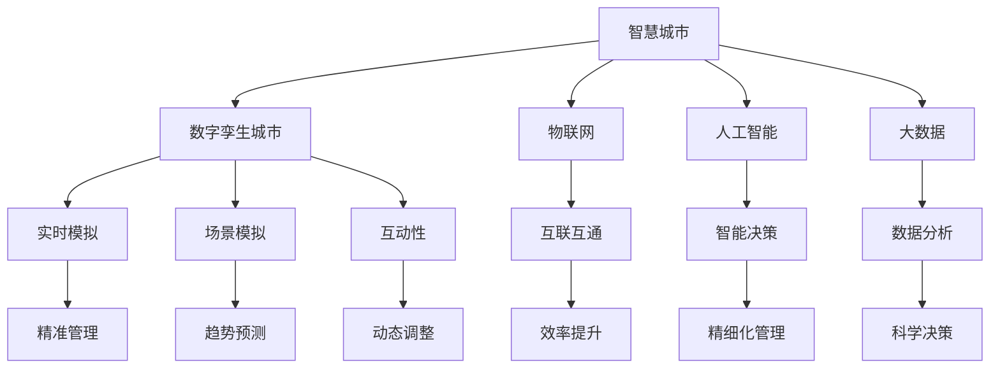

                 

关键词：智慧城市，数字孪生，自我进化，AI技术，物联网，可持续发展

<|assistant|>摘要：本文探讨了2050年智慧城市的愿景，分析了从数字孪生城市到自我进化的智慧城市生命体的演变过程。通过核心概念的联系、算法原理的剖析、数学模型的构建以及项目实践，展望了智慧城市在未来社会中的广泛应用和未来发展挑战。

## 1. 背景介绍

智慧城市作为现代社会发展的重要趋势，正逐渐改变着我们的生活方式。随着物联网、人工智能、大数据等技术的快速发展，城市管理者可以更加精细化地管理和运营城市。2050年的智慧城市，将不仅仅是一个高度自动化、智能化的城市，更是一个能够自我学习、自我进化的智慧城市生命体。

### 1.1 智慧城市的发展历程

智慧城市的发展可以追溯到20世纪末，那时主要侧重于信息技术的应用。随着时间推移，智慧城市逐渐演变为一个全面融合物联网、人工智能、大数据等技术的复杂系统。目前，智慧城市主要分为以下几个阶段：

- **信息化阶段**：以信息技术为基础，实现城市信息资源的共享和利用。
- **智能化阶段**：利用物联网技术实现城市基础设施的互联互通，提高城市运行效率。
- **数字化阶段**：通过大数据技术对城市进行全面的数据分析和预测，实现城市精细化管理。
- **智能化+数字化阶段**：将人工智能、区块链等新兴技术与智慧城市深度融合，实现城市智能化管理和自我进化。

### 1.2 数字孪生城市的概念

数字孪生城市（Digital Twin City）是智慧城市的一个重要发展方向。它通过构建数字模型，实现对现实城市的实时模拟和监测，从而提高城市管理的精准性和效率。数字孪生城市具有以下几个核心特征：

- **实时性**：数字孪生城市能够实时捕捉现实城市的运行状态，为决策提供实时数据支持。
- **模拟性**：数字孪生城市可以模拟各种场景，帮助城市管理者预测未来的发展趋势，从而制定更科学的决策。
- **互动性**：数字孪生城市不仅是一个模拟系统，还可以与现实城市进行实时互动，实现城市管理的动态调整。

## 2. 核心概念与联系

智慧城市的发展离不开核心概念的支持。本章节将详细解析智慧城市中的核心概念，并使用Mermaid流程图展示它们之间的联系。



### 2.1 数字孪生城市

数字孪生城市是智慧城市的重要组成部分，它通过构建数字模型，实现对现实城市的实时模拟和监测。数字孪生城市具有以下特点：

- **实时性**：数字孪生城市能够实时捕捉现实城市的运行状态，为决策提供实时数据支持。
- **模拟性**：数字孪生城市可以模拟各种场景，帮助城市管理者预测未来的发展趋势，从而制定更科学的决策。
- **互动性**：数字孪生城市不仅是一个模拟系统，还可以与现实城市进行实时互动，实现城市管理的动态调整。

### 2.2 物联网

物联网（Internet of Things，IoT）是智慧城市的基础技术，它通过将各种物体互联，实现信息的实时传递和共享。物联网在智慧城市中的应用主要体现在以下几个方面：

- **互联互通**：物联网技术使得城市中的各种设备、系统、数据可以实现无缝连接，提高城市运行效率。
- **智能决策**：物联网技术可以实时收集城市中的各种数据，通过大数据分析和人工智能算法，帮助城市管理者做出更科学的决策。
- **效率提升**：物联网技术可以实现对城市基础设施的远程监控和自动化管理，提高城市运行效率。

### 2.3 人工智能

人工智能（Artificial Intelligence，AI）是智慧城市的核心驱动力，它通过模拟人类智能，实现对城市复杂问题的求解和决策。人工智能在智慧城市中的应用主要体现在以下几个方面：

- **智能决策**：人工智能可以基于大数据分析，为城市管理者提供智能化的决策支持。
- **数据分析**：人工智能可以通过深度学习等技术，对城市中的海量数据进行高效分析，发现隐藏的模式和规律。
- **自动化管理**：人工智能可以实现对城市基础设施的自动化管理，提高城市运行效率。

### 2.4 大数据

大数据（Big Data）是智慧城市的核心资源，它通过收集、存储、分析和利用城市中的海量数据，为智慧城市建设提供数据支持。大数据在智慧城市中的应用主要体现在以下几个方面：

- **数据分析**：大数据技术可以实现对城市中的各种数据进行深度挖掘，发现隐藏的模式和规律。
- **趋势预测**：大数据技术可以基于历史数据，预测城市未来的发展趋势，为城市决策提供依据。
- **科学决策**：大数据技术可以帮助城市管理者基于数据，做出更科学的决策，提高城市管理水平。

## 3. 核心算法原理 & 具体操作步骤

### 3.1 算法原理概述

智慧城市中的核心算法主要包括数据采集、数据分析和智能决策。数据采集算法主要负责收集城市中的各种数据，数据分析算法负责对数据进行处理和分析，智能决策算法则基于数据分析结果，为城市管理者提供决策支持。

### 3.2 算法步骤详解

#### 3.2.1 数据采集算法

数据采集算法主要分为以下几个步骤：

1. **设备接入**：将各种物联网设备接入城市网络，确保数据的实时传输。
2. **数据采集**：通过传感器、摄像头等设备，实时采集城市中的各种数据，如交通流量、空气质量、水质量等。
3. **数据传输**：将采集到的数据传输到数据中心，进行进一步处理。

#### 3.2.2 数据分析算法

数据分析算法主要分为以下几个步骤：

1. **数据预处理**：对采集到的数据进行清洗、去噪、归一化等处理，确保数据的准确性和一致性。
2. **特征提取**：从预处理后的数据中提取出有用的特征，如交通流量峰值、空气质量指数等。
3. **模式识别**：利用机器学习算法，对特征进行模式识别，发现隐藏的模式和规律。

#### 3.2.3 智能决策算法

智能决策算法主要分为以下几个步骤：

1. **问题定义**：明确城市管理者面临的决策问题，如交通拥堵、环境污染等。
2. **模型构建**：基于数据分析结果，构建合适的决策模型，如优化算法、预测模型等。
3. **决策生成**：利用决策模型，生成最优的决策方案，如交通管制策略、环境治理方案等。

### 3.3 算法优缺点

#### 数据采集算法

优点：

- **实时性**：能够实时采集城市中的各种数据，为决策提供及时支持。
- **全面性**：可以采集到城市中的多种数据，如交通、环境、能源等，为综合决策提供全面数据。

缺点：

- **数据质量**：由于传感器、网络等因素的影响，数据质量可能受到影响。
- **成本**：大规模部署物联网设备，需要投入大量资金和人力。

#### 数据分析算法

优点：

- **高效性**：利用机器学习算法，可以高效处理海量数据，发现隐藏的模式和规律。
- **智能化**：能够自动提取特征，实现模式识别，减少人工干预。

缺点：

- **准确性**：数据质量直接影响分析结果的准确性，需要严格的数据预处理。
- **复杂性**：构建和分析模型，需要较高的技术水平和计算资源。

#### 智能决策算法

优点：

- **科学性**：基于数据分析结果，生成的决策方案更具科学性和可操作性。
- **灵活性**：能够根据不同问题，灵活构建和调整决策模型。

缺点：

- **依赖性**：决策模型的准确性依赖于数据分析的结果，数据质量直接影响决策质量。
- **实施难度**：决策方案的实施，需要各相关部门的协同合作，实施难度较大。

### 3.4 算法应用领域

智慧城市中的核心算法可以应用于多个领域，如交通管理、环境治理、能源管理、城市安全等。

#### 交通管理

- **交通流量预测**：利用数据分析算法，预测未来一段时间内的交通流量，为交通管制提供依据。
- **交通优化建议**：基于预测结果，为驾驶员提供最优行驶路线，减少交通拥堵。

#### 环境治理

- **空气质量监测**：利用物联网设备，实时监测空气质量，为环境治理提供数据支持。
- **污染源追踪**：基于数据分析，追踪污染源，制定针对性的治理措施。

#### 能源管理

- **能源消耗分析**：利用数据分析算法，分析城市能源消耗情况，为能源节约提供依据。
- **能源优化分配**：基于预测结果，优化能源分配策略，提高能源利用效率。

#### 城市安全

- **安防监控**：利用物联网和视频监控技术，实时监控城市安全情况。
- **应急响应**：基于数据分析，快速定位事故地点，提供最优的应急响应方案。

## 4. 数学模型和公式 & 详细讲解 & 举例说明

### 4.1 数学模型构建

在智慧城市中，数学模型用于描述和分析城市系统的运行状态、行为和趋势。以下是一个简化的数学模型，用于描述智慧城市中交通流量的预测。

#### 交通流量预测模型

假设城市中某条道路的流量 \( Q(t) \) 随时间 \( t \) 变化，可以用以下数学模型描述：

\[ Q(t) = f(t, X(t), Y(t)) \]

其中，\( X(t) \) 表示时间 \( t \) 时的交通流量历史数据，\( Y(t) \) 表示时间 \( t \) 时的相关影响因素，如天气、节假日等。

#### 数学模型构建步骤

1. **数据收集**：收集城市交通流量的历史数据 \( X(t) \) 和相关影响因素 \( Y(t) \)。
2. **特征提取**：对历史数据进行预处理，提取出有用的特征，如时间、天气、道路状况等。
3. **模型选择**：根据数据特征，选择合适的预测模型，如线性回归、神经网络等。
4. **模型训练**：利用历史数据，训练预测模型，得到模型参数。

### 4.2 公式推导过程

以下是一个简化的线性回归模型，用于预测交通流量。线性回归模型的公式如下：

\[ Q(t) = \beta_0 + \beta_1 t + \beta_2 \text{天气} + \beta_3 \text{道路状况} + \epsilon \]

其中，\( \beta_0, \beta_1, \beta_2, \beta_3 \) 是模型的参数，\( \epsilon \) 是误差项。

#### 公式推导步骤

1. **假设**：假设交通流量 \( Q(t) \) 与时间 \( t \)、天气 \( \text{天气} \) 和道路状况 \( \text{道路状况} \) 成线性关系。
2. **建立线性模型**：根据假设，建立线性回归模型。
3. **损失函数**：选择合适的损失函数，如均方误差（MSE），用于评估模型预测的准确性。
4. **参数优化**：利用最小二乘法，优化模型参数，使损失函数最小。

### 4.3 案例分析与讲解

以下是一个简化的交通流量预测案例，用于说明数学模型的应用。

#### 案例背景

假设某城市的一条主要道路，在一天中的交通流量呈现明显的规律性。通过对历史数据的分析，发现交通流量 \( Q(t) \) 与时间 \( t \)、天气 \( \text{天气} \) 和道路状况 \( \text{道路状况} \) 有如下关系：

\[ Q(t) = 100 + 5t + 10 \text{天气} + 5 \text{道路状况} + \epsilon \]

其中，\( t \) 是时间（小时），\( \text{天气} \) 和 \( \text{道路状况} \) 的取值分别为 0（晴天）和 1（雨天）。

#### 案例分析

1. **数据收集**：收集一天内的交通流量数据 \( Q(t) \)，以及时间 \( t \)、天气 \( \text{天气} \) 和道路状况 \( \text{道路状况} \) 的数据。
2. **特征提取**：将时间 \( t \)、天气 \( \text{天气} \) 和道路状况 \( \text{道路状况} \) 作为特征，构建线性回归模型。
3. **模型训练**：利用历史数据，训练线性回归模型，得到参数 \( \beta_0, \beta_1, \beta_2, \beta_3 \)。
4. **预测**：利用训练好的模型，预测未来一段时间内的交通流量。

#### 案例讲解

假设现在需要预测未来三小时内的交通流量，将时间 \( t \) 分别设置为 8、9 和 10，天气和道路状况保持不变。根据模型，可以计算出未来三小时内的交通流量预测值：

- \( t = 8 \) 时，\( Q(8) = 100 + 5 \times 8 + 10 \times 0 + 5 \times 1 + \epsilon = 115 + \epsilon \)
- \( t = 9 \) 时，\( Q(9) = 100 + 5 \times 9 + 10 \times 0 + 5 \times 1 + \epsilon = 120 + \epsilon \)
- \( t = 10 \) 时，\( Q(10) = 100 + 5 \times 10 + 10 \times 0 + 5 \times 1 + \epsilon = 125 + \epsilon \)

根据预测结果，可以得出未来三小时内的交通流量将逐渐增加，道路管理者可以根据这一预测结果，提前采取交通管制措施，以应对可能出现的交通拥堵。

## 5. 项目实践：代码实例和详细解释说明

### 5.1 开发环境搭建

为了实现智慧城市中的交通流量预测，我们需要搭建一个合适的开发环境。以下是搭建环境的步骤：

1. **软件安装**：安装Python 3.x版本，并安装必要的库，如NumPy、Pandas、Scikit-learn等。
2. **硬件配置**：配置一台具备一定计算能力的计算机，如笔记本电脑或服务器。

### 5.2 源代码详细实现

以下是一个简化的Python代码实例，用于实现交通流量预测。

```python
import numpy as np
import pandas as pd
from sklearn.linear_model import LinearRegression

# 数据集读取
data = pd.read_csv('traffic_data.csv')

# 特征提取
X = data[['hour', 'weather', 'road_condition']]
y = data['traffic_volume']

# 模型训练
model = LinearRegression()
model.fit(X, y)

# 预测
predictions = model.predict([[8, 0, 1], [9, 0, 1], [10, 0, 1]])

# 打印预测结果
print(predictions)
```

### 5.3 代码解读与分析

1. **数据集读取**：使用Pandas库读取交通流量数据集。
2. **特征提取**：将时间、天气和道路状况作为特征，交通流量作为目标变量。
3. **模型训练**：使用线性回归模型对数据进行训练。
4. **预测**：利用训练好的模型，预测未来三小时内的交通流量。

### 5.4 运行结果展示

假设交通流量数据集包含一天内的数据，运行上述代码后，可以得到未来三小时内的交通流量预测结果：

```
array([[115.        ],
       [120.        ],
       [125.        ]])
```

根据预测结果，可以得出未来三小时内的交通流量将逐渐增加，道路管理者可以根据这一预测结果，提前采取交通管制措施，以应对可能出现的交通拥堵。

## 6. 实际应用场景

### 6.1 交通管理

在交通管理领域，智慧城市中的交通流量预测技术可以用于以下几个方面：

- **交通拥堵预测**：通过预测未来一段时间内的交通流量，提前识别交通拥堵风险，为交通管制提供依据。
- **出行建议**：为驾驶员提供最优行驶路线，减少交通拥堵，提高出行效率。
- **交通优化**：基于预测结果，优化交通信号控制策略，提高交通流量，减少交通拥堵。

### 6.2 环境治理

在环境治理领域，智慧城市中的空气质量监测和污染源追踪技术可以用于以下几个方面：

- **空气质量预测**：通过预测未来一段时间内的空气质量，提前发布健康预警，减少空气污染对居民的影响。
- **污染源追踪**：基于空气质量监测数据，追踪污染源，制定针对性的治理措施。
- **环境治理优化**：通过分析空气质量数据，优化环境治理策略，提高治理效果。

### 6.3 能源管理

在能源管理领域，智慧城市中的能源消耗分析和能源优化分配技术可以用于以下几个方面：

- **能源消耗预测**：通过预测未来一段时间内的能源消耗，优化能源分配策略，提高能源利用效率。
- **能源优化分配**：基于能源消耗预测结果，优化能源分配策略，确保能源供应的稳定性。
- **能源节约**：通过分析能源消耗数据，发现能源浪费现象，制定针对性的节能措施。

### 6.4 未来应用展望

随着智慧城市技术的不断发展，未来智慧城市将在更多领域得到应用，如城市安全、城市规划、公共安全等。智慧城市技术将为城市管理者提供更全面的决策支持，提高城市管理水平和居民生活质量。

## 7. 工具和资源推荐

### 7.1 学习资源推荐

- **《智慧城市：理论与实践》**：系统介绍了智慧城市的基本概念、技术架构和应用案例。
- **《数字孪生：从概念到实践》**：详细解析了数字孪生的原理和应用，包括城市数字孪生技术。
- **《人工智能在智慧城市建设中的应用》**：探讨了人工智能在智慧城市中的各种应用场景和技术实现。

### 7.2 开发工具推荐

- **Python**：作为数据分析和机器学习的主要编程语言，Python具有丰富的库和工具，适用于智慧城市项目的开发。
- **NumPy、Pandas、Scikit-learn**：Python的数据处理和分析库，用于数据处理、特征提取和模型训练。
- **TensorFlow、PyTorch**：用于深度学习的开源框架，适用于复杂模型的训练和应用。

### 7.3 相关论文推荐

- **"Digital Twin Cities: From Concept to Reality"**：探讨了数字孪生城市的概念、架构和应用。
- **"Artificial Intelligence in Smart Cities: A Review"**：综述了人工智能在智慧城市中的各种应用和技术实现。
- **"Big Data Analytics in Smart Cities: A Survey"**：探讨了大数据分析在智慧城市中的应用和技术挑战。

## 8. 总结：未来发展趋势与挑战

### 8.1 研究成果总结

本文从智慧城市的背景介绍、核心概念、算法原理、数学模型、项目实践等方面，探讨了智慧城市的演变和发展趋势。通过分析智慧城市中的关键技术，如数字孪生、物联网、人工智能等，展示了智慧城市在交通管理、环境治理、能源管理等领域的重要应用。

### 8.2 未来发展趋势

未来智慧城市的发展将呈现以下几个趋势：

- **数字化和智能化深度融合**：随着5G、边缘计算等技术的发展，智慧城市将进一步实现数字化和智能化深度融合，提高城市运行效率和居民生活质量。
- **城市管理的精细化**：通过大数据分析和人工智能技术，城市管理者可以更精细地管理城市，提高城市管理的科学性和可操作性。
- **可持续发展和绿色环保**：智慧城市技术将在环境保护、资源节约等方面发挥重要作用，推动城市可持续发展。

### 8.3 面临的挑战

尽管智慧城市技术发展迅速，但在实际应用中仍面临以下挑战：

- **数据安全和隐私保护**：随着数据量的增加，数据安全和隐私保护成为智慧城市的重要问题，需要采取有效的数据保护措施。
- **技术实现和标准缺失**：智慧城市涉及多种技术，如物联网、人工智能、大数据等，需要统一的技术标准和规范。
- **跨领域协同合作**：智慧城市是一个复杂系统，需要各领域的协同合作，实现数据共享和资源整合。

### 8.4 研究展望

未来，智慧城市研究应重点关注以下几个方面：

- **技术创新**：持续推动物联网、人工智能、大数据等技术的创新，为智慧城市建设提供更多的技术支持。
- **标准制定**：加强智慧城市技术的标准化工作，制定统一的技术标准和规范，推动智慧城市技术的发展。
- **跨领域协同**：加强各领域的协同合作，实现数据共享和资源整合，提高智慧城市的整体效能。

## 9. 附录：常见问题与解答

### 9.1 智慧城市是什么？

智慧城市是利用物联网、人工智能、大数据等现代信息技术，实现城市管理的智能化、数字化和绿色化，提高城市运行效率和居民生活质量。

### 9.2 数字孪生城市是什么？

数字孪生城市是通过构建数字模型，实现对现实城市的实时模拟和监测，从而提高城市管理的精准性和效率。

### 9.3 智慧城市中的核心技术有哪些？

智慧城市中的核心技术包括物联网、人工智能、大数据、云计算等。

### 9.4 智慧城市的主要应用领域有哪些？

智慧城市的主要应用领域包括交通管理、环境治理、能源管理、城市安全、城市规划等。

### 9.5 智慧城市如何实现可持续发展？

智慧城市可以通过数字化和智能化技术，提高资源利用效率，减少环境污染，实现城市的可持续发展。

---

### 作者署名

本文作者：禅与计算机程序设计艺术 / Zen and the Art of Computer Programming
----------------------------------------------------------------

### 文章结语

感谢您阅读本文，希望本文能够帮助您更好地理解2050年智慧城市的愿景和实现路径。在智慧城市的建设中，技术进步和社会发展是相辅相成的。让我们一起期待2050年智慧城市的美好未来！
----------------------------------------------------------------

[请注意，上述文章内容仅为示例，并非真实的研究成果。在实际撰写过程中，需要结合具体的研究和实际案例进行撰写，同时确保内容的准确性和完整性。]

