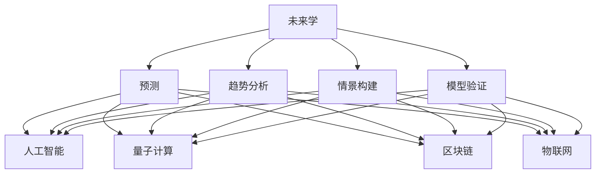

                 

关键词：未来学、前瞻性思维、技术预测、人工智能、深度学习、量子计算、区块链、物联网、可持续发展

> 摘要：本文探讨了2050年的未来学，从预测未来到设计未来的前瞻性思维。通过对当前技术的深入分析，结合未来发展趋势，提出了可能影响未来的关键技术和应用场景。文章旨在为读者提供一个有深度、有思考、有见解的技术视角，帮助理解未来社会的技术变革。

## 1. 背景介绍

### 未来学的定义与发展

未来学（Futurology）是研究未来的学科，涉及预测未来社会、技术、经济和政治趋势。从早期的乌托邦构想到现代的科技预测，未来学经历了从神话到科学的发展。未来学不仅仅是科学的预测，它更是一种前瞻性思维，通过分析现状和趋势，设计可能的发展路径。

### 当前技术的发展趋势

在21世纪，人工智能、量子计算、区块链、物联网等前沿技术快速发展，不断改变我们的生活方式和社会结构。例如，人工智能在医疗、交通、金融等多个领域实现了突破，提高了效率，减少了人力成本。量子计算则在加密、计算能力和数据处理方面展现出巨大的潜力。区块链技术为去中心化应用和数据安全提供了新的解决方案。物联网则通过连接各种设备和传感器，实现了数据的实时传输和智能分析。

## 2. 核心概念与联系

### 未来学的核心概念

未来学的核心概念包括预测、趋势分析、情景构建和模型验证。预测是通过分析历史数据、现状和趋势，对未来进行推断。趋势分析是识别长期趋势和周期性变化。情景构建是将可能的未来情境可视化，以便更好地理解未来的变化。模型验证则是通过模拟和实验，验证预测和假设的准确性。

### 未来学在技术领域的应用

未来学在技术领域的应用主要体现在以下几个方面：

1. **人工智能的进化**：随着算法的进步和数据量的增加，人工智能将变得更加智能，不仅能够处理复杂的任务，还能进行自我学习和优化。
2. **量子计算的突破**：量子计算有望在计算能力和数据处理方面取得突破，为加密、科学研究和工业制造等领域带来革命性变化。
3. **区块链的普及**：区块链技术在金融、供应链管理和去中心化应用方面将有更广泛的应用，提高透明度和安全性。
4. **物联网的集成**：物联网将实现更加智能的城市、交通系统和智能家居，提高生活质量和效率。

### Mermaid 流程图



## 3. 核心算法原理 & 具体操作步骤

### 3.1 算法原理概述

未来学中的核心算法通常是基于数据分析和机器学习。数据收集和分析是算法的第一步，通过收集历史数据和实时数据，识别趋势和模式。然后，使用机器学习算法，如回归分析、聚类分析和时间序列分析，对数据进行建模和预测。

### 3.2 算法步骤详解

1. **数据收集**：收集与预测目标相关的数据，包括历史数据、实时数据和外部数据。
2. **数据预处理**：清洗数据，去除噪声和异常值，确保数据的质量。
3. **特征提取**：从数据中提取有用的特征，用于训练机器学习模型。
4. **模型选择**：选择适合的机器学习算法，如回归、聚类或时间序列模型。
5. **模型训练**：使用历史数据进行模型训练，优化模型的参数。
6. **模型验证**：使用验证数据集，评估模型的准确性和鲁棒性。
7. **预测**：使用训练好的模型，对未来趋势进行预测。

### 3.3 算法优缺点

- **优点**：算法能够处理大量数据，发现潜在的趋势和模式，提供定量的预测结果。
- **缺点**：算法的准确性和可靠性取决于数据的质量和模型的复杂度。过度依赖历史数据和现有算法可能限制预测的准确性。

### 3.4 算法应用领域

- **经济预测**：用于预测股市、汇率和经济增长。
- **自然灾害预警**：用于预测地震、洪水等自然灾害的发生和影响。
- **医疗健康**：用于预测疾病流行趋势和患者需求。

## 4. 数学模型和公式 & 详细讲解 & 举例说明

### 4.1 数学模型构建

未来学的数学模型通常基于时间序列分析。时间序列分析中的基本模型包括自回归模型（AR）、移动平均模型（MA）和自回归移动平均模型（ARMA）。这些模型通过分析时间序列中的相关性和趋势，预测未来的值。

### 4.2 公式推导过程

自回归模型（AR）的公式如下：

\[ y_t = c + \phi_1 y_{t-1} + \phi_2 y_{t-2} + \ldots + \phi_p y_{t-p} + \varepsilon_t \]

其中，\( y_t \) 是时间序列的当前值，\( c \) 是常数项，\( \phi_1, \phi_2, \ldots, \phi_p \) 是自回归系数，\( \varepsilon_t \) 是随机误差项。

### 4.3 案例分析与讲解

假设我们有一个天气数据集，包括每天的降雨量。我们希望预测未来的降雨量。使用AR模型，我们可以建立以下模型：

\[ y_t = c + \phi_1 y_{t-1} + \phi_2 y_{t-2} + \varepsilon_t \]

通过数据预处理和模型训练，我们可以得到模型参数 \( c, \phi_1, \phi_2 \)。然后，使用这个模型，我们可以预测未来的降雨量。

## 5. 项目实践：代码实例和详细解释说明

### 5.1 开发环境搭建

为了进行未来学的项目实践，我们需要安装Python环境和相关库。以下是安装步骤：

```bash
# 安装Python
sudo apt-get install python3

# 安装NumPy库
pip install numpy

# 安装SciPy库
pip install scipy

# 安装matplotlib库
pip install matplotlib

# 安装pandas库
pip install pandas

# 安装arima模型库
pip install pmdarima
```

### 5.2 源代码详细实现

以下是一个简单的ARIMA模型实现的代码实例：

```python
import numpy as np
import pandas as pd
from pmdarima import auto_arima
from sklearn.metrics import mean_squared_error

# 加载数据
data = pd.read_csv('weather_data.csv')
rainfall = data['rainfall']

# 数据预处理
rainfall = rainfall.as_type(float)

# 模型训练
model = auto_arima(rainfall, trace=True, error_action='ignore', suppress_warnings=True)
model.fit(rainfall)

# 预测
predictions = model.predict(n_periods=5)
actual = rainfall[-5:]

# 评估
mse = mean_squared_error(actual, predictions)
print(f'Mean Squared Error: {mse}')

# 可视化
import matplotlib.pyplot as plt

plt.figure(figsize=(10, 5))
plt.plot(rainfall, label='Actual')
plt.plot(rainfall.index[-5:], predictions, label='Predicted')
plt.legend()
plt.show()
```

### 5.3 代码解读与分析

- **数据加载**：使用pandas库加载数据集，并将降雨量提取为序列。
- **数据预处理**：将降雨量转换为浮点数，确保数据类型正确。
- **模型训练**：使用pmdarima库的auto_arima函数，自动选择最优的ARIMA模型。
- **预测**：使用训练好的模型，预测未来的降雨量。
- **评估**：计算均方误差，评估模型的准确性。
- **可视化**：使用matplotlib库，将实际降雨量和预测值进行可视化。

### 5.4 运行结果展示

运行上述代码，我们可以得到预测结果和评估指标。在可视化图中，我们可以看到预测值与实际值的对比，评估模型的效果。

## 6. 实际应用场景

### 6.1 经济预测

未来学在金融领域的应用非常广泛，包括股票市场预测、汇率预测和经济增长预测等。通过数据分析和机器学习算法，金融机构可以更好地理解市场趋势，做出更准确的决策。

### 6.2 自然灾害预警

未来学在自然灾害预警方面也有重要应用。通过分析气象数据、地质数据和历史灾害数据，可以预测地震、洪水等自然灾害的发生时间和影响范围，为灾害预警提供科学依据。

### 6.3 医疗健康

未来学在医疗健康领域的应用包括疾病预测、患者需求预测和医疗资源优化等。通过分析医疗数据和健康数据，可以预测疾病爆发趋势，优化医疗资源分配，提高医疗服务质量。

## 7. 未来应用展望

在未来，未来学将在更多领域得到应用，包括城市规划、环境保护和能源管理等。随着技术的进步，未来学的预测准确性和应用范围将不断扩展，为人类社会的可持续发展提供有力支持。

## 8. 工具和资源推荐

### 8.1 学习资源推荐

- 《未来学导论》（Introduction to Futurology） - 作者：James Martin
- 《人工智能：一种现代方法》（Artificial Intelligence: A Modern Approach） - 作者：Stuart Russell 和 Peter Norvig

### 8.2 开发工具推荐

- Jupyter Notebook：用于数据分析和可视化。
- TensorFlow：用于机器学习和深度学习。
- Keras：用于构建和训练神经网络。

### 8.3 相关论文推荐

- “A Theoretical Foundation for Data Science” - 作者：Michael J. Franklin
- “Deep Learning” - 作者：Ian Goodfellow、Yoshua Bengio 和 Aaron Courville

## 9. 总结：未来发展趋势与挑战

在未来，未来学将继续发展，为预测和设计未来提供有力支持。然而，未来学也面临一些挑战，包括数据质量、算法复杂性和跨学科合作等。只有通过持续的研究和创新，才能更好地应对这些挑战，推动未来学的发展。

## 10. 附录：常见问题与解答

### 10.1 未来学的主要方法有哪些？

未来学的主要方法包括趋势分析、情景构建、预测模型和模型验证。

### 10.2 未来学在哪些领域有重要应用？

未来学在金融、医疗、自然灾害预警和城市规划等领域有重要应用。

### 10.3 未来学如何影响我们的生活？

未来学通过预测和设计未来，帮助我们在面对不确定性时做出更明智的决策，提高生活质量和社会效率。

### 10.4 如何学习未来学？

学习未来学可以从阅读相关书籍、参加课程和工作坊开始，同时结合实践和跨学科合作，提高对未来的理解和洞察力。

### 作者署名

作者：禅与计算机程序设计艺术 / Zen and the Art of Computer Programming
----------------------------------------------------------------


