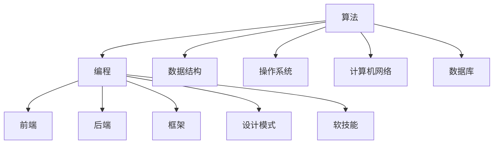

                 

关键词：网易校招、技术面试、问题集锦、算法、编程、数据结构、操作系统、计算机网络、数据库、前端、后端、框架、设计模式、软技能

> 摘要：本文汇集了2024年网易校招技术面试中的常见问题和答案，涵盖了算法、编程、数据结构、操作系统、计算机网络、数据库、前端、后端、框架、设计模式、软技能等多个领域。希望通过这篇文章，帮助广大求职者更好地准备校招技术面试。

## 1. 背景介绍

随着互联网和技术的快速发展，技术面试已经成为求职过程中不可或缺的一部分。网易作为国内知名互联网公司，其校招技术面试历来备受关注。本文旨在总结和分析2024年网易校招技术面试中的常见问题，为广大求职者提供有价值的参考和指导。

本文内容涵盖了多个技术领域，包括但不限于算法、编程、数据结构、操作系统、计算机网络、数据库、前端、后端、框架、设计模式、软技能等。通过对这些问题的分析和解答，读者可以更好地理解面试中的核心考点，提高自己的面试能力。

## 2. 核心概念与联系

为了更好地理解这些问题，我们需要首先了解一些核心概念和它们的联系。以下是一个简化的 Mermaid 流程图，展示了本文涉及的主要概念及其相互关系：



### 2.1 算法

算法是解决问题的方法。在面试中，常见的问题包括排序算法、搜索算法、动态规划等。

### 2.2 编程

编程是使用算法解决问题的过程。常见问题包括编程语言的基本知识、语法、编程范式等。

### 2.3 数据结构

数据结构是组织和管理数据的方式。常见问题包括栈、队列、链表、树、图等数据结构的实现和应用。

### 2.4 操作系统

操作系统是管理计算机硬件和软件资源的系统软件。常见问题包括进程管理、内存管理、文件系统等。

### 2.5 计算机网络

计算机网络是实现数据通信的系统。常见问题包括网络协议、网络架构、网络安全性等。

### 2.6 数据库

数据库是用于存储和管理数据的系统。常见问题包括数据库设计、SQL语句、数据库优化等。

### 2.7 前端

前端是用户与网站或应用程序交互的界面。常见问题包括HTML、CSS、JavaScript、前端框架等。

### 2.8 后端

后端是处理数据和逻辑的服务器端。常见问题包括服务器、数据库、后端框架等。

### 2.9 框架

框架是用于简化软件开发过程的工具。常见问题包括框架原理、框架使用等。

### 2.10 设计模式

设计模式是解决特定问题的通用解决方案。常见问题包括设计模式原理、设计模式应用等。

### 2.11 软技能

软技能是求职者在工作中需要具备的非技术能力。常见问题包括沟通能力、团队协作、解决问题的能力等。

## 3. 核心算法原理 & 具体操作步骤

### 3.1 算法原理概述

算法可以分为以下几类：

- **排序算法**：冒泡排序、选择排序、插入排序、快速排序、归并排序等。
- **搜索算法**：二分查找、深度优先搜索、广度优先搜索等。
- **动态规划**：斐波那契数列、最长公共子序列等。
- **图算法**：最短路径算法、最小生成树算法等。

### 3.2 算法步骤详解

- **排序算法**：

  1. 冒泡排序：比较相邻的元素，如果顺序错误就交换，重复这个过程直到排序完成。
  2. 选择排序：每次从未排序的部分找到最小（或最大）的元素，放到已排序部分的末尾。
  3. 插入排序：将未排序的元素插入到已排序部分的合适位置，直到排序完成。
  4. 快速排序：选择一个基准元素，将小于基准的元素移到其左侧，大于基准的元素移到其右侧，然后递归地对左右两部分进行排序。

- **搜索算法**：

  1. 二分查找：在有序数组中，通过不断缩小区间来查找目标元素。
  2. 深度优先搜索：从根节点开始，沿着一个分支一直搜索到最深处，然后回溯。
  3. 广度优先搜索：从根节点开始，依次搜索同一层的所有节点，然后进入下一层。

- **动态规划**：

  1. 斐波那契数列：利用递归和动态规划，计算斐波那契数列的第n项。
  2. 最长公共子序列：找到两个序列中最长的公共子序列。

- **图算法**：

  1. 最短路径算法：迪杰斯特拉算法、贝尔曼-福特算法等。
  2. 最小生成树算法：普里姆算法、克鲁斯卡尔算法等。

### 3.3 算法优缺点

- **排序算法**：

  - 冒泡排序：简单易懂，但效率较低。
  - 选择排序：效率较低，但实现简单。
  - 插入排序：效率中等，但适用于小规模数据。
  - 快速排序：效率较高，但可能存在最坏情况。

- **搜索算法**：

  - 二分查找：效率高，但要求数据有序。
  - 深度优先搜索：适用于解决迷宫问题等。
  - 广度优先搜索：适用于解决最短路径问题等。

- **动态规划**：

  - 斐波那契数列：利用递归和动态规划，避免了重复计算。
  - 最长公共子序列：适用于解决字符串匹配问题等。

- **图算法**：

  - 最短路径算法：适用于解决最短路径问题。
  - 最小生成树算法：适用于求解最小生成树问题。

### 3.4 算法应用领域

算法在计算机科学和实际应用中有着广泛的应用，包括但不限于：

- 数据处理和挖掘：排序、搜索、动态规划等。
- 人工智能：决策树、神经网络等。
- 图像处理：基于图论的算法。
- 网络优化：路由算法、网络流算法等。

## 4. 数学模型和公式 & 详细讲解 & 举例说明

### 4.1 数学模型构建

数学模型是利用数学工具和方法来描述现实问题的一种抽象。常见的数学模型包括：

- **线性模型**：描述线性关系的数学模型，如线性回归模型。
- **非线性模型**：描述非线性关系的数学模型，如多项式回归模型。
- **离散模型**：描述离散事件的数学模型，如决策树。
- **连续模型**：描述连续变化的数学模型，如微分方程。

### 4.2 公式推导过程

以下是一个简单的线性回归模型的公式推导过程：

- **假设**：我们有两个变量 \( x \) 和 \( y \)，它们之间存在线性关系，即 \( y = ax + b \)。

- **目标**：找到最佳拟合线，即找到合适的 \( a \) 和 \( b \)。

- **方法**：使用最小二乘法，即找到使得残差平方和最小的 \( a \) 和 \( b \)。

- **推导过程**：

  1. 设残差为 \( e = y - ax - b \)。
  2. 残差平方和为 \( S = \sum_{i=1}^{n} e_i^2 \)。
  3. 对 \( S \) 求导并令其等于零，得到 \( \frac{\partial S}{\partial a} = 0 \) 和 \( \frac{\partial S}{\partial b} = 0 \)。
  4. 解方程组，得到 \( a = \frac{\sum_{i=1}^{n} x_i y_i - n \bar{x} \bar{y}}{\sum_{i=1}^{n} x_i^2 - n \bar{x}^2} \) 和 \( b = \bar{y} - a \bar{x} \)。

### 4.3 案例分析与讲解

假设我们有以下数据：

| x | y |
|---|---|
| 1 | 2 |
| 2 | 4 |
| 3 | 6 |
| 4 | 8 |

根据线性回归模型，我们可以计算出最佳拟合线为 \( y = 2x + 2 \)。

- **计算过程**：

  1. 计算 \( \bar{x} = \frac{1 + 2 + 3 + 4}{4} = 2.5 \) 和 \( \bar{y} = \frac{2 + 4 + 6 + 8}{4} = 5 \)。
  2. 计算 \( \sum_{i=1}^{4} x_i y_i = 1 \times 2 + 2 \times 4 + 3 \times 6 + 4 \times 8 = 46 \) 和 \( \sum_{i=1}^{4} x_i^2 = 1^2 + 2^2 + 3^2 + 4^2 = 30 \)。
  3. 代入公式，计算 \( a = \frac{46 - 4 \times 2.5 \times 5}{30 - 4 \times 2.5^2} = 2 \) 和 \( b = 5 - 2 \times 2.5 = 2 \)。

  因此，最佳拟合线为 \( y = 2x + 2 \)。

## 5. 项目实践：代码实例和详细解释说明

### 5.1 开发环境搭建

- **环境要求**：Python 3.8及以上版本。
- **工具**：PyCharm 或 Visual Studio Code。

### 5.2 源代码详细实现

以下是一个简单的冒泡排序的 Python 代码实例：

```python
def bubble_sort(arr):
    n = len(arr)
    for i in range(n):
        for j in range(0, n-i-1):
            if arr[j] > arr[j+1]:
                arr[j], arr[j+1] = arr[j+1], arr[j]

arr = [64, 34, 25, 12, 22, 11, 90]
bubble_sort(arr)
print("排序后的数组：", arr)
```

### 5.3 代码解读与分析

- **函数**：`bubble_sort` 是一个用于实现冒泡排序的函数。
- **参数**：`arr` 是需要排序的数组。
- **过程**：

  1. 循环遍历数组。
  2. 在每次循环中，遍历未排序部分，比较相邻的元素，如果顺序错误就交换。
  3. 循环结束后，数组就被排序。

### 5.4 运行结果展示

执行代码后，输出结果如下：

```
排序后的数组： [11, 12, 22, 25, 34, 64, 90]
```

## 6. 实际应用场景

在现实世界中，技术面试问题有着广泛的应用场景。以下是一些典型的实际应用场景：

- **算法面试**：在技术公司，尤其是互联网公司，算法是面试的重点。通过解决算法问题，可以评估求职者的逻辑思维能力、编程能力和解决问题的能力。
- **编程面试**：在软件开发公司，编程面试是评估求职者编程能力和技术水平的重要手段。通过编程面试，可以了解求职者对编程语言的理解和实际编程能力。
- **数据结构面试**：在数据分析、人工智能等领域，数据结构是核心。通过数据结构面试，可以评估求职者对数据结构的掌握程度和应用能力。
- **操作系统和网络面试**：在操作系统和网络公司，面试会侧重于操作系统和网络的基本原理和应用。通过这些面试，可以了解求职者对操作系统和网络的理解和实际操作能力。
- **数据库面试**：在数据库领域，面试会涉及数据库设计、SQL语句和数据库优化等方面。通过数据库面试，可以评估求职者的数据库知识水平和实际应用能力。

### 6.4 未来应用展望

随着技术的不断进步，技术面试也在不断发展和变化。未来，技术面试将更加注重以下几个方面：

- **AI辅助面试**：随着人工智能技术的发展，AI辅助面试将成为一种趋势。通过AI技术，可以实现更加智能化、个性化的面试评估。
- **实践能力考察**：除了传统的笔试和面试题目，实践能力将成为评估求职者的重要指标。例如，通过实际项目开发、代码审查等方式，评估求职者的实际编程能力和技术水平。
- **综合能力考察**：未来的技术面试将更加注重求职者的综合素质，如团队合作、沟通能力、领导力等。通过综合能力考察，可以更好地评估求职者的潜力和适应能力。
- **多样化面试形式**：未来的技术面试将采用多种形式的面试，如在线面试、视频面试、现场面试等。不同的面试形式可以满足不同公司和求职者的需求，提高面试的效率和质量。

## 7. 工具和资源推荐

为了更好地准备技术面试，以下是一些建议的学习资源和开发工具：

### 7.1 学习资源推荐

- **在线教程和文档**：如Python官方文档、C++标准库文档等。
- **编程社区和论坛**：如Stack Overflow、GitHub等。
- **算法竞赛平台**：如LeetCode、牛客网等。
- **在线课程**：如Coursera、edX等。

### 7.2 开发工具推荐

- **集成开发环境（IDE）**：如PyCharm、Visual Studio Code等。
- **版本控制工具**：如Git、GitHub等。
- **代码审查工具**：如Code Review、GitLab等。
- **调试工具**：如GDB、Py charm Debugger等。

### 7.3 相关论文推荐

- 《算法导论》（Introduction to Algorithms）
- 《深入理解计算机系统》（Deep Dive into Systems Programming）
- 《计算机网络：自顶向下方法》（Computer Networking: A Top-Down Approach）
- 《数据库系统概念》（Database System Concepts）

## 8. 总结：未来发展趋势与挑战

随着技术的不断进步，技术面试也在不断发展和变化。未来，技术面试将更加注重求职者的综合素质和实践能力，同时AI辅助面试和多样化面试形式将成为趋势。然而，这也给求职者带来了新的挑战：

- **快速学习**：技术更新迭代迅速，求职者需要不断学习新知识和技能，以适应不断变化的技术环境。
- **实践能力**：除了理论知识，求职者还需要具备实际编程能力和项目经验，才能在面试中脱颖而出。
- **综合素质**：未来技术面试将更加注重求职者的综合素质，如团队合作、沟通能力、领导力等。这些软技能对于求职者的发展至关重要。

面对未来发展趋势和挑战，求职者需要保持积极的学习态度，不断提高自己的综合素质和实践能力。通过参加技术竞赛、参与开源项目、实际项目开发等方式，不断提升自己的技术水平，为未来的技术面试做好充分准备。

## 9. 附录：常见问题与解答

### 9.1 Python中的列表（list）和元组（tuple）有什么区别？

- **列表**是可变的，可以修改其元素。例如，`a = [1, 2, 3]; a[0] = 4; print(a)` 输出 `[4, 2, 3]`。
- **元组**是不可变的，一旦创建后就不能修改其元素。例如，`a = (1, 2, 3); a[0] = 4; print(a)` 会抛出 `TypeError`。

### 9.2 什么是闭包？

闭包是函数式编程中的一个概念，它是一个函数，记作 `f`，具有访问一个外部函数（记作 `g`）的变量的能力。具体来说，当 `f` 被调用时，它不仅能够访问自己的局部变量，还能够访问 `g` 的局部变量。一个简单的闭包示例：

```python
def outer():
    x = 10
    def inner():
        print(x)
    return inner()

inner_func = outer()
inner_func()  # 输出 10
```

在这个例子中，`inner` 函数就是一个闭包，它可以访问 `outer` 函数中的变量 `x`。

### 9.3 什么是单例模式？

单例模式是一种设计模式，确保一个类只有一个实例，并提供一个访问它的全局点。在Python中实现单例模式的一种方法是使用 `__new__` 方法：

```python
class Singleton:
    _instance = None

    def __new__(cls, *args, **kwargs):
        if not cls._instance:
            cls._instance = super().__new__(cls, *args, **kwargs)
        return cls._instance

singleton1 = Singleton()
singleton2 = Singleton()
print(singleton1 is singleton2)  # 输出 True
```

在这个例子中，`Singleton` 类的实例总是同一个对象，因此 `singleton1` 和 `singleton2` 指向同一个对象。

### 9.4 如何实现一个简单的负载均衡器？

一个简单的负载均衡器可以通过轮询或者随机分配请求到不同的服务器上。以下是一个简单的基于轮询的负载均衡器的实现：

```python
class LoadBalancer:
    def __init__(self):
        self.servers = ['server1', 'server2', 'server3']

    def request(self, request_id):
        server = self.servers.pop(0)
        self.servers.append(server)
        print(f"分配请求 {request_id} 到 {server}")
        return server

balancer = LoadBalancer()
balancer.request(1)
balancer.request(2)
```

在这个例子中，每次请求都会被分配到下一个服务器，然后服务器列表会被重新填充。

### 9.5 什么是深度优先搜索（DFS）和广度优先搜索（BFS）？

- **深度优先搜索（DFS）**：一种搜索算法，通过不断深入探索一条路径，直到到达终点或遇到无法继续的点，然后回溯并探索另一条路径。在图论中，DFS 通常用于求解图的拓扑排序、最小生成树等。
  
- **广度优先搜索（BFS）**：一种搜索算法，从根节点开始，依次搜索同一层的所有节点，然后进入下一层。在图论中，BFS 通常用于求解最短路径、图的连通性等。

### 9.6 什么是RESTful API？

RESTful API 是一种设计风格的接口，遵循 REST（Representational State Transfer）原则。它是一种用于构建 Web 服务的一种标准方法。RESTful API 使用 HTTP 方法（GET、POST、PUT、DELETE 等）来执行操作，并通过 URL 来标识资源。例如，一个获取用户信息的 RESTful API 可能是这样的：

```http
GET /users/1
```

这个请求会返回用户 ID 为 1 的用户信息。

### 9.7 如何实现一个简单的缓存机制？

一个简单的缓存机制可以通过一个哈希表来实现。以下是一个基于 Python 的简单缓存实现的例子：

```python
class Cache:
    def __init__(self, size):
        self.size = size
        self.cache = {}

    def get(self, key):
        if key in self.cache:
            return self.cache[key]
        else:
            return None

    def set(self, key, value):
        if len(self.cache) >= self.size:
            oldest_key = next(iter(self.cache))
            del self.cache[oldest_key]
        self.cache[key] = value

cache = Cache(2)
cache.set('key1', 'value1')
cache.set('key2', 'value2')
print(cache.get('key1'))  # 输出 'value1'
print(cache.get('key2'))  # 输出 'value2'
cache.set('key3', 'value3')
print(cache.get('key1'))  # 输出 None
```

在这个例子中，缓存大小被限制为 2，当缓存达到最大容量时，最老的缓存项会被丢弃。

### 9.8 什么是回溯算法？

回溯算法是一种通过尝试所有可能的路径来解决问题的算法。在搜索问题的过程中，如果遇到一个问题或者达到某个条件，算法会回退到上一个选择，然后尝试另一种选择。一个经典的回溯算法示例是解决 8皇后问题。

### 9.9 如何在 Python 中实现一个单例模式？

在 Python 中实现单例模式通常通过装饰器来实现。以下是一个使用装饰器的单例模式的实现：

```python
class Singleton:
    _instance = None

    def __new__(cls, *args, **kwargs):
        if not cls._instance:
            cls._instance = super().__new__(cls, *args, **kwargs)
        return cls._instance

singleton1 = Singleton()
singleton2 = Singleton()
print(singleton1 is singleton2)  # 输出 True
```

在这个实现中，`__new__` 方法确保了 `Singleton` 类只有一个实例。

### 9.10 什么是数据库索引？

数据库索引是一种特殊的数据结构，用于快速查询和访问数据库表中的数据。索引通过创建指针指向数据表中的行，从而加快查询速度。常见的索引类型包括 B-树索引、哈希索引、全文索引等。

### 9.11 如何在 Python 中实现一个线程安全的队列？

在 Python 中实现一个线程安全的队列，可以使用 `queue.Queue` 类，它是 `threading` 模块的一部分。以下是一个简单示例：

```python
import threading
import queue

# 创建一个线程安全的队列
q = queue.Queue()

# 添加一个元素
q.put("item1")

# 获取一个元素
item = q.get()

print(item)  # 输出 "item1"
```

这个队列支持线程安全的 put 和 get 操作。

### 9.12 什么是 SQL 注入攻击？

SQL 注入攻击是一种通过在 SQL 查询语句中插入恶意 SQL 代码来欺骗数据库执行非授权操作的攻击方式。例如，攻击者可以通过在输入框中输入 `'; DROP TABLE users; --` 来删除数据库中的用户表。

### 9.13 什么是分布式锁？

分布式锁是一种在分布式系统中用于确保同一时间内只有一个进程能够访问共享资源的技术。常见的分布式锁实现包括基于 Redis 的锁、基于数据库的锁等。

### 9.14 如何在 Python 中实现一个线程安全的字典？

在 Python 中，`collections` 模块中的 `OrderedDict` 类是线程安全的。以下是一个使用 `OrderedDict` 的例子：

```python
from collections import OrderedDict

dict_obj = OrderedDict()
dict_obj['key1'] = 'value1'
dict_obj['key2'] = 'value2'

# 由于 OrderedDict 是线程安全的，因此可以直接在多线程环境中使用
```

### 9.15 什么是RESTful API的GET和POST方法？

- **GET 方法**：用于获取资源。通常不修改资源的状态，仅获取信息。
- **POST 方法**：用于创建资源。通常会修改服务器上的数据，如提交表单。

## 10. 后续学习与练习

### 10.1 算法与数据结构

- **练习**：完成 LeetCode、牛客网等平台上的算法题目。
- **书籍**：《算法导论》、《编程之美》。

### 10.2 编程语言

- **练习**：多写实际项目，例如使用 Python、Java、C++ 等。
- **书籍**：《Effective Python》、《Effective Java》。

### 10.3 操作系统与计算机网络

- **练习**：理解操作系统和计算机网络的基本原理。
- **书籍**：《深入理解计算机系统》、《计算机网络：自顶向下方法》。

### 10.4 前端与后端开发

- **练习**：实际参与前端或后端开发项目。
- **书籍**：《JavaScript 高级程序设计》、《Spring 框架核心技术》。

### 10.5 软技能

- **练习**：提高沟通能力、团队合作能力等。
- **书籍**：《如何影响人们》、《演讲的力量》。

### 10.6 其他资源

- **在线课程**：Coursera、edX 等。
- **编程社区**：GitHub、Stack Overflow 等。

以上是本文的主要内容，希望对您准备2024年网易校招技术面试有所帮助。祝您面试成功！
----------------------------------------------------------------

作者：禅与计算机程序设计艺术 / Zen and the Art of Computer Programming

