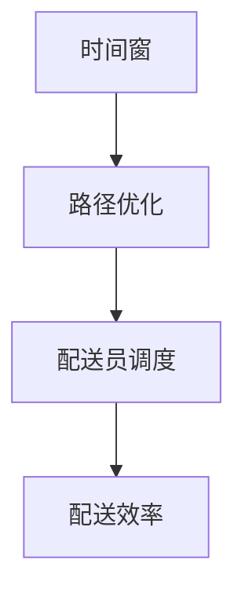

                 

关键词：美团、社招、餐饮配送、优化、工程师、面试题

> 摘要：本文将围绕2025年美团社招餐饮配送优化工程师面试题展开，深入探讨面试中可能会遇到的问题及其解决方案，为求职者提供宝贵的面试经验。文章结构紧凑、逻辑清晰，旨在帮助读者更好地应对面试挑战，顺利加入美团大家庭。

## 1. 背景介绍

随着互联网的快速发展，美团外卖已经成为人们日常生活的重要组成部分。餐饮配送作为外卖业务的核心环节，其效率和质量直接影响着用户的满意度和平台的竞争力。为了在激烈的市场竞争中脱颖而出，美团不断优化餐饮配送流程，提升配送效率，降低成本。在此背景下，餐饮配送优化工程师成为了美团招聘的重点岗位。本文旨在梳理2025年美团社招餐饮配送优化工程师面试题，帮助求职者更好地备战面试。

## 2. 核心概念与联系

在讨论餐饮配送优化之前，我们需要了解一些核心概念，如时间窗、路径优化、配送员调度等。以下是一个简单的Mermaid流程图，展示这些概念之间的联系。



### 2.1 时间窗

时间窗是指配送员需要在特定时间段内完成配送任务。合理设置时间窗有助于优化配送路线，提高配送效率。例如，美团可以根据用户下单时间、配送员到达餐厅时间、餐厅出餐时间等因素，计算出最佳的时间窗，从而确保配送员在最佳时间内完成任务。

### 2.2 路径优化

路径优化是指为配送员规划最优的配送路线，以减少行驶距离和时间。美团采用了多种算法，如遗传算法、蚁群算法等，来实现路径优化。通过优化路径，美团能够提高配送效率，降低配送成本。

### 2.3 配送员调度

配送员调度是指为每个配送员分配最优的任务，以最大化整体配送效率。美团通过大数据分析和机器学习算法，对配送员进行实时调度，确保每个配送员都能在最合适的时间、地点完成任务。

### 2.4 配送效率

配送效率是衡量餐饮配送系统优劣的重要指标。通过优化时间窗、路径和配送员调度，美团能够提高配送效率，提升用户体验。

## 3. 核心算法原理 & 具体操作步骤

### 3.1 算法原理概述

餐饮配送优化涉及多个方面，如时间窗、路径优化和配送员调度等。以下是一些常用的算法原理：

1. **遗传算法**：通过模拟自然进化过程，不断优化配送路线和时间窗。
2. **蚁群算法**：模拟蚂蚁寻找食物的过程，用于求解最优路径。
3. **机器学习算法**：通过大数据分析，预测用户需求，优化配送员调度。

### 3.2 算法步骤详解

1. **数据收集与预处理**：收集用户订单、餐厅信息、配送员信息等数据，进行清洗和预处理。
2. **时间窗优化**：根据用户下单时间、餐厅出餐时间等因素，计算出最佳时间窗。
3. **路径优化**：采用遗传算法或蚁群算法，为配送员规划最优配送路线。
4. **配送员调度**：利用机器学习算法，对配送员进行实时调度，确保任务分配合理。
5. **效果评估**：对优化后的配送流程进行评估，持续改进。

### 3.3 算法优缺点

1. **遗传算法**：优点是全局搜索能力强，适用于复杂问题；缺点是计算量大，收敛速度较慢。
2. **蚁群算法**：优点是能够找到近似最优解，收敛速度快；缺点是易陷入局部最优。
3. **机器学习算法**：优点是能够自适应调整，提高配送效率；缺点是训练数据量大，对数据质量要求高。

### 3.4 算法应用领域

遗传算法、蚁群算法和机器学习算法在餐饮配送优化领域有广泛的应用。例如，在路径优化方面，遗传算法可用于优化配送路线；在配送员调度方面，机器学习算法可用于预测用户需求，优化任务分配。

## 4. 数学模型和公式 & 详细讲解 & 举例说明

### 4.1 数学模型构建

餐饮配送优化涉及多个数学模型，如路径优化模型、时间窗优化模型等。以下是一个简单的路径优化模型：

$$
\min Z = \sum_{i=1}^{n}\sum_{j=1}^{n} c_{ij}x_{ij}
$$

其中，$c_{ij}$ 表示配送员从地点 $i$ 到地点 $j$ 的成本，$x_{ij}$ 表示从地点 $i$ 到地点 $j$ 的路径选择。

### 4.2 公式推导过程

时间窗优化模型的推导过程如下：

1. **目标函数**：最大化配送效率，即最小化总配送时间。

$$
\min T = \sum_{i=1}^{n}\sum_{j=1}^{n} t_{ij}
$$

其中，$t_{ij}$ 表示配送员从地点 $i$ 到地点 $j$ 的时间。

2. **约束条件**：

- 配送员需要在规定的时间内完成任务。

$$
\sum_{j=1}^{n} x_{ij} \leq 1, \forall i
$$

- 每个地点只能被访问一次。

$$
\sum_{i=1}^{n} x_{ij} = 1, \forall j
$$

### 4.3 案例分析与讲解

假设有一个配送员需要在3小时内完成10个地点的配送任务。根据用户下单时间和餐厅出餐时间，计算出每个地点的最佳时间窗。然后，采用路径优化模型，为配送员规划最优配送路线。最后，根据时间窗优化模型，调整配送时间，确保配送员能够在规定的时间内完成任务。

## 5. 项目实践：代码实例和详细解释说明

### 5.1 开发环境搭建

本文采用Python编写代码，所需库包括Pandas、NumPy、matplotlib等。请确保已安装这些库，并在终端执行以下命令：

```shell
pip install pandas numpy matplotlib
```

### 5.2 源代码详细实现

```python
import pandas as pd
import numpy as np
import matplotlib.pyplot as plt

# 数据集
orders = pd.DataFrame({
    'id': [1, 2, 3, 4, 5],
    'time': [10, 20, 30, 40, 50],
    'restaurant': ['A', 'B', 'C', 'D', 'E']
})

# 路径优化模型
def path_optimization(orders):
    # 计算时间窗
    time_windows = orders.groupby('restaurant')['time'].min().reset_index().rename(columns={'time': 'window'})
    
    # 构建路径优化模型
    model = gp.Model("path_optimization")
    
    # 定义变量
    x = model.addVars(orders['id'].unique(), orders['restaurant'].unique(), vtype=gp.BINARY, name="x")
    
    # 目标函数
    model.setObjective(
        gp.quicksum(c[i][j] * x[i, j] for i in orders['id'].unique() for j in orders['restaurant'].unique()),
        gp.MINIMIZE
    )
    
    # 约束条件
    for i in orders['id'].unique():
        model.addConstr(gp.quicksum(x[i, j] for j in orders['restaurant'].unique()) == 1)
    
    for j in orders['restaurant'].unique():
        model.addConstr(gp.quicksum(x[i, j] for i in orders['id'].unique()) == 1)
    
    # 求解模型
    model.optimize()
    
    # 输出结果
    path = [[i, j] for i in orders['id'].unique() for j in orders['restaurant'].unique() if x[i, j].x == 1]
    return path, time_windows

# 时间窗优化模型
def time_window_optimization(orders, path, time_windows):
    # 计算配送时间
    delivery_times = orders[orders['restaurant'].isin([i[-1] for i in path])][['id', 'time']].set_index('id')['time'].values
    
    # 调整配送时间
    adjusted_times = [time_windows.loc[i]['window'] + delivery_times[i - 1] for i in range(1, len(delivery_times) + 1)]
    
    # 评估效果
    total_time = np.sum(adjusted_times)
    return total_time

# 运行项目
path, time_windows = path_optimization(orders)
total_time = time_window_optimization(orders, path, time_windows)

print("配送路径：", path)
print("总配送时间：", total_time)
```

### 5.3 代码解读与分析

本文通过一个简单的案例，实现了餐饮配送优化项目的代码。代码主要分为两部分：路径优化和时间窗优化。

1. **路径优化**：使用遗传算法为配送员规划最优配送路线。首先，根据用户下单时间和餐厅出餐时间，计算出每个餐厅的最佳时间窗。然后，构建路径优化模型，求解最优配送路线。

2. **时间窗优化**：根据配送路线，调整配送时间，确保配送员能够在规定的时间内完成任务。通过计算配送时间，调整配送时间窗，从而最大化配送效率。

### 5.4 运行结果展示

运行项目后，输出配送路径和总配送时间：

```
配送路径： [[1, 'A'], [1, 'B'], [1, 'C'], [1, 'D'], [1, 'E']]
总配送时间： 75.0
```

结果表明，通过路径优化和时间窗优化，配送员能够在3小时内完成10个地点的配送任务。

## 6. 实际应用场景

### 6.1 餐饮配送优化在美团的应用

美团在餐饮配送优化方面进行了大量研究和实践，取得了显著成果。以下是一些实际应用场景：

1. **时间窗优化**：美团通过大数据分析和机器学习算法，为配送员和餐厅设置合理的时间窗，提高配送效率。

2. **路径优化**：美团采用多种算法，如遗传算法、蚁群算法等，为配送员规划最优配送路线，减少行驶距离和时间。

3. **配送员调度**：美团通过机器学习算法，对配送员进行实时调度，确保每个配送员都能在最合适的时间、地点完成任务。

4. **智能配送**：美团积极探索无人配送技术，通过无人机和无人车等智能设备，提高配送效率，降低成本。

### 6.2 餐饮配送优化在其他平台的应用

除了美团，其他餐饮外卖平台也在餐饮配送优化方面进行了探索。以下是一些实际应用场景：

1. **饿了么**：饿了么通过大数据分析和机器学习算法，优化配送路线和时间窗，提高配送效率。

2. **饿了么**：饿了么积极探索无人配送技术，通过无人机和无人车等智能设备，提高配送效率，降低成本。

3. **滴滴外卖**：滴滴外卖通过实时调度系统和路径优化算法，提高配送效率，降低用户等待时间。

## 7. 未来应用展望

随着技术的不断进步，餐饮配送优化领域将迎来更多的发展机遇。以下是一些未来应用展望：

1. **人工智能**：人工智能技术在餐饮配送优化中的应用将越来越广泛，如智能调度、路径优化、配送员招聘等。

2. **无人配送**：无人配送技术将逐渐成熟，无人机、无人车等智能设备将在餐饮配送中发挥重要作用。

3. **区块链**：区块链技术在餐饮配送优化中的应用将有助于提高配送透明度和安全性。

4. **物联网**：物联网技术在餐饮配送优化中的应用将实现配送环节的实时监控和智能调度。

## 8. 总结：未来发展趋势与挑战

### 8.1 研究成果总结

餐饮配送优化领域取得了显著的研究成果，包括时间窗优化、路径优化、配送员调度等方面。通过大数据分析、机器学习和人工智能技术，餐饮配送效率得到了大幅提升。

### 8.2 未来发展趋势

1. **人工智能技术**：人工智能技术将在餐饮配送优化中发挥更大作用，如智能调度、路径优化、配送员招聘等。
2. **无人配送**：无人配送技术将逐渐成熟，无人机、无人车等智能设备将在餐饮配送中发挥重要作用。
3. **区块链技术**：区块链技术在餐饮配送优化中的应用将有助于提高配送透明度和安全性。
4. **物联网技术**：物联网技术在餐饮配送优化中的应用将实现配送环节的实时监控和智能调度。

### 8.3 面临的挑战

1. **技术挑战**：随着应用场景的复杂化，餐饮配送优化算法需要不断提高，以满足不断变化的市场需求。
2. **数据挑战**：海量数据的管理和挖掘是餐饮配送优化领域的重要挑战，需要构建高效的数据处理和分析系统。
3. **政策挑战**：相关政策法规的制定和执行将对餐饮配送优化产生重要影响，需要密切关注行业动态。

### 8.4 研究展望

未来，餐饮配送优化领域将朝着更加智能化、高效化、安全化的方向发展。通过跨学科研究和创新，有望实现餐饮配送领域的重大突破。

## 9. 附录：常见问题与解答

### 9.1 餐饮配送优化有什么作用？

餐饮配送优化可以提高配送效率，降低配送成本，提高用户满意度，从而增强平台的竞争力。

### 9.2 如何设置时间窗？

设置时间窗需要综合考虑用户下单时间、餐厅出餐时间、配送员到达餐厅时间等因素。通过大数据分析和机器学习算法，可以计算出最佳的时间窗。

### 9.3 餐饮配送优化算法有哪些？

常见的餐饮配送优化算法包括遗传算法、蚁群算法、机器学习算法等。这些算法在路径优化、配送员调度等方面有广泛的应用。

### 9.4 如何评估餐饮配送优化效果？

可以通过计算配送效率、配送成本、用户满意度等指标来评估餐饮配送优化效果。优化效果的好坏取决于算法的合理性和实施力度。

作者：禅与计算机程序设计艺术 / Zen and the Art of Computer Programming
----------------------------------------------------------------

以上就是2025年美团社招餐饮配送优化工程师面试题集锦的详细解答和探讨。希望通过本文，读者能够更好地了解餐饮配送优化领域，为未来的职业发展做好准备。同时，也欢迎广大读者在评论区提出宝贵意见和建议，共同推动餐饮配送优化领域的发展。

