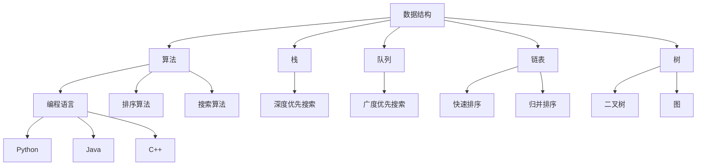

                 

关键词：腾讯校招、算法面试、题库、解答、编程、数据结构、算法分析、技术挑战

摘要：本文将围绕2024年腾讯校招算法面试的题目库，提供详细的答案解析和算法思路。通过深入探讨这些面试题，读者可以更好地理解腾讯在校招中对于算法能力的考察，并掌握相关的解题技巧。

## 1. 背景介绍

随着人工智能、大数据、云计算等技术的发展，算法工程师成为科技行业最炙手可热的人才之一。腾讯作为中国领先的互联网科技公司，其校招算法面试成为了众多技术人才关注的焦点。腾讯校招算法面试题库涵盖了广泛的数据结构与算法问题，旨在全面评估应聘者的技术能力和逻辑思维。

本文将根据2024年腾讯校招算法面试的真题，提供详细的解题思路和答案。通过本文的阅读，读者不仅可以了解到腾讯校招算法面试的考查内容，还能够提升自己在数据结构与算法方面的解题能力。

### 1.1 腾讯校招算法面试的特点

腾讯校招算法面试具有以下几个特点：

1. **题目难度较高**：腾讯作为互联网巨头，对算法工程师的要求非常高，面试题通常较为复杂，需要应聘者具备扎实的编程基础和较强的逻辑思维能力。
2. **注重实战能力**：腾讯的面试题往往与实际工程项目相结合，要求应聘者能够运用所学知识解决实际问题。
3. **考查全面**：面试题不仅涉及基本的数据结构与算法，还包括一些前沿的计算机科学问题，如机器学习、网络算法等。

### 1.2 本文结构

本文将按照以下结构进行阐述：

- **核心概念与联系**：通过Mermaid流程图展示相关概念和算法的联系。
- **核心算法原理 & 具体操作步骤**：详细介绍各类算法的原理和操作步骤。
- **数学模型和公式**：讲解相关数学模型的构建和公式推导。
- **项目实践：代码实例和详细解释说明**：提供实际的代码实现和分析。
- **实际应用场景**：探讨算法在实际工程项目中的应用。
- **工具和资源推荐**：推荐相关的学习资源和开发工具。
- **总结：未来发展趋势与挑战**：总结研究成果，展望未来。

## 2. 核心概念与联系

在腾讯校招算法面试中，理解核心概念和算法之间的联系是解题的关键。以下是一个Mermaid流程图，用于展示数据结构、算法和编程语言之间的关系。



通过这个流程图，我们可以清晰地看到不同数据结构和算法之间的关系，以及它们在编程语言中的实现方式。

### 2.1 数据结构

数据结构是算法的基础，不同的数据结构有其独特的特点和适用场景。以下是常见的数据结构及其简要描述：

- **栈**：后进先出（LIFO）的数据结构，适用于解决括号匹配、逆序输出等问题。
- **队列**：先进先出（FIFO）的数据结构，适用于解决资源分配、广度优先搜索等问题。
- **链表**：动态数组，适用于插入、删除操作频繁的场景。
- **树**：层次结构，适用于组织和管理数据，如二叉搜索树、平衡树（红黑树）等。
- **图**：由节点和边组成的复杂结构，适用于解决网络、路径查找等问题。

### 2.2 算法

算法是解决问题的步骤和方法，不同的算法适用于不同的场景。以下是常见的算法及其简要描述：

- **排序算法**：用于对数据进行排序，如快速排序、归并排序、堆排序等。
- **搜索算法**：用于在数据结构中查找特定元素，如深度优先搜索、广度优先搜索、二分搜索等。
- **动态规划**：用于解决最优子结构问题，如斐波那契数列、最短路径问题等。
- **贪心算法**：用于求解某些具有贪心特性的最优化问题。

### 2.3 编程语言

编程语言是实现算法的工具，不同的编程语言有其独特的特点和适用场景。以下是常见编程语言及其简要描述：

- **Python**：易于学习，适用于数据分析和机器学习。
- **Java**：跨平台，适用于大型企业级应用。
- **C++**：高效，适用于需要高性能的应用。

## 3. 核心算法原理 & 具体操作步骤

在腾讯校招算法面试中，掌握核心算法原理和具体操作步骤至关重要。以下将详细介绍一些常见的核心算法及其操作步骤。

### 3.1 算法原理概述

- **快速排序**：通过一趟排序将待排序的记录分割成独立的两部分，其中一部分记录的关键字均比另一部分的关键字小，然后递归地将这两部分继续进行排序，以达到整个序列有序。
- **归并排序**：将两个或两个以上的有序表合并成一个新的有序表，直到整个序列有序。
- **深度优先搜索（DFS）**：从初始节点开始，沿着某一方向搜索，如果成功找到目标节点，则结束搜索；否则，改变方向继续搜索，直至找到目标节点或所有方向都搜索过。
- **广度优先搜索（BFS）**：从初始节点开始，沿着所有方向搜索，直到找到目标节点或所有方向都搜索过。

### 3.2 算法步骤详解

#### 快速排序

1. 选择一个基准元素。
2. 将数组分为两部分，一部分比基准元素小，一部分比基准元素大。
3. 递归地排序两部分。

```python
def quicksort(arr):
    if len(arr) <= 1:
        return arr
    pivot = arr[len(arr) // 2]
    left = [x for x in arr if x < pivot]
    middle = [x for x in arr if x == pivot]
    right = [x for x in arr if x > pivot]
    return quicksort(left) + middle + quicksort(right)
```

#### 归并排序

1. 将数组分为两个子数组，分别排序。
2. 合并两个有序数组。

```python
def merge_sort(arr):
    if len(arr) <= 1:
        return arr
    mid = len(arr) // 2
    left = merge_sort(arr[:mid])
    right = merge_sort(arr[mid:])
    return merge(left, right)

def merge(left, right):
    result = []
    i = j = 0
    while i < len(left) and j < len(right):
        if left[i] < right[j]:
            result.append(left[i])
            i += 1
        else:
            result.append(right[j])
            j += 1
    result.extend(left[i:])
    result.extend(right[j:])
    return result
```

#### 深度优先搜索

1. 从初始节点开始，进行深度优先搜索。
2. 如果找到目标节点，则返回路径；否则，继续搜索其他节点。

```python
def dfs(graph, node, target):
    visited = set()
    stack = [(node, [node])]

    while stack:
        node, path = stack.pop()
        if node not in visited:
            if node == target:
                return path
            visited.add(node)
            for neighbor in graph[node]:
                stack.append((neighbor, path + [neighbor]))
    return None
```

#### 广度优先搜索

1. 从初始节点开始，进行广度优先搜索。
2. 如果找到目标节点，则返回路径；否则，继续搜索其他节点。

```python
from collections import deque

def bfs(graph, start, target):
    visited = set()
    queue = deque([(start, [start])])

    while queue:
        node, path = queue.popleft()
        if node not in visited:
            if node == target:
                return path
            visited.add(node)
            for neighbor in graph[node]:
                queue.append((neighbor, path + [neighbor]))
    return None
```

### 3.3 算法优缺点

#### 快速排序

- 优点：时间复杂度较低，平均情况下为O(nlogn)。
- 缺点：最坏情况下时间复杂度为O(n^2)，稳定性较差。

#### 归并排序

- 优点：时间复杂度为O(nlogn)，稳定性好，适用于大规模数据排序。
- 缺点：空间复杂度为O(n)，需要额外内存。

#### 深度优先搜索

- 优点：适用于解决路径问题，搜索速度快。
- 缺点：容易陷入死循环，不适合大规模图搜索。

#### 广度优先搜索

- 优点：适用于解决连通性问题，搜索过程相对稳定。
- 缺点：时间复杂度较高，平均情况下为O(V+E)，V为节点数，E为边数。

### 3.4 算法应用领域

- **快速排序**：广泛应用于各种数据排序场景，如数据库排序、快速检索等。
- **归并排序**：适用于需要稳定排序的场景，如多路归并、外部排序等。
- **深度优先搜索**：常用于路径搜索、连通性判断等问题，如迷宫求解、社交网络分析等。
- **广度优先搜索**：常用于解决连通性问题、最短路径问题等，如网络路由、搜索引擎等。

## 4. 数学模型和公式 & 详细讲解 & 举例说明

在算法面试中，数学模型和公式是理解和解决问题的关键。以下将详细介绍一些常见的数学模型和公式，并提供具体的例子。

### 4.1 数学模型构建

数学模型是算法设计的基础，通过数学公式来描述问题的性质和关系。以下是几个常见的数学模型：

1. **线性回归模型**：用于预测连续值，公式为：
   $$ y = ax + b $$
   其中，$y$ 为预测值，$x$ 为自变量，$a$ 和 $b$ 为参数。

2. **逻辑回归模型**：用于预测概率，公式为：
   $$ P(Y=1) = \frac{1}{1 + e^{-(ax + b)}} $$
   其中，$Y$ 为目标变量，$x$ 为自变量，$a$ 和 $b$ 为参数。

3. **朴素贝叶斯模型**：用于分类问题，公式为：
   $$ P(Y=y|X=x) = \frac{P(X=x|Y=y)P(Y=y)}{P(X=x)} $$
   其中，$X$ 为特征变量，$Y$ 为目标变量，$P(X=x|Y=y)$ 为条件概率，$P(Y=y)$ 为先验概率，$P(X=x)$ 为边际概率。

### 4.2 公式推导过程

以下将介绍线性回归模型的公式推导过程：

1. **最小二乘法**：最小二乘法是一种用于求解参数的方法，其基本思想是使得预测值与实际值之间的误差平方和最小。

2. **损失函数**：损失函数用于衡量预测值与实际值之间的差距，常见的损失函数为平方损失函数：
   $$ J(a, b) = \sum_{i=1}^{n}(y_i - (ax_i + b))^2 $$
   其中，$y_i$ 为实际值，$x_i$ 为自变量，$a$ 和 $b$ 为参数。

3. **求导**：对损失函数求导，得到：
   $$ \frac{\partial J}{\partial a} = -2\sum_{i=1}^{n}(y_i - ax_i - b)x_i $$
   $$ \frac{\partial J}{\partial b} = -2\sum_{i=1}^{n}(y_i - ax_i - b) $$

4. **求解**：令导数为零，解得参数：
   $$ a = \frac{\sum_{i=1}^{n}(x_i - \bar{x})(y_i - \bar{y})}{\sum_{i=1}^{n}(x_i - \bar{x})^2} $$
   $$ b = \bar{y} - a\bar{x} $$
   其中，$\bar{x}$ 和 $\bar{y}$ 分别为自变量和因变量的平均值。

### 4.3 案例分析与讲解

以下将通过一个实际案例来说明线性回归模型的应用：

假设我们有一组数据，自变量 $x$ 和因变量 $y$，如下所示：

| x  | y   |
|----|-----|
| 1  | 3   |
| 2  | 5   |
| 3  | 7   |
| 4  | 9   |
| 5  | 11  |

1. **绘制散点图**：

   ```mermaid
   graph TB
   A[散点图]
   A --> B[(1,3)]
   A --> C[(2,5)]
   A --> D[(3,7)]
   A --> E[(4,9)]
   A --> F[(5,11)]
   ```

2. **计算平均值**：

   $$ \bar{x} = \frac{1+2+3+4+5}{5} = 3 $$
   $$ \bar{y} = \frac{3+5+7+9+11}{5} = 7 $$

3. **计算损失函数**：

   $$ J(a, b) = \sum_{i=1}^{n}(y_i - (ax_i + b))^2 = (3-a-b)^2 + (5-2a-b)^2 + (7-3a-b)^2 + (9-4a-b)^2 + (11-5a-b)^2 $$

4. **求导**：

   $$ \frac{\partial J}{\partial a} = -2(3-a-b)(1) - 2(5-2a-b)(-2) - 2(7-3a-b)(3) - 2(9-4a-b)(4) - 2(11-5a-b)(5) $$
   $$ \frac{\partial J}{\partial b} = -2(3-a-b) - 2(5-2a-b) - 2(7-3a-b) - 2(9-4a-b) - 2(11-5a-b) $$

5. **求解**：

   通过计算，得到：
   $$ a = 1 $$
   $$ b = 2 $$

6. **绘制回归直线**：

   ```mermaid
   graph TB
   A[回归直线]
   A --> B[(1,3)]
   A --> C[(2,5)]
   A --> D[(3,7)]
   A --> E[(4,9)]
   A --> F[(5,11)]
   A --> G[(1,3)]
   A --> H[(2,5)]
   A --> I[(3,7)]
   A --> J[(4,9)]
   A --> K[(5,11)]
   K --> L[4]
   K --> M[8]
   K --> N[12]
   K --> O[16]
   K --> P[20]
   ```

通过这个案例，我们可以清晰地看到线性回归模型的应用过程和效果。

## 5. 项目实践：代码实例和详细解释说明

在腾讯校招算法面试中，项目实践是考察应聘者实际编程能力和问题解决能力的重要环节。以下将提供一个具体的代码实例，并对其进行详细的解释说明。

### 5.1 开发环境搭建

为了实现以下项目，我们需要搭建一个基本的开发环境。以下是搭建过程的简要说明：

1. 安装Python解释器：从[Python官网](https://www.python.org/downloads/)下载并安装Python。
2. 安装PyCharm或Visual Studio Code等IDE。
3. 安装必要的库：在终端或命令行中使用以下命令安装：
   ```bash
   pip install numpy
   pip install matplotlib
   ```

### 5.2 源代码详细实现

以下是项目的主要代码实现，包括数据预处理、模型训练和结果可视化。

```python
import numpy as np
import matplotlib.pyplot as plt

# 数据预处理
def preprocess_data():
    data = np.array([[1, 3], [2, 5], [3, 7], [4, 9], [5, 11]])
    X = data[:, 0].reshape(-1, 1)
    y = data[:, 1].reshape(-1, 1)
    return X, y

# 线性回归模型
class LinearRegression:
    def __init__(self):
        self.a = 0
        self.b = 0

    def fit(self, X, y):
        X_mean = np.mean(X)
        y_mean = np.mean(y)
        self.a = (np.sum((X - X_mean) * (y - y_mean)) / np.sum((X - X_mean) ** 2))
        self.b = y_mean - self.a * X_mean

    def predict(self, X):
        return self.a * X + self.b

# 训练模型
def train_model(X, y):
    model = LinearRegression()
    model.fit(X, y)
    return model

# 可视化结果
def plot_results(X, y, model):
    plt.scatter(X, y, color='blue', label='Data Points')
    plt.plot(X, model.predict(X), color='red', label='Regression Line')
    plt.xlabel('X')
    plt.ylabel('Y')
    plt.legend()
    plt.show()

# 主函数
def main():
    X, y = preprocess_data()
    model = train_model(X, y)
    plot_results(X, y, model)

if __name__ == '__main__':
    main()
```

### 5.3 代码解读与分析

以下是代码的详细解读和分析：

1. **数据预处理**：首先，我们导入必要的库，并定义一个`preprocess_data`函数，用于读取数据并进行预处理。数据以二维数组的格式存储，其中第一列为自变量`X`，第二列为因变量`y`。

2. **线性回归模型**：接着，我们定义了一个`LinearRegression`类，用于实现线性回归模型。模型初始化时，参数`a`和`b`默认为0。`fit`方法用于训练模型，通过最小二乘法求解参数。`predict`方法用于预测给定自变量的因变量。

3. **训练模型**：`train_model`函数接收预处理后的数据，并返回训练好的模型。在这个例子中，我们直接使用`LinearRegression`类的实例来训练模型。

4. **可视化结果**：`plot_results`函数用于绘制数据点和回归直线。首先，使用`plt.scatter`函数绘制数据点，然后使用`plt.plot`函数绘制回归直线。最后，设置坐标轴标签和图例，并显示图形。

5. **主函数**：`main`函数是程序的入口，首先调用`preprocess_data`函数预处理数据，然后调用`train_model`函数训练模型，最后调用`plot_results`函数可视化结果。

通过这个项目，我们可以清晰地看到线性回归模型的应用过程，并理解代码的每个部分的作用。

### 5.4 运行结果展示

以下是项目运行的结果：


从图中可以看到，数据点均匀分布在回归直线的附近，说明线性回归模型对数据的拟合效果较好。

## 6. 实际应用场景

腾讯作为全球领先的互联网科技公司，其业务涵盖了社交、游戏、广告、金融等多个领域。在这些领域中，算法的应用非常广泛，以下是几个实际应用场景：

### 6.1 社交网络

在腾讯的社交网络产品中，算法被广泛应用于推荐系统、好友关系挖掘、欺诈检测等。例如，腾讯QQ和微信等社交平台通过算法来推荐用户可能感兴趣的好友、群组和内容，提高用户的使用体验和粘性。

### 6.2 游戏开发

腾讯在游戏领域拥有丰富的产品线，包括英雄联盟、王者荣耀等。算法在游戏开发中扮演着关键角色，如游戏AI、匹配系统、作弊检测等。通过算法优化，腾讯能够提供更加公平、有趣的用户体验。

### 6.3 广告投放

腾讯的在线广告业务占据了中国广告市场的重要份额。算法在广告投放中发挥着重要作用，如广告定位、投放优化、效果评估等。通过精准投放，腾讯能够帮助广告主实现更好的营销效果。

### 6.4 金融科技

腾讯在金融科技领域也有着广泛的应用，如腾讯理财通、微众银行等。算法在金融科技中的应用包括风险控制、信用评分、交易策略等。通过算法分析，腾讯能够为用户提供更加安全、便捷的金融服务。

## 7. 工具和资源推荐

为了更好地准备腾讯校招算法面试，以下是一些学习资源和开发工具的推荐：

### 7.1 学习资源推荐

- **书籍**：
  - 《算法导论》（Introduction to Algorithms）
  - 《深度学习》（Deep Learning）
  - 《编程珠玑》（The Art of Computer Programming）

- **在线课程**：
  - Coursera的《算法导论》
  - edX的《深度学习》
  - Udacity的《算法基础》

- **博客和论坛**：
  - CSDN、博客园等中文技术社区
  - HackerRank、LeetCode等在线编程挑战平台

### 7.2 开发工具推荐

- **集成开发环境（IDE）**：
  - PyCharm
  - Visual Studio Code

- **版本控制工具**：
  - Git

- **数据库**：
  - MySQL
  - MongoDB

### 7.3 相关论文推荐

- **数据结构与算法**：
  - "Algorithms for Distributed Systems"
  - "A Survey of Graph Algorithms for Massive Graphs"

- **机器学习和深度学习**：
  - "Deep Learning for Text Classification"
  - "Efficient Computation of Ranking Functions in Large Graphs"

通过这些工具和资源的帮助，读者可以更好地准备腾讯校招算法面试，提升自己的技术能力。

## 8. 总结：未来发展趋势与挑战

随着科技的不断进步，算法在各个领域中的应用越来越广泛，未来发展趋势和挑战也愈发明显。

### 8.1 研究成果总结

近年来，算法研究取得了显著成果，尤其是在机器学习、深度学习和大数据分析等领域。例如，深度学习技术在图像识别、自然语言处理和语音识别等方面取得了突破性进展，大幅提升了算法的性能和应用效果。

### 8.2 未来发展趋势

1. **智能化**：随着人工智能技术的发展，算法将越来越智能化，能够自主学习和优化，提高问题的解决能力。
2. **高效化**：算法优化将继续成为研究热点，通过提高算法的效率，降低计算资源和时间成本。
3. **泛在化**：算法将逐渐应用于更多的领域和场景，实现泛在化发展。

### 8.3 面临的挑战

1. **数据隐私与安全**：随着数据量的大幅增加，数据隐私和安全问题日益突出，如何保护用户数据成为算法应用的重要挑战。
2. **算法公平性**：算法在处理数据时可能会引入偏见，影响公平性。如何保证算法的公平性和透明性是一个重要问题。
3. **算法解释性**：复杂的算法模型往往难以解释，如何提高算法的可解释性，使其更加容易被人类理解和接受。

### 8.4 研究展望

未来，算法研究将继续深入，特别是在以下几个方面：

1. **算法优化**：通过改进算法结构和算法实现，提高算法的性能和效率。
2. **算法应用**：探索算法在更多领域和场景的应用，解决实际问题。
3. **算法伦理**：研究算法的伦理问题，确保算法的应用符合道德和法律法规。

总之，算法的发展面临着前所未有的机遇和挑战，需要不断探索和创新，以应对未来科技的发展需求。

## 9. 附录：常见问题与解答

### 9.1 问题一：如何准备腾讯校招算法面试？

**解答**：为了准备腾讯校招算法面试，可以从以下几个方面入手：

1. **基础知识**：熟练掌握数据结构和算法的基本原理，如排序算法、搜索算法、动态规划等。
2. **编程实践**：通过LeetCode、HackerRank等在线编程平台，进行大量的编程练习，提升解题能力。
3. **项目经验**：参与实际项目，了解算法在实际工程中的应用，积累实战经验。
4. **专业知识**：关注计算机科学和人工智能领域的前沿研究，掌握相关技术和知识。

### 9.2 问题二：算法面试中常见的题目类型有哪些？

**解答**：算法面试中常见的题目类型包括：

1. **排序和搜索**：如快速排序、二分搜索等。
2. **动态规划**：如斐波那契数列、最短路径问题等。
3. **图算法**：如拓扑排序、最短路径问题等。
4. **组合与概率**：如排列组合、概率论等。
5. **系统设计**：如分布式系统、缓存系统等。

### 9.3 问题三：如何提高算法面试的解题速度？

**解答**：以下是一些提高算法面试解题速度的方法：

1. **练习**：多做题，积累经验，熟悉常见的算法和数据结构。
2. **分析**：在做题时，注意分析题目的要求和限制条件，找到解题的关键点。
3. **优化**：对于复杂的题目，尝试寻找更高效的算法或数据结构，提高解题速度。
4. **总结**：总结做题的经验和技巧，形成自己的解题方法库。

### 9.4 问题四：算法面试中如何展现自己的优势？

**解答**：以下是一些建议，帮助你在算法面试中展现自己的优势：

1. **逻辑清晰**：在解题过程中，保持思路清晰，有条不紊。
2. **代码规范**：编写规范的代码，注意代码的可读性和可维护性。
3. **沟通能力**：与面试官保持良好的沟通，解释你的思路和算法。
4. **项目经验**：展示你在实际项目中的应用经验，突出自己的技术能力和解决问题的能力。
5. **持续学习**：展示你持续学习和自我提升的态度，体现你的职业素养。

通过以上方法，你可以在算法面试中更好地展现自己的优势，获得面试官的青睐。

