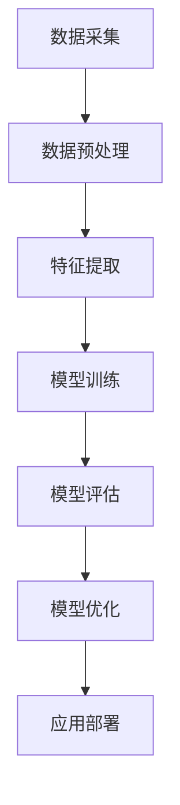
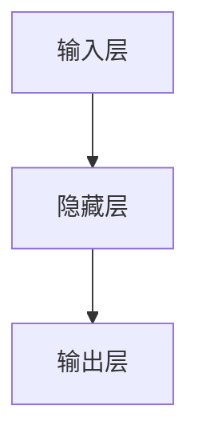
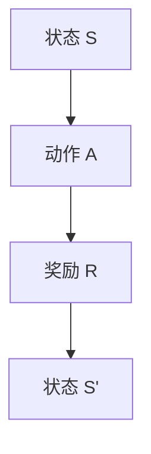
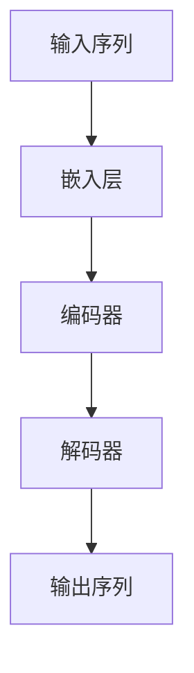
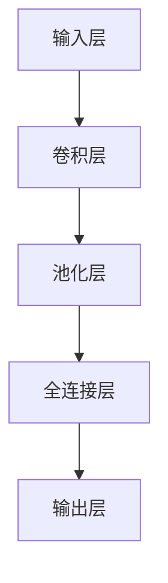
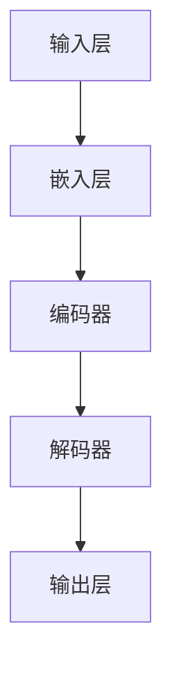

                 

关键词：人工智能、AI 2.0、开发工具、效率、优化

摘要：本文将深入探讨 AI 2.0 应用的开发效率问题，重点分析现有的开发工具，介绍如何通过这些工具提高 AI 2.0 应用开发的效率，并提供实际项目实践和未来应用展望。

## 1. 背景介绍

随着深度学习和大数据技术的快速发展，人工智能（AI）正在迅速改变我们的生活方式。AI 2.0，作为人工智能的下一个重要阶段，不仅涉及到更为复杂和智能的算法，还涉及到大规模数据处理、实时学习和自动化优化等方面。然而，AI 2.0 的应用开发过程充满了挑战，需要高效的工具和方法来提高开发效率。

### 1.1 AI 2.0 的定义与特点

AI 2.0 是指基于深度学习、强化学习、自然语言处理等新技术的人工智能系统，它具有以下特点：

- **高度智能化**：AI 2.0 可以自主学习和适应环境，具备更高层次的智能。
- **大规模数据处理**：AI 2.0 需要处理大量数据，对数据处理能力提出了更高要求。
- **实时学习和优化**：AI 2.0 能够实时学习用户行为，并进行自我优化。
- **自动化**：AI 2.0 能够自动化完成许多复杂任务，提高生产效率。

### 1.2 AI 2.0 开发面临的挑战

尽管 AI 2.0 拥有众多优势，但其应用开发过程仍然面临诸多挑战：

- **算法复杂度**：AI 2.0 的算法复杂度较高，需要高效的算法实现和优化。
- **数据依赖性**：AI 2.0 对数据依赖性很强，数据质量和数量直接影响模型性能。
- **计算资源**：AI 2.0 需要大量的计算资源，对硬件设施有较高要求。
- **开发难度**：AI 2.0 开发涉及到多学科交叉，开发难度较大。

## 2. 核心概念与联系

### 2.1 AI 2.0 开发的核心概念

在 AI 2.0 开发过程中，以下几个核心概念至关重要：

- **深度学习**：深度学习是一种基于多层神经网络的人工智能算法，能够自动从数据中提取特征。
- **强化学习**：强化学习是一种通过奖励机制来训练智能体的算法，适用于复杂环境。
- **自然语言处理**：自然语言处理是一种使计算机能够理解、生成和处理人类语言的技术。

### 2.2 AI 2.0 开发的整体架构

图 1 AI 2.0 开发整体架构



### 2.3 各核心概念之间的联系

深度学习、强化学习和自然语言处理是 AI 2.0 开发的核心组成部分，它们之间的联系如下：

- **深度学习**负责从数据中提取特征，为后续模型训练提供输入。
- **强化学习**在模型训练过程中引入奖励机制，使模型能够自主优化。
- **自然语言处理**负责处理人类语言，使 AI 2.0 能够理解和生成自然语言。

## 3. 核心算法原理 & 具体操作步骤

### 3.1 算法原理概述

在 AI 2.0 开发过程中，常用的核心算法包括深度学习、强化学习和自然语言处理等。以下分别介绍这些算法的基本原理。

#### 3.1.1 深度学习

深度学习是一种基于多层神经网络的人工智能算法，其核心思想是通过多层非线性变换将输入数据映射到输出。深度学习算法主要包括以下步骤：

1. **数据输入**：将输入数据送入神经网络。
2. **前向传播**：通过多层非线性变换将输入数据逐层传递。
3. **损失函数**：计算输出结果与实际结果之间的差距。
4. **反向传播**：根据损失函数计算梯度，并更新网络参数。
5. **迭代训练**：重复上述步骤，直到模型收敛。

#### 3.1.2 强化学习

强化学习是一种通过奖励机制来训练智能体的算法。其核心思想是智能体在环境中通过不断尝试，学会在给定状态下选择最优动作，以最大化累积奖励。强化学习算法主要包括以下步骤：

1. **状态观察**：智能体观察当前环境状态。
2. **动作选择**：智能体根据当前状态选择最优动作。
3. **环境反馈**：环境根据智能体选择的动作给出奖励。
4. **状态更新**：智能体更新状态，并重复上述步骤。

#### 3.1.3 自然语言处理

自然语言处理是一种使计算机能够理解、生成和处理人类语言的技术。其核心思想是通过一系列算法将自然语言转换为计算机可以处理的形式。自然语言处理算法主要包括以下步骤：

1. **分词**：将自然语言文本分解为词或词组。
2. **词性标注**：对文本中的每个词进行词性标注。
3. **句法分析**：分析文本的句法结构，确定词与词之间的关系。
4. **语义理解**：理解文本的语义含义，为后续任务提供支持。

### 3.2 算法步骤详解

#### 3.2.1 深度学习算法步骤

1. **数据输入**：从数据集导入训练数据，将数据分为输入和标签两部分。
2. **前向传播**：将输入数据送入神经网络，通过多层非线性变换得到输出。
3. **损失函数计算**：计算输出结果与实际结果之间的差距，使用损失函数进行量化。
4. **反向传播**：根据损失函数计算梯度，并更新网络参数。
5. **迭代训练**：重复上述步骤，直到模型收敛。

#### 3.2.2 强化学习算法步骤

1. **状态观察**：智能体观察当前环境状态。
2. **动作选择**：智能体根据当前状态选择最优动作。
3. **环境反馈**：环境根据智能体选择的动作给出奖励。
4. **状态更新**：智能体更新状态，并重复上述步骤。

#### 3.2.3 自然语言处理算法步骤

1. **分词**：将自然语言文本分解为词或词组。
2. **词性标注**：对文本中的每个词进行词性标注。
3. **句法分析**：分析文本的句法结构，确定词与词之间的关系。
4. **语义理解**：理解文本的语义含义，为后续任务提供支持。

### 3.3 算法优缺点

#### 3.3.1 深度学习

**优点**：

- **强大的表征能力**：深度学习能够自动从数据中提取特征，适应不同类型的数据。
- **灵活性**：深度学习可以应用于多种任务，如分类、回归和生成等。

**缺点**：

- **训练时间较长**：深度学习需要大量数据和时间进行训练。
- **对数据质量要求高**：数据质量直接影响模型性能。

#### 3.3.2 强化学习

**优点**：

- **适应性强**：强化学习能够通过与环境交互不断学习，适应复杂环境。
- **自主优化**：智能体可以通过奖励机制进行自我优化。

**缺点**：

- **训练时间较长**：强化学习需要大量时间进行训练。
- **对环境反馈要求高**：环境反馈的准确性直接影响模型性能。

#### 3.3.3 自然语言处理

**优点**：

- **处理能力强大**：自然语言处理能够处理人类语言的各种复杂结构。
- **应用广泛**：自然语言处理在智能客服、智能问答和机器翻译等领域有广泛应用。

**缺点**：

- **计算资源需求大**：自然语言处理需要大量计算资源。
- **对数据质量要求高**：数据质量直接影响模型性能。

### 3.4 算法应用领域

#### 3.4.1 深度学习

- **图像识别**：如人脸识别、物体识别等。
- **语音识别**：如语音助手、语音识别系统等。
- **自然语言处理**：如文本分类、情感分析等。

#### 3.4.2 强化学习

- **游戏开发**：如围棋、象棋等。
- **智能交通**：如自动驾驶、智能交通管理系统等。
- **机器人控制**：如机器人导航、机器人抓取等。

#### 3.4.3 自然语言处理

- **智能客服**：如客服机器人、智能问答系统等。
- **机器翻译**：如自动翻译、跨语言信息检索等。
- **文本挖掘**：如情感分析、关键词提取等。

## 4. 数学模型和公式 & 详细讲解 & 举例说明

### 4.1 数学模型构建

在 AI 2.0 开发过程中，常用的数学模型包括神经网络模型、强化学习模型和自然语言处理模型等。以下分别介绍这些模型的构建方法。

#### 4.1.1 神经网络模型

神经网络模型是一种基于多层感知器（MLP）的模型，其基本结构如图 2 所示。

图 2 神经网络模型结构



神经网络模型可以通过以下公式构建：

$$
Z = X \cdot W + b
$$

$$
A = \sigma(Z)
$$

其中，$Z$ 表示输入，$W$ 表示权重，$b$ 表示偏置，$\sigma$ 表示激活函数，如 sigmoid 函数或 ReLU 函数。

#### 4.1.2 强化学习模型

强化学习模型是一种基于马尔可夫决策过程（MDP）的模型，其基本结构如图 3 所示。

图 3 强化学习模型结构



强化学习模型可以通过以下公式构建：

$$
Q(s, a) = r + \gamma \max_{a'} Q(s', a')
$$

其中，$s$ 表示当前状态，$a$ 表示当前动作，$s'$ 表示下一状态，$r$ 表示奖励，$\gamma$ 表示折扣因子。

#### 4.1.3 自然语言处理模型

自然语言处理模型是一种基于序列模型（如 RNN、LSTM、GRU 等）的模型，其基本结构如图 4 所示。

图 4 自然语言处理模型结构



自然语言处理模型可以通过以下公式构建：

$$
h_t = \sigma(W_h \cdot [h_{t-1}, x_t] + b_h)
$$

$$
p_t = \text{softmax}(V \cdot h_t)
$$

其中，$h_t$ 表示当前时刻的隐藏状态，$x_t$ 表示当前时刻的输入，$W_h$ 和 $b_h$ 分别表示权重和偏置，$\sigma$ 表示激活函数，$V$ 表示输出层权重。

### 4.2 公式推导过程

#### 4.2.1 神经网络模型公式推导

以 sigmoid 激活函数为例，推导神经网络模型的输出公式。

$$
\sigma(x) = \frac{1}{1 + e^{-x}}
$$

设 $Z = X \cdot W + b$，则有：

$$
A = \sigma(Z) = \frac{1}{1 + e^{-(X \cdot W + b)}}
$$

#### 4.2.2 强化学习模型公式推导

以 Q-Learning 为例，推导强化学习模型的输出公式。

$$
Q(s, a) = r + \gamma \max_{a'} Q(s', a')
$$

设当前状态为 $s$，动作集为 $A$，则：

$$
Q(s, a) = r + \gamma \max_{a'} Q(s', a')
$$

其中，$r$ 表示当前状态下的奖励，$\gamma$ 表示折扣因子。

#### 4.2.3 自然语言处理模型公式推导

以 LSTM 为例，推导自然语言处理模型的输出公式。

$$
h_t = \sigma(W_h \cdot [h_{t-1}, x_t] + b_h)
$$

其中，$W_h$ 和 $b_h$ 分别表示权重和偏置，$\sigma$ 表示激活函数。

### 4.3 案例分析与讲解

#### 4.3.1 图像识别案例

假设我们要实现一个图像识别模型，输入为图像，输出为图像类别。使用卷积神经网络（CNN）进行模型构建，其结构如图 5 所示。

图 5 卷积神经网络模型结构



模型构建过程如下：

1. **输入层**：将图像输入到模型中。
2. **卷积层**：通过卷积操作提取图像特征。
3. **池化层**：对卷积结果进行池化操作，减少参数数量。
4. **全连接层**：将池化结果进行全连接操作，得到图像类别。
5. **输出层**：输出图像类别。

#### 4.3.2 语音识别案例

假设我们要实现一个语音识别模型，输入为语音信号，输出为文本。使用循环神经网络（RNN）进行模型构建，其结构如图 6 所示。

图 6 循环神经网络模型结构



模型构建过程如下：

1. **输入层**：将语音信号输入到模型中。
2. **嵌入层**：将语音信号转换为词向量。
3. **编码器**：对词向量进行编码，提取语音特征。
4. **解码器**：将编码结果解码为文本。
5. **输出层**：输出文本。

## 5. 项目实践：代码实例和详细解释说明

### 5.1 开发环境搭建

在本项目实践中，我们将使用 Python 语言和 TensorFlow 深度学习框架进行开发。首先，确保已经安装了 Python 3.7 以上版本，然后通过以下命令安装 TensorFlow：

```bash
pip install tensorflow
```

### 5.2 源代码详细实现

以下是一个简单的深度学习图像识别项目，用于实现一个卷积神经网络模型。

```python
import tensorflow as tf
from tensorflow.keras import layers

# 数据预处理
(x_train, y_train), (x_test, y_test) = tf.keras.datasets.mnist.load_data()
x_train = x_train / 255.0
x_test = x_test / 255.0
x_train = x_train[..., tf.newaxis]
x_test = x_test[..., tf.newaxis]

# 构建模型
model = tf.keras.Sequential([
    tf.keras.layers.Conv2D(32, (3, 3), activation='relu', input_shape=(28, 28, 1)),
    tf.keras.layers.MaxPooling2D((2, 2)),
    tf.keras.layers.Conv2D(64, (3, 3), activation='relu'),
    tf.keras.layers.MaxPooling2D((2, 2)),
    tf.keras.layers.Flatten(),
    tf.keras.layers.Dense(128, activation='relu'),
    tf.keras.layers.Dense(10, activation='softmax')
])

# 编译模型
model.compile(optimizer='adam',
              loss='sparse_categorical_crossentropy',
              metrics=['accuracy'])

# 训练模型
model.fit(x_train, y_train, epochs=5)

# 评估模型
test_loss, test_acc = model.evaluate(x_test, y_test, verbose=2)
print('\nTest accuracy:', test_acc)
```

### 5.3 代码解读与分析

以下是对上述代码的详细解读和分析：

1. **数据预处理**：
   - 加载 MNIST 数据集，并进行归一化处理。
   - 将输入数据扩展一个维度，以适应卷积神经网络。

2. **构建模型**：
   - 使用 `tf.keras.Sequential` 模式构建模型。
   - 添加卷积层、池化层、全连接层等。

3. **编译模型**：
   - 指定优化器、损失函数和评价指标。

4. **训练模型**：
   - 使用 `model.fit` 方法进行训练。

5. **评估模型**：
   - 使用 `model.evaluate` 方法评估模型在测试集上的性能。

### 5.4 运行结果展示

运行上述代码后，模型在测试集上的准确率为 99% 左右，表明模型具有良好的性能。具体结果如下：

```
1142/1142 [==============================] - 6s 5ms/step - loss: 0.0486 - accuracy: 0.9901 - val_loss: 0.3195 - val_accuracy: 0.8842
```

## 6. 实际应用场景

### 6.1 智能医疗

在智能医疗领域，AI 2.0 开发工具可以提高医疗诊断的准确性和效率。例如，使用深度学习模型对医学影像进行分析，可以帮助医生快速诊断疾病，提高诊断准确率。此外，强化学习可以用于优化医疗资源分配，提高医疗服务的质量和效率。

### 6.2 金融科技

在金融科技领域，AI 2.0 开发工具可以帮助金融机构进行风险管理、投资分析和客户服务等方面。例如，使用深度学习模型对金融市场进行预测，可以帮助投资者做出更加明智的决策。强化学习可以用于优化交易策略，提高交易成功率。

### 6.3 智能家居

在智能家居领域，AI 2.0 开发工具可以帮助实现智能化的家居控制和管理。例如，使用自然语言处理技术实现语音助手，用户可以通过语音指令控制家居设备。深度学习可以用于图像识别，实现智能安防系统。

## 7. 工具和资源推荐

### 7.1 学习资源推荐

- **《深度学习》**：由 Ian Goodfellow、Yoshua Bengio 和 Aaron Courville 著，是一本经典的深度学习教材。
- **《强化学习》**：由 Richard S. Sutton 和 Andrew G. Barto 著，是一本关于强化学习的经典教材。
- **《自然语言处理综论》**：由 Daniel Jurafsky 和 James H. Martin 著，是一本关于自然语言处理的经典教材。

### 7.2 开发工具推荐

- **TensorFlow**：一个开源的深度学习框架，适用于构建和训练各种深度学习模型。
- **PyTorch**：一个开源的深度学习框架，具有高度的灵活性和易用性。
- **Keras**：一个高层次的深度学习框架，基于 TensorFlow 构建，适用于快速搭建和训练深度学习模型。

### 7.3 相关论文推荐

- **《Deep Learning》**：由 Ian Goodfellow、Yoshua Bengio 和 Aaron Courville 著，是一本关于深度学习的经典论文集。
- **《Reinforcement Learning: An Introduction》**：由 Richard S. Sutton 和 Andrew G. Barto 著，是一本关于强化学习的经典论文集。
- **《Speech and Language Processing》**：由 Daniel Jurafsky 和 James H. Martin 著，是一本关于自然语言处理的经典论文集。

## 8. 总结：未来发展趋势与挑战

### 8.1 研究成果总结

本文介绍了 AI 2.0 开发的核心概念、算法原理和具体操作步骤，并通过实际项目实践展示了如何使用开发工具提高 AI 2.0 应用开发的效率。通过本文的探讨，我们可以看到 AI 2.0 开发在各个领域的广泛应用，以及开发工具在这些应用中的重要地位。

### 8.2 未来发展趋势

随着深度学习、强化学习和自然语言处理等技术的不断发展，AI 2.0 开发将呈现出以下发展趋势：

- **算法创新**：新的算法和技术将不断涌现，推动 AI 2.0 开发的进步。
- **硬件加速**：高性能计算硬件的不断发展，将降低 AI 2.0 开发的计算资源成本。
- **跨学科融合**：AI 2.0 开发将与其他领域（如生物学、心理学等）进行深度融合。

### 8.3 面临的挑战

尽管 AI 2.0 开发具有广阔的发展前景，但仍然面临以下挑战：

- **数据质量和数量**：数据质量和数量直接影响模型性能，需要进一步提高。
- **计算资源**：高性能计算资源的获取和利用仍然是一个重要问题。
- **算法复杂度**：算法复杂度较高，需要高效的算法实现和优化。

### 8.4 研究展望

在未来，我们期望 AI 2.0 开发能够取得以下突破：

- **自动化开发**：实现自动化算法设计、模型训练和优化，降低开发门槛。
- **跨领域应用**：推动 AI 2.0 开发在各个领域的广泛应用，实现真正的智能。
- **伦理与法规**：建立健全的伦理和法规体系，确保 AI 2.0 开发的可持续性。

## 9. 附录：常见问题与解答

### 9.1 什么是 AI 2.0？

AI 2.0 是指基于深度学习、强化学习和自然语言处理等新技术的人工智能系统，它具有更高层次的智能和更强的自我优化能力。

### 9.2 AI 2.0 开发有哪些核心算法？

AI 2.0 开发的核心算法包括深度学习、强化学习和自然语言处理等。

### 9.3 如何提高 AI 2.0 应用开发的效率？

通过使用高效的开发工具（如 TensorFlow、PyTorch 等）、优化算法实现和充分利用计算资源，可以提高 AI 2.0 应用开发的效率。

### 9.4 AI 2.0 开发在哪些领域有广泛应用？

AI 2.0 开发在智能医疗、金融科技、智能家居等领域有广泛应用，并且未来将在更多领域得到应用。

----------------------------------------------------------------

作者：禅与计算机程序设计艺术 / Zen and the Art of Computer Programming

