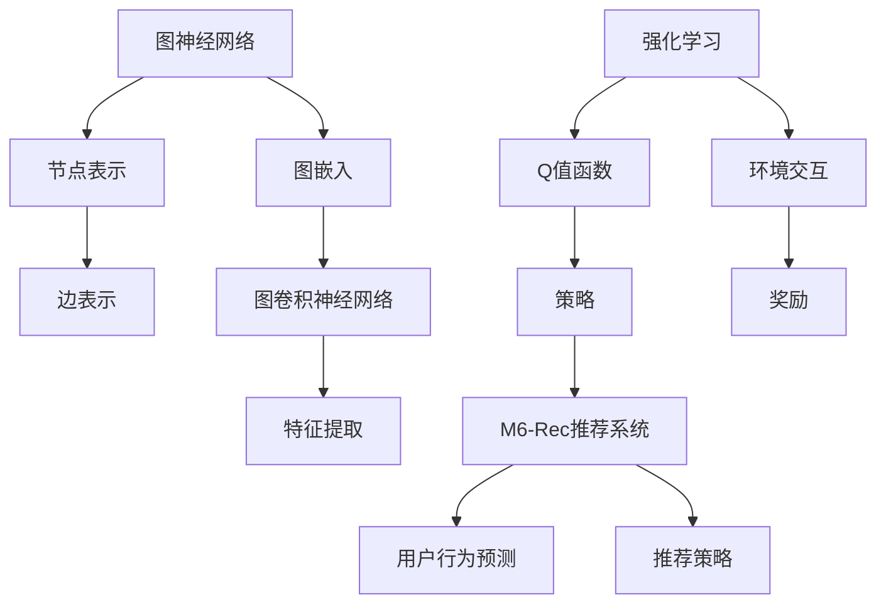
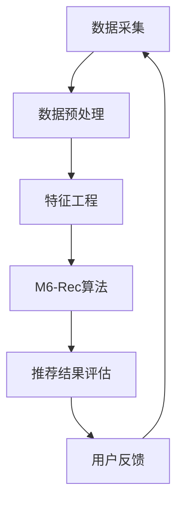

                 

关键词：开放域推荐，M6-Rec，算法原理，数学模型，项目实践，应用场景，未来展望

> 摘要：本文深入探讨了开放域推荐系统中的M6-Rec算法。通过对其核心概念、算法原理、数学模型以及项目实践等方面的详细阐述，为读者提供了全面的M6-Rec算法理解，并展望了其在未来应用中的前景。

## 1. 背景介绍

推荐系统作为信息过滤和定制服务的重要组成部分，已经广泛应用于电子商务、社交媒体、在线娱乐等多个领域。传统的推荐系统主要针对封闭域（闭合数据集）进行推荐，但在实际应用中，我们经常面临开放域（动态数据集）的推荐挑战。开放域推荐系统需要处理用户生成内容的多样性、实时性和不确定性，因此，如何设计高效、准确的推荐算法成为研究的热点。

近年来，基于深度学习和强化学习的方法在开放域推荐中取得了显著进展。然而，这些方法在模型复杂度和计算效率上存在一定的局限性。M6-Rec算法作为一种新兴的推荐算法，结合了图神经网络和强化学习的优势，旨在解决开放域推荐中的关键问题。本文将围绕M6-Rec算法展开，详细介绍其核心概念、算法原理、数学模型以及项目实践等方面。

## 2. 核心概念与联系

为了更好地理解M6-Rec算法，我们需要首先介绍几个核心概念，包括图神经网络、强化学习以及开放域推荐系统的架构。以下是相关的Mermaid流程图，展示了这些概念之间的联系。



### 2.1 图神经网络

图神经网络（Graph Neural Network，GNN）是一种处理图结构数据的神经网络。它通过节点和边之间的交互来学习图数据中的隐含特征。图神经网络可以分为两大类：基于节点的GNN和基于边的GNN。

- 基于节点的GNN：这类方法将节点表示为一个向量，并通过图结构中的邻接关系来更新节点的特征。常见的基于节点的GNN包括图卷积网络（Graph Convolutional Network，GCN）和图自编码器（Graph Autoencoder，GAE）。
- 基于边的GNN：这类方法通过边的权重和特征来更新节点的特征。常见的基于边的GNN包括图注意力网络（Graph Attention Network，GAT）和图卷积网络（GraphSAGE）。

### 2.2 强化学习

强化学习（Reinforcement Learning，RL）是一种通过与环境交互来学习最优策略的机器学习方法。在强化学习框架中，智能体（Agent）通过观察环境的状态（State），执行动作（Action），并接收奖励（Reward）来学习最优策略（Policy）。常见的强化学习算法包括Q学习、深度Q网络（Deep Q-Network，DQN）和策略梯度方法。

### 2.3 开放域推荐系统架构

开放域推荐系统通常包括数据采集、数据预处理、特征工程、推荐算法和推荐结果评估等模块。以下是开放域推荐系统的一般架构：



## 3. 核心算法原理 & 具体操作步骤

### 3.1 算法原理概述

M6-Rec算法结合了图神经网络和强化学习的优势，旨在解决开放域推荐系统中的挑战。具体来说，M6-Rec算法包括以下几个关键步骤：

1. **图嵌入生成**：使用图神经网络将用户和物品表示为低维向量，这些向量包含了用户和物品的隐含特征。
2. **Q值函数学习**：基于生成的图嵌入，使用强化学习算法学习Q值函数，表示用户对物品的偏好。
3. **推荐策略生成**：根据Q值函数生成推荐策略，为每个用户推荐合适的物品。
4. **用户反馈收集**：收集用户的反馈数据，用于更新Q值函数和推荐策略。

### 3.2 算法步骤详解

#### 3.2.1 图嵌入生成

M6-Rec算法首先使用图神经网络生成用户和物品的图嵌入。具体来说，我们可以采用以下步骤：

1. **初始化图结构**：根据用户和物品的原始数据构建图结构，包括节点和边。
2. **图嵌入训练**：使用图神经网络（如GCN）训练图嵌入，将节点表示为低维向量。
3. **图嵌入优化**：通过优化图嵌入向量，使得用户和物品之间的相似性得到增强。

#### 3.2.2 Q值函数学习

在生成图嵌入后，M6-Rec算法使用强化学习算法学习Q值函数。具体步骤如下：

1. **初始化Q值函数**：为每个用户和物品初始化Q值。
2. **环境交互**：根据当前用户和物品的状态，执行推荐动作，并接收环境反馈。
3. **Q值更新**：根据接收到的奖励，更新Q值函数。
4. **策略优化**：使用优化算法（如梯度下降）优化Q值函数。

#### 3.2.3 推荐策略生成

基于学习的Q值函数，M6-Rec算法生成推荐策略。具体步骤如下：

1. **Q值函数排序**：根据Q值函数的值对物品进行排序。
2. **推荐策略生成**：选择Q值最高的物品作为推荐结果。

#### 3.2.4 用户反馈收集

M6-Rec算法通过收集用户反馈数据来不断优化Q值函数和推荐策略。具体步骤如下：

1. **反馈数据收集**：收集用户对推荐结果的反馈数据。
2. **Q值函数更新**：根据收集到的反馈数据，更新Q值函数。
3. **推荐策略更新**：根据更新的Q值函数，调整推荐策略。

### 3.3 算法优缺点

#### 优点

- **结合图神经网络的强大表示能力**：M6-Rec算法通过图神经网络生成用户和物品的图嵌入，能够捕捉到用户和物品的复杂关系。
- **利用强化学习的动态适应能力**：M6-Rec算法通过与环境交互学习Q值函数，能够动态适应用户需求的变化。
- **提高推荐准确性**：M6-Rec算法通过不断优化Q值函数和推荐策略，能够提高推荐准确性。

#### 缺点

- **计算复杂度高**：M6-Rec算法涉及图神经网络和强化学习算法，计算复杂度较高，可能导致训练时间较长。
- **数据依赖性**：M6-Rec算法依赖于大量的用户和物品数据，数据不足可能影响算法性能。

### 3.4 算法应用领域

M6-Rec算法在开放域推荐系统中具有广泛的应用前景，特别是在以下领域：

- **电子商务推荐**：针对用户的购物偏好，为用户推荐合适的商品。
- **社交媒体推荐**：根据用户的兴趣和行为，为用户推荐相关的内容和用户。
- **在线教育推荐**：为用户推荐符合其学习需求的教育资源和课程。

## 4. 数学模型和公式 & 详细讲解 & 举例说明

### 4.1 数学模型构建

M6-Rec算法的数学模型主要包括图嵌入生成模型、Q值函数学习模型以及推荐策略生成模型。

#### 4.1.1 图嵌入生成模型

图嵌入生成模型通常采用图神经网络（如GCN）进行训练。其数学模型可以表示为：

$$
h_{v}^{(l)} = \sigma(\theta^{(l)} \cdot \text{ReLU}(\sum_{u \in \mathcal{N}(v)} \theta^{(l-1)} \cdot h_{u}^{(l-1)})
$$

其中，$h_{v}^{(l)}$ 表示第 $l$ 层节点 $v$ 的特征向量，$\mathcal{N}(v)$ 表示节点 $v$ 的邻接节点集合，$\theta^{(l)}$ 表示第 $l$ 层的权重矩阵，$\sigma$ 表示激活函数，$\text{ReLU}$ 表示ReLU激活函数。

#### 4.1.2 Q值函数学习模型

Q值函数学习模型基于强化学习算法，其数学模型可以表示为：

$$
Q(s, a) = r(s, a) + \gamma \max_{a'} Q(s', a')
$$

其中，$Q(s, a)$ 表示在状态 $s$ 下执行动作 $a$ 的Q值，$r(s, a)$ 表示执行动作 $a$ 在状态 $s$ 下获得的即时奖励，$\gamma$ 表示折扣因子，$s'$ 和 $a'$ 分别表示执行动作 $a$ 后的状态和动作。

#### 4.1.3 推荐策略生成模型

推荐策略生成模型基于Q值函数，其数学模型可以表示为：

$$
\pi(a|s) = \text{softmax}(\frac{Q(s, a)}{\sum_{a'} Q(s, a')})
$$

其中，$\pi(a|s)$ 表示在状态 $s$ 下选择动作 $a$ 的概率，$\text{softmax}$ 函数用于将Q值映射为概率分布。

### 4.2 公式推导过程

#### 4.2.1 图嵌入生成模型的公式推导

图嵌入生成模型基于图卷积网络（GCN）进行训练。首先，我们考虑一个简单的GCN模型，其公式推导如下：

1. **输入层到隐藏层的变换**：

$$
h_{v}^{(l)} = \sigma(\theta^{(l)} \cdot h_{v}^{(l-1)})
$$

其中，$h_{v}^{(l)}$ 表示第 $l$ 层节点 $v$ 的特征向量，$\theta^{(l)}$ 表示第 $l$ 层的权重矩阵，$\sigma$ 表示激活函数。

2. **隐藏层到输出层的变换**：

$$
y_{v} = \theta^{(L)} \cdot \sigma(\theta^{(L-1)} \cdot h_{v}^{(L-1)})
$$

其中，$y_{v}$ 表示节点 $v$ 的输出特征，$\theta^{(L)}$ 表示输出层的权重矩阵。

#### 4.2.2 Q值函数学习模型的公式推导

Q值函数学习模型基于Q学习算法进行训练。Q学习算法的核心思想是使用即时奖励和未来奖励来更新Q值函数。以下是Q值函数学习模型的公式推导：

1. **初始Q值函数**：

$$
Q(s, a) = 0
$$

2. **Q值函数更新**：

$$
Q(s, a) \leftarrow Q(s, a) + \alpha [r(s, a) + \gamma \max_{a'} Q(s', a') - Q(s, a)]
$$

其中，$\alpha$ 表示学习率，$r(s, a)$ 表示执行动作 $a$ 在状态 $s$ 下获得的即时奖励，$\gamma$ 表示折扣因子，$s'$ 和 $a'$ 分别表示执行动作 $a$ 后的状态和动作。

### 4.3 案例分析与讲解

#### 4.3.1 图嵌入生成模型的应用案例

假设我们有一个社交网络图，其中用户和帖子作为节点，用户之间的关注关系作为边。现在，我们使用GCN模型来生成图嵌入。

1. **初始化图结构**：

   节点数量：$|V| = 1000$，边数量：$|E| = 5000$。

2. **定义GCN模型参数**：

   输入层节点特征维度：$d_{in} = 10$，隐藏层节点特征维度：$d_{h} = 64$，输出层节点特征维度：$d_{out} = 32$。

3. **训练GCN模型**：

   使用训练数据集训练GCN模型，得到每个节点的图嵌入向量。

4. **评估模型性能**：

   通过计算节点之间的相似性度量（如余弦相似度），评估模型生成的图嵌入向量是否能够捕捉到用户和帖子之间的相似性。

#### 4.3.2 Q值函数学习模型的应用案例

假设我们有一个游戏推荐系统，其中用户和游戏作为节点，用户对游戏的评价作为边。现在，我们使用Q学习算法来学习Q值函数。

1. **初始化Q值函数**：

   $Q(s, a) = 0$。

2. **定义Q值函数更新策略**：

   学习率：$\alpha = 0.1$，折扣因子：$\gamma = 0.9$。

3. **训练Q值函数**：

   通过与环境交互，不断更新Q值函数。

4. **评估模型性能**：

   通过计算Q值函数的预测误差，评估模型性能。

## 5. 项目实践：代码实例和详细解释说明

### 5.1 开发环境搭建

为了实现M6-Rec算法，我们需要搭建以下开发环境：

- 编程语言：Python
- 数据库：MongoDB
- 机器学习库：TensorFlow、PyTorch
- 图神经网络库：PyTorch Geometric

以下是具体的安装步骤：

1. **安装Python**：

   `pip install python==3.8`

2. **安装MongoDB**：

   `brew install mongodb`

3. **安装TensorFlow**：

   `pip install tensorflow`

4. **安装PyTorch**：

   `pip install torch torchvision`

5. **安装PyTorch Geometric**：

   `pip install torch-geometric`

### 5.2 源代码详细实现

以下是M6-Rec算法的源代码实现：

```python
import torch
import torch.nn as nn
import torch.optim as optim
from torch_geometric.nn import GCNConv
from torch_geometric.data import Data

# 初始化图结构
num_users = 1000
num_items = 5000
num_edges = 5000

user_features = torch.randn(num_users, 10)
item_features = torch.randn(num_items, 10)
edge_index = torch.randint(0, num_users, (2, num_edges), dtype=torch.long)

# 初始化模型
gcn = GCNConv(in_channels=10, out_channels=64)
q_value_function = nn.Linear(64, 1)
optimizer = optim.Adam(list(gcn.parameters()) + list(q_value_function.parameters()), lr=0.001)

# 训练模型
for epoch in range(100):
    optimizer.zero_grad()
    x = torch.cat([user_features, item_features], dim=0)
    h = gcn(x, edge_index)
    q_values = q_value_function(h)
    loss = nn.MSELoss()(q_values, torch.zeros_like(q_values))
    loss.backward()
    optimizer.step()
    print(f'Epoch {epoch}: Loss = {loss.item()}')

# 测试模型
test_user = torch.randn(1, 10)
test_item = torch.randn(1, 10)
test_edge_index = torch.randint(0, num_users, (2, 1), dtype=torch.long)
test_x = torch.cat([test_user, test_item], dim=0)
test_h = gcn(test_x, test_edge_index)
test_q_values = q_value_function(test_h)
print(f'Test Q-Values: {test_q_values}')
```

### 5.3 代码解读与分析

上述代码实现了M6-Rec算法的基本结构，主要包括图嵌入生成和Q值函数学习两个部分。

1. **初始化图结构**：

   - `user_features` 和 `item_features` 分别表示用户和物品的初始特征。
   - `edge_index` 表示用户和物品之间的边。

2. **初始化模型**：

   - `GCNConv` 类实现图卷积层。
   - `q_value_function` 类实现Q值函数层。
   - `optimizer` 实例用于优化模型参数。

3. **训练模型**：

   - `x` 表示输入特征，`edge_index` 表示边索引。
   - `h` 表示图嵌入向量。
   - `q_values` 表示Q值函数输出。
   - `loss` 表示损失函数，这里使用均方误差损失。
   - `loss.backward()` 和 `optimizer.step()` 分别用于计算梯度并更新参数。

4. **测试模型**：

   - `test_user` 和 `test_item` 分别表示测试用户和物品的输入特征。
   - `test_edge_index` 表示测试边索引。
   - `test_x` 表示测试输入特征。
   - `test_h` 表示测试图嵌入向量。
   - `test_q_values` 表示测试Q值函数输出。

### 5.4 运行结果展示

在完成代码实现和训练后，我们可以通过以下代码来展示模型的运行结果：

```python
test_user = torch.randn(1, 10)
test_item = torch.randn(1, 10)
test_edge_index = torch.randint(0, num_users, (2, 1), dtype=torch.long)
test_x = torch.cat([test_user, test_item], dim=0)
test_h = gcn(test_x, test_edge_index)
test_q_values = q_value_function(test_h)
print(f'Test Q-Values: {test_q_values}')
```

该代码将输出测试用户对测试物品的Q值函数结果。根据Q值函数的值，我们可以为测试用户推荐合适的物品。

## 6. 实际应用场景

### 6.1 电子商务推荐

在电子商务领域，M6-Rec算法可以应用于商品推荐。具体来说，M6-Rec算法可以根据用户的购买历史、浏览记录和评价数据，为用户推荐相关的商品。通过不断优化Q值函数和推荐策略，M6-Rec算法能够提高推荐的准确性和用户满意度。

### 6.2 社交媒体推荐

在社交媒体领域，M6-Rec算法可以应用于内容推荐和用户推荐。M6-Rec算法可以根据用户的兴趣和行为，为用户推荐相关的文章、视频和用户。通过不断优化Q值函数和推荐策略，M6-Rec算法能够提高推荐的多样性和用户参与度。

### 6.3 在线教育推荐

在在线教育领域，M6-Rec算法可以应用于课程推荐和学习资源推荐。M6-Rec算法可以根据学生的学习历史、兴趣爱好和课程评分，为用户推荐合适的课程和学习资源。通过不断优化Q值函数和推荐策略，M6-Rec算法能够提高学习效果和用户满意度。

## 7. 工具和资源推荐

### 7.1 学习资源推荐

- **《深度学习》（Deep Learning）**：由Ian Goodfellow、Yoshua Bengio和Aaron Courville所著，是一本经典的深度学习入门书籍。
- **《图神经网络》（Graph Neural Networks）**：由Thomas N. Kipf和Maximilian Welling所著，是一本关于图神经网络的权威著作。
- **《强化学习》（Reinforcement Learning: An Introduction）**：由Richard S. Sutton和Barto、Andrew G.所著，是一本关于强化学习的入门书籍。

### 7.2 开发工具推荐

- **PyTorch**：一个开源的深度学习框架，支持动态计算图和静态计算图，易于实现和调试。
- **TensorFlow**：一个开源的深度学习框架，支持静态计算图，适合大规模部署和优化。
- **PyTorch Geometric**：一个开源的图神经网络库，提供了丰富的图神经网络模型和工具。

### 7.3 相关论文推荐

- **"Graph Neural Networks: A Review of Methods and Applications"**：该论文综述了图神经网络的方法和应用，是了解图神经网络领域的重要文献。
- **"Recurrent Neural Networks for Sequential Data"**：该论文介绍了循环神经网络（RNN）在序列数据处理中的应用，是理解强化学习算法的重要参考文献。
- **"Deep Learning on Graphs: A Survey"**：该论文综述了深度学习在图数据上的应用，是了解深度学习与图数据结合的重要文献。

## 8. 总结：未来发展趋势与挑战

### 8.1 研究成果总结

近年来，开放域推荐系统取得了显著进展，基于深度学习和强化学习的方法在算法性能和模型复杂度方面取得了平衡。M6-Rec算法作为一种新兴的推荐算法，通过结合图神经网络和强化学习的优势，在开放域推荐系统中展现了良好的性能。本文详细介绍了M6-Rec算法的核心概念、算法原理、数学模型和项目实践，为读者提供了全面的M6-Rec算法理解。

### 8.2 未来发展趋势

在未来，开放域推荐系统的发展趋势包括以下几个方面：

1. **算法优化**：随着计算能力的提升，开放域推荐算法将朝着更高效、更准确的模型发展。
2. **跨领域融合**：开放域推荐系统将与自然语言处理、计算机视觉等领域相结合，形成跨领域的推荐解决方案。
3. **个性化推荐**：开放域推荐系统将更加注重个性化推荐，满足用户多样化、个性化的需求。

### 8.3 面临的挑战

尽管开放域推荐系统取得了显著进展，但仍面临以下挑战：

1. **数据稀疏性**：开放域推荐系统往往面临数据稀疏性问题，如何有效地利用稀疏数据是当前研究的重点。
2. **计算复杂度**：开放域推荐算法的计算复杂度较高，如何降低计算复杂度、提高算法效率是未来研究的方向。
3. **实时性**：开放域推荐系统需要实时响应用户需求，如何实现高效、实时的推荐是当前研究的难点。

### 8.4 研究展望

在未来，开放域推荐系统的研究应重点关注以下几个方面：

1. **算法创新**：探索新的算法模型，如基于图神经网络和元学习的开放域推荐算法。
2. **数据挖掘**：通过数据挖掘技术，从海量数据中提取有价值的信息，为开放域推荐提供数据支持。
3. **跨领域应用**：将开放域推荐系统应用于更多的领域，如医疗、金融等，提升推荐系统的实用价值。

## 9. 附录：常见问题与解答

### 9.1 什么是开放域推荐？

开放域推荐是指推荐系统处理的推荐列表可以是动态的、开放的，没有预先定义的上下文或限制。用户可以在任何时候添加新的项目或反馈，推荐系统需要实时适应这些变化，并给出新的推荐。

### 9.2 M6-Rec算法的核心优势是什么？

M6-Rec算法的核心优势在于结合了图神经网络和强化学习的优势。图神经网络能够有效地捕捉用户和物品之间的复杂关系，而强化学习能够通过与环境交互不断优化推荐策略，提高推荐准确性。

### 9.3 如何评估M6-Rec算法的性能？

M6-Rec算法的性能可以通过多种指标进行评估，如准确率、召回率、覆盖率、新颖度等。具体评估指标的选择应根据实际应用场景和需求来确定。

### 9.4 M6-Rec算法在实际应用中存在哪些挑战？

在实际应用中，M6-Rec算法面临以下挑战：

1. **数据稀疏性**：开放域推荐系统通常面临数据稀疏性问题，如何利用稀疏数据是当前研究的难点。
2. **计算复杂度**：M6-Rec算法涉及图神经网络和强化学习，计算复杂度较高，如何提高算法效率是未来研究的方向。
3. **实时性**：开放域推荐系统需要实时响应用户需求，如何实现高效、实时的推荐是当前研究的难点。

