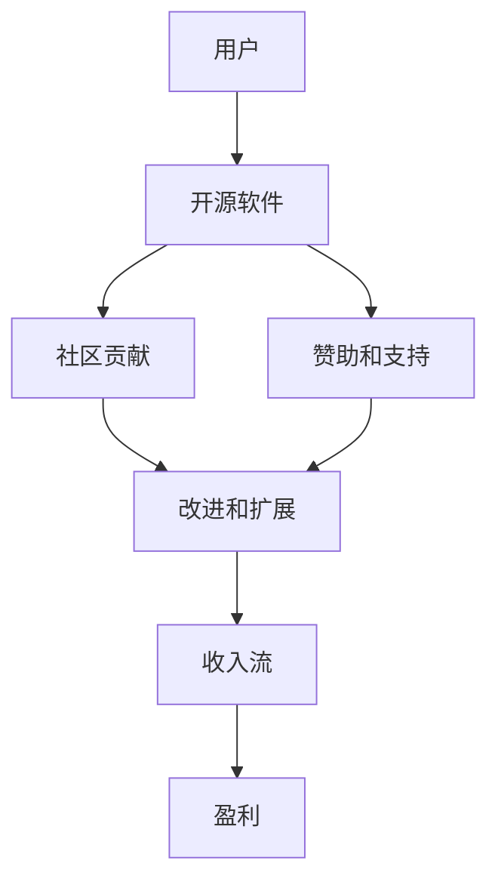

                 

在数字时代，开源软件已经成为技术发展的基石。它不仅促进了创新和协作，还为开发者提供了一个丰富的平台，以构建、分享和改进软件。本文旨在探讨开源软件的商业模式，通过案例分析提供最佳实践，以帮助企业和开发者在这个不断演变的环境中取得成功。

## 关键词

- 开源软件
- 商业模式
- 案例研究
- 开发者协作
- 创新
- 收益模型

## 摘要

本文将探讨开源软件的商业模式，并分析一些成功的案例。我们将探讨开源软件如何通过多种方式实现盈利，包括赞助、订阅、服务和支持。同时，我们将提供一系列最佳实践，以帮助企业和开发者优化其开源策略，确保可持续的商业成功。

### 1. 背景介绍

开源软件的概念最早可以追溯到20世纪80年代，当时自由软件运动兴起，推动了软件自由的理念。随着时间的推移，开源软件已经成为软件开发的主流模式。它允许任何人自由地查看、修改和分发软件源代码，从而促进了技术知识的传播和创新。开源软件的核心价值在于其透明性、可定制性和社区驱动的协作模式。

开源软件的商业模式是指通过开源项目获取收入和利润的策略。与传统的商业软件模型不同，开源软件不依赖于单一的销售渠道或许可证费用。相反，它们通过多元化的收入流来实现盈利。这些收入流可能包括直接销售服务、订阅计划、赞助和社区支持等。

### 2. 核心概念与联系

#### 2.1 开源软件的定义

开源软件（Open Source Software，简称OSS）是一种软件开发和分发模式，其源代码可以被公众自由访问、使用、修改和分发。开源软件的核心原则包括：

- **自由使用**：用户可以自由使用开源软件，无需支付费用。
- **查看源代码**：用户可以查看、学习并理解软件的源代码。
- **修改和分发**：用户可以修改开源软件的源代码，并自由分发修改后的版本。
- **透明性和协作**：开源项目通常具有高度的透明度和协作性，开发者可以共同合作，改进软件。

#### 2.2 商业模式的概念

商业模式是指企业通过提供产品或服务来创造收入和利润的策略。对于开源软件，商业模式需要考虑到开源的特性和挑战，例如如何在不收取许可证费用的情况下实现盈利。

#### 2.3 商业模式与开源软件的关系

商业模式的成功与否直接影响到开源软件项目的可持续性。一个有效的商业模式应该能够平衡开源软件的自由性和盈利需求，确保项目能够获得足够的资源进行持续开发。

#### 2.4 Mermaid 流程图

下面是一个简单的 Mermaid 流程图，展示了开源软件商业模式的基本组成部分。



### 3. 核心算法原理 & 具体操作步骤

#### 3.1 算法原理概述

开源软件的商业模式主要依赖于以下几种机制：

- **社区贡献**：开发者通过贡献代码和资源来提高软件的质量和功能。
- **赞助和支持**：企业和个人通过捐赠、赞助和支付支持费用来资助开源项目。
- **收入流**：开源项目通过提供增值服务、订阅计划和许可证费用来创造收入。

这些机制共同作用，形成一个自我维持的生态系统，使得开源项目能够持续发展。

#### 3.2 算法步骤详解

1. **社区贡献**：开发者创建或参与开源项目，提交代码和文档，参与讨论和决策。
2. **赞助和支持**：企业和个人发现开源项目有价值，选择赞助或支付支持费用。
3. **改进和扩展**：开源项目收到赞助和支持后，进一步改进和扩展软件功能。
4. **收入流**：开源项目提供增值服务，如培训、咨询和支持，以创造收入。
5. **盈利**：开源项目的收入用于维护和扩展软件，同时为开发者提供经济回报。

#### 3.3 算法优缺点

**优点：**

- **透明性和协作**：开源项目具有高度的透明性和协作性，有助于提高软件质量和功能。
- **可持续性**：通过多元化的收入流，开源项目能够获得持续的资源和资金支持。
- **社区驱动的创新**：开源项目鼓励社区成员参与创新，推动技术进步。

**缺点：**

- **盈利挑战**：开源项目不依赖于许可证费用，可能面临盈利困难。
- **资源分配问题**：开源项目可能无法像商业软件一样集中资源进行特定功能的开发。

#### 3.4 算法应用领域

开源软件的商业模式适用于多个领域，包括：

- **开源操作系统**：如Linux和Windows。
- **开发工具**：如Git、Eclipse。
- **数据库**：如MySQL和PostgreSQL。
- **云计算平台**：如Kubernetes和Docker。

### 4. 数学模型和公式 & 详细讲解 & 举例说明

#### 4.1 数学模型构建

开源软件的商业模式可以被视为一个复杂的系统，其数学模型可以包括以下组成部分：

- **用户参与度**：用户参与度可以通过用户贡献代码、报告问题和提供反馈来衡量。
- **赞助和支持率**：赞助和支持率可以通过赞助金额和支持费用的比例来衡量。
- **收入流**：收入流可以通过提供增值服务的收入来衡量。

假设用户参与度为 \( U \)，赞助和支持率为 \( S \)，收入流为 \( I \)，则开源软件的盈利能力可以表示为：

\[ 盈利能力 = U \times S \times I \]

#### 4.2 公式推导过程

盈利能力的公式推导过程如下：

1. **用户参与度**：用户参与度 \( U \) 是指用户对开源项目的贡献程度。它可以通过用户提交的代码、报告的问题和提供的反馈来衡量。
2. **赞助和支持率**：赞助和支持率 \( S \) 是指开源项目从赞助和支持中获得的收入占总收入的比例。它可以通过以下公式计算：

\[ S = \frac{赞助金额 + 支持费用}{总收入} \]

3. **收入流**：收入流 \( I \) 是指开源项目通过提供增值服务获得的收入。它可以通过以下公式计算：

\[ I = 增值服务收入 - 运营成本 \]

4. **盈利能力**：盈利能力是用户参与度、赞助和支持率以及收入流的乘积。它反映了开源项目的盈利能力。

#### 4.3 案例分析与讲解

以下是一个简单的案例，用于说明开源软件的商业模式如何运作。

**案例：一个开源Web框架**

假设一个开源Web框架的用户参与度 \( U \) 为20%，赞助和支持率 \( S \) 为30%，收入流 \( I \) 为10,000美元。

1. **用户参与度**：用户参与度为20%，意味着用户对框架的贡献较大，有助于提高框架的质量和功能。
2. **赞助和支持率**：赞助和支持率为30%，意味着项目从赞助和支持中获得的收入占其总收入的30%。
3. **收入流**：收入流为10,000美元，这意味着项目通过提供增值服务获得了足够的收入。

根据盈利能力的公式，我们可以计算该开源Web框架的盈利能力：

\[ 盈利能力 = U \times S \times I = 0.20 \times 0.30 \times 10,000 = 6,000美元 \]

这意味着该开源Web框架每年可以赚取6,000美元的利润。

### 5. 项目实践：代码实例和详细解释说明

#### 5.1 开发环境搭建

为了实践开源软件的商业模式，我们选择一个简单的开源Web框架作为示例。首先，我们需要搭建开发环境。

1. **安装Node.js**：从[Node.js官网](https://nodejs.org/)下载并安装Node.js。
2. **安装Web框架**：使用npm（Node.js包管理器）安装一个开源Web框架，例如Express.js。

```bash
npm install express
```

3. **创建项目**：创建一个新的项目文件夹，并在其中创建一个名为`index.js`的文件。

```bash
mkdir my-web-app
cd my-web-app
touch index.js
```

#### 5.2 源代码详细实现

在`index.js`文件中，我们实现一个简单的Web服务器，用于处理HTTP请求。

```javascript
const express = require('express');
const app = express();
const port = 3000;

app.get('/', (req, res) => {
  res.send('Hello, World!');
});

app.listen(port, () => {
  console.log(`Web server listening at http://localhost:${port}`);
});
```

这个简单的Web服务器使用Express.js框架，并在根路径上返回“Hello, World!”消息。

#### 5.3 代码解读与分析

1. **引入模块**：我们首先引入Express.js模块，它是Node.js的一个Web应用框架。
2. **创建应用实例**：使用`express()`函数创建一个Express应用实例。
3. **设置路由**：使用`app.get()`方法设置一个路由，用于处理HTTP GET请求。
4. **响应请求**：在路由处理函数中，我们使用`res.send()`方法返回一个响应。
5. **启动服务器**：使用`app.listen()`方法启动Web服务器，并指定端口号。

这个简单的例子展示了如何使用开源框架快速搭建一个Web应用。在实际项目中，我们可以添加更多功能，如数据库连接、中间件处理和路由定义。

#### 5.4 运行结果展示

在命令行中运行以下命令来启动Web服务器：

```bash
node index.js
```

然后，在浏览器中访问`http://localhost:3000`，你应该会看到“Hello, World!”消息。

### 6. 实际应用场景

开源软件的商业模式在许多实际应用场景中取得了成功。以下是一些典型的应用场景：

- **开源操作系统**：Linux操作系统是一个成功的开源软件案例。它不仅为服务器和嵌入式设备提供了强大的平台，还催生了一个庞大的开发者社区，推动了技术创新。
- **开发工具**：Git和Eclipse等开源开发工具吸引了大量用户，为开发者提供了高效的开发环境。
- **云计算平台**：Kubernetes和Docker等开源云计算平台为企业提供了灵活的部署和管理方案，推动了云计算的普及。
- **数据库**：MySQL和PostgreSQL等开源数据库软件在企业和个人开发者中广泛应用，提供了强大的数据存储和处理能力。

这些案例表明，开源软件不仅促进了技术创新和协作，还为企业创造了巨大的商业价值。

#### 6.4 未来应用展望

开源软件的商业模式在未来将继续发展，并可能面临以下趋势和挑战：

- **多元化的收入流**：开源项目将探索更多元化的收入流，如云服务、订阅计划和增值服务，以实现可持续发展。
- **商业与开源的融合**：企业将更加重视开源项目，通过赞助和支持来推动技术创新和社区发展。
- **开源生态系统的完善**：开源社区将加强协作，构建更加完善的开源生态系统，提高项目的可持续性和稳定性。

### 7. 工具和资源推荐

为了更好地理解和实践开源软件的商业模式，以下是一些建议的学习资源、开发工具和相关论文：

- **学习资源推荐：**
  - 《开源软件商务模式》
  - 《开源协作：原理与实践》
  
- **开发工具推荐：**
  - Git：版本控制系统
  - GitHub：开源项目托管平台
  - Jira：项目管理工具

- **相关论文推荐：**
  - "The Business of Open Source: Challenges and Opportunities" by Red Hat
  - "Open Core and Open Source Business Models" by 451 Research

### 8. 总结：未来发展趋势与挑战

开源软件的商业模式在过去几十年中取得了显著的成功，推动了技术创新和协作。未来，开源软件将继续发展，面临多元化的收入流、商业与开源的融合以及生态系统完善等挑战。通过持续的创新和协作，开源软件有望在数字时代发挥更大的作用。

#### 8.1 研究成果总结

本文探讨了开源软件的商业模式，通过案例分析提供了最佳实践。研究表明，开源软件通过多元化的收入流、社区贡献和赞助支持实现了盈利。同时，开源软件在促进技术创新和协作方面具有显著优势。

#### 8.2 未来发展趋势

未来，开源软件将继续发展，面临多元化收入流、商业与开源融合以及生态系统完善等趋势。企业将更加重视开源项目，通过赞助和支持来推动技术创新和社区发展。

#### 8.3 面临的挑战

开源软件在商业模式上面临盈利困难、资源分配问题和可持续发展等挑战。如何平衡开源的自由性和盈利需求，确保开源项目的可持续性，是未来需要解决的问题。

#### 8.4 研究展望

未来的研究应关注如何优化开源软件的商业模式，提高其盈利能力和可持续性。同时，还应探索开源软件在不同领域的应用，以推动技术创新和社会进步。

### 9. 附录：常见问题与解答

**Q：开源软件为什么能盈利？**

A：开源软件通过多元化的收入流，如赞助、服务和支持，实现盈利。这些收入流不仅包括直接的财务支持，还包括为用户提供增值服务，从而实现商业价值。

**Q：开源软件如何确保可持续发展？**

A：开源软件的可持续发展依赖于多元化的收入流和社区贡献。通过获得赞助和支持，开源项目可以获得持续的资金支持，同时社区贡献有助于提高软件的质量和功能，吸引更多用户和赞助者。

**Q：企业如何参与开源项目？**

A：企业可以通过以下方式参与开源项目：
1. **赞助和支持**：向开源项目捐赠资金或提供技术支持。
2. **贡献代码和文档**：参与代码开发和文档编写，提高软件质量。
3. **使用开源软件**：选择和使用开源软件，支持开源社区的生态系统。

---

本文由禅与计算机程序设计艺术 / Zen and the Art of Computer Programming 撰写，旨在探讨开源软件的商业模式，提供最佳实践，以帮助企业和开发者实现可持续的商业成功。希望本文能对读者有所启发和帮助。

