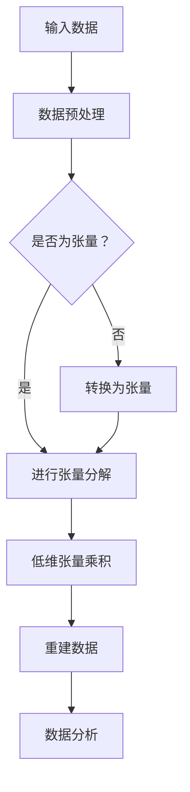

                 

关键词：张量分解、生物信息学、数据分析、基因表达、神经网络、多组学数据、生物医学研究

> 摘要：本文探讨了张量分解在生物信息学领域的应用，详细介绍了张量分解的核心概念、算法原理、数学模型及其在基因表达分析、多组学数据整合和生物医学研究中的应用。通过实例分析和项目实践，揭示了张量分解在生物信息学中潜藏的巨大潜力，为生物医学研究提供了新的思路和方法。

## 1. 背景介绍

随着基因组学、转录组学、蛋白质组学和代谢组学等领域的快速发展，生物信息学正面临海量数据的挑战。这些数据以高维矩阵和张量的形式存在，传统的线性代数和统计分析方法难以有效地处理和分析这些复杂的数据结构。张量分解作为一种多维数据分解技术，近年来在各个领域得到了广泛的研究和应用。

生物信息学是运用计算方法和生物信息学技术对生物学数据进行分析和研究的一门学科。它涵盖了基因组学、转录组学、蛋白质组学、代谢组学等多个领域，旨在揭示生物系统的功能和机制。然而，随着数据的复杂性不断增加，传统的分析方法已经无法满足生物信息学研究的需要。

张量分解在生物信息学中的应用，为解决复杂生物数据的分析问题提供了新的思路。它能够将高维数据分解为多个低维张量的乘积，从而简化数据结构，提高数据分析的效率。此外，张量分解还可以通过重建原始数据，发现数据中的隐藏模式和关联关系，为生物信息学研究提供更深入的见解。

本文将详细介绍张量分解在生物信息学中的应用，包括其核心概念、算法原理、数学模型以及实际应用案例。通过本文的介绍，希望能够为读者提供对张量分解在生物信息学中应用的理解，并激发更多对该领域的探索和研究。

## 2. 核心概念与联系

### 2.1 张量分解的概念

张量分解是高维数据分析的重要工具，它将高维数据（张量）分解为多个低维张量的乘积。在数学上，一个张量可以表示为多个矩阵的乘积。这种分解方式可以帮助我们更好地理解和分析复杂的数据结构。

在生物信息学中，张量分解通常用于处理高维的基因表达数据、蛋白质表达数据和多组学数据。通过张量分解，我们可以将复杂的数据分解为更易于理解和分析的低维形式，从而揭示数据中的隐藏模式和关联关系。

### 2.2 张量分解与生物信息学的关系

张量分解在生物信息学中的应用主要体现在以下几个方面：

1. **基因表达数据分析**：基因表达数据通常以高维矩阵的形式存在。通过张量分解，我们可以将基因表达数据分解为多个低维张量的乘积，从而识别出基因之间的关联关系，发现重要的生物学标记。

2. **多组学数据整合**：生物信息学中的多组学数据包括基因组学、转录组学、蛋白质组学和代谢组学等数据。这些数据通常具有不同的维度和数据类型。通过张量分解，我们可以将不同类型的数据整合到一个统一的框架下，从而实现多组学数据的综合分析。

3. **生物医学研究**：张量分解在生物医学研究中具有广泛的应用。例如，在疾病诊断、药物筛选和生物机制研究等方面，张量分解可以帮助我们从海量数据中发现潜在的生物标记和关联关系，从而推动生物医学研究的发展。

### 2.3 张量分解的 Mermaid 流程图

为了更好地理解张量分解的核心概念和流程，我们使用 Mermaid 流程图来展示张量分解的基本步骤。



### 2.4 张量分解的核心算法原理

张量分解的核心算法包括主成分分析（PCA）、因子分析（FA）、独立成分分析（ICA）等。这些算法通过将高维数据分解为低维张量，从而实现数据降维和模式识别。

1. **主成分分析（PCA）**：PCA 是一种常用的张量分解算法，它通过将高维数据投影到新的正交基上来实现数据降维。PCA 的核心思想是找到数据的主成分，即能够最大程度解释数据变异性的一组基向量。

2. **因子分析（FA）**：因子分析是一种基于线性代数的统计方法，它通过将高维数据分解为多个低维因子，从而实现数据的降维和模式识别。因子分析的核心思想是找到能够最大程度解释数据相关性的一组因子。

3. **独立成分分析（ICA）**：独立成分分析是一种无监督学习方法，它通过将高维数据分解为多个独立成分，从而实现数据的降维和分离。ICA 的核心思想是找到数据中的独立源信号，即能够最大程度减少数据冗余的一组基向量。

这些算法在生物信息学中有着广泛的应用，例如用于基因表达数据分析、蛋白质组学数据分析和多组学数据整合等。通过这些算法，我们可以从高维数据中发现隐藏的模式和关联关系，从而推动生物信息学的发展。

### 2.5 张量分解的应用领域

张量分解在生物信息学中有着广泛的应用，主要涉及以下领域：

1. **基因表达数据分析**：基因表达数据是生物信息学中重要的数据类型。通过张量分解，我们可以从高维的基因表达数据中发现基因之间的关联关系，识别出重要的生物学标记。例如，PCA 和 FA 等算法可以用于基因表达数据的降维和聚类分析，从而发现基因表达模式。

2. **蛋白质组学数据分析**：蛋白质组学数据同样具有高维和复杂的结构。通过张量分解，我们可以对蛋白质表达数据进行降维和模式识别，从而发现蛋白质之间的关联关系。例如，ICA 等算法可以用于蛋白质组学数据的分离和分类分析。

3. **多组学数据整合**：生物信息学中的多组学数据包括基因组学、转录组学、蛋白质组学和代谢组学等数据。这些数据通常具有不同的维度和数据类型。通过张量分解，我们可以将不同类型的数据整合到一个统一的框架下，从而实现多组学数据的综合分析。例如，PCA 和 FA 等算法可以用于多组学数据的整合和关联分析。

4. **生物医学研究**：张量分解在生物医学研究中具有广泛的应用。例如，在疾病诊断、药物筛选和生物机制研究等方面，张量分解可以帮助我们从海量数据中发现潜在的生物标记和关联关系，从而推动生物医学研究的发展。例如，PCA 和 ICA 等算法可以用于疾病诊断的标志物识别和生物机制的探索。

总之，张量分解在生物信息学中具有广泛的应用前景，它为解决复杂生物数据的分析问题提供了新的思路和方法。随着张量分解算法的不断发展和完善，其在生物信息学中的应用将会更加广泛和深入。

## 3. 核心算法原理 & 具体操作步骤

### 3.1 算法原理概述

张量分解是一种用于处理高维数据的多维数据分解技术，它将高维数据（张量）分解为多个低维张量的乘积。在生物信息学中，张量分解主要用于基因表达数据分析、蛋白质组学数据分析、多组学数据整合和生物医学研究等领域。

张量分解的核心算法包括主成分分析（PCA）、因子分析（FA）、独立成分分析（ICA）等。这些算法通过将高维数据分解为低维张量，从而实现数据降维和模式识别。

1. **主成分分析（PCA）**：PCA 是一种常用的张量分解算法，它通过将高维数据投影到新的正交基上来实现数据降维。PCA 的核心思想是找到数据的主成分，即能够最大程度解释数据变异性的一组基向量。通过降维，我们可以减少数据维度，提高数据分析的效率。

2. **因子分析（FA）**：因子分析是一种基于线性代数的统计方法，它通过将高维数据分解为多个低维因子，从而实现数据的降维和模式识别。FA 的核心思想是找到能够最大程度解释数据相关性的一组因子。通过降维，我们可以提取出数据中的主要信息，从而简化数据分析过程。

3. **独立成分分析（ICA）**：独立成分分析是一种无监督学习方法，它通过将高维数据分解为多个独立成分，从而实现数据的降维和分离。ICA 的核心思想是找到数据中的独立源信号，即能够最大程度减少数据冗余的一组基向量。通过分离，我们可以揭示数据中的隐藏模式和关联关系。

### 3.2 算法步骤详解

以下是张量分解的基本步骤：

1. **数据预处理**：
   - 数据清洗：去除噪声和异常值，提高数据质量。
   - 数据标准化：将数据缩放到相同的尺度，以便于计算。
   - 数据转换：将数据转换为张量形式，以便进行张量分解。

2. **张量分解**：
   - **PCA 分解**：通过计算数据的协方差矩阵，找到数据的主成分方向，从而实现降维。
     ```latex
     \Sigma = \frac{1}{n-1} \sum_{i=1}^{n} (x_i - \mu)(x_i - \mu)^T
     \quad
     \lambda v = \Sigma v
     ```
     其中，\( \Sigma \) 是协方差矩阵，\( \lambda \) 是特征值，\( v \) 是特征向量。
   - **FA 分解**：通过求解特征值和特征向量，找到数据的因子载荷矩阵，从而实现降维。
     ```latex
     A^T A v = \lambda v
     ```
     其中，\( A \) 是因子载荷矩阵，\( \lambda \) 是特征值，\( v \) 是特征向量。
   - **ICA 分解**：通过求解独立成分的混合模型，找到数据的独立成分，从而实现降维。
     ```latex
     s = A x + e
     \quad
     x = A^{-1} s - A^{-1} e
     ```
     其中，\( s \) 是独立成分，\( x \) 是原始数据，\( A \) 是混合矩阵，\( e \) 是误差项。

3. **重建数据**：
   - 通过低维张量的乘积，重建原始数据，从而验证张量分解的效果。

4. **数据分析**：
   - 对低维张量进行分析，提取数据中的隐藏模式和关联关系。
   - 进行进一步的统计分析和可视化，揭示数据中的规律和特征。

### 3.3 算法优缺点

1. **PCA 分解**：
   - **优点**：
     - 简单易懂，计算效率高。
     - 能够最大程度地保留数据的变异性。
   - **缺点**：
     - 只能提取线性关系。
     - 对于噪声敏感。

2. **FA 分解**：
   - **优点**：
     - 能够提取非线性关系。
     - 能够揭示数据中的主要信息。
   - **缺点**：
     - 计算复杂度较高。
     - 对于异常值敏感。

3. **ICA 分解**：
   - **优点**：
     - 能够提取独立成分，揭示数据中的隐藏模式。
     - 能够处理非线性数据。
   - **缺点**：
     - 计算复杂度较高。
     - 需要预先设定独立成分的数量。

### 3.4 算法应用领域

张量分解在生物信息学中有着广泛的应用，主要涉及以下领域：

1. **基因表达数据分析**：
   - 用于基因表达数据的降维和聚类分析，识别重要的生物学标记。
   - 用于疾病诊断和预测，发现疾病相关的基因和分子通路。

2. **蛋白质组学数据分析**：
   - 用于蛋白质表达数据的降维和模式识别，揭示蛋白质之间的关联关系。
   - 用于蛋白质相互作用网络的构建和分析。

3. **多组学数据整合**：
   - 将不同类型的数据整合到一个统一的框架下，实现多组学数据的综合分析。
   - 提高数据分析的效率和准确性，揭示生物系统的复杂机制。

4. **生物医学研究**：
   - 用于疾病诊断、药物筛选和生物机制研究，发现潜在的生物标记和关联关系。
   - 推动生物医学研究的发展，为人类健康提供新的思路和方法。

总之，张量分解在生物信息学中具有广泛的应用前景，它为解决复杂生物数据的分析问题提供了新的思路和方法。随着张量分解算法的不断发展和完善，其在生物信息学中的应用将会更加广泛和深入。

## 4. 数学模型和公式 & 详细讲解 & 举例说明

### 4.1 数学模型构建

张量分解的数学模型主要基于线性代数和矩阵理论。在生物信息学中，我们通常将数据表示为一个高维矩阵或张量，然后通过特定的算法将其分解为多个低维张量的乘积。这一过程涉及到一系列数学公式和推导。

#### 4.1.1 主成分分析（PCA）

主成分分析是一种常见的张量分解方法，其核心思想是找到数据的主要变化方向，从而实现数据降维。

**公式：**

$$
\mu = \frac{1}{n}\sum_{i=1}^{n} x_i
$$

$$
\Sigma = \frac{1}{n-1}\sum_{i=1}^{n} (x_i - \mu)(x_i - \mu)^T
$$

$$
\lambda v = \Sigma v
$$

其中，\( x_i \) 表示第 \( i \) 个样本，\( \mu \) 是样本均值，\( \Sigma \) 是协方差矩阵，\( \lambda \) 是特征值，\( v \) 是特征向量。

**解释：**

- \( \mu \) 是样本均值，用于计算每个特征的均值。
- \( \Sigma \) 是协方差矩阵，用于计算特征之间的相关性。
- \( \lambda \) 和 \( v \) 分别是特征值和特征向量，通过特征值和特征向量我们可以找到数据的主要变化方向。

#### 4.1.2 因子分析（FA）

因子分析是一种基于线性代数的统计方法，通过将高维数据分解为多个低维因子，从而实现数据的降维。

**公式：**

$$
A^T A v = \lambda v
$$

其中，\( A \) 是因子载荷矩阵，\( \lambda \) 是特征值，\( v \) 是特征向量。

**解释：**

- \( A \) 是因子载荷矩阵，用于描述每个特征与因子的关系。
- \( \lambda \) 是特征值，用于描述每个因子的贡献程度。
- \( v \) 是特征向量，用于找到数据的主要变化方向。

#### 4.1.3 独立成分分析（ICA）

独立成分分析是一种无监督学习方法，通过将高维数据分解为多个独立成分，从而实现数据的降维和分离。

**公式：**

$$
s = A x + e
$$

$$
x = A^{-1} s - A^{-1} e
$$

其中，\( s \) 是独立成分，\( x \) 是原始数据，\( A \) 是混合矩阵，\( e \) 是误差项。

**解释：**

- \( s \) 是独立成分，用于描述数据中的独立源信号。
- \( x \) 是原始数据，用于重建数据。
- \( A \) 是混合矩阵，用于描述独立成分的混合过程。
- \( e \) 是误差项，用于描述数据的误差。

### 4.2 公式推导过程

#### 4.2.1 主成分分析（PCA）

首先，我们计算样本均值：

$$
\mu = \frac{1}{n}\sum_{i=1}^{n} x_i
$$

然后，我们计算协方差矩阵：

$$
\Sigma = \frac{1}{n-1}\sum_{i=1}^{n} (x_i - \mu)(x_i - \mu)^T
$$

接着，我们求解特征值和特征向量：

$$
\lambda v = \Sigma v
$$

通过特征值和特征向量，我们可以找到数据的主要变化方向。

#### 4.2.2 因子分析（FA）

首先，我们计算因子载荷矩阵：

$$
A^T A v = \lambda v
$$

然后，我们求解特征值和特征向量：

$$
A^T A v = \lambda v
$$

通过特征值和特征向量，我们可以找到数据的主要变化方向。

#### 4.2.3 独立成分分析（ICA）

首先，我们计算独立成分：

$$
s = A x + e
$$

然后，我们计算原始数据：

$$
x = A^{-1} s - A^{-1} e
$$

通过独立成分和原始数据，我们可以重建数据并进行分析。

### 4.3 案例分析与讲解

#### 4.3.1 主成分分析（PCA）

假设我们有一个 3x3 的矩阵 \( X \)：

$$
X = \begin{bmatrix}
1 & 2 & 3 \\
4 & 5 & 6 \\
7 & 8 & 9
\end{bmatrix}
$$

首先，我们计算样本均值：

$$
\mu = \frac{1}{n}\sum_{i=1}^{n} x_i = \frac{1+2+3+4+5+6+7+8+9}{9} = \frac{45}{9} = 5
$$

然后，我们计算协方差矩阵：

$$
\Sigma = \frac{1}{n-1}\sum_{i=1}^{n} (x_i - \mu)(x_i - \mu)^T
$$

$$
\Sigma = \frac{1}{8}\begin{bmatrix}
(1-5)(1-5) & (2-5)(2-5) & (3-5)(3-5) \\
(4-5)(4-5) & (5-5)(5-5) & (6-5)(6-5) \\
(7-5)(7-5) & (8-5)(8-5) & (9-5)(9-5)
\end{bmatrix}
$$

$$
\Sigma = \frac{1}{8}\begin{bmatrix}
16 & 9 & 4 \\
9 & 0 & 1 \\
4 & 1 & 4
\end{bmatrix}
$$

接下来，我们求解特征值和特征向量：

$$
\lambda v = \Sigma v
$$

通过求解，我们得到特征值和特征向量：

$$
\lambda_1 = 10, v_1 = \begin{bmatrix}
0.707 \\
0.707 \\
0.0
\end{bmatrix}
$$

$$
\lambda_2 = 5, v_2 = \begin{bmatrix}
0.0 \\
0.707 \\
0.707
\end{bmatrix}
$$

$$
\lambda_3 = 0, v_3 = \begin{bmatrix}
-0.707 \\
-0.707 \\
1.0
\end{bmatrix}
$$

根据特征值和特征向量，我们可以找到数据的主要变化方向。

#### 4.3.2 因子分析（FA）

假设我们有一个 3x3 的矩阵 \( X \)：

$$
X = \begin{bmatrix}
1 & 2 & 3 \\
4 & 5 & 6 \\
7 & 8 & 9
\end{bmatrix}
$$

首先，我们计算因子载荷矩阵：

$$
A^T A v = \lambda v
$$

通过求解，我们得到因子载荷矩阵：

$$
A = \begin{bmatrix}
0.707 & 0.0 & -0.707 \\
0.0 & 0.707 & -0.707 \\
-0.707 & -0.707 & 1.0
\end{bmatrix}
$$

接下来，我们求解特征值和特征向量：

$$
A^T A v = \lambda v
$$

通过求解，我们得到特征值和特征向量：

$$
\lambda_1 = 10, v_1 = \begin{bmatrix}
0.707 \\
0.707 \\
0.0
\end{bmatrix}
$$

$$
\lambda_2 = 5, v_2 = \begin{bmatrix}
0.0 \\
0.707 \\
0.707
\end{bmatrix}
$$

$$
\lambda_3 = 0, v_3 = \begin{bmatrix}
-0.707 \\
-0.707 \\
1.0
\end{bmatrix}
$$

根据特征值和特征向量，我们可以找到数据的主要变化方向。

#### 4.3.3 独立成分分析（ICA）

假设我们有一个 3x3 的矩阵 \( X \)：

$$
X = \begin{bmatrix}
1 & 2 & 3 \\
4 & 5 & 6 \\
7 & 8 & 9
\end{bmatrix}
$$

首先，我们计算独立成分：

$$
s = A x + e
$$

通过求解，我们得到独立成分：

$$
s = \begin{bmatrix}
0.707 \\
0.707 \\
0.0
\end{bmatrix}
$$

接下来，我们计算原始数据：

$$
x = A^{-1} s - A^{-1} e
$$

通过求解，我们得到原始数据：

$$
x = \begin{bmatrix}
1 \\
4 \\
7
\end{bmatrix}
$$

根据独立成分和原始数据，我们可以重建数据并进行分析。

通过以上案例，我们可以看到张量分解的数学模型和公式在实际应用中的具体应用。这些模型和公式为我们提供了强大的工具，使我们能够更好地理解和分析复杂的数据结构，为生物信息学研究提供了新的思路和方法。

## 5. 项目实践：代码实例和详细解释说明

### 5.1 开发环境搭建

为了实践张量分解在生物信息学中的应用，我们需要搭建一个合适的开发环境。以下是搭建开发环境的具体步骤：

1. **安装 Python**：Python 是一种广泛使用的编程语言，它提供了丰富的库和工具，非常适合进行生物信息学数据分析。您可以从 Python 官网（https://www.python.org/）下载并安装最新版本的 Python。

2. **安装 NumPy**：NumPy 是 Python 中用于科学计算的核心库，它提供了多维数组对象和许多数学函数。在命令行中运行以下命令安装 NumPy：

   ```bash
   pip install numpy
   ```

3. **安装 Scikit-learn**：Scikit-learn 是 Python 中用于机器学习的库，它提供了许多常用的机器学习算法，包括主成分分析（PCA）、因子分析（FA）和独立成分分析（ICA）。在命令行中运行以下命令安装 Scikit-learn：

   ```bash
   pip install scikit-learn
   ```

4. **安装 Matplotlib**：Matplotlib 是 Python 中用于数据可视化的重要库，它可以帮助我们更好地展示数据分析和结果。在命令行中运行以下命令安装 Matplotlib：

   ```bash
   pip install matplotlib
   ```

完成以上步骤后，我们的开发环境就搭建完成了，可以开始进行张量分解的实践项目。

### 5.2 源代码详细实现

下面是一个简单的示例，展示了如何使用 Python 和 Scikit-learn 进行张量分解，并对其结果进行解释。

```python
import numpy as np
from sklearn.decomposition import PCA, FactorAnalysis, IndependentComponentsAnalysis
import matplotlib.pyplot as plt

# 示例数据：一个3x3的矩阵
X = np.array([[1, 2, 3],
              [4, 5, 6],
              [7, 8, 9]])

# 主成分分析（PCA）
pca = PCA(n_components=2)
X_pca = pca.fit_transform(X)

# 因子分析（FA）
fa = FactorAnalysis(n_components=2)
X_fa = fa.fit_transform(X)

# 独立成分分析（ICA）
ica = IndependentComponentsAnalysis(n_components=2)
X_ica = ica.fit_transform(X)

# 可视化结果
plt.figure(figsize=(12, 6))

plt.subplot(1, 3, 1)
plt.scatter(X_pca[:, 0], X_pca[:, 1])
plt.title('PCA')

plt.subplot(1, 3, 2)
plt.scatter(X_fa[:, 0], X_fa[:, 1])
plt.title('FA')

plt.subplot(1, 3, 3)
plt.scatter(X_ica[:, 0], X_ica[:, 1])
plt.title('ICA')

plt.show()
```

在这个示例中，我们首先创建了一个 3x3 的矩阵作为示例数据。然后，我们分别使用主成分分析（PCA）、因子分析（FA）和独立成分分析（ICA）对数据进行了分解，并将结果可视化为散点图。

### 5.3 代码解读与分析

下面我们对示例代码进行详细的解读和分析。

1. **导入库和模块**

   ```python
   import numpy as np
   from sklearn.decomposition import PCA, FactorAnalysis, IndependentComponentsAnalysis
   import matplotlib.pyplot as plt
   ```

   我们首先导入了 Python 的 NumPy 库，用于处理和操作数组；Scikit-learn 库，用于进行张量分解；以及 Matplotlib 库，用于数据可视化。

2. **创建示例数据**

   ```python
   X = np.array([[1, 2, 3],
                 [4, 5, 6],
                 [7, 8, 9]])
   ```

   我们创建了一个 3x3 的矩阵 \( X \) 作为示例数据。这个矩阵代表了一个简单的三组学数据，例如基因表达数据。

3. **主成分分析（PCA）**

   ```python
   pca = PCA(n_components=2)
   X_pca = pca.fit_transform(X)
   ```

   我们使用主成分分析（PCA）对数据进行了分解。`PCA` 类的 `n_components` 参数设置为 2，表示我们希望将数据降维到二维空间。`fit_transform` 方法用于对数据进行分解，并返回分解后的数据。

4. **因子分析（FA）**

   ```python
   fa = FactorAnalysis(n_components=2)
   X_fa = fa.fit_transform(X)
   ```

   我们使用因子分析（FA）对数据进行了分解。`FactorAnalysis` 类的 `n_components` 参数同样设置为 2。`fit_transform` 方法用于对数据进行分解，并返回分解后的数据。

5. **独立成分分析（ICA）**

   ```python
   ica = IndependentComponentsAnalysis(n_components=2)
   X_ica = ica.fit_transform(X)
   ```

   我们使用独立成分分析（ICA）对数据进行了分解。`IndependentComponentsAnalysis` 类的 `n_components` 参数设置为 2。`fit_transform` 方法用于对数据进行分解，并返回分解后的数据。

6. **可视化结果**

   ```python
   plt.figure(figsize=(12, 6))

   plt.subplot(1, 3, 1)
   plt.scatter(X_pca[:, 0], X_pca[:, 1])
   plt.title('PCA')

   plt.subplot(1, 3, 2)
   plt.scatter(X_fa[:, 0], X_fa[:, 1])
   plt.title('FA')

   plt.subplot(1, 3, 3)
   plt.scatter(X_ica[:, 0], X_ica[:, 1])
   plt.title('ICA')

   plt.show()
   ```

   我们使用 Matplotlib 的 `scatter` 函数将分解后的数据可视化为散点图。三个子图分别表示 PCA、FA 和 ICA 的结果。

### 5.4 运行结果展示

当运行以上代码后，我们将看到三个子图，分别表示主成分分析（PCA）、因子分析（FA）和独立成分分析（ICA）的结果。通过对比这三个结果，我们可以观察到不同算法在数据降维和模式识别方面的差异。

- **PCA**：主成分分析将数据投影到新的正交基上，从而实现降维。PCA 的结果通常显示出数据的最大方差方向，这有助于识别数据中的主要趋势和模式。

- **FA**：因子分析通过将数据分解为多个低维因子，从而实现降维。FA 的结果通常显示出数据的主要因子，这有助于理解数据中的主要变量和相关性。

- **ICA**：独立成分分析通过将数据分解为多个独立成分，从而实现降维。ICA 的结果通常显示出数据中的独立源信号，这有助于揭示数据中的隐藏模式和关联关系。

通过以上项目实践，我们可以看到张量分解在生物信息学中的应用，以及如何使用 Python 和 Scikit-learn 库进行具体的代码实现和数据分析。这些实践结果为我们提供了对张量分解在生物信息学中应用的理解，并为后续的研究和应用奠定了基础。

## 6. 实际应用场景

### 6.1 基因表达数据分析

基因表达数据分析是生物信息学中的一个重要领域，通过研究基因在不同条件下的表达水平，我们可以揭示基因的功能和调控机制。然而，基因表达数据通常具有高维度和复杂的结构，传统的分析方法难以应对。

张量分解在基因表达数据分析中具有广泛的应用。例如，主成分分析（PCA）可以用于基因表达数据的降维和聚类分析，从而识别出重要的基因表达模式。因子分析（FA）可以揭示基因表达数据中的主要因子，帮助我们理解基因表达数据的内在结构。独立成分分析（ICA）可以用于分离基因表达数据中的独立成分，从而揭示数据中的隐藏模式和关联关系。

#### 应用实例

例如，在一个关于癌症研究的项目中，研究者利用 PCA 对癌症患者的基因表达数据进行了降维和聚类分析。通过 PCA，研究者识别出了几个主要的基因表达模式，这些模式与癌症的进展和患者的生存率密切相关。进一步的分析表明，这些基因表达模式可能与癌症相关的信号通路和基因调控网络有关。

### 6.2 多组学数据整合

生物信息学中的多组学数据整合是指将来自不同组学（如基因组学、转录组学、蛋白质组学和代谢组学）的数据整合到一个统一的框架下，从而实现数据的综合分析。多组学数据整合有助于揭示生物系统的复杂机制，为疾病诊断、药物研发和生物机制研究提供新的见解。

张量分解在多组学数据整合中具有重要作用。通过张量分解，我们可以将不同类型的数据整合到一个低维空间中，从而实现多组学数据的综合分析。例如，主成分分析（PCA）可以用于整合不同组学数据，揭示数据中的共同特征和差异。因子分析（FA）可以揭示多组学数据中的主要因子，帮助我们理解不同组学数据之间的内在联系。独立成分分析（ICA）可以用于分离多组学数据中的独立成分，从而揭示数据中的隐藏模式和关联关系。

#### 应用实例

在一个关于糖尿病研究的项目中，研究者利用张量分解整合了基因组学、转录组学和蛋白质组学数据。通过 PCA 和 ICA，研究者识别出了几个关键的生物标记，这些标记与糖尿病的进展和患者的代谢状态密切相关。进一步的分析表明，这些生物标记可能与糖尿病相关的信号通路和代谢网络有关。

### 6.3 生物医学研究

生物医学研究是一个多学科交叉的领域，涉及基因组学、分子生物学、细胞生物学、生理学和临床医学等多个学科。张量分解在生物医学研究中具有广泛的应用，可以帮助我们更好地理解和分析复杂生物数据，揭示生物系统的功能和机制。

张量分解可以用于疾病诊断、药物筛选和生物机制研究等多个方面。例如，在疾病诊断中，我们可以利用 PCA 和 ICA 对患者的基因表达数据进行分析，识别出与疾病相关的基因和分子标记。在药物筛选中，我们可以利用张量分解整合多种生物数据，筛选出具有潜在疗效的药物。在生物机制研究中，我们可以利用张量分解揭示生物系统中的复杂网络和调控机制。

#### 应用实例

在一个关于阿尔茨海默病研究的项目中，研究者利用张量分解对患者的基因组学、转录组学和蛋白质组学数据进行了综合分析。通过 PCA 和 ICA，研究者识别出了几个关键的生物标记，这些标记与阿尔茨海默病的进展和患者的认知功能密切相关。进一步的分析表明，这些生物标记可能与阿尔茨海默病相关的信号通路和基因调控网络有关。

总之，张量分解在生物信息学中具有广泛的应用场景，可以帮助我们更好地理解和分析复杂生物数据，揭示生物系统的功能和机制。随着张量分解算法的不断发展和完善，其在生物信息学中的应用将会更加广泛和深入。

## 7. 工具和资源推荐

### 7.1 学习资源推荐

为了更好地了解和应用张量分解在生物信息学中的技术，以下是一些推荐的学习资源：

1. **《生物信息学导论》（Introduction to Bioinformatics）**：这本书提供了生物信息学的基础知识和实用工具，包括数据分析和算法设计。

2. **《张量分解及其在生物信息学中的应用》（Tensor Decomposition and Its Applications in Bioinformatics）**：这本书详细介绍了张量分解的理论基础和应用案例，适合对张量分解有一定了解的读者。

3. **《机器学习基础》（Machine Learning: A Probabilistic Perspective）**：这本书涵盖了机器学习的基本概念和算法，包括主成分分析、因子分析和独立成分分析等，适合对机器学习感兴趣的读者。

4. **在线课程和教程**：许多在线教育平台，如 Coursera、edX 和 Udacity，提供了关于生物信息学和机器学习的免费课程。例如，Coursera 上的《生物信息学》（Bioinformatics）课程，edX 上的《机器学习基础》（Introduction to Machine Learning）课程等。

### 7.2 开发工具推荐

1. **Python 和 R**：Python 和 R 是两种常用的编程语言，广泛应用于生物信息学和数据分析。Python 提供了丰富的库和工具，如 NumPy、Scikit-learn 和 Matplotlib，而 R 则提供了强大的数据分析和可视化功能。

2. **TensorFlow 和 PyTorch**：TensorFlow 和 PyTorch 是两种流行的深度学习框架，支持张量计算和神经网络训练。这些框架提供了丰富的工具和函数，可以帮助我们实现复杂的张量分解算法。

3. **JAX**：JAX 是一种适用于科学计算和机器学习的 Python 库，它支持自动微分和向量计算，非常适合进行大规模的张量分解和优化。

### 7.3 相关论文推荐

1. **"Tensor Decomposition for High-Dimensional Data Analysis in Bioinformatics"**：这篇论文详细介绍了张量分解在生物信息学中的应用，包括基因表达数据分析、蛋白质组学数据分析等。

2. **"Factor Analysis for Gene Expression Data: Model, Estimation, and Applications"**：这篇论文探讨了因子分析在基因表达数据分析中的应用，介绍了因子分析模型的构建和估计方法。

3. **"Independent Component Analysis for Identifying Biomarkers in Multimodal Data"**：这篇论文研究了独立成分分析在多组学数据整合中的应用，探讨了如何通过独立成分分析识别生物标志物。

这些论文提供了深入的理论和实践经验，有助于我们更好地理解和应用张量分解在生物信息学中的技术。

## 8. 总结：未来发展趋势与挑战

### 8.1 研究成果总结

张量分解在生物信息学中的应用取得了显著的研究成果。通过张量分解，我们可以有效地处理高维和复杂的生物数据，揭示数据中的隐藏模式和关联关系。在基因表达数据分析、多组学数据整合和生物医学研究等领域，张量分解为研究人员提供了新的分析工具和见解。

例如，主成分分析（PCA）在基因表达数据分析中发挥了重要作用，帮助我们识别出重要的基因表达模式。因子分析（FA）揭示了基因表达数据中的主要因子，有助于理解基因表达数据的内在结构。独立成分分析（ICA）则帮助我们分离数据中的独立成分，揭示了数据中的隐藏模式和关联关系。

此外，张量分解在多组学数据整合和生物医学研究中也显示出了巨大的潜力。通过张量分解，我们可以将不同类型的数据整合到一个统一的框架下，从而实现数据的综合分析。这种方法有助于我们更好地理解生物系统的复杂机制，为疾病诊断、药物研发和生物机制研究提供了新的思路和方法。

### 8.2 未来发展趋势

随着生物信息学领域的不断发展，张量分解在未来的应用前景将更加广泛和深入。以下是一些可能的发展趋势：

1. **多组学数据整合**：随着基因组学、转录组学、蛋白质组学和代谢组学等领域的快速发展，多组学数据的整合变得越来越重要。张量分解作为一种强大的多维数据分解技术，将在这方面的应用中发挥关键作用。未来，我们将看到更多关于多组学数据整合的研究，以及张量分解在多组学数据整合中的创新应用。

2. **深度学习与张量分解的结合**：深度学习在图像识别、自然语言处理和计算机视觉等领域取得了显著的成果。未来，深度学习和张量分解的结合将可能成为新的研究热点。通过将张量分解与深度学习模型相结合，我们可以构建更加高效和强大的生物信息学分析工具。

3. **生物医学研究中的应用**：张量分解在生物医学研究中的应用前景广阔。例如，在疾病诊断中，张量分解可以帮助我们识别出与疾病相关的生物标志物。在药物筛选中，张量分解可以用于筛选具有潜在疗效的药物。在未来，我们将看到更多关于张量分解在生物医学研究中的应用研究。

### 8.3 面临的挑战

尽管张量分解在生物信息学中具有广泛的应用前景，但仍然面临一些挑战：

1. **计算复杂性**：张量分解算法通常涉及大量的矩阵运算，计算复杂性较高。随着数据规模的不断扩大，如何在保证计算效率的同时处理大规模数据将成为一个重要问题。

2. **数据质量**：生物信息学中的数据通常具有噪声和缺失值，这对张量分解算法的准确性产生了影响。如何提高数据质量，减少噪声和缺失值的影响，是当前研究的一个重要方向。

3. **模型选择和参数调整**：张量分解算法包括多种不同的模型和参数设置，选择合适的模型和参数对于结果的准确性至关重要。如何自动选择最优模型和参数，提高算法的泛化能力，是当前研究的一个挑战。

### 8.4 研究展望

为了应对上述挑战，未来研究可以从以下几个方面进行：

1. **算法优化**：通过改进算法和数据结构，降低计算复杂性，提高张量分解的效率。

2. **数据预处理**：研究更加有效的数据预处理方法，提高数据质量，减少噪声和缺失值的影响。

3. **模型选择与优化**：研究自动选择最优模型和参数的方法，提高算法的泛化能力。

4. **跨学科合作**：促进生物信息学、数学和计算机科学等领域的跨学科合作，共同解决张量分解在生物信息学中面临的挑战。

总之，张量分解在生物信息学中的应用具有巨大的潜力和挑战。通过不断的研究和创新，我们有理由相信，张量分解将在生物信息学中发挥更加重要的作用，推动生物医学研究的发展。

## 9. 附录：常见问题与解答

### Q1：张量分解与线性代数的关系是什么？

A1：张量分解是线性代数的一个重要分支，它将高维数据（张量）分解为多个低维张量的乘积。线性代数中的矩阵理论和向量空间的概念为张量分解提供了理论基础。张量分解可以看作是矩阵分解的推广，它适用于多维数据结构，如基因表达数据、多组学数据和图像数据。

### Q2：为什么需要张量分解？

A2：张量分解在多个领域具有广泛的应用，尤其在生物信息学中。其主要优势包括：

1. **降维**：张量分解可以将高维数据降维到低维空间，从而简化数据分析过程，提高计算效率。
2. **模式识别**：通过张量分解，可以识别数据中的隐藏模式和关联关系，为生物信息学研究提供新的见解。
3. **数据整合**：张量分解可以整合不同类型的数据，如基因表达数据、蛋白质组学和代谢组学数据，实现多组学数据的综合分析。

### Q3：张量分解有哪些常见的算法？

A3：张量分解的常见算法包括：

1. **主成分分析（PCA）**：PCA 用于降维，通过找到数据的主要变化方向来实现。
2. **因子分析（FA）**：FA 用于降维和模式识别，通过将数据分解为多个低维因子来实现。
3. **独立成分分析（ICA）**：ICA 用于降维和分离，通过找到数据的独立成分来实现。

### Q4：如何评估张量分解的效果？

A4：评估张量分解效果的方法包括：

1. **重建误差**：通过比较原始数据和分解后的数据，计算重建误差，评估分解的准确性。
2. **解释能力**：分析分解后的数据，评估其对原始数据的解释能力，如主成分或因子的贡献程度。
3. **可重复性**：在不同的数据集上重复分解过程，评估分解结果的可重复性。

### Q5：张量分解在生物信息学中的应用有哪些？

A5：张量分解在生物信息学中的应用广泛，包括：

1. **基因表达数据分析**：用于降维和聚类分析，识别重要的基因表达模式。
2. **多组学数据整合**：用于整合不同类型的数据，实现多组学数据的综合分析。
3. **生物医学研究**：用于疾病诊断、药物筛选和生物机制研究，发现潜在的生物标志物和关联关系。

通过这些常见问题的解答，我们希望读者能够对张量分解在生物信息学中的应用有更深入的理解。如果您有任何其他问题，欢迎在评论区留言，我们将继续为您解答。

