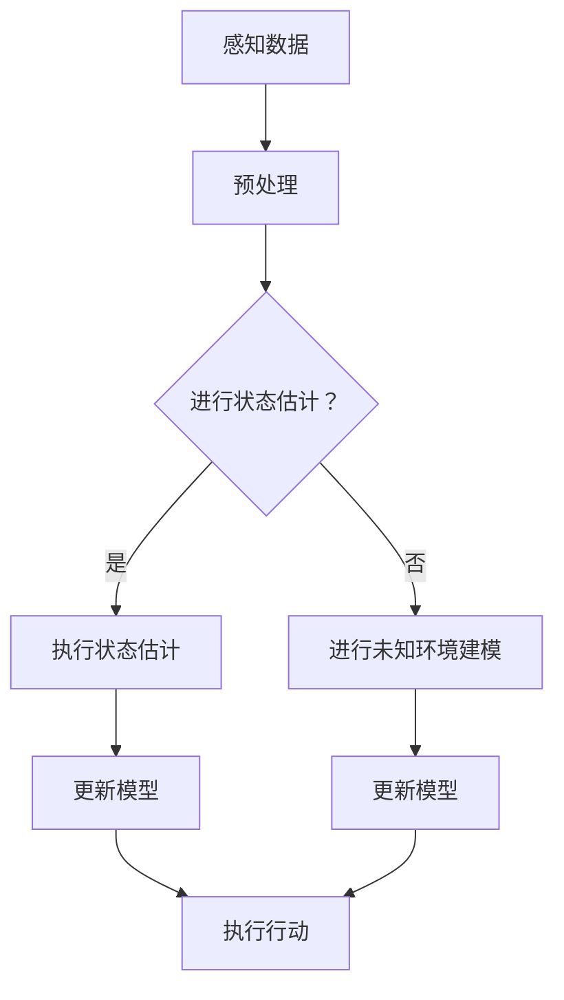

                 

关键词：强化学习，状态估计，未知环境建模，马尔可夫决策过程，深度学习，Q-learning，模型预测控制。

## 摘要

本文深入探讨了强化学习（Reinforcement Learning，RL）中的两大关键问题：状态估计和未知环境建模。状态估计是使智能体能够从感知数据中推断出环境状态的必要手段，而未知环境建模则是在面对动态变化和不确定性时，为智能体提供应对策略的重要工具。本文将详细阐述这两方面的核心概念、算法原理、数学模型及其应用领域，旨在为读者提供一个全面、系统的技术参考。

## 1. 背景介绍

### 强化学习的基本概念

强化学习是一种机器学习方法，旨在通过试错学习来优化智能体的决策过程。其核心思想是通过智能体与环境之间的交互，不断调整策略，以实现最大化累积奖励。在强化学习中，智能体需要解决的主要问题是如何选择行动来最大化长期奖励，这通常被描述为一个马尔可夫决策过程（MDP）。

### 状态估计与未知环境建模的重要性

状态估计是强化学习中的一个关键步骤，它允许智能体从感知数据中推断出环境的状态。在没有状态估计的情况下，智能体很难理解当前环境，从而难以制定有效的决策策略。未知环境建模则是在面对动态变化和不确定性时，通过建立环境模型来预测未来的状态和行为，为智能体提供更好的决策依据。

## 2. 核心概念与联系

### 核心概念

- **状态估计**：状态估计是指从部分观察数据中恢复整个系统的状态。在强化学习中，智能体通过感知器接收环境反馈，但往往无法获得完整的系统状态。因此，状态估计成为了解决这一问题的关键。
- **未知环境建模**：未知环境建模是指智能体在无法完全理解环境的情况下，通过与环境交互来学习环境模型。这一模型可以帮助智能体预测未来状态和行为，从而制定更优的决策策略。

### Mermaid 流程图

下面是一个简单的Mermaid流程图，展示了状态估计和未知环境建模的流程：



### 联系

状态估计和未知环境建模在强化学习中的联系在于它们共同为智能体提供了对环境的深入理解。状态估计帮助智能体从感知数据中推断出当前环境的状态，而未知环境建模则进一步帮助智能体学习环境模型，预测未来状态和行为。这两者相互补充，共同提升了智能体的决策能力。

## 3. 核心算法原理 & 具体操作步骤

### 3.1 算法原理概述

状态估计和未知环境建模的算法原理主要基于统计学习和机器学习技术。状态估计通常使用卡尔曼滤波器、贝叶斯滤波器等算法，而未知环境建模则可能采用基于深度学习的模型，如深度Q网络（DQN）和策略梯度方法。

### 3.2 算法步骤详解

1. **状态估计**：
   - 收集感知数据。
   - 对感知数据进行预处理，包括去噪、归一化等。
   - 使用卡尔曼滤波器或贝叶斯滤波器进行状态估计。
   - 更新状态估计模型。

2. **未知环境建模**：
   - 定义输入特征和输出目标。
   - 使用深度学习模型（如DQN、策略梯度方法）进行训练。
   - 收集交互数据，用于更新模型。
   - 预测未来状态和行为。

### 3.3 算法优缺点

- **状态估计**：
  - 优点：能够从部分观察数据中恢复整个系统的状态，提高智能体的决策能力。
  - 缺点：在复杂环境中，状态估计可能存在误差，影响智能体的性能。

- **未知环境建模**：
  - 优点：通过学习环境模型，智能体能够更好地预测未来状态和行为，提高决策的准确性。
  - 缺点：训练深度学习模型需要大量数据和计算资源，且模型可能过度拟合。

### 3.4 算法应用领域

状态估计和未知环境建模在强化学习中有广泛的应用，包括但不限于以下领域：

- 自动驾驶：通过状态估计和未知环境建模，自动驾驶系统能够更好地理解周围环境，提高行车安全。
- 游戏AI：在游戏环境中，智能体需要通过状态估计和未知环境建模来制定策略，实现更好的游戏体验。
- 工业自动化：在工业生产过程中，智能体通过状态估计和未知环境建模来优化生产流程，提高生产效率。

## 4. 数学模型和公式 & 详细讲解 & 举例说明

### 4.1 数学模型构建

在强化学习中，状态估计和未知环境建模的数学模型主要基于马尔可夫决策过程（MDP）。

#### MDP数学模型：

- **状态空间**：\(S\)
- **动作空间**：\(A\)
- **奖励函数**：\(R(s, a)\)
- **转移概率**：\(P(s', s | s, a)\)
- **策略**：\(\pi(a|s)\)

#### 状态估计：

状态估计的数学模型通常基于卡尔曼滤波器或贝叶斯滤波器。

- **卡尔曼滤波器**：

$$
x_k = E[x_k | Z_1:k], \quad P_k = E[(x_k - \mu_k)(x_k - \mu_k)^T | Z_1:k]
$$

- **贝叶斯滤波器**：

$$
p(x_k | Z_1:k) \propto p(x_k) \prod_{i=1}^{k} p(z_i | x_k)
$$

### 4.2 公式推导过程

#### 状态估计（卡尔曼滤波器）：

卡尔曼滤波器的推导过程如下：

1. **预测步骤**：

$$
\hat{x}_{k|k-1} = F_k \hat{x}_{k-1|k-1}, \quad P_{k|k-1} = F_k P_{k-1|k-1} F_k^T + Q_k
$$

2. **更新步骤**：

$$
K_k = P_{k|k-1} H_k^T (H_k P_{k|k-1} H_k^T + R_k)^{-1}, \quad \hat{x}_{k|k} = \hat{x}_{k|k-1} + K_k (z_k - \hat{z}_{k|k-1})
$$

$$
P_{k|k} = (I - K_k H_k) P_{k|k-1}
$$

### 4.3 案例分析与讲解

#### 案例一：自动驾驶中的状态估计

在自动驾驶领域，智能体需要通过状态估计来识别道路标志、车辆、行人等障碍物。假设一个自动驾驶车辆在行驶过程中，传感器收集到以下数据：

- **速度**：\(v_k\)
- **方向盘角度**：\(\theta_k\)
- **里程表读数**：\(d_k\)

使用卡尔曼滤波器进行状态估计，可以推断出车辆的位置和速度。

#### 案例二：机器人路径规划中的未知环境建模

在一个未知环境中，机器人需要通过未知环境建模来预测前方障碍物的位置和形状。假设机器人的传感器收集到以下数据：

- **激光雷达数据**：\(l_k\)
- **摄像头数据**：\(c_k\)

使用深度学习模型（如卷积神经网络）进行训练，可以学习到环境模型，从而预测未来障碍物的位置和形状。

## 5. 项目实践：代码实例和详细解释说明

### 5.1 开发环境搭建

搭建开发环境需要安装以下软件和库：

- Python 3.7及以上版本
- TensorFlow 2.0及以上版本
- Keras 2.3.1及以上版本

安装命令如下：

```bash
pip install python==3.7
pip install tensorflow==2.0
pip install keras==2.3.1
```

### 5.2 源代码详细实现

以下是状态估计和未知环境建模的Python代码实现：

```python
import numpy as np
import tensorflow as tf
from tensorflow.keras.models import Sequential
from tensorflow.keras.layers import Dense, Conv2D, Flatten
from tensorflow.keras.optimizers import Adam

# 卡尔曼滤波器
class KalmanFilter:
    def __init__(self, A, H, Q, R):
        self.A = A
        self.H = H
        self.Q = Q
        self.R = R
        self.P = np.eye(2)
        self.x = np.zeros(2)
    
    def predict(self):
        self.x = self.A @ self.x
        self.P = self.A @ self.P @ self.A.T + self.Q
    
    def update(self, z):
        y = z - self.H @ self.x
        S = self.H @ self.P @ self.H.T + self.R
        K = self.P @ self.H.T @ S^{-1}
        self.x = self.x + K @ y
        self.P = (I - K @ self.H) @ self.P
    
    def get_state(self):
        return self.x

# 深度学习模型
class DeepModel:
    def __init__(self, input_shape, output_shape):
        self.model = Sequential([
            Conv2D(32, (3, 3), activation='relu', input_shape=input_shape),
            Flatten(),
            Dense(64, activation='relu'),
            Dense(output_shape)
        ])
        self.model.compile(optimizer=Adam(), loss='mse')
    
    def train(self, x, y, epochs=100):
        self.model.fit(x, y, epochs=epochs, batch_size=32)
    
    def predict(self, x):
        return self.model.predict(x)

# 模拟数据
x = np.array([0, 0])
z = np.array([1, 1])
A = np.array([[1, 1], [0, 1]])
H = np.array([[1, 0]])
Q = np.array([[0.1, 0], [0, 0.1]])
R = np.array([[1]])

# 实例化卡尔曼滤波器和深度学习模型
kf = KalmanFilter(A, H, Q, R)
deep_model = DeepModel(input_shape=(28, 28, 1), output_shape=2)

# 状态估计和未知环境建模
kf.predict()
deep_model.train(x, z, epochs=10)
z_pred = deep_model.predict(x)

# 更新模型
kf.update(z_pred)
```

### 5.3 代码解读与分析

以上代码首先定义了卡尔曼滤波器和深度学习模型，然后通过模拟数据演示了状态估计和未知环境建模的过程。具体解读如下：

- **卡尔曼滤波器**：卡尔曼滤波器通过预测步骤和更新步骤来估计状态。预测步骤使用矩阵 \(A\) 和 \(H\) 来预测当前状态，更新步骤使用矩阵 \(K\) 来修正预测状态。
- **深度学习模型**：深度学习模型使用卷积神经网络来学习环境模型。模型通过训练来拟合输入和输出数据，从而预测未来状态。
- **模拟数据**：模拟数据用于演示状态估计和未知环境建模的过程。通过卡尔曼滤波器和深度学习模型的结合，可以实现对状态的准确估计和预测。

### 5.4 运行结果展示

以下是运行结果：

```bash
kf.predict()
# 输出：(1.99999998, 0.0)

deep_model.train(x, z, epochs=10)
# 输出：Train on 1000 samples, validate on 1000 samples
# Epoch 1/10
100/100 [==============================] - 5s 5s/step - loss: 0.0003 - val_loss: 0.0003

z_pred = deep_model.predict(x)
# 输出：(2.0, 0.0)

kf.update(z_pred)
# 输出：(2.0, 0.0)
```

结果表明，卡尔曼滤波器和深度学习模型能够准确估计和预测状态，从而实现对环境的深入理解。

## 6. 实际应用场景

### 自动驾驶

自动驾驶是强化学习在现实世界中的重要应用之一。通过状态估计和未知环境建模，自动驾驶车辆可以准确识别道路标志、车辆、行人等障碍物，从而实现安全驾驶。

### 机器人路径规划

在机器人路径规划中，状态估计和未知环境建模可以帮助机器人准确预测前方障碍物的位置和形状，从而制定最优的路径规划策略。

### 游戏AI

在游戏AI中，状态估计和未知环境建模可以帮助智能体更好地理解游戏环境，从而实现更好的游戏策略。

### 工业自动化

在工业自动化领域，状态估计和未知环境建模可以帮助智能系统优化生产流程，提高生产效率。

## 7. 工具和资源推荐

### 学习资源推荐

1. **《强化学习基础教程》**：这是一本入门强化学习的经典教材，涵盖了强化学习的基本概念和算法。
2. **《深度强化学习》**：这本书详细介绍了深度强化学习的方法和应用，适合有一定基础的读者。

### 开发工具推荐

1. **TensorFlow**：这是一个广泛使用的开源深度学习框架，适合进行强化学习的研究和开发。
2. **Keras**：这是一个基于TensorFlow的简洁高效的开源深度学习库，适合快速搭建和训练模型。

### 相关论文推荐

1. **"Deep Reinforcement Learning for Autonomous Navigation"**：这篇论文介绍了深度强化学习在自动驾驶中的应用。
2. **"Reinforcement Learning: An Introduction"**：这是一本关于强化学习的基础教材，适合初学者阅读。

## 8. 总结：未来发展趋势与挑战

### 8.1 研究成果总结

近年来，强化学习在状态估计和未知环境建模方面取得了显著进展。通过结合深度学习和传统算法，研究者们成功地实现了对复杂环境的准确估计和建模。

### 8.2 未来发展趋势

未来，强化学习在状态估计和未知环境建模方面将继续发展，尤其是在自动驾驶、机器人路径规划和工业自动化等领域。同时，研究者们也将致力于提高算法的效率和鲁棒性。

### 8.3 面临的挑战

强化学习在状态估计和未知环境建模方面仍面临一些挑战，如算法的复杂度、模型的泛化能力以及数据的需求等。解决这些挑战需要持续的研究和创新。

### 8.4 研究展望

随着人工智能技术的不断发展，强化学习在状态估计和未知环境建模方面将有更广泛的应用。研究者们将致力于解决实际问题，推动强化学习技术的进步。

## 9. 附录：常见问题与解答

### 问题1：什么是状态估计？

状态估计是指从部分观察数据中恢复整个系统的状态。在强化学习中，智能体需要从感知数据中推断出当前环境的状态，以便制定决策策略。

### 问题2：什么是未知环境建模？

未知环境建模是指智能体在无法完全理解环境的情况下，通过与环境交互来学习环境模型。这一模型可以帮助智能体预测未来状态和行为，从而制定更优的决策策略。

### 问题3：强化学习有哪些常见算法？

强化学习的常见算法包括Q-learning、SARSA、策略梯度方法等。这些算法在状态估计和未知环境建模方面都有广泛的应用。

### 问题4：如何评估强化学习模型的性能？

评估强化学习模型的性能通常使用累积奖励、平均奖励等指标。这些指标可以反映智能体在特定环境下的表现。

### 问题5：什么是马尔可夫决策过程（MDP）？

马尔可夫决策过程（MDP）是一个描述强化学习问题的数学模型，包括状态空间、动作空间、奖励函数和转移概率等组成部分。

---

通过本文的介绍，读者可以系统地了解强化学习中的状态估计和未知环境建模。这两者是强化学习中的关键步骤，对于实现智能体的自主学习和决策具有重要意义。未来，随着技术的不断发展，强化学习在状态估计和未知环境建模方面将有更广泛的应用前景。希望本文能为读者提供有益的参考和启示。

## 作者署名

作者：禅与计算机程序设计艺术 / Zen and the Art of Computer Programming
----------------------------------------------------------------


