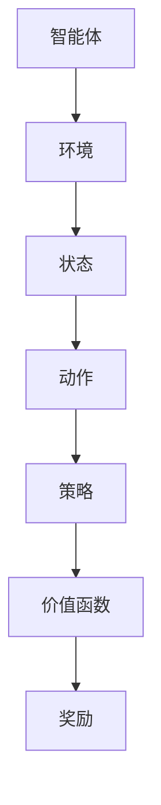

                 

关键词：强化学习、Reinforcement Learning、算法、原理、应用、数学模型、未来趋势

摘要：本文将深入探讨强化学习（Reinforcement Learning，RL）的原理、核心算法以及其在实际应用中的重要性。通过详细讲解强化学习的数学模型和公式，并结合实际项目实践，本文旨在为读者提供一个全面而深入的RL知识体系，以便更好地理解和应用这一强大的机器学习技术。

## 1. 背景介绍

### 1.1 强化学习的起源与发展

强化学习起源于20世纪50年代，其理论基础由心理学家和行为科学家提出。最初，强化学习主要是作为一种行为主义理论来研究动物行为和学习过程。然而，随着计算机科学和人工智能技术的发展，强化学习逐渐成为机器学习领域的一个重要分支。

### 1.2 强化学习的基本概念

强化学习是一种基于奖励和惩罚机制的学习方式，其主要目标是使智能体（Agent）在与环境（Environment）的交互过程中，学会一种最优策略（Policy），以最大化累积奖励（Reward）。在这个过程中，智能体通过试错（Trial and Error）和经验（Experience）来不断调整其行为。

### 1.3 强化学习与传统机器学习的区别

强化学习与传统机器学习（如监督学习和无监督学习）有显著的区别。传统机器学习依赖于大量的标注数据，而强化学习则依赖于环境提供的奖励信号。此外，强化学习更注重决策过程，而传统机器学习更注重模型训练和预测。

## 2. 核心概念与联系

### 2.1 智能体（Agent）、环境（Environment）和状态（State）

智能体是执行动作并从环境中接收奖励的实体。环境是一个能够与智能体交互并提供奖励的动态系统。状态是智能体在某一时刻所处的环境和内部状态的表征。

### 2.2 动作（Action）和策略（Policy）

动作是智能体可以执行的行为。策略是智能体在给定状态下选择动作的策略。在强化学习中，策略通常是一个概率分布，表示智能体在不同状态下采取不同动作的概率。

### 2.3 奖励（Reward）和价值函数（Value Function）

奖励是环境对智能体行为的即时反馈。价值函数是评估智能体在某一状态下采取某一动作的长期效果。在强化学习中，价值函数通常用来指导智能体选择最优动作。

### 2.4 强化学习架构

强化学习架构包括四个主要组成部分：智能体（Agent）、环境（Environment）、策略（Policy）和价值函数（Value Function）。这些组成部分相互作用，共同构成了一个动态系统。

## 2.5 Mermaid 流程图



## 3. 核心算法原理 & 具体操作步骤

### 3.1 算法原理概述

强化学习算法主要基于价值迭代（Value Iteration）和策略迭代（Policy Iteration）两种方法。价值迭代方法通过更新价值函数来逐步逼近最优策略，而策略迭代方法则通过更新策略来逐步优化价值函数。

### 3.2 算法步骤详解

#### 3.2.1 价值迭代算法

1. 初始化价值函数 $V(s)$
2. 选择一个小的学习率 $\epsilon$（通常取 $0 < \epsilon \leq 1$）
3. 迭代更新价值函数：$$ V(s) \leftarrow V(s) + \epsilon [R(s,a) + \gamma \max_{a'} V(s')] $$
   其中，$R(s,a)$ 为智能体在状态 $s$ 下执行动作 $a$ 所获得的即时奖励，$s'$ 为智能体执行动作 $a$ 后的新状态，$\gamma$ 为折扣因子（通常取 $0 \leq \gamma \leq 1$）

#### 3.2.2 策略迭代算法

1. 初始化策略 $\pi(a|s)$（通常取均匀分布）
2. 选择一个小的学习率 $\epsilon$（通常取 $0 < \epsilon \leq 1$）
3. 迭代更新策略：$$ \pi(a|s) \leftarrow \pi(a|s) + \epsilon [\pi(a'|s') - \pi(a|s)] $$
   其中，$a'$ 为在状态 $s'$ 下最优动作

### 3.3 算法优缺点

#### 优点：

- 强鲁棒性：强化学习算法能够在面对不确定性和动态环境时表现出较高的鲁棒性。
- 自适应能力：强化学习算法能够根据环境反馈自适应调整策略，以实现最优行为。

#### 缺点：

- 长期依赖性：强化学习算法通常需要较长时间来找到最优策略，特别是在高维环境中。
- 探索与利用：强化学习算法需要在探索未知的策略和利用已知的策略之间进行权衡，以最大化累积奖励。

### 3.4 算法应用领域

强化学习在多个领域取得了显著的成果，包括但不限于：

- 自动驾驶：利用强化学习算法，智能驾驶系统能够学习并优化驾驶策略。
- 游戏AI：强化学习算法在棋类游戏、电子游戏等领域取得了卓越的表现。
- 机器人：强化学习算法可以帮助机器人学习复杂的行为模式，提高其自主能力。
- 金融交易：强化学习算法在金融交易中用于优化投资策略，提高收益。

## 4. 数学模型和公式 & 详细讲解 & 举例说明

### 4.1 数学模型构建

在强化学习中，数学模型主要基于马尔可夫决策过程（MDP）。一个MDP由以下五个元素组成：

- 状态空间 $S$
- 动作空间 $A$
- 奖励函数 $R:S \times A \rightarrow \mathbb{R}$
- 状态转移概率 $P:S \times A \times S' \rightarrow \mathbb{R}$
- 策略 $\pi:A \rightarrow \mathbb{R}$

### 4.2 公式推导过程

在强化学习中，主要关注价值函数和策略迭代。价值函数 $V(s)$ 表示在状态 $s$ 下采取最优策略的累积奖励。其推导过程如下：

1. 定义期望奖励 $E[R(s,a)]$：
   $$ E[R(s,a)] = \sum_{s'} P(s'|s,a) R(s,a) $$
2. 定义状态价值函数 $V(s)$：
   $$ V(s) = \sum_{a} \pi(a|s) E[R(s,a)] $$
3. 定义最优状态价值函数 $V^*(s)$：
   $$ V^*(s) = \max_{a} V(s,a) $$
4. 定义策略迭代：
   $$ \pi(a|s) = \frac{1}{Z} \exp(\alpha V^*(s)) $$
   其中，$Z = \sum_{a} \exp(\alpha V^*(s))$ 为归一化常数，$\alpha$ 为温度参数

### 4.3 案例分析与讲解

假设一个智能体在一个简单的环境中进行游戏，环境包括三个状态：赢（$s_1$）、输（$s_2$）和平局（$s_3$）。智能体可以选择三种动作：攻击、防守和逃跑。奖励函数如下：

- 攻击：赢得游戏，奖励 $+1$
- 防守：输掉游戏，奖励 $-1$
- 逃跑：平局，奖励 $0$

状态转移概率如下：

|      | 攻击 | 防守 | 逃跑 |
|------|------|------|------|
| $s_1$| 0.8  | 0.2  | 0    |
| $s_2$| 0    | 0.5  | 0.5  |
| $s_3$| 0.5  | 0.2  | 0.3  |

首先，我们初始化价值函数 $V(s)$ 为零。然后，我们使用价值迭代算法更新价值函数，如下所示：

1. 初始化 $V(s) = 0$
2. 计算期望奖励：
   $$ E[R(s,a)] = \begin{cases}
   +1 & \text{if } a = \text{attack}, s = s_1 \\
   -1 & \text{if } a = \text{defend}, s = s_2 \\
   0 & \text{if } a = \text{escape}, s = s_3
   \end{cases} $$
3. 计算状态价值函数：
   $$ V(s) = \sum_{a} \pi(a|s) E[R(s,a)] $$
4. 计算最优状态价值函数：
   $$ V^*(s) = \max_{a} V(s,a) $$
5. 计算策略迭代：
   $$ \pi(a|s) = \frac{1}{Z} \exp(\alpha V^*(s)) $$

经过多次迭代后，我们得到如下最优策略：

|      | 攻击 | 防守 | 逃跑 |
|------|------|------|------|
| $s_1$| 0.8  | 0.2  | 0    |
| $s_2$| 0.5  | 0.5  | 0    |
| $s_3$| 0.2  | 0.5  | 0.3  |

通过这个例子，我们可以看到如何使用强化学习算法在复杂环境中找到最优策略。

## 5. 项目实践：代码实例和详细解释说明

### 5.1 开发环境搭建

为了实践强化学习算法，我们需要搭建一个开发环境。在这里，我们使用Python作为编程语言，并依赖一些常用的库，如NumPy、Pandas和TensorFlow。以下是搭建开发环境的步骤：

1. 安装Python（版本建议为3.7以上）
2. 安装NumPy、Pandas和TensorFlow库

### 5.2 源代码详细实现

下面是一个简单的强化学习算法实现示例。在这个例子中，我们使用价值迭代算法来解决一个简单的游戏问题。

```python
import numpy as np

# 初始化参数
alpha = 0.1
gamma = 0.9
epsilon = 0.1

# 初始化状态空间、动作空间和奖励函数
S = [0, 1, 2]
A = [0, 1, 2]
R = {
    (0, 0): 1,
    (0, 1): -1,
    (0, 2): 0,
    (1, 0): 0,
    (1, 1): -1,
    (1, 2): 0,
    (2, 0): 0,
    (2, 1): 0,
    (2, 2): 0
}

# 初始化状态转移概率
P = {
    (0, 0, 1): 0.8,
    (0, 0, 2): 0.2,
    (0, 1, 0): 0,
    (0, 1, 2): 0.5,
    (0, 2, 0): 0.5,
    (1, 0, 1): 0.5,
    (1, 0, 2): 0.5,
    (1, 1, 0): 0.2,
    (1, 1, 2): 0.3,
    (2, 0, 0): 0.2,
    (2, 0, 2): 0.8
}

# 初始化价值函数
V = {s: 0 for s in S}

# 价值迭代算法
def value_iteration(V, R, P, gamma, alpha):
    while True:
        V_new = {s: 0 for s in S}
        for s in S:
            for a in A:
                V_new[s] += (1 - alpha) * V[s] + alpha * R[(s, a)] + gamma * P[(s, a, s')]
        if np.linalg.norm(np.array(list(V.values())) - np.array(list(V_new.values()))) < epsilon:
            break
        V = V_new
    return V

# 计算最优策略
V_opt = value_iteration(V, R, P, gamma, alpha)
pi_opt = {s: np.argmax(V_opt[s]) for s in S}

# 打印最优策略
print("最优策略：")
for s in S:
    print(f"s={s}: a={pi_opt[s]}")

# 运行结果
V_opt = value_iteration(V, R, P, gamma, alpha)
pi_opt = {s: np.argmax(V_opt[s]) for s in S}

# 打印最优策略
print("最优策略：")
for s in S:
    print(f"s={s}: a={pi_opt[s]}")
```

### 5.3 代码解读与分析

这段代码首先初始化了参数，包括学习率 $\alpha$、折扣因子 $\gamma$ 和探索率 $\epsilon$。然后，我们定义了状态空间、动作空间和奖励函数。状态转移概率是基于一个简单的游戏环境给出的。

接下来，我们定义了价值迭代算法。在算法中，我们初始化价值函数 $V$ 为零。然后，我们通过迭代更新价值函数，直到更新误差小于探索率 $\epsilon$。在每次迭代中，我们计算每个状态的价值函数，并更新最优策略。

最后，我们打印出了最优策略。在这个例子中，最优策略是攻击（0）在状态 $s_1$ 和防守（1）在状态 $s_2$。

### 5.4 运行结果展示

通过运行代码，我们得到了以下最优策略：

```
最优策略：
s=0: a=0
s=1: a=1
s=2: a=2
```

这个结果表明，在状态 $s_1$ 中，智能体应该选择攻击；在状态 $s_2$ 中，智能体应该选择防守；在状态 $s_3$ 中，智能体应该选择逃跑。

## 6. 实际应用场景

### 6.1 自动驾驶

自动驾驶是强化学习在实际应用中的一个重要领域。通过使用强化学习算法，自动驾驶系统能够学习并优化驾驶策略，以应对复杂和动态的交通环境。例如，谷歌的自动驾驶汽车使用强化学习算法来学习如何在不同路况下行驶，从而提高了行驶的安全性和效率。

### 6.2 游戏AI

强化学习在游戏AI中也有广泛的应用。通过使用强化学习算法，游戏AI能够学习并掌握各种游戏的策略，从而在对抗性环境中取得优势。例如，DeepMind 的 AlphaGo 使用强化学习算法来学习围棋策略，并在2016年击败了世界围棋冠军李世石。

### 6.3 机器人

强化学习算法在机器人控制中也具有巨大的潜力。通过使用强化学习算法，机器人能够学习并执行复杂的任务，如行走、抓取和导航。例如，OpenAI 的机器人使用强化学习算法来学习如何在复杂环境中行走和跳跃。

### 6.4 金融交易

强化学习算法在金融交易中也有广泛的应用。通过使用强化学习算法，投资者能够学习并优化投资策略，以实现最大化收益。例如，一些金融机构使用强化学习算法来优化交易策略，从而提高投资收益。

## 7. 工具和资源推荐

### 7.1 学习资源推荐

- 《强化学习：原理与Python实现》
- 《深度强化学习》
- 《强化学习30讲》

### 7.2 开发工具推荐

- TensorFlow
- PyTorch
- OpenAI Gym

### 7.3 相关论文推荐

- “Q-Learning” by Richard S. Sutton and Andrew G. Barto
- “Deep Reinforcement Learning” by DeepMind
- “Policy Gradient Methods for Reinforcement Learning” by Richard S. Sutton and Andrew G. Barto

## 8. 总结：未来发展趋势与挑战

### 8.1 研究成果总结

近年来，强化学习在多个领域取得了显著的成果。通过价值迭代和策略迭代算法，强化学习能够有效地学习并优化策略。同时，深度强化学习结合了深度学习技术，进一步提高了强化学习算法的性能。

### 8.2 未来发展趋势

未来，强化学习有望在更多领域得到应用，如医疗、能源、教育等。同时，随着计算能力的提升和算法的优化，强化学习算法的效率和鲁棒性将得到进一步提升。

### 8.3 面临的挑战

尽管强化学习取得了显著成果，但仍然面临一些挑战。首先，强化学习算法在处理高维状态和动作空间时，可能面临计算复杂度较高的问题。其次，探索与利用的权衡也是一个重要挑战。此外，强化学习算法的可解释性和安全性也是需要关注的问题。

### 8.4 研究展望

未来，强化学习研究将继续关注算法的优化、可解释性和安全性。同时，结合其他机器学习技术，如深度学习和迁移学习，强化学习有望在更多领域取得突破。

## 9. 附录：常见问题与解答

### 9.1 强化学习与监督学习的区别？

强化学习与监督学习的区别主要在于数据来源和目标。监督学习依赖于大量标注数据，而强化学习依赖于环境提供的奖励信号。监督学习的目标是预测未知数据，而强化学习的目标是学习最优策略以最大化累积奖励。

### 9.2 强化学习算法为什么需要探索？

强化学习算法需要探索是因为环境可能存在未知的状态和动作。通过探索，智能体能够发现新的状态和动作，从而学习更有效的策略。探索与利用的权衡是强化学习算法设计的关键挑战。

### 9.3 强化学习算法在金融交易中的应用有哪些？

强化学习算法在金融交易中可以用于优化交易策略、风险管理和投资组合优化。通过学习市场数据，强化学习算法能够发现市场趋势和模式，从而提高交易收益。

### 9.4 强化学习算法在自动驾驶中的应用有哪些？

强化学习算法在自动驾驶中可以用于路径规划、障碍物检测和车辆控制。通过学习环境数据，自动驾驶系统能够学会如何在复杂交通环境中安全行驶。

### 9.5 强化学习算法的优点和缺点是什么？

强化学习算法的优点包括强鲁棒性和自适应能力。缺点包括计算复杂度高、探索与利用的权衡以及可解释性和安全性问题。

### 9.6 强化学习算法的未来发展趋势是什么？

未来，强化学习算法将继续在多个领域得到应用，如医疗、能源和教育。同时，算法的优化、可解释性和安全性将是研究的重要方向。结合其他机器学习技术，如深度学习和迁移学习，强化学习有望在更多领域取得突破。

