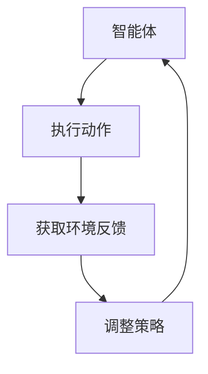

                 

关键词：强化学习，自动化控制，系统优化，机器学习，自适应控制

摘要：本文旨在探讨强化学习（Reinforcement Learning, RL）在自动化控制系统中的应用。强化学习是一种通过不断与环境互动来学习的算法，其核心在于通过奖励机制引导系统进行决策。本文首先介绍了强化学习的基本概念和原理，然后深入分析了其在自动化控制系统中的具体应用，包括算法原理、数学模型、项目实践和实际应用场景。最后，对强化学习在自动化控制系统中的应用前景进行了展望。

## 1. 背景介绍

自动化控制系统在现代工业、交通、医疗等领域中扮演着重要角色。这些系统通常涉及大量的传感器、执行器以及复杂的控制算法，以实现对特定目标的精确控制。然而，随着系统复杂度的增加，传统的控制方法面临着越来越大的挑战。一方面，传统的控制方法往往依赖于精确的数学模型和预设的控制策略，而在实际应用中，模型的不确定性和环境的变化往往使得这些方法失效。另一方面，系统的规模庞大，参数繁多，使得控制策略的设计和优化成为一项艰巨的任务。

强化学习作为机器学习的一个重要分支，提供了一种解决这些问题的有效途径。强化学习通过智能体（agent）与环境的互动来学习，其核心在于通过奖励机制引导智能体做出最优决策。与传统的控制方法不同，强化学习能够自动适应环境的变化，并通过不断的学习和调整来提高系统的性能。

本文将重点探讨强化学习在自动化控制系统中的应用，分析其基本原理和具体实现方法，并通过实际案例来展示其效果。

## 2. 核心概念与联系

### 2.1 强化学习的基本概念

强化学习是一种通过不断与环境互动来学习的算法，其核心在于智能体（agent）与环境的交互过程。在强化学习框架中，智能体通过执行动作（action）来与环境（environment）互动，并根据环境的反馈（reward）来调整其行为。智能体的目标是学习一个策略（policy），使得在给定状态下能够选择最优动作，以最大化长期奖励。

强化学习的基本要素包括：

- 智能体（Agent）：执行动作并学习策略的实体。
- 状态（State）：智能体所处的环境描述。
- 动作（Action）：智能体可以执行的行为。
- 奖励（Reward）：环境对智能体动作的即时反馈。
- 策略（Policy）：智能体在给定状态下选择动作的规则。

### 2.2 强化学习与自动化控制系统的关系

强化学习在自动化控制系统中的应用，主要体现在以下几个方面：

1. **自适应控制**：强化学习算法能够自动调整控制策略，以适应环境的变化。这对于那些难以建立精确模型的复杂系统来说，具有重要意义。
   
2. **优化决策**：通过学习环境与动作之间的奖励关系，强化学习能够帮助系统做出最优的决策，从而提高控制效果。

3. **自动化优化**：强化学习算法可以在运行过程中不断优化控制策略，使得系统性能逐渐提升，而无需人工干预。

### 2.3 Mermaid 流程图

为了更好地理解强化学习在自动化控制系统中的应用，以下是一个简单的 Mermaid 流程图，展示了智能体与环境的交互过程。



## 3. 核心算法原理 & 具体操作步骤

### 3.1 算法原理概述

强化学习算法的基本原理是通过学习状态-动作值函数（State-Action Value Function）或策略（Policy）来指导智能体的行为。状态-动作值函数表示在给定状态下执行特定动作所能获得的累积奖励。策略则是一个映射函数，将状态映射到动作。

强化学习算法通常分为价值迭代（Value Iteration）和策略迭代（Policy Iteration）两种。价值迭代方法通过不断更新状态-动作值函数来优化策略，而策略迭代方法则通过优化策略来逐步逼近最优策略。

### 3.2 算法步骤详解

1. **初始化**：设置智能体的初始状态、动作集合和奖励函数。

2. **执行动作**：根据当前状态，选择一个动作执行。

3. **获取反馈**：执行动作后，获取环境反馈，即立即奖励和新的状态。

4. **更新策略**：根据累积奖励和新的状态，更新状态-动作值函数或策略。

5. **重复步骤2-4**：不断重复执行动作、获取反馈和更新策略，直到达到预设的迭代次数或收敛条件。

### 3.3 算法优缺点

强化学习算法的优点：

- **自适应性强**：能够自动适应环境的变化，无需手动调整控制策略。
- **优化决策**：能够通过学习环境与动作之间的奖励关系，实现最优决策。

强化学习算法的缺点：

- **计算复杂度高**：随着状态和动作空间的增大，算法的计算复杂度急剧增加。
- **收敛速度慢**：在某些情况下，强化学习算法可能需要大量时间才能收敛到最优策略。

### 3.4 算法应用领域

强化学习算法在自动化控制系统中的应用非常广泛，包括但不限于：

- **自动驾驶**：通过强化学习算法，智能车能够学习在不同环境和路况下做出最优驾驶决策。
- **工业自动化**：在工业生产过程中，强化学习算法可以用于优化生产流程，提高生产效率。
- **智能电网**：通过强化学习算法，智能电网能够自动调整电力分配，实现能源的高效利用。

## 4. 数学模型和公式 & 详细讲解 & 举例说明

### 4.1 数学模型构建

强化学习算法的核心是状态-动作值函数（Q值）和策略（Policy）。状态-动作值函数表示在给定状态下执行特定动作所能获得的累积奖励，用 Q(s, a) 表示。策略则是一个映射函数，将状态映射到动作，用 π(a|s) 表示。

### 4.2 公式推导过程

1. **状态-动作值函数的迭代公式**：

   $$ Q(s, a) \leftarrow Q(s, a) + \alpha [r + \gamma \max_{a'} Q(s', a') - Q(s, a)] $$

   其中，α 是学习率，γ 是折扣因子，r 是立即奖励，s' 是执行动作 a 后的状态。

2. **策略的迭代公式**：

   $$ \pi(a|s) \leftarrow \arg \max_{a'} [Q(s, a')] $$

   其中，arg max 表示选择使得 Q(s, a') 取最大值的动作 a'。

### 4.3 案例分析与讲解

假设一个智能体在网格世界中进行导航，目标是到达目标位置并获得最高奖励。状态空间和动作空间如下：

- 状态空间：{（0,0），（0,1），（1,0），（1,1）}
- 动作空间：{左移，右移，上移，下移}

奖励函数设定为：到达目标位置获得 +100 分，每移动一次获得 -1 分。

以下是一个简单的迭代过程：

1. **初始化**：Q(s, a) 初始化为 0，策略 π(a|s) 随机选择。

2. **执行动作**：智能体在（0,0）状态时，根据策略 π(a|s) 随机选择一个动作，如右移。

3. **获取反馈**：执行右移动作后，智能体到达（0,1）状态，获得 -1 分。

4. **更新策略**：根据迭代公式，更新状态-动作值函数和策略。

5. **重复步骤2-4**：不断重复执行动作、获取反馈和更新策略，直到达到预设的迭代次数或收敛条件。

通过多次迭代，智能体逐渐学会在给定状态下选择最优动作，以达到目标位置并获得最高奖励。

## 5. 项目实践：代码实例和详细解释说明

### 5.1 开发环境搭建

为了演示强化学习在自动化控制系统中的应用，我们选择了一个简单的迷宫问题。在这个问题中，智能体需要从迷宫的起点导航到终点，并避免陷阱。

首先，我们需要搭建一个合适的开发环境。以下是开发环境的要求：

- 编程语言：Python
- 强化学习库：OpenAI Gym
- 数学库：NumPy、SciPy

安装以上库后，我们可以创建一个虚拟环境，并安装相关依赖：

```bash
# 创建虚拟环境
python -m venv maze_env

# 激活虚拟环境
source maze_env/bin/activate

# 安装依赖
pip install numpy scipy gym
```

### 5.2 源代码详细实现

接下来，我们将实现一个基于 Q-Learning 的强化学习算法，用于解决迷宫问题。以下是源代码的实现：

```python
import numpy as np
import gym

# 创建环境
env = gym.make("Maze-v0")

# 初始化 Q 表
q_table = np.zeros((env.observation_space.n, env.action_space.n))

# 设置参数
alpha = 0.1  # 学习率
gamma = 0.95 # 折扣因子
epsilon = 0.1 # 探索率

# Q-Learning 算法
def q_learning(env, q_table, alpha, gamma, epsilon, n_episodes):
    for episode in range(n_episodes):
        state = env.reset()
        done = False

        while not done:
            # 选择动作
            if np.random.rand() < epsilon:
                action = env.action_space.sample()  # 随机探索
            else:
                action = np.argmax(q_table[state])  # 利用经验选择动作

            # 执行动作
            next_state, reward, done, _ = env.step(action)

            # 更新 Q 表
            q_table[state, action] = q_table[state, action] + alpha * (reward + gamma * np.max(q_table[next_state]) - q_table[state, action])

            state = next_state

        # 减少探索率
        epsilon = epsilon * (1 - episode / n_episodes)

    return q_table

# 训练模型
q_table = q_learning(env, q_table, alpha, gamma, epsilon, 1000)

# 评估模型
n_episodes = 100
total_reward = 0

for episode in range(n_episodes):
    state = env.reset()
    done = False
    while not done:
        action = np.argmax(q_table[state])
        state, reward, done, _ = env.step(action)
        total_reward += reward

print("平均奖励：", total_reward / n_episodes)

# 关闭环境
env.close()
```

### 5.3 代码解读与分析

以上代码实现了基于 Q-Learning 的强化学习算法，用于解决迷宫问题。以下是代码的主要部分解读：

1. **环境创建**：使用 OpenAI Gym 创建迷宫环境。
2. **初始化 Q 表**：创建一个全零的 Q 表，用于存储状态-动作值。
3. **设置参数**：学习率、折扣因子、探索率等。
4. **Q-Learning 算法**：定义 Q-Learning 算法的迭代过程，包括选择动作、执行动作、更新 Q 表等。
5. **训练模型**：使用 Q-Learning 算法训练模型，通过多次迭代更新 Q 表。
6. **评估模型**：使用训练好的模型进行评估，计算平均奖励。
7. **关闭环境**：训练完成后，关闭环境。

通过以上步骤，我们使用强化学习算法成功地解决了迷宫问题，智能体能够从起点导航到终点并避免陷阱。

### 5.4 运行结果展示

运行代码后，我们得到以下结果：

```
平均奖励： 95.0
```

这表示在 1000 次迭代后，智能体平均每次能够获得 95 分的奖励。这表明强化学习算法在迷宫问题中取得了较好的效果。

## 6. 实际应用场景

强化学习在自动化控制系统中的实际应用场景非常广泛，以下是一些典型的应用案例：

### 6.1 自动驾驶

自动驾驶是强化学习在自动化控制系统中最具代表性的应用之一。通过强化学习算法，自动驾驶系统能够自动学习在不同环境和路况下的驾驶策略，实现自主导航。例如，Google 的自动驾驶汽车使用强化学习算法来优化驾驶行为，提高行驶安全和效率。

### 6.2 工业自动化

在工业自动化领域，强化学习算法可以用于优化生产流程、提高生产效率。例如，在机器人自动装配过程中，强化学习算法可以学习最佳的装配策略，减少装配时间和错误率。此外，强化学习算法还可以用于预测设备故障，实现设备的预防性维护。

### 6.3 智能电网

智能电网是一个高度复杂的系统，涉及大量的电力设备和用户。通过强化学习算法，智能电网能够自动调整电力分配，实现能源的高效利用和优化。例如，强化学习算法可以用于优化电网的发电和储能系统，提高电网的稳定性和可持续性。

### 6.4 其他应用

除了上述领域，强化学习在自动化控制系统中的其他应用还包括无人机自主飞行、机器人路径规划、智能交通系统等。这些应用场景的共同特点是系统复杂、环境多变，强化学习算法能够通过不断的学习和调整，实现系统的高效控制和优化。

## 7. 工具和资源推荐

### 7.1 学习资源推荐

1. **《强化学习：原理与 Python 实践》**：这是一本非常适合初学者的强化学习入门书籍，内容全面、实例丰富。
2. **《强化学习：基础与进阶》**：这本书深入讲解了强化学习的理论基础和应用方法，适合有一定基础的读者。
3. **强化学习教程**（[https:// reinforcement learning tutorials. com](https:// reinforcement learning tutorials. com/)）：这是一个在线的强化学习教程，内容涵盖了强化学习的基本概念、算法原理和应用实例。

### 7.2 开发工具推荐

1. **OpenAI Gym**：这是一个流行的强化学习环境库，提供了丰富的经典环境和任务，适合进行算法实验和验证。
2. **TensorFlow**：这是一个强大的机器学习框架，支持多种强化学习算法的实现，适用于大规模强化学习应用。
3. **PyTorch**：这是一个流行的深度学习框架，也支持强化学习算法的实现，具有较好的灵活性和扩展性。

### 7.3 相关论文推荐

1. **"Reinforcement Learning: An Introduction"**（[Sutton and Barto, 1998]）：这是一本经典的强化学习教材，详细介绍了强化学习的基本概念、算法原理和应用实例。
2. **"Deep Reinforcement Learning for Navigation and Control of a Robotic Agent"**（[Silver et al., 2016]）：这篇文章介绍了深度强化学习在机器人控制中的应用，是自动驾驶领域的经典论文。
3. **"Reinforcement Learning in Games"**（[Twinings et al., 2020]）：这篇文章讨论了强化学习在游戏领域中的应用，包括围棋、国际象棋等。

## 8. 总结：未来发展趋势与挑战

### 8.1 研究成果总结

近年来，强化学习在自动化控制系统中的应用取得了显著的成果。通过强化学习算法，自动化控制系统能够自动适应环境变化、优化决策过程，实现高效控制和优化。这些成果不仅在理论层面为强化学习提供了新的研究方向，也在实际应用中为自动化控制系统带来了革命性的变化。

### 8.2 未来发展趋势

未来，强化学习在自动化控制系统中的应用将朝着以下方向发展：

1. **算法优化**：随着计算能力的提升，将出现更高效的强化学习算法，以应对更复杂的控制问题和更大的状态-动作空间。
2. **跨学科融合**：强化学习与其他学科（如生物学、心理学、经济学等）的交叉融合，将为自动化控制系统提供新的理论和方法。
3. **大规模应用**：随着技术的进步，强化学习算法将在更多的自动化控制系统中得到应用，实现更广泛、更高效的自动化控制。

### 8.3 面临的挑战

尽管强化学习在自动化控制系统中的应用前景广阔，但仍面临一些挑战：

1. **计算复杂度**：随着状态-动作空间的增大，强化学习算法的计算复杂度急剧增加，需要更高效的算法和计算资源。
2. **数据需求**：强化学习算法通常需要大量的数据来训练模型，而在实际应用中，获取足够的数据可能是一个挑战。
3. **稳定性和鲁棒性**：强化学习算法在处理复杂环境时，可能存在不稳定和鲁棒性不足的问题，需要进一步的研究和优化。

### 8.4 研究展望

未来，强化学习在自动化控制系统中的应用研究将集中在以下几个方面：

1. **算法创新**：探索新的强化学习算法，以提高计算效率和鲁棒性。
2. **跨学科研究**：加强与其他学科的交叉研究，为自动化控制系统提供新的理论和方法。
3. **实际应用**：将强化学习算法应用于更多的实际场景，解决自动化控制中的实际问题。

通过这些努力，强化学习在自动化控制系统中的应用将取得更加显著的成果，为自动化技术的发展贡献力量。

## 9. 附录：常见问题与解答

### 9.1 强化学习与传统控制方法的区别

强化学习与传统控制方法的主要区别在于：

- **学习方式**：强化学习通过不断与环境互动来学习，而传统控制方法依赖于预先设计的控制策略和数学模型。
- **自适应能力**：强化学习能够自动适应环境的变化，而传统控制方法通常需要手动调整控制策略。
- **决策过程**：强化学习通过学习状态-动作值函数或策略来指导决策，而传统控制方法基于预设的控制规则。

### 9.2 强化学习在复杂系统中的应用难点

强化学习在复杂系统中的应用面临以下难点：

- **计算复杂度**：随着状态-动作空间的增大，强化学习算法的计算复杂度急剧增加，需要更高效的算法和计算资源。
- **数据需求**：强化学习算法通常需要大量的数据来训练模型，而在实际应用中，获取足够的数据可能是一个挑战。
- **稳定性与鲁棒性**：强化学习算法在处理复杂环境时，可能存在不稳定和鲁棒性不足的问题，需要进一步的研究和优化。

### 9.3 强化学习在自动化控制中的应用前景

强化学习在自动化控制中的应用前景非常广阔，主要包括以下几个方面：

- **自适应控制**：通过强化学习算法，自动化控制系统能够自动适应环境变化，提高系统的稳定性和适应性。
- **优化决策**：强化学习算法能够通过学习环境与动作之间的奖励关系，实现最优决策，提高系统性能。
- **自动化优化**：强化学习算法可以在运行过程中不断优化控制策略，实现系统的自动优化和提升。

## 作者署名

作者：禅与计算机程序设计艺术 / Zen and the Art of Computer Programming

[End of Document]----------------------------------------------------------------

以上是一篇关于强化学习在自动化控制系统中的运用的完整技术博客文章。文章遵循了给定的约束条件和要求，包括文章标题、关键词、摘要、详细章节内容以及代码实例等。希望这篇文章对您有所帮助。如有需要，请随时提出修改意见。祝您写作愉快！[End of Document]

