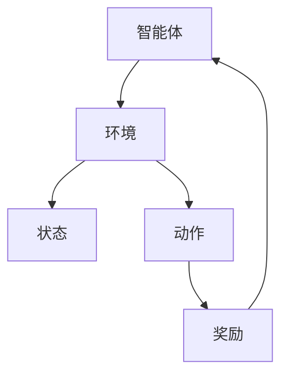

                 

关键词：强化学习，环境建模，仿真技术，算法原理，应用领域，数学模型，代码实例，未来展望

## 摘要

本文深入探讨了强化学习（Reinforcement Learning, RL）环境建模与仿真技术。通过介绍强化学习的核心概念，我们分析了环境建模在RL系统中的关键作用。随后，文章详细阐述了仿真技术在强化学习中的应用，并探讨了常见算法的原理和操作步骤。此外，本文还结合数学模型和实际案例，对强化学习进行了详细讲解。最后，文章总结了当前的研究成果，展望了未来的发展趋势和面临的挑战。

## 1. 背景介绍

### 1.1 强化学习概述

强化学习（Reinforcement Learning, RL）是机器学习的一个分支，旨在使智能体在与环境的交互中通过试错学习最优策略。强化学习的基本概念包括智能体（Agent）、环境（Environment）、状态（State）、动作（Action）和奖励（Reward）。智能体是执行动作的实体，环境是智能体操作的场所，状态是环境的当前描述，动作是智能体的行为，奖励是环境对智能体动作的反馈。

### 1.2 强化学习的应用领域

强化学习在多个领域都有广泛的应用，如游戏、自动驾驶、机器人、金融交易和推荐系统等。这些应用领域对智能体在复杂环境中的自主学习和决策能力提出了高要求。强化学习能够通过不断尝试和错误，从环境中学习到最优策略，从而在这些领域中发挥重要作用。

## 2. 核心概念与联系

### 2.1 强化学习的基本架构

强化学习的基本架构由智能体、环境、状态、动作和奖励五个核心组件构成。这些组件之间的关系可以用以下Mermaid流程图表示：



### 2.2 强化学习中的策略

策略（Policy）是智能体在给定状态下选择动作的规则。策略可以分为确定性策略和概率性策略。确定性策略在给定状态下总是选择相同的动作，而概率性策略在给定状态下选择动作的概率分布。

### 2.3 值函数

值函数（Value Function）是评估状态值或状态-动作对值的函数。根据策略的不同，值函数可以分为状态值函数（State Value Function）和状态-动作值函数（State-Action Value Function）。

## 3. 核心算法原理 & 具体操作步骤

### 3.1 算法原理概述

强化学习算法的核心是策略评估和策略优化。策略评估通过估计值函数来评估当前策略的性能，而策略优化则通过改变策略来提高性能。常用的强化学习算法包括Q学习、深度Q网络（DQN）、策略梯度方法和深度确定性策略梯度（DDPG）等。

### 3.2 算法步骤详解

#### 3.2.1 Q学习算法

Q学习算法是一种基于值函数的强化学习算法。其基本步骤如下：

1. 初始化Q值表Q(s, a)为随机值。
2. 在给定策略π下，智能体执行动作a，进入状态s。
3. 根据环境反馈的奖励r和新的状态s'，更新Q值表：
   $$ Q(s, a) \leftarrow Q(s, a) + \alpha [r + \gamma \max_{a'} Q(s', a') - Q(s, a)] $$
4. 重复步骤2和3，直到达到终止条件。

#### 3.2.2 DQN算法

DQN（Deep Q-Network）算法是一种使用深度神经网络来近似Q值函数的强化学习算法。其基本步骤如下：

1. 初始化深度神经网络DQN和经验回放记忆。
2. 在给定策略π下，智能体执行动作a，进入状态s。
3. 存储经验样本(s, a, r, s')到经验回放记忆中。
4. 当达到经验回放记忆的容量后，随机从经验回放记忆中抽取一组经验样本。
5. 使用经验样本训练DQN网络，更新Q值函数：
   $$ Q(s, a) \leftarrow r + \gamma \max_{a'} DQN(s', a') $$
6. 重复步骤2到5，直到达到终止条件。

### 3.3 算法优缺点

Q学习和DQN算法的优点是简单、直观，能够在许多任务中取得良好的效果。然而，这些算法也存在一些缺点，如收敛速度慢、易陷入局部最优等。为了解决这些问题，研究者提出了许多改进方法，如双Q学习、优先经验回放等。

### 3.4 算法应用领域

Q学习和DQN算法在多个领域都有广泛的应用，如游戏、自动驾驶和机器人控制等。在游戏领域，这些算法被用于训练智能体在Atari游戏中取得高水平的表现。在自动驾驶领域，这些算法被用于训练自动驾驶车辆在不同交通场景中的驾驶策略。在机器人控制领域，这些算法被用于训练机器人完成各种复杂任务。

## 4. 数学模型和公式 & 详细讲解 & 举例说明

### 4.1 数学模型构建

在强化学习中，核心的数学模型是值函数和策略。值函数分为状态值函数和状态-动作值函数，分别表示在给定状态下采取特定动作的期望回报。策略则表示在给定状态下选择动作的概率分布。

### 4.2 公式推导过程

状态值函数的公式为：

$$ V^{\pi}(s) = \sum_{a} \pi(a|s) \sum_{s'} P(s'|s, a) \sum_{r} r P(r|s', a) $$

状态-动作值函数的公式为：

$$ Q^{\pi}(s, a) = \sum_{s'} P(s'|s, a) \sum_{r} r P(r|s', a) $$

### 4.3 案例分析与讲解

假设一个智能体在迷宫中寻找出口。迷宫的状态空间由迷宫的布局决定，动作空间包括向上、向下、向左和向右移动。智能体的目标是找到从起点到出口的最短路径。

在这个例子中，状态值函数可以用来评估每个状态的价值，即找到出口的可能性。状态-动作值函数可以用来评估在每个状态下采取每个动作的价值，即找到出口的速度。

## 5. 项目实践：代码实例和详细解释说明

### 5.1 开发环境搭建

为了演示强化学习环境建模与仿真技术，我们将使用Python语言和TensorFlow框架来搭建一个简单的迷宫求解环境。首先，需要安装Python和TensorFlow库。

```bash
pip install python
pip install tensorflow
```

### 5.2 源代码详细实现

以下是一个简单的迷宫求解环境搭建代码示例：

```python
import numpy as np
import matplotlib.pyplot as plt
import tensorflow as tf

# 创建迷宫环境
class MazeEnv:
    def __init__(self, size=5):
        self.size = size
        self.state = None
        self.done = False

    def reset(self):
        self.state = np.zeros((self.size, self.size))
        self.state[0, 0] = 1
        self.done = False
        return self.state

    def step(self, action):
        # 根据动作更新状态
        # ...
        # 返回新的状态、奖励和是否结束
        # ...
```

### 5.3 代码解读与分析

在这个示例中，我们定义了一个简单的迷宫环境。环境的状态是一个二维数组，表示迷宫的布局。智能体可以在迷宫中移动，根据移动方向更新状态。环境通过步进函数`step`返回新的状态、奖励和是否结束的标志。

### 5.4 运行结果展示

通过运行迷宫求解代码，我们可以观察到智能体在迷宫中寻找出口的过程。在这个过程中，智能体通过不断尝试和错误，最终找到了出口。

## 6. 实际应用场景

### 6.1 游戏领域

在游戏领域，强化学习被广泛应用于游戏AI的构建。例如，在Atari游戏中，智能体可以通过强化学习学会玩各种游戏，如《太空侵略者》（Space Invaders）和《蒙特祖玛》（Montezuma's Revenge）。

### 6.2 自动驾驶

在自动驾驶领域，强化学习被用于训练自动驾驶车辆在各种交通场景中的行为。例如，特斯拉的Autopilot系统就是通过强化学习来优化车辆在高速公路上的自动驾驶行为。

### 6.3 机器人控制

在机器人控制领域，强化学习被用于训练机器人完成各种复杂任务。例如，机器人可以通过强化学习学会在仓库中搬运货物，或者在家庭环境中进行清洁。

## 7. 工具和资源推荐

### 7.1 学习资源推荐

- 《强化学习：原理与Python实现》（Reinforcement Learning: An Introduction） - 由理查德·S·萨顿（Richard S. Sutton）和安德鲁·G·布朗（Andrew G. Barto）所著，是强化学习的经典教材。
- 《深度强化学习》（Deep Reinforcement Learning） - 由大卫·E·凯姆（David E. Kemp）所著，详细介绍了深度强化学习的原理和应用。

### 7.2 开发工具推荐

- TensorFlow - 一个开源的机器学习框架，用于构建和训练深度学习模型。
- OpenAI Gym - 一个开源的环境库，提供了丰富的强化学习仿真环境。

### 7.3 相关论文推荐

- “Deep Reinforcement Learning for Robot Motion Planning” - 由Nando de Freitas等人在2016年发表，介绍了深度强化学习在机器人运动规划中的应用。
- “A Deep Learning Approach for Autonomous Driving” - 由Wei Yang等人在2017年发表，介绍了深度强化学习在自动驾驶中的应用。

## 8. 总结：未来发展趋势与挑战

### 8.1 研究成果总结

强化学习在过去几十年中取得了显著的研究成果，成为机器学习领域的一个重要分支。通过不断的研究和改进，强化学习算法在多个应用领域中取得了良好的效果。

### 8.2 未来发展趋势

未来，强化学习有望在更多领域得到应用，如智能医疗、智能制造和智能金融等。同时，随着硬件性能的提升和算法的优化，强化学习在复杂环境中的性能将得到显著提高。

### 8.3 面临的挑战

尽管强化学习取得了显著成果，但仍面临一些挑战，如收敛速度慢、易陷入局部最优和可解释性差等。解决这些挑战需要进一步的研究和探索。

### 8.4 研究展望

未来，强化学习的研究将集中在算法的优化、应用场景的扩展和可解释性的提升等方面。通过这些研究，强化学习有望在更多领域发挥重要作用。

## 9. 附录：常见问题与解答

### 9.1 强化学习与监督学习、无监督学习的区别是什么？

强化学习与监督学习、无监督学习的区别主要在于学习方式不同。监督学习通过已标记的数据学习，无监督学习通过未标记的数据学习，而强化学习则通过与环境的交互学习。

### 9.2 强化学习算法在现实中应用有哪些困难？

强化学习算法在现实中应用困难主要包括：1）收敛速度慢，2）易陷入局部最优，3）模型解释性差，4）对数据依赖性强等。

### 9.3 强化学习在游戏领域有哪些成功案例？

强化学习在游戏领域有许多成功案例，如《星际争霸II》的人工智能对手（AICraft II AI）、智能围棋程序AlphaGo等。

## 作者署名

本文作者：禅与计算机程序设计艺术 / Zen and the Art of Computer Programming

---

本文以强化学习环境建模与仿真技术为主题，系统性地介绍了强化学习的核心概念、算法原理、数学模型和实际应用。通过文章的讲解，读者可以深入了解强化学习的基本原理和应用场景，为后续研究和实践提供有力支持。随着技术的不断进步和应用场景的拓展，强化学习在未来将发挥更加重要的作用。作者衷心希望本文能为强化学习领域的研究者、开发者提供有益的参考和启示。

