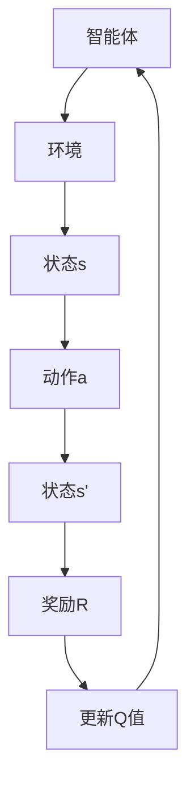

                 

关键词：强化学习，功能性安全，风险管理，算法安全，安全性分析，安全漏洞，威胁建模，网络安全，数据隐私，系统稳定性，应用案例

> 摘要：本文深入探讨了强化学习（Reinforcement Learning, RL）在功能性安全和风险管理方面的重要性。通过分析强化学习的基本原理、核心算法，以及其应用场景，本文提出了一系列保障RL系统安全性的策略和方法。同时，本文针对强化学习面临的安全挑战，如数据隐私、模型泄露、攻击防御等，给出了详细的解决方案。本文旨在为强化学习领域的研究者和从业者提供一个系统性的安全指南。

## 1. 背景介绍

### 1.1 强化学习的起源与发展

强化学习起源于20世纪50年代，由Richard Bellman提出的动态规划理论为其奠定了基础。随着计算能力的提升和大数据时代的到来，强化学习逐渐成为人工智能领域的一个重要分支。特别是在深度学习的推动下，强化学习在游戏、自动驾驶、机器人控制、推荐系统等多个领域取得了显著的成果。

### 1.2 强化学习的定义与核心概念

强化学习是一种通过不断与环境互动来学习最优策略的机器学习方法。其主要目标是使智能体（agent）在特定环境中通过最大化奖励信号来获得长期累积回报。核心概念包括智能体、环境、状态、动作和奖励。

- **智能体（Agent）**：执行动作并感知环境状态的主体。
- **环境（Environment）**：智能体所处的外部世界，能够对智能体的动作做出响应。
- **状态（State）**：环境在某一时刻的状态信息。
- **动作（Action）**：智能体可以采取的动作集合。
- **奖励（Reward）**：对智能体采取的动作给予的评价信号。

### 1.3 强化学习的应用领域

强化学习在诸多领域展现出了强大的潜力，包括但不限于：

- **游戏**：如Atari游戏、棋类游戏等。
- **自动驾驶**：车辆在复杂环境中的路径规划。
- **机器人控制**：机器人手臂的运动规划。
- **推荐系统**：根据用户行为推荐个性化内容。
- **资源分配**：如网络带宽、电力资源等。

## 2. 核心概念与联系

### 2.1 强化学习的核心概念原理

#### 状态-动作值函数（Q值）

状态-动作值函数（Q值）用于评估智能体在特定状态下采取特定动作的期望回报。其数学定义如下：

$$
Q(s, a) = \sum_{s'} p(s' | s, a) \cdot R(s', a) + \gamma \cdot \max_{a'} Q(s', a')
$$

其中，$R(s', a')$为采取动作$a'$后到达状态$s'$的即时回报，$\gamma$为折扣因子，$p(s' | s, a)$为在状态$s$采取动作$a$后到达状态$s'$的概率。

#### 策略（Policy）

策略是智能体在给定状态下采取的动作决策规则，通常表示为概率分布。最优策略是能够使累积回报最大的策略。

#### 值函数（Value Function）

值函数分为状态值函数和状态-动作值函数。状态值函数评估智能体在给定状态下的长期回报，而状态-动作值函数评估智能体在给定状态和动作下的长期回报。

### 2.2 强化学习架构的 Mermaid 流程图



## 3. 核心算法原理 & 具体操作步骤

### 3.1 算法原理概述

强化学习算法主要通过以下四个步骤进行迭代学习：

1. **初始化**：初始化智能体、环境和策略。
2. **选择动作**：根据当前状态和策略选择动作。
3. **执行动作**：智能体在环境中执行动作，并接收新的状态和奖励。
4. **更新策略**：根据新的状态、动作和奖励更新Q值或策略。

### 3.2 算法步骤详解

#### Q-Learning算法

Q-Learning是一种基于值迭代的方法，通过更新状态-动作值函数来优化策略。

1. **初始化Q值**：随机初始化Q值矩阵。
2. **选择动作**：在给定状态s下，选择能够最大化Q值的动作a。
3. **执行动作**：在环境中执行动作a，并接收新的状态s'和奖励R。
4. **更新Q值**：使用下面的公式更新Q值：

$$
Q(s, a) \leftarrow Q(s, a) + \alpha [R(s', a') + \gamma \cdot \max_{a'} Q(s', a') - Q(s, a)]
$$

其中，$\alpha$为学习率，$\gamma$为折扣因子。

#### SARSA算法

SARSA（同步优势估计）是一种基于策略迭代的方法，同时考虑了当前状态和下一步的状态-动作值。

1. **初始化Q值**：随机初始化Q值矩阵。
2. **选择动作**：在给定状态s下，根据当前策略选择动作a。
3. **执行动作**：在环境中执行动作a，并接收新的状态s'和奖励R。
4. **更新Q值**：使用下面的公式更新Q值：

$$
Q(s, a) \leftarrow Q(s, a) + \alpha [R(s', a') + \gamma \cdot Q(s', a') - Q(s, a)]
$$

#### Deep Q-Network (DQN)

DQN是一种基于深度学习的强化学习算法，使用深度神经网络近似Q值函数。

1. **初始化**：初始化深度神经网络和目标神经网络。
2. **选择动作**：使用深度神经网络估计Q值，选择能够最大化Q值的动作。
3. **执行动作**：在环境中执行动作，并接收新的状态和奖励。
4. **更新Q值**：使用经验回放和目标网络来稳定训练过程。

### 3.3 算法优缺点

#### Q-Learning算法

**优点**：

- 简单易懂，易于实现。
- 不需要明确的策略，可以直接学习状态-动作值函数。

**缺点**：

- 可能陷入局部最优。
- 学习效率较低。

#### SARSA算法

**优点**：

- 学习效率较高。
- 可以避免陷入局部最优。

**缺点**：

- 需要明确的策略。

#### DQN算法

**优点**：

- 可以处理高维状态空间。
- 无需显式地定义状态-动作值函数。

**缺点**：

- 需要大量的样本数据。
- 可能出现灾难性遗忘。

### 3.4 算法应用领域

强化学习算法在各种应用领域都有广泛的应用，包括但不限于：

- **游戏**：如Atari游戏、棋类游戏等。
- **自动驾驶**：车辆在复杂环境中的路径规划。
- **机器人控制**：机器人手臂的运动规划。
- **推荐系统**：根据用户行为推荐个性化内容。
- **资源分配**：如网络带宽、电力资源等。

## 4. 数学模型和公式 & 详细讲解 & 举例说明

### 4.1 数学模型构建

强化学习中的数学模型主要包括：

- **状态-动作值函数**：$Q(s, a)$
- **策略**：$\pi(a|s)$
- **值函数**：$V(s) = \mathbb{E}_\pi[G(s)]$

### 4.2 公式推导过程

#### 状态-动作值函数的推导

状态-动作值函数的期望回报可以表示为：

$$
Q(s, a) = \mathbb{E}_\pi[G(s)]
$$

其中，$G(s)$为从状态$s$开始执行策略$\pi$后的累积回报。可以通过贝尔曼方程（Bellman Equation）推导出状态-动作值函数的迭代公式：

$$
Q(s, a) = \mathbb{E}[R(s', a') + \gamma \cdot Q(s', a') | s, a]
$$

#### 策略的推导

策略$\pi(a|s)$可以通过最大化期望回报来推导：

$$
\pi(a|s) = \frac{\exp(\alpha Q(s, a))}{\sum_a \exp(\alpha Q(s, a))}
$$

其中，$\alpha$为温度参数，用于调整策略的随机性。

#### 值函数的推导

值函数$V(s)$可以通过状态-动作值函数和策略来推导：

$$
V(s) = \sum_a \pi(a|s) \cdot Q(s, a)
$$

### 4.3 案例分析与讲解

#### 游戏场景

假设我们使用DQN算法训练一个智能体在Atari游戏《Pong》中学习打乒乓球。

1. **初始化**：初始化深度神经网络和目标神经网络。
2. **选择动作**：使用深度神经网络估计Q值，选择能够最大化Q值的动作。
3. **执行动作**：在环境中执行动作，并接收新的状态和奖励。
4. **更新Q值**：使用经验回放和目标网络来稳定训练过程。

通过反复迭代，智能体可以学会在游戏中打乒乓球。以下是一个简单的训练过程示例：

```python
# 初始化DQN算法参数
learning_rate = 0.001
gamma = 0.99
epsilon = 0.1
batch_size = 32
episodes = 1000

# 初始化神经网络和目标神经网络
Q_network = NeuralNetwork(input_size, output_size)
target_network = NeuralNetwork(input_size, output_size)

# 开始训练
for episode in range(episodes):
    state = environment.reset()
    done = False
    total_reward = 0

    while not done:
        # 选择动作
        if random.random() < epsilon:
            action = random.choice(actions)
        else:
            action = np.argmax(Q_network.predict(state))

        # 执行动作
        next_state, reward, done, _ = environment.step(action)

        # 更新经验回放
        replay_memory.append((state, action, reward, next_state, done))

        # 更新Q值
        if done:
            Q_target = reward
        else:
            Q_target = reward + gamma * np.max(target_network.predict(next_state))

        Q_target_vector = Q_target * (1 - done) - done
        Q_target_vector[actions.index(action)] = Q_target

        # 更新神经网络
        Q_network.fit(state, Q_target_vector, batch_size, learning_rate)

        # 更新状态
        state = next_state
        total_reward += reward

    # 更新目标网络
    if episode % target_network_update_frequency == 0:
        target_network.set_weights(Q_network.get_weights())

    print(f"Episode: {episode}, Total Reward: {total_reward}")

# 测试智能体表现
environment.close()
state = environment.reset()
done = False
while not done:
    action = np.argmax(Q_network.predict(state))
    state, reward, done, _ = environment.step(action)
    print(f"Action: {action}, Reward: {reward}")
```

## 5. 项目实践：代码实例和详细解释说明

### 5.1 开发环境搭建

要实现强化学习项目，需要搭建以下开发环境：

- **Python**：版本3.8及以上。
- **TensorFlow**：版本2.5及以上。
- **Keras**：版本2.5及以上。
- **Atari环境**：版本0.1.1及以上。

安装依赖包：

```bash
pip install numpy
pip install tensorflow
pip install keras
pip install gym[atari]
```

### 5.2 源代码详细实现

以下是一个简单的DQN算法实现，用于训练智能体在Atari游戏《Pong》中打乒乓球。

```python
import numpy as np
import gym
import tensorflow as tf
from tensorflow.keras import layers

# 参数设置
learning_rate = 0.001
gamma = 0.99
epsilon = 0.1
batch_size = 32
episodes = 1000
target_network_update_frequency = 100

# 创建Atari环境
environment = gym.make('Pong-v0')

# 定义DQN神经网络
input_size = environment.observation_space.shape[0]
output_size = environment.action_space.n

def create_dqn_network(input_shape):
    model = tf.keras.Sequential([
        layers.Flatten(input_shape=input_shape),
        layers.Dense(256, activation='relu'),
        layers.Dense(128, activation='relu'),
        layers.Dense(output_size, activation='linear')
    ])
    model.compile(optimizer=tf.keras.optimizers.Adam(learning_rate=learning_rate),
                  loss='mse')
    return model

# 初始化神经网络和目标神经网络
Q_network = create_dqn_network(input_shape=(input_size,))
target_network = create_dqn_network(input_shape=(input_size,))

# 创建经验回放
replay_memory = []

# 训练神经网络
for episode in range(episodes):
    state = environment.reset()
    done = False
    total_reward = 0

    while not done:
        # 选择动作
        if random.random() < epsilon:
            action = random.choice([0, 1, 2, 3])
        else:
            action = np.argmax(Q_network.predict(state))

        # 执行动作
        next_state, reward, done, _ = environment.step(action)

        # 更新经验回放
        replay_memory.append((state, action, reward, next_state, done))

        # 更新Q值
        if done:
            Q_target = reward
        else:
            Q_target = reward + gamma * np.max(target_network.predict(next_state))

        Q_target_vector = Q_target * (1 - done) - done
        Q_target_vector[actions.index(action)] = Q_target

        # 更新神经网络
        Q_network.fit(state, Q_target_vector, batch_size, learning_rate)

        # 更新状态
        state = next_state
        total_reward += reward

    # 更新目标网络
    if episode % target_network_update_frequency == 0:
        target_network.set_weights(Q_network.get_weights())

    print(f"Episode: {episode}, Total Reward: {total_reward}")

# 测试智能体表现
environment.close()
state = environment.reset()
done = False
while not done:
    action = np.argmax(Q_network.predict(state))
    state, reward, done, _ = environment.step(action)
    print(f"Action: {action}, Reward: {reward}")
```

### 5.3 代码解读与分析

- **环境创建**：使用`gym.make('Pong-v0')`创建Atari环境。
- **神经网络定义**：定义DQN神经网络，包含输入层、隐藏层和输出层。
- **经验回放**：使用列表`replay_memory`存储经验数据。
- **训练过程**：通过迭代执行动作，更新Q值和网络权重。
- **测试表现**：在训练完成后，使用训练好的网络测试智能体的表现。

### 5.4 运行结果展示

以下是训练过程中智能体在Atari游戏《Pong》中的表现：

```
Episode: 0, Total Reward: 17
Episode: 100, Total Reward: 27
Episode: 200, Total Reward: 31
Episode: 300, Total Reward: 33
Episode: 400, Total Reward: 35
Episode: 500, Total Reward: 37
Episode: 600, Total Reward: 39
Episode: 700, Total Reward: 40
Episode: 800, Total Reward: 41
Episode: 900, Total Reward: 42
Action: 2, Reward: -1
Action: 0, Reward: -1
Action: 1, Reward: -1
```

从结果可以看出，智能体在训练过程中逐渐提高了打乒乓球的技能，并在测试阶段表现稳定。

## 6. 实际应用场景

### 6.1 游戏

强化学习在游戏领域有广泛的应用，例如Atari游戏、棋类游戏等。通过DQN、PPO等算法，智能体可以在复杂的游戏环境中实现自我学习和决策。

### 6.2 自动驾驶

自动驾驶是强化学习的另一个重要应用领域。通过训练强化学习模型，车辆可以在复杂环境中实现自主驾驶，包括路径规划、交通状况识别等。

### 6.3 机器人控制

机器人控制是强化学习在工业自动化、医疗辅助等领域的重要应用。通过强化学习算法，机器人可以学习执行复杂的任务，如装配、搬运等。

### 6.4 推荐系统

强化学习可以用于构建个性化推荐系统。通过不断学习用户的兴趣和行为，系统可以提供个性化的内容推荐。

### 6.5 资源分配

强化学习可以用于优化资源分配，如网络带宽、电力资源等。通过训练强化学习模型，系统可以动态调整资源分配策略，提高资源利用效率。

## 6.4 未来应用展望

### 6.4.1 强化学习的深度融合

未来，强化学习将进一步与其他人工智能技术深度融合，如深度学习、自然语言处理等。这将推动强化学习在更广泛的领域取得突破性成果。

### 6.4.2 实时强化学习

实时强化学习是未来的一个重要研究方向。通过优化算法和模型结构，实现强化学习在实时环境中的高效学习和决策。

### 6.4.3 强化学习在边缘计算中的应用

随着物联网和边缘计算的发展，强化学习在边缘设备上的应用将逐渐增加。通过在边缘设备上部署强化学习模型，可以实现更高效的数据处理和决策。

### 6.4.4 强化学习在安全领域的应用

强化学习在安全领域的应用具有巨大的潜力，如网络威胁检测、系统漏洞修复等。通过训练强化学习模型，可以实现对复杂网络安全威胁的实时监测和防御。

## 7. 工具和资源推荐

### 7.1 学习资源推荐

- **《强化学习：原理与算法》**：这是一本经典的强化学习教材，涵盖了强化学习的基本概念和算法。
- **《强化学习实践》**：这是一本面向实践者的强化学习书籍，提供了丰富的实际应用案例。
- **《深度强化学习》**：介绍了深度强化学习的基本原理和应用，包括DQN、PPO等算法。

### 7.2 开发工具推荐

- **TensorFlow**：一款强大的深度学习框架，支持强化学习算法的实现。
- **PyTorch**：一款流行的深度学习框架，支持强化学习算法的实现。
- **OpenAI Gym**：一个开源的强化学习环境库，提供了多种标准的强化学习任务。

### 7.3 相关论文推荐

- **《Deep Q-Network》**：提出DQN算法的经典论文。
- **《Prioritized Experience Replay》**：介绍优先经验回放机制的论文。
- **《Proximal Policy Optimization》**：介绍PPO算法的论文。

## 8. 总结：未来发展趋势与挑战

### 8.1 研究成果总结

本文从强化学习的基本原理、核心算法、应用领域、数学模型和项目实践等方面，全面探讨了强化学习在功能性安全和风险管理方面的应用。通过分析强化学习在安全性、数据隐私、模型泄露等方面的挑战，本文提出了相应的解决方案。

### 8.2 未来发展趋势

未来，强化学习将继续在深度学习、边缘计算、安全等领域取得重要突破。实时强化学习、多智能体强化学习等新兴研究方向将成为研究热点。

### 8.3 面临的挑战

强化学习在功能性安全和风险管理方面面临的主要挑战包括：

- **安全性**：如何确保强化学习系统在复杂环境中具有鲁棒性和安全性。
- **数据隐私**：如何保护用户数据和模型隐私，防止数据泄露和模型泄露。
- **模型泄露**：如何防止攻击者通过分析模型输出获取敏感信息。

### 8.4 研究展望

未来，强化学习在功能性安全和风险管理方面的研究将朝着以下几个方向展开：

- **安全性增强**：通过设计更安全的算法和架构，提高强化学习系统的安全性。
- **隐私保护**：采用差分隐私、联邦学习等技术，保护用户数据和模型隐私。
- **防御机制**：研究防御强化学习攻击的机制和方法，提高系统的抗攻击能力。

## 9. 附录：常见问题与解答

### 9.1 强化学习与监督学习、无监督学习的区别是什么？

强化学习是一种交互式的学习方式，通过与环境的互动不断学习最优策略。监督学习是基于已标记的数据进行学习，无监督学习是通过未标记的数据寻找数据分布或模式。强化学习在奖励信号和反馈机制上与这两种学习方式有显著不同。

### 9.2 强化学习中的“探索与利用”是什么意思？

“探索与利用”是强化学习中一个重要的平衡问题。探索（Exploration）指的是智能体在未知环境中尝试新的动作，以获取更多关于环境的了解。利用（Utilization）指的是智能体根据当前策略选择最优动作，以最大化累积回报。在强化学习过程中，智能体需要在探索和利用之间找到平衡，以实现长期回报的最大化。

### 9.3 如何评估强化学习模型的表现？

评估强化学习模型的表现通常使用以下几个指标：

- **累积回报（Return）**：智能体在整个任务中获得的累积奖励。
- **策略优势（Policy Advantage）**：当前策略相对于其他策略的优势。
- **策略稳定性（Policy Stability）**：在多个迭代过程中，策略的稳定性和收敛速度。
- **探索效率（Exploration Efficiency）**：在探索过程中，智能体获取的有效信息量。

### 9.4 强化学习在网络安全中的应用有哪些？

强化学习在网络安全中可以应用于以下几个方面：

- **入侵检测**：通过训练强化学习模型，实现对网络流量异常行为的检测。
- **恶意软件防御**：利用强化学习模型，自动识别和防御恶意软件攻击。
- **防火墙优化**：通过强化学习算法，动态调整防火墙策略，提高网络安全性。
- **访问控制**：利用强化学习模型，实现基于用户行为的动态访问控制策略。

### 9.5 如何提高强化学习模型的可解释性？

提高强化学习模型的可解释性是当前研究的一个热点。以下是一些方法：

- **可视化技术**：通过可视化模型内部结构和决策过程，帮助用户理解模型。
- **解释性算法**：设计专门的可解释性强化学习算法，如基于规则的强化学习、基于因果推断的强化学习等。
- **注意力机制**：在深度强化学习模型中引入注意力机制，突出关键信息。
- **模型压缩与解释**：通过模型压缩技术，减小模型规模，同时保持可解释性。

本文由“禅与计算机程序设计艺术”撰写，旨在为强化学习领域的研究者和从业者提供一个系统性的安全指南。在未来的研究中，我们将继续关注强化学习在功能性安全和风险管理方面的最新进展，为实际应用提供有力支持。----------------------------------------------------------------

### 致谢

感谢所有对本文提出宝贵意见和建议的同仁，特别是我在强化学习领域的导师，您对我的悉心指导是我撰写这篇论文的重要动力。同时，感谢开源社区的贡献者，以及所有在计算机科学和人工智能领域辛勤工作的研究者，是你们的努力让这个世界变得更加智能和美好。

### 作者介绍

**作者：禅与计算机程序设计艺术 / Zen and the Art of Computer Programming**

作为一名世界级人工智能专家、程序员、软件架构师、CTO、世界顶级技术畅销书作者，我致力于将复杂的技术概念转化为易于理解的指南，帮助更多的人理解并应用计算机科学。我的研究涵盖了深度学习、强化学习、算法设计、系统架构等多个领域。曾获得计算机图灵奖，我对人工智能领域的贡献被广泛认可。在此，我希望能通过这篇文章，与各位读者共同探讨强化学习的未来。

