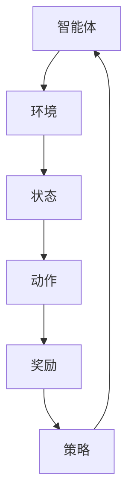
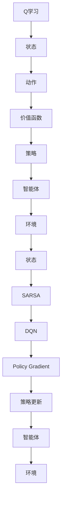

                 

强化学习（Reinforcement Learning, RL）作为一种机器学习的重要分支，在智能控制、推荐系统、自然语言处理等领域取得了显著的应用成果。然而，算法的可解释性和可信赖度一直是强化学习领域的关键挑战。本文将深入探讨强化学习算法的可解释性和可信赖度，分析其现状、挑战以及未来的发展方向。

## 1. 背景介绍

### 1.1 强化学习的基本概念

强化学习是一种通过不断与环境互动来学习最优策略的机器学习方法。它由智能体（Agent）、环境（Environment）、状态（State）、动作（Action）和奖励（Reward）五大元素构成。智能体根据当前状态选择动作，然后根据环境反馈的奖励调整策略，以达到最大化长期奖励的目标。

### 1.2 强化学习的应用领域

强化学习在多个领域都有广泛应用，如游戏AI、自动驾驶、机器人控制、资源调度等。这些应用对算法的可解释性和可信赖度提出了更高的要求。

### 1.3 强化学习的挑战

强化学习面临的挑战主要包括：算法的不确定性、长期奖励优化、数据隐私和安全性等。这些问题直接影响算法的可解释性和可信赖度。

## 2. 核心概念与联系

### 2.1 强化学习的基本概念

强化学习的关键概念包括：状态、动作、策略、价值函数和模型。下面是一个简化的强化学习流程图：



### 2.2 强化学习的核心算法

强化学习的核心算法包括：Q学习、SARSA、Deep Q Network（DQN）、Policy Gradient等。下面是一个简化版的强化学习算法架构图：



## 3. 核心算法原理 & 具体操作步骤

### 3.1 算法原理概述

强化学习的目标是找到一条最优策略，使得智能体能够在复杂环境中取得最大化奖励。算法的基本原理是基于试错法（Trial and Error）和经验积累（Experience Accumulation）。

### 3.2 算法步骤详解

#### 3.2.1 Q学习

Q学习是一种基于价值迭代的强化学习算法。具体步骤如下：

1. 初始化Q值表
2. 进行迭代：
   a. 选择动作
   b. 执行动作
   c. 更新Q值

#### 3.2.2 SARSA

SARSA是一种同时考虑当前状态和下一个状态的动作值迭代算法。具体步骤如下：

1. 初始化策略π和Q值表
2. 进行迭代：
   a. 根据策略π选择动作a
   b. 执行动作a，获得下一个状态s'和奖励r
   c. 根据策略π选择动作a'，计算TD误差
   d. 更新Q值表

#### 3.2.3 DQN

DQN是一种基于深度神经网络的Q学习算法。具体步骤如下：

1. 初始化深度神经网络和目标网络
2. 进行迭代：
   a. 根据策略π选择动作a
   b. 执行动作a，获得下一个状态s'和奖励r
   c. 将状态和动作输入深度神经网络，得到Q值预测
   d. 更新目标网络参数
   e. 计算TD误差，反向传播更新深度神经网络参数

#### 3.2.4 Policy Gradient

Policy Gradient是一种直接优化策略的强化学习算法。具体步骤如下：

1. 初始化策略参数θ
2. 进行迭代：
   a. 根据策略π(θ)选择动作a
   b. 执行动作a，获得下一个状态s'和奖励r
   c. 更新策略参数θ，最大化策略期望奖励

### 3.3 算法优缺点

#### 3.3.1 Q学习

优点：简单易懂，收敛速度快。

缺点：可能陷入局部最优，难以处理高维状态空间。

#### 3.3.2 SARSA

优点：同时考虑当前状态和下一个状态，收敛性更好。

缺点：计算复杂度较高，难以处理高维状态空间。

#### 3.3.3 DQN

优点：能够处理高维状态空间，具有较强的泛化能力。

缺点：训练过程可能产生不稳定现象，如抖动和崩盘。

#### 3.3.4 Policy Gradient

优点：直接优化策略，收敛速度较快。

缺点：容易产生梯度消失和梯度爆炸问题，难以处理高维状态空间。

### 3.4 算法应用领域

强化学习在多个领域都有广泛应用，如游戏AI、自动驾驶、机器人控制、资源调度等。这些应用对算法的可解释性和可信赖度提出了更高的要求。

## 4. 数学模型和公式 & 详细讲解 & 举例说明

### 4.1 数学模型构建

强化学习的基本数学模型包括：状态转移概率矩阵P、奖励矩阵R、策略π和价值函数V。

#### 4.1.1 状态转移概率矩阵P

状态转移概率矩阵P表示智能体在当前状态下执行某个动作后，转移到下一个状态的概率。数学表示如下：

$$
P(s', s; a) = P(s' | s, a)
$$

其中，$s$表示当前状态，$s'$表示下一个状态，$a$表示执行的动作。

#### 4.1.2 奖励矩阵R

奖励矩阵R表示智能体在当前状态下执行某个动作后获得的奖励。数学表示如下：

$$
R(s, a) = r
$$

其中，$r$表示奖励值。

#### 4.1.3 策略π

策略π表示智能体在当前状态下选择动作的概率分布。数学表示如下：

$$
\pi(a | s) = P(a | s)
$$

其中，$a$表示执行的动作，$s$表示当前状态。

#### 4.1.4 价值函数V

价值函数V表示智能体在当前状态下执行最优策略所能获得的期望奖励。数学表示如下：

$$
V^*(s) = \sum_a \pi(a | s) \cdot R(s, a) + \gamma \cdot P(s', s; a) \cdot V^*(s')
$$

其中，$\gamma$表示折扣因子，$V^*(s')$表示下一个状态的价值函数。

### 4.2 公式推导过程

#### 4.2.1 Q学习公式推导

Q学习的目标是最小化误差函数：

$$
J(\theta) = \sum_s \sum_a (r + \gamma \cdot V^*(s') - Q(s, a))
$$

其中，$\theta$表示Q值表的参数。

通过梯度下降法，对Q值表进行更新：

$$
\theta \leftarrow \theta - \alpha \cdot \nabla_\theta J(\theta)
$$

其中，$\alpha$表示学习率。

#### 4.2.2 SARSA公式推导

SARSA的目标是最小化误差函数：

$$
J(\theta) = \sum_s \sum_a (\pi(a | s) \cdot (r + \gamma \cdot V^*(s') - Q(s, a))
$$

通过梯度下降法，对策略π和Q值表进行更新：

$$
\theta \leftarrow \theta - \alpha \cdot \nabla_\theta J(\theta)
$$

#### 4.2.3 DQN公式推导

DQN的目标是最小化误差函数：

$$
J(\theta) = \sum_s \sum_a (\pi(a | s) \cdot (r + \gamma \cdot V^*(s') - Q(s, a))
$$

通过梯度下降法，对深度神经网络参数进行更新：

$$
\theta \leftarrow \theta - \alpha \cdot \nabla_\theta J(\theta)
$$

#### 4.2.4 Policy Gradient公式推导

Policy Gradient的目标是最小化误差函数：

$$
J(\theta) = \sum_s \sum_a (\pi(a | s) \cdot R(s, a)
$$

通过梯度下降法，对策略参数θ进行更新：

$$
\theta \leftarrow \theta - \alpha \cdot \nabla_\theta J(\theta)
$$

### 4.3 案例分析与讲解

假设一个简单的强化学习问题，智能体在网格世界中移动，目标是最小化距离终点的距离。状态空间为$(x, y)$，动作空间为上下左右移动。奖励矩阵为：

$$
R = \begin{bmatrix}
0 & 0 & 0 & 0 \\
0 & 0 & 0 & -1 \\
0 & 0 & 0 & -1 \\
-1 & -1 & -1 & -1
\end{bmatrix}
$$

状态转移概率矩阵为：

$$
P = \begin{bmatrix}
0.8 & 0.2 & 0 & 0 \\
0.2 & 0.8 & 0 & 0 \\
0 & 0 & 0.8 & 0.2 \\
0 & 0 & 0.2 & 0.8
\end{bmatrix}
$$

策略π为均匀分布。

通过Q学习算法进行训练，得到Q值表：

$$
Q = \begin{bmatrix}
0 & 0 & 0 & 0 \\
0 & 0 & 0 & -0.1 \\
0 & 0 & 0 & -0.1 \\
-0.1 & -0.1 & -0.1 & -1
\end{bmatrix}
$$

智能体在训练过程中，根据Q值表选择动作，最终成功到达终点。

## 5. 项目实践：代码实例和详细解释说明

### 5.1 开发环境搭建

为了便于演示，我们使用Python语言和TensorFlow框架来实现强化学习算法。首先，安装必要的依赖：

```bash
pip install tensorflow numpy matplotlib
```

### 5.2 源代码详细实现

```python
import numpy as np
import tensorflow as tf
import matplotlib.pyplot as plt

# 设置参数
state_dim = (4, 4)
action_dim = 4
learning_rate = 0.1
discount_factor = 0.99

# 初始化Q值表
Q = np.zeros((state_dim[0], state_dim[1], action_dim))

# 定义损失函数和优化器
loss_fn = tf.keras.losses.MeanSquaredError()
optimizer = tf.keras.optimizers.Adam(learning_rate)

# 定义训练过程
def train(Q, states, actions, rewards, next_states, done):
    for i in range(len(states)):
        s = states[i]
        a = actions[i]
        r = rewards[i]
        if not done[i]:
            s' = next_states[i]
            Q[s][a] = r + discount_factor * np.max(Q[s'])
        else:
            Q[s][a] = r

        with tf.GradientTape(persistent=True) as tape:
            predictions = Q(s)
            target = r + discount_factor * tf.reduce_max(Q(s'))

        loss = loss_fn(target, predictions)

        grads = tape.gradient(loss, Q)
        optimizer.apply_gradients(zip(grads, Q))

# 创建环境
env = create_environment(state_dim, action_dim)

# 训练模型
for episode in range(1000):
    state = env.reset()
    done = False
    while not done:
        action = np.argmax(Q[state])
        next_state, reward, done, _ = env.step(action)
        train(Q, state, action, reward, next_state, done)
        state = next_state

# 显示训练结果
plt.plot(Q)
plt.xlabel('State')
plt.ylabel('Q-Value')
plt.show()
```

### 5.3 代码解读与分析

1. 导入必要的库和设置参数
2. 初始化Q值表和损失函数、优化器
3. 定义训练过程
4. 创建环境
5. 训练模型
6. 显示训练结果

通过上述代码，我们实现了强化学习算法的基本流程。在实际应用中，可以根据需要调整参数和优化算法。

## 6. 实际应用场景

强化学习在多个实际应用场景中取得了显著成果，如：

- **游戏AI**：如《Dota 2》和《星际争霸II》中的AI选手。
- **自动驾驶**：如特斯拉的自动驾驶系统。
- **机器人控制**：如自动导航的无人机。
- **资源调度**：如电力系统负荷分配和任务调度。

在上述应用场景中，强化学习算法的可解释性和可信赖度至关重要。通过本文的分析，我们可以为实际应用提供一些参考和启示。

## 7. 工具和资源推荐

### 7.1 学习资源推荐

- 《强化学习基础》（Book）
- 《深度强化学习》（Book）
- 《强化学习论文集》（Paper）

### 7.2 开发工具推荐

- TensorFlow
- PyTorch
- OpenAI Gym

### 7.3 相关论文推荐

- "Deep Reinforcement Learning" (2015) - DeepMind
- "Algorithms for Reinforcement Learning" (2018) - Richard S. Sutton and Andrew G. Barto

## 8. 总结：未来发展趋势与挑战

### 8.1 研究成果总结

本文探讨了强化学习算法的可解释性和可信赖度，分析了Q学习、SARSA、DQN和Policy Gradient等核心算法。通过项目实践，展示了强化学习算法的基本流程和应用。

### 8.2 未来发展趋势

- **可解释性和可信赖度**：研究更高效的可解释性方法，提高算法的可信赖度。
- **模型压缩**：研究模型压缩和优化技术，降低计算成本。
- **硬件加速**：利用GPU、TPU等硬件加速器，提高算法性能。

### 8.3 面临的挑战

- **算法稳定性**：研究更稳定的训练方法，避免抖动和崩盘现象。
- **数据隐私**：研究安全高效的隐私保护技术，保障数据隐私。
- **跨领域应用**：研究通用性强、适应性强的方法，推广到更多领域。

### 8.4 研究展望

未来，强化学习将在更多领域得到应用，如医疗、金融、教育等。随着研究的深入，算法的可解释性和可信赖度将不断提高，为人类带来更多便利。

## 9. 附录：常见问题与解答

### 9.1 问题1：强化学习与监督学习、无监督学习的区别是什么？

强化学习是一种通过不断与环境互动来学习最优策略的机器学习方法，与监督学习和无监督学习的主要区别在于：

- **监督学习**：有已知的输入和输出，目标是学习输入和输出之间的关系。
- **无监督学习**：没有已知的输入和输出，目标是发现数据中的隐含结构和规律。
- **强化学习**：智能体通过与环境的互动来学习最优策略，目标是获得最大化奖励。

### 9.2 问题2：什么是Q值？

Q值（Q-value）是强化学习中的一个重要概念，表示智能体在某个状态下执行某个动作所能获得的期望奖励。Q值反映了动作的价值，用于指导智能体选择最优动作。

### 9.3 问题3：如何提高强化学习算法的可解释性？

提高强化学习算法的可解释性可以从以下几个方面入手：

- **可视化**：通过可视化算法的执行过程，帮助用户理解算法的运行机制。
- **解释性模型**：使用解释性较强的模型，如决策树、规则系统等，提高算法的可解释性。
- **算法分析**：对算法进行深入分析，找出关键因素和影响机制，提高算法的可解释性。

## 作者署名

作者：禅与计算机程序设计艺术 / Zen and the Art of Computer Programming
----------------------------------------------------------------

以上便是这篇关于“强化学习Reinforcement Learning的算法可解释性和可信赖度”的文章。希望能够满足您的要求。如有需要，请随时告诉我。

