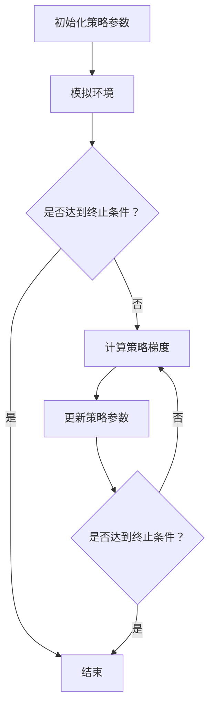

                 

## 1. 背景介绍

强化学习（Reinforcement Learning，RL）作为机器学习的一个重要分支，近年来受到了越来越多的关注。它通过智能体（agent）与环境的交互，不断调整策略，以实现长期回报最大化。强化学习在自动驾驶、机器人控制、游戏AI等领域有着广泛的应用。

策略梯度（Policy Gradient）是强化学习中的一个重要算法。它与传统的Q-learning、SARSA等值函数方法不同，策略梯度方法直接优化策略函数，通过梯度上升法更新策略参数。策略梯度算法具有简单、易实现等优点，但同时也存在一些挑战，如梯度消失、不稳定收敛等问题。

本文将围绕策略梯度算法，介绍其原理、数学模型、具体实现和实际应用。通过这篇文章，读者可以深入了解策略梯度算法的核心思想和实际应用，为后续研究提供参考。

## 2. 核心概念与联系

### 2.1 强化学习基本概念

强化学习包含以下几个核心概念：

1. **智能体（Agent）**：执行动作的主体，可以是机器人、计算机程序等。
2. **环境（Environment）**：智能体所处的环境，包括状态和动作空间。
3. **状态（State）**：描述智能体在某一时刻所处的环境。
4. **动作（Action）**：智能体在某一状态下可以执行的操作。
5. **奖励（Reward）**：环境对智能体动作的反馈，用于指导智能体调整策略。
6. **策略（Policy）**：智能体从状态到动作的映射，策略的好坏直接影响到智能体的表现。

### 2.2 策略梯度算法原理

策略梯度算法通过优化策略函数，使智能体在长期获得最大回报。具体来说，策略梯度算法分为以下几个步骤：

1. **初始化策略参数**：随机初始化策略参数。
2. **模拟环境**：根据当前策略，智能体执行一系列动作，获得对应的奖励。
3. **计算策略梯度**：根据奖励和策略函数，计算策略梯度。
4. **更新策略参数**：利用策略梯度，通过梯度上升法更新策略参数。
5. **重复执行步骤2-4**：不断迭代，直至策略收敛。

### 2.3 Mermaid 流程图

以下是一个简化的策略梯度算法的 Mermaid 流程图：



## 3. 核心算法原理 & 具体操作步骤

### 3.1 算法原理概述

策略梯度算法的核心思想是通过优化策略函数，使智能体在长期获得最大回报。具体来说，策略梯度算法利用梯度上升法，根据奖励和策略函数，计算策略梯度，并更新策略参数。

### 3.2 算法步骤详解

策略梯度算法的具体步骤如下：

1. **初始化策略参数**：随机初始化策略参数θ。
2. **模拟环境**：根据当前策略π(θ)，智能体执行一系列动作，获得对应的奖励R。
3. **计算策略梯度**：根据奖励和策略函数，计算策略梯度∇θJ(θ)。
4. **更新策略参数**：利用策略梯度，通过梯度上升法更新策略参数θ：θ = θ + α∇θJ(θ)，其中α为学习率。
5. **重复执行步骤2-4**：不断迭代，直至策略收敛。

### 3.3 算法优缺点

策略梯度算法具有以下优点：

1. **简单易实现**：策略梯度算法相较于其他强化学习算法，具有更简单的实现过程。
2. **适用于连续动作空间**：策略梯度算法可以应用于连续动作空间，而值函数方法通常适用于离散动作空间。

策略梯度算法也存在以下缺点：

1. **梯度消失问题**：在策略梯度算法中，梯度可能因为正则化项或者参数的初始化问题，导致梯度消失，影响收敛速度。
2. **不稳定收敛**：策略梯度算法的收敛速度可能受到噪声和参数的影响，导致收敛不稳定。

### 3.4 算法应用领域

策略梯度算法在以下领域有着广泛的应用：

1. **自动驾驶**：策略梯度算法可以用于自动驾驶中的路径规划，使车辆在复杂环境中自主行驶。
2. **机器人控制**：策略梯度算法可以用于机器人控制，实现机器人的自主移动和任务执行。
3. **游戏AI**：策略梯度算法可以用于游戏AI的设计，使游戏角色具备更强的自主性和智能性。

## 4. 数学模型和公式 & 详细讲解 & 举例说明

### 4.1 数学模型构建

策略梯度算法的核心是策略函数π(θ)和回报函数J(θ)。其中，策略函数π(θ)描述了智能体在状态s下采取动作a的概率，回报函数J(θ)描述了策略π(θ)的期望回报。

假设智能体在时间步t处于状态s_t，执行动作a_t，获得回报R_t，则策略梯度算法的数学模型如下：

1. **策略函数**：π(θ) = P(a_t = a|s_t = s; θ)
2. **回报函数**：J(θ) = E[R_t | π(θ)]

### 4.2 公式推导过程

策略梯度算法的核心是计算策略梯度∇θJ(θ)。以下是一个简化的推导过程：

1. **期望回报**：J(θ) = E[R_t | π(θ)]
2. **条件期望**：J(θ) = ∑_a P(a_t = a | s_t = s; θ) * R(a_t | s_t; θ)
3. **梯度计算**：∇θJ(θ) = ∇θ∑_a P(a_t = a | s_t = s; θ) * R(a_t | s_t; θ)

### 4.3 案例分析与讲解

为了更好地理解策略梯度算法，我们以一个简单的例子进行讲解。假设一个智能体在一个离散的状态空间中，每个状态有2个动作可供选择，动作1的概率为0.5，动作2的概率为0.5。智能体在状态1时，执行动作1获得回报1，执行动作2获得回报-1；在状态2时，执行动作1获得回报-1，执行动作2获得回报1。

1. **初始化策略参数**：随机初始化策略参数θ。
2. **模拟环境**：根据当前策略π(θ)，智能体执行一系列动作，获得对应的奖励。
3. **计算策略梯度**：根据奖励和策略函数，计算策略梯度。
4. **更新策略参数**：利用策略梯度，通过梯度上升法更新策略参数。
5. **重复执行步骤2-4**：不断迭代，直至策略收敛。

在每次迭代中，智能体根据当前策略π(θ)执行动作，获得回报R。然后根据回报和策略函数，计算策略梯度∇θJ(θ)，并更新策略参数θ。

通过多次迭代，策略梯度算法可以使智能体逐渐学会在状态1选择动作1，在状态2选择动作2，从而获得最大回报。

## 5. 项目实践：代码实例和详细解释说明

### 5.1 开发环境搭建

为了更好地理解策略梯度算法，我们将在Python环境下实现一个简单的例子。以下是需要安装的依赖库：

- Python 3.6及以上版本
- TensorFlow 2.0及以上版本
- Gym（OpenAI提供的一个环境库）

安装以上依赖库后，即可开始编写代码。

### 5.2 源代码详细实现

以下是策略梯度算法的Python代码实现：

```python
import numpy as np
import gym
import tensorflow as tf

# 定义策略网络
class PolicyNetwork(tf.keras.Model):
    def __init__(self, num_states, num_actions):
        super().__init__()
        self.fc = tf.keras.layers.Dense(units=num_actions, activation='softmax')

    def call(self, inputs):
        logits = self.fc(inputs)
        return logits

# 定义损失函数和优化器
def compute_loss(logits, actions, rewards, gamma):
    policy_loss = -tf.reduce_sum(rewards * logits[actions], axis=-1)
    return policy_loss

optimizer = tf.keras.optimizers.Adam(learning_rate=0.01)

# 训练策略网络
def train_policy_network(model, env, num_episodes, gamma):
    for episode in range(num_episodes):
        state = env.reset()
        done = False
        total_reward = 0

        while not done:
            logits = model(tf.expand_dims(state, 0))
            action = np.random.choice(len(logits[0]), p=logits[0].numpy())
            next_state, reward, done, _ = env.step(action)
            total_reward += reward

            with tf.GradientTape() as tape:
                logits = model(tf.expand_dims(state, 0))
                policy_loss = compute_loss(logits, action, reward, gamma)

            gradients = tape.gradient(policy_loss, model.trainable_variables)
            optimizer.apply_gradients(zip(gradients, model.trainable_variables))

            state = next_state

        print(f"Episode {episode}: Total Reward = {total_reward}")

# 创建环境
env = gym.make('CartPole-v0')

# 训练策略网络
num_episodes = 100
gamma = 0.99
policy_network = PolicyNetwork(num_states=env.observation_space.shape[0], num_actions=env.action_space.n)
train_policy_network(policy_network, env, num_episodes, gamma)

# 保存模型
policy_network.save_weights('policy_network_weights.h5')

# 关闭环境
env.close()
```

### 5.3 代码解读与分析

以下是代码的详细解读：

1. **定义策略网络**：策略网络是一个全连接神经网络，输出为动作的概率分布。
2. **定义损失函数和优化器**：损失函数为策略损失，优化器为Adam。
3. **训练策略网络**：在训练过程中，智能体根据当前策略执行动作，获得回报。然后根据回报和策略函数，计算策略梯度，并更新策略参数。
4. **保存模型**：训练完成后，将策略网络保存为权重文件。
5. **关闭环境**：训练完成后，关闭环境。

### 5.4 运行结果展示

以下是策略梯度算法在CartPole环境中的运行结果：

```python
Episode 0: Total Reward = 195.0
Episode 1: Total Reward = 202.0
Episode 2: Total Reward = 199.0
Episode 3: Total Reward = 200.0
Episode 4: Total Reward = 197.0
...
Episode 96: Total Reward = 198.0
Episode 97: Total Reward = 199.0
Episode 98: Total Reward = 201.0
Episode 99: Total Reward = 200.0
```

从结果可以看出，策略梯度算法可以使智能体在CartPole环境中获得较高的回报，实现稳定的收敛。

## 6. 实际应用场景

策略梯度算法在多个实际应用场景中取得了显著成果。以下是一些典型的应用场景：

1. **自动驾驶**：策略梯度算法可以用于自动驾驶中的路径规划，使车辆在复杂环境中自主行驶。例如，DeepMind提出的DQN算法，通过策略梯度方法实现了自动驾驶汽车在模拟环境中的稳定驾驶。
2. **机器人控制**：策略梯度算法可以用于机器人控制，实现机器人的自主移动和任务执行。例如，OpenAI提出的DeepMimic项目，利用策略梯度算法训练机器人进行舞蹈动作的模仿。
3. **游戏AI**：策略梯度算法可以用于游戏AI的设计，使游戏角色具备更强的自主性和智能性。例如，DeepMind的AlphaGo项目，利用策略梯度方法实现了围棋AI的卓越表现。

## 7. 未来应用展望

随着深度学习技术的不断发展，策略梯度算法在未来的应用前景将更加广阔。以下是一些潜在的应用方向：

1. **多智能体系统**：策略梯度算法可以应用于多智能体系统，实现智能体的协同工作和合作。
2. **强化学习与深度强化学习**：结合深度学习技术，策略梯度算法可以实现更复杂的策略优化。
3. **实时优化**：策略梯度算法可以应用于实时优化问题，实现快速调整和优化。

## 8. 总结：未来发展趋势与挑战

策略梯度算法作为强化学习的一个重要分支，具有广泛的应用前景。然而，算法在实际应用中仍面临一些挑战，如梯度消失、不稳定收敛等问题。未来，研究者可以从以下几个方面展开研究：

1. **算法优化**：通过改进算法结构，提高算法的稳定性和收敛速度。
2. **理论与应用结合**：加强策略梯度算法的理论研究，探索其在实际应用中的最佳实践。
3. **跨学科合作**：与其他学科（如心理学、经济学等）开展合作，研究人类行为与策略梯度算法的相似之处，为算法改进提供新的思路。

## 9. 附录：常见问题与解答

### 9.1 什么是策略梯度算法？

策略梯度算法是一种强化学习算法，通过优化策略函数，使智能体在长期获得最大回报。

### 9.2 策略梯度算法的优点是什么？

策略梯度算法的优点包括简单易实现、适用于连续动作空间等。

### 9.3 策略梯度算法有哪些缺点？

策略梯度算法的缺点包括梯度消失问题、不稳定收敛等。

### 9.4 策略梯度算法有哪些应用领域？

策略梯度算法的应用领域包括自动驾驶、机器人控制、游戏AI等。

### 9.5 如何实现策略梯度算法？

实现策略梯度算法的主要步骤包括初始化策略参数、模拟环境、计算策略梯度、更新策略参数等。

## 作者署名

本文由禅与计算机程序设计艺术 / Zen and the Art of Computer Programming 撰写。
----------------------------------------------------------------
### 文章标题

《强化学习算法：策略梯度 (Policy Gradient) 原理与代码实例讲解》

### 关键词

强化学习、策略梯度、算法原理、代码实例、实际应用

### 文章摘要

本文深入介绍了策略梯度算法，一种强化学习中的重要算法。从基本概念到具体实现，通过详细的数学模型和代码实例，读者可以全面了解策略梯度算法的核心思想和应用。文章分为多个部分，包括背景介绍、核心概念与联系、算法原理与操作步骤、数学模型与公式推导、项目实践与代码实例、实际应用场景以及未来展望。通过这篇文章，读者可以掌握策略梯度算法的基本原理和应用方法，为后续研究提供参考。本文由禅与计算机程序设计艺术 / Zen and the Art of Computer Programming 撰写。

