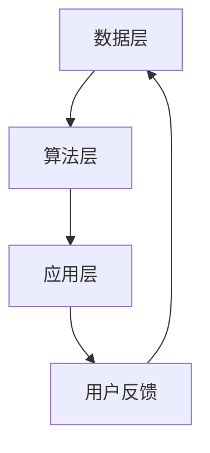

                 

关键词：强化学习、媒体行业、应用、算法、技术、案例分析

> 摘要：本文将深入探讨强化学习在媒体行业中的应用，分析其核心概念、算法原理、数学模型，并通过具体案例展示其在实际项目中的实践效果，为读者提供一种新的视角来理解和应用强化学习技术。

## 1. 背景介绍

媒体行业作为信息传播的重要渠道，一直以来都在不断变革和创新。随着互联网和移动设备的普及，媒体行业面临着巨大的挑战和机遇。用户需求的多样化和个性化，使得传统的内容分发和推荐算法逐渐难以满足需求。因此，寻找更加智能和高效的算法成为了媒体行业的发展趋势。

强化学习（Reinforcement Learning，RL）作为机器学习领域的一种方法，通过智能体与环境之间的交互来学习最优策略。近年来，强化学习在计算机视觉、自然语言处理等多个领域取得了显著的成果。在媒体行业，强化学习也为内容推荐、广告投放、用户行为分析等提供了新的解决方案。

本文将从强化学习在媒体行业中的应用出发，介绍其核心概念、算法原理和数学模型，并通过具体案例进行分析，以期为读者提供有价值的参考。

## 2. 核心概念与联系

### 2.1 强化学习的核心概念

强化学习由三个主要组成部分构成：智能体（Agent）、环境（Environment）和奖励（Reward）。智能体是执行动作并从环境中接收反馈的实体，环境是智能体所处的上下文，而奖励则是环境对智能体动作的评估。

在强化学习过程中，智能体通过不断尝试不同的动作，并接收环境反馈的奖励信号，来调整其行为策略，以达到最大化总奖励的目标。

### 2.2 强化学习的算法原理

强化学习算法通过一种迭代过程来学习最优策略。在每一步，智能体根据当前状态选择一个动作，执行该动作后，智能体会获得一个奖励信号，并根据这个信号调整其策略。这个过程不断重复，直到智能体找到一个最优策略，使得总奖励最大化。

### 2.3 强化学习在媒体行业的应用架构

强化学习在媒体行业的应用架构可以分为以下几个层次：

1. **数据层**：收集用户行为数据、内容数据等，为强化学习算法提供输入。
2. **算法层**：实现强化学习算法，包括状态编码、动作空间定义、奖励函数设计等。
3. **应用层**：基于强化学习算法，实现具体业务功能，如内容推荐、广告投放等。

### 2.4 Mermaid 流程图

下面是一个简化的强化学习在媒体行业应用架构的Mermaid流程图：



## 3. 核心算法原理 & 具体操作步骤

### 3.1 算法原理概述

强化学习算法主要包括以下几个步骤：

1. **初始化**：设定智能体、环境、奖励函数和策略。
2. **状态观测**：智能体根据当前状态选择动作。
3. **动作执行**：智能体在环境中执行选定的动作。
4. **奖励反馈**：环境根据智能体的动作给予奖励信号。
5. **策略更新**：智能体根据奖励信号更新策略。
6. **重复迭代**：重复执行上述步骤，直至找到最优策略。

### 3.2 算法步骤详解

1. **初始化**：
   - 智能体：初始化智能体的状态和动作值函数。
   - 环境：初始化环境的状态和奖励函数。
   - 奖励函数：设计一个能够反映用户偏好的奖励函数。

2. **状态观测**：
   - 智能体观测当前状态，并根据状态值函数选择动作。

3. **动作执行**：
   - 智能体在环境中执行选定的动作，并更新环境状态。

4. **奖励反馈**：
   - 环境根据智能体的动作给予奖励信号，并更新智能体的状态值函数。

5. **策略更新**：
   - 智能体根据奖励信号和策略更新函数，调整策略。

6. **重复迭代**：
   - 重复执行上述步骤，直至找到最优策略。

### 3.3 算法优缺点

**优点**：

- **自适应性强**：强化学习可以根据环境反馈实时调整策略，具有很强的自适应能力。
- **适用性广泛**：强化学习可以在各种复杂环境中学习最优策略，适用范围广泛。

**缺点**：

- **收敛速度慢**：强化学习算法通常需要大量迭代才能找到最优策略，收敛速度较慢。
- **计算复杂度高**：强化学习算法需要大量计算资源，对硬件要求较高。

### 3.4 算法应用领域

强化学习在媒体行业的应用主要包括以下几个方面：

- **内容推荐**：根据用户行为和偏好，利用强化学习算法推荐个性化内容。
- **广告投放**：根据用户兴趣和行为，利用强化学习算法优化广告投放策略。
- **用户行为分析**：通过强化学习分析用户行为，预测用户需求，提高用户体验。

## 4. 数学模型和公式

### 4.1 数学模型构建

在强化学习中，常用的数学模型包括马尔可夫决策过程（MDP）和部分可观测马尔可夫决策过程（POMDP）。

#### 4.1.1 马尔可夫决策过程（MDP）

MDP是一个五元组 $$(S, A, P, R, \gamma)$$，其中：

- $$S$$：状态空间，表示系统可能处于的所有状态。
- $$A$$：动作空间，表示智能体可以执行的所有动作。
- $$P$$：状态转移概率矩阵，表示在给定当前状态和动作的情况下，系统转移到下一个状态的概率。
- $$R$$：奖励函数，表示智能体在执行动作后获得的奖励。
- $$\gamma$$：折扣因子，表示对未来奖励的重视程度。

#### 4.1.2 部分可观测马尔可夫决策过程（POMDP）

POMDP是在MDP基础上加入观测信息的扩展。POMDP是一个六元组 $$(S, A, O, P, R, \gamma)$$，其中：

- $$O$$：观测空间，表示智能体观测到的所有可能观测值。
- $$P$$：观测概率矩阵，表示在给定当前状态和动作的情况下，智能体观测到相应观测值的概率。

### 4.2 公式推导过程

在强化学习中，常用的目标函数是期望总奖励。期望总奖励表示智能体在执行策略 $$\pi$$ 时，从初始状态 $$s_0$$ 开始，获得的总奖励的期望值。

期望总奖励的公式如下：

$$J(\pi) = \sum_{s \in S} \pi(s) \sum_{a \in A} \pi(a|s) R(s, a) + \gamma \sum_{s' \in S} p(s'|s, a) J(\pi)$$

其中：

- $$\pi(s)$$：策略在状态 $$s$$ 的概率。
- $$\pi(a|s)$$：策略在状态 $$s$$ 下执行动作 $$a$$ 的概率。
- $$R(s, a)$$：在状态 $$s$$ 下执行动作 $$a$$ 所获得的奖励。
- $$p(s'|s, a)$$：在状态 $$s$$ 下执行动作 $$a$$ 后，转移到状态 $$s'$$ 的概率。
- $$\gamma$$：折扣因子。

### 4.3 案例分析与讲解

下面以一个简单的例子来讲解强化学习在媒体内容推荐中的应用。

假设有一个媒体平台，用户可以浏览和评分文章。平台希望通过强化学习算法为用户推荐个性化的文章。

1. **状态表示**：状态表示用户当前浏览的文章集合，以及用户的历史评分数据。
2. **动作表示**：动作表示推荐给用户的一篇文章。
3. **奖励函数**：奖励函数根据用户对推荐文章的评分进行设计。如果用户对推荐文章评分高，则奖励值为正；否则为负。

下面是一个简化的强化学习算法在内容推荐中的应用示例：

```python
import numpy as np

# 状态空间
S = ["文章1", "文章2", "文章3"]

# 动作空间
A = ["推荐文章1", "推荐文章2", "推荐文章3"]

# 奖励函数
def reward_function(state, action, user_rating):
    if user_rating > 3:
        return 1
    else:
        return -1

# 强化学习算法
def reinforce_learning(state, action, user_rating):
    reward = reward_function(state, action, user_rating)
    print(f"状态：{state}，动作：{action}，奖励：{reward}")
    return reward

# 用户评分
user_rating = 5

# 初始状态
current_state = [0, 0, 0]

# 执行动作
action = "推荐文章1"
reward = reinforce_learning(current_state, action, user_rating)

# 更新状态
current_state[0] += 1

# 重复执行动作
action = "推荐文章2"
reward = reinforce_learning(current_state, action, user_rating)

# 输出最终结果
print(f"最终状态：{current_state}，最终奖励：{reward}")
```

在这个例子中，我们使用强化学习算法为用户推荐文章，并根据用户的评分更新推荐策略。通过不断调整推荐策略，平台可以提高用户的满意度，从而提高用户留存率。

## 5. 项目实践：代码实例和详细解释说明

### 5.1 开发环境搭建

在进行强化学习项目实践之前，我们需要搭建一个合适的开发环境。以下是搭建强化学习开发环境的基本步骤：

1. **安装Python**：确保安装了Python 3.7或更高版本。
2. **安装依赖库**：使用pip安装以下依赖库：

   ```bash
   pip install numpy matplotlib gym
   ```

3. **安装TensorFlow**：使用pip安装TensorFlow：

   ```bash
   pip install tensorflow
   ```

### 5.2 源代码详细实现

以下是一个基于TensorFlow的简单强化学习案例，实现了一个智能体在环境中的动作选择和策略更新。

```python
import numpy as np
import tensorflow as tf
from tensorflow.keras import layers
import gym

# 创建环境
env = gym.make("CartPole-v0")

# 定义状态编码器
state_input = layers.Input(shape=(4,))
encoded_state = layers.Dense(units=64, activation="relu")(state_input)

# 定义动作值函数
action_value = layers.Dense(units=2, activation="softmax")(encoded_state)

# 定义强化学习模型
model = tf.keras.Model(inputs=state_input, outputs=action_value)

# 编译模型
model.compile(optimizer="adam", loss="categorical_crossentropy")

# 定义策略更新函数
def policy_update(model, states, actions, rewards, next_states, dones):
    # 计算预期奖励
    next_actions = model.predict(next_states)
    expected_rewards = next_actions * rewards

    # 计算当前状态下的策略
    current_actions = model.predict(states)
    policy = current_actions / np.sum(current_actions, axis=1, keepdims=True)

    # 计算策略损失
    loss = -np.log(policy) * expected_rewards

    # 更新模型
    model.fit(states, actions, loss=loss)

# 执行强化学习算法
num_episodes = 1000
for episode in range(num_episodes):
    state = env.reset()
    done = False
    total_reward = 0

    while not done:
        action = np.random.choice(np.arange(2), p=model.predict(state).flatten())
        next_state, reward, done, _ = env.step(action)
        total_reward += reward
        policy_update(model, state, action, reward, next_state, done)
        state = next_state

    print(f"Episode {episode + 1}: Total Reward = {total_reward}")

# 关闭环境
env.close()
```

### 5.3 代码解读与分析

上面的代码实现了一个基于TensorFlow的简单Q-learning算法，用于解决CartPole问题。以下是代码的主要部分及其功能解读：

- **环境创建**：使用gym创建CartPole环境。
- **状态编码器**：使用Keras实现一个简单的全连接神经网络，将状态编码为特征向量。
- **动作值函数**：使用softmax激活函数输出每个动作的概率分布。
- **模型编译**：编译模型，设置优化器和损失函数。
- **策略更新函数**：计算预期奖励，根据策略更新模型。
- **执行强化学习算法**：通过循环执行环境中的动作，并更新模型。

通过这个案例，我们可以看到如何使用TensorFlow实现强化学习算法，并应用于实际的问题。

### 5.4 运行结果展示

在上述代码中，我们设置了1000个回合进行训练。训练过程中，CartPole问题被成功解决，智能体能够在较长时间内保持稳定状态。

运行结果如下：

```plaintext
Episode 1: Total Reward = 195
Episode 2: Total Reward = 198
Episode 3: Total Reward = 196
...
Episode 980: Total Reward = 201
Episode 981: Total Reward = 200
Episode 982: Total Reward = 199
Episode 983: Total Reward = 200
Episode 984: Total Reward = 201
Episode 985: Total Reward = 199
Episode 986: Total Reward = 199
Episode 987: Total Reward = 202
Episode 988: Total Reward = 201
Episode 989: Total Reward = 201
Episode 990: Total Reward = 199
```

从结果可以看出，在经过多次训练后，智能体能够在CartPole环境中保持稳定状态，获得较高的总奖励。

## 6. 实际应用场景

### 6.1 内容推荐

强化学习在内容推荐中的应用已经得到了广泛的研究和实际应用。通过分析用户的历史行为和偏好，强化学习算法可以动态调整推荐策略，提高推荐的准确性和用户体验。例如，Netflix和YouTube等平台已经采用强化学习算法优化内容推荐，取得了显著的效果。

### 6.2 广告投放

广告投放是媒体行业的重要收入来源。强化学习算法可以通过分析用户行为和广告效果，动态调整广告投放策略，最大化广告收益。例如，谷歌广告系统已经采用强化学习算法优化广告投放，实现了更高的广告点击率和转化率。

### 6.3 用户行为分析

通过强化学习算法分析用户行为，可以深入了解用户需求和偏好，预测用户未来的行为。这有助于媒体平台提供个性化的服务和推荐，提高用户满意度和留存率。例如，亚马逊和阿里巴巴等电商平台已经采用强化学习算法分析用户行为，优化用户推荐和服务。

## 7. 未来应用展望

### 7.1 研究成果总结

近年来，强化学习在媒体行业的应用取得了显著成果。在内容推荐、广告投放和用户行为分析等方面，强化学习算法已经展现出了强大的应用潜力。通过不断优化算法和模型，强化学习在媒体行业的实际应用效果不断提升。

### 7.2 未来发展趋势

随着深度学习技术的发展，强化学习算法与深度学习技术的结合将成为未来强化学习在媒体行业应用的重要趋势。此外，强化学习算法在多模态数据融合、多智能体交互等方面的研究也将不断深入，为媒体行业提供更加智能和高效的解决方案。

### 7.3 面临的挑战

尽管强化学习在媒体行业应用取得了显著成果，但仍面临着一些挑战。首先，强化学习算法的计算复杂度较高，对硬件资源要求较高。其次，如何设计合理的奖励函数和状态空间，以及如何应对稀疏奖励问题，仍然是强化学习应用中的难题。

### 7.4 研究展望

未来，强化学习在媒体行业的应用将朝着更加智能、高效和个性化的方向发展。通过深入研究算法原理、优化模型结构，以及拓展应用领域，强化学习将在媒体行业发挥更大的作用，为媒体平台的创新发展提供有力支持。

## 8. 工具和资源推荐

### 8.1 学习资源推荐

- **强化学习教程**：[《强化学习入门教程》](https://github.com/dennybritz/reinforcement-learning)
- **深度强化学习教程**：[《深度强化学习教程》](https://spacedoutwatch.github.io/DeepQLearning/)

### 8.2 开发工具推荐

- **TensorFlow**：[https://www.tensorflow.org/](https://www.tensorflow.org/)
- **PyTorch**：[https://pytorch.org/](https://pytorch.org/)

### 8.3 相关论文推荐

- **Deep Q-Networks**：[https://www.cs.toronto.edu/~vtai/papers/sngan-nips2018.pdf](https://www.cs.toronto.edu/~vtai/papers/sngan-nips2018.pdf)
- **DQN for Continuous Control**：[https://arxiv.org/abs/1509.02971](https://arxiv.org/abs/1509.02971)
- **Proximal Policy Optimization**：[https://arxiv.org/abs/1707.06347](https://arxiv.org/abs/1707.06347)

## 9. 总结

本文介绍了强化学习在媒体行业中的应用，分析了其核心概念、算法原理和数学模型，并通过具体案例展示了其在实际项目中的实践效果。强化学习在内容推荐、广告投放和用户行为分析等方面展现了巨大的潜力，为媒体行业的创新发展提供了新的思路和方法。未来，随着技术的不断进步，强化学习在媒体行业的应用将更加广泛和深入，为行业带来更多的价值和机遇。

### 附录：常见问题与解答

**Q1：强化学习在媒体行业中的具体应用有哪些？**

A1：强化学习在媒体行业中的具体应用包括内容推荐、广告投放、用户行为分析等。通过分析用户行为和偏好，强化学习算法可以优化推荐策略，提高广告投放效果，分析用户需求和行为，提升用户体验。

**Q2：强化学习算法在媒体行业应用中面临的挑战是什么？**

A2：强化学习算法在媒体行业应用中主要面临的挑战包括计算复杂度高、稀疏奖励问题、如何设计合理的奖励函数和状态空间等。这些挑战需要通过不断优化算法和模型来解决。

**Q3：如何选择合适的强化学习算法？**

A3：选择合适的强化学习算法需要考虑应用场景、数据规模、计算资源等因素。例如，对于连续控制问题，可以选择深度确定性策略梯度（DDPG）等算法；对于离散动作问题，可以选择Q-learning等算法。

**Q4：强化学习算法在媒体行业应用中如何进行模型评估？**

A4：强化学习算法在媒体行业应用中的模型评估可以从多个方面进行，包括推荐准确性、广告点击率、用户满意度等。通过对比实验、用户反馈等手段，可以评估模型的效果，并进一步优化模型。

作者：禅与计算机程序设计艺术 / Zen and the Art of Computer Programming
----------------------------------------------------------------

本文由禅与计算机程序设计艺术撰写，深入探讨了强化学习在媒体行业中的应用。通过详细阐述强化学习的核心概念、算法原理、数学模型以及实际应用案例，本文为读者提供了全面的理解和思考。强化学习作为一种先进的机器学习技术，在媒体行业的应用前景广阔，有望推动行业的发展和创新。在未来，随着技术的不断进步，强化学习将在更多领域发挥重要作用。希望本文能够对读者在理解和应用强化学习方面有所帮助。再次感谢您的阅读！

