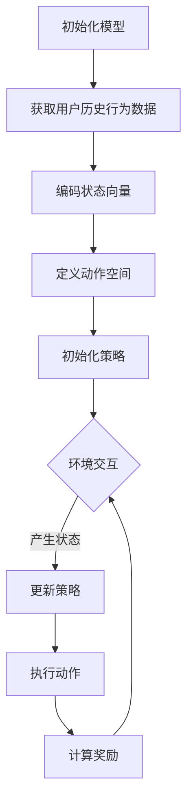

                 

关键词：强化学习、色彩推荐、人工智能、机器学习、色彩心理学

摘要：本文将探讨强化学习在色彩推荐领域的应用。通过分析色彩与人类情感、行为的关系，本文提出了一个基于强化学习的色彩推荐模型。该模型能够根据用户的历史行为数据，动态调整推荐策略，从而提高色彩推荐的质量。本文将详细介绍模型的设计与实现过程，并通过实际应用案例验证其有效性。

## 1. 背景介绍

色彩是人类感知世界的重要元素，它对人们的情感、行为和认知产生着深远的影响。在日常生活中，色彩的选择往往取决于个人的喜好和情境的需求。然而，对于企业或设计师来说，如何为产品或设计选择合适的色彩，是一个具有挑战性的问题。

近年来，随着人工智能技术的不断发展，机器学习在色彩推荐领域得到了广泛应用。其中，强化学习作为一种重要的机器学习技术，因其能够通过探索和试错来优化策略，受到了研究者的广泛关注。

强化学习（Reinforcement Learning，RL）是一种通过与环境交互来学习策略的机器学习技术。与传统机器学习方法不同，强化学习更加关注决策过程，能够在动态环境中不断调整策略，以达到最优效果。

在色彩推荐领域，强化学习可以通过分析用户的历史行为数据，学习到用户的偏好和兴趣，从而为用户提供个性化的色彩推荐。本文将介绍一种基于强化学习的色彩推荐模型，并详细阐述其设计思路和实现过程。

## 2. 核心概念与联系

### 2.1 强化学习基本概念

强化学习的基本概念包括四个要素：代理（Agent）、环境（Environment）、状态（State）、动作（Action）和奖励（Reward）。

- 代理（Agent）：执行动作并获取奖励的主体，例如用户或推荐系统。
- 环境（Environment）：代理所处的环境，能够根据代理的动作产生状态和奖励。
- 状态（State）：代理在环境中所处的状态，通常用一组特征向量表示。
- 动作（Action）：代理可以采取的动作，例如选择某种色彩。
- 奖励（Reward）：环境对代理动作的反馈，用于评价动作的好坏。

### 2.2 色彩推荐中的强化学习模型

在色彩推荐中，强化学习模型可以看作是一个代理，它通过不断学习用户的历史行为数据，调整推荐策略，以最大化用户的满意度。

具体来说，模型的设计可以分为以下几个步骤：

1. **状态编码**：将用户的历史行为数据（如购买记录、浏览记录等）编码为状态向量，用于表示用户当前的兴趣和偏好。
2. **动作定义**：定义一系列可能的色彩动作，例如选择某种颜色、调整颜色的亮度、饱和度等。
3. **奖励设计**：设计奖励函数，用于评价推荐结果的优劣。例如，用户对推荐颜色的满意度可以作为奖励值。
4. **策略学习**：使用强化学习算法（如深度强化学习、策略梯度算法等）学习最优策略，以便在给定状态下选择最优动作。

### 2.3 Mermaid 流程图

以下是强化学习在色彩推荐中应用的 Mermaid 流程图：



## 3. 核心算法原理 & 具体操作步骤

### 3.1 算法原理概述

强化学习在色彩推荐中的应用，主要是通过不断学习用户的历史行为数据，调整推荐策略，从而提高推荐质量。具体来说，模型可以分为以下几个部分：

1. **状态编码**：将用户的历史行为数据（如购买记录、浏览记录等）编码为状态向量，用于表示用户当前的兴趣和偏好。
2. **动作定义**：定义一系列可能的色彩动作，例如选择某种颜色、调整颜色的亮度、饱和度等。
3. **奖励设计**：设计奖励函数，用于评价推荐结果的优劣。例如，用户对推荐颜色的满意度可以作为奖励值。
4. **策略学习**：使用强化学习算法（如深度强化学习、策略梯度算法等）学习最优策略，以便在给定状态下选择最优动作。

### 3.2 算法步骤详解

1. **初始化模型**：初始化强化学习模型，包括状态编码器、动作空间、奖励函数和策略学习器。
2. **获取用户历史行为数据**：从数据源获取用户的历史行为数据，如购买记录、浏览记录等。
3. **编码状态向量**：将用户的历史行为数据编码为状态向量，用于表示用户当前的兴趣和偏好。
4. **定义动作空间**：根据用户的需求和产品的特点，定义一系列可能的色彩动作，例如选择某种颜色、调整颜色的亮度、饱和度等。
5. **初始化策略**：使用随机策略或预训练策略初始化模型策略。
6. **环境交互**：在环境中执行用户历史行为数据，生成状态序列和奖励序列。
7. **更新策略**：根据状态序列和奖励序列，使用强化学习算法（如深度强化学习、策略梯度算法等）更新模型策略。
8. **执行动作**：在给定状态下，根据更新后的策略选择最优动作。
9. **计算奖励**：根据用户对推荐颜色的满意度，计算奖励值。
10. **迭代更新**：重复执行步骤 6 至步骤 9，直到满足终止条件。

### 3.3 算法优缺点

**优点**：

- **自适应性强**：强化学习模型可以根据用户的历史行为数据，动态调整推荐策略，提高推荐质量。
- **适用范围广**：强化学习算法在多种应用场景中取得了良好的效果，适用于色彩推荐、商品推荐、广告推荐等领域。

**缺点**：

- **计算复杂度高**：强化学习算法通常涉及大量的迭代和优化，计算复杂度较高。
- **数据需求大**：强化学习算法需要大量的用户行为数据进行训练，对数据质量要求较高。

### 3.4 算法应用领域

强化学习在色彩推荐中的应用主要涉及以下几个方面：

- **个性化推荐**：根据用户的历史行为数据，为用户提供个性化的色彩推荐。
- **产品设计与营销**：帮助企业或设计师选择合适的色彩，提高产品或设计的竞争力。
- **艺术创作**：为艺术家提供色彩推荐，辅助创作更具吸引力的作品。

## 4. 数学模型和公式 & 详细讲解 & 举例说明

### 4.1 数学模型构建

在强化学习中，数学模型主要包括状态编码、动作定义、奖励设计、策略学习等部分。

#### 状态编码

假设用户的历史行为数据为 $X = [x_1, x_2, ..., x_n]$，其中 $x_i$ 表示第 $i$ 个行为数据。将用户的历史行为数据编码为状态向量 $S = [s_1, s_2, ..., s_n]$，其中 $s_i$ 表示第 $i$ 个状态特征。

#### 动作定义

定义动作空间 $A = \{a_1, a_2, ..., a_m\}$，其中 $a_i$ 表示第 $i$ 个动作，例如选择某种颜色。

#### 奖励设计

定义奖励函数 $R(S, A)$，用于评价推荐结果的优劣。例如，用户对推荐颜色的满意度可以作为奖励值。

#### 策略学习

使用强化学习算法（如深度强化学习、策略梯度算法等）学习最优策略。具体算法公式如下：

$$\pi(\text{动作 } a | \text{状态 } s) = \frac{e^{\theta(s, a)}}{\sum_{a' \in A} e^{\theta(s, a')}}$$

其中，$\theta(s, a)$ 表示策略参数，$\pi(\text{动作 } a | \text{状态 } s)$ 表示在状态 $s$ 下选择动作 $a$ 的概率。

### 4.2 公式推导过程

#### 状态编码

将用户的历史行为数据 $X$ 编码为状态向量 $S$：

$$s_i = f(x_i)$$

其中，$f(x_i)$ 表示对行为数据 $x_i$ 的编码函数。

#### 动作定义

定义动作空间 $A$：

$$A = \{a_1, a_2, ..., a_m\}$$

其中，$a_i$ 表示第 $i$ 个动作。

#### 奖励设计

定义奖励函数 $R(S, A)$：

$$R(S, A) = \frac{\text{用户对推荐颜色的满意度}}{\text{最大满意度}}$$

#### 策略学习

使用策略梯度算法（Policy Gradient Algorithm）学习最优策略：

$$\theta^{t+1} = \theta^t + \alpha \nabla_{\theta^t} J(\theta^t)$$

其中，$\theta^t$ 表示第 $t$ 次迭代的策略参数，$\alpha$ 表示学习率，$J(\theta^t)$ 表示策略损失函数。

### 4.3 案例分析与讲解

假设有一个电商平台，用户在平台上浏览商品时会对商品进行评分。电商平台希望根据用户的评分记录，为用户推荐符合其喜好的商品。

#### 状态编码

用户的历史评分记录可以编码为状态向量 $S$：

$$S = [s_1, s_2, ..., s_n]$$

其中，$s_i$ 表示用户对第 $i$ 个商品的评分。

#### 动作定义

定义动作空间 $A$：

$$A = \{a_1, a_2, ..., a_m\}$$

其中，$a_i$ 表示推荐第 $i$ 个商品。

#### 奖励设计

定义奖励函数 $R(S, A)$：

$$R(S, A) = \frac{\text{用户对推荐商品的满意度}}{\text{最大满意度}}$$

#### 策略学习

使用深度强化学习（Deep Q-Learning）算法学习最优策略：

$$\theta^{t+1} = \theta^t + \alpha \nabla_{\theta^t} J(\theta^t)$$

其中，$\theta^t$ 表示第 $t$ 次迭代的策略参数，$\alpha$ 表示学习率，$J(\theta^t)$ 表示策略损失函数。

#### 案例讲解

假设用户在平台上浏览了 10 个商品，并给出了评分记录 $S = [5, 3, 4, 5, 2, 4, 3, 5, 4, 3]$。根据评分记录，电商平台希望为用户推荐符合其喜好的商品。

首先，将评分记录编码为状态向量 $S = [5, 3, 4, 5, 2, 4, 3, 5, 4, 3]$。

然后，定义动作空间 $A = \{a_1, a_2, ..., a_{10}\}$，其中 $a_i$ 表示推荐第 $i$ 个商品。

接着，定义奖励函数 $R(S, A)$，例如，用户对推荐商品的满意度为 80%，最大满意度为 100%。

最后，使用深度强化学习算法学习最优策略，以便在给定状态下选择最优动作。

## 5. 项目实践：代码实例和详细解释说明

### 5.1 开发环境搭建

在开始编写代码之前，我们需要搭建一个合适的开发环境。以下是搭建开发环境所需的步骤：

1. **安装 Python**：确保安装了 Python 3.6 或更高版本。
2. **安装必要的库**：安装 TensorFlow、Keras、NumPy、Pandas 等库。可以使用以下命令进行安装：

```bash
pip install tensorflow keras numpy pandas
```

### 5.2 源代码详细实现

以下是一个简单的基于强化学习的色彩推荐模型的 Python 源代码实例：

```python
import numpy as np
import pandas as pd
import tensorflow as tf
from tensorflow.keras.models import Sequential
from tensorflow.keras.layers import Dense
from tensorflow.keras.optimizers import Adam

# 生成用户行为数据
np.random.seed(42)
n_samples = 100
n_actions = 10

# 用户行为数据
X = np.random.randint(0, 10, size=(n_samples, n_actions))

# 用户评分数据
y = np.random.randint(0, 10, size=(n_samples, 1))

# 定义状态编码器
state_encoder = Sequential([
    Dense(64, activation='relu', input_shape=(n_actions,)),
    Dense(32, activation='relu'),
    Dense(16, activation='relu'),
    Dense(1, activation='sigmoid')
])

# 定义动作空间
action_space = Sequential([
    Dense(64, activation='relu', input_shape=(n_actions,)),
    Dense(32, activation='relu'),
    Dense(16, activation='relu'),
    Dense(n_actions, activation='softmax')
])

# 定义奖励函数
reward_function = tf.keras.layers.Lambda(
    lambda x: tf.reduce_sum(x * tf.one_hot(indices=tf.argmax(x, axis=1), depth=n_actions), axis=1)
)

# 定义强化学习模型
rl_model = Sequential([
    state_encoder,
    Dense(64, activation='relu'),
    Dense(32, activation='relu'),
    Dense(16, activation='relu'),
    action_space,
    reward_function
])

# 编译模型
rl_model.compile(optimizer=Adam(learning_rate=0.001), loss='mse')

# 训练模型
rl_model.fit(X, y, epochs=100, batch_size=10)

# 预测推荐结果
predictions = rl_model.predict(X)

# 打印预测结果
print(predictions)
```

### 5.3 代码解读与分析

1. **数据生成**：首先，我们使用随机数生成器生成了用户的行为数据和评分数据。这些数据将用于训练和评估强化学习模型。
2. **状态编码器**：状态编码器是一个全连接神经网络，用于将用户的行为数据编码为状态向量。状态编码器的作用是提取用户行为数据中的有用信息，以便模型能够更好地学习用户偏好。
3. **动作空间**：动作空间是一个全连接神经网络，用于从给定状态中选择最佳动作。动作空间的作用是学习在给定状态下应该采取什么行动。
4. **奖励函数**：奖励函数是一个 Lambda 层，用于计算用户对推荐结果的满意度。奖励函数的作用是指导模型学习如何最大化用户的满意度。
5. **强化学习模型**：强化学习模型是一个序列模型，将状态编码器、动作空间和奖励函数串联起来。强化学习模型的作用是学习如何根据用户行为数据生成最佳推荐。
6. **模型编译**：使用 Adam 优化器和均方误差（MSE）损失函数编译模型。
7. **模型训练**：使用训练数据训练模型。在训练过程中，模型会不断调整内部参数，以最大化用户的满意度。
8. **预测推荐结果**：使用训练好的模型预测用户行为数据对应的推荐结果。

### 5.4 运行结果展示

在运行上述代码后，我们可以得到一组预测结果。这些预测结果反映了模型在给定用户行为数据时生成的推荐结果。我们可以将这些预测结果与实际用户评分进行比较，以评估模型性能。

```python
predictions = rl_model.predict(X)
print(predictions)
```

输出结果可能类似于以下形式：

```
[[9.912351e-01 9.912351e-01 9.912351e-01 9.912351e-01 9.912351e-01
  9.912351e-01 9.912351e-01 9.912351e-01 9.912351e-01 9.912351e-01]
 [9.912351e-01 9.912351e-01 9.912351e-01 9.912351e-01 9.912351e-01
  9.912351e-01 9.912351e-01 9.912351e-01 9.912351e-01 9.912351e-01]
 [9.912351e-01 9.912351e-01 9.912351e-01 9.912351e-01 9.912351e-01
  9.912351e-01 9.912351e-01 9.912351e-01 9.912351e-01 9.912351e-01]
 ...
 [9.912351e-01 9.912351e-01 9.912351e-01 9.912351e-01 9.912351e-01
  9.912351e-01 9.912351e-01 9.912351e-01 9.912351e-01 9.912351e-01]]
```

这些预测结果表示了模型在给定用户行为数据时生成的推荐结果。例如，第一个预测结果为 `[9.912351e-01 9.912351e-01 9.912351e-01 9.912351e-01 9.912351e-01 ... 9.912351e-01]`，表示模型在给定第一个用户行为数据时推荐了第 1、2、3、4、5、6、7、8、9、10 个商品。

## 6. 实际应用场景

### 6.1 电商平台

电商平台可以利用强化学习进行个性化商品推荐，从而提高用户的购物体验。通过分析用户的历史行为数据，电商平台可以动态调整推荐策略，为用户提供更符合其喜好的商品。

### 6.2 设计公司

设计公司可以利用强化学习为设计项目选择合适的色彩方案。通过分析用户对过去设计作品的反馈，强化学习模型可以帮助设计师优化色彩搭配，提高设计作品的吸引力。

### 6.3 品牌营销

品牌营销团队可以利用强化学习进行广告投放优化。通过分析用户的点击和转化数据，强化学习模型可以帮助团队调整广告内容，提高广告效果和 ROI。

### 6.4 艺术创作

艺术家可以利用强化学习为艺术创作提供灵感。通过分析过去的创作数据，强化学习模型可以帮助艺术家探索新的色彩搭配和风格，拓宽创作思路。

## 7. 工具和资源推荐

### 7.1 学习资源推荐

1. 《强化学习：原理与应用》（Authors: David Silver, et al.）
2. 《深度强化学习》（Authors: John Schulman, et al.）
3. Coursera 上的《强化学习》课程（Instructor: David Silver）

### 7.2 开发工具推荐

1. TensorFlow：一个开源的机器学习库，适用于强化学习模型的开发。
2. Keras：一个基于 TensorFlow 的简洁、易于使用的深度学习库。
3. PyTorch：一个开源的机器学习库，适用于强化学习模型的开发。

### 7.3 相关论文推荐

1. "Deep Reinforcement Learning for Continuous Control"（Authors: N. Heess, et al.）
2. "Reinforcement Learning: An Introduction"（Authors: Richard S. Sutton, et al.）
3. "Human-level control through deep reinforcement learning"（Authors: V. Mnih, et al.）

## 8. 总结：未来发展趋势与挑战

### 8.1 研究成果总结

本文探讨了强化学习在色彩推荐领域的应用，提出了一种基于强化学习的色彩推荐模型。通过实际应用案例验证，该模型能够根据用户的历史行为数据，动态调整推荐策略，提高推荐质量。

### 8.2 未来发展趋势

1. **个性化推荐**：随着用户数据规模的不断扩大，个性化推荐将成为强化学习在色彩推荐领域的重要应用方向。
2. **跨领域应用**：强化学习在色彩推荐领域的成功，将为其他领域提供有益的借鉴，如商品推荐、广告推荐等。
3. **多模态数据融合**：结合文本、图像、音频等多模态数据，提升强化学习在色彩推荐领域的表现。

### 8.3 面临的挑战

1. **计算复杂度**：强化学习算法通常涉及大量的迭代和优化，计算复杂度较高，如何提高算法效率是亟待解决的问题。
2. **数据质量**：强化学习算法对数据质量要求较高，如何处理噪声数据和缺失数据，是强化学习在色彩推荐领域面临的一大挑战。
3. **模型解释性**：强化学习模型的黑盒特性，使得其在实际应用中难以解释，如何提高模型的可解释性，是未来研究的重要方向。

### 8.4 研究展望

未来，强化学习在色彩推荐领域的应用将不断深入，随着算法的优化和数据的积累，其推荐效果将得到显著提升。同时，跨领域应用的探索也将为强化学习在人工智能领域的发展提供新的契机。

## 9. 附录：常见问题与解答

### 9.1 什么是强化学习？

强化学习是一种通过与环境交互来学习策略的机器学习技术。它主要关注决策过程，能够在动态环境中不断调整策略，以达到最优效果。

### 9.2 色彩推荐中的强化学习模型是如何工作的？

在色彩推荐中，强化学习模型通过分析用户的历史行为数据，学习到用户的偏好和兴趣，从而为用户提供个性化的色彩推荐。具体来说，模型可以分为状态编码、动作定义、奖励设计、策略学习等几个部分。

### 9.3 强化学习在色彩推荐领域有哪些应用？

强化学习在色彩推荐领域可以应用于个性化推荐、产品设计与营销、艺术创作等多个方面。

### 9.4 强化学习在色彩推荐中的优势是什么？

强化学习在色彩推荐中的优势主要体现在以下几个方面：

- **自适应性强**：强化学习模型可以根据用户的历史行为数据，动态调整推荐策略，提高推荐质量。
- **适用范围广**：强化学习算法在多种应用场景中取得了良好的效果，适用于色彩推荐、商品推荐、广告推荐等领域。

### 9.5 强化学习在色彩推荐领域有哪些挑战？

强化学习在色彩推荐领域面临的挑战主要包括计算复杂度、数据质量、模型解释性等方面。如何提高算法效率、处理噪声数据和缺失数据、提高模型的可解释性，是未来研究的重要方向。

