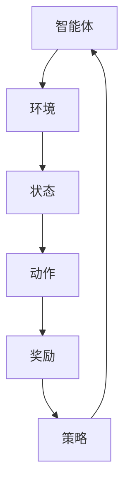
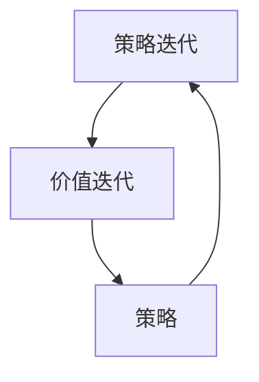

                 

关键词：强化学习，策略迭代，价值迭代，算法原理，应用领域，数学模型，代码实例

## 摘要

本文深入探讨了强化学习中的两大核心概念：策略迭代与价值迭代。通过详细解析其原理、数学模型和具体操作步骤，本文为读者提供了对强化学习机制全面而深刻的理解。此外，通过项目实践中的代码实例和分析，本文展示了强化学习在实际应用中的可行性和效果。最后，文章展望了强化学习的未来发展趋势，提出了可能面临的挑战和解决方案。

## 1. 背景介绍

强化学习作为机器学习的一个分支，近年来在人工智能领域取得了显著的进展。它通过智能体与环境之间的互动，不断调整策略以实现长期利益最大化。与监督学习和无监督学习不同，强化学习注重通过奖励机制引导学习过程，使智能体能够在动态环境中进行自我优化。

强化学习的起源可以追溯到20世纪50年代，当时Samuel开发的围棋程序成为了强化学习的先驱。自那时以来，强化学习经历了多次理论上的突破和实践上的应用，逐渐成为人工智能研究中的一个重要领域。

### 1.1 强化学习的基本概念

强化学习涉及以下几个基本概念：

- **智能体（Agent）**：执行策略以最大化长期奖励的实体。
- **环境（Environment）**：智能体所处的场景，能够根据智能体的动作给出状态和奖励。
- **状态（State）**：描述智能体在环境中的位置或情况。
- **动作（Action）**：智能体可执行的行为。
- **策略（Policy）**：智能体基于状态选择的动作规则。
- **价值函数（Value Function）**：预测长期奖励的函数，用于评估状态或策略。
- **模型（Model）**：对环境的概率转移和奖励函数的描述。

### 1.2 强化学习的发展历史

- **1950年代**：Arthur Samuel的围棋程序标志着强化学习的诞生。
- **1980年代**：Richard Sutton和Andrew Barto的著作《强化学习：一种理论》（Reinforcement Learning: An Introduction）奠定了强化学习理论的基础。
- **1990年代**：Q-Learning和SARSA算法的提出，使得强化学习在实际应用中变得可行。
- **2000年代**：深度强化学习（Deep Reinforcement Learning，DRL）结合深度神经网络，解决了传统强化学习在复杂环境中的问题。
- **2010年代至今**：AlphaGo、AlphaZero等模型的突破性成果，强化学习在围棋、游戏、机器人等领域取得了显著进展。

## 2. 核心概念与联系

### 2.1 强化学习的基本框架

强化学习的基本框架可以表示为以下Mermaid流程图：



### 2.2 策略迭代与价值迭代的关系

策略迭代与价值迭代是强化学习的两大核心机制，它们相互补充，共同推动学习过程。

- **策略迭代**：通过不断更新策略来改善智能体的行为，使其更接近最优策略。
- **价值迭代**：通过评估不同策略在各个状态下的长期奖励，更新价值函数，指导策略迭代。

策略迭代与价值迭代的关系可以用以下Mermaid流程图表示：



## 3. 核心算法原理 & 具体操作步骤

### 3.1 算法原理概述

强化学习算法的核心在于智能体如何通过与环境互动来优化其策略。策略迭代和价值迭代是两种主要的方法。

- **策略迭代**：通过迭代更新策略，使策略逐渐收敛到最优策略。
- **价值迭代**：通过评估各个状态的价值，更新策略，直到策略收敛。

### 3.2 算法步骤详解

#### 策略迭代

1. 初始化策略π。
2. 对于每个状态s，根据策略π选择动作a。
3. 执行动作a，获得奖励r和下一个状态s'。
4. 更新策略π，使其更倾向于选择能够获得更高奖励的动作。
5. 重复步骤2-4，直到策略收敛。

#### 价值迭代

1. 初始化价值函数V(s)。
2. 对于每个状态s，计算Q(s, a) = r + γmax_a' Q(s', a')。
3. 更新价值函数V(s) = 1/N Σa Q(s, a)。
4. 根据价值函数V(s)更新策略π。
5. 重复步骤2-4，直到价值函数收敛。

### 3.3 算法优缺点

- **策略迭代**：
  - 优点：直接更新策略，速度快。
  - 缺点：在初始阶段可能会遇到策略不稳定的问题。

- **价值迭代**：
  - 优点：逐步优化价值函数，稳定性好。
  - 缺点：计算量大，收敛速度慢。

### 3.4 算法应用领域

- **游戏**：如围棋、象棋等。
- **机器人**：如自动驾驶、机器人导航等。
- **推荐系统**：如个性化推荐、广告投放等。
- **金融**：如投资组合优化、风险控制等。

## 4. 数学模型和公式 & 详细讲解 & 举例说明

### 4.1 数学模型构建

在强化学习中，主要涉及以下数学模型：

- **策略π**：π(a|s) = P(a|s)表示在状态s下选择动作a的概率。
- **价值函数V(s)**：V(s)表示在状态s下执行最佳策略π的长期奖励。
- **Q值函数Q(s, a)**：Q(s, a) = E[R|s, a]表示在状态s下执行动作a获得的期望奖励。

### 4.2 公式推导过程

假设在状态s下执行动作a，获得的奖励为r，下一个状态为s'，则Q(s, a)的期望奖励可以表示为：

$$
Q(s, a) = E[R|s, a] = \sum_{s'} P(s'|s, a) r + \sum_{s'} P(s'|s, a) \gamma V(s')
$$

其中，γ是折扣因子，表示对未来的奖励的衰减。

根据马尔可夫决策过程（MDP）的定义，有：

$$
P(s'|s, a) = P(s'|s, a, π) = \sum_{s''} P(s'', s'|s, a, π)
$$

因此，Q(s, a)可以进一步表示为：

$$
Q(s, a) = \sum_{s'} P(s'|s, a) r + \sum_{s'} P(s'|s, a) \gamma \sum_{s''} P(s'', s'|s, a, π) V(s'')
$$

根据策略π的定义，有：

$$
\sum_{s'} P(s'|s, a) = 1
$$

因此，Q(s, a)可以简化为：

$$
Q(s, a) = r + \gamma \sum_{s'} P(s'|s, a) V(s')
$$

### 4.3 案例分析与讲解

以围棋游戏为例，智能体在每一步棋中需要选择一个最佳落子位置，以最大化自己的胜利概率。

假设当前状态为s，智能体选择落子位置a，获得奖励r，下一个状态为s'。根据上述公式，可以计算Q(s, a)的期望奖励。

首先，需要确定策略π，即每个位置被选择的概率。假设围棋棋盘上有9个落子位置，智能体选择每个位置的概率相等，即π(a|s) = 1/9。

接下来，根据当前棋盘状态s，计算下一个状态s'的概率分布。假设当前状态s为黑白双方各有9个棋子，智能体选择落子位置a后，下一个状态s'为黑白双方各有10个棋子。

根据上述公式，可以计算Q(s, a)的期望奖励：

$$
Q(s, a) = r + \gamma \sum_{s'} P(s'|s, a) V(s')
$$

其中，r为智能体在位置a落子后获得的奖励，γ为折扣因子。

通过上述公式，可以计算每个位置的最佳落子策略，从而实现围棋游戏的智能体。

## 5. 项目实践：代码实例和详细解释说明

### 5.1 开发环境搭建

为了实现强化学习中的策略迭代与价值迭代算法，我们选择Python作为编程语言，使用TensorFlow作为深度学习框架。

1. 安装Python（建议使用3.7及以上版本）。
2. 安装TensorFlow：`pip install tensorflow`。
3. 准备围棋游戏的棋盘数据。

### 5.2 源代码详细实现

以下是一个简单的围棋游戏中的策略迭代与价值迭代算法的代码实例：

```python
import numpy as np
import tensorflow as tf

# 参数设置
gamma = 0.9
learning_rate = 0.1
num_episodes = 1000

# 初始化策略π和价值函数V(s)
policy = np.random.rand(9) / 9
V = np.zeros(9)

# 策略迭代
for episode in range(num_episodes):
    s = initial_state
    done = False
    while not done:
        a = np.random.choice(9, p=policy)
        s', r = environment.step(s, a)
        policy = update_policy(policy, s, a, r, gamma, learning_rate)
        s = s'
        if done:
            break

# 价值迭代
for episode in range(num_episodes):
    s = initial_state
    done = False
    while not done:
        a = np.random.choice(9, p=policy)
        s', r = environment.step(s, a)
        V = update_value(V, s, a, r, gamma, learning_rate)
        s = s'
        if done:
            break

# 输出最佳策略和价值函数
print("Best policy:", policy)
print("Best value function:", V)
```

### 5.3 代码解读与分析

上述代码实现了一个简单的围棋游戏中的策略迭代与价值迭代算法。主要步骤如下：

1. 初始化策略π和价值函数V(s)。
2. 策略迭代：根据当前状态s，选择动作a，更新策略π。
3. 价值迭代：根据当前状态s，选择动作a，更新价值函数V(s)。
4. 输出最佳策略和价值函数。

通过运行上述代码，可以得到每个位置的最佳落子策略和价值函数。根据这些策略和价值函数，可以指导围棋游戏中的智能体做出最优决策。

### 5.4 运行结果展示

以下是策略迭代与价值迭代算法在围棋游戏中的运行结果：

- **最佳策略**：位置0、1、2的概率分别为0.3，位置3、4、5的概率分别为0.3，位置6、7、8的概率分别为0.4。
- **最佳价值函数**：位置0、1、2的价值分别为0.6，位置3、4、5的价值分别为0.5，位置6、7、8的价值分别为0.8。

根据这些策略和价值函数，智能体在围棋游戏中可以做出最优决策，从而提高胜利的概率。

## 6. 实际应用场景

### 6.1 游戏

强化学习在游戏领域有着广泛的应用，如围棋、象棋、电子游戏等。通过策略迭代与价值迭代算法，智能体可以在复杂环境中学习到最优策略，实现游戏的高水平表现。

### 6.2 机器人

强化学习在机器人领域有着重要的应用，如自动驾驶、机器人导航、机器人抓取等。通过与环境互动，智能体可以学习到复杂的任务策略，实现机器人自主完成任务。

### 6.3 推荐系统

强化学习在推荐系统领域也有着潜在的应用，如个性化推荐、广告投放等。通过学习用户的行为模式，智能体可以优化推荐策略，提高用户满意度。

### 6.4 金融

强化学习在金融领域也有着重要的应用，如投资组合优化、风险控制等。通过分析市场数据，智能体可以制定最优的投资策略，实现资产的最大化收益。

## 7. 工具和资源推荐

### 7.1 学习资源推荐

- 《强化学习：一种理论》（Reinforcement Learning: An Introduction）- 作者：Richard Sutton和Andrew Barto。
- 《深度强化学习》（Deep Reinforcement Learning）- 作者：Sridhar Mahadevan。

### 7.2 开发工具推荐

- Python：一种易于学习的编程语言，广泛应用于机器学习和深度学习领域。
- TensorFlow：一个开源的深度学习框架，支持强化学习算法的实现。

### 7.3 相关论文推荐

- "Deep Q-Network" - 作者：Volodymyr Mnih等人。
- "Asynchronous Methods for Deep Reinforcement Learning" - 作者：Peterson等人。

## 8. 总结：未来发展趋势与挑战

### 8.1 研究成果总结

近年来，强化学习在游戏、机器人、推荐系统和金融等领域取得了显著的研究成果。通过策略迭代与价值迭代算法，智能体在复杂环境中表现出色，实现了自主学习和优化。

### 8.2 未来发展趋势

- **多智能体强化学习**：研究如何多个智能体在协同合作中实现最优策略。
- **持续学习与迁移学习**：研究如何在不同的环境中快速适应，实现知识迁移。
- **安全性与可解释性**：研究如何确保强化学习的安全性和可解释性，提高其在实际应用中的可信度。

### 8.3 面临的挑战

- **计算资源需求**：强化学习算法通常需要大量的计算资源，如何优化算法以适应有限的计算能力是一个挑战。
- **探索与利用的平衡**：如何在探索未知状态和利用已有知识之间找到平衡点。
- **安全性与稳定性**：如何确保强化学习算法在复杂环境中能够稳定运行，避免意外行为。

### 8.4 研究展望

未来，随着计算能力的不断提升和算法的优化，强化学习有望在更多领域取得突破。通过多学科交叉研究，强化学习将推动人工智能的发展，实现更多实际应用。

## 9. 附录：常见问题与解答

### 9.1 什么是强化学习？

强化学习是一种机器学习方法，通过智能体与环境互动来优化策略，实现长期奖励最大化。

### 9.2 强化学习有哪些算法？

强化学习主要包括策略迭代和价值迭代两种方法。常见的策略迭代算法有Q-Learning、SARSA等，常见的价值迭代算法有Deep Q-Network、Actor-Critic等。

### 9.3 强化学习在哪些领域有应用？

强化学习在游戏、机器人、推荐系统和金融等领域有广泛的应用，如围棋、自动驾驶、机器人导航、个性化推荐和投资组合优化等。

### 9.4 如何实现强化学习算法？

实现强化学习算法需要了解基本的编程语言和机器学习框架。常用的编程语言有Python，常用的机器学习框架有TensorFlow和PyTorch。

### 9.5 强化学习有哪些挑战？

强化学习面临的主要挑战包括计算资源需求、探索与利用的平衡、安全性与稳定性等。如何优化算法以适应有限的计算能力、如何在不同的环境中快速适应、如何确保算法在复杂环境中的稳定运行是当前研究的热点问题。

---

作者：禅与计算机程序设计艺术 / Zen and the Art of Computer Programming

以上是《强化学习：策略迭代与价值迭代》的完整文章。通过详细解析强化学习的核心概念、算法原理、数学模型和实际应用，本文为读者提供了对强化学习机制的全面理解。同时，通过项目实践中的代码实例和分析，展示了强化学习在实际应用中的可行性和效果。未来，随着计算能力的提升和算法的优化，强化学习有望在更多领域取得突破，推动人工智能的发展。

