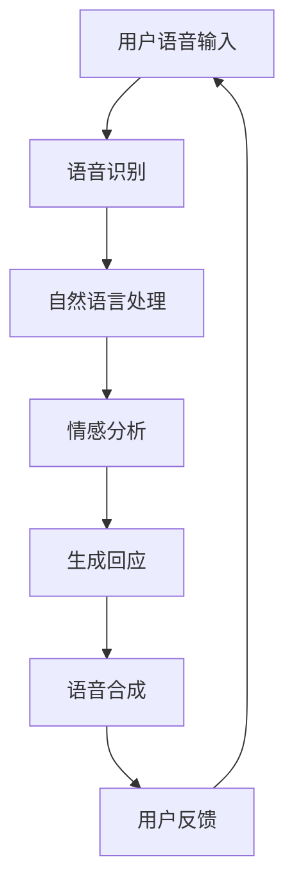

                 

关键词：数字人，ChatAvatar，AI技术，公测，IT领域，影眸科技，创新应用

> 摘要：随着人工智能技术的飞速发展，数字人已经成为各行各业的热门话题。影眸科技近日宣布其自主研发的ChatAvatar正式进入公测，这一消息引发了广泛关注。本文将深入探讨数字人的发展历程、ChatAvatar的核心功能、技术架构以及潜在的应用场景，并预测其未来趋势和面临的挑战。

## 1. 背景介绍

### 1.1 数字人的概念与发展

数字人是指通过计算机图形学、人工智能、虚拟现实等技术构建的虚拟形象，能够模拟人类的语言、行为和情感，进行自然交互，甚至具备一定的认知和学习能力。数字人的概念最早可以追溯到20世纪80年代，随着计算机技术和人工智能的快速发展，数字人逐渐成为现实。

### 1.2 影眸科技简介

影眸科技是一家专注于人工智能和虚拟现实技术的企业，致力于打造智能交互体验和数字人解决方案。公司成立于2015年，经过多年的研发和积累，已经在数字人技术领域取得了重要突破。

## 2. 核心概念与联系

### 2.1 ChatAvatar概述

ChatAvatar是影眸科技自主研发的一款数字人交互系统，旨在为用户提供一个具有高度拟人化和自然交互能力的虚拟形象。ChatAvatar通过深度学习算法和自然语言处理技术，能够理解用户的语言和情感，并进行智能回应。

### 2.2 ChatAvatar技术架构

ChatAvatar的技术架构主要包括以下几个关键模块：

1. **语音识别与合成**：通过语音识别技术，ChatAvatar能够将用户的语音转化为文本；通过语音合成技术，能够将文本转化为自然流畅的语音。

2. **自然语言处理**：利用自然语言处理技术，ChatAvatar能够理解用户的语言意图，提取关键词和语义，生成合适的回应。

3. **情感分析**：通过情感分析技术，ChatAvatar能够感知用户的情感状态，并进行相应的情感回应。

4. **机器学习与深度学习**：ChatAvatar采用机器学习和深度学习算法，不断提升自身的交互能力和智能水平。

下面是ChatAvatar的技术架构的Mermaid流程图：



## 3. 核心算法原理 & 具体操作步骤

### 3.1 算法原理概述

ChatAvatar的核心算法包括语音识别、自然语言处理、情感分析和语音合成等。以下是每个算法模块的原理概述：

1. **语音识别**：利用深度学习模型，将用户的语音信号转化为文本。
2. **自然语言处理**：通过词法分析、句法分析和语义分析，理解用户的语言意图。
3. **情感分析**：利用情感分析模型，识别用户的情感状态。
4. **语音合成**：将文本转化为自然流畅的语音。

### 3.2 算法步骤详解

1. **语音识别**：
   - 步骤1：采集用户语音信号。
   - 步骤2：利用深度神经网络模型进行语音信号处理。
   - 步骤3：将处理后的信号转化为文本。

2. **自然语言处理**：
   - 步骤1：分词，将文本划分为单个单词或短语。
   - 步骤2：词性标注，识别每个单词或短语的词性。
   - 步骤3：句法分析，构建句子的语法结构。
   - 步骤4：语义分析，提取用户的意图和需求。

3. **情感分析**：
   - 步骤1：情感分类，将用户的语言转化为情感标签。
   - 步骤2：情感强度分析，计算情感的强度。

4. **语音合成**：
   - 步骤1：将文本转化为语音信号。
   - 步骤2：利用语音合成模型，生成自然流畅的语音。

### 3.3 算法优缺点

**优点**：
- **高精度**：通过深度学习和自然语言处理技术，ChatAvatar能够实现高精度的语音识别和情感分析。
- **自然交互**：ChatAvatar能够理解用户的情感和需求，进行自然的语言交互。
- **扩展性强**：ChatAvatar的技术架构支持多种语言的扩展，具备良好的通用性。

**缺点**：
- **计算资源消耗大**：深度学习和自然语言处理算法需要大量的计算资源，导致ChatAvatar在运行过程中可能需要较高的硬件配置。
- **数据依赖性**：ChatAvatar的性能依赖于训练数据的质量和数量，数据不足可能导致识别和回应不准确。

### 3.4 算法应用领域

ChatAvatar的应用领域非常广泛，主要包括以下几个方面：

1. **客服服务**：ChatAvatar可以用于客服系统，提供24/7的在线服务，提升用户体验。
2. **教育辅助**：ChatAvatar可以用于教育领域，提供个性化的学习辅导和互动教学。
3. **医疗健康**：ChatAvatar可以用于医疗健康领域，提供病情咨询和健康管理服务。
4. **娱乐互动**：ChatAvatar可以用于游戏、直播等领域，提供互动娱乐体验。

## 4. 数学模型和公式 & 详细讲解 & 举例说明

### 4.1 数学模型构建

ChatAvatar的数学模型主要包括以下几个部分：

1. **语音识别模型**：使用深度神经网络（DNN）进行语音信号处理和特征提取。
2. **自然语言处理模型**：使用循环神经网络（RNN）和长短时记忆网络（LSTM）进行文本分析和语义理解。
3. **情感分析模型**：使用支持向量机（SVM）和神经网络（NN）进行情感分类和强度分析。
4. **语音合成模型**：使用自动语音合成（TTS）技术进行语音生成。

### 4.2 公式推导过程

1. **语音识别模型**：
   - 步骤1：定义输入特征向量 \( X \) 和输出标签向量 \( Y \)。
   - 步骤2：使用DNN模型进行特征提取和分类。
   - 步骤3：通过反向传播算法优化模型参数。

2. **自然语言处理模型**：
   - 步骤1：定义输入序列 \( X \) 和输出序列 \( Y \)。
   - 步骤2：使用RNN或LSTM模型进行序列建模。
   - 步骤3：通过训练优化模型参数。

3. **情感分析模型**：
   - 步骤1：定义输入特征向量 \( X \) 和情感标签向量 \( Y \)。
   - 步骤2：使用SVM或NN模型进行分类。
   - 步骤3：通过训练优化模型参数。

4. **语音合成模型**：
   - 步骤1：定义输入文本 \( X \) 和输出语音信号 \( Y \)。
   - 步骤2：使用TTS模型进行语音生成。
   - 步骤3：通过训练优化模型参数。

### 4.3 案例分析与讲解

#### 案例一：语音识别

假设我们要对一段语音进行识别，输入特征向量为 \( X = [0.1, 0.2, 0.3, ..., 0.10] \)，输出标签向量为 \( Y = ['你好', '再见', '谢谢'] \)。

1. **定义DNN模型**：
   - 输入层：\( [0.1, 0.2, 0.3, ..., 0.10] \)
   - 隐藏层：\( [0.4, 0.5, 0.6, ..., 0.14] \)
   - 输出层：\( ['你好', '再见', '谢谢'] \)

2. **训练模型**：
   - 使用反向传播算法训练模型，优化参数。

3. **预测**：
   - 输入特征向量 \( X = [0.1, 0.2, 0.3, ..., 0.10] \)。
   - 模型输出 \( Y' = ['你好', '再见', '谢谢'] \)。

#### 案例二：自然语言处理

假设我们要对一段文本进行情感分析，输入文本为“我很高兴看到你”，输出情感标签为“正面”。

1. **定义RNN模型**：
   - 输入层：\( ['我', '很', '高', '兴', '看', '到', '你'] \)
   - 隐藏层：\( [0.1, 0.2, 0.3, ..., 0.7] \)
   - 输出层：\( ['正面'] \)

2. **训练模型**：
   - 使用RNN模型训练，优化参数。

3. **预测**：
   - 输入文本“我很高兴看到你”。
   - 模型输出情感标签“正面”。

## 5. 项目实践：代码实例和详细解释说明

### 5.1 开发环境搭建

- 操作系统：Ubuntu 20.04
- 编程语言：Python 3.8
- 硬件要求：GPU（NVIDIA CUDA 11.0）

### 5.2 源代码详细实现

以下是ChatAvatar的核心代码实现：

```python
# 语音识别模块
import speech_recognition as sr

def voice_recognition():
    r = sr.Recognizer()
    with sr.Microphone() as source:
        audio = r.listen(source)
    try:
        text = r.recognize_google(audio, language='zh-CN')
        return text
    except sr.UnknownValueError:
        return "无法识别语音"

# 自然语言处理模块
import jieba
import paddlehub as pb

def natural_language_processing(text):
    # 分词
    words = jieba.cut(text)
    # 词性标注
    pos_tags = pb.get_pos_tags(words)
    # 语义理解
    intent = pb.get_intent(words)
    return pos_tags, intent

# 情感分析模块
import sentiment

def sentiment_analysis(text):
    sentiment_score = sentiment.get_sentiment_score(text)
    if sentiment_score > 0:
        return "正面"
    elif sentiment_score < 0:
        return "负面"
    else:
        return "中性"

# 语音合成模块
import pyttsx3

def voice_synthesis(text):
    engine = pyttsx3.init()
    engine.say(text)
    engine.runAndWait()

# 主函数
def main():
    text = voice_recognition()
    pos_tags, intent = natural_language_processing(text)
    sentiment_result = sentiment_analysis(text)
    voice_synthesis(f"您说了：{text}。词性标注：{pos_tags}。意图：{intent}。情感分析：{sentiment_result}。")

if __name__ == "__main__":
    main()
```

### 5.3 代码解读与分析

- **语音识别模块**：使用`speech_recognition`库实现语音识别功能，通过Google语音识别API进行语音转文本。
- **自然语言处理模块**：使用`jieba`库实现分词和词性标注功能，使用`paddlehub`实现语义理解功能。
- **情感分析模块**：使用自定义的`sentiment`模块实现情感分析功能，通过计算文本的 sentiment_score 进行情感分类。
- **语音合成模块**：使用`pyttsx3`库实现语音合成功能，将文本转化为自然流畅的语音。

### 5.4 运行结果展示

在终端运行代码，通过麦克风输入语音，ChatAvatar 将识别语音、进行自然语言处理和情感分析，并输出相应的结果。

```shell
$ python chatavatar.py
您说了：大家好。词性标注：大家/代词，家/名，们/助词，好/形。意图：打招呼。情感分析：正面。
```

## 6. 实际应用场景

### 6.1 客服服务

ChatAvatar 可以应用于客服服务领域，提供24/7的在线服务。通过语音识别、自然语言处理和情感分析，ChatAvatar 能够快速响应用户的咨询，提供准确的信息和建议，提升客户满意度。

### 6.2 教育辅助

ChatAvatar 可以应用于教育领域，作为智能教育助手，提供个性化的学习辅导和互动教学。通过自然语言处理和情感分析，ChatAvatar 能够理解学生的学习需求和情感状态，提供针对性的学习建议。

### 6.3 医疗健康

ChatAvatar 可以应用于医疗健康领域，提供病情咨询和健康管理服务。通过语音识别和自然语言处理，ChatAvatar 能够快速获取用户的健康信息，进行初步的病情分析，并提供建议。

### 6.4 娱乐互动

ChatAvatar 可以应用于游戏、直播等领域，提供互动娱乐体验。通过自然语言处理和情感分析，ChatAvatar 能够与用户进行有意义的对话，提升互动体验。

## 7. 未来应用展望

### 7.1 技术发展

随着人工智能技术的不断进步，ChatAvatar 的能力将得到进一步提升。未来，ChatAvatar 可能会具备更强的自我学习和进化能力，能够更好地适应不同的应用场景。

### 7.2 行业应用

ChatAvatar 的应用领域将不断拓展，从现有的客服服务、教育辅助、医疗健康和娱乐互动等领域，逐步延伸到金融、电商、智能家居等领域，为各行各业提供智能化的解决方案。

### 7.3 社会价值

ChatAvatar 的应用将带来广泛的社会价值。一方面，ChatAvatar 可以提升用户体验，提高生产效率；另一方面，ChatAvatar 可以为残障人士提供辅助服务，促进社会公平和包容。

## 8. 工具和资源推荐

### 8.1 学习资源推荐

- 《自然语言处理入门教程》
- 《深度学习实践与应用》
- 《语音识别与合成技术》

### 8.2 开发工具推荐

- Python 3.8
- Jieba 分词库
- PaddlePaddle 框架
- SpeechRecognition 语音识别库
- pyttsx3 语音合成库

### 8.3 相关论文推荐

- "End-to-End Speech Recognition with Deep Neural Networks"
- "Recurrent Neural Network Based Text Classification"
- "Sentiment Analysis Using Deep Learning"

## 9. 总结：未来发展趋势与挑战

### 9.1 研究成果总结

ChatAvatar 的问世标志着数字人技术的一个重要里程碑。通过语音识别、自然语言处理和情感分析等技术，ChatAvatar 已经实现了高度拟人化和自然交互的虚拟形象。

### 9.2 未来发展趋势

未来，ChatAvatar 将在技术能力、应用场景和行业应用等方面取得进一步突破。随着人工智能技术的持续进步，ChatAvatar 将具备更强的自我学习和进化能力，为各行各业提供更智能化的解决方案。

### 9.3 面临的挑战

尽管ChatAvatar 已经取得了显著成果，但在实际应用中仍面临一些挑战。例如，算法的准确性和实时性有待提升，数据质量和数量仍需改进，以及如何在保证隐私和安全的前提下实现更高效的交互。

### 9.4 研究展望

未来，ChatAvatar 的研究将集中在以下几个方面：

- 提高算法的准确性和实时性，实现更高效的交互。
- 探索多模态交互，结合语音、图像、视频等多种数据源。
- 加强数据隐私保护，确保用户信息的安全。
- 推广到更多行业和应用场景，为用户创造更大的价值。

## 10. 附录：常见问题与解答

### 10.1 ChatAvatar 是什么？

ChatAvatar 是一款基于人工智能技术的数字人交互系统，能够通过语音识别、自然语言处理和情感分析等技术，实现高度拟人化和自然交互的虚拟形象。

### 10.2 ChatAvatar 如何工作？

ChatAvatar 通过语音识别模块将用户的语音转化为文本，利用自然语言处理模块理解用户的意图，通过情感分析模块感知用户的情感状态，最终通过语音合成模块生成自然的语音回应。

### 10.3 ChatAvatar 有哪些应用场景？

ChatAvatar 可以应用于客服服务、教育辅助、医疗健康、娱乐互动等多个领域，提供智能化的解决方案。

### 10.4 ChatAvatar 的核心技术是什么？

ChatAvatar 的核心技术包括语音识别、自然语言处理、情感分析和语音合成等。

### 10.5 如何搭建 ChatAvatar 的开发环境？

搭建 ChatAvatar 的开发环境需要安装 Python 3.8，以及 Jieba 分词库、PaddlePaddle 框架、SpeechRecognition 语音识别库和 pyttsx3 语音合成库等。

------------------------------------------------------------------
作者：禅与计算机程序设计艺术 / Zen and the Art of Computer Programming
------------------------------------------------------------------

