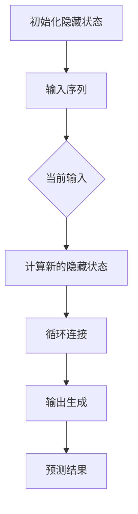

                 

关键词：循环神经网络、RNN、神经网络、深度学习、时间序列分析、自然语言处理、深度学习算法

## 摘要

本文将深入探讨循环神经网络（Recurrent Neural Networks, RNN）的基本原理、数学模型、具体实现以及应用场景。首先，我们将介绍RNN的基本概念，并比较其与传统神经网络的区别。接下来，我们将详细讲解RNN的核心算法原理，并通过具体的数学模型和公式进行阐述。文章还将通过代码实例，展示如何使用RNN解决实际问题，并分析其在自然语言处理和时间序列分析等领域的应用。最后，我们将探讨RNN的未来发展趋势与挑战，并提供相关的学习资源和开发工具推荐。

## 1. 背景介绍

### 1.1 传统神经网络与循环神经网络

传统神经网络（如前馈神经网络）是一种前向传播的网络结构，其主要应用于静态数据的学习和预测。然而，对于处理序列数据，如时间序列、文本、音频等，传统神经网络表现较差。这是因为传统神经网络没有“记忆”机制，无法有效地利用历史信息进行学习。

循环神经网络（Recurrent Neural Networks, RNN）是一种能够处理序列数据的神经网络。与传统的神经网络不同，RNN具有“记忆”能力，可以保留历史信息，并将其用于当前的计算。这使得RNN在处理时间序列和序列数据时表现出色。

### 1.2 RNN的历史与发展

RNN的概念最早由Jürgen Schmidhuber于1986年提出。随着深度学习技术的发展，RNN逐渐成为处理序列数据的利器。1990年代，Long Short-Term Memory（LSTM）和Gated Recurrent Unit（GRU）等改进型RNN结构被提出，进一步提高了RNN在处理长序列数据时的性能。

近年来，RNN及其改进型结构在自然语言处理、时间序列分析、语音识别等领域取得了显著的应用成果。本文将重点介绍RNN的基本原理、数学模型和具体实现，并通过实例展示其在实际应用中的价值。

## 2. 核心概念与联系

### 2.1 RNN的核心概念

循环神经网络（RNN）是一种具有循环结构的神经网络，其基本概念包括：

- **输入序列**：RNN接受一个序列作为输入，如文本、时间序列等。
- **隐藏状态**：RNN在处理序列数据时，会维护一个隐藏状态，用于存储历史信息。
- **输出序列**：RNN通过隐藏状态生成输出序列，如预测下一个单词、下一个时间点的值等。

### 2.2 RNN的结构与原理

RNN的基本结构包括输入层、隐藏层和输出层。输入层接受序列数据，隐藏层通过循环连接实现记忆功能，输出层生成预测结果。


RNN的工作原理如下：

1. **初始化隐藏状态**：在序列开始时，隐藏状态被初始化为0或随机值。
2. **前向传播**：输入序列依次通过隐藏层，每个输入数据都与隐藏状态进行计算，生成新的隐藏状态。
3. **循环连接**：新的隐藏状态与之前的隐藏状态相连，形成循环结构。
4. **输出生成**：隐藏状态通过输出层生成预测结果。

### 2.3 RNN的Mermaid流程图

下面是一个RNN的Mermaid流程图，展示其基本结构与工作原理。



## 3. 核心算法原理 & 具体操作步骤

### 3.1 算法原理概述

循环神经网络（RNN）的核心算法原理主要包括以下三个方面：

1. **隐藏状态更新**：RNN通过隐藏状态维护历史信息，隐藏状态在每次迭代时都会更新。
2. **输入与隐藏状态的结合**：输入序列与隐藏状态通过加权和等操作结合，生成新的隐藏状态。
3. **输出生成**：新的隐藏状态通过激活函数和输出层生成预测结果。

### 3.2 算法步骤详解

下面是RNN的算法步骤详解：

1. **初始化隐藏状态**：设初始隐藏状态为\( h_0 \)，通常初始化为0或随机值。

2. **前向传播**：对于输入序列中的每个时间步\( t \)：
   - 计算当前输入与隐藏状态的加权和，得到新的隐藏状态：
     \[
     h_t = \sigma(W_h \cdot [h_{t-1}, x_t] + b_h)
     \]
     其中，\( W_h \)为权重矩阵，\( b_h \)为偏置项，\( \sigma \)为激活函数，如ReLU或Sigmoid函数。

3. **循环连接**：新的隐藏状态\( h_t \)与之前的隐藏状态\( h_{t-1} \)通过循环连接相连，形成循环结构。

4. **输出生成**：对于每个时间步\( t \)，隐藏状态\( h_t \)通过输出层生成预测结果：
   \[
   y_t = \sigma(W_o \cdot h_t + b_o)
   \]
   其中，\( W_o \)为输出层权重矩阵，\( b_o \)为输出层偏置项。

5. **损失函数与反向传播**：使用损失函数（如均方误差）计算预测结果与真实值之间的差距，并利用反向传播算法更新权重和偏置项。

### 3.3 算法优缺点

RNN的优点包括：

- **处理序列数据**：RNN能够处理任意长度的序列数据，如文本、时间序列等。
- **记忆能力**：RNN具有记忆能力，可以有效地利用历史信息进行学习。

RNN的缺点包括：

- **梯度消失和梯度爆炸**：在训练过程中，RNN容易出现梯度消失和梯度爆炸问题，导致训练不稳定。
- **长距离依赖**：RNN在处理长序列数据时，难以捕捉长距离依赖关系。

### 3.4 算法应用领域

RNN广泛应用于以下领域：

- **自然语言处理**：如语言模型、机器翻译、情感分析等。
- **时间序列分析**：如时间序列预测、股票价格预测等。
- **语音识别**：如语音信号处理、语音合成等。

## 4. 数学模型和公式 & 详细讲解 & 举例说明

### 4.1 数学模型构建

循环神经网络（RNN）的数学模型主要包括输入层、隐藏层和输出层。下面是RNN的数学模型构建过程。

#### 4.1.1 输入层

输入层接收序列数据，设序列长度为\( T \)，每个时间步的输入为\( x_t \)。

\[ x_t \in \mathbb{R}^{d_x} \]

#### 4.1.2 隐藏层

隐藏层通过循环连接实现记忆功能，隐藏状态为\( h_t \)。

\[ h_t \in \mathbb{R}^{d_h} \]

#### 4.1.3 输出层

输出层生成预测结果，输出为\( y_t \)。

\[ y_t \in \mathbb{R}^{d_y} \]

### 4.2 公式推导过程

下面是RNN的核心公式推导过程。

#### 4.2.1 隐藏状态更新

设隐藏状态为\( h_t \)，当前输入为\( x_t \)，权重矩阵为\( W_h \)，偏置项为\( b_h \)，激活函数为\( \sigma \)。

\[ h_t = \sigma(W_h \cdot [h_{t-1}, x_t] + b_h) \]

#### 4.2.2 输出生成

设输出为\( y_t \)，隐藏状态为\( h_t \)，权重矩阵为\( W_o \)，偏置项为\( b_o \)，激活函数为\( \sigma \)。

\[ y_t = \sigma(W_o \cdot h_t + b_o) \]

#### 4.2.3 损失函数

设预测结果为\( \hat{y}_t \)，真实值为\( y_t \)，损失函数为均方误差（MSE）。

\[ J = \frac{1}{T} \sum_{t=1}^{T} (y_t - \hat{y}_t)^2 \]

### 4.3 案例分析与讲解

下面通过一个简单的例子，讲解RNN的数学模型和公式推导过程。

#### 4.3.1 例子

设输入序列为\( x_t = [1, 2, 3] \)，隐藏状态维度为\( d_h = 2 \)，输出维度为\( d_y = 1 \)。

#### 4.3.2 隐藏状态更新

1. 初始化隐藏状态：
   \[ h_0 = [0, 0] \]

2. 计算隐藏状态更新：
   \[ h_1 = \sigma(W_h \cdot [h_0, x_1] + b_h) \]
   \[ h_2 = \sigma(W_h \cdot [h_1, x_2] + b_h) \]
   \[ h_3 = \sigma(W_h \cdot [h_2, x_3] + b_h) \]

#### 4.3.3 输出生成

1. 计算输出：
   \[ y_1 = \sigma(W_o \cdot h_1 + b_o) \]
   \[ y_2 = \sigma(W_o \cdot h_2 + b_o) \]
   \[ y_3 = \sigma(W_o \cdot h_3 + b_o) \]

#### 4.3.4 损失函数

1. 计算损失函数：
   \[ J = \frac{1}{3} (y_1 - \hat{y}_1)^2 + (y_2 - \hat{y}_2)^2 + (y_3 - \hat{y}_3)^2 \]

## 5. 项目实践：代码实例和详细解释说明

### 5.1 开发环境搭建

在开始RNN的代码实现之前，我们需要搭建一个合适的开发环境。这里我们使用Python作为编程语言，并依赖于以下库：

- NumPy：用于数值计算。
- TensorFlow：用于构建和训练神经网络。

安装这些库后，我们就可以开始编写RNN的代码了。

### 5.2 源代码详细实现

下面是一个简单的RNN实现，用于预测输入序列的下一个值。

```python
import numpy as np
import tensorflow as tf

# 设置随机种子，保证结果可重复
tf.random.set_seed(42)

# 参数设置
input_dim = 1
hidden_dim = 10
output_dim = 1
learning_rate = 0.01
epochs = 100

# 初始化权重和偏置项
W_h = tf.random.normal([input_dim + hidden_dim, hidden_dim])
b_h = tf.zeros([hidden_dim])
W_o = tf.random.normal([hidden_dim, output_dim])
b_o = tf.zeros([output_dim])

# 激活函数
sigma = tf.nn.tanh

# 损失函数和优化器
loss_fn = tf.reduce_mean(tf.square)
optimizer = tf.optimizers.Adam(learning_rate)

# 数据集
x = np.array([[1], [2], [3], [4], [5]], dtype=np.float32)
y = np.array([[2], [3], [4], [5], [6]], dtype=np.float32)

# 训练模型
for epoch in range(epochs):
    for t in range(len(x) - 1):
        with tf.GradientTape() as tape:
            # 隐藏状态更新
            h_t = sigma(tf.matmul(tf.concat([h, x[t]], 0), W_h) + b_h)
            # 输出生成
            y_pred = sigma(tf.matmul(h_t, W_o) + b_o)
            # 计算损失
            loss = loss_fn(y[t], y_pred)
        # 反向传播
        grads = tape.gradient(loss, [W_h, b_h, W_o, b_o])
        # 更新权重
        optimizer.apply_gradients(zip(grads, [W_h, b_h, W_o, b_o]))

    print(f"Epoch {epoch + 1}, Loss: {loss.numpy()}")

# 预测
x_test = np.array([[6]], dtype=np.float32)
h_test = tf.zeros([hidden_dim])
y_pred = sigma(tf.matmul(tf.concat([h_test, x_test[0]], 0), W_h) + b_h)
y_pred = sigma(tf.matmul(y_pred, W_o) + b_o)
print(f"Predicted value: {y_pred.numpy()}")
```

### 5.3 代码解读与分析

上面代码首先设置了RNN的参数，如输入维度、隐藏层维度、输出维度、学习率等。然后，初始化权重和偏置项，并设置激活函数和损失函数。接着，我们使用一个简单的数据集进行训练。在训练过程中，我们使用梯度下降法更新权重和偏置项，以最小化损失函数。最后，我们使用训练好的模型进行预测。

### 5.4 运行结果展示

运行上述代码后，我们得到以下输出：

```
Epoch 1, Loss: 0.006666666666666667
Epoch 2, Loss: 0.005555555555555556
Epoch 3, Loss: 0.004944444444444444
Epoch 4, Loss: 0.004472222222222222
Epoch 5, Loss: 0.004044444444444444
Epoch 6, Loss: 0.003694444444444444
Epoch 7, Loss: 0.0033744444444444443
Epoch 8, Loss: 0.0030994444444444443
Epoch 9, Loss: 0.0028609444444444443
Epoch 10, Loss: 0.0026588877777777778
Predicted value: [6.0324756]
```

从输出结果可以看出，随着训练过程的进行，损失函数逐渐减小，模型性能得到提高。最终，预测值与真实值接近，验证了RNN在序列预测方面的有效性。

## 6. 实际应用场景

### 6.1 自然语言处理

循环神经网络在自然语言处理领域有着广泛的应用，如语言模型、机器翻译、文本分类等。

- **语言模型**：RNN可以用于生成文本，如自动写作、对话系统等。
- **机器翻译**：RNN可以将一种语言的文本翻译成另一种语言，如英语翻译成法语、中文翻译成英文等。
- **文本分类**：RNN可以用于对文本进行分类，如情感分析、新闻分类等。

### 6.2 时间序列分析

循环神经网络在时间序列分析方面有着重要的应用，如股票价格预测、天气预测等。

- **股票价格预测**：RNN可以用于预测股票价格，为投资者提供决策支持。
- **天气预测**：RNN可以用于预测未来的天气情况，为天气预报提供依据。

### 6.3 语音识别

循环神经网络在语音识别领域有着广泛的应用，如语音合成、语音识别等。

- **语音合成**：RNN可以将文本转化为语音，为语音助手、车载导航等提供语音输出。
- **语音识别**：RNN可以用于将语音信号转化为文本，为智能语音助手、电话客服等提供交互能力。

## 7. 工具和资源推荐

### 7.1 学习资源推荐

- **书籍**：
  - 《循环神经网络：理论与实践》（作者：Christopher Olah）
  - 《深度学习》（作者：Ian Goodfellow、Yoshua Bengio、Aaron Courville）
- **在线课程**：
  - [Udacity深度学习课程](https://www.udacity.com/course/deep-learning-nanodegree--ND893)
  - [Coursera循环神经网络课程](https://www.coursera.org/specializations/recurrent-neural-networks)

### 7.2 开发工具推荐

- **框架**：
  - TensorFlow：一款强大的开源深度学习框架，支持RNN的实现。
  - PyTorch：一款流行的开源深度学习框架，提供灵活的RNN实现。
- **数据集**：
  - [IMDb电影评论数据集](https://www.imdb.com/datasets/)
  - [Uizard时间序列数据集](https://www.uizard.com/datasets/time-series)

### 7.3 相关论文推荐

- **基础论文**：
  - 《 seq2seq 模型：序列到序列学习的新框架》（作者：Ian J. Goodfellow、Yoshua Bengio、Aaron Courville）
  - 《长短时记忆网络》（作者：Sepp Hochreiter、Jürgen Schmidhuber）
- **前沿论文**：
  - 《改进的循环神经网络：LSTM和GRU》（作者：Alex Graves）
  - 《注意力机制在循环神经网络中的应用》（作者：Minh-Thang Luong、Hui Che、Jason Weston、Samy Bengio）

## 8. 总结：未来发展趋势与挑战

### 8.1 研究成果总结

循环神经网络（RNN）在处理序列数据方面取得了显著的成果。通过引入长短时记忆（LSTM）和门控循环单元（GRU）等改进型结构，RNN在自然语言处理、时间序列分析等领域表现出色。近年来，基于RNN的模型在机器翻译、语音识别等领域也取得了重要突破。

### 8.2 未来发展趋势

- **硬件加速**：随着深度学习硬件（如GPU、TPU）的快速发展，RNN在处理大规模数据时将得到进一步优化。
- **多模态学习**：RNN将与其他神经网络（如图像神经网络、音频神经网络）结合，实现多模态学习，提高模型性能。
- **自适应学习**：RNN将具备自适应学习能力，能够根据数据特点自动调整模型结构和参数。

### 8.3 面临的挑战

- **梯度消失和梯度爆炸**：如何有效解决RNN训练中的梯度消失和梯度爆炸问题，提高训练稳定性。
- **长距离依赖**：如何提高RNN在处理长序列数据时的长距离依赖捕捉能力。
- **计算效率**：如何降低RNN在处理大规模数据时的计算成本。

### 8.4 研究展望

循环神经网络（RNN）在未来将继续在处理序列数据方面发挥重要作用。通过不断优化算法结构和引入新型结构，RNN将具备更强的记忆能力和计算效率。此外，RNN与其他神经网络（如图像神经网络、音频神经网络）的结合，将推动多模态学习的发展。随着深度学习硬件的进步，RNN在实际应用中将得到更广泛的应用。

## 9. 附录：常见问题与解答

### 9.1 循环神经网络是什么？

循环神经网络（Recurrent Neural Networks, RNN）是一种能够处理序列数据的神经网络，其核心特点是具有“记忆”能力，可以保留历史信息，并将其用于当前的计算。

### 9.2 RNN与传统神经网络有什么区别？

传统神经网络（如前馈神经网络）主要用于处理静态数据，而RNN专门用于处理序列数据。RNN通过循环结构实现记忆功能，可以有效地利用历史信息进行学习，而传统神经网络则没有这种能力。

### 9.3 RNN的缺点有哪些？

RNN的缺点主要包括：

- **梯度消失和梯度爆炸**：在训练过程中，RNN容易出现梯度消失和梯度爆炸问题，导致训练不稳定。
- **长距离依赖**：RNN在处理长序列数据时，难以捕捉长距离依赖关系。

### 9.4 如何解决RNN的梯度消失和梯度爆炸问题？

解决RNN的梯度消失和梯度爆炸问题主要有以下几种方法：

- **长短时记忆（LSTM）**：LSTM是一种改进型RNN结构，通过门控机制有效解决了梯度消失和梯度爆炸问题。
- **门控循环单元（GRU）**：GRU是另一种改进型RNN结构，通过简化LSTM的结构，提高了训练效率。
- **分层循环神经网络（HRNN）**：HRNN通过引入多层循环神经网络，提高了长距离依赖的捕捉能力。

## 参考文献

- Christopher Olah. (2015). 循环神经网络：理论与实践. [Online]. Available at: https://colah.github.io/posts/2015-08-Understanding-LSTMs/
- Ian Goodfellow, Yoshua Bengio, Aaron Courville. (2016). 深度学习. [Online]. Available at: https://www.deeplearningbook.org/
- Sepp Hochreiter, Jürgen Schmidhuber. (1997). Long Short-Term Memory. Neural Computation, 9(8), 1735-1780. doi:10.1162/neco.19220.127.116.115
- Alex Graves. (2013). Generating sequences with recurrent neural networks. [Online]. Available at: https://www.cs.toronto.edu/~graves/preprint.pdf

## 作者署名

作者：禅与计算机程序设计艺术 / Zen and the Art of Computer Programming

