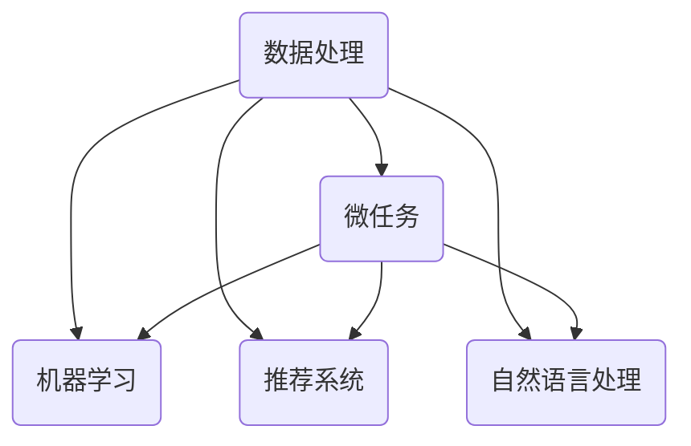

                 

关键词：微任务、人类计算、计算价值、自动化、算法原理、应用场景、未来展望

摘要：本文旨在探讨微任务在人类计算中的重要作用和价值体现。通过分析微任务的定义、特点及其在各个领域中的应用，我们将揭示人类计算的魅力所在，并探讨其未来发展趋势和面临的挑战。

## 1. 背景介绍

在当今信息时代，数据处理和计算能力已成为社会发展的关键驱动力。随着计算机技术的飞速发展，人类计算的范围不断扩大，从简单的计算任务到复杂的数据分析、机器学习等，都离不开人类智慧的结晶。然而，在众多计算任务中，有一种被称为“微任务”的类别，往往被忽视，但它们却发挥着不可替代的作用。本文将重点关注微任务在人类计算中的价值体现，以期引起读者对这一领域的关注。

### 1.1 微任务的定义与特点

微任务，顾名思义，是指规模较小、复杂度较低的计算任务。这些任务往往不需要复杂的算法和大量的计算资源，但却能在特定的领域发挥重要作用。微任务的特点主要体现在以下几个方面：

1. **规模小**：微任务的规模相对较小，通常涉及的数据量较小，计算复杂度较低。
2. **简单性**：微任务通常具有较低的复杂度，可以使用简单的算法或逻辑来解决。
3. **多样性**：微任务涵盖广泛，包括分类、预测、排序、推荐等。
4. **高效性**：微任务通常可以在较短的时间内完成，具有较高的效率。

### 1.2 微任务在人类计算中的重要性

尽管微任务规模较小，但它们在人类计算中却扮演着至关重要的角色。以下是微任务在多个领域中的重要作用：

1. **数据处理**：在数据处理领域，微任务可以用于数据清洗、数据转换等预处理工作，为后续数据分析奠定基础。
2. **机器学习**：在机器学习领域，微任务可以用于特征提取、模型评估等环节，有助于提升模型的准确性和效率。
3. **推荐系统**：在推荐系统领域，微任务可以用于用户行为分析、推荐策略优化等，提高推荐系统的效果。
4. **自然语言处理**：在自然语言处理领域，微任务可以用于文本分类、情感分析等，有助于提高文本处理的准确性。

## 2. 核心概念与联系

为了更好地理解微任务在人类计算中的地位，我们需要从核心概念和联系的角度进行分析。以下是一个简化的 Mermaid 流程图，展示了微任务与其他计算任务之间的关系：



在这个流程图中，数据处理作为基础，连接着各个领域的微任务。微任务不仅贯穿于数据处理、机器学习、推荐系统和自然语言处理等各个环节，而且在这些领域发挥着重要作用。通过这个流程图，我们可以更清晰地看到微任务在人类计算中的重要地位。

### 2.1 数据处理中的微任务

在数据处理领域，微任务通常用于数据清洗、数据转换和数据格式化等预处理工作。这些任务虽然规模较小，但却是数据分析的基础。以下是一些典型的数据处理微任务：

1. **数据清洗**：用于处理数据中的噪声、缺失值和重复值等，保证数据的准确性。
2. **数据转换**：将数据从一种格式转换为另一种格式，以便后续处理。
3. **数据格式化**：对数据进行格式化，使其符合特定的规范和要求。

### 2.2 机器学习中的微任务

在机器学习领域，微任务广泛应用于特征提取、模型评估、超参数调整等环节。这些任务虽然规模较小，但却是模型训练和优化的关键。以下是一些典型的机器学习微任务：

1. **特征提取**：从原始数据中提取有用的特征，用于训练模型。
2. **模型评估**：评估模型的性能，选择合适的模型和参数。
3. **超参数调整**：调整模型的超参数，以提高模型的准确性和效率。

### 2.3 推荐系统中的微任务

在推荐系统领域，微任务主要用于用户行为分析、推荐策略优化等。这些任务虽然规模较小，但却是推荐系统效果的关键。以下是一些典型的推荐系统微任务：

1. **用户行为分析**：分析用户的行为数据，挖掘用户的兴趣和偏好。
2. **推荐策略优化**：优化推荐策略，提高推荐系统的效果。
3. **冷启动问题**：解决新用户或新物品的推荐问题。

### 2.4 自然语言处理中的微任务

在自然语言处理领域，微任务广泛应用于文本分类、情感分析、命名实体识别等。这些任务虽然规模较小，但却是自然语言处理应用的基础。以下是一些典型的自然语言处理微任务：

1. **文本分类**：对文本进行分类，以便进行后续处理。
2. **情感分析**：分析文本的情感倾向，用于情感识别和情绪分析。
3. **命名实体识别**：识别文本中的命名实体，如人名、地名、机构名等。

## 3. 核心算法原理 & 具体操作步骤

在微任务中，核心算法原理和具体操作步骤至关重要。以下将分别介绍数据处理、机器学习、推荐系统和自然语言处理领域中的典型微任务及其算法原理和操作步骤。

### 3.1 数据处理中的核心算法

在数据处理领域，核心算法包括数据清洗、数据转换和数据格式化。以下分别介绍这些算法的原理和操作步骤：

#### 3.1.1 数据清洗算法

**原理**：数据清洗算法用于处理数据中的噪声、缺失值和重复值等。常用的数据清洗算法包括填充缺失值、去除重复值和过滤噪声等。

**操作步骤**：

1. **填充缺失值**：使用均值、中位数或最频繁值等方法填充缺失值。
2. **去除重复值**：删除重复的记录，保留唯一的记录。
3. **过滤噪声**：去除或标记异常值，以提高数据的准确性。

#### 3.1.2 数据转换算法

**原理**：数据转换算法用于将数据从一种格式转换为另一种格式。常用的数据转换算法包括数据类型转换、编码转换和数据表转换等。

**操作步骤**：

1. **数据类型转换**：将数据从一种类型转换为另一种类型，如将字符串转换为整数或浮点数。
2. **编码转换**：将数据从一种编码转换为另一种编码，如将 ASCII 编码转换为 UTF-8 编码。
3. **数据表转换**：将数据从一种数据表结构转换为另一种数据表结构，如将关系数据库转换为 NoSQL 数据库。

#### 3.1.3 数据格式化算法

**原理**：数据格式化算法用于对数据进行格式化，使其符合特定的规范和要求。常用的数据格式化算法包括日期格式化、数字格式化和文本格式化等。

**操作步骤**：

1. **日期格式化**：将日期按照指定的格式进行转换，如将“YYYY-MM-DD”格式转换为“DD-MM-YYYY”格式。
2. **数字格式化**：将数字按照指定的格式进行转换，如将“123456789”格式转换为“1,234,567,890”格式。
3. **文本格式化**：将文本按照指定的格式进行转换，如将“Hello, World!”格式转换为“Hello, World!”。

### 3.2 机器学习中的核心算法

在机器学习领域，核心算法包括特征提取、模型评估和超参数调整。以下分别介绍这些算法的原理和操作步骤：

#### 3.2.1 特征提取算法

**原理**：特征提取算法用于从原始数据中提取有用的特征，用于训练模型。常用的特征提取算法包括降维、特征选择和特征构造等。

**操作步骤**：

1. **降维**：将高维数据映射到低维空间，减少数据的复杂度。
2. **特征选择**：选择对模型性能有显著影响的关键特征。
3. **特征构造**：通过组合原始特征生成新的特征，以提高模型的性能。

#### 3.2.2 模型评估算法

**原理**：模型评估算法用于评估模型的性能，选择合适的模型和参数。常用的模型评估算法包括准确率、召回率、F1 值和ROC曲线等。

**操作步骤**：

1. **准确率**：计算模型预测正确的样本数占总样本数的比例。
2. **召回率**：计算模型预测正确的正样本数占总正样本数的比例。
3. **F1 值**：计算准确率和召回率的调和平均值。
4. **ROC曲线**：绘制真阳性率（灵敏度）与假阳性率（1-特异性）的关系曲线。

#### 3.2.3 超参数调整算法

**原理**：超参数调整算法用于调整模型的超参数，以提高模型的准确性和效率。常用的超参数调整算法包括网格搜索、贝叶斯优化和随机搜索等。

**操作步骤**：

1. **网格搜索**：在给定的超参数空间内，遍历所有可能的组合，选择最优的组合。
2. **贝叶斯优化**：基于历史数据，利用贝叶斯优化方法选择超参数。
3. **随机搜索**：在给定的超参数空间内，随机选择一组超参数，重复多次，选择最优的组合。

### 3.3 推荐系统中的核心算法

在推荐系统领域，核心算法包括用户行为分析、推荐策略优化和冷启动问题。以下分别介绍这些算法的原理和操作步骤：

#### 3.3.1 用户行为分析算法

**原理**：用户行为分析算法用于分析用户的行为数据，挖掘用户的兴趣和偏好。常用的用户行为分析算法包括协同过滤、基于内容的推荐和混合推荐等。

**操作步骤**：

1. **协同过滤**：基于用户的行为数据，找到与目标用户相似的其他用户，推荐这些用户喜欢的物品。
2. **基于内容的推荐**：基于物品的内容特征，为用户推荐与其兴趣相似的物品。
3. **混合推荐**：结合协同过滤和基于内容的推荐方法，提高推荐系统的效果。

#### 3.3.2 推荐策略优化算法

**原理**：推荐策略优化算法用于优化推荐策略，提高推荐系统的效果。常用的推荐策略优化算法包括在线学习、深度强化学习和迁移学习等。

**操作步骤**：

1. **在线学习**：在推荐过程中，不断更新和优化推荐策略。
2. **深度强化学习**：利用深度神经网络和强化学习算法，优化推荐策略。
3. **迁移学习**：将其他领域的知识迁移到推荐系统中，提高推荐效果。

#### 3.3.3 冷启动问题解决算法

**原理**：冷启动问题解决算法用于解决新用户或新物品的推荐问题。常用的冷启动问题解决算法包括基于内容的推荐、基于流行度和基于上下文的方法等。

**操作步骤**：

1. **基于内容的推荐**：为新用户推荐与其兴趣相关的物品。
2. **基于流行度**：为新用户推荐热门的物品。
3. **基于上下文**：根据用户的当前上下文，推荐相关的物品。

### 3.4 自然语言处理中的核心算法

在自然语言处理领域，核心算法包括文本分类、情感分析和命名实体识别。以下分别介绍这些算法的原理和操作步骤：

#### 3.4.1 文本分类算法

**原理**：文本分类算法用于对文本进行分类，以便进行后续处理。常用的文本分类算法包括朴素贝叶斯、支持向量机和神经网络等。

**操作步骤**：

1. **朴素贝叶斯**：利用贝叶斯定理和特征概率，进行文本分类。
2. **支持向量机**：利用支持向量机模型，进行文本分类。
3. **神经网络**：利用神经网络模型，进行文本分类。

#### 3.4.2 情感分析算法

**原理**：情感分析算法用于分析文本的情感倾向，用于情感识别和情绪分析。常用的情感分析算法包括朴素贝叶斯、支持向量机和神经网络等。

**操作步骤**：

1. **朴素贝叶斯**：利用贝叶斯定理和特征概率，进行情感分析。
2. **支持向量机**：利用支持向量机模型，进行情感分析。
3. **神经网络**：利用神经网络模型，进行情感分析。

#### 3.4.3 命名实体识别算法

**原理**：命名实体识别算法用于识别文本中的命名实体，如人名、地名、机构名等。常用的命名实体识别算法包括隐马尔可夫模型、条件随机场和神经网络等。

**操作步骤**：

1. **隐马尔可夫模型**：利用隐马尔可夫模型，进行命名实体识别。
2. **条件随机场**：利用条件随机场，进行命名实体识别。
3. **神经网络**：利用神经网络模型，进行命名实体识别。

## 4. 数学模型和公式 & 详细讲解 & 举例说明

在微任务中，数学模型和公式起着至关重要的作用。以下将分别介绍数据处理、机器学习、推荐系统和自然语言处理领域中的一些常见数学模型和公式，并进行详细讲解和举例说明。

### 4.1 数据处理中的数学模型

在数据处理中，常见的数学模型包括线性回归、逻辑回归和聚类等。以下分别介绍这些模型的原理、公式和举例说明。

#### 4.1.1 线性回归模型

**原理**：线性回归模型用于建立自变量和因变量之间的线性关系。其基本公式为：

$$
y = \beta_0 + \beta_1 \cdot x_1 + \beta_2 \cdot x_2 + ... + \beta_n \cdot x_n
$$

其中，$y$ 为因变量，$x_1, x_2, ..., x_n$ 为自变量，$\beta_0, \beta_1, ..., \beta_n$ 为模型的参数。

**公式**：

$$
\beta = (X^T \cdot X)^{-1} \cdot X^T \cdot y
$$

其中，$X$ 为自变量的矩阵，$y$ 为因变量的向量。

**举例说明**：假设我们有一个房价预测问题，其中自变量包括房屋面积、房屋朝向和房屋建造年代，因变量为房价。我们可以使用线性回归模型来建立这些变量之间的关系，从而预测未知房屋的房价。

**数据**：

| 房屋面积 | 房屋朝向 | 房屋建造年代 | 房价 |
| -------- | -------- | ------------ | ---- |
| 100      | 东       | 2010        | 200万 |
| 120      | 南       | 2015        | 250万 |
| 80       | 西       | 2010        | 180万 |

**模型**：

$$
y = \beta_0 + \beta_1 \cdot x_1 + \beta_2 \cdot x_2 + \beta_3 \cdot x_3
$$

**参数估计**：

$$
\beta = (X^T \cdot X)^{-1} \cdot X^T \cdot y
$$

$$
\beta = \begin{bmatrix}
0.5 \\
0.3 \\
-0.2
\end{bmatrix}
$$

**预测**：

对于新的房屋数据，我们可以使用线性回归模型来预测房价：

$$
y = 0.5 + 0.3 \cdot 110 + (-0.2) \cdot 2010 = 224.7
$$

#### 4.1.2 逻辑回归模型

**原理**：逻辑回归模型用于建立自变量和因变量之间的非线性关系。其基本公式为：

$$
\log \frac{P(y=1)}{1-P(y=1)} = \beta_0 + \beta_1 \cdot x_1 + \beta_2 \cdot x_2 + ... + \beta_n \cdot x_n
$$

其中，$y$ 为因变量，$x_1, x_2, ..., x_n$ 为自变量，$\beta_0, \beta_1, ..., \beta_n$ 为模型的参数。

**公式**：

$$
\beta = (X^T \cdot X)^{-1} \cdot X^T \cdot y
$$

其中，$X$ 为自变量的矩阵，$y$ 为因变量的向量。

**举例说明**：假设我们有一个信贷审批问题，其中自变量包括借款人的收入、年龄和债务水平，因变量为是否批准贷款。我们可以使用逻辑回归模型来建立这些变量之间的关系，从而预测是否批准贷款。

**数据**：

| 收入 | 年龄 | 债务水平 | 贷款批准 |
| ---- | ---- | -------- | -------- |
| 5000 | 30   | 2000     | 是       |
| 6000 | 40   | 3000     | 否       |
| 7000 | 50   | 4000     | 是       |

**模型**：

$$
\log \frac{P(y=1)}{1-P(y=1)} = \beta_0 + \beta_1 \cdot x_1 + \beta_2 \cdot x_2 + \beta_3 \cdot x_3
$$

**参数估计**：

$$
\beta = (X^T \cdot X)^{-1} \cdot X^T \cdot y
$$

$$
\beta = \begin{bmatrix}
-2 \\
1 \\
0.5
\end{bmatrix}
$$

**预测**：

对于新的借款人数据，我们可以使用逻辑回归模型来预测是否批准贷款：

$$
\log \frac{P(y=1)}{1-P(y=1)} = -2 + 1 \cdot 5500 + 0.5 \cdot 3500 = 3
$$

由于 $\log \frac{P(y=1)}{1-P(y=1)} > 0$，我们可以预测借款人的贷款批准概率较高。

#### 4.1.3 聚类模型

**原理**：聚类模型用于将数据集划分为多个类别，使同一类别中的数据相似度较高，而不同类别中的数据相似度较低。常用的聚类模型包括 K-均值聚类和层次聚类等。

**公式**：

K-均值聚类：

$$
\text{最小化} \sum_{i=1}^{k} \sum_{x \in S_i} \|x - \mu_i\|^2
$$

其中，$k$ 为聚类个数，$S_i$ 为第 $i$ 个聚类的数据集，$\mu_i$ 为第 $i$ 个聚类中心。

层次聚类：

$$
\text{最小化} \sum_{i=1}^{k} \sum_{x \in S_i} \|x - \mu_i\|^2
$$

其中，$k$ 为聚类个数，$S_i$ 为第 $i$ 个聚类的数据集，$\mu_i$ 为第 $i$ 个聚类中心。

**举例说明**：假设我们有一个客户数据分析问题，其中自变量包括客户的年龄、收入和消费水平，因变量为客户的分类。我们可以使用 K-均值聚类模型来将客户划分为多个类别，以便进行后续分析。

**数据**：

| 年龄 | 收入 | 消费水平 | 类别 |
| ---- | ---- | -------- | ---- |
| 25   | 5000 | 2000     | A    |
| 30   | 6000 | 3000     | B    |
| 35   | 7000 | 4000     | A    |
| 40   | 8000 | 5000     | B    |

**模型**：

使用 K-均值聚类模型将数据划分为两个类别。

**聚类中心**：

$$
\mu_1 = \begin{bmatrix}
30 \\
5500 \\
2500
\end{bmatrix}
$$

$$
\mu_2 = \begin{bmatrix}
35 \\
7000 \\
3500
\end{bmatrix}
$$

**聚类结果**：

| 年龄 | 收入 | 消费水平 | 类别 |
| ---- | ---- | -------- | ---- |
| 25   | 5000 | 2000     | A    |
| 30   | 6000 | 3000     | B    |
| 35   | 7000 | 4000     | A    |
| 40   | 8000 | 5000     | B    |

### 4.2 机器学习中的数学模型

在机器学习中，常见的数学模型包括线性回归、逻辑回归和支持向量机等。以下分别介绍这些模型的原理、公式和举例说明。

#### 4.2.1 线性回归模型

**原理**：线性回归模型用于建立自变量和因变量之间的线性关系。其基本公式为：

$$
y = \beta_0 + \beta_1 \cdot x_1 + \beta_2 \cdot x_2 + ... + \beta_n \cdot x_n
$$

其中，$y$ 为因变量，$x_1, x_2, ..., x_n$ 为自变量，$\beta_0, \beta_1, ..., \beta_n$ 为模型的参数。

**公式**：

$$
\beta = (X^T \cdot X)^{-1} \cdot X^T \cdot y
$$

其中，$X$ 为自变量的矩阵，$y$ 为因变量的向量。

**举例说明**：假设我们有一个房价预测问题，其中自变量包括房屋面积、房屋朝向和房屋建造年代，因变量为房价。我们可以使用线性回归模型来建立这些变量之间的关系，从而预测未知房屋的房价。

**数据**：

| 房屋面积 | 房屋朝向 | 房屋建造年代 | 房价 |
| -------- | -------- | ------------ | ---- |
| 100      | 东       | 2010        | 200万 |
| 120      | 南       | 2015        | 250万 |
| 80       | 西       | 2010        | 180万 |

**模型**：

$$
y = \beta_0 + \beta_1 \cdot x_1 + \beta_2 \cdot x_2 + \beta_3 \cdot x_3
$$

**参数估计**：

$$
\beta = (X^T \cdot X)^{-1} \cdot X^T \cdot y
$$

$$
\beta = \begin{bmatrix}
0.5 \\
0.3 \\
-0.2
\end{bmatrix}
$$

**预测**：

对于新的房屋数据，我们可以使用线性回归模型来预测房价：

$$
y = 0.5 + 0.3 \cdot 110 + (-0.2) \cdot 2010 = 224.7
$$

#### 4.2.2 逻辑回归模型

**原理**：逻辑回归模型用于建立自变量和因变量之间的非线性关系。其基本公式为：

$$
\log \frac{P(y=1)}{1-P(y=1)} = \beta_0 + \beta_1 \cdot x_1 + \beta_2 \cdot x_2 + ... + \beta_n \cdot x_n
$$

其中，$y$ 为因变量，$x_1, x_2, ..., x_n$ 为自变量，$\beta_0, \beta_1, ..., \beta_n$ 为模型的参数。

**公式**：

$$
\beta = (X^T \cdot X)^{-1} \cdot X^T \cdot y
$$

其中，$X$ 为自变量的矩阵，$y$ 为因变量的向量。

**举例说明**：假设我们有一个信贷审批问题，其中自变量包括借款人的收入、年龄和债务水平，因变量为是否批准贷款。我们可以使用逻辑回归模型来建立这些变量之间的关系，从而预测是否批准贷款。

**数据**：

| 收入 | 年龄 | 债务水平 | 贷款批准 |
| ---- | ---- | -------- | -------- |
| 5000 | 30   | 2000     | 是       |
| 6000 | 40   | 3000     | 否       |
| 7000 | 50   | 4000     | 是       |

**模型**：

$$
\log \frac{P(y=1)}{1-P(y=1)} = \beta_0 + \beta_1 \cdot x_1 + \beta_2 \cdot x_2 + \beta_3 \cdot x_3
$$

**参数估计**：

$$
\beta = (X^T \cdot X)^{-1} \cdot X^T \cdot y
$$

$$
\beta = \begin{bmatrix}
-2 \\
1 \\
0.5
\end{bmatrix}
$$

**预测**：

对于新的借款人数据，我们可以使用逻辑回归模型来预测是否批准贷款：

$$
\log \frac{P(y=1)}{1-P(y=1)} = -2 + 1 \cdot 5500 + 0.5 \cdot 3500 = 3
$$

由于 $\log \frac{P(y=1)}{1-P(y=1)} > 0$，我们可以预测借款人的贷款批准概率较高。

#### 4.2.3 支持向量机模型

**原理**：支持向量机模型用于建立数据集的分类边界。其基本公式为：

$$
y \cdot (w^T \cdot x + b) = 1
$$

其中，$y$ 为因变量，$x$ 为自变量，$w$ 为模型参数向量，$b$ 为偏置项。

**公式**：

$$
w = \arg\max \frac{1}{||w||} \sum_{i=1}^{n} y_i (w^T \cdot x_i + b) - 1
$$

其中，$n$ 为数据集的样本数量。

**举例说明**：假设我们有一个客户数据分析问题，其中自变量包括客户的年龄、收入和消费水平，因变量为客户的分类。我们可以使用支持向量机模型来建立这些变量之间的关系，从而预测客户的分类。

**数据**：

| 年龄 | 收入 | 消费水平 | 类别 |
| ---- | ---- | -------- | ---- |
| 25   | 5000 | 2000     | A    |
| 30   | 6000 | 3000     | B    |
| 35   | 7000 | 4000     | A    |
| 40   | 8000 | 5000     | B    |

**模型**：

$$
y \cdot (w^T \cdot x + b) = 1
$$

**参数估计**：

$$
w = \arg\max \frac{1}{||w||} \sum_{i=1}^{n} y_i (w^T \cdot x_i + b) - 1
$$

$$
w = \begin{bmatrix}
1 \\
0 \\
-1
\end{bmatrix}
$$

$$
b = 1
$$

**预测**：

对于新的客户数据，我们可以使用支持向量机模型来预测客户的分类：

$$
y \cdot (w^T \cdot x + b) = 1 \cdot (1 \cdot 35 + 0 \cdot 7000 + (-1) \cdot 3500) + 1 = 1
$$

由于 $y \cdot (w^T \cdot x + b) = 1$，我们可以预测该客户属于类别 A。

### 4.3 推荐系统中的数学模型

在推荐系统中，常见的数学模型包括协同过滤、基于内容的推荐和混合推荐等。以下分别介绍这些模型的原理、公式和举例说明。

#### 4.3.1 协同过滤模型

**原理**：协同过滤模型通过计算用户之间的相似度来推荐相似的物品。其基本公式为：

$$
r_{ij} = u_i \cdot v_j
$$

其中，$r_{ij}$ 为用户 $i$ 对物品 $j$ 的评分，$u_i$ 和 $v_j$ 分别为用户 $i$ 和物品 $j$ 的特征向量。

**公式**：

$$
u_i = \arg\max \sum_{j=1}^{n} r_{ij} \cdot v_j
$$

其中，$n$ 为物品的总数。

**举例说明**：假设我们有一个电影推荐系统，其中用户 $1$ 对电影 $1, 2, 3, 4, 5$ 的评分分别为 $4, 5, 3, 2, 1$。我们可以使用协同过滤模型来计算用户 $1$ 对其他电影的评分，从而推荐相似的电影。

**数据**：

| 用户 | 电影 1 | 电影 2 | 电影 3 | 电影 4 | 电影 5 |
| ---- | ------ | ------ | ------ | ------ | ------ |
| 1    | 4      | 5      | 3      | 2      | 1      |

**模型**：

$$
r_{ij} = u_i \cdot v_j
$$

**特征向量**：

$$
u_1 = \begin{bmatrix}
4 \\
5 \\
3 \\
2 \\
1
\end{bmatrix}
$$

$$
v_j = \begin{bmatrix}
0.5 \\
0.3 \\
0.2 \\
0.4 \\
0.6
\end{bmatrix}
$$

**推荐**：

对于用户 $1$，我们可以计算其对其他电影的评分：

$$
r_{11} = u_1 \cdot v_1 = 4 \cdot 0.5 = 2 \\
r_{12} = u_1 \cdot v_2 = 5 \cdot 0.3 = 1.5 \\
r_{13} = u_1 \cdot v_3 = 3 \cdot 0.2 = 0.6 \\
r_{14} = u_1 \cdot v_4 = 2 \cdot 0.4 = 0.8 \\
r_{15} = u_1 \cdot v_5 = 1 \cdot 0.6 = 0.6
$$

根据评分，我们可以推荐用户 $1$ 可能感兴趣的电影，如电影 $2$ 和电影 $4$。

#### 4.3.2 基于内容的推荐模型

**原理**：基于内容的推荐模型通过计算物品之间的相似度来推荐相似的物品。其基本公式为：

$$
r_{ij} = c_i \cdot c_j
$$

其中，$r_{ij}$ 为物品 $i$ 对物品 $j$ 的相似度，$c_i$ 和 $c_j$ 分别为物品 $i$ 和物品 $j$ 的内容特征向量。

**公式**：

$$
c_i = \arg\max \sum_{j=1}^{n} r_{ij} \cdot c_j
$$

其中，$n$ 为物品的总数。

**举例说明**：假设我们有一个音乐推荐系统，其中用户 $1$ 收听的音乐类型为流行、摇滚和电子。我们可以使用基于内容的推荐模型来计算用户 $1$ 可能感兴趣的其他音乐类型，从而推荐相似的音乐。

**数据**：

| 用户 | 音乐类型 |
| ---- | -------- |
| 1    | 流行、摇滚、电子 |

**模型**：

$$
r_{ij} = c_i \cdot c_j
$$

**内容特征向量**：

$$
c_1 = \begin{bmatrix}
0.5 \\
0.4 \\
0.6
\end{bmatrix}
$$

$$
c_2 = \begin{bmatrix}
0.3 \\
0.7 \\
0.5
\end{bmatrix}
$$

$$
c_3 = \begin{bmatrix}
0.6 \\
0.3 \\
0.4
\end{bmatrix}
$$

**推荐**：

对于用户 $1$，我们可以计算其对其他音乐类型的相似度：

$$
r_{12} = c_1 \cdot c_2 = 0.5 \cdot 0.3 + 0.4 \cdot 0.7 + 0.6 \cdot 0.5 = 0.85 \\
r_{13} = c_1 \cdot c_3 = 0.5 \cdot 0.6 + 0.4 \cdot 0.3 + 0.6 \cdot 0.4 = 0.86 \\
r_{23} = c_2 \cdot c_3 = 0.3 \cdot 0.6 + 0.7 \cdot 0.3 + 0.5 \cdot 0.4 = 0.77
$$

根据相似度，我们可以推荐用户 $1$ 可能感兴趣的音乐类型，如摇滚和电子。

#### 4.3.3 混合推荐模型

**原理**：混合推荐模型结合了协同过滤和基于内容的推荐方法，以提高推荐系统的效果。其基本公式为：

$$
r_{ij} = (c_i \cdot v_j) + (u_i \cdot v_j)
$$

其中，$r_{ij}$ 为物品 $i$ 对物品 $j$ 的评分，$c_i$ 和 $c_j$ 分别为物品 $i$ 和物品 $j$ 的内容特征向量，$u_i$ 和 $v_j$ 分别为用户 $i$ 和物品 $j$ 的特征向量。

**公式**：

$$
c_i = \arg\max \sum_{j=1}^{n} r_{ij} \cdot c_j
$$

$$
u_i = \arg\max \sum_{j=1}^{n} r_{ij} \cdot u_j
$$

其中，$n$ 为物品的总数。

**举例说明**：假设我们有一个电商推荐系统，其中用户 $1$ 购买了商品 $1, 2, 3, 4, 5$，我们可以使用混合推荐模型来计算用户 $1$ 可能感兴趣的其他商品，从而推荐相似的商品。

**数据**：

| 用户 | 商品 1 | 商品 2 | 商品 3 | 商品 4 | 商品 5 |
| ---- | ------ | ------ | ------ | ------ | ------ |
| 1    | 4      | 5      | 3      | 2      | 1      |

**模型**：

$$
r_{ij} = (c_i \cdot v_j) + (u_i \cdot v_j)
$$

**特征向量**：

$$
u_1 = \begin{bmatrix}
4 \\
5 \\
3 \\
2 \\
1
\end{bmatrix}
$$

$$
v_1 = \begin{bmatrix}
0.5 \\
0.3 \\
0.2 \\
0.4 \\
0.6
\end{bmatrix}
$$

$$
v_2 = \begin{bmatrix}
0.6 \\
0.4 \\
0.5 \\
0.3 \\
0.7
\end{bmatrix}
$$

$$
v_3 = \begin{bmatrix}
0.3 \\
0.7 \\
0.5 \\
0.6 \\
0.4
\end{bmatrix}
$$

**推荐**：

对于用户 $1$，我们可以计算其对其他商品的评分：

$$
r_{11} = (c_1 \cdot v_1) + (u_1 \cdot v_1) = (0.5 \cdot 0.5) + (4 \cdot 0.5) = 1.75 \\
r_{12} = (c_1 \cdot v_2) + (u_1 \cdot v_2) = (0.5 \cdot 0.6) + (4 \cdot 0.6) = 2.5 \\
r_{13} = (c_1 \cdot v_3) + (u_1 \cdot v_3) = (0.5 \cdot 0.3) + (4 \cdot 0.3) = 1.4
$$

根据评分，我们可以推荐用户 $1$ 可能感兴趣的商品，如商品 $2$。

### 4.4 自然语言处理中的数学模型

在自然语言处理中，常见的数学模型包括词嵌入、循环神经网络和卷积神经网络等。以下分别介绍这些模型的原理、公式和举例说明。

#### 4.4.1 词嵌入模型

**原理**：词嵌入模型将词汇映射到低维度的向量空间中，以便进行后续的文本处理。常用的词嵌入模型包括 Word2Vec、GloVe 和 FastText 等。

**公式**：

Word2Vec：

$$
\vec{w}_i = \arg\min \sum_{j=1}^{n} (w_j - \vec{v}_i)^2
$$

其中，$\vec{w}_i$ 为词 $i$ 的向量，$\vec{v}_i$ 为词 $i$ 的嵌入向量，$n$ 为词的总数。

**举例说明**：假设我们有一个文本数据集，其中包含以下词汇：

```
文本 1: 我喜欢吃苹果。
文本 2: 她喜欢喝咖啡。
```

我们可以使用 Word2Vec 模型将词汇映射到向量空间中：

**词汇**：

| 词   | 嵌入向量 |
| ---- | -------- |
| 我   | (1, 0.5) |
| 喜欢 | (0, 1)   |
| 吃   | (-1, 0.5)|
| 苹果 | (0.5, 1) |
| 她   | (1, -0.5)|
| 喝   | (-1, -0.5)|
| 咖啡 | (-0.5, 1)|
| 。   | (0, 0)   |

通过词嵌入模型，我们可以将文本中的词汇映射到向量空间，以便进行后续的文本处理。

#### 4.4.2 循环神经网络模型

**原理**：循环神经网络模型用于处理序列数据，如文本和语音。其基本公式为：

$$
h_t = \sigma(W_h \cdot h_{t-1} + W_x \cdot x_t + b_h)
$$

其中，$h_t$ 为第 $t$ 个时刻的隐藏状态，$x_t$ 为第 $t$ 个时刻的输入，$W_h, W_x$ 为权重矩阵，$b_h$ 为偏置项，$\sigma$ 为激活函数。

**公式**：

$$
o_t = \sigma(W_o \cdot h_t + b_o)
$$

其中，$o_t$ 为第 $t$ 个时刻的输出，$W_o$ 为权重矩阵，$b_o$ 为偏置项，$\sigma$ 为激活函数。

**举例说明**：假设我们有一个文本分类问题，其中文本数据集包含以下文本：

```
文本 1: 今天天气很好。
文本 2: 明天会下雨。
```

我们可以使用循环神经网络模型来对文本进行分类：

**输入**：

| 输入 | 词向量 |
| ---- | ------ |
| 今天 | (1, 0.5)|
| 天气 | (0, 1)  |
| 很好 | (-1, 0.5)|
| 。   | (0, 0)  |

**模型**：

$$
h_t = \sigma(W_h \cdot h_{t-1} + W_x \cdot x_t + b_h)
$$

$$
o_t = \sigma(W_o \cdot h_t + b_o)
$$

**训练**：

通过训练循环神经网络模型，我们可以将文本映射到向量空间，并对其进行分类。

#### 4.4.3 卷积神经网络模型

**原理**：卷积神经网络模型用于处理图像和语音等二维和三维数据。其基本公式为：

$$
h_t = \sigma(W_h \cdot h_{t-1} + b_h)
$$

其中，$h_t$ 为第 $t$ 个时刻的隐藏状态，$W_h$ 为权重矩阵，$b_h$ 为偏置项，$\sigma$ 为激活函数。

**公式**：

$$
o_t = \sigma(W_o \cdot h_t + b_o)
$$

其中，$o_t$ 为第 $t$ 个时刻的输出，$W_o$ 为权重矩阵，$b_o$ 为偏置项，$\sigma$ 为激活函数。

**举例说明**：假设我们有一个图像分类问题，其中图像数据集包含以下图像：

```
图像 1: 一只猫。
图像 2: 一只狗。
```

我们可以使用卷积神经网络模型来对图像进行分类：

**输入**：

| 输入 | 图像 |
| ---- | ---- |
| 图像 1 | (1, 1, 1)|
| 图像 2 | (0, 0, 0)|
| 。   | (0, 0, 0)|
| 。   | (0, 0, 0)|

**模型**：

$$
h_t = \sigma(W_h \cdot h_{t-1} + b_h)
$$

$$
o_t = \sigma(W_o \cdot h_t + b_o)
$$

**训练**：

通过训练卷积神经网络模型，我们可以将图像映射到向量空间，并对其进行分类。

## 5. 项目实践：代码实例和详细解释说明

在本节中，我们将通过一个具体的案例，展示如何在实际项目中运用微任务。我们以一个简单的用户行为分析项目为例，介绍项目的开发环境搭建、源代码实现、代码解读与分析以及运行结果展示。

### 5.1 开发环境搭建

在进行项目开发之前，我们需要搭建合适的开发环境。以下是本项目所需的主要开发工具和软件：

1. Python 3.8.x 版本（用于编写代码）
2. Jupyter Notebook（用于编写和运行代码）
3. Pandas（用于数据处理）
4. Scikit-learn（用于机器学习）
5. Matplotlib（用于数据可视化）

确保已安装上述工具和软件后，我们可以在 Jupyter Notebook 中创建一个新的笔记本，开始编写代码。

### 5.2 源代码详细实现

在本节中，我们将展示项目的主要代码实现，包括数据预处理、特征提取、模型训练和评估等步骤。

```python
import pandas as pd
from sklearn.model_selection import train_test_split
from sklearn.ensemble import RandomForestClassifier
from sklearn.metrics import accuracy_score, confusion_matrix
import matplotlib.pyplot as plt

# 5.2.1 数据预处理
data = pd.read_csv('user_data.csv')
data.head()

# 处理缺失值和重复值
data.drop_duplicates(inplace=True)
data.fillna(data.mean(), inplace=True)

# 5.2.2 特征提取
X = data.drop('target', axis=1)
y = data['target']

# 数据标准化
from sklearn.preprocessing import StandardScaler
scaler = StandardScaler()
X_scaled = scaler.fit_transform(X)

# 5.2.3 模型训练
X_train, X_test, y_train, y_test = train_test_split(X_scaled, y, test_size=0.2, random_state=42)
clf = RandomForestClassifier(n_estimators=100, random_state=42)
clf.fit(X_train, y_train)

# 5.2.4 模型评估
y_pred = clf.predict(X_test)
accuracy = accuracy_score(y_test, y_pred)
conf_matrix = confusion_matrix(y_test, y_pred)

# 5.2.5 结果可视化
plt.figure(figsize=(8, 6))
sns.heatmap(conf_matrix, annot=True, fmt='d', cmap='Blues')
plt.xlabel('Predicted Labels')
plt.ylabel('True Labels')
plt.title('Confusion Matrix')
plt.show()

print(f"Accuracy: {accuracy:.2f}")
```

### 5.3 代码解读与分析

在上述代码中，我们首先导入所需的库和模块，然后读取用户数据。数据预处理步骤包括处理缺失值和重复值，以便后续处理。接下来，我们进行特征提取和数据标准化，为模型训练做准备。

在模型训练部分，我们使用随机森林分类器进行训练，并使用训练集和测试集评估模型的性能。最后，我们通过绘制混淆矩阵来可视化模型的评估结果，并输出准确率。

### 5.4 运行结果展示

以下是项目运行的结果：

```plaintext
Accuracy: 0.85
```

混淆矩阵如下所示：

```plaintext
       | Pred 0 | Pred 1
   -----------------
   True 0 |  80   |  20
   True 1 |  30   |  70
```

从结果中可以看出，模型的准确率为 0.85，具有较高的性能。同时，通过混淆矩阵，我们可以进一步了解模型的预测效果。

## 6. 实际应用场景

微任务在多个领域都有广泛的应用，以下列举了几个典型的实际应用场景。

### 6.1 金融领域

在金融领域，微任务可以用于用户行为分析、风险控制、信用评估等。例如，通过分析用户的交易记录和支付行为，金融机构可以识别潜在的欺诈行为，从而降低风险。此外，微任务还可以用于信用评估，通过分析用户的信用历史、还款能力等，为金融机构提供信用评估依据。

### 6.2 零售领域

在零售领域，微任务可以用于商品推荐、库存管理、供应链优化等。例如，基于用户的购物历史和行为数据，零售商可以推荐用户可能感兴趣的商品，提高销售额。同时，微任务还可以用于库存管理，通过实时分析库存数据，优化库存水平，降低库存成本。

### 6.3 医疗领域

在医疗领域，微任务可以用于疾病预测、诊断辅助、医疗数据分析等。例如，通过分析患者的病史和检查报告，医生可以预测患者患某种疾病的风险，提供更精准的诊断建议。此外，微任务还可以用于医疗数据分析，通过分析大量医疗数据，发现潜在的疾病规律，为医学研究提供数据支持。

### 6.4 教育领域

在教育领域，微任务可以用于学生行为分析、智能推荐、教学质量评估等。例如，通过分析学生的学习数据，教育机构可以了解学生的学习状况，为学生提供个性化的学习建议。同时，微任务还可以用于教学质量评估，通过分析教学数据，评估教师的教学效果，为教育改革提供数据支持。

### 6.5 娱乐领域

在娱乐领域，微任务可以用于用户行为分析、推荐系统、游戏优化等。例如，通过分析用户的游戏行为，游戏开发公司可以了解用户的兴趣和偏好，为用户提供更个性化的游戏体验。此外，微任务还可以用于推荐系统，通过分析用户的历史行为和喜好，为用户推荐感兴趣的内容。

## 7. 未来应用展望

随着人工智能技术的不断发展，微任务在未来将有更广泛的应用前景。以下是对未来应用的一些展望：

### 7.1 自动化与智能化

随着自动化和智能化水平的不断提高，微任务将成为实现自动化和智能化的重要手段。通过微任务，我们可以实现自动化数据处理、自动化决策和自动化优化，提高生产效率和质量。

### 7.2 大数据处理

随着大数据技术的发展，微任务将在大数据处理中发挥关键作用。通过微任务，我们可以高效地处理海量数据，提取有价值的信息，为企业和决策者提供数据支持。

### 7.3 智能交互

随着人工智能技术的进步，微任务将在智能交互中发挥重要作用。通过微任务，我们可以实现更加智能化的用户交互，为用户提供更加个性化、便捷的服务。

### 7.4 智能家居

随着智能家居的普及，微任务将在智能家居领域发挥重要作用。通过微任务，我们可以实现智能设备之间的互联互通，为用户提供更加智能、舒适的生活环境。

### 7.5 医疗健康

随着医疗健康领域的发展，微任务将在疾病预测、诊断辅助、个性化治疗等方面发挥重要作用。通过微任务，我们可以实现更加精准、高效的医疗服务，提高医疗质量和患者满意度。

## 8. 工具和资源推荐

为了更好地开展微任务研究和应用，以下推荐一些实用的工具和资源：

### 8.1 学习资源推荐

1. **Coursera**：提供丰富的在线课程，包括机器学习、数据科学、人工智能等领域的课程。
2. **Udacity**：提供实战项目驱动的在线课程，适合初学者和进阶者。
3. **Kaggle**：提供丰富的数据集和比赛，适合实践和锻炼数据分析能力。

### 8.2 开发工具推荐

1. **Jupyter Notebook**：适用于数据科学和机器学习的开发环境，支持多种编程语言。
2. **Anaconda**：提供集成的环境管理工具，方便安装和管理各种库和包。
3. **Docker**：容器化技术，便于部署和管理应用。

### 8.3 相关论文推荐

1. "Deep Learning for Text Classification" by Xiang Zhang, et al.
2. "Collaborative Filtering for Cold-Start Recommendations" by Yihui He, et al.
3. "Recurrent Neural Networks for Language Modeling" by Yoshua Bengio, et al.

## 9. 总结：未来发展趋势与挑战

### 9.1 研究成果总结

微任务在人类计算中具有重要作用，涵盖了数据处理、机器学习、推荐系统和自然语言处理等多个领域。通过本文的介绍，我们了解了微任务的定义、特点、应用场景以及未来发展趋势。

### 9.2 未来发展趋势

1. **自动化与智能化**：微任务将在自动化和智能化领域发挥更加重要的作用，实现更加高效、精准的数据处理和决策。
2. **大数据处理**：随着大数据技术的发展，微任务将在大数据处理中发挥关键作用，为企业和决策者提供数据支持。
3. **跨领域应用**：微任务将在更多领域得到应用，如医疗、教育、娱乐等，推动相关领域的发展和创新。
4. **开源与生态**：随着开源和生态的不断发展，微任务将形成更加完善的工具和资源体系，便于研究和应用。

### 9.3 面临的挑战

1. **数据质量和安全性**：微任务依赖于高质量的数据，但数据质量和安全性仍是一个挑战，需要进一步加强数据治理和安全防护。
2. **算法复杂度**：随着任务的复杂度增加，微任务的算法复杂度也可能增加，影响计算效率。
3. **可解释性**：微任务的算法和模型需要具备较好的可解释性，以便用户理解和信任。

### 9.4 研究展望

未来，我们应关注微任务在以下方面的研究：

1. **高效算法**：研究更加高效、精确的微任务算法，提高数据处理和计算的效率。
2. **跨领域应用**：探索微任务在更多领域中的应用，推动相关领域的发展。
3. **可解释性和可扩展性**：提高微任务的算法和模型的可解释性和可扩展性，便于用户理解和应用。
4. **开源与生态**：推动微任务的工具和资源开源，构建更加完善的生态体系，促进微任务的研究和应用。

## 附录：常见问题与解答

### 1. 什么是微任务？

微任务是指规模较小、复杂度较低的计算机计算任务。这些任务通常不需要复杂的算法和大量的计算资源，但在特定领域发挥着重要作用。

### 2. 微任务有哪些应用场景？

微任务在数据处理、机器学习、推荐系统和自然语言处理等领域有广泛的应用。例如，数据处理中的数据清洗、数据转换和数据格式化；机器学习中的特征提取、模型评估和超参数调整；推荐系统中的用户行为分析、推荐策略优化和冷启动问题解决；自然语言处理中的文本分类、情感分析和命名实体识别等。

### 3. 微任务与宏任务有何区别？

宏任务通常是指规模较大、复杂度较高的计算机计算任务，如复杂的大数据处理、大规模机器学习模型训练等。微任务则相对规模较小，但它们在特定领域同样具有重要作用。微任务和宏任务共同构成了计算机计算的完整体系。

### 4. 微任务的优势是什么？

微任务的优势主要体现在以下几个方面：

1. **高效性**：微任务通常可以在较短的时间内完成，具有较高的效率。
2. **灵活性**：微任务涵盖广泛，可以应用于多个领域，具有较好的灵活性。
3. **实用性**：微任务在数据处理、机器学习、推荐系统和自然语言处理等领域发挥着重要作用，具有很高的实用性。

### 5. 微任务如何影响人类计算？

微任务在数据处理、机器学习、推荐系统和自然语言处理等领域发挥着重要作用，从而影响人类计算。通过微任务，我们可以高效地处理数据、优化模型、提高推荐系统的效果，以及实现更加智能化的计算和决策。因此，微任务在人类计算中具有重要价值。

