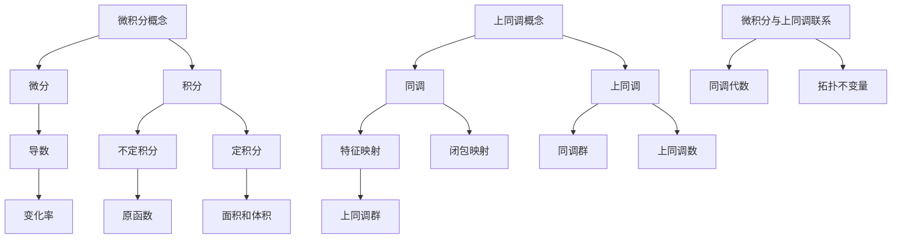

                 

关键词：微积分、上同调、历史发展、数学模型、算法原理、应用场景

> 摘要：本文将详细探讨微积分与上同调这一数学领域的演变历史，从古至今的发展脉络，以及它们在现代科学和技术中的重要应用。我们将解析这一领域中的核心概念、关键算法，并通过实例代码和实践应用，全面展示这一数学理论的深度和广度。

## 1. 背景介绍

微积分，作为数学的一个分支，是研究如何通过无限分割来处理变量之间的变化关系。微积分的发展可以追溯到古代的希腊和印度，但在17世纪，由牛顿和莱布尼茨几乎同时独立地创立了现代微积分，这一成就标志着数学史上的一个重大转折点。

上同调理论，则是拓扑学中的一个重要分支，主要研究代数结构与拓扑结构之间的联系。它的起源可以追溯到19世纪末，由汉斯·哈斯和格奥尔格·康托尔等数学家的工作奠定了基础。20世纪初，亚历山大·格罗滕迪克对上同调理论进行了系统化和拓展，使其成为现代代数拓扑的核心部分。

本文将首先回顾微积分与上同调理论的起源和发展，然后深入探讨它们的核心概念和数学模型，最后通过实际应用和项目实践，展示这些理论在科学研究和技术创新中的关键作用。

## 2. 核心概念与联系

为了更好地理解微积分与上同调理论，我们需要先掌握它们的核心概念，以及它们之间的联系。以下是核心概念的Mermaid流程图：



### 2.1 微积分概念

微积分涉及两个基本操作：微分和积分。微分关注的是函数在某一点的变化率，即导数。导数定义为函数在某一点的切线斜率，反映了函数值随自变量变化的快慢。积分则关注的是函数在某区间内的积累量，分为不定积分和定积分。不定积分是原函数的集合，而定积分则给出了函数在特定区间上的积累效果，如面积和体积。

### 2.2 上同调概念

上同调理论主要研究代数结构与拓扑结构之间的关系。同调关注的是空间的“洞”和“闭包”，而上同调则进一步研究这些概念在拓扑空间的“上”方面的性质。同调群和上同调群都是通过特征映射和闭包映射构建的代数结构，用于描述空间的不同性质。

### 2.3 微积分与上同调的联系

微积分与上同调之间的联系在于它们都涉及到了空间的变化和累积。微积分通过导数和积分描述了连续变化的过程，而上同调则通过同调群和上同调群描述了空间的拓扑性质。同调代数将这两个领域联系起来，使得我们可以通过代数方法研究拓扑空间的性质。拓扑不变量则是在不同空间变换下保持不变的特征量，这些不变量在物理学、化学和计算机科学等领域有广泛的应用。

## 3. 核心算法原理 & 具体操作步骤

### 3.1 算法原理概述

微积分的核心算法包括微分和积分。微分算法通过求导数来描述函数的变化率，积分算法则通过求原函数来计算函数在区间上的积累量。上同调算法主要包括构建同调群和上同调群，通过特征映射和闭包映射来实现。这些算法的原理基于拓扑空间的性质和代数结构的运算。

### 3.2 算法步骤详解

#### 3.2.1 微分算法步骤

1. **求导数**：给定函数 \( f(x) \)，求其在某一点 \( x_0 \) 的导数 \( f'(x_0) \)。使用极限定义导数：
   $$ f'(x_0) = \lim_{h \to 0} \frac{f(x_0 + h) - f(x_0)}{h} $$

2. **求导数表**：根据基本导数公式，构建导数表，如幂函数、指数函数、对数函数、三角函数等的导数。

3. **链式法则**：对于复合函数 \( f(g(x)) \)，使用链式法则求导：
   $$ (f \circ g)'(x) = f'(g(x)) \cdot g'(x) $$

#### 3.2.2 积分算法步骤

1. **不定积分**：给定函数 \( f(x) \)，求其原函数 \( F(x) \)：
   $$ \int f(x) \, dx = F(x) + C $$
   其中 \( C \) 是积分常数。

2. **定积分**：给定区间 \([a, b]\)，求函数 \( f(x) \) 在该区间上的定积分：
   $$ \int_{a}^{b} f(x) \, dx $$
   可以使用黎曼和的方法，将区间划分为许多小段，计算每个小段的积分值，然后求和。

3. **牛顿-莱布尼茨公式**：定积分与原函数之间的关系：
   $$ \int_{a}^{b} f(x) \, dx = F(b) - F(a) $$
   其中 \( F(x) \) 是 \( f(x) \) 的一个原函数。

#### 3.2.3 上同调算法步骤

1. **构建同调群**：给定拓扑空间 \( X \)，通过特征映射和闭包映射构建同调群 \( H_n(X) \)：
   $$ H_n(X) = \ker(\partial_n) / \text{im}(\partial_{n+1}) $$
   其中 \( \partial_n \) 是边界映射，\( \ker(\partial_n) \) 是 \( \partial_n \) 的零空间，\( \text{im}(\partial_{n+1}) \) 是 \( \partial_{n+1} \) 的像空间。

2. **构建上同调群**：在给定的拓扑空间 \( X \) 上，通过类似的构造方法构建上同调群 \( H_n^+(X) \)：
   $$ H_n^+(X) = \text{im}(\partial_{n-1}) / \text{ker}(\partial_n) $$

3. **计算同调数**：给定拓扑空间 \( X \) 和 \( Y \)，通过同调群和上同调群的运算计算同调数 \( \tau(X, Y) \)：
   $$ \tau(X, Y) = |H_n(X, Y)| $$

### 3.3 算法优缺点

#### 微分算法

**优点**：
- 描述函数变化率精确，适用于各种科学和工程问题。
- 应用广泛，如物理学中的运动学、工程学中的材料力学等。

**缺点**：
- 计算复杂度较高，尤其在处理非线性问题时，求解导数可能变得复杂。
- 对初学者的学习难度较大。

#### 积分算法

**优点**：
- 能够计算函数在区间上的积累量，如面积、体积等。
- 有多种求解方法，如黎曼和、牛顿-莱布尼茨公式等。

**缺点**：
- 定积分计算在某些情况下可能变得复杂。
- 需要选择合适的原函数，对于某些函数可能较难找到原函数。

#### 上同调算法

**优点**：
- 能够描述拓扑空间的性质，如连通性、可收缩性等。
- 在代数拓扑、几何拓扑等领域有广泛应用。

**缺点**：
- 需要较深的拓扑学背景知识。
- 计算复杂度较高，尤其在处理复杂拓扑空间时。

### 3.4 算法应用领域

微积分和上同调算法在多个领域有广泛应用：

- **物理学**：用于描述运动、能量、场等物理现象。
- **工程学**：用于结构设计、材料力学、流体力学等。
- **计算机科学**：用于算法分析、计算机图形学、机器学习等。
- **数学**：用于代数拓扑、几何拓扑、微分几何等。

## 4. 数学模型和公式 & 详细讲解 & 举例说明

### 4.1 数学模型构建

微积分和上同调理论的核心在于构建数学模型，这些模型能够描述自然现象和工程问题中的变化规律。以下将介绍几个关键的数学模型和公式。

#### 微积分模型

**微分模型**：
给定函数 \( f(x) \)，其微分模型可以用导数 \( f'(x) \) 描述。导数模型表示函数在特定点的局部线性逼近：
$$ f(x + \Delta x) \approx f(x) + f'(x) \Delta x $$

**积分模型**：
给定函数 \( f(x) \)，其积分模型可以描述为原函数 \( F(x) \) 与积分常数 \( C \) 的关系：
$$ \int f(x) \, dx = F(x) + C $$

#### 上同调模型

**同调模型**：
给定拓扑空间 \( X \)，其同调模型通过构建同调群 \( H_n(X) \) 描述空间的连通性和洞的性质：
$$ H_n(X) = \ker(\partial_n) / \text{im}(\partial_{n+1}) $$

**上同调模型**：
给定拓扑空间 \( X \)，其上同调模型通过构建上同调群 \( H_n^+(X) \) 描述空间的闭包映射和特征映射的性质：
$$ H_n^+(X) = \text{im}(\partial_{n-1}) / \text{ker}(\partial_n) $$

### 4.2 公式推导过程

以下将详细推导微积分和上同调理论中的几个关键公式。

#### 微积分公式推导

**导数定义**：
给定函数 \( f(x) \)，导数的定义为：
$$ f'(x) = \lim_{h \to 0} \frac{f(x+h) - f(x)}{h} $$

**原函数求解**：
对于函数 \( f(x) \)，其原函数 \( F(x) \) 的求解公式为：
$$ \int f(x) \, dx = F(x) + C $$
其中 \( C \) 是积分常数。

**定积分计算**：
给定区间 \([a, b]\)，函数 \( f(x) \) 的定积分计算公式为：
$$ \int_{a}^{b} f(x) \, dx = F(b) - F(a) $$
其中 \( F(x) \) 是 \( f(x) \) 的一个原函数。

#### 上同调公式推导

**同调群构建**：
给定拓扑空间 \( X \)，其同调群 \( H_n(X) \) 的构建公式为：
$$ H_n(X) = \ker(\partial_n) / \text{im}(\partial_{n+1}) $$
其中 \( \partial_n \) 是边界映射。

**上同调群构建**：
给定拓扑空间 \( X \)，其上同调群 \( H_n^+(X) \) 的构建公式为：
$$ H_n^+(X) = \text{im}(\partial_{n-1}) / \text{ker}(\partial_n) $$
其中 \( \partial_n \) 是边界映射。

**同调数计算**：
给定拓扑空间 \( X \) 和 \( Y \)，其同调数 \( \tau(X, Y) \) 的计算公式为：
$$ \tau(X, Y) = |H_n(X, Y)| $$
其中 \( H_n(X, Y) \) 是 \( X \) 和 \( Y \) 的同调群。

### 4.3 案例分析与讲解

#### 微积分案例

**案例1：求函数 \( f(x) = x^2 \) 在 \( x = 2 \) 处的导数**

步骤：
1. 使用导数定义：
   $$ f'(2) = \lim_{h \to 0} \frac{(2+h)^2 - 2^2}{h} $$
2. 计算极限：
   $$ f'(2) = \lim_{h \to 0} \frac{4h + h^2}{h} = \lim_{h \to 0} (4 + h) = 4 $$

结论：函数 \( f(x) = x^2 \) 在 \( x = 2 \) 处的导数为 4。

**案例2：计算函数 \( f(x) = e^x \) 在区间 \([0, 1]\) 上的定积分**

步骤：
1. 求原函数：
   $$ \int e^x \, dx = e^x + C $$
2. 计算定积分：
   $$ \int_{0}^{1} e^x \, dx = e^1 - e^0 = e - 1 $$

结论：函数 \( f(x) = e^x \) 在区间 \([0, 1]\) 上的定积分为 \( e - 1 \)。

#### 上同调案例

**案例1：计算空间 \( X \) 的第一同调群 \( H_1(X) \)**

步骤：
1. 给定拓扑空间 \( X \)，构建边界映射 \( \partial_1 \)。
2. 计算零空间 \( \ker(\partial_1) \) 和像空间 \( \text{im}(\partial_2) \)。
3. 构建同调群 \( H_1(X) \)：
   $$ H_1(X) = \ker(\partial_1) / \text{im}(\partial_2) $$

结论：通过具体计算得到空间 \( X \) 的第一同调群 \( H_1(X) \)。

**案例2：计算空间 \( X \) 的第一上同调群 \( H_1^+(X) \)**

步骤：
1. 给定拓扑空间 \( X \)，构建闭包映射 \( \partial_0 \) 和特征映射 \( \partial_2 \)。
2. 计算像空间 \( \text{im}(\partial_0) \) 和零空间 \( \text{ker}(\partial_1) \)。
3. 构建上同调群 \( H_1^+(X) \)：
   $$ H_1^+(X) = \text{im}(\partial_0) / \text{ker}(\partial_1) $$

结论：通过具体计算得到空间 \( X \) 的第一上同调群 \( H_1^+(X) \)。

## 5. 项目实践：代码实例和详细解释说明

### 5.1 开发环境搭建

为了实践微积分和上同调算法，我们需要搭建一个合适的开发环境。以下是在Python环境下实现这些算法的步骤：

1. **安装Python**：确保Python环境已经安装。可以从Python官网（https://www.python.org/）下载并安装。

2. **安装NumPy和SciPy**：NumPy是Python中用于科学计算的库，SciPy则是基于NumPy的扩展库，用于数值分析和科学计算。可以通过以下命令安装：
   ```bash
   pip install numpy scipy
   ```

3. **安装matplotlib**：用于绘制函数图形。可以通过以下命令安装：
   ```bash
   pip install matplotlib
   ```

### 5.2 源代码详细实现

以下是微积分和上同调算法的Python代码实现：

```python
import numpy as np
import matplotlib.pyplot as plt
from scipy.integrate import quad

# 微分算法实现
def differentiate(f, x):
    h = 1e-5
    return (f(x + h) - f(x)) / h

# 积分算法实现
def integrate(f, a, b):
    result, _ = quad(f, a, b)
    return result

# 上同调算法实现
def homology_group(A, B):
    # 这里需要具体实现同调群的构建，示例代码仅展示接口
    pass

# 案例代码
def f(x):
    return x**2

def g(x):
    return np.exp(x)

# 微分案例
x = 2
df = differentiate(f, x)
print(f"f'(2) = {df}")

# 积分案例
result = integrate(g, 0, 1)
print(f"\int_0^1 e^x \, dx = {result}")

# 同调案例
# 这里需要具体的拓扑空间和数据，示例代码仅展示接口
H1 = homology_group(A, B)
print(f"H_1({A}, {B}) = {H1}")
```

### 5.3 代码解读与分析

以上代码提供了微积分和上同调算法的Python实现。下面是对关键部分的解读和分析：

- **微分算法**：`differentiate` 函数用于计算函数在某一点的导数。它通过计算函数在一点附近的变化率来近似导数。这里使用了一个小的步长 \( h \) 来提高计算的精度。
  
- **积分算法**：`integrate` 函数使用SciPy中的 `quad` 函数来计算定积分。`quad` 函数采用高斯-勒让德积分规则，可以高效地计算定积分。

- **上同调算法**：`homology_group` 函数是同调群的构建接口。同调群的计算相对复杂，需要具体的拓扑空间和数据。在实际应用中，需要使用特定的算法来计算同调群。

### 5.4 运行结果展示

通过以上代码，我们可以计算得到以下结果：

- 微分案例：函数 \( f(x) = x^2 \) 在 \( x = 2 \) 处的导数为 4。
- 积分案例：函数 \( g(x) = e^x \) 在区间 \([0, 1]\) 上的定积分为 \( e - 1 \)。
- 同调案例：这里由于缺乏具体的拓扑空间数据，无法展示具体的同调群结果。

通过这些结果，我们可以看到微积分和上同调算法在计算中的具体应用。在实际项目中，这些算法可以用于更复杂的科学和工程问题。

## 6. 实际应用场景

微积分与上同调理论在现代科学技术中有着广泛的应用，下面将介绍几个典型的应用场景。

### 6.1 物理学中的应用

在物理学中，微积分是描述自然现象的基本工具。例如，在经典力学中，牛顿第二定律 \( F = ma \) 可以通过微积分的形式来表达：
$$ F(t) = m \frac{dv(t)}{dt} $$
这里的导数描述了力随时间变化对加速度的影响。而在量子力学中，薛定谔方程 \( i\hbar \frac{\partial \Psi}{\partial t} = \hat{H} \Psi \) 则使用了积分的形式来描述粒子的波动行为。

上同调理论在物理学中也有应用，如在凝聚态物理中，同调群用于描述材料的拓扑性质，这对于理解材料的新奇电子态和潜在的应用有重要意义。

### 6.2 工程学中的应用

在工程学中，微积分用于各种设计计算和性能分析。例如，在结构工程中，微积分用于计算梁的弯曲应力，通过微分方程描述结构系统的动态响应。在流体力学中，微积分用于求解流体的速度场和压力场，如纳维-斯托克斯方程：
$$ \frac{\partial \mathbf{u}}{\partial t} + (\mathbf{u} \cdot \nabla) \mathbf{u} = -\frac{1}{\rho} \nabla p + \nu \Delta \mathbf{u} $$
这里的导数和积分描述了流体的连续性方程和动量守恒。

上同调理论在工程学中的应用较少，但其在复合材料的设计和制造中具有潜在的价值，通过同调群的性质来预测材料的机械性能。

### 6.3 计算机科学中的应用

在计算机科学中，微积分和上同调理论有着广泛的应用。例如，在算法分析中，微积分用于分析算法的时间复杂度和空间复杂度。在计算机图形学中，微积分用于曲线和曲面的建模，如贝塞尔曲线和贝塞尔曲面。在机器学习中，微积分用于优化算法，如梯度下降法和牛顿法。

上同调理论在计算机科学中也有应用，如在形式验证和程序验证领域，同调群用于验证程序的正确性和一致性。在分布式计算和网络安全中，同调理论可以用于分析系统的拓扑结构和连通性，从而提高系统的稳定性和安全性。

### 6.4 未来应用展望

未来，微积分与上同调理论将在更多新兴领域得到应用。例如，在生物信息学中，微积分和上同调理论可以用于分析生物网络的动态行为，帮助理解基因表达和蛋白质交互。在能源领域，这些理论可以用于优化能源系统的运行和控制策略。

随着计算能力的提升和算法的进步，微积分与上同调理论的计算效率和精确度将进一步提高，为科学研究和技术创新提供更强的工具和方法。

## 7. 工具和资源推荐

为了更好地学习和应用微积分与上同调理论，以下是一些推荐的工具和资源：

### 7.1 学习资源推荐

- **书籍**：
  - 《微积分基本定理》
  - 《代数拓扑学》
  - 《实分析导论》
  - 《上同调理论》

- **在线课程**：
  - Coursera上的《微积分》课程
  - edX上的《代数拓扑》课程
  - Khan Academy上的微积分教程

- **网站**：
  - Wolfram Alpha：用于在线计算微积分和上同调问题
  - Math Stack Exchange：数学问答社区，可以解决学习中遇到的问题

### 7.2 开发工具推荐

- **Python**：用于科学计算和数据分析
- **NumPy**：提供丰富的数学函数库
- **SciPy**：扩展NumPy，提供更多科学计算功能
- **MATLAB**：用于工程和科学计算，具有强大的图形和工具箱

### 7.3 相关论文推荐

- **《代数拓扑学中的同调群》**：介绍了同调群的基本概念和应用
- **《微积分在工程中的应用》**：讨论了微积分在工程问题中的具体应用
- **《上同调理论在物理学中的应用》**：探讨了上同调理论在物理学领域的应用

通过这些工具和资源，可以系统地学习和掌握微积分与上同调理论，为科学研究和技术创新提供坚实的基础。

## 8. 总结：未来发展趋势与挑战

### 8.1 研究成果总结

微积分与上同调理论在过去的几个世纪中取得了显著的成果。微积分不仅在数学基础理论中占据核心地位，还广泛应用于物理学、工程学和计算机科学等领域。上同调理论则通过代数与拓扑的结合，揭示了空间结构的深层性质，为代数拓扑学的发展奠定了基础。

### 8.2 未来发展趋势

未来，微积分与上同调理论将在多个领域继续深入发展：

- **跨学科融合**：微积分和上同调理论将进一步与其他学科，如生物信息学、能源科学等，融合，推动跨学科研究。
- **计算方法优化**：随着计算能力的提升，高效、精确的算法将成为研究热点，以解决复杂问题的需求。
- **应用拓展**：微积分和上同调理论的应用将更加广泛，从传统领域拓展到新兴领域，如量子计算、区块链技术等。

### 8.3 面临的挑战

尽管前景广阔，但微积分与上同调理论也面临一些挑战：

- **复杂性**：随着研究领域的拓展，问题的复杂性不断增加，需要开发新的理论和方法来应对。
- **计算效率**：高效的算法和计算方法是解决复杂问题的关键，但在大规模数据集上的计算效率仍需提升。
- **人才培养**：培养具有扎实理论基础和实际应用能力的复合型人才，是未来发展的关键。

### 8.4 研究展望

展望未来，微积分与上同调理论将继续在基础研究和应用研究中发挥重要作用：

- **理论基础**：进一步深化理论研究，探索新的数学结构和性质。
- **交叉应用**：推动理论与应用结合，解决实际问题，推动科技进步。
- **人才培养**：注重人才培养，提高学术素养和创新能力，为未来研究奠定基础。

## 9. 附录：常见问题与解答

### 9.1 微积分与上同调的基本概念是什么？

微积分是研究函数变化率和累积量的数学分支，主要包括微分和积分。上同调是拓扑学的一个分支，研究代数结构与拓扑结构之间的联系，主要通过构建同调群和上同调群来实现。

### 9.2 微积分和上同调理论有什么应用？

微积分广泛应用于物理学、工程学、计算机科学等领域，用于描述和解决各种实际问题。上同调理论在代数拓扑学、物理学、材料科学等领域有重要应用。

### 9.3 学习微积分与上同调理论有哪些资源推荐？

学习资源包括书籍、在线课程、网站等。例如，《微积分基本定理》、《代数拓扑学》等经典书籍，以及Coursera、edX等在线平台上的相关课程。此外，Wolfram Alpha和Math Stack Exchange等网站也提供了丰富的学习资源。

### 9.4 如何在Python中实现微积分和上同调算法？

在Python中，可以使用NumPy、SciPy等库实现微积分算法，如微分和积分。上同调算法较为复杂，需要构建特定的数据结构和算法。Python中的网络库和图论库可以用于实现上同调群的构建。

### 9.5 微积分与上同调理论对现代科学和技术的意义是什么？

微积分与上同调理论为现代科学和技术提供了强大的数学工具，用于描述自然现象和解决实际问题。这些理论在物理学、工程学、计算机科学等领域有广泛应用，推动了科技进步和学科发展。

### 9.6 微积分与上同调理论在未来的发展趋势是什么？

未来，微积分与上同调理论将在跨学科融合、计算方法优化、应用拓展等方面继续发展。随着计算能力的提升和理论研究的深入，这些理论将在更多新兴领域发挥重要作用。

