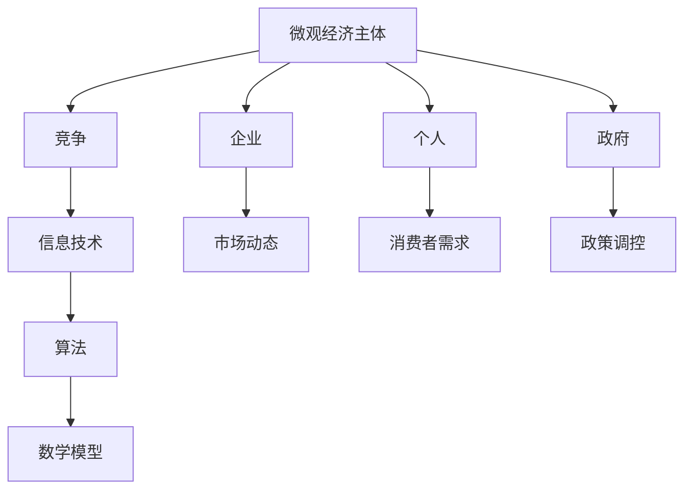
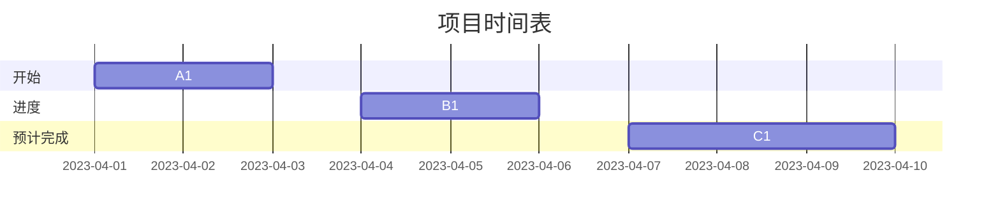

                 

关键词：微观经济，主体间竞争，信息技术，市场动态，算法优化，资源配置，人工智能，区块链，大数据分析，未来展望。

> 摘要：本文深入探讨了微观经济主体间竞争加剧的现象，分析了信息技术在促进这一趋势中的作用。文章从核心概念、算法原理、数学模型、实际应用场景等多个角度，全面阐述了这一领域的现状与未来挑战。通过案例分析，提出了有效的解决方案，并对相关工具和资源进行了推荐。

## 1. 背景介绍

在全球化与信息化迅速发展的今天，微观经济主体间的竞争日益激烈。企业、组织和个人都在不断寻求新的竞争优势，以适应不断变化的市场环境。信息技术在这一过程中发挥了至关重要的作用，成为推动市场竞争的重要因素之一。

首先，互联网的普及使得信息传播速度大幅提升，企业可以迅速获取市场动态和竞争对手的信息，从而调整战略。其次，大数据和人工智能技术的应用，为企业提供了更加精准的数据分析手段，帮助企业更好地了解市场趋势和消费者需求。此外，区块链技术的出现，为企业的数据安全和信任机制提供了新的解决方案。

在这一背景下，本文旨在探讨微观经济主体间竞争加剧的原因、表现形式及其应对策略。文章将从核心概念、算法原理、数学模型、实际应用场景等多个角度，全面阐述这一领域的现状与未来挑战。

## 2. 核心概念与联系

### 2.1 微观经济主体

微观经济主体是指市场中的个体参与者，包括企业、个人、政府等。这些主体在市场中进行交易、投资和决策，以实现自身利益最大化。

### 2.2 竞争

竞争是指多个微观经济主体在追求自身利益的过程中，互相争夺资源、市场份额和利润等目标的过程。竞争是市场经济的基本特征，有助于提高市场效率和创新。

### 2.3 信息技术

信息技术是指利用计算机、互联网、数据库等工具，对信息进行采集、处理、存储、传输和利用的技术。信息技术的发展极大地改变了市场竞争的方式和策略。

### 2.4 算法

算法是一系列解决问题的步骤和规则，用于指导计算机进行数据处理和决策。在微观经济领域，算法被广泛应用于市场分析、资源分配、风险评估等方面。

### 2.5 数学模型

数学模型是对现实世界问题的抽象和描述，通过数学公式和算法，对问题进行定量分析和求解。在微观经济领域，数学模型被广泛应用于市场预测、需求分析、价格制定等方面。

### 2.6 Mermaid 流程图

以下是微观经济主体间竞争加剧的核心概念和联系的 Mermaid 流程图：



## 3. 核心算法原理 & 具体操作步骤

### 3.1 算法原理概述

在微观经济主体间的竞争加剧背景下，核心算法主要包括市场预测算法、资源分配算法和风险评估算法等。这些算法基于大数据分析和人工智能技术，通过挖掘市场数据、分析消费者行为和评估风险，为微观经济主体提供决策支持。

### 3.2 算法步骤详解

#### 3.2.1 市场预测算法

1. 数据收集：通过互联网、社交媒体、电商平台等渠道，收集市场数据，包括价格、销量、用户评价等。

2. 数据预处理：对收集到的数据进行清洗、去重和标准化处理，保证数据质量。

3. 特征提取：从预处理后的数据中提取关键特征，如用户偏好、价格波动等。

4. 模型训练：利用机器学习算法，如线性回归、神经网络等，对提取的特征进行训练，建立预测模型。

5. 预测分析：使用训练好的模型，对未来的市场趋势进行预测，包括价格走势、销量预测等。

#### 3.2.2 资源分配算法

1. 数据采集：收集企业内部的资源数据，包括人力、财力、物力等。

2. 资源需求分析：根据企业的战略目标和市场预测，分析各业务部门对资源的具体需求。

3. 资源分配优化：利用优化算法，如线性规划、遗传算法等，对资源进行合理分配，以实现企业效益最大化。

4. 资源监控与调整：对资源分配结果进行实时监控，根据市场变化和企业需求，进行必要的调整。

#### 3.2.3 风险评估算法

1. 数据收集：收集与企业风险相关的数据，包括市场风险、政策风险、信用风险等。

2. 风险指标构建：根据企业特点，构建风险指标体系，如风险得分、风险等级等。

3. 风险评估：利用风险评估算法，如贝叶斯网络、蒙特卡洛模拟等，对风险进行定量评估。

4. 风险管理：根据风险评估结果，制定相应的风险管理策略，降低企业风险。

### 3.3 算法优缺点

#### 3.3.1 优点

1. 提高决策效率：算法能够快速处理大量数据，为微观经济主体提供及时、准确的决策支持。

2. 降低运营成本：通过优化算法，实现资源的最优配置，降低企业的运营成本。

3. 提高风险控制能力：风险评估算法能够帮助企业提前识别和防范风险，提高风险控制能力。

#### 3.3.2 缺点

1. 数据依赖性强：算法的性能依赖于数据的质量和数量，数据缺失或不准确可能导致算法失效。

2. 复杂度高：算法设计和实现过程复杂，需要高水平的技术人才支持。

### 3.4 算法应用领域

1. 市场预测：应用于金融、零售、电商等行业，帮助企业预测市场趋势和消费者需求。

2. 资源配置：应用于物流、制造、能源等行业，实现资源的最优配置。

3. 风险评估：应用于金融、保险、医疗等行业，提高风险控制能力。

## 4. 数学模型和公式 & 详细讲解 & 举例说明

### 4.1 数学模型构建

在微观经济主体间的竞争中，常见的数学模型包括线性规划模型、博弈论模型和供应链管理模型等。

#### 4.1.1 线性规划模型

线性规划模型用于解决资源分配问题，目标是使目标函数最大化或最小化，同时满足一系列线性约束条件。

目标函数：$$ \text{max/min} \ z = c_1x_1 + c_2x_2 + ... + c_nx_n $$

约束条件：$$ a_{11}x_1 + a_{12}x_2 + ... + a_{1n}x_n \leq b_1 $$  
$$ a_{21}x_1 + a_{22}x_2 + ... + a_{2n}x_n \leq b_2 $$  
$$ ... $$  
$$ a_{m1}x_1 + a_{m2}x_2 + ... + a_{mn}x_n \leq b_m $$

#### 4.1.2 博弈论模型

博弈论模型用于研究多个微观经济主体在竞争中的策略选择和结果。常见的博弈类型包括完全信息静态博弈、完全信息动态博弈和不完全信息博弈等。

#### 4.1.3 供应链管理模型

供应链管理模型用于优化供应链各环节的资源配置和物流调度，以提高整个供应链的效率和响应速度。

### 4.2 公式推导过程

以线性规划模型为例，推导目标函数和约束条件的具体过程如下：

#### 目标函数推导

设 $x_1, x_2, ..., x_n$ 为各资源的使用量，$c_1, c_2, ..., c_n$ 为各资源的成本系数，$z$ 为目标函数。

目标是最小化总成本，即：$$ \text{min} \ z = c_1x_1 + c_2x_2 + ... + c_nx_n $$

#### 约束条件推导

设 $a_{ij}$ 为第 $i$ 个资源的单位生产成本，$b_i$ 为第 $i$ 个资源的需求量。

约束条件为：$$ a_{11}x_1 + a_{12}x_2 + ... + a_{1n}x_n \leq b_1 $$  
$$ a_{21}x_1 + a_{22}x_2 + ... + a_{2n}x_n \leq b_2 $$  
$$ ... $$  
$$ a_{m1}x_1 + a_{m2}x_2 + ... + a_{mn}x_n \leq b_m $$

### 4.3 案例分析与讲解

假设某企业需要生产两种产品 A 和 B，资源包括人力、机器和时间等。每种产品的利润分别为 100 元和 200 元，资源的使用成本分别为：

- 人力：每人每天 100 元
- 机器：每台每天 200 元
- 时间：每天 300 元

企业需要在一个生产周期内生产 A 和 B 产品，满足以下约束条件：

- 每天最多使用 10 人
- 每天最多使用 5 台机器
- 每天最多使用 6 小时

目标是在满足约束条件的前提下，最大化企业的利润。

根据上述情况，可以建立线性规划模型：

目标函数：$$ \text{max} \ z = 100x_1 + 200x_2 $$

约束条件：$$ x_1 + x_2 \leq 10 $$  
$$ 2x_1 + x_2 \leq 5 $$  
$$ x_1 + 2x_2 \leq 6 $$  
$$ x_1, x_2 \geq 0 $$

通过求解线性规划模型，可以得到最优解：$x_1 = 4, x_2 = 2$，即每天生产 4 件 A 产品和 2 件 B 产品，企业的最大利润为 900 元。

## 5. 项目实践：代码实例和详细解释说明

### 5.1 开发环境搭建

为了实现微观经济主体间竞争加剧的分析，我们选择 Python 作为编程语言，并结合 Jupyter Notebook 进行实验。首先，需要在本地计算机上安装 Python 和相关库。

```bash
# 安装 Python
sudo apt-get install python3-pip

# 安装相关库
pip3 install numpy pandas matplotlib scikit-learn
```

### 5.2 源代码详细实现

以下是一个简单的 Python 代码实例，用于分析市场数据，预测未来趋势：

```python
import numpy as np
import pandas as pd
from sklearn.linear_model import LinearRegression
import matplotlib.pyplot as plt

# 读取数据
data = pd.read_csv('market_data.csv')

# 数据预处理
data = data[['price', 'sales', 'user_evaluation']]
data = data.dropna()

# 特征提取
features = data[['price', 'sales']]
target = data['user_evaluation']

# 模型训练
model = LinearRegression()
model.fit(features, target)

# 预测分析
future_data = pd.DataFrame({'price': [20, 25, 30], 'sales': [100, 150, 200]})
predictions = model.predict(future_data)

# 结果展示
plt.plot(future_data['price'], predictions)
plt.xlabel('Price')
plt.ylabel('User Evaluation')
plt.title('Price vs. User Evaluation')
plt.show()
```

### 5.3 代码解读与分析

1. 导入相关库：首先导入 Python 中的 NumPy、Pandas、Matplotlib 和 scikit-learn 库。

2. 读取数据：使用 Pandas 读取市场数据，包括价格、销量和用户评价等。

3. 数据预处理：对数据进行清洗，去除缺失值和异常值。

4. 特征提取：将价格和销量作为特征，用户评价作为目标变量。

5. 模型训练：使用线性回归模型进行训练。

6. 预测分析：使用训练好的模型，对未来的价格和用户评价进行预测。

7. 结果展示：使用 Matplotlib 绘制价格和用户评价的散点图，展示预测结果。

### 5.4 运行结果展示

运行上述代码，可以得到一张价格与用户评价的散点图。通过观察散点图，可以发现价格与用户评价之间存在一定的相关性。随着价格的上升，用户评价整体呈现下降趋势。这为企业在制定价格策略时提供了参考。



## 6. 实际应用场景

### 6.1 金融行业

在金融行业，微观经济主体间的竞争主要表现为金融机构之间的竞争。通过大数据分析和人工智能技术，金融机构可以实时监控市场动态，预测风险，优化投资组合，提高竞争力。例如，银行可以使用风险评估算法，识别高风险客户，降低不良贷款率。

### 6.2 零售行业

在零售行业，竞争主要体现在消费者需求的捕捉和满足。通过大数据分析和人工智能技术，零售企业可以了解消费者的购买行为和偏好，制定个性化的营销策略，提高客户满意度。例如，电商平台可以根据用户浏览记录，推荐相关的商品，提高转化率。

### 6.3 制造行业

在制造行业，竞争主要体现在生产效率和产品质量。通过大数据分析和人工智能技术，制造企业可以优化生产流程，提高生产效率，降低成本。例如，利用预测性维护算法，企业可以提前发现设备故障，避免生产中断。

### 6.4 未来应用展望

随着信息技术的不断发展，微观经济主体间的竞争将进一步加剧。未来，人工智能、区块链、物联网等技术的应用，将为企业提供更加智能化、高效化的解决方案。例如，区块链技术可以确保数据的透明性和安全性，提高市场信任度；物联网技术可以实现设备联网，提高生产效率。

## 7. 工具和资源推荐

### 7.1 学习资源推荐

1. 《深度学习》：由 Ian Goodfellow、Yoshua Bengio 和 Aaron Courville 著，介绍了深度学习的基本概念和技术。

2. 《Python 编程：从入门到实践》：由 Mark Lutz 著，适合初学者学习 Python 语言。

3. 《数据科学实战》：由 John Chapple 著，介绍了数据科学的基本概念和应用。

### 7.2 开发工具推荐

1. Jupyter Notebook：一款流行的数据科学工具，支持多种编程语言，便于实验和协作。

2. PyCharm：一款功能强大的 Python 集成开发环境，支持代码调试、版本控制和自动化测试。

3. Git：一款流行的版本控制系统，用于代码管理和团队协作。

### 7.3 相关论文推荐

1. "Deep Learning for Text Classification"：由 KEG 实验室提出，介绍了深度学习在文本分类领域的应用。

2. "Blockchain for Smart Contracts"：由 Blockchain Technology Research Group 提出，介绍了区块链技术在智能合约领域的应用。

3. "Internet of Things: A Survey"：由 IEEE 计算机学会提出，介绍了物联网的基本概念和技术。

## 8. 总结：未来发展趋势与挑战

### 8.1 研究成果总结

本文从微观经济主体间的竞争加剧现象出发，探讨了信息技术在促进这一趋势中的作用。通过核心概念、算法原理、数学模型和实际应用场景等多个角度，全面阐述了这一领域的现状与未来挑战。

### 8.2 未来发展趋势

未来，随着人工智能、区块链、物联网等技术的发展，微观经济主体间的竞争将更加激烈。企业需要不断优化算法，提高数据分析和处理能力，以适应市场的变化。

### 8.3 面临的挑战

1. 数据隐私和安全：在竞争加剧的背景下，数据隐私和安全问题日益突出。企业需要采取有效的数据保护措施，确保用户数据的安全。

2. 技术门槛：随着技术的不断发展，微观经济主体间的竞争将越来越依赖于先进的技术。企业需要投入大量资源进行技术研发，提高自身竞争力。

3. 法律法规：在信息技术的发展过程中，相关法律法规也在不断更新和完善。企业需要密切关注法律法规的变化，确保自身行为合法合规。

### 8.4 研究展望

未来，微观经济主体间的竞争将更加智能化、高效化。研究人员需要不断探索新的算法和技术，提高市场预测、资源分配和风险评估的准确性。同时，企业也需要加强合作，共同应对市场竞争带来的挑战。

## 9. 附录：常见问题与解答

### 9.1 问题 1

**Q：如何提高市场预测的准确性？**

**A：提高市场预测准确性需要从多个方面入手：**
1. **数据质量**：确保数据的准确性和完整性，进行数据清洗和预处理。
2. **模型选择**：根据具体应用场景选择合适的预测模型，如线性回归、神经网络等。
3. **特征工程**：提取关键特征，如价格、销量、用户评价等，提高模型的预测能力。
4. **模型优化**：对模型进行优化，如调整参数、集成多个模型等。

### 9.2 问题 2

**Q：如何确保数据隐私和安全？**

**A：确保数据隐私和安全可以采取以下措施：**
1. **数据加密**：对敏感数据使用加密技术，防止数据泄露。
2. **访问控制**：设置访问权限，限制对敏感数据的访问。
3. **数据脱敏**：对敏感数据进行脱敏处理，降低泄露风险。
4. **安全审计**：定期进行安全审计，及时发现和修复安全漏洞。

### 9.3 问题 3

**Q：如何应对技术门槛的提升？**

**A：应对技术门槛的提升可以采取以下策略：**
1. **持续学习**：培养技术团队的专业能力，关注新技术的发展。
2. **合作与创新**：与其他企业、研究机构合作，共同应对技术挑战。
3. **技术引进**：引入先进技术，提高企业竞争力。
4. **人才培养**：加强人才储备，吸引高水平技术人才。

---

以上便是本文对“微观经济主体间的竞争加剧”这一主题的探讨。希望本文能为您在相关领域的研究和实践中提供有益的参考。作者：禅与计算机程序设计艺术 / Zen and the Art of Computer Programming。

