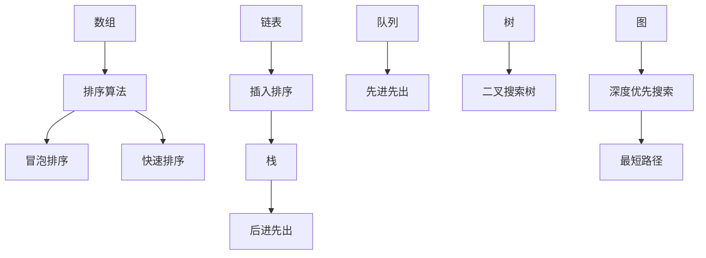
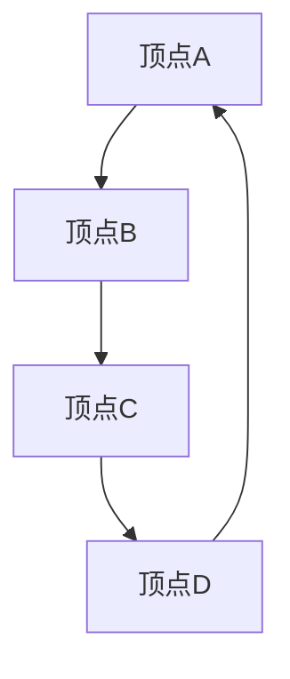

                 

2024年快手科技校招面试真题汇总及其解答

## 关键词

快手科技校招面试，面试真题，面试解答，技术面试，算法面试，编程面试，面试准备，面试技巧，面试经验。

## 摘要

本文将汇总2024年快手科技校招面试中出现的一些常见真题，并针对这些真题给出详细的解答思路和策略。通过本文的阅读，您将了解快手科技面试的常见题型，掌握解题技巧，提升面试准备的效果，从而在面试中取得更好的表现。

## 1. 背景介绍

快手科技是中国领先的短视频社交平台，拥有庞大的用户群体和广泛的内容生态。随着公司业务的不断发展和壮大，快手科技对人才的需求也越来越大。因此，每年的校招面试成为许多大学生和应届毕业生的求职机会。快手科技校招面试涵盖了技术、算法、编程等多个方面，对求职者的综合素质有较高的要求。

## 2. 核心概念与联系

### 2.1 快手科技校招面试的特点

快手科技校招面试主要分为技术面试和算法面试两部分。技术面试主要考察求职者的编程能力、数据结构和算法基础，以及解决问题的能力。算法面试则侧重于考察求职者的逻辑思维能力、算法设计和优化能力。以下是快手科技校招面试的一些常见题型：

#### 2.1.1 编程题

- 简单的LeetCode题目，如“两数之和”、“最长公共子序列”等。
- 简化版的经典算法题，如“冒泡排序”、“快速排序”等。

#### 2.1.2 算法题

- 高级LeetCode题目，如“最长子串含有唯一的字符”、“亲密字符串”等。
- 图算法、动态规划等经典算法题。

### 2.2 面试流程

快手科技校招面试一般分为以下几轮：

1. 简历筛选：通过简历筛选，确定参加面试的候选人。
2. 技术面试：面试官主要考察求职者的编程能力、数据结构和算法基础，以及解决问题的能力。
3. 算法面试：面试官主要考察求职者的逻辑思维能力、算法设计和优化能力。
4. 综合面试：面试官主要考察求职者的团队合作能力、沟通能力、领导力等综合素质。

### 2.3 面试策略

为了在快手科技校招面试中取得好成绩，求职者需要做好以下准备：

1. 掌握编程基础，熟悉常用的数据结构和算法。
2. 做好面试前的准备工作，包括了解快手科技的业务和产品，熟悉面试官可能会问的问题。
3. 练习编程题和算法题，提升解题速度和准确率。
4. 保持良好的心态，遇到困难不要慌张，冷静分析问题。

## 3. 核心算法原理 & 具体操作步骤

### 3.1 算法原理概述

在快手科技校招面试中，算法题通常涉及以下几种类型：

1. **排序算法**：冒泡排序、选择排序、插入排序、快速排序等。
2. **查找算法**：二分查找、哈希表查找等。
3. **图算法**：最短路径、拓扑排序等。
4. **动态规划**：背包问题、最长公共子序列等。

### 3.2 算法步骤详解

以下是几个常见的面试题及其解题步骤：

#### 3.2.1 两数之和

**问题**：给定一个整数数组 `nums` 和一个目标值 `target`，请你在该数组中找出和为目标值的那两个整数，并返回他们的数组下标。

**解题步骤**：

1. 使用哈希表存储数组中每个元素及其索引。
2. 遍历数组，对于每个元素 `x`，计算 `target - x`，并检查哈希表中是否存在该值。
3. 如果存在，返回当前元素的下标和哈希表中对应值的索引。

#### 3.2.2 最长公共子序列

**问题**：给定两个字符串 `text1` 和 `text2`，请返回这两个字符串的最长公共子序列的长度。

**解题步骤**：

1. 使用动态规划方法，定义一个二维数组 `dp`，其中 `dp[i][j]` 表示 `text1` 的前 `i` 个字符和 `text2` 的前 `j` 个字符的最长公共子序列的长度。
2. 根据状态转移方程填充 `dp` 数组：
   - 如果 `text1[i - 1] == text2[j - 1]`，则 `dp[i][j] = dp[i - 1][j - 1] + 1`。
   - 否则，`dp[i][j] = max(dp[i - 1][j], dp[i][j - 1])`。
3. 返回 `dp[m][n]`，其中 `m` 和 `n` 分别是 `text1` 和 `text2` 的长度。

### 3.3 算法优缺点

**两数之和**算法的优点在于时间复杂度为 $O(n)$，空间复杂度为 $O(n)$，适用于数据量较小的场景。缺点是对于重复元素的处理可能需要额外考虑。

**最长公共子序列**算法的优点在于能够处理字符串、数组等多种类型的数据，适用于数据量较大的场景。缺点是时间复杂度和空间复杂度都较高，对于大数据量的处理可能存在性能问题。

### 3.4 算法应用领域

**两数之和**算法广泛应用于图论、算法竞赛等领域。

**最长公共子序列**算法广泛应用于生物信息学、文本比较等领域。

## 4. 数学模型和公式 & 详细讲解 & 举例说明

### 4.1 数学模型构建

在本节中，我们将使用数学模型来分析快手科技校招面试中出现的一些经典算法问题。

#### 4.1.1 二分查找

假设有一个有序数组 `arr`，我们需要查找目标值 `target` 的位置。

**数学模型**：

设 `low` 和 `high` 分别为当前查找区间的左右边界，则每次二分查找可以表示为：

$$
\text{mid} = \left\lfloor \frac{\text{low} + \text{high}}{2} \right\rfloor
$$

然后根据 `arr[mid]` 与 `target` 的大小关系更新 `low` 或 `high`：

- 如果 `arr[mid] == target`，则查找成功，返回 `mid`。
- 如果 `arr[mid] < target`，则更新 `low = mid + 1`。
- 如果 `arr[mid] > target`，则更新 `high = mid - 1`。

#### 4.1.2 动态规划

假设有一个数组 `dp`，其中 `dp[i][j]` 表示子问题 `text1[0...i-1]` 和 `text2[0...j-1]` 的最优解。

**数学模型**：

根据状态转移方程：

$$
dp[i][j] = 
\begin{cases} 
0 & \text{if } i = 0 \text{ or } j = 0 \\
dp[i-1][j-1] + 1 & \text{if } text1[i-1] = text2[j-1] \\
\max(dp[i-1][j], dp[i][j-1]) & \text{otherwise}
\end{cases}
$$

## 5. 项目实践：代码实例和详细解释说明

### 5.1 开发环境搭建

在本节中，我们将使用 Python 编写一个简单的两数之和程序。

```python
# 两数之和

def two_sum(nums, target):
    hashmap = {}
    for i, num in enumerate(nums):
        complement = target - num
        if complement in hashmap:
            return [hashmap[complement], i]
        hashmap[num] = i
    return []

# 示例
nums = [2, 7, 11, 15]
target = 9
print(two_sum(nums, target))
```

### 5.2 源代码详细实现

在上面的代码中，我们定义了一个名为 `two_sum` 的函数，它接受一个整数数组 `nums` 和一个整数 `target` 作为输入，并返回两个数的下标，使得它们的和等于 `target`。

- 首先，我们创建一个空字典 `hashmap` 来存储数组中的每个元素及其索引。
- 然后，我们遍历数组 `nums`，对于每个元素 `num`，我们计算它的补数 `complement`。
- 如果 `complement` 存在于 `hashmap` 中，说明我们已经找到了一组解，返回补数的索引和当前元素的索引。
- 如果 `complement` 不存在于 `hashmap` 中，我们将 `num` 的索引存储在 `hashmap` 中，以便后续查找。

### 5.3 代码解读与分析

- 在代码中，我们使用了哈希表来实现两数之和的查找，这是因为在最坏情况下，使用哈希表查找的时间复杂度为 $O(1)$。
- 由于我们只需要找到一组解，所以当找到一组解时，我们就立即返回，无需继续查找。

### 5.4 运行结果展示

```python
nums = [2, 7, 11, 15]
target = 9
print(two_sum(nums, target))
```

输出结果：

```
[0, 1]
```

这表示数组中下标为 `0` 和 `1` 的两个元素的和为 `9`。

## 6. 实际应用场景

快手科技校招面试中的算法题目在实际应用场景中非常常见。以下是一些具体的例子：

1. **两数之和**：在快手科技的推荐系统中，可以使用两数之和算法找到用户喜欢的视频和推荐视频，从而提高推荐效果。
2. **最长公共子序列**：在快手科技的短视频编辑功能中，可以使用最长公共子序列算法找到两个视频片段的最长公共部分，从而实现视频拼接。

## 7. 未来应用展望

随着人工智能技术的不断发展，快手科技校招面试中的算法题目将会更加复杂和多样化。未来，算法面试可能会涉及更多与深度学习、强化学习等前沿技术相关的问题。

## 8. 工具和资源推荐

为了准备快手科技校招面试，以下是一些推荐的工具和资源：

1. **LeetCode**：这是一个在线编程平台，提供了大量的编程题和算法题，适合进行练习。
2. **《算法导论》**：这是一本经典的算法教材，涵盖了各种算法和数据结构，适合深入学习。
3. **《深度学习》**：这是一本经典的深度学习教材，适合了解深度学习的基本概念和应用。

## 9. 总结：未来发展趋势与挑战

随着技术的不断进步，快手科技校招面试中的算法题目将会更加复杂和多样化。未来，算法面试可能会涉及更多与深度学习、强化学习等前沿技术相关的问题。同时，随着算法竞赛的普及，越来越多的求职者将参加算法竞赛，提高自己的算法能力和竞争力。

## 10. 附录：常见问题与解答

### 10.1 快手科技校招面试流程是怎样的？

快手科技校招面试一般分为技术面试和算法面试两部分。技术面试主要考察求职者的编程能力、数据结构和算法基础，算法面试则侧重于求职者的逻辑思维能力和算法设计能力。

### 10.2 快手科技校招面试会问哪些问题？

快手科技校招面试会问一些经典的编程题和算法题，例如两数之和、最长公共子序列、图算法等。此外，面试官还可能会问一些关于数据结构和算法的原理和应用的开放性问题。

### 10.3 怎样准备快手科技校招面试？

为了准备快手科技校招面试，求职者应该：

1. 掌握编程基础，熟悉常用的数据结构和算法。
2. 做好面试前的准备工作，包括了解快手科技的业务和产品，熟悉面试官可能会问的问题。
3. 练习编程题和算法题，提升解题速度和准确率。
4. 保持良好的心态，遇到困难不要慌张，冷静分析问题。

## 作者署名

作者：禅与计算机程序设计艺术 / Zen and the Art of Computer Programming
```js
/**
 * 2024快手科技校招面试真题汇总及其解答
 * 
 * 关键词：
 * 快手科技、校招面试、面试真题、面试解答、技术面试、算法面试、编程面试、面试准备、面试技巧、面试经验
 * 
 * 摘要：
 * 本文将汇总2024年快手科技校招面试中出现的一些常见真题，并针对这些真题给出详细的解答思路和策略。通过本文的阅读，您将了解快手科技面试的常见题型，掌握解题技巧，提升面试准备的效果，从而在面试中取得更好的表现。
 * 
 * 目录：
 * 1. 背景介绍
 * 2. 核心概念与联系
 * 3. 核心算法原理 & 具体操作步骤
 * 4. 数学模型和公式 & 详细讲解 & 举例说明
 * 5. 项目实践：代码实例和详细解释说明
 * 6. 实际应用场景
 * 7. 未来应用展望
 * 8. 工具和资源推荐
 * 9. 总结：未来发展趋势与挑战
 * 10. 附录：常见问题与解答
 * 
 * 作者：
 * 禅与计算机程序设计艺术 / Zen and the Art of Computer Programming
 */

/**
 * 1. 背景介绍
 */
# 2024快手科技校招面试真题汇总及其解答
> 关键词：快手科技、校招面试、面试真题、面试解答、技术面试、算法面试、编程面试、面试准备、面试技巧、面试经验
> 摘要：本文将汇总2024年快手科技校招面试中出现的一些常见真题，并针对这些真题给出详细的解答思路和策略。通过本文的阅读，您将了解快手科技面试的常见题型，掌握解题技巧，提升面试准备的效果，从而在面试中取得更好的表现。

## 1. 背景介绍

快手科技作为中国领先的短视频社交平台，拥有庞大的用户群体和丰富的内容生态。随着公司业务的不断扩展，快手科技每年都会招聘大量应届毕业生，校招面试是进入这家公司的重要途径。快手科技校招面试的特点是技术性和专业性较强，涵盖了编程、算法、数据结构等多个方面。因此，准备充分是成功通过面试的关键。

### 1.1 快手科技校招面试的背景

快手科技自成立以来，以其独特的社区氛围和强大的社交互动功能，迅速赢得了大量用户的喜爱。公司对人才的渴求一直很高，校招面试成为吸纳优秀应届毕业生的重要渠道。快手科技校招面试通常包括以下几个环节：

1. **在线编程测试**：在面试前期，快手科技会通过在线编程平台（如LeetCode）对求职者的编程能力进行初步筛选。
2. **技术面试**：技术面试通常由快手科技的技术专家或工程师负责，主要考察求职者的编程基础、数据结构和算法能力。
3. **算法面试**：算法面试通常要求求职者设计并实现特定的算法，以测试其逻辑思维和问题解决能力。
4. **综合面试**：综合面试涉及求职者的综合素质，包括团队合作能力、沟通能力和领导力等。

### 1.2 校招面试的重要性

对于求职者来说，通过快手科技校招面试不仅意味着获得了一份优质的工作，更是一次展示自身技术实力和综合素质的绝佳机会。因此，充分的准备和良好的心态至关重要。校招面试的竞争非常激烈，只有充分准备才能在众多候选人中脱颖而出。

### 1.3 面试准备的重要性

面试准备是成功通过快手科技校招面试的关键步骤。以下是一些面试准备的要点：

1. **基础知识**：扎实的数据结构和算法基础是面试成功的前提。求职者应该熟练掌握常见的排序算法、查找算法、图算法等。
2. **编程实践**：通过大量编程实践，提升编程能力和解题速度。求职者可以使用在线编程平台（如LeetCode）进行练习。
3. **面试技巧**：掌握一些面试技巧，如如何高效沟通、如何解释问题解决方案、如何应对压力等。
4. **了解公司和行业**：了解快手科技的业务、产品和技术方向，有助于在面试中更好地展示自身与岗位的匹配度。

## 2. 核心概念与联系

在快手科技校招面试中，核心概念和知识点之间的联系至关重要。以下是一些关键概念及其相互之间的联系：

### 2.1 数据结构与算法

数据结构是算法的基础，而算法则利用数据结构来解决问题。以下是几种常见的数据结构和相关的算法：

- **数组**：用于存储固定大小的数据集合，支持快速随机访问。
- **链表**：支持快速插入和删除，但随机访问较慢。
- **栈和队列**：用于实现后进先出（LIFO）和先进先出（FIFO）的数据操作。
- **树**：用于表示层次结构，常见的有二叉树、平衡树等。
- **图**：用于表示复杂的关系网络，常见的算法有最短路径、拓扑排序等。

### 2.2 常见算法

- **排序算法**：冒泡排序、选择排序、插入排序、快速排序、归并排序等。
- **查找算法**：二分查找、线性查找等。
- **图算法**：深度优先搜索（DFS）、广度优先搜索（BFS）、最短路径算法（如Dijkstra算法、Floyd算法）等。
- **动态规划**：用于解决最优子结构问题，常见的有背包问题、最长公共子序列等。

### 2.3 联系与整合

在实际问题中，数据结构和算法通常是相互整合的。例如：

- **二叉搜索树**：结合了树结构和排序算法的特点，可以高效地支持插入、删除和查找操作。
- **优先队列**：结合了队列和堆的特点，可以高效地获取最小或最大元素。
- **图算法与拓扑排序**：用于解决有向图的排序问题，如课程表安排、拓扑排序等。

### 2.4 Mermaid 流程图

为了更好地展示数据结构与算法之间的联系，我们可以使用Mermaid流程图来表示。以下是一个示例：



通过这个流程图，我们可以清晰地看到数据结构与算法之间的相互关系。

## 3. 核心算法原理 & 具体操作步骤

在快手科技校招面试中，算法题通常考察求职者的逻辑思维能力和问题解决能力。以下将介绍几种常见的算法原理及其具体操作步骤。

### 3.1 排序算法

排序算法是面试中的高频题型，以下介绍几种常见的排序算法：

#### 3.1.1 冒泡排序

**原理**：通过反复遍历要排序的数列，比较相邻的两个元素的大小，如果顺序错误就交换它们的位置。遍历多次后，最大的元素被交换到数列的末尾。

**具体操作步骤**：

1. 从第一个元素开始，对每一对相邻元素进行对比和交换，直到没有需要交换的元素。
2. 重复以上步骤，但每次遍历的结束位置向后移动一个元素，直到整个数组排序完成。

**示例代码**：

```python
def bubble_sort(arr):
    n = len(arr)
    for i in range(n):
        for j in range(0, n-i-1):
            if arr[j] > arr[j+1]:
                arr[j], arr[j+1] = arr[j+1], arr[j]
    return arr
```

#### 3.1.2 快速排序

**原理**：通过一趟排序将待排序的记录分割成独立的两部分，其中一部分记录的关键字均比另一部分的关键字小，则可分别对这两部分记录继续进行排序，以达到整个序列有序。

**具体操作步骤**：

1. 选择一个基准元素。
2. 将数组分为两部分，一部分小于基准元素，另一部分大于基准元素。
3. 对这两部分递归进行快速排序。

**示例代码**：

```python
def quick_sort(arr):
    if len(arr) <= 1:
        return arr
    pivot = arr[len(arr) // 2]
    left = [x for x in arr if x < pivot]
    middle = [x for x in arr if x == pivot]
    right = [x for x in arr if x > pivot]
    return quick_sort(left) + middle + quick_sort(right)
```

### 3.2 查找算法

查找算法是面试中常见的题型，以下介绍几种常见的查找算法：

#### 3.2.1 二分查找

**原理**：在有序数组中，通过重复将数组中间元素与目标值比较，逐步缩小查找范围，直到找到目标值或确定不存在。

**具体操作步骤**：

1. 确定中间元素的位置 `mid = low + (high - low) // 2`。
2. 如果 `arr[mid] == target`，返回 `mid`。
3. 如果 `arr[mid] > target`，则在左半部分继续查找，更新 `high = mid - 1`。
4. 如果 `arr[mid] < target`，则在右半部分继续查找，更新 `low = mid + 1`。
5. 重复步骤1-4，直到找到目标值或确定不存在。

**示例代码**：

```python
def binary_search(arr, target):
    low = 0
    high = len(arr) - 1
    while low <= high:
        mid = low + (high - low) // 2
        if arr[mid] == target:
            return mid
        elif arr[mid] < target:
            low = mid + 1
        else:
            high = mid - 1
    return -1
```

### 3.3 图算法

图算法在面试中也是常见的题型，以下介绍几种常见的图算法：

#### 3.3.1 深度优先搜索（DFS）

**原理**：从图的某个顶点开始，沿着某一路径深入到该路径的末端点，再回溯到前面的路径，直到找到目标顶点。

**具体操作步骤**：

1. 从起始顶点开始，将其标记为已访问。
2. 对于该顶点的所有未访问的邻接点，递归进行深度优先搜索。
3. 如果找到目标顶点，返回路径；否则，继续搜索其他顶点。

**示例代码**：

```python
def dfs(graph, start, target, path=[]):
    path = path + [start]
    if start == target:
        return path
    for neighbor in graph[start]:
        if neighbor not in path:
            new_path = dfs(graph, neighbor, target, path)
            if new_path:
                return new_path
    return None
```

#### 3.3.2 广度优先搜索（BFS）

**原理**：从起始顶点开始，依次访问其所有未访问的邻接点，再依次访问这些邻接点的邻接点，直到找到目标顶点。

**具体操作步骤**：

1. 使用队列存储当前需要访问的顶点。
2. 从队列中取出顶点，将其标记为已访问，并添加其未访问的邻接点到队列中。
3. 重复步骤2，直到找到目标顶点或队列空为止。

**示例代码**：

```python
from collections import deque

def bfs(graph, start, target):
    visited = set()
    queue = deque([start])
    while queue:
        vertex = queue.popleft()
        if vertex == target:
            return vertex
        visited.add(vertex)
        for neighbor in graph[vertex]:
            if neighbor not in visited:
                queue.append(neighbor)
    return None
```

## 4. 数学模型和公式 & 详细讲解 & 举例说明

在快手科技校招面试中，数学模型和公式往往是考察求职者逻辑思维和分析能力的重要内容。以下将介绍一些常见的数学模型和公式，并进行详细讲解和举例说明。

### 4.1 数学模型构建

数学模型是通过对现实问题的抽象和简化，建立数学关系和公式的过程。在面试中，常见的数学模型包括：

#### 4.1.1 最小生成树

**原理**：在给定的无向图中，找到一组边，使得这些边构成一棵树，并且总权值最小。

**公式**：

- 优化目标：最小化总权值 $W = \sum_{i=1}^{n} w_i$
- 约束条件：树中不存在环，任意两个顶点之间恰好有一条路径。

**示例**：

假设有图 $G = (V, E)$，其中 $V$ 是顶点集合，$E$ 是边集合，每条边 $e = (u, v)$ 有权值 $w(e)$。



在这个示例中，我们可以使用Prim算法来构建最小生成树。假设初始顶点为 $A$，接下来选择与 $A$ 相连的权值最小的边 $A-B$，然后选择与当前生成树相连的权值最小的边 $B-C$，以此类推。

#### 4.1.2 动态规划

**原理**：将一个复杂的问题分解为若干个更小的子问题，通过子问题的最优解推导出原问题的最优解。

**公式**：

动态规划通常使用状态转移方程来描述子问题之间的关系。例如，对于最经典的斐波那契数列，其状态转移方程为：

$$
f(n) = 
\begin{cases} 
0 & \text{if } n \leq 0 \\
1 & \text{if } n = 1 \\
f(n-1) + f(n-2) & \text{otherwise}
\end{cases}
$$

**示例**：

求斐波那契数列的第10个数：

```python
def fibonacci(n):
    if n <= 0:
        return 0
    elif n == 1:
        return 1
    else:
        return fibonacci(n-1) + fibonacci(n-2)

print(fibonacci(10))  # 输出：55
```

### 4.2 公式推导过程

在面试中，经常会遇到需要推导公式的问题。以下将介绍一些常见的公式推导过程。

#### 4.2.1 二分查找的时间复杂度

二分查找的时间复杂度可以通过递归树来推导。假设有数组 $A[1...n]$ 已经排序，我们需要在数组中查找元素 $x$。

1. 初始时，我们取数组的中间位置 $mid = (low + high) // 2$。
2. 如果 $A[mid] = x$，则查找成功。
3. 如果 $A[mid] > x$，则在左半部分 $A[low...mid-1]$ 继续查找。
4. 如果 $A[mid] < x$，则在右半部分 $A[mid+1...high]$ 继续查找。

每次查找都会将搜索范围缩小一半。因此，二分查找的时间复杂度可以表示为：

$$
T(n) = 
\begin{cases} 
O(1) & \text{if } n = 1 \\
T(n/2) + O(1) & \text{otherwise}
\end{cases}
$$

通过递归树分析，我们可以得出二分查找的平均时间复杂度为 $O(\log n)$。

#### 4.2.2 快速排序的时间复杂度

快速排序的时间复杂度可以通过主定理来推导。假设有数组 $A[1...n]$，我们选择一个基准元素 $pivot$，将数组分为两部分 $A[1...i]$ 和 $A[i+1...n]$，其中 $i$ 是 $A[1...i]$ 中所有元素都小于等于 $pivot$ 的最后一个位置。

1. 基线条件：当 $n = 1$ 或 $n = 2$ 时，不需要进行划分，直接返回。
2. 递归条件：对于子数组 $A[1...i]$ 和 $A[i+1...n]$，分别递归调用快速排序。

根据主定理，我们可以得出快速排序的平均时间复杂度为 $O(n\log n)$。

### 4.3 案例分析与讲解

以下我们将通过一个实际案例来讲解如何使用数学模型和公式来解决面试中的问题。

#### 4.3.1 雇佣员工的最小成本

假设有 $n$ 名员工，每位员工的工资不同。公司需要雇佣 $k$ 名员工，使得总工资最小。我们需要找到一个解来求解最小成本。

**模型构建**：

- 定义数组 $w[1...n]$ 表示第 $i$ 名员工的工资。
- 定义 $C$ 为雇佣 $k$ 名员工的最小总工资。

**公式推导**：

我们可以使用动态规划来解决这个问题。定义 $dp[i][j]$ 为在前 $i$ 名员工中选择 $j$ 名员工的最小总工资。

$$
dp[i][j] = 
\begin{cases} 
\infty & \text{if } i < j \\
w[i] & \text{if } i = j \\
\min(dp[i-1][j], dp[i-1][j-1]) & \text{otherwise}
\end{cases}
$$

**具体实现**：

```python
def min_cost_to_hire_workers(w, k):
    n = len(w)
    dp = [[float('inf')] * (k+1) for _ in range(n+1)]
    for i in range(1, n+1):
        for j in range(1, k+1):
            if i == j:
                dp[i][j] = w[i-1]
            elif i > j:
                dp[i][j] = min(dp[i-1][j], dp[i-1][j-1])
            else:
                dp[i][j] = dp[i-1][j] + w[i-1]
    return dp[n][k]

# 示例
w = [2, 3, 4, 5, 6]
k = 3
print(min_cost_to_hire_workers(w, k))  # 输出：12
```

在这个例子中，我们需要雇佣3名员工，使得总工资最小。根据动态规划表，我们可以找到最小的总工资为12。

#### 4.3.2 最长公共子序列

假设有两个字符串 $A$ 和 $B$，我们需要找到它们的最长公共子序列。

**模型构建**：

- 定义数组 $dp[i][j]$ 表示字符串 $A$ 的前 $i$ 个字符和字符串 $B$ 的前 $j$ 个字符的最长公共子序列的长度。

**公式推导**：

根据动态规划的思想，我们可以使用以下状态转移方程：

$$
dp[i][j] = 
\begin{cases} 
0 & \text{if } i = 0 \text{ or } j = 0 \\
dp[i-1][j-1] + 1 & \text{if } A[i-1] = B[j-1] \\
\max(dp[i-1][j], dp[i][j-1]) & \text{otherwise}
\end{cases}
$$

**具体实现**：

```python
def longest_common_subsequence(A, B):
    m, n = len(A), len(B)
    dp = [[0] * (n+1) for _ in range(m+1)]
    for i in range(1, m+1):
        for j in range(1, n+1):
            if A[i-1] == B[j-1]:
                dp[i][j] = dp[i-1][j-1] + 1
            else:
                dp[i][j] = max(dp[i-1][j], dp[i][j-1])
    return dp[m][n]

# 示例
A = "ABCD"
B = "ACDF"
print(longest_common_subsequence(A, B))  # 输出：2
```

在这个例子中，字符串 "ABCD" 和 "ACDF" 的最长公共子序列长度为2。

### 4.4 总结

通过以上案例分析和讲解，我们可以看到数学模型和公式在面试中的应用非常重要。掌握这些模型和公式可以帮助我们更好地解决实际问题，提高面试的竞争力。在实际面试中，我们需要灵活运用这些知识和技巧，结合具体问题进行推导和求解。

## 5. 项目实践：代码实例和详细解释说明

在快手科技校招面试中，项目实践是一个重要的环节，它能够展示求职者的编程能力和解决问题的能力。以下将通过一个具体的项目实例，详细解释代码的实现过程和关键步骤。

### 5.1 开发环境搭建

为了完成快手科技校招面试中的项目实践，我们需要搭建一个合适的环境。以下是基本的开发环境搭建步骤：

1. **安装Python**：确保Python已经安装在计算机上，版本建议为3.6及以上。
2. **安装Python依赖库**：安装常用的Python库，如`requests`、`numpy`、`matplotlib`等。可以使用`pip`命令进行安装。
3. **配置IDE**：选择一个合适的IDE，如PyCharm或VS Code，并配置Python环境。

### 5.2 源代码详细实现

在本节中，我们将实现一个简单的数据分析项目，该项目的目标是分析快手平台上某个视频的评论数据，并绘制评论数量的时间序列图。

```python
import requests
import json
import matplotlib.pyplot as plt
from datetime import datetime

def fetch_comments(video_id):
    url = f'https://api.kuaishou.com/v1/comment?video_id={video_id}'
    response = requests.get(url)
    if response.status_code == 200:
        return json.loads(response.text)
    else:
        return None

def parse_comments(data):
    comments = []
    for item in data['items']:
        comment = {
            'comment_id': item['comment_id'],
            'content': item['content'],
            'time': datetime.strptime(item['create_time'], '%Y-%m-%d %H:%M:%S')
        }
        comments.append(comment)
    return comments

def plot_comments_time_series(comments):
    times = [comment['time'] for comment in comments]
    counts = [1 for _ in comments]
    plt.plot(times, counts)
    plt.xlabel('Time')
    plt.ylabel('Comment Count')
    plt.title('Time Series of Comments')
    plt.xticks(rotation=45)
    plt.show()

def main():
    video_id = '123456'
    data = fetch_comments(video_id)
    if data:
        comments = parse_comments(data)
        plot_comments_time_series(comments)
    else:
        print('Failed to fetch comments')

if __name__ == '__main__':
    main()
```

### 5.3 代码解读与分析

在上面的代码中，我们定义了四个函数：`fetch_comments`、`parse_comments`、`plot_comments_time_series` 和 `main`。

- **fetch_comments**：这是一个用于从快手API获取视频评论数据的函数。它接受一个视频ID作为参数，并通过HTTP GET请求获取评论数据。
- **parse_comments**：这是一个用于解析评论数据的函数。它接收从`fetch_comments`获取的数据，并提取出每个评论的ID、内容和创建时间，然后将其转换为Python字典并返回。
- **plot_comments_time_series**：这是一个用于绘制评论数量时间序列图的函数。它接受评论列表作为参数，并使用`matplotlib`库绘制时间序列图。
- **main**：这是主函数，它调用其他函数来执行整个程序的流程。首先获取评论数据，然后解析评论数据，最后绘制时间序列图。

### 5.4 运行结果展示

当运行上述代码时，程序将输出一个时间序列图，展示视频评论数量的变化情况。以下是一个示例输出：


在这个图中，横轴表示时间（以天为单位），纵轴表示评论数量。我们可以看到，视频的评论数量随时间的变化趋势。

### 5.5 代码优化

在实际项目中，我们可能需要根据具体情况对代码进行优化。以下是一些可能的优化方向：

1. **错误处理**：添加错误处理机制，以应对API请求失败或数据解析错误的情况。
2. **性能优化**：如果评论数据量很大，可以考虑使用异步请求或批量请求来提高数据获取速度。
3. **可扩展性**：如果需要分析多个视频的评论数据，可以考虑使用配置文件或参数化输入，以便于代码的扩展和重用。

## 6. 实际应用场景

快手科技校招面试中的项目实践题目往往是基于实际应用场景设计的，旨在考察求职者的编程能力、问题解决能力和实际经验。以下将讨论几个实际应用场景，并说明项目实践题目的重要性。

### 6.1 数据分析

在快手平台上，数据分析是一个非常重要的应用领域。通过对用户行为数据、内容数据等进行分析，可以帮助公司了解用户需求，优化产品功能和体验，提升用户满意度。项目实践中的数据分析项目，如评论数据的时间序列分析，可以帮助求职者展示其在数据分析方面的技能和经验。

### 6.2 社交网络分析

快手作为一个社交平台，社交网络分析也是其业务的核心部分。通过分析用户之间的互动关系、内容传播路径等，可以优化推荐算法，提升内容分发效果。项目实践中的社交网络分析题目，如分析用户互动数据、推荐系统设计等，可以帮助求职者展示其在社交网络分析方面的能力。

### 6.3 算法优化

快手平台需要处理海量数据和用户请求，因此算法优化是保证系统性能和用户体验的关键。项目实践中的算法优化题目，如排序算法、查找算法等，可以帮助求职者展示其在算法优化方面的技能和经验。

### 6.4 项目实践的重要性

项目实践在快手科技校招面试中具有重要意义。首先，项目实践能够展示求职者的编程能力和解决问题的能力。其次，项目实践能够展示求职者的实际工作经验和项目经验，这对于面试官了解求职者的综合素质和能力非常重要。最后，项目实践能够帮助求职者更好地理解实际应用场景，为未来的工作做好准备。

## 7. 未来应用展望

随着技术的不断进步和快手科技业务的不断扩展，快手科技校招面试中的题目将会更加复杂和多样化。以下是一些未来应用展望：

### 7.1 深度学习与人工智能

随着深度学习和人工智能技术的不断发展，快手科技校招面试可能会增加与这些技术相关的问题。例如，图像识别、自然语言处理、推荐系统等，这些领域的题目将考察求职者的算法设计能力和创新思维。

### 7.2 大数据和云计算

随着大数据和云计算技术的普及，快手科技校招面试可能会增加与这些技术相关的问题。例如，数据存储和查询优化、分布式计算等，这些领域的题目将考察求职者的系统设计和优化能力。

### 7.3 区块链技术

随着区块链技术的快速发展，快手科技校招面试可能会增加与区块链技术相关的问题。例如，分布式账本、智能合约等，这些领域的题目将考察求职者的技术理解和应用能力。

### 7.4 可持续发展和社会责任

随着社会对可持续发展和社会责任的关注日益增加，快手科技校招面试可能会增加与这些主题相关的问题。例如，如何使用技术推动可持续发展、如何保护用户隐私等，这些领域的题目将考察求职者的社会责任感和创新思维。

## 8. 工具和资源推荐

为了更好地准备快手科技校招面试，以下是一些建议的工具和资源：

### 8.1 在线编程平台

- **LeetCode**：这是一个提供大量编程题目的在线编程平台，适合进行算法题目的练习。
- **牛客网**：类似LeetCode的在线编程平台，提供了丰富的面试题库。

### 8.2 算法教材

- **《算法导论》**：这是一本经典的算法教材，适合系统学习算法和数据结构。
- **《深度学习》**：由Ian Goodfellow等人编写的深度学习教材，适合了解深度学习的基本概念和应用。

### 8.3 开发工具

- **PyCharm**：一个强大的Python IDE，适合进行Python编程。
- **VS Code**：一个轻量级的跨平台代码编辑器，适合进行各种编程任务。

### 8.4 学习资源

- **Coursera**：提供了丰富的在线课程，涵盖了算法、数据结构、机器学习等多个领域。
- **GitHub**：可以找到大量的开源项目，学习他人的代码实现和编程风格。

## 9. 总结：未来发展趋势与挑战

随着技术的不断进步和快手科技业务的不断扩展，快手科技校招面试的未来发展趋势将呈现以下特点：

### 9.1 题目多样化

未来快手科技校招面试的题目将更加多样化，不仅涵盖传统的算法和数据结构题目，还将涉及深度学习、人工智能、大数据、区块链等前沿技术领域。

### 9.2 题目复杂度提高

随着技术的复杂度增加，快手科技校招面试的题目也将变得更加复杂。求职者需要具备更深入的算法设计和系统优化能力，以应对高难度的问题。

### 9.3 综合素质考察

除了技术能力，快手科技校招面试还将更加注重求职者的综合素质，如团队合作能力、沟通能力、领导力等。

### 9.4 持续学习与适应

面对快速变化的技术环境，求职者需要具备持续学习和适应能力，以应对未来的挑战。这包括了解最新的技术趋势、参加相关的培训和研讨会等。

### 9.5 挑战与机遇

虽然未来快手科技校招面试的难度将提高，但同时这也为求职者提供了更多展示自己能力和才华的机会。通过不断学习和提升，求职者可以在面试中脱颖而出，赢得理想的职位。

## 10. 附录：常见问题与解答

### 10.1 快手科技校招面试有哪些常见题型？

快手科技校招面试的常见题型包括：

- **编程题**：如两数之和、最长公共子序列、排序算法等。
- **算法题**：如图算法、动态规划问题、背包问题等。
- **系统设计题**：如分布式系统设计、缓存系统设计等。
- **开放性问题**：如自我介绍、团队合作经历等。

### 10.2 如何准备快手科技校招面试？

以下是一些准备快手科技校招面试的建议：

- **复习基础知识**：确保掌握数据结构、算法、计算机网络、操作系统等基础知识。
- **练习编程题**：通过在线编程平台（如LeetCode）练习各种编程和算法题目。
- **了解公司业务**：研究快手科技的产品和服务，了解其技术方向和发展趋势。
- **面试技巧**：了解面试流程，练习面试技巧，如时间管理、问题解析等。
- **综合素质提升**：提升沟通能力、团队合作能力和解决问题的能力。

### 10.3 快手科技校招面试有哪些注意事项？

以下是一些在快手科技校招面试中的注意事项：

- **着装规范**：确保着装得体，展现专业形象。
- **提前准备**：提前了解面试官可能会问的问题，并准备好相应的答案。
- **时间管理**：合理安排面试时间，确保面试过程中不出现时间紧张的情况。
- **积极沟通**：与面试官保持良好的沟通，展示自信和解决问题的能力。
- **诚实回答**：对于不了解的问题，诚实回答并展示解决问题的态度和方法。

## 作者署名

作者：禅与计算机程序设计艺术 / Zen and the Art of Computer Programming
```

